# Timeout in ms for connecting to zookeeper
zookeeper.connection.timeout.ms=12000
############################# Group Coordinator Settings #############################
group.initial.rebalance.delay.ms=0
############################# message Settings #############################
message.max.byte=5242880
```

其中以下两项需要视具体环境修改，*advertise.listeners* 是对外监听端口。

```
advertised.listeners=PLAINTEXT://192.168.189.130:9092
zookeeper.connect=192.168.189.130:2181
```

**第三步：准备 Kafka 的启动文件**

创建 Kafka 启动的环境变量文件, 这里配置了开启 JMX 监控端口，如果不需要，可以忽略后两项配置。

JMX 端口的作用是可以通过此端口连接，获取一些监控指标。

```
cd /KFDATA/kafka/etc
touch kf-server.env

echo PATH="/usr/local/java/java17/bin:/opt/zookeeper/bin:/opt/kafka:/usr/local/bin:/bin:/usr/bin:/usr/local/sbin:/usr/sbin" >>kf-server.env
echo LOG_DIR="/KFDATA/kafka/logs/" >>kf-server.env
echo KAFKA_LOG4J_OPTS=\"-Dlog4j.configuration=file:/KFDATA/kafka/etc/log4j.properties\" >>kf-server.env
echo KAFKA_JMX_OPTS=\"-Dcom.sun.management.jmxremote=true -Dcom.sun.management.jmxremote.authenticate=false -Dcom.sun.management.jmxremote.ssl=false -Djava.rmi.server.hostname=192.168.189.130 -Djava.net.preferIPv4Stack=true\" >>kf-server.env
echo JMX_PORT=29999 >>kf-server.env
```

创建 Kafka 的 systemd service 文件，通过 `vim` 命令打开一个文件。

```
sudo vim /usr/lib/systemd/system/kafka-server.service
```

录入以下内容并保存。

```
[Unit]
Description=Apache Kafka - broker
After=network.target confluent-zookeeper.target

[Service]
Type=forking
User=kafka
Group=kafka
EnvironmentFile=/KFDATA/kafka/etc/kf-server.env
ExecStart=/opt/kafka/bin/kafka-server-start.sh -daemon /KFDATA/kafka/etc/kafka-server.properties
ExecStop=/KFDATA/kafka/bin/kafka-server-stop.sh
LimitNOFILE=1000000
TimeoutStopSec=180
Restart=no

[Install]
WantedBy=multi-user.target
```

重新加载 service 启动 服务。

```
sudo systemctl daemon-reload
```

#### 2.3.2 部署启动 Kafka

**第一步： 通过 systemctl 工具启动 Kafka 服务**

执行下述命令启动 Kafka 服务：

```
sudo systemctl start kafka-server.service
```

**第二步： 查看 Kafka 启动情况**

检查 Kafka 启动情况，可以连接 Zookeeper 客户端 。查看 zookeeper 中的数据。

```
cd /KFDATA/bin
./zkCon.sh
ls /
```

可以看到 Zookeeper 中已经多了一些 kafka 注册信息，如 brokers ,cluseter, config, controller 等。


此时，可以测试创建一个 topic 进行测试：

```
cd  /opt/kafka/bin
./kafka-topics.sh --bootstrap-server 192.168.189.130:9092 --create --topic test110
```


执行下述代码，查看当前 Kafka 中 topic 列表：

```
./kafka-topics.sh --bootstrap-server 192.168.189.130:9092 --list
```

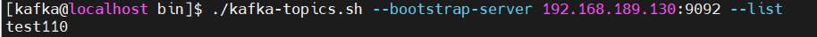

如果返回上述图片显示内容，说明 Kafka 已经启动成功。

### 2.4 部署 Schema-Registry

Schema-Registry 是用于注册传输数据的数据结构的。并记录数据结构改变的每一个版本。数据写入 Kafka 和从 Kafka 中读出都需要 schema-registry 中记录的数据结构来进行序列化和反序列化。通过使用 schema-registry 来注册数据结构。Kafka 中只需保存序列化后的数据即可。可以减少数据的空间占用。

#### 2.4.1 安装 Schema-Registry

**第一步：解压安装 Schema-Registry 文件**

Schema-Registry 程序是 confluent 程序包中一部分。故这里我们要安装 conluent 程序包 , 部署社区版本即可。解压缩 confluent-community-7.4.0.tar.gz，并修改文件名，设置隶属组。

```
cd /opt
sudo tar -xvf confluent-community-7.4.0.tar.gz
sudo mv confluent-7.4.0 confluent
sudo chown -R root:root confluent
sudo chmod -R 755 confluent
```

**第二步：准备 Schema-Registry 的配置文件和存储文件**

创建 schema-registry 的配置、日志文件存储路径。

```
mkdir -p /KFDATA/schema-registry/etc
mkdir -p /KFDATA/schema-registry/logs
```

准备 schema-registry 的配置文件。

```
cd /KFDATA/schema-registry/etc
cp /opt/confluent/etc/schema-registry/schema-registry.properties ./
cp /opt/confluent/etc/schema-registry/log4j.properties ./
```

修改 `schema-registry.properties` 文件 , 修改连接的 Kafka Server 地址。


**第三步：准备 Schema-Registry的启动文件**

创建 Schema-Registry 启动环境变量文件，用于 Schema-Registry 启动时使用。

```
touch schema-registry.env
echo PATH="/usr/local/java/java17/bin:/opt/confluent/bin:/usr/local/bin:/bin:/usr/bin:/usr/local/sbin:/usr/sbin" >schema-registry.env
echo LOG_DIR="/KFDATA/schema-registry/logs" >>schema-registry.env
echo LOG4J_DIR="/KFDATA/schema-registry/etc/log4j.properties" >>schema-registry.env
echo SCHEMA_REGISTRY_LOG4J_OPTS=\"-Dlog4j.configuration=file:/KFDATA/schema-registry/etc/log4j.properties\" >>schema-registry.env
```

创建 Schema-Registry 的 systemd service 启动文件。

```
sudo vim /usr/lib/systemd/system/schema-registry.service
```

录入以下内容并保存。

```
[Unit]
Description=RESTful Avro schema registry for Apache Kafka
After=network.target

[Service]
Type=forking
User=kafka
Group=kafka
EnvironmentFile=/KFDATA/schema-registry/etc/schema-registry.env
ExecStart=/opt/confluent/bin/schema-registry-start -daemon /KFDATA/schema-registry/etc/schema-registry.properties
TimeoutStopSec=180
Restart=no

[Install]
WantedBy=multi-user.target
```

重新加载 service 启动服务。

```
sudo systemctl daemon-reload
```

#### 2.4.2 部署启动 Schema-Registry

**第一步： 通过 systemctl 工具启动 Schema-Registry服务**

执行以下命令。

```
sudo systemctl start schema-registry
```

**第二步：查看 Schema-Registry 启动情况**

通过 systemctl 工具查看启动状态。

```
sudo systemctl status schema-registry
```

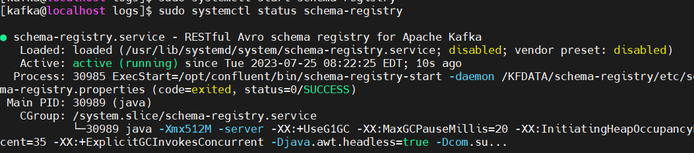

查看 Kafka 中的 topic。

```
cd /opt/kafka/bin
./kafka-topics.sh --bootstrap-server 192.168.189.130:9092 --list
```

可以看到 kafka 中已经创建出了 schema-registry 需要使用的 topic。


schema-registry 启动成功。

### 2.5 部署 Kafka-Connect

Kafka-Connect 是 Kafka 提供的 HA 框架，实现了 Kafka-Connect 接口的 connector (连接器) ，只需处理自己需要进行读取、写入数据任务。高可用部分由 Kafka-Connect 框架负责。

Kafka-Connect 可用通过 REST API 进行访问。

#### 2.5.1 安装 Kafka-Connect

**第一步： Kafka-Connect 安装**

Kafka-Connect 由 Kafka 提供，启动程序在 Kafka 的安装路径下，已经存在。数据元数据注册由 schema-registry 处理。相应的序列化包在已安装 Confluent 路径下。故无需再安装程序包。

**第二步：准备 Kafka-Connect 的配置文件和存储文件**

创建 Kafka-Connect 的配置、日志文件存储路径。

```
mkdir -p /KFDATA/kafka-connect/etc
mkdir -p /KFDATA/kafka-connect/logs
```

创建 Kafka-Connect 的配置文件。

```
cd /KFDATA/kafka-connect/etc
vim kafka-connect.properties
```

录入以下内容并保存。 IP 地址部分，需要根据前环境修改。

```
bootstrap.servers=192.168.189.130:9092
group.id=connect-cluster

key.converter=io.confluent.connect.avro.AvroConverter
key.converter.schema.registry.url=http://192.168.189.130:8081
value.converter=io.confluent.connect.avro.AvroConverter
value.converter.schema.registry.url=http://192.168.189.130:8081
key.converter.schemas.enable=true
value.converter.schemas.enable=true

internal.key.converter=org.apache.kafka.connect.json.JsonConverter
internal.value.converter=org.apache.kafka.connect.json.JsonConverter
internal.key.converter.schemas.enable=false
internal.value.converter.schemas.enable=false

config.storage.topic=connect-configs
offset.storage.topic=connect-offsets
status.storage.topic=connect-statuses
config.storage.replication.factor=1
offset.storage.replication.factor=1
status.storage.replication.factor=1

plugin.path=/opt/confluent/share/java/plugin
rest.host.name=192.168.189.130
rest.port=8083
rest.advertised.host.name=192.168.189.130
rest.advertised.port=8083

offset.flush.timeout.ms=50000
offset.flush.interval.ms=10000
send.buffer.bytes=13107200
consumer.max.poll.records=10000
consumer.partition.assignment.strategy=org.apache.kafka.clients.consumer.CooperativeStickyAssignor
```

创建 Kafka-Connect 的 *log4j* 配置文件。

```
cd /KFDATA/kafka-connect/etc
cp /opt/kafka/config/connect-log4j.properties ./log4j.properties
```

修改文件中的以下参数配置。

```
vim ./log4j.properties
log4j.appender.connectAppender.File=${kafka.logs.dir}/connect.log
```

将其修改为：

```
log4j.appender.connectAppender.File=/KFDATA/kafka-connect/logs/connect.log
```

**第三步： 准备 Kafka-Connect 的启动文件**

创建 Kafka-Connect 启动环境变量文件。

```
cd /KFDATA/kafka-connect/etc
touch kafka-connect.env

echo PATH="/usr/local/java/java17/bin:/usr/local/bin:/bin:/usr/bin:/usr/local/sbin:/usr/sbin" >kafka-connect.env
echo LOG_DIR="/KFDATA/kafka-connect/logs/" >>kafka-connect.env
echo LOG4J_DIR="/KFDATA/kafka-connect/etc/log4j.properties" >>kafka-connect.env
echo KAFKA_LOG4J_OPTS=\"-Dlog4j.configuration=file:/KFDATA/kafka-connect/etc/log4j.properties\" >>kafka-connect.env
echo CLASSPATH=/opt/confluent/share/java/schema-registry/*:/opt/confluent/share/java/kafka-serde-tools/*:/opt/confluent/share/java/confluent-common/* >>kafka-connect.env
echo JMX_PORT=29998 >>kafka-connect.env
```

创建 Kafka-Connect 的 systemd service 文件。

```
sudo vim /usr/lib/systemd/system/kafka-connect.service
```

录入以下内容，并保存。

```
[Unit]
Description=Apache Kafka Connect - distributed
After=network.target

[Service]
Type=simple
User=kafka
Group=kafka
EnvironmentFile=/KFDATA/kafka-connect/etc/kafka-connect.env
ExecStart=/opt/kafka/bin/connect-distributed.sh /KFDATA/kafka-connect/etc/kafka-connect.properties
TimeoutStopSec=180
Restart=no

[Install]
WantedBy=multi-user.target

```

重新加载 service 启动服务。

```
sudo systemctl daemon-reload
```

#### 2.5.2 部署启动 Kafka-Connect

**第一步： 通过 systemctl 工具启动 Kafka-Connect 服务**

执行以下命令。

```
sudo systemctl start kafka-connect.service
```

**第二步： 查看 Kafka-Connect 启动情况**

通过 `jps` 命令查看启动情况。

```
jps -mlvV |grep connect
```

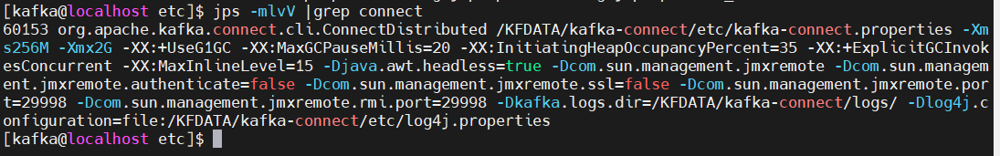

查看 Kafka 中的 topic 情况，Kafka-Connect 会在 Kafka 中创建 connect-configs , connect-offsets, connect-statuses 三个 topic。

```
cd  /opt/kafka/bin
./kafka-topics.sh --bootstrap-server 192.168.189.130:9092 --list
```


使用 `curl` 命令访问 kafka-connect ，可以看到当前还没有配置 connector 任务。

```
 curl -H "Accept:application/json" 192.168.189.130:8083/connectors/
```


## 3. 从 Oracle 到 Kafka 的数据同步：部署程序与配置任务

### 3.1 配置 Oracle 数据库

对于 Source 数据库 Oracle ，本教程采用 Oracle 提供的 LogMiner 工具来捕获数据的数据变化 ，这里需要对 Oracle 数据库做一些设置。主要配置如下：

* Oracle 需开启归档模式
* 要进行实时同步的 Oracle 表需要开启表级补充日志
* 创建具有一定权限的 Oracle 用户

**第一步： 开启 Oracle 归档模式**

创建备份文件路径：

```
mkdir -p /data/oradata/recovery_area
```

sqlplus 以 dba 权限登录：

```
sqlplus / as sysdba
```

执行以下命令开启 Oracle 归档模式：

```
-- 设置数据库归档空间大小为20GB,该值为建议最小提供值
alter system set db_recovery_file_dest_size = 20G;
-- 设置数据库归档路径
alter system set db_recovery_file_dest = '/data/oradata/recovery_area' scope=spfile;
-- 立即关闭数据库
shutdown immediate
-- mount模式启动
startup mount
-- 开启归档模式
alter database archivelog;
-- 开启数据库
alter database open;
```

查看是否开启归档日志，如图显示 Archive Mode 则表示归档已开启：

```
archive log list
```

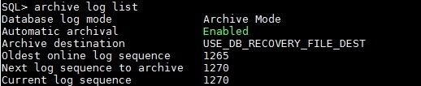

归档日志空间大小需根据实际需求设置。当归档日志满时，Oracle将不可用，需自行设置脚本来定时清理归档日志。

**第二步： 开启补充日志**

开启最小补充日志：

```
ALTER DATABASE ADD SUPPLEMENTAL LOG DATA; -- 开启最小补充日志
```

除了最小补充日志，还需要开启全字段的补充日志。可以开启数据库级全字段补充日志，也可以根据需要同步的表开启表级别全字段补充日志，只开启表级别可以减少归档日志的产生量。

开启数据库级全字段补充日志：

```
ALTER DATABASE ADD SUPPLEMENTAL LOG DATA (ALL) COLUMNS; -- 开启
-- ALTER DATABASE DROP SUPPLEMENTAL LOG DATA (ALL) COLUMNS; -- 关闭
```

或开启表级别全字段补充日志，SCHEMA 和 TABLENAME 需替换成具体的同步表(推荐采用此种方式)：

```
ALTER TABLE SCHEMA.TABLENAME ADD SUPPLEMENTAL LOG DATA (ALL) COLUMNS; -- 开启
-- ALTER TABLE SCHEMA.TABLENAME DROP SUPPLEMENTAL LOG DATA (ALL) COLUMNS; -- 关闭
```

**第三步：** **创建数据同步用的 debezium 用户**

创建 logminer\_tbs 表空间。

```
CREATE TABLESPACE logminer_tbs DATAFILE '/data/oradata/dbname/logminer_tbs.dbf'
SIZE 25M REUSE AUTOEXTEND ON MAXSIZE UNLIMITED;
```

创建专门用于日志挖掘的用户，命名为 debezium。

```
CREATE USER debezium IDENTIFIED BY password
DEFAULT TABLESPACE logminer_tbs
QUOTA UNLIMITED ON logminer_tbs;
```

对 debezium 用户授权（以 Oracle 11g 版本的设置为示例，其他 Oracle 版本可以参考 Debezium 文档说明）。

```
GRANT SELECT ANY TABLE TO debezium;
GRANT FLASHBACK ANY TABLE TO debezium;

GRANT CREATE SESSION TO debezium;
GRANT SELECT ON V_$DATABASE to debezium;
GRANT SELECT_CATALOG_ROLE TO debezium;
GRANT EXECUTE_CATALOG_ROLE TO debezium;
GRANT SELECT ANY TRANSACTION TO debezium;
GRANT SELECT ANY DICTIONARY to debezium;

GRANT CREATE TABLE TO debezium;
GRANT CREATE SEQUENCE TO debezium;

GRANT EXECUTE ON DBMS_LOGMNR TO debezium;
GRANT EXECUTE ON DBMS_LOGMNR_D TO debezium;

GRANT SELECT ON V_$LOG TO debezium;
GRANT SELECT ON V_$LOG_HISTORY TO debezium;
GRANT SELECT ON V_$LOGMNR_LOGS TO debezium;
GRANT SELECT ON V_$LOGMNR_CONTENTS TO debezium;
GRANT SELECT ON V_$LOGMNR_PARAMETERS TO debezium;
GRANT SELECT ON V_$LOGFILE TO debezium;
GRANT SELECT ON V_$ARCHIVED_LOG TO debezium;
GRANT SELECT ON V_$ARCHIVE_DEST_STATUS TO debezium;
```

其中`SELECT ANY TABLE`和`FLASHBACK ANY TABLE`可以缩减权限为需实时同步的表：

```
GRANT SELECT ON SCHEMA.TABLENAME TO debezium;
GRANT FLASHBACK ON SCHEMA.TABLENAME TO debezium;
```

### 3.2 安装 Debezium-Oracle 连接器插件

Oracle 的 Debezium 数据同步插件需要安装在 Kafka\_Connect 程序部署文件路径下。

配置启动 Debezium-Oracle 连接器，需要以下两步：

* 下载 Debezium-Oracle-Connector 插件，将插件解压并放到 Kafka Connect 的插件路径下
* 重新启动 Kafka Connect 程序，以加载插件

**第一步： 下载安装 Debezium-Oracle 插件和 ojdbc 包**

官方网站 [Debezium](https://debezium.io/)，选择 2.5.1.Final 版本进行下载，程序名为`debezium-connector-oracle-2.5.1.Final-plugin.tar.gz`

在 confluent 的安装路径下创建插件路径，在此路径下解压 Debezium 的 Oracle 插件包，请确保 kafka 用户对此路径的读权限。

```
sudo mkdir -p /opt/confluent/share/java/plugin
cd /opt/confluent/share/java/plugin
sudo tar -xvf ./debezium-connector-oracle-2.5.1.Final-plugin.tar.gz
sudo rm ./debezium-connector-oracle-2.5.1.Final-plugin.tar.gz
```

连接 Oracle 数据库还需 Oracle 的 JDBC 包，可以到 Oracle 官网 [JDBC Drivers Archive](https://www.oracle.com/database/technologies/appdev/jdbc-drivers-archive.md) 下载对应 Oracle 版本的 JDBC 包，目前 Oracle 官网已下架 Oracle 11g 版本的ojdbc包，可以在此下载`ojdbc8.jar`

在当前的`debezium-connector-oracle`目录下再放入 ojdbc 包 `ojdbc8.jar`

```
cp ~/ojdbc8.jar /opt/confluent/share/java/plugin/debezium-connector-oracle/
```

**第二步： 配置 Kafka-Connect 加载插件**

修改 Kafka Connect 的配置文件，添加插件路径配置。若已配置插件路径，则跳过该步骤。

```
cd /KFDATA/kafka-connect/etc
vim kafka-connect.properties
```

添加或修改参数 plugin.path 如下。

```
plugin.path=/opt/confluent/share/java/plugin
```

重新启动 Kafka Connect。

```
sudo systemctl restart kafka-connect
```

查看 kafka connect 的日志输出，能查询到信息则说明插件加载成功。

```
cat /KFDATA/kafka-connect/logs/connect.log | grep OracleConnector
```

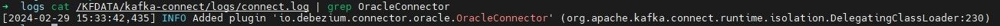

### 3.3 配置 Oracle 数据同步连接任务

配置同步任务的及检查的很多命令都要带上 *url* 等参数。为了操作快捷，本教程封装了一些加载配置文件的操作脚本在 *kafka-tools.tar* 包中，详情参见附录。下载当前包，解压缩到 /KFDATA 目录下。后续的很多操作，包括检查 Kafka 的 topic、查看数据和配置同步任务等都会使用 kafka-tools 包中的脚本。包中的脚本在无参数运行时会输出 help。

```
cd /KFDATA
sudo tar -xvf kafka-tools.tar
sudo chown kafka:kafka kafka-tools
rm ./kafka-tools.tar
```

修改 \*/KFDATA/kafka-tools/config/config.properties \*配置参数。

按照本机的路径、IP 等对应修改 Kafka 和 Kafka\_Connect 的启动 IP 地址，以及安装目录。

示例如下：

```
#kafka parameters
kafka_home=/opt/kafka
confluent_home=/opt/confluent
bootstrap_server=192.168.189.130:9092

#kafka-connect parameters
connect_rest_url=192.168.1.178:8083
#rest_pd  means restful request  password,This is not necessary
#rest_pd=appsdba:passwd
schema_ip=192.168.189.130
schema_port=8081
```

**第一步：准备 Oracle 数据库表**

在 debezium 用户下创建`index_example`示例表。

```
create table debezium.index_example (
    trade_date date,
    stock_code varchar2(20),
    effDate date,
    indexShortName varchar2(20),
    indexCode varchar2(20),
    secShortName varchar2(50),
    exchangeCD varchar2(10),
    weight number,
    tm_stamp date,
    flag integer,
    primary key (trade_date, stock_code, indexCode, flag)
);
```

向`index_example`表中插入 4 条数据。

```
insert into debezium.index_example
values(to_date('2006-11-30', 'YYYY-MM-DD'), '000759', to_date('2018-06-30 03:48:05', 'YYYY-MM-DD HH24:MI:SS'),
'中证500', '000905', '中百集团', 'XSHE', 0.0044, to_date('2018-06-30 05:43:05', 'YYYY-MM-DD HH24:MI:SS'), 1);

insert into debezium.index_example
values(to_date('2006-11-30', 'YYYY-MM-DD'), '000759', to_date('2018-06-30 04:47:05', 'YYYY-MM-DD HH24:MI:SS'),
'中证500', '000906', '中百集团', 'XSHE', 0.0011, to_date('2018-06-30 05:48:06', 'YYYY-MM-DD HH24:MI:SS'), 1);

insert into debezium.index_example
values(to_date('2006-11-30', 'YYYY-MM-DD'), '600031', to_date('2018-06-30 03:48:05', 'YYYY-MM-DD HH24:MI:SS'),
'上证180', '000010', '三一重工', 'XSHG', 0.0043, to_date('2018-06-30 05:48:05', 'YYYY-MM-DD HH24:MI:SS'), 1);

insert into debezium.index_example
values(to_date('2006-11-30', 'YYYY-MM-DD'), '600031', to_date('2018-06-30 03:48:05', 'YYYY-MM-DD HH24:MI:SS'),
'沪深300', '000300', '三一重工', 'XSHG', 0.0029, to_date('2018-06-30 05:48:05', 'YYYY-MM-DD HH24:MI:SS'), 1);

commit;
```

在 debezium 用户下创建`stock_example`示例表。

```
create table debezium.stock_example (
    id number,
    ts_code varchar2(20),
    symbol_id varchar2(20),
    name varchar2(20),
    area varchar2(20),
    industry varchar2(20),
    list_date date,
    primary key (id, ts_code)
);
```

向`stock_example`表中插入 3 条数据并提交。

```
insert into debezium.stock_example
values (1, '000001.SZ', '000001', '平安银行', '深圳', '银行', to_date('1991-04-03', 'YYYY-MM-DD'));

insert into debezium.stock_example
values (2, '000002.SZ', '000002', '万科A', '深圳', '地产', to_date('1991-01-29', 'YYYY-MM-DD'));

insert into debezium.stock_example
values (3, '000004.SZ', '000004', 'ST国华', '深圳', '软件服务', to_date('1991-01-14', 'YYYY-MM-DD'));

```

查看 Oracle 表中数据。

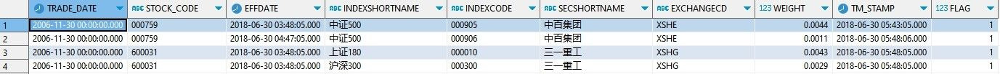

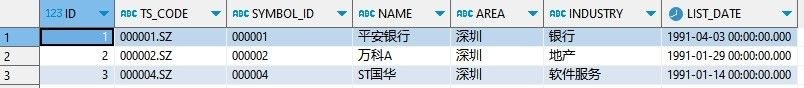

若在 3.1 节的 step2 中未开启数据库级全字段增量日志，在此步还需开启表级全字段增量日志。

```
ALTER TABLE debezium.index_example ADD SUPPLEMENTAL LOG DATA (ALL) COLUMNS;
ALTER TABLE debezium.stock_example ADD SUPPLEMENTAL LOG DATA (ALL) COLUMNS;
```

**第二步：准备连接器配置文件，并启动连接任务**

创建连接 Oracle 的 source 连接器配置文件。

```
mkdir -p /KFDATA/datasyn-config
vim /KFDATA/datasyn-config/source-oracle.json
```

录入以下配置，hostname 和 kafka 启动地址需对应修改。

```
{
    "name": "oracle-connector",
    "config": {
     "connector.class": "io.debezium.connector.oracle.OracleConnector",
     "tasks.max": "1",
     "topic.prefix": "oracle_service",
     "database.hostname": "183.134.101.144",
     "database.port": 1521,
     "database.user": "debezium",
     "database.password": "123456",
     "database.dbname": "testdb",
     "database.connection.adapter": "logminer",
     "schema.include.list": "debezium",
     "table.include.list": "debezium.index_example,debezium.stock_example",
     "schema.history.internal.kafka.bootstrap.servers": "183.134.101.144:9092",
     "schema.history.internal.kafka.topic": "schema-changes.test",
     "event.processing.failure.handling.mode": "skip",
     "decimal.handling.mode": "string",
     "snapshot.mode": "initial",
     "log.mining.strategy": "online_catalog",
     "log.mining.query.filter.mode": "in",
     "log.mining.continuous.mine": true,
     "heartbeat.interval.ms": "20000",
     "schema.history.internal.store.only.captured.tables.ddl": true,
     "schema.history.internal.store.only.captured.databases.ddl": true,
  }
}
```

参数说明：

| 参数名称 | 默认值 | 参数说明 |
| --- | --- | --- |
| connector.class | 无 | 连接器的 Java 类的名称。这里是 oracle 的连接器类名。 |
| tasks.max | 1 | 当前 connector 的最大并行任务数。oracle 的 source 连接器任务数只能是 1。 |
| topic.prefix | 无 | 当前 connector 同步写入任务的命名空间。会被用于添加到同步表对应 topic 名称前等。 |
| database.hostname | 无 | Oracle 数据库服务器的 IP 地址或主机名。 |
| database.port | 3306 | Oracle 数据库服务器的整数端口号。 |
| database.user | 无 | Oracle 数据库服务器连接用户。 |
| database.password | 无 | Oracle 数据库服务器连接用户密码。 |
| database.dbname | 无 | Oracle 数据库实例名称。 |
| database.connection.adapter | logminer | 使用的适配器名称。选项为 logminer、olr 或者 xstream 。分别对应 Oracle LogMiner API、OpenLogReplicator和Oracle XStream API。 |
| schema.include.list | 无 | 匹配的模式名。可以多个，用逗号分割即可。 |
| table.include.list | 无 | 匹配的表名。可以多个，用逗号分割即可。 |
| schema.history.internal.kafka.bootstrap.servers | 无 | 数据同步记录 Oracle 的表结构信息的 kafka 连接。 |
| schema.history.internal.kafka.topic | 无 | 数据同步记录 Oracle 表结构的 topic 名称。 |
| event.processing.failure.handling.mode | fail | 处理事件时碰到异常如何处理。可选 fail 、warn 和 skip。 |
| decimal.handling.mode | precise | 针对 Oracle 的 NUMBER、DECIMAL 和 NUMERIC 类型的处理模式。”precise” 表示转换成 java.math.BigDecimal ，”double” 表示转换成 double 值，”string” 表示转换成字符串。 |
| snapshot.mode | initial | 指定 connector 用来捕获表快照的形式。常用的是 ”initial”和 ”schema\_only” 。“initial“ 在 connector 第一次启动时会获取表结构和表的快照数据，并继续获取新增的变更数据。”schema\_only” 表示只获取表结构，并只会获取新增的变更数据。其他形式请参考 debezium 官方文档。 |
| log.mining.strategy | redo\_log\_catalog | 指定挖掘策略。挖掘策略决定了Oracle LogMiner 如何构建数据字典来解析日志文件。有 redo\_log\_catalog 和 online\_catalog 两种模式。推荐使用 online\_catalog，这种模式的优点是速度快、不产生多余日志。缺点是如果DDL变化时如果还有旧的表结构对应的数据变更没有挖掘完成，无法根据旧的表结构解析日志，不适用于表结构频繁变更的情况。 |
| log.mining.query.filter.mode | none | Oracle LogMiner 查询构建的方式。查询过滤方式，推荐使用 ”in” 的方式。 |
| log.mining.continuous.mine | false | 连续挖掘选项。Oracle 12c 及之后该选项已弃用。 |
| heartbeat.interval.ms | 0 | connector 向 topic 发送心跳信息的频率，单位为毫秒。当需捕获的表在较长时间没有数据更改时，设置此参数可以及时刷新 SCN 号，设置为 0 时 connector 不会发送任何心跳信息，可能会导致 connector 记录的SCN号和数据库最新 SCN 号之间的间隔较大。 |
| schema.history.internal.store.only.captured.tables.ddl | false | 指定 connector 记录一个 schema 或者一个数据库中所有非系统表的表结构，还是只记录需要捕获表的表结构。 |
| schema.history.internal.store.only.captured.databases.ddl | false | 指定 connector 是否记录数据库实例中所有逻辑数据库的表结构。 |

更多详细参数说明可以参看（Debezium 2.5），不同Debezium版本的参数配置不同，若使用其他版本的Debezium，需找到对应文档做修改。

[Debezium Connector for Oracle :: Debezium Documentation](https://debezium.io/documentation/reference/2.5/connectors/oracle.md)

**第三步： 启动 Oracle 的数据同步任务**

通过 REST API 启动 Oracle 的 source 连接器

```
curl -i -X POST -H "Accept:application/json" -H  "Content-Type:application/json" http://183.134.101.144:8083/connectors/ -d @/KFDATA/datasyn-config/source-oracle.json
```

也可以通过 kafka-tools 中的脚本启动

```
cd /KFDATA/kafka-tools/bin
./rest.sh create /KFDATA/datasyn-config/source-oracle.json
```

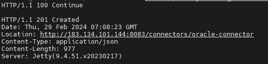

**第四步：查看 Oracle 数据同步任务状态**

查看同步任务列表。*list* 参数展示任务名列表，showall 参数会显示全部同步任务状态。

```
cd /KFDATA/kafka-tools/bin
./rest.sh showall

```


查看 *topic* 列表：

```
./kafka.sh tplist
```


查看 topic oracle\_service.DEBEZIUM.INDEX\_EXAMPLE和 oracle\_service.DEBEZIUM.STOCK\_EXAMPLE 中的数据条数：

```
./kafka.sh get_offsets oracle_service.DEBEZIUM.INDEX_EXAMPLE
./kafka.sh get_offsets oracle_service.DEBEZIUM.STOCK_EXAMPLE
```

结果如图所示

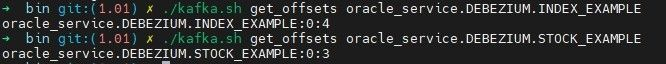

## 4. 从Kafka 到 DolphinDB 的数据同步：部署程序与配置任务

### 4.1 安装 Kafka-DolphinDB 数据同步连接器插件

配置启动 Kafka-DolphinDB 连接器，需要以下两步：

* 下载 Kafka-DolphinDB-Connector 插件，将插件解压并放到 Kafka Connect 的插件路径下。
* 重新启动 Kafka Connect 程序，以加载插件。

**第一步：下载 Kafka-DolphinDB 插件**

* jdbc-2.00.11.1-ddbcdc-beta1.jar ：该 DolphinDB JDBC 包为数据同步做了一些专门修改，为特殊版本，后续会进行版本统一支持。参见附录。
* kafka-connect-jdbc-10.7.4-ddb1.10.jar ：是基于 kafka-connect-jdbc-10.7.4 开发的 DolphinDB 连接器，后续会进行代码开源。参见附录。

创建插件路径，在此路径下放置 Kafka-DolphinDB 插件包，将上述两个 jar 包放在此目录下。请确保 kafka 用户包含对这两个文件的读权限。

```
sudo mkdir -p /opt/confluent/share/java/plugin/kafka-connect-jdbc
sudo cp ~/jdbc-2.00.11.1-ddbcdc-beta1.jar /opt/confluent/share/java/plugin/kafka-connect-jdbc/
sudo cp ~/kafka-connect-jdbc-10.7.4-ddb1.10.jar /opt/confluent/share/java/plugin/kafka-connect-jdbc/
```

如果上面的操作碰到权限问题，则可以使用以下命令赋予权限。

```
sudo chmod o+rx /opt/confluent/share/java/plugin/kafka-connect-jdbc/*
```

**第二步： 重启 kafka-connect**

```
sudo systemctl restart kafka-connect
```

查看kafka-connect路径的日志输出

```
cat /KFDATA/kafka-connect/logs/connect.log | grep JdbcSinkConnector
```

出现下图中所示信息时，说明插件加载成功：

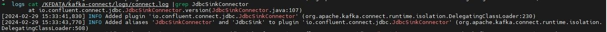

### 4.2 配置 DolphinDB 的数据同步连接任务

**第一步：创建同步的 DolphinDB 库、表**

根据 Oracle 表结构，创建与 Oracle 表结构一致的表，Oracle 数据类型转换为 DolphinDB 数据类型对照表可以参考4.2节。

创建 `index_example` 表：

```
dbName = "dfs://index_data"
tbName = "index_example"
colNames = `trade_date`stock_code`effDate`indexShortName`indexCode`secShortName`exchangeCD`weight`tm_stamp`flag
colTypes = `DATE`SYMBOL`TIMESTAMP`SYMBOL`SYMBOL`SYMBOL`SYMBOL`DOUBLE`TIMESTAMP`INT
t = table(1:0, colNames, colTypes)
db = database(directory=dbName, partitionType=RANGE, partitionScheme=1990.01M+(0..80)*12, engine="TSDB", atomic="CHUNK")
db.createPartitionedTable(t, tbName, partitionColumns=`trade_date, sortColumns=`stock_code`indexCode`flag`trade_date, keepDuplicates=LAST, softDelete=true)
```

创建 `stock_example` 表：

```
dbName = "dfs://stock_data"
tbName = "stock_example"
colNames = `id`ts_code`symbol_id`name`area`industry`list_date
colTypes = `LONG`SYMBOL`SYMBOL`SYMBOL`SYMBOL`SYMBOL`DATE
t = table(1:0, colNames, colTypes)
db=database(directory=dbName, partitionType=HASH, partitionScheme=[LONG, 1], engine="TSDB", atomic="CHUNK")
db.createPartitionedTable(t, tbName, partitionColumns=`id, sortColumns=`ts_code`id, keepDuplicates=LAST, sortKeyMappingFunction=[hashBucket{,100}], softDelete=true)
```

注：建表时的软删除功能，即softDelete选项需要DolphinDB 2.00.11及以上的版本。旧版本DolphinDB建表时可以去除该选项。

**第二步： 配置同步配置表**

在DolphinDB 中创建一张配置表，记录 kafka topic 和 DolphinDB 库表之间的映射关系。配置表的库表名可以自行调整，并在 DolphinDB 的同步任务中设置相应的库表名称。配置表中字段名是固定的，需和示例保持一致。

数据库名：dfs://ddb\_sync\_config

表名：sync\_config

```
db = database("dfs://ddb_sync_config", HASH, [SYMBOL, 2])
t = table(1:0, `connector_name`topic_name`target_db`target_tab`add_sortcol_flag,
[SYMBOL, SYMBOL, SYMBOL, SYMBOL, SYMBOL])
db.createTable(t, "sync_config")
```

kafka topic 名可以通过之前介绍的`./kafka.sh tplist` 的命令查看。debezium.index\_example 和 debezium.stock\_example 表对应的 kafka topic 分别是 oracle\_service.DEBEZIUM.INDEX\_EXAMPLE 和 oracle\_service.DEBEZIUM.STOCK\_EXAMPLE。

插入配置信息，将 kafka topic 和 DolphinDB 库表名称一一对应。

```
def addSyncConfig(connector_name, topic_name, dbname, tbname, add_sortcol_flag="0") {
    loadTable("dfs://ddb_sync_config", "sync_config").append!(
    table([connector_name] as col1,
    [topic_name] as col2,
    [dbname] as col3,
    [tbname] as col4,
    [add_sortcol_flag] as col5))
}

addSyncConfig("ddb-sink", "oracle_service.DEBEZIUM.INDEX_EXAMPLE", "dfs://index_data", "index_example", "0")
addSyncConfig("ddb-sink", "oracle_service.DEBEZIUM.STOCK_EXAMPLE", "dfs://stock_data", "stock_example", "0")
```

以下是配置表的各个字段说明：

| 字段名 | 类型 | 字段作用 |
| --- | --- | --- |
| connector\_name | SYMBOL | 配置的 DolphinDB Sink 同步任务名 |
| topic\_name | SYMBOL | 要同步的 kafka topic 名称 |
| target\_db | SYMBOL | 对应的 DolphinDB 分布式库名 |
| target\_tab | SYMBOL | 对应的 DolphinDB 分布式表名 |
| add\_sortcol\_flag | SYMBOL | 是否需要添加 dummySortKey\_\_ 列，需要则设置为 ”1”，否则设置为 ”0”。具体原因详见 4.1 节的DolphinDB 同步须知。 |

**第三步： 准备连接器配置文件，并启动连接任务**

创建 DolphinDB 数据同步任务配置文件。

```
cd /KFDATA/datasyn-config
vim ddb-sink.json
```

配置如下

```
{
    "name": "ddb-sink",
    "config": {
        "connector.class": "io.confluent.connect.jdbc.JdbcSinkConnector",
        "tasks.max": "2",
        "topics": "oracle_service.DEBEZIUM.INDEX_EXAMPLE,oracle_service.DEBEZIUM.STOCK_EXAMPLE",
        "connection.url": "jdbc:dolphindb://183.134.101.144:8848?user=admin&password=123456",
        "transforms": "unwrap",
        "transforms.unwrap.type": "io.debezium.transforms.ExtractNewRecordState",
        "transforms.unwrap.drop.tombstones": "false",
        "auto.evolve": "false",
        "insert.mode": "insert",
        "delete.enabled": "true",
        "batch.size":"10000",
        "pk.mode": "record_key",
        "ddbsync.config.table":"dfs://ddb_sync_config,sync_config",
        "ddbsync.addSortColFlag": "true"
    }
}
```

| 参数名称 | 默认值 | 参数说明 |
| --- | --- | --- |
| name | 无 | 同步任务名称，不可重复。 |
| connector.class | 无 | 连接器的 Java 类的名称。这里是 JdbcSink 的通用连接器类名。 |
| tasks.max | 1 | 当前 connector 的最大并行任务数。可以调节增大，会创建多 consumer 并行消费读取 Kafka 中数据。一般的数据同步场景设置到 10 基本可以满足同步速度上的需求。 |
| topics | 无 | 配置要同步的 Kafka 中的 topic 名称，配置多个 topic 时用逗号分割。 |
| connection.url | 无 | DolphinDB 数据库服务器的IP地址或主机名。 |
| transforms | 无 | 声明数据转换操作，请设置为 unwrap。 |
| transforms.unwrap.type | 无 | 声明数据转换器类别。请设置为 false。 |
| transforms.unwrap.drop.tombstones | false | 声明是否删除 Kafka 中的墓碑数据。请设置为 false。 |
| auto.evolve | true | 当 DolphinDB 中缺少列时，是否自动增加列。当前不支持自动增加列，必须配置为 false。 |
| insert.mode | insert | 数据插入模式。当前只支持 insert 模式。 |
| pk.mode | none | 主键模式。必须设置为 record\_key。 |
| delete.enabled | false | 在主键模式为 record\_key 情况下。对于 null 值 record 是否按照 delete 进行操作。 |
| batch.size | 3000 | 设置在数据量足够大时。以每批最大多少条来写入到目标数据库。注意：当该值大于 Connect worker 中设置的 consumer.max.pol.records 时，每次提交数量会受 consumer.max.pol.records 的值限制。 |
| ddbsync.config.table | dfs://ddb\_sync\_config,sync\_config | Kafka 中的 topic 对应 DolphinDB 表的配置表名称。可以自行定义库、表名称。但表中的字段要保持一致。表结构见 3.2 节。 |
| ddbsync.addSortColFlag | false | 是否开启补充列。若部分表需要通过补充列来设置sortColumns，则需要开启。具体原因见 4.1 节。 |

参数说明：以上参数项为同步 DolphinDB 所需参数。如果对 Confluent 的JDBC Sink Connect 有经验可适当调节。

通过 REST API 启动source连接器：

```
curl -i -X POST -H "Accept:application/json" -H  "Content-Type:application/json" http://183.134.101.144:8083/connectors/ -d @ddb-sink.json
```

也可以通过 kafka-tools 中的脚本启动：

```
cd /KFDATA/kafka-tools/bin
./rest.sh create /KFDATA/datasyn-config/ddb-sink.json
```

查看同步任务状态， ddb-sink 是 DolphinDB 的数据同步任务：

```
./rest.sh showall
```

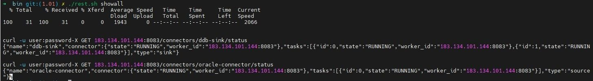

**第四步： 查看表初始数据同步进度**

在设置 Oracle 同步任务时，将`snapshot.mode`选项值设置为 ”initial” ，该选项意味着 Oracle 会同步表的初始数据到 Kafka 中，设置完下游的 DolphinDB 任务后，可以检查初始数据的同步情况。

通过 kafka.sh 脚本查看消费者列表：

```
./kafka.sh cm_list
```

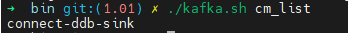

查看 DolphinDB 同步任务对应的 Kafka 消费组中的每一个 consumer 的消费进度，通过此命令可以查看同步程序中每一张的表同步进度。 Lag 为 0 则表示 Kafka 中 topic 当前没有未消费的数据，即 Kafka 中的数据与对应表的数据是一致的。

```
./kafka.sh cm_detail connector-ddb-sink
```

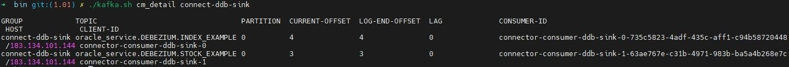

如上图显示，数据已被 DolphinDB 同步任务消费完毕，此时在 DolphinDB 的 web 界面查看表中数据，表数据和 Oracle 表中数据是一致的。

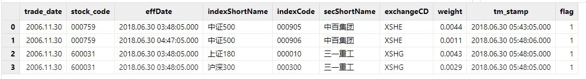

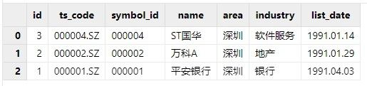

### 4.3 实时同步验证

**第一步：插入数据**

向 Oracle 表插入两条新数据：

```
insert into debezium.index_example
values (to_date('2006-11-30', 'YYYY-MM-DD'), '600051',
to_date('2018-06-30 05:48:05', 'YYYY-MM-DD HH:MI:SS'), '上证180', '000010', '三一重工',
'XXXB', 0.0043, to_date('2018-06-30 05:48:05', 'YYYY-MM-DD HH24:MI:SS'), 1);

insert into debezium.index_example
values (to_date('2006-11-30', 'YYYY-MM-DD'), '600052',
to_date('2018-06-30 06:48:02', 'YYYY-MM-DD HH:MI:SS'), '沪深300', '000300', '三一重工',
'XSHG', 0.0029, to_date('2018-06-30 05:48:05', 'YYYY-MM-DD HH24:MI:SS'), 1);
```

查看 DolphinDB 对应的表数据：

```
select * from loadTable("dfs://index_data", "index_example")
```

可以看到新数据已写入：

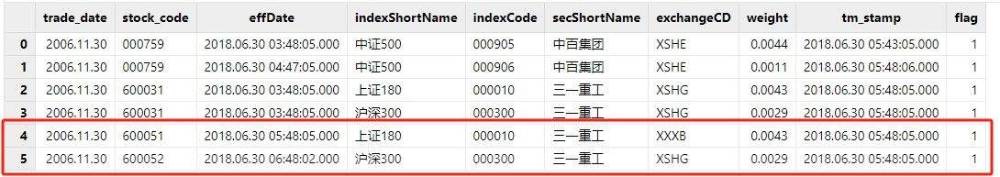

**第二步：更新数据**

Oracle 更改 code 值为600031数据的 tm\_stamp 字段值，更改为 2024.02.28 16:00:00：

```
update debezium.index_example
set tm_stamp = to_date('2024-02-28 16:00:00', 'YYYY-MM-DD HH24:MI:SS')
where stock_code = '600031';
```

再查看 DolphinDB 中数据，数据已被修改：

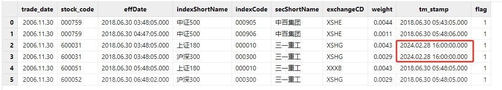

**第三步：删除数据**

Oracle 删除一条数据：

```
delete from debezium.index_example where stock_code = '600052';
```

再查看 DolphinDB 中数据，数据已被删除：

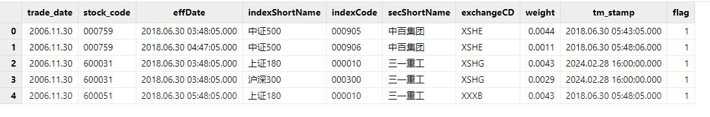

## 5. 部署注意事项

### 5.1 实时同步须知

DolphinDB 是一款支持海量数据的分布式时序数据库。针对不同的数据处理需求，在底层架构上天然上与通常的关系型数据库不同，所以需要有以下限制：

* DolphinDB 的表没有主键设计，必须使用 TSDB 引擎，将主键设置为 sortColumn 字段，并设置 **keepDuplicates=LAST** 来进行去重，以确保数据唯一性。TSDB 引擎的 sortColumn 是分区内去重，如果使用的是分区表，需要至少将其中一个主键列设置为分区列。
* Oracle 表的主键可能不满足 TSDB 引擎的 sortColumn 设置规则，有以下三种情况：
  + Oracle 表中有两个及以上的主键，其中一个主键为整数类型或时间类型，但末尾列不是整数类型或时间类型：
    - 该情况需要调整 sortColumn 设置的顺序，将整数类型或时间类型的主键移动到末尾。
  + Oracle 表中只有一个主键，或者 Oracle 表中的主键的数据类型均不包含整数类型或时间类型：
    - 该情况需要建表时在末尾补充一个 dummySortKey\_\_ 列，值均设置为0，对应同步程序的配置表中需要将add\_sortcol\_flag 列的值设置为“1”，若使用 DataX 进行同步，则需要做数据转换。
  + Oracle 表中的主键类型包含 DolphinDB 不支持的类型。
    - DolphinDB TSDB 引擎的 sortColumns 支持整数、日期或时间、字符串类型，暂时不支持小数类型，但预计会在后续的版本里支持，请关注版本更新。

DDL 语句相关：

* 当前不支持 DDL 语句同步。
* 若表结构发生更改，需进行单表修复，具体操作后续会在实时同步的运维手册文档中给出。

其他：

* 表字段命名时，请尽量规避一些简单的名字，比如 code, timestamp 等，这种命名与 DolphinDB 内关键字重复，可能会导致无法正确同步。

### 5.2 Oracle-DolphinDB 数据类型对应表

以下的类型对应表为推荐设置的 DolphinDB 类型，注意两者数据类型表示的精度范围，确保 DolphinDB 数据类型的精度可以覆盖原 Oracle 类型。

| Oracle类型 | DolphinDB类型 |
| --- | --- |
| NUMBER / NUMBER(P, S > 0) | DOUBLE / DECIMAL |
| FLOAT / DOUBLE PRICISION | DOUBLE |
| INTEGER / NUMBER(P, 0) | LONG |
| VARCHAR(M) / CHAR(M) | SYMBOL / STRING |
| DATE | DATE（仅日期）或TIMESTAMP（毫秒级时间戳） |
| TIMESTAMP(0 - 3) | TIMESTAMP（毫秒级时间戳） |
| TIMESTAMP, TIMESTAMP(4 - 6) | NANOTIMESTAMP（纳秒级时间戳） |
| TIMESTAMP(7 - 9) | NANOTIMESTAMP |

在浮点数数据处理上，Oracle 的 NUMBER 类型是精确值，如果转换成 DolphinDB 的 DOUBLE 类型，会存在浮点数精度丢失问题。DolphinDB 的 DOUBLE 类型的精度为15-16位有效数字。因此推荐用户转换成 DolphinDB 的 DECIMAL 类型，确保浮点数精度。

在时间类型转换上，请参照表中的类型映射，以保证 DolphinDB 中的时间类型字段在精度上可以覆盖 Oracle 中时间类型字段的精度。

## 6. 同步性能测试

### 6.1 性能测试配置

**参数配置调优**

本次性能测试修改了 kafka 的配置参数 *message.max.bytes* 为 10,485,760，当更新数据量比较大时，kafka 每批处理的消息变多了，会有一定的性能提升。

此外，也可以调整 Oracle 同步任务的 *log.mining.batch.size.max* 配置参数来增大 Oracle LogMiner 每批处理的数据量。该调整会增加 Oracle 的内存使用，需按实际情况评估调整。

**建表语句**

Oracle 建表，并生成测试数据代码：

```
DROP TABLE debezium.performance_test1;
CREATE TABLE debezium.performance_test1 (
    dt date,
    id varchar2(20),
    str1 char(10),
    val number,
    qty varchar2(20),
    tm date
);
-- 生成100w行数据，每天1000行
INSERT INTO debezium.performance_test1
SELECT to_date('2020-01-01', 'YYYY-MM-DD') + trunc(level/1000),
to_char(mod(level,1000)+1), 'aa', 1.234, 1000,
to_date('2024-01-01 15:00:00', 'YYYY-MM-DD HH24:MI:SS') FROM dual
connect by level <= 1000000;
-- 添加主键
ALTER TABLE debezium.performance_test1
ADD CONSTRAINT pk_performance_test1 PRIMARY KEY (id, dt);

DROP TABLE debezium.performance_test2;
CREATE TABLE debezium.performance_test2 (
    dt date,
    id varchar2(20),
    str1 char(10),
    val number,
    qty varchar2(20),
    tm date
);
-- 生成1亿行数据，每天100000行
INSERT INTO debezium.performance_test2
SELECT to_date('2020-01-01', 'YYYY-MM-DD') + trunc(((lvl1-1)*10000+lvl2)/100000),
to_char(mod(((lvl1-1)*10000+lvl2), 100000)+1), 'aa', 1.234, 1000,
to_date('2024-01-01 15:00:00', 'YYYY-MM-DD HH24:MI:SS')
FROM (select level as lvl1 from dual connect by Level <= 10000)
CROSS JOIN (select level as lvl2 from dual connect by Level <= 10000);
-- 添加主键
ALTER TABLE debezium.performance_test2
ADD CONSTRAINT pk_performance_test2 PRIMARY KEY (id, dt);
```

DolphinDB 建表代码：

```
dbName = "dfs://performance_test1"
tbName = "performance_test1"
colNames = `dt`id`str1`val`qty`tm
colTypes = `DATE`SYMBOL`SYMBOL`DOUBLE`LONG`TIMESTAMP
t = table(1:0, colNames, colTypes)
pkColumns = `id`dt
db = database(dbName, HASH, [SYMBOL, 2], , 'TSDB', 'CHUNK')
db.createTable(t, tbName, sortColumns=pkColumns, keepDuplicates=LAST, softDelete=true)

dbName = "dfs://performance_test2"
tbName = "performance_test2"
colNames = `dt`id`str1`val`qty`tm
colTypes = `DATE`SYMBOL`SYMBOL`DOUBLE`LONG`TIMESTAMP
t = table(1:0, colNames, colTypes)
pkColumns = `id`dt
partitionCols = `dt`id
db1 = database(, RANGE, date(datetimeAdd(1990.01M, 0..100*12, 'M')))
db2 = database(, HASH, [SYMBOL, 50])
db = database(dbName, COMPO, [db1, db2], , `TSDB, `CHUNK)
db.createPartitionedTable(t, tbName, partitionColumns=partitionCols, sortColumns=pkColumns, keepDuplicates=LAST, softDelete=true)
```

### 6.2 性能测试结果

性能测试结果如下表所示，其中总耗时等于 DolphinDB 更新完成时间减去 Oracle 更新完成时间，因此总耗时包含了以下数据同步的完整链路：

* Debezium 挖掘 Oracle 日志到 Kafka
* Kafka 推送数据给相应 topic 的消费者
* 下游的 DolphinDB Connector 消费 Kafka 中数据，解析为相应的 DolphinDB 更新语句，并执行写入 DolphinDB 完成

Kafka 每次推送的变更数据在3000-4000条，具体条数和 Kafka 的日志大小配置相关。对于 insert 和 update 类型的操作，DolphinDB 的处理效率很高。对于 delete 类型操作，由于 delete 操作涉及数据查找， DolphinDB 的处理效率和具体表的数据行数、分区方式相关。

| 测试表 | 原始数据行数 | 原始数据大小 | 操作类型 | 操作行数 | 总耗时 |
| --- | --- | --- | --- | --- | --- |
| 表1performance\_test1 | 100万 | 39MB | insert | 1 | 1s |
| 10,000 | 2s |  |  |  |  |
| 1,000,000 | 1min5s |  |  |  |  |
| update | 1 | 2s |  |  |  |
| 10,000 | 4s |  |  |  |  |
| 1,000,000 | 1min16s |  |  |  |  |
| delete | 1 | 3s |  |  |  |
| 10,000 | 9s |  |  |  |  |
| 1,000,000 | 6min9s |  |  |  |  |
| 表2performance\_test2 | 1亿 | 3.2GB | insert | 1 | 1s |
| 10,000 | 2s |  |  |  |  |
| 1,000,000 | 1min4s |  |  |  |  |
| update | 1 | 1s |  |  |  |
| 10,000 | 5s |  |  |  |  |
| 1,000,000 | 1min14s |  |  |  |  |
| delete | 1 | 3s |  |  |  |
| 10,000 | 7s |  |  |  |  |
| 1,000,000 | 3min22s |  |  |  |  |

## 7. 常见问题解答（FAQ）

### 7.1 创建同步任务时报错

* **json 文件格式错误**

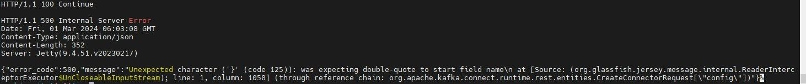

造成上述问题的原因可能是多了逗号、少了逗号或者括号不正确，需要检查并修订 json 文件。

* **Failed to resolve Oracle database version**

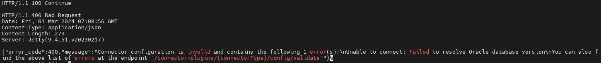

该报错提示意味着 Oracle 数据库无法正常连接。造成上述问题的可能原因：

* 未将 *ojdbc8.jar* 包到插件目录下
* Kafka 用户对 *ojdbc8.jar* 文件没有读权限

根据原因调整文件目录或读权限后，如果还是出现该错误，或者是其他无法连接 Oracle 的提示，可以尝试更换连接方式的写法，在配置文件中加入如下代码：

```
"database.url" : "jdbc:oracle:thin:@192.168.189.130:1521:testdb",
```

* **Can’t find JdbcSinkConnector**

查看日志提示没有 JdbcSinkConnector 包的加载。JdbcSinkConnector 是包含在 kafka-connect-jdbc-10.7.4-ddb1.10.jar 包内，需要确认该 jar 包是否防止在 kafka connect 的插件路径下，确认 kafka 对该文件的读权限。再通过 `java --version` 查看 Java 版本是否是17，Java 版本较低时，可能无法正确加载插件。目前已知使用 Java 8 时无法正确加载该插件。

### 7.2 数据未同步或者未正确同步

当数据未同步或者未正确同步时，请先按以下两步进行检查。然后对照后面的提供的错误列表进行参考调整。

**step1 查看同步任务状态**

先查看同步任务是否报错：

```
cd /KFDATA/kafka-tools/bin
./rest.sh showall
```

再看 kafka connect 的日志中是否出现 ERROR：

```
cd /KFDATA/kafka-connect/logs
cat connect.log | grep ERROR
```

如果有出现 ERROR，看 ERROR 显示的日志是 Oracle 报错还是 ddb-sink 报错，查看具体的报错信息。如果同步任务未报错，也没有 ERROR，再通过以下方式排查。

**step2 查看 Oracle 数据是否同步到 Kafka**

查看 Kafka 所有的 topic：

```
cd /KFDATA/kafka-tools/bin
./kafka.sh tplist
```

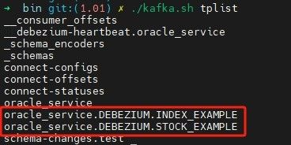

在查看该 topic 对应的数据条数：

```
./kafka.sh get_offsets oracle_service.DEBEZIUM.INDEX_EXAMPLE
```

* **一张表出现两个 topic 名字**

这说明 Oracle source 任务的 topic.prefix 或 DolphinDB sink 任务的 topics 配置项拼写有误，请检查这两项。DolphinDB sink 任务的 topics 必须为 .. 的格式。创建 sink 任务时，如果 topic 不存在，则会自动创建 topic，因此拼写错误会导致出现两个 topic 。

* **没有表对应的 topic / 有对应的 topic，但数据条数为0**

这说明 Oracle 数据未正常同步到 Kafka 中，请在同步任务的 table.include.list 中检查 Oracle 表名的拼写，或者在同步任务中未配置参数 "log.mining.strategy":"online\_catalog" 导致数据延迟大。

* **有对应的 topic，有数据条数，但DolphinDB未同步**

检查 DolphinDB Sink 任务中 topics 配置项中的拼写，检查同步任务配置表中是否有相同的条数。

查看 Kafka 中数据是否与 Oracle 变更数据一致：

```
./tpconsumer.sh --op=2 --topic=oracle_service.DEBEZIUM.INDEX_EXAMPLE --offset=0 --max-messages=20
```

在显示的结果中，初始数据同步的消息数据 op = r，新插入数据 op = c，更新数据 op = u

* **插入数据正常，但更新或删除数据时未同步/报错**

Oracle 未开启全字段补充日志

```
ALTER TABLE debezium.index_example ADD SUPPLEMENTAL LOG DATA (ALL) COLUMNS;
ALTER TABLE debezium.stock_example ADD SUPPLEMENTAL LOG DATA (ALL) COLUMNS;
```

### **7.3 同步任务运行报错**

* **Java.lang.OutOfMemoryError**

Kafka Connect 的默认内存为1GB，当数据更新量较大时会出现 JVM 内存不足，需要调整 JVM 大小。根据之前配置的安装路径，修改 kafka connect 的配置文件：

```
vim /KFDATA/kafka-connect/etc/kafka-connect.env
```

在末尾加入 JVM 选项，内存大小根据实际需要调整：

```
KAFKA_HEAP_OPTS="-Xms10G -Xmx10G"
```

* **Supplemental logging not properly configured.**

未开启最小补充日志时，会报此错误

```
ALTER DATABASE ADD SUPPLEMENTAL LOG DATA;
```

除了最小补充日志，还需开启全字段补充日志

```
ALTER TABLE debezium.index_example ADD SUPPLEMENTAL LOG DATA (ALL) COLUMNS;
ALTER TABLE debezium.stock_example ADD SUPPLEMENTAL LOG DATA (ALL) COLUMNS;
```

## 8. 附录

[DolphinDB 的 Kafka-Connect 插件包](script/DKOD/kafka-connect-jdbc-10.7.4-ddb1.10.jar)

[DolphinDB 的 JDBC 包](script/DKOD/jdbc-2.00.11.1-ddbcdc-beta1.jar)

[运维脚本包 kafka-tools](script/DKOD/kafka-tools.tar)

