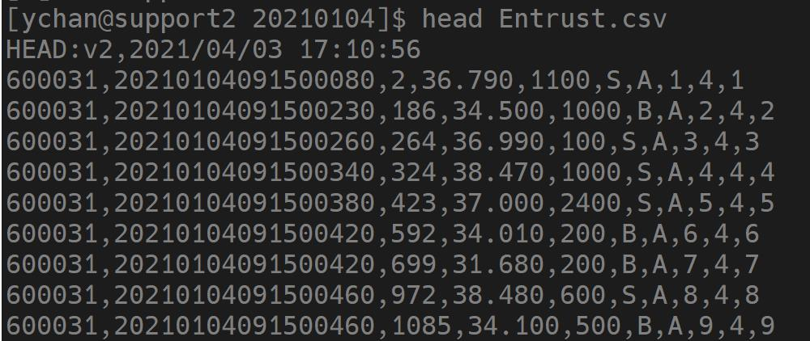
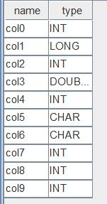

# 金融 PoC 用户历史数据导入指导手册之股票 Level-2 逐笔篇

在部署完 DolphinDB 后，将历史数据导入数据库是后续进行数据查询、计算和分析的基础。为协助用户快速导入数据，本文档基于 DolphinDB 已有的教程与大量用户的实践经验，从操作者角度出发，以 CSV 格式的文件为例，详细介绍金融行业用户导入逐笔数据的完整操作步骤。

## 1. 任务规划

在导入历史数据之前，需要先将 CSV 文件存放在部署了 DolphinDB 的服务器上，然后从 DolphinDB 数据类型兼容性的角度分析数据源，根据分析结果选择满足建库建表要求的方案，并根据表连接需求选择适合的存储方案。最后，通过合理的分区规划，完成数据导入的准备。

### 1.1. 数据源分析

#### 1.1.1. 存储 CSV 文件

列数相同的以单字符分割的格式化 CSV 文件，DolphinDB 都可以导入。如下是常见的几种格式：

* 第一行是各列的列名
* 第一行是数据，文件没有列名
* 前几行是文件注释说明，接下来才是列名或数据
* CSV 文件中缺少日期列或股票代码列，缺失的列以文件名或文件夹名的形式给出

CSV 文件需要解压好，放到 DolphinDB 所在服务器上，并确认用户有权限访问对应目录。

逐笔数据包括逐笔委托和逐笔成交，上市和深市的数据格式不同，每个市场每种数据每天的数据量大约几个 GB。当总数据量超过一周时，推荐使用多任务并行导入，并行度按天区分，每种格式的数据每天一个任务。比如：

* 一天一个 CSV 文件
* 同一天的 CSV 文件在同一个文件夹中
* 文件名中包含了日期

#### 1.1.2. 导入 CSV 文件

使用 Linux 系统的 head 等命令打开 CSV 文件，确定要导入或添加的列在 DolphinDB 数据库中的字段名称和数据类型。字段名称的确定方式如下：

* 如果 CSV 文件有列名，使用函数`extractTextSchema`提取 CSV 文件的列名和列类型作为字段名称和类型。
* 如果 CSV 文件没有列名，根据相关数据对应的说明文档确定字段名称和类型（见下文的字段类型转换）。

**字段类型转换**

DolphinDB 支持的数据类型如下图：


在这些数据类型中，整型、浮点型与其他数据库相同，可直接根据数据精度选择。DolphinDB 比较有特色的是如下两种类型：

* 字符串：在 DolphinDB 中可以把字符串保存为 SYMBOL 类型数据。一个 SYMBOL 类型数据在 DolphinDB 系统内部存储为一个整数，数据排序、查询、比较时更有效率。因此，使用 SYMBOL 类型有可能提高系统性能，同时也可节省存储空间。SYMBOL 和 STRING 的使用原则是：**重复多的有限数量的字符串使用 SYMBOL，重复少的描述性字符串使用 STRING。** 比如，股票代码，交易类型标志等使用 SYMBOL，例如 ["IBM","C","MS"] 等；备注、自定义信息等使用 STRING。在结构化的 level2 金融数据中，STRING 使用得较少。
* 时间日期：如上图所示，DolphinDB 支持丰富的时间日期类型。凡是涉及时间日期的，推荐用户根据不同精度选择对应的 DolphinDB 时间日期类型。

下图是通过 head 命令查看的上市委托数据的 CSV 文件。


从上图可以看出，这个 CSV 文件的第一行是一些说明备注信息，在后续读取的时候需要跳过。这个文件没有列名，从第二行开始是数据，共 10 列。从左至右的字段名根据上市的说明文档定义为：SecurityID, TransactTime, valOrderNoue, Price, Balance, OrderBSFlag, OrdType, OrderIndex, ChannelNo, BizIndex。

其中 SecurityID, OrderBSFlag 和 OrdType 为重复较多的有限数量的字符串，使用 SYMBOL 类型；TransactTime 为从年到毫秒的日期，使用 TIMESTAMP 数据类型；其它的字段没有特殊之处，整数用 INT，浮点数用 DOUBLE。所以，从左至右存储字段的数据类型定义为：SYMBOL, TIMESTAMP, INT, DOUBLE, INT, SYMBOL, SYMBOL, INT, INT, INT。

其它格式的 CSV 文件，也按此方式确定好字段名称和数据类型。后续数据库中按这些定义好的类型存储数据。

按上述分析定义的表结构列数和 CSV 文件完全一致。如果有特殊需要，也可以增加或减少列。只要字段名称和数据类型按顺序一一对应即可。比如计划将上市和深市的数据统一存储，那么分别分析两市的 CSV 文件，确定共同保留的列，确定字段名称和字段类型。

DolphinDB 导入数据的步骤是先把 CSV 文件读入内存，再写入硬盘。由于不同 CSV 文件对相同字段保存方式不同，CSV 文件在导入内存时不一定能正确识别出数据类型。可能需要对如下字段进行转换：

* 股票代码列：对于 002415, 600001 等数字样式，会被识别为 INT 类型，需要转为 SYMBOL 类型。如果不同代码的数字位数不同，转换时，还要按 6 位对齐
* 时间日期列：对于 20220101093000000, 20220101, 93000000 和 epoch 格式等数字样式，会被识别为 LONG 类型，需要转为 DolphinDB 的 TIMESTAMP, DATE, TIME 等精度的日期时间类型
* 一些交易标志列：对于 C, B, S 等字母样式，会识别为 CHAR 类型，需要转为 SYMBOL 类型
* 需要最终存储为 SYMBOL 类型的，只要转为 STRING 类型即可。

总而言之，CSV 数据的一些列在导入内存后，可能和期望存储到数据库中的数据类型不一致，需要进行转换。具体的转换方式也比较简单，将在后面实操章节中详细介绍。

### 1.2. 规划存储方案

分析完数据源后，需要规划如何在 DolphinDB 中基于 level2 逐笔数据建库建表。存储方案的设计原则是：**当没有表连接分析的需求时，推荐单库单表存储数据；当有表连接需求时，一库多表存储数据。**

* 沪深两市的逐笔委托和逐笔成交数据之间一般是有关联分析需求的，所以推荐一库多表。
* 上市和深市不需要合并时，建立两数据库，一个保存上市数据，另一个保存深市数据。每个数据库中分别建立两个数据表，一个数据表存储逐笔委托数据，另一个数据表存储逐笔成交数据。
* 若沪深两市的数据需要合并统一存储，则规划一个数据库，库内建两个数据表，一个数据表保存两市的逐笔委托，另一个保存两市的逐笔成交。

**DolphinDB 单表存储的数据量无上限，同一种类型的数据全部存储到一个数据表，不需要考虑分库分表。**

### 1.3. 规划分区

**规划分区是建立数据库之前最重要的一环**，有以下几点作用：

* 分区使大型表更易于管理，提高查询速度
* 分区使系统可以充分利用资源，提高计算速度
* 增加了系统的可用性

分区原理及详细教程参见：[分区数据库设计和操作](database.html)。

对于 level2 逐笔数据的场景，推荐复合分区，先按日期做值分区，再按股票代码做 HASH 分区。

分区数量由数据大小决定，TSDB 引擎每个分区数据量为压缩前 400MB-1GB，OLAP 引擎每个分区数据量为压缩前 100MB-300MB。

分区是在数据库层面进行的，同一个数据库中的不同数据表，分区方式相同。当需要关联的两表存储到同一个数据库中时，以数据量大的表为基准，按上述原则进行分区。

## 2. 导入步骤

完成分析和规划后，用户可按照本章步骤导入数据。先用单个文件进行调试，调试成功后，再使用多任务并行方式，对全量数据进行快速导入。

### 2.1. 建库建表

本教程以上海证券交易所的逐笔委托数据为例来建库建表，点击 [Entrust](https://www.dolphindb.cn/downloads/docs/LoadDataForPoc.zip) 下载用例数据。文件解压后放到 loadForPoc/SH/Order/20210104 目录下。在 DolphinDB 中，可以使用`create`语句建库建表。DolphinDB 建库时有 OLAP 和 TSDB 两种存储引擎可以选择。

本教程推荐选用 TSDB 引擎。上市每天逐笔委托数据大小在 3GB 左右，根据前面的分区规划，先按日期做值分区，再用股票代码做 7 个 HASH 分区。按日期值分区时，**VALUE 的初始值写两三天的初始值即可，实际分区值会根据数据的实际日期自动扩展**。

完整的建库代码如下：

```
if (existsDatabase("dfs://sh_entrust"))
{
 dropDatabase("dfs://sh_entrust")
}

create database "dfs://sh_entrust" partitioned by VALUE(2022.01.01..2022.01.03), HASH([SYMBOL, 10]), engine='TSDB'
```

建库完成后，开始建表。建表的关键是指定字段名称及类型，先用 head 命令在 Linux 系统下查看一下 CSV 文件的结构，如下图所示：



可以看到，这个 CSV 文件有如下特点：

* 第一行是文件说明，后续各种读取都需要跳过这一行
* 从第二行开始是数据，没有列名，在建表时需要根据数据的说明文档定义字段名称和字段类型

建表时，OLAP 引擎和 TSDB 引擎都需要指定分区字段，例如：partitioned by TransactTime,SecurityID。TSDB 引擎还有一个分区内排序字段的参数要指定，例如：sortColumns = [`SecurityID,`TransactTime]。注意字段顺序不能调换。

完整建表语句如下：

```
create table "dfs://sh_entrust"."entrust"(
 SecurityID SYMBOL,
 TransactTime TIMESTAMP,
 valOrderNoue INT,
 Price DOUBLE,
 Balance INT,
 OrderBSFlag SYMBOL,
 OrdType SYMBOL,
 OrderIndex INT,
 ChannelNo INT,
 BizIndex INT)
partitioned by TransactTime,SecurityID,
sortColumns = [`SecurityID,`TransactTime]
```

确认数据表列数时，应当根据用户需求来指定。当 CSV 文件缺少或多余某些列时，用户可使用脚本在 CSV 文件基础上增加或减少列。

在列数和 CSV 文件不一样时，确认 HASH 分区的数量，需要先将各列数据类型占用的字节数据求和，得到一行数据的大小，然后乘以数据行数，得到一天的数据大小。最后，使用一天的数据大小除以每个分区的大小，得到 HASH 分区的数量。

通常逐笔数据是不需要去重的。如果由于特定的数据源等原因，有去重的需求，可在建表时指定 keepDuplicates 参数的值，包含以下选项：

* ALL: 保留所有数据
* LAST：仅保留最新数据
* FIRST：仅保留第一条数据

### 2.2. 编写导入脚本

#### 2.2.1. 导入单个文件

DolphinDB 导入数据的核心函数是`loadTextEx`，可用于 CSV 文件读取、数据清洗和入库一体化操作。导入数据核心代码如下：

```
db = database("dfs://sh_entrust")
def transType(mutable memTable)
{
 return memTable.replaceColumn!(`col0,string(memTable.col0)).replaceColumn!(`col1,datetimeParse(string(memTable.col1),"yyyyMMddHHmmssSSS")).replaceColumn!(`col5,string(memTable.col5)).replaceColumn!(`col6,string(memTable.col6))
}
filePath = "/home/ychan/data/loadForPoc/SH/Order/20210104/Entrust.csv"
loadTextEx(dbHandle = db, tableName = `entrust, partitionColumns = `col1`col0, filename = filePath, skipRows = 1,transform = transType)
```

导入完成后，查询部分数据，代码如下：

```
select top 10 * from loadTable("dfs://sh_entrust",`entrust)
```

如果数据导入成功，查询结果如下图所示


在单个文件导入过程中可能出现的问题及解决方案如下：

* 数据类型不匹配，常见的报错信息如：“某列需要 SYMBOL 类型，实际数据类型是 INT”，此类报错提示用户进行数据类型转换。
  详细的解决方式见 [清洗转换数据](#%E6%B8%85%E6%B4%97%E8%BD%AC%E6%8D%A2%E6%95%B0%E6%8D%AE)。
* 如果系统中存在 nfs 存储介质，可能报 Bad file descriptor 的错误。这种情况要按照指定方式重新挂载一下 nfs 文件。nfs 文件需要用 v3 版本，并设置 local\_lock 参数为 all。具体的挂载命令为：

  ```
  mount -t nfs -o v3,local_lock=all [IP]:/hdd/hdd0/nfs /hdd/hdd0/DolphinDB-test/
  ```
* 执行没有任何报错，但是任务长时间执行不完，等待时间已经远超文件大小除以硬盘速度的时间，观测硬盘状态，也没有任何写入。这种情况是因为单个 CSV 文件太大了，缓存不够用，这个缓存是专门为数据入库设置的一块内存，有关缓存机制的详细介绍见：[CacheEngine 与数据库日志教程](redoLog_cacheEngine.html) 与 [DolphinDB TSDB 存储引擎介绍](tsdb_explained.html)。解决方法是：先把 OLAPCacheEngineSize 和 TSDBCacheEngineSize 两个参数的值修改为大于 CSV 文件的大小，再重启系统。

单文件完整的导入脚本下载链接为：[单文件导入](script/LoadDataForPoc/loadOneFile.dos)

#### 2.2.2. 清洗转换数据

上一节的核心导入代码中，使用了`loadTextEx`函数，其中 transform 参数引用了 transType 函数定义，其作用是数据清洗和类型转换。`loadTextEx`导入机制如下：

首先，把 CSV 文件加载到内存生成一个内存表，这个内存表的数据类型可能和之前建立的分布式数据表定义的类型不一致。可以通过指定 schema 的方式尝试进行自动转换，详见：[指定数据导入格式](import_csv.html)。无法进行自动转换的类型会提示失败。此时，我们需要使用 transform 参数引用的函数进行类型转换和数据清洗。从该函数的返回值中获得清洗转换后的数据，类型依然是一个内存表。然后，把处理好的内存表数据写到硬盘上对应数据库中的数据表内。如果 transform 参数已赋值，**分布式表的结构和 transform 参数引用的函数返回的表的结构保持一致，不用和原 CSV 文件的结构保持一致。**

transform 能够非常方便地完成但不限于如下需求：

* 数据类型的转换
* 在 CSV 文件的基础上增加列
* 过滤 CSV 文件中的无效数据
* 字符编码转换，通常用于把 GBK 编码转换为 UTF-8 编码
* 把多档数据合成 array vector

#### 2.2.3. 转换数据类型

DolphinDB 提供了读取 CSV 文件 schema 的函数`extractTextSchema`。使用以下代码提取 CSV 文件的 schema：

```
filePath = "/home/ychan/data/loadForPoc/SH/Order/20210104/Entrust.csv"
extractTextSchema(filename = filePath, skipRows = 1)
```

执行完成后，结果如下图



返回结果中，第一列 name 表示 CSV 文件中各列的列名。如果 CSV 文件数据之前没有列名信息，列名自动命名为 col0, col1 等；如果有列名信息，列名和文件中的名称保持一致。第二列 type 表示 CSV 文件中自动识别出来的各列的数据类型。这个结果表的字段和我们建表时的字段是按从上到下的顺序一一对应的，我们把二者整理到一起，如下图所示：


通过对比可以发现，内存表中的字段 col0, col1, col5, col6 与数据表中对应字段 SecurityID, TransactTime, OrderBSFlag, OrdType 的类型不同。如果此时直接进行数据导入，如下代码所示：

```
db = database("dfs://sh_entrust")
filePath = "/home/ychan/data/loadForPoc/SH/Order/20210104/Entrust.csv"
loadTextEx(dbHandle = db, tableName = `entrust, partitionColumns = `col1`col0, filename = filePath, skipRows = 1)
```

执行后发现报错：**The column [SecurityID] expects type of SYMBOL, but the actual type is INT**，即传入的 SecurityID 数据类型为整型，不符合 SYMBOL 的要求。而 transType 函数的作用就是自定义转换数据类型，赋给 transform 参数后再执行导入语句，会发现不再报错。其他字段的数据导入和类型转换依此类推。本案例中，共有四列做了转换，相关代码如下：

```
def transType(mutable memTable)
{
   return memTable.replaceColumn!(`col0,string(memTable.col0)).replaceColumn!(`col1,datetimeParse(string(memTable.col1),"yyyyMMddHHmmssSSS")).replaceColumn!(`col5,string(memTable.col5)).replaceColumn!(`col6,string(memTable.col6))
}
```

可以看到，每修改一列就增加一个`replaceColumn!`函数。这个函数的作用是使用一个向量替换 table 中指定列，替换后，指定列的数据类型与向量的数据类型一致。在这个案例中，它的第一个参数是数据表的列名，第二个参数是使用相关函数对内存表的指定列处理之后的数据。所以，数据类型的转换的关键在于`replaceColumn!`函数第二个参数的写法。在金融数据的导入实践中，主要有以下几类：

* 时间日期为 epoch 格式，也就是指定时间减去 1970-01-01 00:00:00 的差值。这个差值可以到秒、毫秒等，它是一串纯数字，会自动识别成整数。在转换时，直接把这个整数传递给 DolphinDB 对应时间日期类型的函数即可，如需精确到秒，使用`datetime`，精确到毫秒使用`timestamp`，精确到纳秒使用`namotimestamp`。逐笔数据一般精确到毫秒，类型转换函数的写法为：

  ```
  def transType(mutable memTable)
  {
     return memTable.replaceColumn!(`epochTimeCol,timestamp(memTable.epochTimeCol))
  }
  ```
* 时间是日期格式，是纯数字组成的年月日时分秒等，中间没有分割符。比如 20220101，20220101093000 等，这些格式会被识别为整数。转换时，先把这些数字使用`string`函数转成字符串，再用`temporalParse`格式化成对应的日期格式。逐笔数据一般精确到毫秒，这种类型转换函数的写法为：

  ```
  def transType(mutable memTable)
  {
     return memTable.replaceColumn!(`ymdTimeCol,datetimeParse(string(memTable.ymdTimeCol),"yyyyMMddHHmmssSSS"))
  }
  ```
* 股票代码是纯数字，会识别成整数。股票代码推荐定义为 SYMBOL 类型，在内存表中，只要使用`string`函数把其转化为字符串格式，在导入时，就能够自动存储为 SYMBOL 类型。此外，股票代码一般是 6 位，以零开头的需要用`lpad`函数要进行补齐。纯数字股票代码列转换的函数写法为

  ```
  def transType(mutable memTable)
  {
     return memTable.replaceColumn!(`securityId,lpad(string(memTable.securityId),6,`0))
  }
  ```

#### 2.2.4. 文件名给出某列信息，在 CSV 文件的基础上增加此列

有些时候，CSV 文件会缺少某些列，比如确少日期，然后，通过文件名给出了日期信息。其中所有数据的日期都和文件名相同。这种情况我们通过 transform 参数引用的函数，增加列并赋值。代码如下：

```
def addCol(mutable memTable,datePara)
{
    update memTable set date = datePara
    return memTable
}
```

新增的列总是在最后，如果和分布式表的顺序不一致，在这个函数返回之前，先用`reorderColumns!`函数调整成一致。

#### 2.2.5. 过滤数据

有些情况下，需要把 CSV 文件中的一些无效数据过滤掉再写入分布式表。在 transform 参数引用的函数中使用 select 筛选出符合条件的数据即可，比如我们只写入价格大于 0 的数据，函数定义的代码为：

```
def fliterData(mutable memTable)
{
    return select * from memTable where price > 0
}
```

#### 2.2.6. 转换字符编码转换

为了显示正常，有时候需要把 GBK 编码的列转成 UTF-8。transform 参数引用的函数的代码为：

```
def addCol(mutable memTable)
{
    return mutable.replaceColumn!(`custname,toUTF8(mutable.custname,`gbk))
}
```

#### 2.2.7. 导入部分列

导入部分列有两种方法，一是在 transform 参数引用的函数中筛选出需要的列，代码如下：

```
def partCol(mutable memTable)
{
    return select [需要的部分列名] from memTable
}
```

方法二是通过指定 schema 的方式，详见如下链接的教程 2.4 节：[导入指定列](import_csv.html)

#### 2.2.8. 并行导入

并行导入能够快速导入数据，这种导入方法会占用比较多的内存，所以在导入前，要配置合理的并行度。workerNum 可以控制并行度，估算方式为，**可用内存除以一天的文件大小，得到 workerNum 的值。** 可用内存的值是由 maxMemSize 参数确定的，一般配置为机器可用内存的 80%。此外，也要确保，maxMemSize 的值不大于 license 文件限制的内存大小。

并行导入时，多个任务不能同时写入一个分区，在做任务分配时，要确保不同任务写入不同的分区。因为一级分区为天，不同日期的数据会写到不同的分区。所以，推荐以每天数据与任务一一对应的方式来并行导入。

本案例批量导入了 2021 年 01 月 05 日到 01 月 15 日期间，9 个工作日的逐笔委托数据。为了方便下载，每天的数据限定为 180MB 左右，点击此处下载数据：[批量导入数据](https://www.dolphindb.cn/downloads/docs/LoadDataForPoc.zip)。由于之前单个文件导入的 CSV 文件比较大，在进行并行导入前，推荐先把单个导入的文件删除。批量导入的基本步骤如下：

1. 在单个 CSV 文件导入的基础上，把一天的数据导入封装为一个函数
2. 用异步任务的方式提交一批任务，按天进行批量导入。
3. 如果两市的数据合并成一张表，则需要分别并行导入，不同市场的数据同时并行导入意味着不同任务同时写入一个分区，会报错。

异步任务的详细用法见：[DolphinDB 教程：作业管理](job_management_tutorial.html)。代码如下：

```
def loadOneDayFile(db,table,filePath)
{
 csvFiles = exec filename from files(filePath) where filename like"%.csv"
 for(csvIdx in csvFiles)
 {
  loadTextEx(dbHandle = db, tableName = table, partitionColumns = `col1`col0, filename = filePath + "/"  + csvIdx, transform = transType, skipRows = 1)
 }
}

def parallelLoad(allFileContents)
{
 db = database("dfs://sh_entrust")
 table = `entrust
 dateFiles = exec filename from files(allFileContents) where isDir = true
 for(dateIdx in dateFiles)
 {
  submitJob("parallelLoad" + dateIdx,"parallelLoad",loadOneDayFile{db,table,},allFileContents + "/" + dateIdx)
 }
}

allFileContents = "/home/ychan/data/loadForPoc/SH/Order"
parallelLoad(allFileContents)
```

以上代码定义了以下两个函数：

* loadOneDayFile，导入一天某种类型的数据。由于一天数据可能有多个 CSV 文件，因此需要在该函数内遍历目录下所有 CSV 文件后逐个导入。该函数使用 3 个入参：

  + db，数据库句柄。
  + table，表名。
  + filePath，目录参数，截止到日期一级。
* parallelLoad，包含唯一参数 allFileContents，参数值为目录，最小级别为快照、逐笔委托、逐笔成交等。parallelLoad 函数遍历指定目录下的所有日期作为任务参数，调用 loadOneDayFile 按日期提交任务。

loadOneDayFile 和 parallelLoad 这两个函数的写法不唯一，可以根据数据的存储格式参考本案例代码灵活设计。主要目的是按天提交任务，每个任务导入某种数据一天的数据。这些代码执行完成后，会马上返回，所提交的异步任务会在后台执行，可以调用`getRecentJobs`函数查看后台的任务执行情况。任务情况如下图所示：


上图重 startTime 字段不为空，表示该任务已经在执行；endTime 不为空，表示该任务已经执行完成；errorMsg 字段不为空，说明这个任务执行出错了，根据这个错误信息对代码进行调试。

errorMsg 可能的错误信息及解决方式如下：

* 报错信息类似于：Retrieve directory content [/home/ychan/data/loadForPoc/SH/Order20210108]: No such file or directory。导入时文件找不到，一般是路径拼接的时候出错，尤其是反斜杠字符“/”容易多写或漏写，需要仔细检查查
* 报错信息为 Out of memory，根本原因是内存不够用了。需要增加可用内存或降低并发度
* 报错信息类似于：<ChunkInTransaction>filepath '/tickHot/20221125/Key0/5ncmg' has been owned by transaction 9702796 RefId:S00002。原因是分区冲突，不同任务往同一个分区写数据了，需要检查不同日期的数据是不是放乱了，任务分割是否合理

完整的批量导入脚本链接为：[批量导入](script/LoadDataForPoc/parallelLoad.dos)

#### 2.2.9. 监测导入状态

在数据导入的过程中，如果对导入的性能存在疑虑，可以通过一些工具观测系统资源使用情况，判断是否存在资源利用的瓶颈。在 Linux 系统的终端中输入 dstat 命令，可以查看硬盘写入情况。如下图所示：


并行导入追求高速的写入性能，通过配置多块磁盘，可发挥硬盘并行 IO 的能力。通过单机配置文件 dolphindb.cfg 或集群配置文件 cluster.cfg 中的 volumes 参数进行磁盘配置。

并行导入时，通过观察硬盘的写入速度、内存消耗情况、CPU 利用率、集群间网络速率，查看资源使用情况。如果内存、CPU 和集群间网络都还有盈余，硬盘的 IO 还没有饱和，可以把 workerNum 配置修改的大一些，提升并行度。

总而言之，通过对并行任务的合理调度，充分利用某一类硬件的物理性能，达到硬件可以支持的最大导入速度。

## 3. 附件

本章再以问答的形式，对导入时可能遇到的问题进行总结。

1. 只提交了一个文件的导入，长时间执行不完，硬盘也没有写入，这是什么原因？

   答：这是因为单个 CSV 文件太大了，缓存不够用。这个缓存是专门为数据入库设置的一块内存，
   详细的介绍见：[CacheEngine 与数据库日志教程](redoLog_cacheEngine.html) 与 [DolphinDB TSDB 存储引擎介绍](tsdb_explained.html)。

   解决方法是：先把 OLAPCacheEngineSize 和 TSDBCacheEngineSize 两个参数的值修改为大于 CSV 文件的大小，再重启系统。
2. 导入时，时间是年月日时分秒结构的纯数字类型，如何转化为 DolphinDB 的时间日期格式？

   答：解决方法见本篇文章 [清洗转换数据](#%E6%B8%85%E6%B4%97%E8%BD%AC%E6%8D%A2%E6%95%B0%E6%8D%AE) 的时间类型转换部分。
3. 导入时，时间是 epoch 格式，也就是指定时间减去 1970-01-01 00:00:00 的差值，如何转化为 DolphinDB 的时间日期格式？

   答：解决方法见本篇文章 [清洗转换数据](#%E6%B8%85%E6%B4%97%E8%BD%AC%E6%8D%A2%E6%95%B0%E6%8D%AE) 的时间类型转换部分。
4. 导入时，股票代码列是纯数字，如何转成 SYMBOL 类型。

   答：解决方法见本篇文章 [清洗转换数据](#%E6%B8%85%E6%B4%97%E8%BD%AC%E6%8D%A2%E6%95%B0%E6%8D%AE) 的股票代码类型转换部分。
5. 执行过程中，报 out of memory 错误，怎么处理？

   答：这是因为导入过程中内存不够用了。如果使用的是社区版本 license，请联系负责支持的销售人员，获取试用版本 license。然后，查看 maxMemSize 参数的配置是否远小于系统内存，建议配置为系统内存的 80%。最后，检查 workerNum 配置，合理配置值的计算方法为：可用内存除以单个文件大小向下取整得到 workerNum 的值。
6. nsf 系统导入时，报 Bad file descriptor 错误，怎么解决？

   答：如果我们存储系统中存在 nfs 文件，那么 nfs 文件需要用 v3 版本，并设置 local\_lock 参数为 all 的方式进行挂载。具体的挂载命令为：

   ```
   mount -t nfs -o v3,local_lock=all [IP]:/hdd/hdd0/nfs /hdd/hdd0/DolphinDB-test/
   ```

   如果不是这种挂载方式，需要先卸载，再使用这种方式重新挂载。
7. 如何在 DolphinDB 中 LoadTextEx 导入数据时，过滤无效数据？

   答：过滤方法是在 transform 引用的函数中做清洗。解决方法详见 [清洗转换数据](#%E6%B8%85%E6%B4%97%E8%BD%AC%E6%8D%A2%E6%95%B0%E6%8D%AE) 的过滤无效数据部分。
8. 向 DolphinDB 数据库导入 CSV 数据时还要再加上 2 列怎么办？

   答：增加方法是在 transform 引用的函数中做增加。解决方法详见 [清洗转换数据](#%E6%B8%85%E6%B4%97%E8%BD%AC%E6%8D%A2%E6%95%B0%E6%8D%AE) 的 增加列部分。
9. 符合如何导入部分列？

   答：方法详见[清洗转换数据](#%E6%B8%85%E6%B4%97%E8%BD%AC%E6%8D%A2%E6%95%B0%E6%8D%AE) 导入部分列。
10. 数据如何去重复？

    答：建表时指定 keepDuplicates 参数的值可以去重，包含以下选项：

    * ALL: 保留所有数据
    * LAST：仅保留最新数据
    * FIRST：仅保留第一条数据

