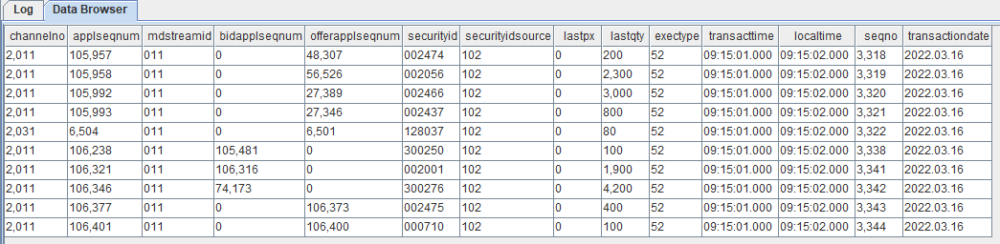

# 检查是否安装成功
odbcinst -j
```

期望输出

```
unixODBC 2.x.x
DRIVERS............: /etc/odbcinst.ini
SYSTEM DATA SOURCES: /etc/odbc.ini
FILE DATA SOURCES..: /etc/ODBCDataSources
USER DATA SOURCES..: $HOME/.odbc.ini
SQLULEN Size.......: 8
SQLLEN Size........: 8
SQLSETPOSIROW Size.: 8
```

可以查看到 ODBC 驱动路径（`/etc/odbcinst.ini`）和系统数据源路径（`/etc/odbc.ini`）

#### 安装 Redshift.ODBC 驱动

Redshift 配置 ODBC 连接可参考[配置 ODBC 连接](https://docs.aws.amazon.com/zh_cn/redshift/latest/mgmt/configure-odbc-connection.md)

1. 下载 ODBC 驱动到本地

   Ubuntu 选择 Linux 操作系统 64 位 (.deb)，CentOS 选择 Linux 操作系统 64 位 (.deb)

   
2. 安装 ODBC 驱动

   在终端输入以下语句进行安装

   ```
   #Ubuntu
   dpkg -i ./AmazonRedshiftODBC-1.x.x.xxxx-x.x86_64.deb

   #CentOS
   yum --nogpgcheck localinstall AmazonRedshiftODBC-64-bit-1.x.xx.xxxx-x.x86_64.rpm
   ```

   安装成功后，会在 `/opt/amazon/redshiftodbc/Setup` 下生成两个配置文件 `odbc.ini` 和 `odbcinst.ini`

   将这两个文件复制到上文中提到的 ODBC 驱动路径 /etc/odbcinst.ini 和 /etc/odbc.ini

   ```
   cp /opt/amazon/redshiftodbc/Setup/odbcinst.ini /etc/
   cp /opt/amazon/redshiftodbc/Setup/odbc.ini /etc/
   ```
3. ODBC URL 配置

   复制 ODBC URL 将其添加到 `/etc/odbc.ini` 文件中

   ```
   [Redshift]
   Driver=Amazon Redshift (x64);
   Server=Your server;
   Database=Your database
   ```
4. 数据库安全组开放

   预设情况下，用户创建的任何集群对所有人关闭。IAM 凭证仅控制对 Amazon Redshift API 相关资源的访问 AWS Redshift 控制台、命令行界面 (CLI)、API 和开发工具包。要能够通过 JDBC 或 ODBC 从 SQL 客户端工具访问集群，用户可以使用安全组

   * 将安全组的 inbound 规则设置如下，开放5439端口给外部

     
   * 编辑集群的属性,修改网络和安全设置，设置 VPC 安全组为刚才创建的安全组，并启用可公开访问。

     
5. 验证 ODBC 连接成功

   在终端输入以下命令(使用数据库的实际登录信息)

   ```
   isql redshift UID PWD
   ```

   期望返回

   ```
   +---------------------------------------+
   | Connected!                                   |
   |                                                    |
   | sql-statement                               |
   | help [tablename]                          |
   | quit                                             |
   |                                                    |
   +----------------------------------------+
   SQL>
   ```

### 利用 DolphinDB 脚本同步数据

1. 运行以下命令加载 ODBC 插件

   ```
   login("admin","123456")
   loadPlugin("./plugins/odbc/PluginODBC.txt")
   ```
2. 创建 DolphinDB 相应的分区表

   ```
   db=database("dfs://redshift",HASH,[INT,10]);
   dt=table(300000000:0,["channelno","applseqnum","mdstreamid","bidapplseqnum","offerapplseqnum","securityid","securityidsource","lastpx","lastqty","exectype","transacttime","localtime","seqno","transactiondate"],[INT,INT,SYMBOL,INT,INT,SYMBOL,SYMBOL,DOUBLE,DOUBLE,INT,TIME,TIME,INT,DATE]);
   pt=createPartitionedTable(db,dt,"dfstable","channelno");
   ```
3. 运行以下命令建立与 Redshift 的连接

   ```
   conn = odbc::connect("Driver={Amazon Redshift (x64)}; Server=Your server; Database=Your database;User=UID;Password=PWD;")
   ```
4. 运行以下脚本将数据迁移到 DolphinDB 中

   ```
   # pt 为创建的分区表
   odbc::query(conn, "select * from trades_sz",pt)
   ```

   ```
   startTime                        endTime
   2022.12.20 17:22:12.644          2022.12.20 17:48:09.618
   ```

   最终迁移3亿条数据，耗时仅为1610秒。该迁移案例测试的硬件环境为：

   * CPU：11th Gen Inter(R) Core(TM) i5-11500 @2.70GHz
   * 处理器个数：12 个
   * 单个处理器核数：6 核
   * 内存大小：32 GB
   * 网络传输速率：21508 MiB/s
5. 查看表中数据

   ```
   select top 10 * from pt
   ```

   

## 附录

[完整脚本](script/Migrate_data_from_Redshift_to_DolphinDB/Redshift2DDB.txt)

