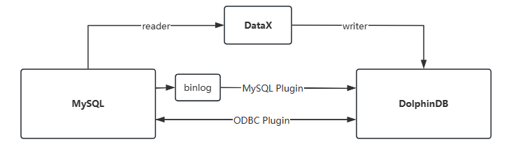

# 从 MySQL 迁移到 DolphinDB

将数据从 MySQL 导入到 DolphinDB，或从 DolphinDB 导出数据到 MySQL，有多种实现方法，常用的方法如下图所示：



本节会介绍其中最常用的两种方法 : 通过 MySQL 插件，ODBC 插件实现数据的导入和导出。

注： 另外一种通用的导入导出方法是使用 DataX 平台，使用 DataX 中间件的方法可参考[从 Oracle 迁移到
DolphinDB](Oracle_to_DolphinDB.md)。

DolphinDB 提供了两个插件用于 MySQL 和 DolphinDB 之间进行即时数据交互。其中 MySQL 插件是专门针对 MySQL 的 Binlog
机制而设计的专用高速读取插件，它支持高效的将 MySQL 的数据同步到 DolphinDB 中。

MySQL 插件加载数据的方式有两种，一种是通过 load 方法将 MySQL 的数据加载到 DolphinDB
内存表中，通常用于数据量不大（如1GB以内）时快速读取数据的场景。另一种是通过 loadEx
方法，支持以分布式的方式将数据加载、清洗、入库一次性完成，通常用于海量数据迁移的场景。而 ODBC 插件是针对所有支持 ODBC 访问协议的数据库设计，它能够让
DolphinDB 访问任何支持 ODBC 协议的数据库，包括 MySQL 数据库，并且该插件支持从源库读取和回写数据到源库。

| **插件名称** | **使用场景** | **性能** |
| --- | --- | --- |
| ODBC | 读取，回写 | 中 |
| MySQL | 读取 | 高 |

## 插件安装

首先要在 DolphinDB 中加载 MySQL 插件，本章涉及的两个插件 MySQL 和 ODBC 插件，都是默认安装的，只需要执行如下脚本即可加载插件。

加载 MySQL 插件：

```
loadPlugin("mysql")
```

加载 ODBC 插件：

```
loadPlugin("odbc")
```

本节的脚本演示将以 Snapshot 表为例，在 MySQL 中创建 Snapshot 表的脚本如下：

```
// 在 MySQL 中执行
create database mysqldb;
create table mysqldb.snapshot(
    Dates VARCHAR(10),
    DateTime TIMESTAMP,
    SecurityID VARCHAR(50),
    BidPrice DOUBLE,
    PreClosePx DOUBLE
);
insert into mysqldb.snapshot (Dates,DateTime,SecurityID,bidPrice,PreClosePx)
values('2024-01-01','2024-01-01 12:00:00','SID001',1.2345,6.789);
```

在 DolphinDB 中创建 Snapshot 表的脚本如下：

```
// 在 DolphinDB 中执行
create database "dfs://Level2DB" partitioned by VALUE([2024.01.01]),HASH([SYMBOL,20]),engine='TSDB'
create table "dfs://Level2DB"."snapshot" (
    Dates DATE,
    DateTime TIMESTAMP,
    SecurityID SYMBOL,
    BidPrice DOUBLE[],
    PreClosePx DOUBLE
)
partitioned by _"DateTime",_"SecurityID"
sortColumns=["SecurityID","DateTime"],
keepDuplicates=ALL
```

## 使用 MySQL 插件的 load 方法导入数据

以从 MySQL 的快照行情数据集 Snapshot 导入 DolphinDB 为例，本小节将通过 MySQL 插件，将数据导入到内存表中，并清洗入库。

**通过 MySQL 插件加载数据**

MySQL 插件支持以 DolphinDB 数据节点作为客户端。向 MySQL 发起 SQL 查询，然后将查询获取的数据，序列化成 DolphinDB
的内存表。在数据加载过程中，MySQL 的数据类型会自动匹配和转化成 DolphinDB 的内置数据类型（详见 [MySQL > 支持的数据类型](../plugins/mysql/mysql.html#%E6%94%AF%E6%8C%81%E7%9A%84%E6%95%B0%E6%8D%AE%E7%B1%BB%E5%9E%8B)）。以上导入流程通过插件提供的 `load`
方法来实现，示例代码如下：

```
conn = mysql::connect(`127.0.0.1, 3306, `root, `root, `mysqldb)
tb = mysql::load(conn, "SELECT * FROM snapshot WHERE DATES = '2024-01-01'")
tb.schema()
```

**数据清洗**

在将数据从 MySQL 导入到 DolphinDB 内存表，并保存到分布式数据库中时，除了自动识别和匹配数据类型外，还可以做数据清洗和数据转换工作。以下将通过
DolphinDB 的脚本，实现 3 种常见的数据转换方式，案例中使用的 `replaceColumn!`
函数可用于转换内存表列类型，它在数据处理过程中很常用。

* 时间类型适配转换

  MySQL中的时间类型和DolphinDB中的时间类型并不是一一对应的，很多用户
  将时间类型以字符串的形式存储在MySQL中，在这些情况下，load函数无法
  自动匹配，需要用户通过脚本来显式指定转换。

  ```
  tb.replaceColumn!("DATES",tb["DATES"].string().temporalParse('yyyy-MM-dd'))
  ```
* 字符串类型枚举优化

  SYMBOL是DolphinDB专有的数据类型，是带有枚举属性的特殊字符串类型，可
  以将具备标签属性的字符串（如股票代码、设备编号等）保存成DolphinDB的
  SYMBOL类型。数据在DolphinDB系统内部会被存储为整数，这会使数据排序
  和比较更有效率，可以提升数据存取和压缩的性能。脚本如下。

  ```
  tb.replaceColumn!("SecurityID",tb["SecurityID"].symbol())
  ```
* 将多个字段组合成数组向量

  可将表的多个字段数据拼接为一个数组向量，如把多档数据或设备振动监测数据存储为 DOUBLE
  类型的数组向量，极大的提升数据分析与计算的效率。脚本如下。

  ```
  tb.replaceColumn!("bidPrice",fixedLengthArrayVector(tb["bidPrice"]))
  ```

**数据持久化**

将内存表中的数据持久化保存到 DFS 分布式文件系统中，仅需要通过 `tableInsert`
函数写入到分布式表。该操作的前提是系统中已经创建了对应的分布式表，完成了分区规划。使用如下脚本完成数据入库。

```
dfsTable = loadTable("dfs://Level2DB", "snapshot")
tableInsert(dfsTable, tb)
```

## 使用 MySQL 插件的 loadEx 方法导入数据

除了通过显式构建内存表入库的方法，MySQL 插件还提供了 `loadEx`
方法，可以将数据加载、清洗、入库一次性完成。这种方法的好处是可以通过 pipeline 机制将多个处理步骤串联起来，实现数据的分段流式处理。pipeline
能够将数据在各个步骤之间流动，并且提供回调转换函数，用户可以方便的指定数据清洗处理逻辑，例如数据过滤、转换、聚合等操作。这样一来，可以大大简化数据处理的流程，提高处理效率，同时降低代码的复杂度。以下通过三个案例，展示如何使用
`loadEx` 函数将 MySQL 数据直接导入分布式表。

### 直接原表导入

当 MySQL 的表结构与 DolphinDB 的分布式表结构完全匹配，并且无需数据清洗时，可以用简单的脚本实现表对表的全量数据导入。创建与 MySQL
字段类型相同的表：

```
create table "dfs://Level2DB"."snapshot_same" (
Dates STRING,
DateTime TIMESTAMP,
SecurityID STRING,
BidPrice DOUBLE,
PreClosePx DOUBLE
)
partitioned by _"DateTime",_"SecurityID"
sortColumns=["SecurityID","DateTime"],
keepDuplicates=ALL
```

直接表对表全量数据导入：

```
db = database("dfs://Level2DB")
mysql::loadEx(conn, db,"snapshot_same", `DateTime`SecurityID, `snapshot)
select * from loadTable("dfs://Level2DB", "snapshot_same")
```

### 通过 SQL 导入

当需要选取部分导入数据时，可以通过 SQL 语句筛选 MySQL 数据。通过构造 SQL
脚本的方式实现数据字段选取、时间范围选取、数据过滤、转换、聚合等功能。

```
db = database("dfs://Level2DB")
mysql::loadEx(conn, db,"snapshot_same", `DateTime`SecurityID, "SELECT * FROM snapshot LIMIT 1")
select * from loadTable("dfs://Level2DB", "snapshot_same")
```

### 导入前对 MySQL 表进行转换

在 MySQL 数据写入 DolphinDB 分布式表前，如需要对加载的数据进行二次处理，可以在 loadEx
的传入参数中指定处理加载数据的函数。以下脚本构建了一个自定义函数
`replaceTable`，将数据处理的脚本统一封装到函数中，以自定义编码方式进行二次数据处理。

```
db = database("dfs://Level2DB")
def replaceTable(mutable t){
    t.replaceColumn!("DATES",t["DATES"].string().temporalParse('yyyy-MM-dd'))
    t.replaceColumn!("SecurityID",t["SecurityID"].symbol())
    t.replaceColumn!("bidPrice",fixedLengthArrayVector(t["bidPrice"]))
    return t
}
t=mysql::loadEx(conn, db, "snapshot",`DateTime`SecurityID, 'select * from snapshot limit 1 ',,,,replaceTable)
```

## 使用 ODBC 插件导入数据

通过ODBC插件，可以连接 MySQL 或其他数据源，将数据导入到DolphinDB数据库， 或将 DolphinDB 内存表导出到 MySQL 或其他数据库。

以导入快照行情数据集 Snapshot 为例，通过 ODBC 插件，将数据导入到内存表中，并清洗入库。

* 通过 ODBC 插件连接 MySQL 数据库
* 通过 ODBC 插件加载数据并导入分布式表中

ODBC 插件支持以 DolphinDB 数据节点作为客户端，向 MySQL 发起查询请求，然后将查询获取的数据，转化成 DolphinDB
的内存表的格式。上述操作通过插件提供的 `query`方法完成，示例代码如下。

```
tb = odbc::query(conn1,"SELECT * FROM mysqldb.snapshot WHERE Dates = '2024-01-01'")
dfsTable = loadTable("dfs://Level2DB", "snapshot_same")
tableInsert(dfsTable, tb)
odbc::close(conn1)
```

ODBC 插件与 DolphinDB 的数据结构自动转换表可参考 [ODBC > 类型支持](../plugins/odbc/odbc.html#%E7%B1%BB%E5%9E%8B%E6%94%AF%E6%8C%81)。

## 并行导入大数据量的 MySQL 数据

MySQL 插件的 `loadEx` 函数支持分布式的导入。可以通过 SQL 语句将 MySQL 的海量数据切分成合适大小（如100
M左右），再将数据并行导入。这样既可以利用 DolphinDB
的分布式特性，又可以避免因一次性导入数据量过大而引起的查询进程堵塞、内存资源不足等问题。具体执行时，应按照 DolphinDB
分布式表的分区字段（如日期、股票代码、设备编号等）进行切分规则的设计，这样可以避免多个进程同时写入一个分区时出现分区冲突。

以下通过一个案例脚本，将 MySQL 保存的海量数据按分区字段切分，并导入 DolphinDB。 本案例中 MySQL 和 DolphinDB
的表结构如下表所示。

| **数据库** | **数据库名** | **表名** | **主要字段描述** |
| --- | --- | --- | --- |
| MySQL | demo | sample | ts（时间戳），id（STRING 类型），val（值） |
| DolphinDB | dfs://demo | sample | ts（时间戳），id（SYMBOL 类型），val（值） |

MySQL 的建表语句如下：

```
// 在 MySQL 中执行
create database demo;
create table demo.sample(
    ts VARCHAR(20),
    id VARCHAR(10),
    val DOUBLE
   );
insert into demo.sample (ts,id,val) values('2024-01-01 12:00:00','SID001',1.2);
insert into demo.sample (ts,id,val) values('2024-01-01 12:00:00','SID002',2.3);
insert into demo.sample (ts,id,val) values('2024-01-01 12:00:00','SID003',3.4);
insert into demo.sample (ts,id,val) values('2024-01-01 12:00:00','SID004',4.5);
insert into demo.sample (ts,id,val) values('2024-01-01 12:00:00','SID005',5.6);
insert into demo.sample (ts,id,val) values('2024-01-02 12:00:00','SID001',6.7);
insert into demo.sample (ts,id,val) values('2024-01-02 12:00:00','SID002',7.8);
insert into demo.sample (ts,id,val) values('2024-01-02 12:00:00','SID003',8.9);
insert into demo.sample (ts,id,val) values('2024-01-02 12:00:00','SID004',9.1);
insert into demo.sample (ts,id,val) values('2024-01-02 12:00:00','SID005',1.2);
```

DolphinDB 分布式表的分区方式为二级分区：一级分区是 ts 字段按天分区，二级分区是 id 字段哈希分区。

```
// 在 DolphinDB 中执行
create database "dfs://demo" partitioned by VALUE([2024.01.01]),HASH([SYMBOL,10]),engine='TSDB'
create table "dfs://demo"."sample" (
    ts DATETIME,
    id SYMBOL,
    val DOUBLE
    )
partitioned by "ts", "id"
sortColumns=["id","ts"],
keepDuplicates=ALL
```

循环导入的脚本如下所示：

```
// 按日期循环
dates=2024.01.01 .. 2024.01.02
// 按ID编号循环
IDs=`SID001`SID002`SID003`SID004`SID005
// 数据字段转换（ETL）
def replaceTable(mutable t){
    t.replaceColumn!("ts",t["ts"].string().temporalParse('yyyy-MM-dd HH:mm:ss'))    // 替换表中字段类型以及值
    t.replaceColumn!("id",t["id"].symbol())    // 替换表中字段类型以及值
    return t    // 返回修改后的表
}
// 循环导入
for(d in dates){
    for(id in IDs){
        strSQL="select * from demo.sample where id='"+string(id)+"' and date(ts)=date('"+ datetimeFormat(d,"yyyy-MM-dd") +"') "
        dbName="dfs://demo"
        tableName="sample"
        partitionSchema=`ts`id
        mysql::loadEx(conn,database(dbName),tableName,partitionSchema,strSQL,,,,replaceTable)
    }
}
// 检查导入结果
select * from loadTable("dfs://demo","sample")
```

实际应用时，应注意合理规划循环次数和 SQL 语句所筛选的数据量，过高的并发量可能会影响 MySQL 的正常使用，该方案的性能瓶颈通常会出现在 MySQL
的读取效率上。如需降低 MySQL 和查询服务器的负载，可在循环中使用 sleep （暂停函数）控制并发处理量。如需自动持续迁移数据，可结合
`submitJob` （批处理作业函数）编写自动运行脚本。

## 同步 MySQL 基础信息数据

我们通常会将业务的一些基础信息和配置参数保存在 MySQL 上，当业务系统与 DolphinDB 大数据平台融合时，会产生基础信息同步的需求。同步到 DolphinDB
的基础信息 表可直接与时序数据关联，方便进行数据的查询与分析。本节通过 DolphinDB 的 `cachedTable` 函数，实现在
DolphinDB 中缓存并定时同步 MySQL 基础信息数据的功能。

```
// 在 MySQL 中执行
use mysqldb;
create table mysqldb.configDB(id int,val float);
INSERT INTO configDB(id,val) VALUES(1,RAND());
```

以下脚本实现了 DolphinDB 每分钟同步 MySQL 中的配置信息表（mysqldb.config）的功能。

```
login("admin","123456")
// 加载MySQL插件
loadPlugin("MySQL")
use mysql
// 自定义数据同步函数
def syncFunc(){
	// 获取MySQL数据
	conn = mysql::connect("127.0.0.1",3306,"root","123456","mysqldb")
	t = load(conn,"config")
	// 返回表
	return t
}
config = cachedTable(syncFunc,60)
select * from config
```

同步的配置信息保存在维度表 config 中，可以在脚本中直接使用 config
表，无需关注同步过程，极大的简化了开发结构。需要注意的是，该方法使用的是轮询机制，并不适用于同步实时性要求高的业务数据。

## 注意事项与常见问题

MySQL 插件数据类型转化说明

* DolphinDB 中数值类型均为有符号类型。为了防止溢出，所有无符号类型会被转化为高一阶的有符号类型。例如，无符号 CHAR 转化为有符号 SHORT，无符号
  SHORT 转化为有符号 INT，等等。64位无符号类型不予支持。
* DolphinDB 不支持 unsigned long long 类型。若MySQL中的类型为 bigint unsigned,
  可在`load`或者`loadEx`的 schema 参数中设置为 DOUBLE 或者
  FLOAT。
* DolphinDB 中各类整型的最小值为空值，如 CHAR 的-128，SHORT 的-32,768，INT 的-2,147,483,648以及 LONG
  的-9,223,372,036,854,775,808。
* IEEE754 浮点数类型皆为有符号数。
* 浮点类型 float 和 double 可转化为 DolphinDB 中的数值相关类型 (BOOL, CHAR, SHORT, INT, LONG,
  FLOAT, DOUBLE)。
* newdecimal/decimal 类型目前仅可转化为 DOUBLE。
* 长度不超过10的 char 和 varchar 将被转化为 SYMBOL 类型，其余转化为 STRING 类型。string 类型可以转化为 DolphinDB
  中的字符串相关类型 (STRING, SYMBOL)。
* enum 类型默认转化为 SYMBOL 类型，可以转化为 DolphinDB 中的字符串相关类型 (STRING, SYMBOL)。

