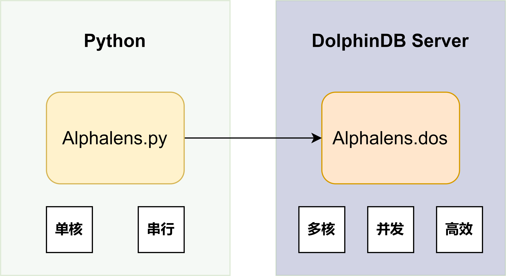
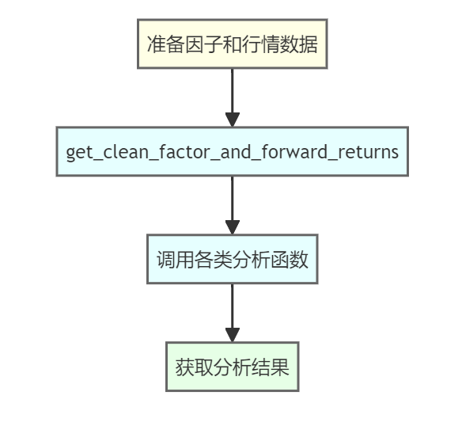
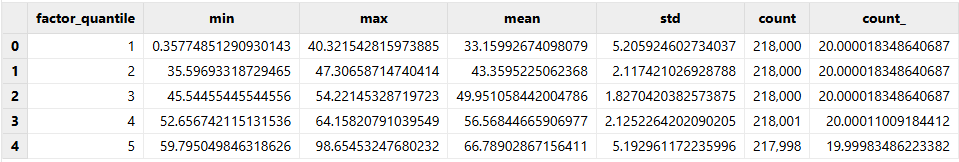
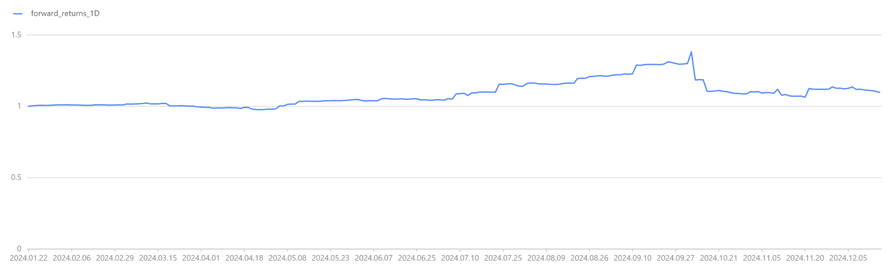
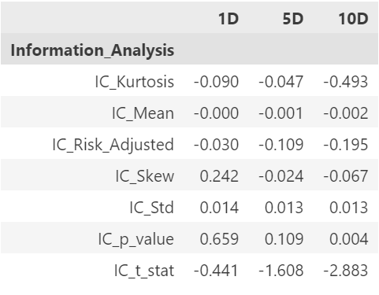

# Alphalens 在 DolphinDB 中的应用：因子分析建模实践

多因子投研一直都是量化投资领域当中的重要基石，Alphalens 和 DolphinDB，作为知名的单因子分析框架和基于高性能时序数据库的时序计算平台，无疑是备受瞩目的两大因子投研利器。当二者相结合，将碰撞出怎样令人期待的火花？

## 1. Alphalens 和 DolphinDB 的简介

Alphalens 是 Quantopian 用 Python 开发的一个因子分析（评价）工具包。我们用 DolphinDB 的脚本语言实现了一个模块，这样就可以在 DolphinDB Server 上直接使用这个工具，不仅方便，也大大提升了性能。



## 2. Alphalens 因子分析模块介绍

### 2.1 Alphalens 模块架构和基本概念

对于该模块的使用，可以抽象为三个层级:

* 数据存储层：利用 DolphinDB 的分布式存储引擎和计算引擎，可以高效存储和并行计算海量的行情、因子数据。
* 计算分析层：基于 DolphinDB 脚本语言实现的 Alphalens 模块，能够提供专业的因子分析框架。对数据进行数据清洗、投资组合评估等复杂业务逻辑的计算处理。
* 可视化交互层：基于 Python 的 Jupyter Notebook，通过交互式的数据可视化工具展现分析结果。

在执行效率上，对于大量因子的单因子分析，可以通过 DolphinDB 内置的 [peach](https://docs.dolphindb.cn/zh/funcs/ho_funcs/peach.html) 函数并发调用 Alphalens 分析模块，同时借助高效执行的向量化引擎进行具体计算，从而在保证准确性的同时充分利用 DolphinDB 分布式计算框架，获得卓越的执行性能。

在基本概念上，DolphinDB Alphalens 模块的函数名、参数、参数默认值与 Python 版本高度保持一致，以降低学习和迁移成本。

在作图功能上，DolphinDB 开发了 `alphalens_plotting.py` ，方便用户在 Python 环境中对计算结果进行可视化。首先，用户通过 Python api 与 DolphinDB Server 建立连接。然后，通过 api 运行 `plot_create_full_tear_sheet` 和 `plot_create_returns_tear_sheet` 函数获取计算结果。最后，利用 Pyfolio 库进行结果可视化绘制。

### 2.2 Alphalens 模块常见使用流程

在 DolphinDB 中调用 Alphalens 模块，通常分为三步：

* STEP1: 准备因子和行情数据
* STEP2: `get_clean_factor_and_forward_returns` 生成中间分析结果
* STEP3: 调用对应函数获取相关分析结果



在接下来的内容中，我们将带大家一起实现，从数据准备到中间结果分析，再到调用分析函数，最终通过 Jupyter notebook 实现可视化的全流程。

## 3. 数据准备

数据是量化投资的基石，了解我们所使用的数据结构是开启因子投研之旅的第一步。本章节，我们将介绍本次教程我们在 DolphinDB 中所使用的股票交易数据结构，并基于这些原始数据构建所需的因子特征。

注意，在开始之前，请读者下载文末的压缩文件，并将其中的 `alpahlens.dos` 文件放至 `<YOUR_DOLPHINDB_PATH>/server/modules/` 路径下。

### 3.1 DolphinDB 中获取股票数据

此处我们通过函数 `genDayKDataAndSaveToDFS` 来生成5000只股票的日频模拟数据，包含股票代码、交易时间、开盘价、最高价、最低价、收盘价、成交量和成交均价等常见字段。该函数的数据生成方式采用随机数模拟，虽然简单直观，但也存在一些局限性，例如：

* 无法真实反映不同标的之间的相关性
* 数据分布可能与真实市场存在偏差
* 无法模拟包括放假期间在内的所有交易情况

我们鼓励读者采用自有的真实数据进行试验~ 如果您有对应的数据，可以通过 `loadText` 函数进行导入，只要简单修改为对应字段名后即可运行。

当然，受限于篇幅，本次案例暂时只使用了简单的随机数模拟方法。让我们通过如下脚本生成一年的模拟数据并落盘保存，以供后续内容使用：

```
def genDayKDataAndSaveToDFS(securityIdNum, startDate, endDate) {
    securityId = lpad(string(1..securityIdNum), 6, "000000") $ SYMBOL
	tradeDate = table(getMarketCalendar("CFFEX", startDate , endDate) as tradeDate)
	// Use matrix and for loop way to generate simulated daily K line.
	randStartOpen = double(int(randNormal(100, 30, size(securityId))))
	openList = [randStartOpen]
	for (day in tradeDate[1:]){
			openList.append!(openList[size(openList)-1] + randNormal(0, 2, size(securityId)))
	}
	res = cj(table(securityId as securityId), tradeDate)
	update res set open = flatten(openList.transpose())
	update res set high = round(open + rand(0.2, size(res)), 2)
	update res set low = round(high - rand(0.4, size(res)), 2)
	update res set close = round(open + norm(0, 0.1, size(res)), 2)
	update res set close = iif(close >= high, high, close)  // close should be less than high
	update res set close = iif(close <= low, low, close)  // close should be greater than low
	update res set volume = rand(100000, size(res))
	update res set amount = round(close*volume, 2)
	update res set vwap = round(close, 2)
    if (existsDatabase("dfs://alphalensTutorial")) {
        dropDatabase("dfs://alphalensTutorial")
    }
    db = database("dfs://alphalensTutorial", VALUE, `000001`000002)
    pt = db.createPartitionedTable(res, "dayK", `securityId)
    pt.append!(res)
}

// 生成模拟日 K 线
genDayKDataAndSaveToDFS(securityIdNum=5000, startDate=2024.01.01, endDate=2024.12.31)

// 观察日 K 线数据结构
select top 100 * from loadTable("dfs://alphalensTutorial", "dayK")

// securityId tradeDate	 open	high	low	    close	volume	amount	     vwap
// 000001	  2024.01.02 109	109.16	109.15	109.15	52,221	5,699,922.15 109.15
// 000001	  2024.01.03 107.41	107.44	107.08	107.43	65,895	7,079,099.85 107.43
// 000001	  2024.01.04 107.81	107.92	107.69	107.69	60,790	6,546,475.1	 107.69
// 000001	  2024.01.05 108.05	108.22	107.94	108.08	22,104	2,389,000.32 108.08
// 000001	  2024.01.08 106.83	106.84	106.59	106.76	78,025	8,329,949	 106.76
```

### 3.2 数据预处理和特征提取

在获取原始数据的基础上，我们需要进一步对数据进行清洗和特征工程，以获得真正具有投资参考价值的因子。这里我们将通过 DolphinDB 内置的 Ta-lib 技术指标库，计算四个广为投资界所熟知的技术分析因子：RSI、CCI、PPO 和 WILLR。

```
// 加载 Ta-lib 技术指标模组
use ta
go

// 计算因子
dayK = loadTable("dfs://alphalensTutorial", "dayK")
rsi = select tradeDate as tradetime, securityId as symbol, "rsi" as factorname, ta::rsi(close, timePeriod=14) as value from dayK context by securityId
cci = select tradeDate as tradetime, securityId as symbol, "cci" as factorname, ta::cci(high, low, close, timePeriod=14) as value from dayK context by securityId
ppo = select tradeDate as tradetime, securityId as symbol, "ppo" as factorname, ta::ppo(close, fastPeriod=12, slowPeriod=26) as value from dayK context by securityId
willr = select tradeDate as tradetime, securityId as symbol, "willr" as factorname, ta::willr(high, low, close, timePeriod=14) as value from dayK context by securityId

// 观察因子结果
select top 100 * from rsi where value is not null

// tradetime	symbol	 factorname	   value
// 2024.01.22	000001	 rsi	       54.46
// 2024.01.23	000001	 rsi	       54.39
// 2024.01.24	000001	 rsi	       52.64
// 2024.01.25	000001	 rsi	       56.30
// 2024.01.26	000001	 rsi	       62.42
```

技术分析作为最传统的量化分析方法，旨在从价格走势中挖掘出一些规律性的钝化模式，并据此做出趋势判断和投资决策。就我们这里使用的四个因子而言，他们的大致含义如下：

* RSI 代表相对强弱指标，通过分析价格变动的力度及反转情况来衡量市场买卖力量
* CCI 则结合价格、均价及时间三个因素，衡量当前价位偏离过去的离析程度
* PPO为强弱震荡指标，可分析多空双方实力的消长
* WILLR 则把当前价位与历史价位区间加以比较，进而发现超买超卖的价格区间

这四个经典技术指标，从不同角度刻画了不同的价格波动模式，可作为我们投资决策的参考依据。当然，无论是 RSI、CCI 还是 PPO、WILLR，您在具体应用时往往需要根据标的品种和投资策略对参数进行细致的调整和优化，以期真正发挥其效用。

关于这些因子，想了解更多，可以访问：

* RSI: [Relative strength index](https://en.wikipedia.org/wiki/Relative_strength_index)
* CCI: [Commodity channel index](https://en.wikipedia.org/wiki/Commodity_channel_index)
* PPO: [Percentage Price Oscillator (PPO): Definition and How It's Used](https://www.investopedia.com/terms/p/ppo.asp#:~:text=The%20percentage%20price%20oscillator%20(PPO)%20is%20a%20technical%20momentum%20indicator,exponential%20moving%20average%20(EMA).)
* WILLR: [Williams %R](https://en.wikipedia.org/wiki/Williams_%25R)

为方便后续使用，此处因子数据以窄表的形式进行存储：

```
// 建立因子库
def creatSingleModelDataBase(dbname, tbname) {
	if (existsDatabase(dbname)) {
		dropDatabase(dbname)
	}
	db = database(directory=dbname, partitionType=VALUE, partitionScheme=`factor1`factor2, engine="TSDB")
	factorPt = db.createPartitionedTable(table = table(1:0, ["tradetime", "symbol", "factorname", "value"], [TIMESTAMP, SYMBOL, SYMBOL, DOUBLE]), tableName=tbname, partitionColumns=["factorname"], sortColumns=[`tradetime])
    return factorPt
}

// 创建因子数据库
factorPt = creatSingleModelDataBase("dfs://alphalensTutorialFactor", "factor")

// 写入因子库
factorPt.append!(rsi)
factorPt.append!(cci)
factorPt.append!(ppo)
factorPt.append!(willr)
```

## 4. 案例实战：单因子分析

作为多因子量化投资中最基础、也是最为关键的一环，单因子分析的重要性不言而喻。只有通过对单个因子进行彻底的剖析和评估，我们才能全面认清其实际预测能力、持续性等内在特质，从而审慎决定是否纳入投资组合，以及应该赋予何种权重。

Alphalens 提供了系统而全面的单因子分析框架，能够从多个维度审视某一因子的表现,包括收益率、换手率、信息比率等多个视角，让我们能够多角度评估某一因子的表现，从而对其形成准确全面的认识和判断。

在本例中，我们将以 RSI 相对强弱指标这一经典技术因子为例，结合 Alphalens 强大的单因子分析能力，为大家展示如何开展全方位的单因子分析之旅。

### 4.1 为 Alphalens 准备数据

Alphalens 单因子分析的框架始于 `get_clean_factor_and_forward_returns` 这一函数生成的 `factor_data` 中间结果。这个函数主要有两个数据入参，分别为 `factor` 和 `prices`。对于 `factor` 来说，它是一个包含 `["date", "asset", "factor"]` 三列的窄表。`prices` 是一个包含所有标的价格的宽表。

在 DolphinDB 中，我们可以轻松获取这两个入参数据：

```
// 取出 RSI 因子数据
factorPt = loadTable("dfs://alphalensTutorialFactor", "factor")
RSI = select tradetime as date, symbol as asset, value as factor from factorPt where factorname = "rsi"

// 观察 RSI 因子数据
select top 100 * from RSI where factor is not null

// date		  	asset	factor
// 2024.01.22	000001	54.46
// 2024.01.22	000002	53.10
// 2024.01.22	000003	67.59
// 2024.01.22	000004	61.27
// 2024.01.22	000005	26.29

// 准备收盘价数据
dayKPt = loadTable("dfs://alphalensTutorial", "dayK")
dayClose = select close from dayKPt pivot by tradeDate as date, securityId

// 观察日 K 线数据
select top 100 * from dayClose

// tradeDate   000001  000002	000003  000004	000005
// 2024.01.02  109.15  109.15	109.15  109.15	109.15
// 2024.01.03  107.43  107.43	107.43  107.43	107.43
// 2024.01.04  107.69  107.69	107.69  107.69	107.69
// 2024.01.05  108.08  108.08	108.08  108.08	108.08
```

### 4.2 调用 get\_clean\_factor\_and\_forward\_returns 生成中间分析结果

数据入参准备就绪后，我们可以调用 `get_clean_factor_and_forward_returns` 函数，它会将数据格式化为 Alphalens 在后续进一步分析中可用的形式。

该函数主要需要两个重要参数：分位数 `quantiles` 和持仓周期 `periods` 。

Alphalens 的因子评估过程，是基于因子值与其未来回报之间的关联分析。持仓周期参数指定了我们希望研究的未来回报时间范围。在本例中，我们关注1天、5天和10天三个不同的持仓周期下的收益表现，Alphalens 将会分别计算在这三个时间段内持有每个因子值可获得的回报。不过，Alphalens 在进行单因子回测时，暂不考虑交易佣金或价格波动成本。

由于金融市场数据往往存在较大噪声，很难直接发现特定因子值与未来回报之间的确切关联性。因此，Alphalens 的分析是基于因子的分位数统计数据,而非原始因子值。每日都会根据因子值的分布，将其等分为若干个分位数桶。这一分组处理的目的，是为了提高信噪比，使因子与回报之间的关系更加清晰可辨。

通过以下代码，我们可以在 DolphinDB 中调用该函数，获取中间分析结果：

```
// 加载 Alphalens 模组
use alphalens
go

// 获取中间分析结果
RSI_cleaned = select date(date) as date, asset, factor from RSI
cleanFactorAndForwardReturns = get_clean_factor_and_forward_returns(
    factor=RSI_cleaned,
    prices=dayClose,
    groupby=NULL,
    binning_by_group=false,
    quantiles=5,  // 分5组
    bins=NULL,
    periods=[1, 5, 10],  // 持仓周期
    filter_zscore=NULL,  // 异常值过滤
    groupby_labels=NULL,
    max_loss=0.35,
    zero_aware=false,
    cumulative_returns=true  // 累计收益
)

// 观察单因子分析结果
select top 100 date, asset, forward_returns_1D, forward_returns_5D, forward_returns_10D, factor, factor_quantile from cleanFactorAndForwardReturns

// 为方便展示，此处仅保留四位小数
// date			asset	forward_returns_1D	forward_returns_5D	forward_returns_10D	factor	 factor_quantile
// 2024.01.22	000001	-0.0028				-0.0158				-0.0404				26.5229	 1
// 2024.01.22	000002	-0.0045				-0.0754				-0.0734				27.2773	 1
// 2024.01.22	000003	-0.0344				-0.0927				-0.0859				59.6302	 4
// 2024.01.22	000005	0.0255				0.0378				0.056				67.2281	 5
```

我们可以看到,最终输出的结果数据中，date 和 asset 是对应的日期和标的信息。forward\_returns\_1D/5D/10D三列则分别记录了在对应的1、5、10天持仓周期内，该观测点的未来收益情况。而 factor 和 factor\_quantile 则为原始因子值及其对应的分位数分组。

这份格式化的结果数据，为 Alphalens 后续全面分析做好了准备。想要了解

get\_clean\_factor\_and\_forward\_returns 参数的更多细节，可以访问 Alphalens 官方文档：

[Alphalens—Alphalens 0.2.1+48.gad0be10 documentation](https://quantopian.github.io/alphalens/alphalens.html?highlight=get_clean#alphalens.utils.get_clean_factor_and_forward_returns)

### 4.3 获取单因子分析结果

获取因子分析的原始数据后，我们就可以调用 Alphalens 模块的 `plot_create_full_tear_sheet` 函数，对因子进行全面的单因子分析。这个函数会输出一个包含多个分析结果的字典对象：

```
// 获取因子分析结果
fullTearSheet = plot_create_full_tear_sheet(
	factor_data=cleanFactorAndForwardReturns,
	long_short=true,
	group_neutral=false,
	by_group=false  // 是否对每组分别进行分析
)
```

在调用时，我们设置了几个重要参数：

* `long_short=true`：表示计算多空组合
* `group_neutral=false`：表示不进行群组中性化处理
* `by_group=false`：表示对所有数据进行整体分析，不按组别分开分析

通过遍历输出 `fullTearSheet` 的键值，我们可以看到它的结构主要包含3个部分：

```
// 查看结果表层级关系
for (key in fullTearSheet.keys()) {
	print(key)
	if (form(fullTearSheet[key]) == 5) {
		for (subKey in fullTearSheet[key].keys()) {
			print("    " + subKey)
		}
	}
}

// .
// ├── plot_turnover_tear_sheet
// │   ├── Mean_Factor_Rank_Autocorrelation
// │   ├── Mean_Turnover
// │   ├── autocorrelation
// │   └── quantile_turnover
// ├── plot_information_tear_sheet
// │   ├── mean_monthly_ic
// │   ├── ic_ts
// │   ├── Information_Analysis
// │   └── ic
// ├── plot_returns_tear_sheet
// │   ├── plot_cumulative_returns_1
// │   ├── cumulative_factor_data
// │   ├── cum_ret
// │   ├── std_spread_quant
// │   ├── returns_analysis
// │   ├── mean_ret_spread_quant
// │   ├── mean_quant_rateret_bydate
// │   ├── mean_quant_ret_bydate
// │   ├── factor_returns_
// │   └── mean_quant_rateret
// └── quantile_stats
```

其中：

* `plot_turnover_tear_sheet` 着重分析了投资组合的换手率等交易行为指标
* `plot_information_tear_sheet` 则集中于评估因子与收益的预测相关性,涵盖 IC 等关键信息论指标
* `plot_returns_tear_sheet` 模块则全面评估了投资组合在不同时间窗口下的绝对和相对收益表现

每个模块下又包含多个具体的分析项，如均值、分位数等，以及相应的可用于图表展示的数据。例如 `quantile_stats` 就是按分组给出了统计学上的诸多常见指标。

```
// 查看 quantile_stats 结果
quantile_stats = fullTearSheet["quantile_stats"]
select top 100 * from quantile_stats
```



通过这一完整而系统的分析结果，我们可以从多个角度来审视某一因子的实际表现。

通过 `plot` 函数，我们可以先来简单观察一下因子收益情况：

```
// 查看单因子多空收益率曲线
plot_cumulative_returns_1 = fullTearSheet["plot_returns_tear_sheet"]["plot_cumulative_returns_1"]
plot(plot_cumulative_returns_1.forward_returns_1D, plot_cumulative_returns_1.date)
```



最后，我们将结果表在会话间共享，以供后续可视化使用：

```
// 共享因子结果表，以便后续使用
share(cleanFactorAndForwardReturns, `factor_data)
```

## 5. 通过 Jupyter notebook 进行可视化

对于如此复杂全面的单因子分析结果，我们自然需要一个强大的数据可视化工具，来将其直观呈现，帮助我们深入洞察其中蕴含的丰富信息。在这一过程中，Jupyter Notebook 将会是我们的得力助手。

这一章里，我们将介绍如何通过 DolphinDB Python API 获取分析数据，并使用 Jupyter notebook 进行可视化的交互。

注意，这里我们会使用到 `alphalens_plotting.py` 文件以辅助绘图，这个文件会包含在文章末尾我们将提供的完整的压缩文件当中，方便读者运行完整流程。

### 5.1 因子分布分析

这一小节将使用 `plot_quantile_statistics_table` 函数绘制因子在不同分位数分组下的统计表格，展示因子在不同分组下的分布情况。通过观察表格中的统计数据，我们可以直观地了解每个分组的因子值范围、均值、中位数等分布特征，为后续分析奠定基础。

在开始之前，我们先通过以下代码加载所需模块并建立和 DolphinDB 的连接：

```
import dolphindb as ddb
import pandas as pd
import matplotlib.pyplot as plt
import alphalens_plotting as plotting
import warnings

warnings.filterwarnings("ignore")

## Connect to DolphinDB server
s = ddb.session()
s.connect("localhost", 8848, "admin", "123456")

## 在该会话中加载 Alphalens 模块
s.run("use alphalens")
```

随后，使用 `plot_quantile_statistics_table` 函数来绘制表格，观察因子在不同分组下的分布：

```
## 因子分布分析
script_plot_quantile_statistics_table = '''
    plot_quantile_statistics_table(factor_data)
'''
ret = s.run(script_plot_quantile_statistics_table)
plotting.plot_quantile_statistics_table(ret)
```


### 5.2 因子收益分析

收益分析，是单因子评估过程中最为核心和关键的一个环节。本小节将调用 `plot_create_returns_tear_sheet` 函数，生成一组全面的因子收益分析图表，包括不同持仓期内的累计收益率走势、按分位数分组的收益分布等。有了这些丰富的视觉呈现，我们就可以对因子的盈利能力有更直观的感受，并分析其在不同市场环境下的表现，为投资策略的进一步优化提供方向，如挖掘其表现最佳的持仓期限、结合不同市场环境作出调整等。

```
## 因子收益分析
script_plot_create_returns_tear_sheet = '''
    plot_create_returns_tear_sheet(factor_data,by_group=false, long_short=true, group_neutral=false)
'''
ret = s.run(script_plot_create_returns_tear_sheet)
plotting.create_returns_tear_sheet(ret, save_name="returns_tear_sheet.png", save_dpi=500)
```


### 5.3 因子 IC 分析

IC (Information Coefficient) 是衡量因子预测力的一个核心指标，反映了因子值与实际收益之间的相关性。一个有效的因子，应当具备较高的 IC 绝对值，并能在一段时间内保持 IC 的持续性和稳定性。这里我们将使用 `create_information_tear_sheet` 函数绘制 IC 分析的相关图表，如 IC 时间序列、月度 IC 均值等。

通过对上述一系列 IC 分析图表的综合分析，我们可以较为全面地评估该因子的预测力和有效性，判断其是否值得信赖和持续投资。例如，如果一个因子在长期内保持着较高且稳定的 IC 水平，那它就很可能是一个值得重视的有效因子。

```
## 因子 IC 分析
script_plot_create_information_tear_sheet = '''
    create_information_tear_sheet(factor_data, group_neutral=false, by_group=false)
'''
information_tear_sheet = s.run(script_plot_create_information_tear_sheet)
plotting.create_information_tear_sheet(information_tear_sheet, save_name="information_tear_sheet.png", save_dpi=500)
```




### 5.4 因子换手率分析

投资组合的换手率是评估交易活跃程度和执行成本的一个重要指标。高换手率意味着更频繁的交易，从而带来更高的交易成本和潜在的负面冲击。而低换手率则可能导致投资组合无法及时调整，错失获利机会。本小节通过 `create_turnover_tear_sheet` 函数生成换手率分析的可视化图表，展示不同持仓期下的组合平均换手率、分位数换手率等数据，帮助我们评估因子的交易活跃程度和执行成本。

```
## 因子换手率分析
script_plot_create_turnover_tear_sheet = '''
    create_turnover_tear_sheet(factor_data, turnover_periods_=NULL)
'''
turnover_tear_sheet = s.run(script_plot_create_turnover_tear_sheet)
plotting.create_turnover_tear_sheet(turnover_tear_sheet, save_name="turnover_tear_sheet.png", save_dpi=500)
```

| factor\_quantile | 1 | 5 | 10 |
| --- | --- | --- | --- |
| Quantile\_5\_Mean\_Turnover | 0.2068110599078341 | 0.4387934272300466 | 0.5752259615384608 |
| Quantile\_4\_Mean\_Turnover | 0.4671612903225802 | 0.6975492957746474 | 0.7520432692307693 |
| Quantile\_3\_Mean\_Turnover | 0.5238525345622125 | 0.7296760563380287 | 0.7740288461538462 |
| Quantile\_2\_Mean\_Turnover | 0.4672466519655457 | 0.6974380220718241 | 0.7533617680396527 |
| Quantile\_1\_Mean\_Turnover | 0.2066286424673523 | 0.43826235155343113 | 0.5721353565103563 |

| periods | Mean\_Factor\_Rank\_Autocorrelation |
| --- | --- |
| 1 | 0.9245 |
| 5 | 0.6802 |
| 10 | 0.4666 |


## 6. 总结和展望

### 6.1 Alphalens + DolphinDB 的优势

通过本案例，我们了解了如何利用 DolphinDB 当中的 Alphalens 模块进行单因子分析，清晰地看到了将 Alphalens 这一专业的单因子分析框架与 DolphinDB 这一强大的时序数据领域的高效能引擎相结合所带来的巨大优势:

* 数据处理效率的提升：DolphinDB 作为专门针对金融时序数据优化的分布式数据库，能高效存储和处理大量金融时序数据，为后续分析奠定数据基础。
* 分析功能的完备性：Alphalens 作为专业的量化分析库，涵盖了从因子分布、收益分析、IC分析到换手率评估等多个核心维度，确保了分析结果的深度和全面性。
* 可视化探索的直观性：基于 Python 和 Jupyter notebook 的可视化探索，可以让分析结果更加直观和可交互，有助于进一步解读分析和优化因子表现。
* 工具链的无缝集成：通过 DolphinDB 的 Alphalens 模块，我们可以将两者结合，可以充分利用 DolphinDB 强大的数据处理能力，以及 Alphalens 丰富的量化分析函数库，形成高效、专业的单因子投研的工具链。

### 6.2 量化投资的未来发展趋势

单因子分析虽然是量化投资的重要基石，但远不止于此。随着技术的不断进步，量化投资正向多元化、智能化的方向演进：

* 高频交易时代的临近：
  + 通过实时获取市场信号，抓住短暂的交易机遇将成为可能。DolphinDB 内置的流计算引擎功能将在这一过程中扮演关键角色。[DolphinDB 流计算介绍](https://docs.dolphindb.cn/zh/stream/str_intro.html)
* 投资组合优化的重要性与日俱增：
  + 如何在控制风险的前提下，优化投资组合以获取最大收益，将成为投资者的核心需求。DolphinDB优化求解系列函数将为此提供强力支持。[《优化投资组合：DolphinDB 最优化求解系列函数应用指南》](https://zhuanlan.zhihu.com/p/687639598)
* 自动化因子挖掘成为投研重点：
  + DolphinDB 推出了 Shark GPLearn 高性能因子挖掘平台。相比传统依赖于人工设计和选择特征工程的因子挖掘方法，Shark 平台可以直接从数据库中读取数据，调用遗传算法进行自动因子挖掘，同时利用 GPU 加速遗传算法的适应度计算，提升因子挖掘效率。

量化投资的未来，将是智能决策、多策略融合、跨领域整合的新时代。DolphinDB 将紧跟量化投资发展趋势，在各个环节持续创新，为投资者带来更有价值的产品和服务。

## 附件

[dolphindbAlpahlensTutorial.zip](data/Practical_Factor_Analysis_Modeling/dolphindbAlpahlensTutorial.zip)

