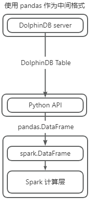

# 高效数据交互 Arrow 插件使用教程

[Apache Arrow](https://arrow.apache.org/) 是一种跨语言的内存数据交换格式，旨在为用户提供高效的数据结构，以实现在不同的数据处理系统之间共享数据而无需进行复制。它由 Apache 软件基金会开发和维护，目前已经成为许多大型数据处理和分析框架的核心组件之一。在分布式框架井喷的时代，Apache Arrow 能够跨越不同语言、系统、平台，在多个架构之间以极低成本传输数据。基于 PyArrow 官方提供的 C++ SDK，DolphinDB 开发了能够将 DolphinDB 数据格式和 Arrow 数据格式相互转换的数据格式插件，帮助用户将 DolphinDB 数据服务对接到 Arrow 环境中，以便缩短业务的全流程时间和降低序列化成本。

本文将介绍如何通过 Arrow 插件从数据库中获取 Arrow 格式数据，同时通过一个使用 PySpark 进行计算的示例场景，演示如何使用 Arrow 格式和 DolphinDB Arrow 插件、进而降低任务的总体执行时间。同时本文将提供一个测试案例，通过对比是否使用 Arrow 作为中间格式，以进一步展示 Arrow 插件在传输方面的优势。


## 1 插件介绍

DolphinDB 提供的 Arrow 插件支持 API 与 DolphinDB 在进行数据传输时使用 Arrow 数据格式，并自动进行数据类型转换。\*\*Arrow 插件属于数据格式插件，本身不直接提供调用接口。在加载 Arrow 插件后，需要在序列化/反序列化过程中指定协议使用 PROTOCOL\_ARROW 才能生效。\*\*PROTOCOL\_ARROW 协议是 DolphinDB 基于 Apache Arrow 通用序列化方案进行适配修改后的传输协议，在使用时可通过参数进行指定。

使用 Python API 指定 PROTOCOL\_ARROW 协议获取数据的示例如下：

```
import dolphindb as ddb
import dolphindb.settings as keys
s = ddb.Session(protocol=keys.PROTOCOL_ARROW)
s.connect("localhost", 8848, "admin", "123456")
print(s.run("table(1..3 as a)"))
--------------------------------------
pyarrow.Table
a: int32
----
a: [[1,2,3]]
```

如下为 Arrow 与 DolphinDB 数据类型转换关系表：

| **DolphinDB** | **Arrow** | **DolphinDB** | **Arrow** |
| --- | --- | --- | --- |
| BOOL | boolean | NANOTIMESTAMP | timestamp(ns) |
| CHAR | int8 | DATEHOUR | timestamp(s) |
| SHORT | int16 | FLOAT | float32 |
| INT | int32 | DOUBLE | float64 |
| LONG | int64 | SYMBOL | dictionary(int32, utf8) |
| DATE | date32 | STRING | utf8 |
| MONTH | date32 | IPADDR | utf8 |
| TIME | time32(ms) | UUID | fixed\_size\_binary(16) |
| MINUTE | time32(s) | INT128 | fixed\_size\_binary(16) |
| SECOND | time32(s) | BLOB | large\_binary |
| DATETIME | timestamp(s) | DECIMAL32(X) | decimal128(38, X) |
| TIMESTAMP | timestamp(ms) | DECIMAL64(X) | decimal128(38, X) |
| NANOTIME | time64(ns) |  |  |

注意：

* DolphinDB 数据类型的详细说明请参阅文档 [DolphinDB-数据类型](../progr/data_types.html)。
* Arrow 数据类型的详细说明请参阅文档 [Data Types — Apache Arrow v15.0.2](https://arrow.apache.org/docs/cpp/api/datatype.html)。
* 关于 Arrow 插件的详细说明请参阅 [DolphinDB Arrow 插件使用说明](https://gitee.com/dolphindb/DolphinDBPlugin/tree/release200.11/Arrow)。
* 目前仅有 DolphinDB Python API 支持使用 PROTOCOL\_ARROW 协议与 DolphinDB server 交互，详情见 [Python API 数据类型转换 PROTOCOL\_ARROW 章节](https://docs.dolphindb.cn/zh/pydoc/AdvancedOperations/DataTypeCasting/PROTOCOL_ARROW.html)。

## 2 基本使用

### 2.1 安装插件

节点启动后，连接节点并在 GUI（或 VS Code、Web UI）等 [DolphinDB 客户端](../db_distr_comp/clients.html)中执行 `installPlugin` 函数，则可以下载到与当前 server 版本适配的 Arrow 插件文件。插件文件包括插件描述文件和插件的二进制文件。

```
login("admin", "123456");
installPlugin("arrow");
```

`installPlugin` 函数若正常返回，则代表下载成功，其返回值为插件描述文件（PluginArrow.txt）的安装路径。如：

```
/path_to_dolphindb_server/server/plugins/arrow/PluginArrow.txt
```

`installPlugin` 函数实际上是完成从远程文件服务器拉取插件文件到 DolphinDB server 所在的服务器，因此需要一定的耗时，请耐心等待大约一分钟。

### 2.2 加载插件

在 API 端调用接口和 DolphinDB server 以 Arrow 数据格式协议交互前，需要先加载插件。在 GUI（或 VS Code、Web UI）等客户端中执行 `loadPlugin` 函数加载插件。

```
loadPlugin("arrow");
```

`loadPlugin` 函数正常返回则插件加载成功。以 VS Code 为例，首次加载成功后返回的部分信息如下图。其中返回值是 Arrow 插件提供的所有函数。


注意：上图中返回的函数仅提供给 DolphinDB 内部使用，无法直接调用。

至此，插件的安装与加载已全部完成。

注意：

* 如果重复执行 `loadPlugin` 加载插件，会抛出模块已经被使用的错误提示。这是因为在节点启动后，只允许加载一次 Arrow 插件，即可在任意会话中调用该插件提供的函数。错误提示如下：

```
The module [arrow] is already in use.
```

* 若节点重启，则需要重新加载插件。

## 3 实践案例

本章以使用 Arrow 插件先从 DolphinDB 获取数据再通过 PySpark 进行简单计算为例，同时配合双变量（是否使用 Arrow 插件、是否使用 Arrow 格式作为 PySpark 的中间格式）进行对比测试，以展示使用 Arrow 插件和 Arrow 格式对总体流程效率的提升效果。本节主要介绍如下内容：

1. 需要部署和准备的环境
2. 两种极端场景的详细介绍
3. 对比测试结果和结论

### 3.1 环境准备

#### 3.1.1 DolphinDB 环境

本例需要使用 2.00.12 及以上版本的 DolphinDB server 和对应的 DolphinDB Arrow 插件。使用前可以分别参考 [DolphinDB 部署教程](../deploy/deploy_intro.html)和章节 2 中的内容进行安装和加载。

#### 3.1.2 Python 环境

本例需要使用 1.30.21.1 及以上版本的 [DolphinDB Python API](https://pypi.org/project/dolphindb/)。详细安装说明请参见[文档](https://docs.dolphindb.cn/zh/pydoc/QuickStart/Install.html)。为保证本例代码的正常运行，请安装如下库：

* [NumPy](https://pypi.org/project/numpy/)：测试代码需要，建议安装最新版本。
* [pandas](https://pypi.org/project/pandas/)：测试代码和全流程使用 Arrow 格式需要，请安装 2.0 及以上版本。
* [pyarrow](https://pypi.org/project/pyarrow/)：为测试场景中全流程可以使用 Arrow 作为中间格式，请安装 9.0.0 及以上版本。

#### 3.1.3 PySpark 环境

本例中使用 PySpark 作为数据计算组件，需安装 PySpark，详情请参考 [PySpark 下载指南](https://spark.apache.org/docs/latest/index.html#downloading)。启动 PySpark 前，需要指定环境变量 `PYSPARK_PYTHON` 的值为 Python 可执行文件的路径，或在 Python 脚本中进行如下配置：

```
import os
os.environ["PYSPARK_PYTHON"] = "/path_to_python_env/python"
```

### 3.2 操作流程

#### 3.2.1 定义 \_SparkBase 类用于启动和关闭 PySpark 环境

本例中，定义 `_SparkBase` 类用于管理 PySpark 环境。使用时，需手动调用 `start` 方法启动 PySpark 环境。

* 如果指定 `use_arrow=True`，表示启用 Arrow 作为 PySpark 内部的中间格式。
* 如果指定 `use_arrow=False`，表示使用 pandas DataFrame 作为 PySpark 内部的中间格式。

结束时需调用 `shutdown` 方法关闭 PySpark 环境。

```
class _SparkBase(object):
    @classmethod
    def start(cls, use_arrow=True):
        conf = SparkConf()
        conf.set("spark.sql.execution.arrow.pyspark.enabled", "true" if use_arrow else "false")
        conf.set("spark.default.parallelism", "100")
        cls.context: SparkContext = SparkContext(master='local[*]', appName=cls.__name__, conf=conf)
        cls.session: SparkSession = SparkSession.builder.getOrCreate()
        cls.use_arrow = use_arrow

    @classmethod
    def shutdown(cls):
        cls.session.stop()
        cls.session = None
        cls.context.stop()
        cls.context = None
```

#### 3.2.2 建立数据库连接，准备数据

本例中使用包含一列 STRING 和 三列 DOUBLE ，有 10000000 行随机数据的共享内存表（约 300 MB）进行计算演示。数据准备脚本如下，其中 `HOST/PORT/USER/PASSWD` 可参考 [Python API 使用教程](https://docs.dolphindb.cn/zh/pydoc/py.html)配置为数据库连接信息。


```
import dolphindb as ddb
script = """
    n = 10000000;
    id = take(`AAA`BBB`CCC, n);
    v1 = rand(10.0, n);
    v2 = rand(20.0, n);
    v3 = rand(5.0, n);
    share table(id as id, v1 as v1, v2 as v2, v3 as v3) as t;
"""

conn = ddb.Session()
conn.connect(HOST, PORT, USER, PASSWD)
conn.run(script)
```

#### 3.2.3 使用 PySpark 计算

定义 `cal` 函数，根据 id 列值划分的各组，分别计算 `(v1 + v2) * v3` 的均值，并将结果返回。

```
def cal(df: sql.DataFrame):
    df = df.withColumn("v", (F.col("v1") + F.col("v2")) * F.col("v3"))
    df = df.groupby("id").avg("v")
    return df
```

### 3.3 测试说明

本次设置如下两个测试点：

* Python API 以什么数据格式从 DolphinDB 端获取数据。
* Spark 采用什么格式进行处理。

因此，本测试分为全流程使用 pandas 作为中间格式、全流程使用 Arrow 作为中间格式、pandas 格式和 Arrow 格式混用（即 2 种情况）共 4 种场景。

本节将详细介绍全流程使用 pandas 作为中间格式的场景、全流程使用 Arrow 作为中间格式的场景。

#### 3.3.1 全流程使用 pandas 作为中间格式的场景



参考上图，使用 pandas 作为 PySpark 的中间格式，整体计算流程如下：

1. 从 API 获取 pandas DataFrame 数据，该过程中，会将 DolphinDB 数据转换为 pandas DataFrame 。
2. Python 通过 Socket 调用 Spark API，在计算时，将 Python 端 pandas DataFrame 数据经过多次序列化后发送至 Spark 处理。
3. 计算完成后，再经过多次反序列化（pickle）将 Spark 数据反序列化至 Python 端。

在该流程中，第二步和第三步将会在 PySpark 内部经过多次序列化和反序列化，且默认使用行式处理，额外开销较大。

具体实现如下，详细代码可参考附录：

```
import dolphindb as ddb
import dolphindb.settings as keys
class PySparkTest(_SparkBase):
    def testPROTOCOL_PICKLE(self):
        s = ddb.Session(protocol=keys.PROTOCOL_PICKLE)
        s.connect(HOST, PORT, USER, PASSWD)
        df = s.run("t")
        df = self.session.createDataFrame(df)
        cal(df)

PySparkTest.start(use_arrow=False)
PySparkTest().testPROTOCOL_PICKLE()
PySparkTest.shutdown()
```

上述代码中，启动 PySpark 时指定 `use_arrow=False`，表示不使用 Arrow 作为 Spark 内部中间格式。指定 Python API 使用 PROTOCOL\_PICKLE 协议（默认协议）从 DolphinDB 获取 pandas DataFrame 数据，并调用 `createDataFrame` 方法将其转换为 spark 格式的 DataFrame，传入 `cal` 函数进行计算。

#### 3.3.2 全流程使用 Arrow 作为中间格式的场景


参考上图，使用 Arrow 作为 PySpark 的中间格式，将会经过以下步骤：

1. 从 API 获取 Arrow 格式数据，该过程中会将 DolphinDB 表数据转换为 Arrow 格式数据。
2. Python 端将 Arrow 格式数据转换为同样使用 Arrow 作为数据后端的 pandas DataFrame，因为都使用 Arrow 格式，转换开销极小。
3. Python 通过 Socket 调用 Spark API 将使用 Arrow 作为数据后端的 pandas DataFrame 传入 Spark 系统，和原流程不同，Arrow 数据格式在序列化和反序列化时能够以近乎零成本的方式进行，启用 Arrow 作为中间格式的 PySpark，可以以最高效的方式接收数据。
4. 计算时，Arrow 作为列式数据格式，对于计算也有一定优化，计算完成后通过零成本序列化和反序列化将结果发送回 Python 端。

该流程中，Arrow 能够在 Python 系统和 Spark 系统之间以较低开销进行传输，Arrow 插件使得 DolphinDB 可以直接提供 Arrow 格式的数据，并通过 Arrow 后端的 pandas DataFrame 作为桥梁，省去流程中繁琐和开销极大的类型转换，从而提供整体流程效率。

具体实现如下，详细代码可参考附录：

```
class PySparkTest(_SparkBase):
    def testPROTOCOL_ARROW(self):
        s = ddb.Session(protocol=keys.PROTOCOL_ARROW)
        s.connect(HOST, PORT, USER, PASSWD)
        pt = s.run("t")
        df = pd.DataFrame({
            'id': pd.Series(pt["id"].combine_chunks(), dtype=pd.ArrowDtype(pa.utf8())),
            'v1': pd.Series(pt["v1"].combine_chunks(), dtype=pd.ArrowDtype(pa.float64())),
            'v2': pd.Series(pt["v2"].combine_chunks(), dtype=pd.ArrowDtype(pa.float64())),
            'v3': pd.Series(pt["v3"].combine_chunks(), dtype=pd.ArrowDtype(pa.float64())),
        })
        df = self.session.createDataFrame(df)
        cal(df)
PySparkTest.start(use_arrow=True)
PySparkTest().testPROTOCOL_ARROW()
PySparkTest.shutdown()
```

上述代码中，启动 PySpark 时指定 `use_arrow=True`，表示使用 Arrow 作为 Spark 内部中间格式。指定 Python API 使用 PROTOCOL\_ARROW 协议从 DolphinDB 获取 Arrow 格式数据，将其转为 PyArrow 后端的 pandas DataFrame（pandas 2.0 支持使用 PyArrow 替代 NumPy 作为数据后端）。再调用 `createDataFrame` 方法，将其转为 PySpark DataFrame，最后调用 `cal` 进行计算。

### 3.4 测试结果

本例使用自定义的装饰器 timer 统计流程所耗时间以对比四种测试场景，完整测试代码见附录。

```
def timer(fn):
    def wrapper(*args, **kwargs):
        t1 = time.perf_counter()
        fn(*args, **kwargs)
        t2 = time.perf_counter()
        return t2 - t1
    return wrapper
```

| **测试场景** | **API 交互数据格式协议** | **PySpark 中间格式** | **总耗时（s）** |
| --- | --- | --- | --- |
| 1 | 默认 PICKLE 协议 | pandas | 195.6 |
| 2 | ARROW 协议 | pandas | 189.4 |
| 3 | 默认 PICKLE 协议 | Arrow | 3.08 |
| 4 | ARROW 协议 | Arrow | 1.11 |

从测试场景 1、3 和 2、4 可以看出，使用 Arrow 作为 PySpark 的中间格式，能够大幅度降低计算和额外类型转换以及额外序列化反序列化的时间开销。PICKLE 协议下使用 Arrow 替代 pandas 作为 PySpark 的计算中间格式，可以减少 98.11% 总时间；ARROW 协议下则可以降低总流程 99.41% 时间。

从测试场景 3、4 和 1、2 可以看出，使用 Arrow 插件，即便使用 pandas 作为 PySpark 计算中间格式，依然能够减少 6 s 传输时间，总体效率提高约 3.2%；如果使用 Arrow 作为 PySpark 计算中间格式，仍旧能够减少 63.9% 的传输开销，大幅提高效率。

从上述结果可知，对于下载 1000 万行约 300 MB 的表数据后进行简单计算的任务，如果 DolphinDB 直接提供 Arrow 格式的数据，配合下游统一使用 Arrow 作为中间格式的场景，可以大幅降低全流程的传输耗时。即便单独使用 Arrow 插件作为下载数据的辅助工具，配合 Arrow 作为列式数据格式的特点，也能一定程度提升总体效率。

## 4 总结

在异构大数据系统中，Arrow 作为一种支持跨平台、跨语言、跨系统的内存数据格式，如果全链路使用 Arrow 格式作为统一的中间格式，能够极大降低在不同系统之间传输数据的开销。DolphinDB Arrow 插件支持用户通过指定 PROTOCOL\_ARROW 将 DolphinDB 数据转换为 Arrow 数据格式。在高频使用 Apache Arrow 格式作为中间格式的场景，DolphinDB Arrow 插件能够帮助用户方便地从数据库取出数据、进而在不同系统（Spark 等）和应用程序间低成本、高效地传递数据。DolphinDB Arrow 插件能够帮助用户避免复杂的数据转换或适配操作，同时助力提升数据处理效率等。

## 5 附录

[完整 Python 测试脚本](script/arrow_plugin_usage/arrow_test.py)

