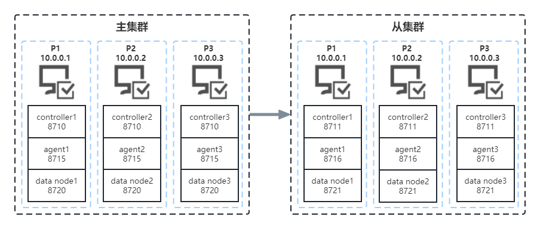

# 集群间异步复制

异步复制是进行集群间数据同步的一种方式。在金融交易、物联网、互联网/移动互联网等应用场景中，复杂的业务对数据一致性和可靠性提出了极高的要求。与同步复制相比，异步复制网络延迟更低、吞吐量更高、故障风险更小。

DolphinDB 提供的异步复制功能通过异步方式，将主集群复制到从集群，使主从集群数据一致，是集群异地容灾的一个解决方案。

传统集群间的异步复制可能导致数据不一致、丢失或冲突。与传统集群间的异步复制解决方案相比，DolphinDB 具有以下优势：

* 容错性强。节点宕机不会造成数据丢失，主从集群数据最终会保持一致。
* 运维便捷。提供在线监控函数以及错误修复函数。

本教程将从以下几方面对 DolphinDB 的异步复制方案进行介绍：

## 1. 概述

### 1.1. 原理

使用异步复制功能时，原集群称为主集群，目的集群称为从集群。当前主集群的控制节点会在处理事务时收集相关信息，生成异步复制任务并放到主集群的队列中。同时从集群的控制节点定时从主集群的队列中拉取任务，放到从集群的队列中等待执行。从集群队列中的任务会被划分为不同的组，执行时在组间依次进行，同一组中的任务根据哈希算法被分配到不同的数据节点中并发执行。

异步复制通过各种机制保证数据的一致性，但主集群数据节点的宕机仍可能导致数据丢失。在这种情况下，可以通过开启同步持久化来保证数据一致（见 [主集群配置](#%E4%B8%BB%E9%9B%86%E7%BE%A4%E9%85%8D%E7%BD%AE) 小节）。

### 1.2. 支持性

异步复制功能目前支持分布式表；支持 DDL（Data Definition Language）/ DML（Data Manipulation Languange）操作；支持在数据库层面上开启或关闭异步复制功能。

## 2. 环境配置

本教程使用两个高可用集群作为示例，架构如下图：



集群间的异步复制支持一个主集群，多个从集群。用户在使用异步复制功能时需要至少部署两个集群，集群类型可为单服务器集群、多服务器集群以及高可用集群。关于如何部署集群请参考[单服务器集群部署](single_machine_cluster_deploy.md)、[多服务器集群部署](multi_machine_cluster_deployment.md)、[高可用集群部署](ha_cluster_deployment.md)。

本教程假定主集群配置文件位于 */dolphindb/server/cluster1/config* 目录下，从集群配置文件位于 */dolphindb/server/cluster2/config* 目录下。与异步复制相关的配置项请参考[集群间的异步复制配置项](../db_distr_comp/cfg/function_configuration.md)。

注： 在配置主集群时，请确保将配置文件中所有出现的 localhost 或 127.0.0.1 替换为主集群服务器的实际局域网 IP 地址。

### 2.1. 主集群配置

以 P1 服务器为例，首先登录 P1 服务器，进入 */dolphindb/server/cluster1/config* 目录。

* **控制节点配置**

  执行以下 Shell 命令修改 *controller.cfg* 配置文件：

  ```
  vim ./controller.cfg
  ```

  添加如下配置项参数：

  ```
  clusterReplicationSlaveNum=1
  ```

  *clusterReplicationSlaveNum* 指定允许配置的从集群数量上限，本教程中从集群数量为1。
* **数据节点配置**

  执行以下 Shell 命令修改 *cluster.cfg* 配置文件：

  ```
  vim ./cluster.cfg
  ```

  添加如下配置项参数：

  ```
  clusterReplicationMode=master
  clusterReplicationWorkDir=/dolphindb/server/cluster1/replication
  clusterReplicationSyncPersistence=false
  ```

  *clusterReplicationSyncPersistence* 指定是否开启任务数据的同步持久化，默认为 false，表示持久化异步进行。在这种状态下，主集群数据节点的宕机可能导致数据丢失。可以指定 *clusterReplicationSyncPersistence* 的值为 true 开启同步持久化，以确保数据的一致性。但请注意，开启同步持久化之后，主集群的事务效率会降低。

在完成 P1 服务器的配置之后，请同步修改主集群中其它服务器的配置。在本例中，这表示 P2 和 P3 服务器的配置同样需要按照以上操作进行修改。

### 2.2. 从集群配置

以 P1 服务器为例，首先登录 P1 服务器，进入 */dolphindb/server/cluster2/confi*g 目录。

* **控制节点配置**

  执行以下 Shell 命令修改 *controller.cfg* 配置文件：

  ```
  vim ./controller.cfg
  ```

  添加如下配置项参数：

  ```
  clusterReplicationMasterCtl=10.0.0.1:8848
  ```

  *clusterReplicationMasterCtl* 指定主集群控制节点。若主集群为高可用集群，则指定为控制节点 raft 组中的任意节点即可。在本例中指定 P1 服务器中的控制节点。
* **数据节点配置**

  执行以下 Shell 命令修改 *cluster.cfg 配置文件：*

  ```
  vim ./cluster.cfg
  ```

  添加如下配置项参数：

  ```
  clusterReplicationMode=slave
  clusterReplicationExecutionUsername=admin
  clusterReplicationExecutionPassword=123456
  ```

  在配置中指定了用于执行集群间异步复制的用户名和密码。**必须确保该用户有事务操作的相关权限**，即对于主集群上执行的操作，该用户在从集群上同样有执行的权限，否则异步复制任务会失败。关于 DolphinDB 权限的具体介绍请参考：[用户权限管理](ACL_and_Security.md)。

  在完成以上配置之后，请同步修改从集群中其它服务器的配置。

## 3. 使用异步复制

接下来通过一个例子介绍如何使用 DolphinDB 集群间的异步复制功能。首先，在主集群和从集群中各选择一个数据节点（以下分别使用 dataNodeMaster 和 dataNodeSlave 表示），打开对应的交互编程界面。

### 3.1. 开启集群间异步复制

在 dataNodeMaster 的交互编程界面执行以下语句创建数据库：

```
// 创建存储的数据库
login("admin", "123456")
dbName = "dfs://testDB"
if(existsDatabase(dbName)){
  dropDatabase(dbName)
}
db = database(dbName, VALUE, 2023.01.01..2023.12.31)
```

集群异步复制状态共三种：

* ENABLED，开启状态，集群的默认状态；
* DISABLED，关闭状态，用户手动停止了异步复制任务或配置中未包括异步复制相关配置项；
* STOPPED，停止状态，从集群任务执行失败 30 次后将转为该状态。

在集群启动时异步复制状态默认为 "ENABLED"，但集群中新创建的数据库默认关闭异步复制功能，因此需要在 dataNodeMaster 的交互编程界面执行以下语句开启新建数据库的异步复制功能：

```
setDatabaseForClusterReplication(db, true)
```

执行以下语句以确认数据库的异步复制是否开启：

```
schema(db).clusterReplicationEnabled
```

若执行结果返回 true，则说明异步复制功能已启用。也可以通过 [getDatabaseClusterReplicationStatus](../funcs/g/getDatabaseClusterReplicationStatus.md) 查看所有数据库的异步复制开启状态，但请注意，使用该函数的前提是数据库中存在数据。

```
getDatabaseClusterReplicationStatus()
```

查询结果如下，**dbName** 表示库名，**enabled** 表示开启状态。


### 3.2. 查询异步复制状态

在 dataNodeMaster 的交互编程界面执行以下语句创建分区表：

```
// 创建分区表
tbName = "testTB"
colNames = `SecurityID`DateTime`PreClosePx`OpenPx`HighPx`LowPx`LastPx`Volume`Amount
colTypes = [SYMBOL, DATETIME, DOUBLE, DOUBLE, DOUBLE, DOUBLE, DOUBLE, INT, DOUBLE]
schemaTable = table(1:0, colNames, colTypes)
db.createPartitionedTable(table=schemaTable, tableName=tbName, partitionColumns=`DateTime)
```

为了确认在主集群中创建库表后，从集群复制了主集群的库表信息，在 dataNodeSlave 的交互编程界面执行以下语句：

```
loadTable("dfs://testDB", "testTB")
```

函数执行成功说明从集群中成功创建了数据库 `dfs://testDB` 和表 `testTB`。

接着在 dataNodeMaster 执行以下语句，模拟生成 5000 个股票 1 天的 1 分钟 K 线数据：

```
// 模拟数据并写入分区表
n = 1210000
randPrice = round(10+rand(1.0, 100), 2)
randVolume = 100+rand(100, 100)
SecurityID = lpad(string(take(0..4999, 5000)), 6, `0)
DateTime = (2023.01.08T09:30:00 + take(0..120, 121)*60).join(2023.01.08T13:00:00 + take(0..120, 121)*60)
PreClosePx = rand(randPrice, n)
OpenPx = rand(randPrice, n)
HighPx = rand(randPrice, n)
LowPx = rand(randPrice, n)
LastPx = rand(randPrice, n)
Volume = int(rand(randVolume, n))
Amount = round(LastPx*Volume, 2)
tmp = cj(table(SecurityID), table(DateTime))
t = tmp.join!(table(PreClosePx, OpenPx, HighPx, LowPx, LastPx, Volume, Amount))
dbName = "dfs://testDB"
tbName = "testTB"
loadTable(dbName, tbName).append!(t)
```

执行以下语句确认数据已同步到从集群中：

```
select count(*) from loadTable("dfs://testDB", "testTB")
```

返回结果如下：


从集群对应的分区表中插入了 1210000 条数据。可以确认主集群中的数据已同步到从集群中。

若希望查看关于集群间异步复制更详细的状态信息，可通过 DolphinDB 提供的一系列函数进行查询：

* `getMasterReplicationStatus`
* `getSlaveReplicationStatus`
* `getRecentSlaveReplicationInfo`

在 dataNodeMaster 的交互编程界面执行以下语句可以查询主集群任务发送队列的状态：

```
rpc(getControllerAlias(), getMasterReplicationStatus)
```

`getMasterReplicationStatus` 只能在控制节点上执行，用户可以通过 `rpc` 函数在控制节点上进行调用。返回结果如下。


主集群生成了三个异步复制任务，分别对应创建数据库、创建表和插入数据。关于上图中各参数的介绍请参考[函数介绍](../funcs/g/getMasterReplicationStatus.md)。

与之相对应，在 dataNodeSlave 上使用 [getSlaveReplicationStatus](../funcs/g/getSlaveReplicationStatus.md)可以查询从集群任务执行队列的状态：

```
rpc(getControllerAlias(), getSlaveReplicationStatus)
```

函数返回结果如下。


从集群拉取了主集群上生成的三个任务并完成执行。

在 dataNodeMaster 上使用 [getRecentSlaveReplicationInfo](../funcs/g/getRecentSlaveReplicationInfo.md) 可以查看跨集群异步复制进程中，连接到主集群的各从集群最近一次的任务状态。

```
rpc(getControllerAlias(), getRecentSlaveReplicationInfo)
```

函数返回结果如下。


从集群最近一次拉取任务时通过控制节点 10.0.0.3:8711 进行连接，最近完成任务的 taskID 为 3。

最后一个参数指定了时间区间为过去 30s 内的状态信息，函数返回结果如下。


过去 30s 内完成了三个任务，任务平均耗时为 00:00:00.537。

### 3.3. 停止或关闭异步复制

在某些情况下需要暂时停止集群间的异步复制，在 dataNodeMaster 或 dataNodeSlave 上执行如下语句来停止主集群或从集群的异步复制。

```
rpc(getControllerAlias(), stopClusterReplication)
```

若在主集群上执行 [stopClusterReplication](../funcs/s/stopClusterReplication.md)，集群异步复制状态转为 "DISABLED"，在此之后创建的任务将不会放到发送队列中；若在从集群上执行，从集群停止从主集群读取新任务，但正在执行中的任务不会停止。

若希望重新开启异步复制，可通过 [startClusterReplication](../funcs/s/startClusterReplication.md) 重新启动，集群状态将转为 "ENABLED"。该函数同样只能在控制节点上调用。

当完成异步复制任务之后希望关闭数据库的异步复制功能时，可使用 [setDatabaseForClusterReplication](../funcs/s/setDatabaseForClusterReplication.md) 来关闭。

```
setDatabaseForClusterReplication(db, false)
```

以上通过一些简单的例子对如何使用异步复制功能进行了介绍。

## 4. 常见问题

### 4.1. Replication is not enabled

执行异步复制相关函数报错如下：


该情况一般为集群未正确配置异步复制，请参考[环境配置](#%E7%8E%AF%E5%A2%83%E9%85%8D%E7%BD%AE)检查环境配置。

### 4.2. 异步复制任务异常中止

异步复制任务在执行过程中可能由于异常而中止，比如下面这种情况。


使用 *getSlaveReplicationStatus* 查看任务执行队列状态发现异步复制任务由于失败而中止，**state** 显示为 “FAILED”，失败的任务 ID 为 938。此时的集群状态为 “STOPPED”。

导致异步复制任务失败的原因可能为磁盘容量不足、无写文件权限等等，**details** 中会给出失败原因。用户可以根据失败原因尝试解决，然后执行 *startClusterReplication* 重启异步复制任务。从集群将再次执行所有失败的任务。

若无法分析失败原因，请联系技术支持人员进行处理。可以暂时跳过失败的任务，继续执行之后的任务，在从集群的数据节点上执行以下语句跳过该任务。

```
rpc(getControllerAlias(), skipClusterReplicationTask, 938)
rpc(getControllerAlias(), startClusterReplication)
```

首先通过 [skipClusterReplicationTask](../funcs/s/skipClusterReplicationTask.md) 跳过了失败的任务，接着调用 `startClusterReplication` 重启了异步复制。跳过的任务将被标记为完成状态。

## 5. 附录

异步复制主集群Demo：

* demo\_asynMaster.dos: [Asynchronous\_Replication](script/Asynchronous_Replication/async_replica.zip)

异步复制从集群Demo：

* demo\_asynSlave.dos: [Asynchronous\_Replication](script/Asynchronous_Replication/async_replica.zip)

