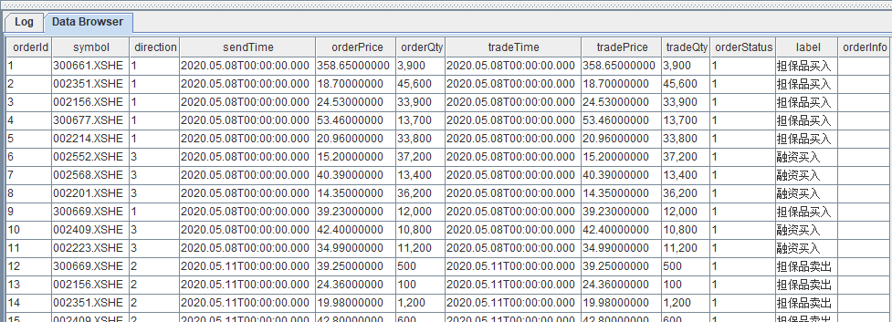
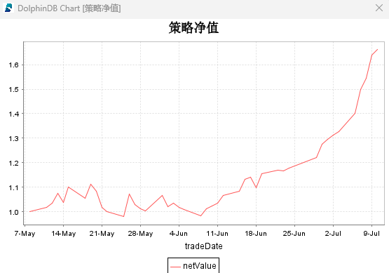
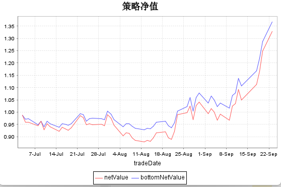

# 融资融券策略回测使用说明及回测案例

融资融券是一种利用杠杆放大投资收益的交易方式，它给投资者提供了更多的资金和交易机会。在量化投资中，融资融券业务被广泛应用于多种策略和操作中。包括杠杆交易、对冲策略、市场中性策略、套利策略和高频交易等等。目前很多量化基金经理在研究和回测这些策略中基本没有考虑融资融券部分，而是直接使用普通股票的策略回测框架进行投研回测分析，然而在实际交易中却引入融资融券操作，导致回测结果与实际交易结果存在较大偏差。

股票的融资融券业务和普通交易相比主要涉及以下三个方面的不同：一、融资融券策略回测中除了涉及佣金外，还涉及融资利率和融券费用等交易成本。二、融资融券市场的动态性和变化性较大，相应标的每日的折算率，保证金占用比例，当日是否可融资融券标的的状态也跟市场情绪的变化而变化。三、融资融券的风险管理模块更加严格，包括账户的维保比例、多头集中度和空头集中度限制等。DolphinDB
的回测插件现已支持融资融券策略的回测。该回测框架综合考虑了融资融券的交易成本、当日可融资融券标的范围、折算率及风控模块，从而使策略的回测效果更贴近实际操作结果。

融资融券策略回测在操作方式、风险管理和资金使用上与其他策略回测存在显著差异。因此，DolphinDB
的回测引擎在参数配置、行情数据和相关接口上也有所不同。本文将从融资融券业务的介绍、DolphinDB 融资融券回测的使用方法，以及具体回测案例等方面，展示如何利用
DolphinDB 回测插件实现融资融券策略的回测。

注意：本文全部代码需要运行在 3.00.2.1/2.00.14.1 及以上版本的 DolphinDB server 上。

## 1. 融资融券业务介绍

融资融券业务是一种证券信用交易方式，投资者可通过借贷资金或证券获得杠杆操作机会，以放大收益或对冲风险。融资是指投资者向券商借款购买证券，而融券是指投资者借用券商的证券卖出，计划在未来以较低价格买回同等数量的证券还给券商。融资融券基于预期股票价格变动获取利润。融资融券交易需提供保证金，抵押品可为现金、股票或债券，券商会根据资产质量设定折算率。投资者需支付利息、借券费用及相关交易手续费等成本。需要注意的是，在进行融资融券相关标的买卖时，只有可融资融券标的才可以进行买卖、只有可充抵保证金证券才能进行可以进行担保品买入。由于杠杆效应，该交易模式不仅放大了潜在收益，也增加了亏损风险，同时还面临强制平仓、市场波动和成本累积等挑战。此外，只有满足特定条件的股票才能进行此类交易。

### 1.1 保证金要求

在融资融券业务中，保证金制度是维护交易所权益的先决条件。投资者在进行融资融券投资时，需要利用信用账户进行交易，将保证金或可用于冲抵保证金的证券转入信用账户，然后进行融资融券交易。

* 对于上交所、深交所、北交所，个人投资者的融券保证金比例应当大于 100%；私募基金投资机构的融券保证金比例应当大于 120%。（**保证金比例 =
  保证金总额 / 需要融资或融券的规模 \* 100%**）

### 1.2 交易模式

融资融券的交易模式分为两种：融资交易和融券交易。

* 融资交易指向信用账户中输入保证金或可折算证券，投资者在交易额度内进行融资投资，利用杠杆放大期望收益和风险；
* 融券交易指向信用账户中输入保证金或可折算证券，投资者在交易额度内进行融券做空，利用杠杆放大期望收益和风险。

上述两种交易对应实际交易的两种反向操作：融资交易是一种做多操作，而融券交易是一种等价做空。这两种方式不仅可以用于放大做多和做空头寸，也可用于追平当日头寸以套利或止损。

### 1.3 杠杆作用

融资融券业务自带杠杆效应，可以利用少部分资金撬动更大的交易规模。下面给出一个简单的例子计算杠杆比率。投资者在融资交易中用自有资金和借入资金购买股票。假设保证金比例为
100%，那么投资者的资金一半处于信用账户，另一半通过融资获得。因此，在不考虑其他因素的情况下，投资者的杠杆比率为 2 倍（即投入 1 单位自有资金，可以操作
2 单位的资金）。实际杠杆比率更低，因为信用账户的资金一旦发生变更，比如投资证券等，按照折算率冲抵后，可融资余额会下降。按照 70%
的折算率，如果信用账户中的余额全部用于投资，仅能冲抵百分之70的保证金。实际杠杆比率为 170/100 = 1.7 倍。杠杆比率计算公式：**杠杆比率 =
融资融券后所有可用资金余额 / 初始资金余额 \* 100%**

## 2. DolphinDB 融资融券回测解决方案

DolphinDB 回测插件支持沪深 A
股融资融券业务的策略回测，其支持的行情频率包括快照、分钟频以及日频。此外，回测插件支持融资融券业务的融资利息、融券费用和融券权益补偿等计算以及授信额度、可融资融券标的范围、多头集中度和净空头负债集中度风控限制。下面将进行插件参数配置、行情数据、相关接口的介绍。

### 2.1 参数配置

融资融券策略回测与股票等其它品种一样，用户可以设置开始日期、结束日期、初始资金、手续费、行情频率类型等基本参数。在有融资买入和融券卖出时，融资融券业务会产生额外融资利息和融券费用，此外有多头或者空头集中度限制、融券权益补偿计算等业务逻辑。在创建回测引擎时，用户可以在配置参数中进行融资和融券利率，多空头集中度，分红除权等设置，同时支持担保品买入，融资买入和融券卖出等相关底仓的设置。

回测引擎的配置项参数记录在一个字典中。如果将配置项 **strategyGroup** 设置为 **securityCreditAccount，**表示进行融资融券回测。其它可以设置的与融资融券相关的参数包括：授信额度（lineOfCredit）、融资利率
（marginTradingInterestRate）、融券利率
（secuLendingInterestRate）、多头集中度（longConcentration） 和空头集中度（shortConcentration） 等。
具体的配置项说明见表 1。

**表 1**：融资融券配置项说明表

| **key** | **说明** | **备注** |
| --- | --- | --- |
| startDate | 开始日期 | DATE 类型 |
| endDate | 结束日期 | DATE 类型 |
| strategyGroup | 策略类型 | **’**securityCreditAccount**‘** |
| cash | 初始资金 | DOUBLE 类型 |
| commission | 手续费率 | FLOAT 类型 |
| tax | 印花税率 | FLOAT 类型 |
| dataType | 行情类型 | 1：快照行情  3：分钟频率  4：日频 |
| matchingMode | 订单撮合模式 | INT 类型，根据分钟或者日频，可选值为：  1：   * 日频：以收盘价撮合订单 * 分钟频：行情时间大于订单时间时撮合订单   2：   * 日频：以开盘价撮合订单 * 分钟频：行情时间等于订单时间时以当前行情的收盘价撮合订单，后续未完成订单撮合订单同 1   3：以委托价格成交 |
| lineOfCredit | 授信额度 | DOUBLE 类型 |
| marginTradingInterestRate | 融资利率 | FLOAT 类型 |
| secuLendingInterestRate | 融券利率 | FLOAT 类型 |
| maintainanceMargin | 维持担保比例。  [警戒线、追保线、最低线] | FLOAT 数组类型。维持担保比例低于追保线时回测引擎会直接退出 |
| longConcentration | 多头集中度 | 递减的三元 FLOAT 数组类型，如[1.,0.85,0.6]。不配置该项时，不进行多头集中度限制。 |
| shortConcentration | 净空头负债集中度 | 递减的三元 FLOAT 数组类型，如[1.,0.85,0.6]。  不配置该项时，不进行空头集中度限制。 |
| outputOrderInfo | 融资融券是否输出风控日志 | BOOL 类型 |
| repayWithoutMarginBuy | 控制是否可以用融资买入的券抵消融券卖出的券 | BOOL 类型  true：可以抵消  false：不允许抵消 |
| stockDividend | 分红除权配置表 | 是一个表，具体字段说明见表 2 |
| setLastDayPosition | 底仓信息表 | 是一个表，具体字段说明见表 3 |
| msgAsTable | 行情数据格式 | BOOL 类型，默认为 false  true : 表  false ：字典 |

融资融券回测支持对融资或担保品买入持仓的动态分红送股的处理，对融券持仓权益补偿的处理。用户只需把实际的分红除权表设置给配置文件 config 中的参数
stockDividend 即可，分红送股的基本信息表详见表 2。

**表 2** ：分红送股配置表

| **字段** | **字段类型** | **名称** |
| --- | --- | --- |
| symbol | SYMBOL | 股票代码 |
| endDate | DATE | 分红年度 |
| annDate | DATE | 预案公告日 |
| recordDate | DATE | 股权登记日 |
| exDate | DATE | 除权除息日 |
| payDate | DATE | 派息日 |
| divListDate | DATE | 红股上市日 |
| bonusRatio | DOUBLE | 每股送股比例 |
| capitalConversion | DOUBLE | 每股转增比例 |
| afterTaxCashDiv | DOUBLE | 每股分红（税后） |
| allotPrice | DOUBLE | 配股价格 |
| allotRatio | DOUBLE | 每股配股比例 |

融资融券回测，创建回测引擎时即可设置策略的初始仓位，初始仓位的设置通过配置文件 config 中的参数 setLastDayPosition
设置。这样策略的初始权益为底仓权益和策略的初始资金之和，同时回测结束时也可以通过
`Backtest::getDailyTotalPortfolios` 接口的 netValue 和
bottomNetValue 字段获取分别获取策略净值和初始仓位的净值。设置的初始仓位表信息，具体详见表 3 .

**表 3** ：初始仓位表

| **字段名称** | **类型** | **名称** |
| --- | --- | --- |
| symbol | SYMBOL | 标的代码 |
| marginSecuPosition | LONG | 担保品买入持仓量 |
| marginSecuAvgPrice | DOUBLE | 买成交均价 |
| marginPosition | LONG | 融资买入持仓量 |
| marginBuyValue | DOUBLE | 融资买入金额 |
| secuLendingPosition | LONG | 融券卖出持仓量 |
| secuLendingSellValue | DOUBLE | 融券卖出金额 |
| closePrice | DOUBLE | 设置收盘价 |
| conversionRatio | DOUBLE | 保证金折算率 |
| tradingMargin | DOUBLE | 融资保证金比例 |
| lendingMargin | DOUBLE | 融券保证金比例 |

### 2.2 行情数据

在进行融资融券策略回测时，
行情数据结构与股票保持一致。由于本案例中使用的为日频的行情类型，因此这里只说明分钟和日频时行情的具体格式。快照行情的数据格式详见相应[股票](../plugins/backtest/stock.html)的行情数据说明文档。

**表 4：股票分钟和日频行情字段说明**

| **字段** | **字段类型** | **名称** |
| --- | --- | --- |
| symbol | SYMBOL | 标的代码 |
| tradeTime | TIMESTAMP | 交易时间 |
| open | DOUBLE | 开盘价 |
| low | DOUBLE | 最低价 |
| high | DOUBLE | 最高价 |
| close | DOUBLE | 收盘价 |
| volume | LONG | 成交量 |
| amount | DOUBLE | 成交额 |
| upLimitPrice | DOUBLE | 涨停价 |
| downLimitPrice | DOUBLE | 跌停价 |
| prevClosePrice | DOUBLE | 前收盘价 |
| signal | DOUBLE[] | 其它字段列表 |

### 2.3 融资融券相关接口说明

回测引擎提供了相应的接口供用户创建策略引擎、提交订单、获取持仓和可用现金等。下面将进行融资融券的不同部分接口说明，其它相关更具体的接口说明详见 [Backtest](../plugins/backtest.html) 的接口相关模块。

首先，融资融券策略回测引擎目前使用老接口
`Backtest::createBacktestEngine`创建引擎，后续的版本中我们将支持使用新接口
`Backtest::createBacktester`创建并支持 JIT 优化。
在创建融资融券策略回测引擎时，必须对每日的可充抵保证金证券和可融资融券标的的基本信息通过参数 *securityReference*
进行设置。该表包括该标的是否为可充抵保证金证券、保证金折算率、融资保证金比例、融券保证金比例、是否为可融资状态和是否是可融券状态等。具体详见表
5。

```
Backtest::createBacktestEngine(name, config, securityReference , initialize,
beforeTrading, onBar, onSnapshot, onOrder, onTrade, afterTrading, finalize)
```

其次，回测引擎提交订单的接口为
`Backtest::submitOrder`，该接口参数包括创建的回测引擎，订单信息，以及用户可自定义设置的订单标签。与其它品种买卖标志只有买开，卖开、卖平和买平四种买卖方向不一样，融资融券的买卖方向有
8 种，分别为担保品买入（1），担保品卖出（2），融资买入（3），融券卖出（4），直接还款（5），卖券还款（6），直接还券 （7）和买券还券
（8）。在进行直接还款时，即买卖方向为 5 时，orderMsg 中的第 4 个参数表示还款金额 (股票代码, 下单时间, 订单类型, 还款金额,
订单数量,
5)。

```
Backtest::submitOrder(engine,orderMsg,label)
```

* orderMsg为订单信息： (股票代码, 下单时间, 订单类型, 订单价格\还款金额, 订单数量, 买卖标志)。

最后，与其它品种获取持仓直接用 `Backtest::getPosition`
接口不同，融资融券获取持仓接口分为获取担保品买入持仓
`Backtest::getMarginSecuPosition`、融资买入持仓
`Backtest::getMarginTradingPosition` 和融券卖出持仓
`Backtest::getSecuLendingPosition`
三个接口。这三个接口分别用于获取相应的持仓量、持仓均价和当日成交量等信息。获取每日盘后持仓明细指标包括融资融券持仓、成交金额、盈亏以及多空集中度等信息详见`Backtest::getDailyPosition`接口。获取实时和每日策略权益指标包括融资和融券负债、利息、维保比例、保证金余额、收益率、盈亏、策略多头集中度等统计信息接口分别为
`Backtest::getTotalPortfolios` 和
`Backtest::getDailyTotalPortfolios`。获取策略收益、底仓收益等指标通过`Backtest::getReturnSummary`接口。

## 3. 融资融券策略回测注意事项

### 3.1 标的范围

在沪深交易所中，并非所有的证券都在融资融券的范围内。在创建引擎时，用户可通过接口`Backtest::createBacktestEngine`的
securityReference
参数将所需的基本信息表传入回测引擎，该信息表包括每个交易日融资融券标的证券和可冲抵保证金证券列表、相应的保证金折算率、融资保证金比例、融券保证金比例等，详细参考表
5。

**表 5**： 每日融资融券的基本信息表

| **字段** | **类型** | **备注** |
| --- | --- | --- |
| symbol | SYMBOL | 标的代码 |
| tradeDate | DATE | 交易日 |
| symbolSource | SYMBOL | 交易所 |
| securityRating | SYMBOL | 标的分类 |
| marginable | BOOL | 是否是可充抵保证金证券  true：可以担保品买入  false：无法担保品买入 |
| conversionRatio | FLOAT | 保证金折算率  （影响可用保证金可用余额） |
| tradingMargin | FLOAT | 融资保证金比例  （影响可用保证金可用余额） |
| lendingMargin | FLOAT | 融券保证金比例  （影响可用保证金可用余额） |
| eligibleForMarginTrading | BOOL | 是否是可融资状态  true：可以融资买入  false：无法融资买入 |
| eligibleForLending | BOOL | 是否是可融券状态  true：可以融券卖出  false：无法融券卖出 |

### 3.2 维持担保比例和集中度

出于监管要求和资金安全考虑，证券交易所一般会设置融资融券的警戒线，标准为维保比例。维保比例的计算公式为：**维保比例 = 资产(自有 + 负债)/负债
\*100%**。在真实交易场景中，当维保比例超过 300% 时，非常安全，可以从信用账户中提取保证金；下降至 140%
时，触发警戒线，不得新增融资融券；下降至 130% 时，需要追加担保物使得维保比例重回 140%，否则可能被强制平仓；下降至 110%
时，用户被强制平仓。

集中度指融资融券中对于单一标的或前几个标的在总投资中的占比。集中度越高，说明融资融券对于该标的的投入越大，集中风险也越大；集中度降低，说明充分地利用了分散投资，使得集中风险下降。

**DolphinDB
回测引擎的风控模块会自动控制风险**，对维保比例、多头集中度、空头集中度等风控指标进行实时监测。当一笔交易或价格波动导致用户账户突破风控指标限制时，DolphinDB
会自动判决停止回测或驳回交易。当策略的维持担保比例低于追保线，则停止回测。

多头集中度和空头集中度限制与策略的实时维持担保比例有关：

| **策略维持担保比例** | **多头集中度限制范围** | **空头集中度限制范围** |
| --- | --- | --- |
| <180% | ≤ config["longConcentration"][2] | ≤ cocfig["shortConcentration"][2] |
| <=240% and>180% | ≤ cocfig["longConcentration"][1] | ≤ cocfig["shortConcentration"][1] |
| >240% | ≤ cocfig["longConcentration"][0] | ≤ cocfig["shortConcentration"][0] |

注意，在不配置多头集中度 “longConcentration” 和空头集中度 “shortConcentration“ 时，不会进行相应的限制。

### 3.3 授信额度

证券交易所根据保证金余额和征信情况对投资者发放授信额度，授信额度可分为融资、融券两部分。可通过转入保证金，提高信用账户内的保证金余额来提高授信额度。实际的融资融券额度以交易所的审批为准，基于授信额度的所有计算结果均建立在最大的假设上，并不完全适用于实际融资融券额度。

在回测引擎中，用户可通过配置项 lineOfCredit 设置授信额度。需要注意的，在设置时应符合实际情况，以尽量模拟回测的仿真度。

### 3.4 担保品卖出时优先平融资持仓

在卖出担保品时，只有担保品持仓时，直接平担保品持仓；同时有担保品买入和融资持仓时，优先平融资持仓，剩下的订单数量平担保品持仓。所以担保品卖出时，需要从`Backtest::getMarginTradingPosition`
和 `Backtest::getMarginSecuPosition`
接口获取相应的融资买入持仓和担保品买入持仓再进行卖出。

### 3.5 其它注意事项说明

* 当日融券卖出的标的不能当日平仓。
* 融券卖出所得现金不允许买股票、债券，但是可以买入债券 ETF、货币 ETF。
* 暂时不支持展期机制。

## 4. 融资融券回测案例

融资策略作为提升投资效率和扩大投资规模的重要手段，对于投资者而言具有不可忽视的作用。DolphinDB
融资融券策略回测模块为投资者提供了一个高效、便捷的工具，支持相关策略的开发与验证。通过该工具，用户能够模拟历史市场数据，测试不同的融资融券策略，从而评估其潜在的收益和风险。这种回测能力不仅提高了策略设计的科学性，还帮助投资者在实际操作前优化决策，降低投资风险。本章通过两个融资策略示例，介绍
DolphinDB 融资融券策略回测的使用。

请注意，本节中的两个示例仅用于介绍相关业务的在 DolphinDB 回测引擎中的实现过程，所提供的案例并不具备真实的投资逻辑，因此不承担任何法律责任。

### 4.1 使用融资业务为投资组合策略增加杠杆

投资者在进行股票策略投资时，可以利用融资扩大投资规模，或将其作为预备资金逢低补仓摊低持仓成本。本节重点演示组合策略通过融资买入增加杠杆策略在 DolphinDB
回测引擎的实现。

#### 4.1.1 策略示例逻辑说明

我们基于 DolphinDB 的回测插件实现使用融资业务为投资组合策略增加杠杆的策略回测。本案例基于股票日频行情根据因子选择组合进行策略回测。

组合策略的因子选择不是本文的重点，这里假设选股的因子为
signal。这里的选股因子可以是一个单因子也可以是多个因子合成的信号。本节组合策略实现逻辑如下：

* 首先以 signal 为指标，在每个交易日收盘时，从沪深300成分股中根据 signal 的值的排名选取靠前的 10 只股票。把当前的总资产按
  signal 加权分配给这 10 只股票进行买入。
* 每个交易日开仓时，用当前最新资产的 150% 建立整体仓位，即先用现金买入持仓再通过融资买入建立整体仓位。

在实现中我们在买入卖出时考虑涨停、跌停和停牌的情况。当涨停和停牌时不能买入，跌停和停牌时不能卖出。这里，我们通过自定义的函数实现涨停和停牌时不能买入，跌停和停牌时不能卖出以及每次买入数量的函数。如下，我们实现的
3 个自定义函数，通过行情数据中带有的涨停价是否与当前的收盘价相等，当日的成交量是否为零等，判断是否可以买入或者卖出股票。买入的股票数量必须为 100
的整数倍，且买入科创板股票的数量必须大于 200 股。

```
def isBuyAble(data){
	//判断是否可以以收盘价买入
	if(data.volume <= 0.001 or (data.upLimitPrice == data.close)){
		return false //买入条件：收盘价不是涨停价，当日没有停牌
	}
	return true
}
def isSellAble(data){
	//判断是否可以以收盘价卖出
	if(data.volume <= 0.001 or (data.downLimitPrice == data.close)){
		return false //卖出条件：收盘价不是跌停价，当日没有停牌
	}
	return true
}
def getBuyVolume(istock,mv,close){
	if(close <= 0. ) {return 0}
	if(istock.substr(0,2) == "68" and int(mv/close) >= 200){
		return floor(mv/close)
	}
	else if(istock.substr(0,2) == "68"){ return 0}
	return floor(int(mv/close)/100)*100
}
```

#### 4.1.2 策略代码实现

回测引擎采用事件驱动机制，我们在相应的事件函数中实现相关的策略逻辑。首先在策略初始化回调函数
`initialize`中初始化策略全局变量。这里我们设置策略中组合的个数，组合策略杠杆倍数等全局变量。

```
def initialize(mutable context, userParam){
	print("initialize")
	context["N"] = 10 //策略组合个数
	//策略整体仓位比例，该比例大于1时，表示组合部分标的通过融资买入建立持仓
	context["multiplier"] = 1.5
	context["commission"] = userParam["commission"] //手续费
	context["Holdings"] = array(STRING,0,context["N"])//持仓
}
```

在每日盘前回调交易函数中，可以初始化当日的全局变量。在这里我们获取当日标的是否可以进行融资买入信息。

```
def beforeTrading(mutable context,userParam){
	print ("beforeTrading: "+context["tradeDate"])
	//获取当日标的是否可以进行融资买入信息
	context["eligibleForMarginTrading"] = userParam[date(context["tradeDate"])]
}
```

在主要的行情回调函数 onBar 中，策略的实现分为 5 个步骤实现，大致如下：

```
def onBar(mutable context, msg, indicator){
	//每个交易日收盘时，用当前最新资产的150%建立整体仓位，即先用现金买入持仓再通过融资买入建立整体仓位
	//step 1 :获取当日可以进行买入的股票池，获取因子值前context["N"]个股票进行买入，
	...
	//step 2: 获取当前持仓，检查是否有不能卖出的股票,获取不能卖出的持仓市值
	...
	//step 3：获取策略当前的总资产减去不能卖出的总市值为当前可分配的市值，再计算买入个股实际应该占用的市值
	...
	//step 4:先进行卖出操作，卖出实际需要卖出的部分
	...
	//step 5:买入操作。买入,先用现金买入当日不可融资买入的标的
}
```

下面我们分别展示 `onBar` 回调函数中 5 个步骤的详细代码实现：

**step 1**，我们获取当日可以进行买入的股票池和相应的权重。根据因子值的大小，获取因子值前 context["N"]
只股票和相应的权重。

```
//每个交易日收盘时，用当前最新资产的150%建立整体仓位，即先用现金买入持仓再通过融资买入建立整体仓位
//step 1 :获取当日可以进行买入的股票池，获取因子值前context["N"]个股票进行买入，
buyList = array(STRING, 0, context["N"])
buyWeight = array(DOUBLE, 0, context["N"])
eligibleForMarginTradingLaBel =  array(INT, 0, context["N"])
//获取当日可以进行买入的股票池，根据前一日因子值，获取因子值前context["N"]个股票进行买入，
//如果有停牌，涨停的情况，买入数量小于context["N"]
i = 0
for( istock in msg.keys()){
	if(i > context["N"] ){ break }
	if(msg[istock].signal[0] <0. ){ continue}
	if(isBuyAble(msg[istock])){//可以进行买入
		buyList = buyList.append!(istock)
		buyWeight = buyWeight.append!(msg[istock].signal[0])
		eligibleForMarginTradingLaBel = eligibleForMarginTradingLaBel.append!(int(context["eligibleForMarginTrading"][istock]))
	}
	i = i+1
}
```

**step 2**，计算当日停牌或者跌停不能进行卖出的股票占用的总市值。

```
//step 2
//获取当前持仓，检查是否有不能卖出的股票
MarginSecuPosition = Backtest::getMarginSecuPosition(context["engine"])
MarginTradingPosition = Backtest::getMarginTradingPosition(context["engine"])
posStock =keys( set(MarginSecuPosition.symbol ) | set(MarginTradingPosition.symbol))
//记录不能卖出的持仓市值
noSellPosMV = 0.
for(istock in posStock){
	if(isSellAble(msg[istock]) == false){//不能卖出
		//计算不能卖出的股票占用的市值
		pos = getPos(MarginSecuPosition, istock) + getPos(MarginTradingPosition, istock)
		mv = pos*msg[istock].close
		if(mv > 0.){
			noSellPosMV = noSellPosMV + mv
		}
	}
}
```

这里的 `Backtest::getMarginSecuPosition` 和
`Backtest::getMarginTradingPosition`
分别是获取当前担保品买入持仓和融资买入持仓的接口。详见 [2.3
融资融券相关接口说明](#topic_k4t_jrq_sdc)。

**step 3**，获取待买入股票池和不能卖出的总市值之后，计算待买入股票相应的市值。

```
//step 3
//权重归因化
buyWeight = buyWeight\buyWeight.sum()
//获取策略当前的总资产
totalEquity = Backtest::getTotalPortfolios(context["engine"]).totalEquity[0]
//计算个股应该买入的市值（）
totalMarketValue = (totalEquity - noSellPosMV) *buyWeight*context["multiplier"]
```

这里的
`Backtest::getTotalPortfolios(engine)`接口可以实现获取策略最新的可以现金，权益和盈亏等统计指标。详见
2.3 融资融券相关接口说明。

**step
4**，我们对可以卖出的股票进行担保品卖出操作，这样可以释放资金。在卖出时我们没有进行全部的卖出，而是卖出需要卖出的部分市值，这样可以减少手续费扣除。

```
//step 4
//根据应该持有的市值进行买入
//先进行卖出操作，再进行买入
newStock = (set(buyList) - set(posStock)).keys()
for(istock in posStock){//进行卖出
	if(isSellAble(msg[istock])){
		//查询当前持仓，有可有能是担保品买入持仓，也有可能是融资买入持仓
		mv = (getPos(MarginSecuPosition, istock) + getPos(MarginTradingPosition, istock))*msg[istock].close
		diffmv = mv - totalMarketValue[at(buyList == istock)].nullFill(0)[0]
		pos = getBuyVolume(istock, diffmv, msg[istock].close)
		if(diffmv > 0 and pos >0  ){
			//进行担保品卖出
			Backtest::submitOrder(context["engine"], (istock,context["tradeTime"], 5, msg[istock].close, pos,2),"担保品卖出")
		}
	}
}
```

这里的 `Backtest::submitOrder` 是回测引擎提供的下单接口，详见 2.3
融资融券相关接口说明。注意，担保品卖出时优先偿还融资买入的持仓，所以这里我们只需进行担保品卖出操作。

**step 5**，在我们通过杠杆交易构建买入组合时，即先使用现金买入不可融资买入的股票，再使用融资买入当日可以进行融资买入的股票。

```
//step 5：买入操作
buyList = buyList[isort(eligibleForMarginTradingLaBel)]
totalMarketValue = totalMarketValue[isort(eligibleForMarginTradingLaBel)]
i = 0
for( istock in buyList){
	a =  getPos(Backtest::getMarginSecuPosition(context["engine"], [istock]), istock)
	b =  getPos(Backtest::getMarginTradingPosition(context["engine"], [istock]), istock)
	mv = (a + b)*msg[istock].close
	diffmv = totalMarketValue[i].nullFill(0)[0] - mv
	pos = getBuyVolume(istock, diffmv, msg[istock].close)
	availableCash = Backtest::getTotalPortfolios(context["engine"]).availableCash
	if(diffmv > 0 and pos >0  and pos*msg[istock].close*(1+context["commission"]) < availableCash){
		//进行担保品买入
		Backtest::submitOrder(context["engine"], (istock,context["tradeTime"], 5, msg[istock].close, pos,1),"担保品买入")
	}
	else if( diffmv > 0 and pos >0  and pos*msg[istock].close*(1+context["commission"]) > availableCash ){
		//进行融资买入
		Backtest::submitOrder(context["engine"], (istock,context["tradeTime"], 5, msg[istock].close, pos,3),"融资买入")
	}
	i = i+1
}
```

#### 4.1.3 设置策略参数，创建引擎并执行回测

策略编写完成之后，我们需要配置策略相关的参数、再创建相应的回测引擎、之后获取行情数据进行策略回测就可以获取策略的回测结果。

**设置配置项**

融资融券策略回测，除了需要设置策略回测的开始和结束时间、策略类型和行情类型之外、还必须融资融券授信额度、维保比例、融资利率和融券利率。多头集中度限制和空头集中度限制用户可以根据实际需求进行相应的设置。如下列出了部分配置参数，完整的配置参数列表请参阅
[回测插件接口说明文档](../plugins/backtest.html)。

```
// step 2：策略配置与引擎创建
config = dict(STRING,ANY)
config["startDate"] = 2020.05.08
config["endDate"] = 2020.07.11
///策略类型,股票信用账户，融资融券回测///
config["strategyGroup"] = "securityCreditAccount"
config["lineOfCredit"] = 100000000.//授信额度
config["marginTradingInterestRate"] = 0.086
config["secuLendingInterestRate"] = 0.106
config["maintenanceMargin"] = [1.45,1.30,1.20]//维保比例
//config["longConcentration"] = [1.45,1.30,1.20]//多头集中度限制
//config["shortConcentration"] = [1.45,1.30,1.20]//空头集中度限制
config["cash"] = 5000000.
config["commission"] = 0.0///手续费,
config["tax"] = 0.0 //印花税,
config["dataType"] = 4 //日频行情
config["outputOrderInfo"] = true
config["matchingMode"] = 1//以收盘价撮合
config["msgAsTable"] = false
```

**创建回测引擎**

```
engine = Backtest::createBacktestEngine(strategyName, config, securityReference,
            initialize{, config},beforeTrading{,eligibleForMarginTrading},onBar,,
            onOrder,onTrade,afterTrading,finalize)
```

这里的`Backtest::createBacktestEngine` 接口为创建两融回测引擎的接口，详见 [2.3 融资融券相关接口说明](#topic_k4t_jrq_sdc)。

**执行回测引擎**

通过以下方式执行回测。其中`dayData`为行情数据，具体的行情字段说明参考[股票](../plugins/backtest/stock.html)。

```
//开始执行策略回测
Backtest::appendQuotationMsg(engine, dayData)
```

这里我们基于因子构建组合策略。我们先将相应的因子数据放入行情数据的 signal 字段中，并在策略中实现获取因子值的前几个股票构成组合。在这里我们把
dayData 也按时间和因子值进行排序处理再回放给回测引擎。

**获取回测结果**

回测运行结束之后，可以通过相应的接口获取每日持仓、每日权益、收益概述、成交明细和策略中用户自定义的逻辑上下文。回测插件提供的完整回测结果接口可以参阅[回测插件的接口说明文档](../plugins/backtest.html)。

通过 `Backtest::getTradeDetails(engine)` 接口获取成交明细表如下。其中
orderInfo 不为空时表示拒单，orderInfo 列详细说明了的拒单理由。



通过 `Backtest::getDailyTotalPortfolios(engine)`
接口可以获取策略每日的净值，权益等统计信息。

```
totalPortfolios = Backtest::getDailyTotalPortfolios(long(engine))
plot(totalPortfolios.netValue,totalPortfolios.tradeDate,"策略净值")
```



### 4.2 在有初始仓位的情况下，使用融资融券增强策略收益

投资者在进行股票策略投资时，在满仓的情况下，可以利用可用保证金余额作为预备资金逢低补仓摊低持仓成本，或者对其它标的进行融资买入、融券卖出操作。

#### 4.2.1 策略执行逻辑

本节示例实现逻辑如下：

* 创建引擎时使用现金的 95% 买入相应的股票。
* 监控相应的标的池，借用 RSI 和布林带指标：
  + 当有标的的 RSI 大于70 且布林带正在上移并打破上轨，使用账户的可用保证金余额进行融资买入。
  + 当有标的的 RSI 小于 30 且布林带正在下移并打破下轨，使用账户的可用保证金余额进行融券卖出。
* 止盈止损：
  + 当融资买入或者融券卖出的标的盈利 5% 或者亏损 3% 时，进行平仓。

#### 4.2.2 策略代码实现

用户在进行真实的策略回测时，可以在 config 的配置项 setLastDayPosition
中对初始仓位标的的持仓量和持仓价格等信息进行设置，初始仓位表详细字段见表 3。在这里的实现逻辑中，我们假设使用策略现金的 95% 用来买入 2
只股票，使得策略的初始现金为剩下的 5%。

```
//设置初始仓位，使用现金的95%为底仓
config["cash"] = 5000000.
n = 2//底仓标的个数
mv = config["cash"] *0.95 / n
setLastDayPosition = select symbol,each(getBuyVolume{, mv, },symbol,open) $ LONG as marginSecuPosition,
			open as marginSecuAvgPrice, 0$LONG as marginPosition, 0. as marginBuyValue, 0$LONG as secuLendingPosition,
			0. as secuLendingSellValue, open as closePrice, 0.8 as conversionRatio,
			0. as tradingMargin, 0. as lendingMargin  from getLastClosePrice(config["startDate"], codes[:n])

config["setLastDayPosition"] = setLastDayPosition
//设置策略现金
config["cash"] = config["cash"] -  config["cash"] *0.95*(1 + config["commission"])
```

在策略实现中我们通过 [ta 模块](../modules/ta/ta.html)的
`rsi` 和 `bBand`函数实现 RSI 和布林带指标。

```
use ta
def initialize(mutable context, userParam){
	print("initialize")
	d ={rsi : <ta::rsi(close, 11)>,
		bhigh : <ta::bBands(close, 20, 2, 2, 0)[0]>,
		blow : <ta::bBands(close, 20, 2, 2, 0)[2]>}
	Backtest::subscribeIndicator(context["engine"], "ohlc", d)
	context["tp"] = 0.05
	context["sl"] = 0.03
	context["HoldingsPrice"] = dict(STRING,DOUBLE)

}
```

指标的计算可以使用引擎提供的 `Backtest::subscribeIndicator` 接口。订阅指标之后，在
`onBar`策略回调函数中通过 msg[istock].rsi
获取相应的指标计算结果。该接口使用示例如下：

```
Backtest::subscribeIndicator(engine, quote, indicatorDict)
```

* *engine* 该回测引擎实列
* *quote* 字符串，表示指标计算依赖的行情源。目前支持 "snapshot*”* 快照行情源、
  "trade"成交行情源、”ohlc“ 分钟和日频等，具体详见`Backtest::subscribeIndicator`[回测引擎的接口说明文档](../plugins/backtest.html)中的的接口说明。
* *indicatorDict* 是字典类型，key 为相应的指标名称，value 为指标元代码表达式。

```
indicatorDict = {rsi : <ta::rsi(close, 11)>,
		bhigh : <ta::bBands(close, 20, 2, 2, 0)[0]>,
		blow : <ta::bBands(close, 20, 2, 2, 0)[2]>}
```

在分钟频率行情回调函数中，我们对标的池中的股票，使用布林带突破和 RSI 作为开仓信号进行融资买入、或者融券卖出操作。首先使用
`Backtest::getMarginTradingPosition` 和
`Backtest::getSecuLendingPosition`
接口查询融资买入和融券卖出的持仓。没有持仓时，当该标的的 RSI 大于 70
且布林带正在上移并打破上轨，使用账户的可用保证金余额进行融资买入，当该标的的 RSI 小于 30
且布林带正在下移并打破下轨，使用账户的可用保证金余额进行融券卖出。有持仓时，以分钟行情实时进行风险监控进行止盈或者止损操作，对融资买入的持仓进行卖券还款，对融资卖出的持仓进行买券还券。具体代码实现如下：

```
def onBar(mutable context, msg, indicator){
	for( istock in msg.keys()){
		longPosition = Backtest::getMarginTradingPosition(context.engine, [istock]).longPosition[0]
		shortPosition = Backtest::getSecuLendingPosition(context.engine, [istock]).shortPosition[0]
		close = msg[istock].close
		open = msg[istock].open
		if(msg[istock].rsi > 70. and close > msg[istock].bhigh and close > open and longPosition < 1 and shortPosition < 1 ){
		     	//进行融资买入
		     	availableMarginBalance = Backtest::getTotalPortfolios(context.engine).availableMarginBalance[0]
			qty = getBuyVolume(istock, availableMarginBalance*0.2, close)
			if( qty > 0){
				Backtest::submitOrder(context.engine, (istock, context.tradeTime, 5, close, qty, 3), "融资买入")
				context["HoldingsPrice"][istock] = close
			}
	    	}
		if(msg[istock].rsi < 30. and close < msg[istock].blow  and close < open and  longPosition < 1 and shortPosition <1){
			//有担保品买入持仓时，不进行融券卖出
			pos = Backtest::getMarginSecuPosition(context.engine, [istock]).longPosition[0]
			availableMarginBalance = Backtest::getTotalPortfolios(context.engine).availableMarginBalance[0]
			qty = getBuyVolume(istock, availableMarginBalance*0.2, close)
			if(pos < 1 and qty > 0){
			     	 //进行融券卖出
				Backtest::submitOrder(context.engine, (istock, context.tradeTime, 5, close, qty, 4), "融券卖出")
				context["HoldingsPrice"][istock] = close
			}
		}
		if (longPosition > 0  and (close >= context["HoldingsPrice"][istock] * ( 1+ context["tp"]) or
					close <= context["HoldingsPrice"][istock] * ( 1 - context["sl"]))){
			//止损或者止盈
			Backtest::submitOrder(context.engine, (istock, context.tradeTime, 5, close, longPosition, 6), "卖券还款")
		}
		if (shortPosition > 0  and (close <= context["HoldingsPrice"][istock] * ( 1 - context["tp"]) or
					close >= context["HoldingsPrice"][istock] * ( 1 + context["sl"]))){
			//止损或者止盈
			Backtest::submitOrder(context.engine, (istock, context.tradeTime, 5, close, shortPosition, 8), "买券还券")
		}
	}
}
```

通过如下操作执行策略回测：

```
timer Backtest::appendQuotationMsg(engine, minData)
```

最后，我们通过 `Backtest::getDailyTotalPortfolios(engine)`
接口获取策略的净值以及初始仓位的净值。

```
totalPortfolios = Backtest::getDailyTotalPortfolios(engine)
//回测结果综合展示
netValue = totalPortfolios.netValue
bottomNetValue = totalPortfolios.bottomNetValue
plot([netValue,bottomNetValue], totalPortfolios.tradeDate, "策略净值")
```



本节案例完整代码见[附件](#topic_bf5_4vq_sdc)。

## 5. 总结

融资融券模式是属于股票市场的一种交易方式。DolphinDB 回测引擎支持初始仓位、分红除权信息表等的设置，用户将参数输入回测引擎，便可实现融资融券回测和模拟交易。
回测引擎不仅可实时计算融资融券模式的交易成本，并且在交易风险控制上内置风控系统，对集中度等指标实时监控。

在操作上， 尽管融资融券回测在资金的使用、订单提交、投资逻辑上与一般策略不同，但仍然延续了其他回测的一贯做法，将基础参数集成在 config
字典中，并输入到回测引擎进行统一管理。用户仅需按照需求填充底仓、配置参数等，无需在策略脚本中实现开发风控系统和设置模拟交易中的各种情况。

本文通过具体案例向读者展示了融资融券回测的应用场景和使用方法，通过实现两个示例，详尽地说明了融资融券回测。后续我们还会对融资融券回测支持 JIT 优化。

## 6. 附件

* 4.1节：脚本[使用融资业务为投资组合策略增加杠杆.dos](script/backset_introduction_usage/%E4%BD%BF%E7%94%A8%E8%9E%8D%E8%B5%84%E4%B8%9A%E5%8A%A1%E4%B8%BA%E6%8A%95%E8%B5%84%E7%BB%84%E5%90%88%E7%AD%96%E7%95%A5%E5%A2%9E%E5%8A%A0%E6%9D%A0%E6%9D%86.dos) ，数据[dayData.csv](script/backset_introduction_usage/dayData.csv)
* 4.2节：脚本[在有初始仓位的情况下,使用融资融券增强策略收益.dos](script/backset_introduction_usage/%E5%9C%A8%E6%9C%89%E5%88%9D%E5%A7%8B%E4%BB%93%E4%BD%8D%E7%9A%84%E6%83%85%E5%86%B5%E4%B8%8B%2C%E4%BD%BF%E7%94%A8%E8%9E%8D%E8%B5%84%E8%9E%8D%E5%88%B8%E5%A2%9E%E5%BC%BA%E7%AD%96%E7%95%A5%E6%94%B6%E7%9B%8A.dos) ，数据[MinuteData.csv](script/backset_introduction_usage/MinuteData.csv)

