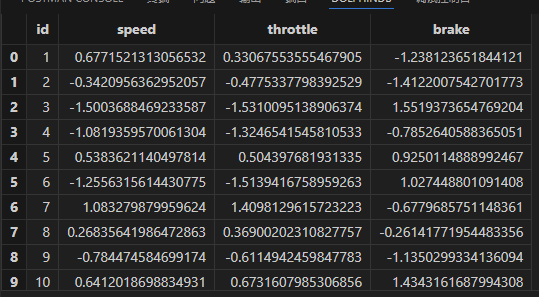
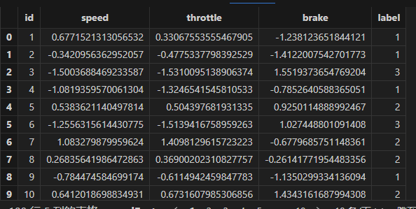
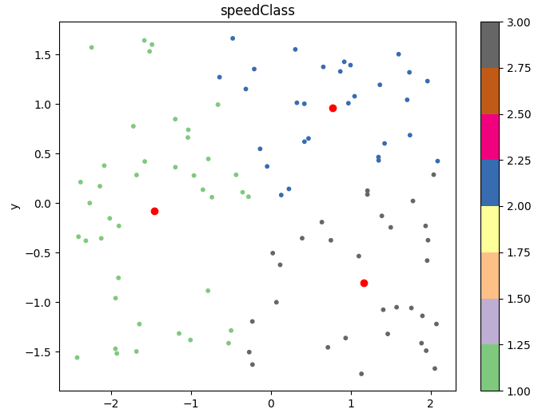
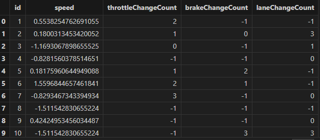
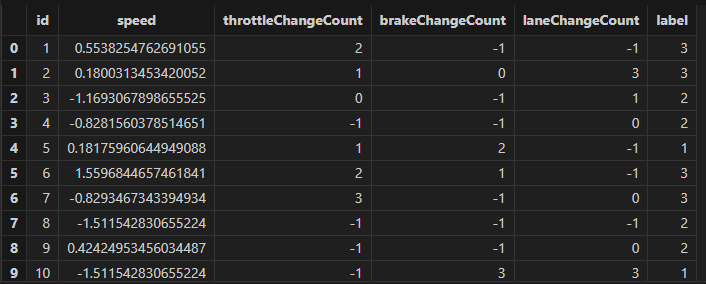
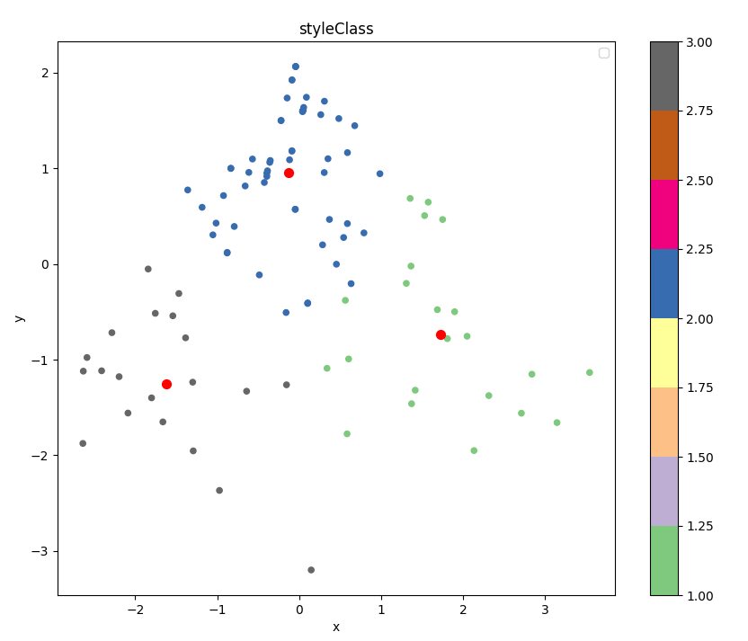
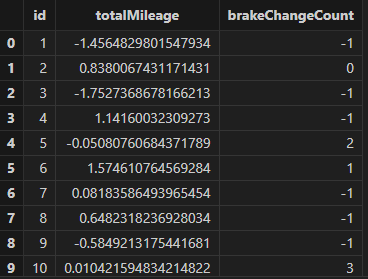
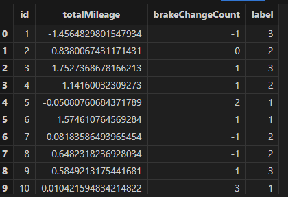
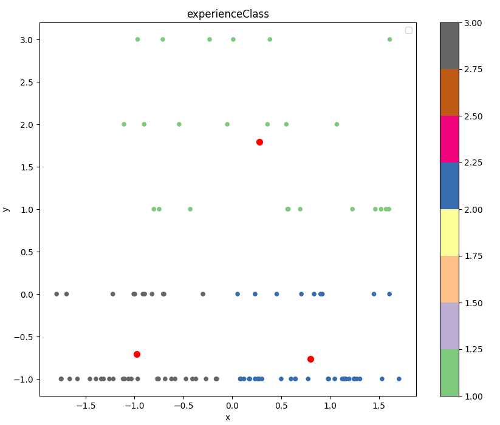

# 使用 DolphinDB 进行汽车用户驾驶习惯行为画像分析

近年来，新能源汽车行业的迅速发展推动了汽车智能化的趋势。新能源汽车上配备了成千上万的传感器，这些传感器采集了大量的行车数据被用于车辆运行状况的监控与分析。但另一方面，采集到的大量行车数据，也很好的体现用户的驾驶习惯。通过对传感器数据的收集与分析，可以对驾驶员进行用车画像分析，揭示驾驶员在速度偏好、驾驶风格、驾驶熟练度等方面的行为习惯特征。从而可以对驾驶员进行分类，提供用户标签，帮助业务人员快速了解用户，为不同特征用户提供更加精准的推荐及服务。综上所述，利用车联网大数据对驾驶行为进行研究，有助于了解驾驶员的特征，并提供改进建议。

常用的用户画像分析方法有数据挖掘、机器学习、统计分析等，在实际应用中，这些方法往往结合使用，以实现对用户数据的深度挖掘和分析。在研究用户驾驶画像时，我们则通过挖掘驾驶指标，通过车辆数据和驾驶指标的聚类分析，对驾驶员行为进行分类和评价。

DolphinDB 是一款兼顾存储与计算的强大分布式数据库系统，特别适合应对用户画像分析中的大规模数据处理需求。将 DolphinDB 应用于用户画像分析中，具有以下几个方面的显著优势：

1. **高性能的数据处理能力**： DolphinDB 是为高并发、大规模数据设计的分布式数据库系统，且内置完备的分析函数库。它能够快速处理海量的时间序列数据和复杂的分析任务，如驾驶行为特征的提取和聚类分析。其强大的分析计算能力可以显著提升数据查询和处理效率，加快分析速度和响应时间。
2. **丰富的分析功能和算法支持**： DolphinDB 集成了丰富的数据分析和挖掘算法，包括聚类、回归、分类等常用的机器学习算法。例如，基于 K-means 聚类算法对用户驾驶行为进行聚类，可以帮助快速识别不同驾驶行为类型的群体，为用户画像生成提供有效支持。
3. **实时数据处理能力**： 对于需要实时数据分析和处理的场景，DolphinDB 具备强大的实时计算能力。它能够处理流数据，支持实时数据更新和查询，为用户画像分析提供及时的反馈和结果。
4. **缩短数据处理链路**：DolphinDB 的强大之处在于它能够同时处理存储和计算任务，从而大大缩短了数据处理的链路。这种集成存储与计算的能力不仅提高了数据的处理速度，也简化了整个数据分析流程，使得从数据收集到结果输出的过程更为高效和流畅。

因此本文首先从用户驾驶行程中的速度偏好、驾驶风格、熟练度三个方面描述用户画像，然后介绍如何使用DolphinDB 基于 K-means 算法的聚类模型生成用户画像，生成每个用户的速度偏好、驾驶风格和熟练度标签。

## 1. 驾驶行为画像分析

用户画像作为大数据分析的核心工具，是通过收集和分析用户的社会属性、生活习惯和消费行为等数据，从而准确地抽象出用户的信息全貌。这种全面的信息视角为企业提供了重要的数据基础，使它们能够更精准、更快速地理解和分析用户行为习惯及消费喜好等关键信息，从而在市场竞争中占据优势，奠定了大数据时代的基础。

具体来说，用户画像通过对用户数据进行标签化处理，将复杂的用户信息转化为可管理和分析的数据形式。这种标签化不仅有助于企业快速识别和理解不同用户群体，还能够深入挖掘用户的需求和行为模式，为产品开发、营销策略和服务优化提供有力支持。

用户画像的核心在于为每个用户打上适当的标签，这些标签从多个角度描述用户的特征和行为习惯。这些标签的集合构成了完整的用户画像。本文从速度偏好、驾驶风格和驾驶熟练度三个方面探讨用户驾驶行为的不同维度特征，以构建一个完整的用户画像。

### 1.1 速度偏好分析

用户的驾驶行为中的速度偏好可以通过多种数据指标来分析和表征。以下是几个主要的分析角度：

* **平均车速**：通过车辆监控系统记录的平均车速数据，可以分析驾驶行程中低速、中速、高速的分布情况，进而得出此用户的速度偏好情况
* **加速踏板及制动踏板数据**：加速踏板和制动踏板的使用频率和力度可以反映出驾驶的激烈程度。通过这些信号数据的平均值也可以量化驾驶员的速度偏好。

### 1.2 驾驶风格分析

用户的驾驶风格反映了其在道路上的行为习惯和对安全性的关注程度。以下是几个关键的分析维度：

* **变道频率**：通过车辆监控系统记录的变道次数和频率，可以分析驾驶员的变道习惯。激进驾驶者可能会频繁变换车道以寻求快速通行，而谨慎驾驶者则会尽量减少不必要的变道操作。
* **急加速和急刹车次数**：频繁的急加速和急刹车通常反映出驾驶员的激进程度。这些数据可以通过监控加速踏板和制动踏板的使用情况来获取，从而量化驾驶风格的激进程度。
* **驾驶稳定性**：驾驶稳定性可以通过车辆在行驶过程中的平稳性来衡量，例如持续速度的保持、转弯时的平稳操作等。平衡驾驶者通常会表现出相对稳定的驾驶行为，不会过于激进或过于保守。

### 1.3 驾驶熟练度分析

驾驶熟练度反映了驾驶者对不同驾驶情境的熟悉程度和技能水平。以下是几个关键的分析维度：

* **驾驶经验**：驾驶经验可以通过驾驶年限和驾驶里程来衡量。经验丰富的驾驶者通常能更好地应对复杂的驾驶情况和突发事件。
* **应对复杂路况的能力**：分析驾驶者在面对交通拥堵、复杂路口和恶劣天气时的反应和应对能力。高熟练度的驾驶者可能会更快速、更准确地做出反应，保持驾驶的稳定性和安全性。

## 2. 使用 DolphinDB 进行建模分析

上节中，我们确定了通过速度偏好、驾驶风格、熟练度三个维度刻画用户驾驶行为。本节我们将基于这三个维度，通过 K-means 算法来进行用户分类，对用户画像进行刻画。在确定方法后，首先我们需要对数据进行预处理并根据各维度提取特定的特征；之后确定每个维度需要分类的数量，并使用 K-means 聚类算法得到每个用户多个维度驾驶习惯的标签。

针对上述建模流程，通常大部分数据库系统需要依赖 Python、Matlab 等数据分析工具来完成整个流程。然而，DolphinDB 以其独特的优势显著区别于其他系统：它不仅提供了大量经过优化的计算分析函数，满足数据预处理和特征提取的需求，还内置了诸如 K-means、随机森林、SVM 等经典机器学习算法。这使得在 DolphinDB 中可以完整实现模型构建的流程。

### 2.1 数据模拟

基于上述三个维度，我们模拟一个具有如下结构的车辆驾驶数据：

| **字段名称** | **字段类型** | **说明** |
| --- | --- | --- |
| name | STRING | 驾驶员名称 |
| id | INT | 车辆ID |
| ts | TIMESTAMP | 数据采集时间 |
| totalMileage | DOUBLE | 驾驶里程 |
| speed | DOUBLE | 行驶车速 |
| throttle | DOUBLE | 油门位置 |
| brake | DOUBLE | 刹车位置 |
| lane | INT | 车道 |

使用如下脚本模拟车辆的一段行程数据：

```
def simulateData(num,idNum,freq){
    setRandomSeed(10086)
    name = "user"+string(take(1..idNum,num))
    id = take(1..idNum,num)
    ts =stretch((now() + (1..int(num\idNum))*freq),num)
    totalMileage = rand(10000,idNum)
    t = table(name,id,ts)
    addColumn(t,[`totalMileage,`speed,`throttle,`brake,`lane],[DOUBLE,DOUBLE,DOUBLE,DOUBLE,INT])
    for(i in 1..idNum){
        avg = rand(100,1)[0]
        std = rand(10,1)[0]
        speedTmp = randNormal(avg,std,int(num\idNum))
        totalMileageTmp = totalMileage[i-1]+cumsum(speedTmp/36000)
        avg = rand((avg-10)..(avg+10),1)[0]
        std = rand(10,1)[0]
        throttleTmp = randNormal(avg,std,int(num\idNum))
        avg = rand(100,1)[0]
        std = rand(10,1)[0]
        brakeTmp = randNormal(avg,std,int(num\idNum))
        laneTmp = stretch(rand(1..4,rand(1..(avg+1),1)[0]),int(num\idNum))
        update t set  speed = speedTmp where id = i
        update t set  throttle = throttleTmp where id = i
        update t set  brake = brakeTmp where id = i
        update t set  lane = laneTmp where id = i
        update t set  totalMileage = totalMileageTmp where id = i
    }
    return t
}

//模拟数据总量
num = 1000000
//模拟车辆数
idNum = 100
//采集频率（ms)
freq = 100
t = simulateData(num,idNum,freq)
```

### 2.2 速度偏好建模

在速度偏好分析中，我们选定了车速、加速踏板及制动踏板数据三个角度来分析用户的速度偏好。根据我们模拟的数据，我们使用车速、油门位置和刹车位置数据作为这三个分析维度的表征。 利用车速的平均值表示驾驶过程中的速度，以及使用油门位置和刹车位置的平均值来分别表示驾驶过程中的加速和减速特征。在下文中，我们将速度偏好分为低速、中速、高速三类，以进行聚类分析。一般而言，速度平均值和油门位置平均值越高，则速度偏好越倾向于高速偏好。

数据预处理和特征提取部分，在 DolphinDB 使用一个 SQL 语句即可同时完成。

首先是对数据进行预处理，将异常数据进行规范化。在速度分析中，对速度、油门位置、刹车位置数据进行清洗，具体为将小于0的速度、油门位置、刹车位置数据赋值为0，大于100的油门位置、刹车位置数据赋值为100。在 DolphinDB 中使用 `iif` 函数即可实现简洁、高效的数据清洗。对清洗后数据按车辆维度进行聚合，即可获得速度平均值、油门平均值和刹车平均值等速度特征值。

为了消除不同特征间的量纲差异，我们可以直接调用 DolphinDB 的 `zscore` 函数对数据进行标准化处理：

```
speedFactor = select avg(iif(speed<0,0,speed)) as speed,
              avg(iif(throttle<0,0,iif(throttle>100,100,throttle))) as throttle,
              avg(iif(brake<0,0,iif(brake>100,100,brake))) as brake
              from t group by id

update!(table = speedFactor,colNames = [`speed,`throttle,`brake],
newValues = <[zscore(speed),zscore(throttle),zscore(brake)]> )
speedFactor
```



获取特征值后，我们利用 DolphinDB 的 K-means 算法对用户进行分类，以确定他们的速度偏好。本文将用户的速度偏好分为三类：低速、中速和高速。通过调用 DolphinDB 的 `kmeans` 函数，即可以轻松完成模型的训练，还能利用该模型对新老用户的速度偏好进行分类预测。

```
model = kmeans(speedFactor[:,1:4],3,1000,,"k-means++")
speedFactor[`label] = model.kmeansPredict(speedFactor[:,1:4])
speedFactor
```



通过 K-means 算法对用户速度偏好进行聚类后，我们可以明显看出三类用户的分割界限清晰，分类效果较好。具体来看，低速偏好用户的车速、油门位置平均值较低，刹车位置的平均值较高，表明他们更倾向于保守和谨慎的驾驶风格；中速偏好用户的各项指标则处于中等水平，反映出他们在驾驶过程中较为平衡；而高速偏好用户的车速和油门位置的平均值较高，刹车位置平均值较低，显示出他们偏好快速行驶，驾驶风格更加激进。这些聚类结果为进一步分析用户行为、优化驾驶体验提供了重要依据。

分类效果图如下，采用 PCA 降维将特征维度降为二维，红点表示聚类中心，绿点表示高速偏好的用户，蓝点表示中速偏好用户，灰点表示低速偏好用户：



### 2.3 驾驶风格偏好建模

驾驶风格偏好将分为谨慎驾驶、平衡驾驶和激进驾驶三类，通过速度标准差，激进操作（包括急刹和急加速次数，变道次数）等数据进行反映。速度标准差越大，激进操作次数越多，表明该驾驶员更倾向于激进驾驶的风格。

第一步仍然是进行数据预处理和特征提取。首先，使用 `iif` 函数对数据进行预处理；接着，通过 `deltas` 函数计算油门和刹车位置的前后差值，并利用 `iif` 函数对这些差值进行分类，将大于20的差值归类为急刹车和急加速。同样地，通过 `iif` 函数统计车道前后变化情况，以确定变道次数。完成这些步骤后，按车辆维度聚合数据，提取出速度的标准差、急刹次数、急加速次数和变道次数等关键特征值。获取到特征值后，调用 `zscore` 函数对数据进行标准化处理：

```
styleFactor = select std(iif(speed<0,0,speed)) as speed,
sum(iif(deltas(iif(throttle<0,0,iif(throttle>100,100,throttle)))>20,1,0)) as throttleChangeCount,
sum(iif(deltas(iif(brake<0,0,iif(brake>100,100,brake)))>20,1,0)) as brakeChangeCount,
sum(iif(lane!=prev(lane),1,0)) as laneChangeCount
from t group by id

update!(table = styleFactor,
colNames = [`speed,`throttleChangeCount,`brakeChangeCount,`laneChangeCount],
newValues = <[zscore(speed),zscore(throttleChangeCount),zscore(brakeChangeCount),
	zscore(laneChangeCount)]>)
styleFactor
```



调用Kmeans方法，对用户驾驶偏好进行建模，分为三类：



通过对驾驶风格偏好的聚类分析，我们将驾驶员分为三类：谨慎驾驶、平衡驾驶和激进驾驶。从聚类结果来看，这三类驾驶员的特征区分度明显。谨慎驾驶的驾驶员速度波动小，急刹车和急加速次数少，变道较谨慎，且占比相对较高，表明多数驾驶员倾向于稳健安全的驾驶风格。平衡驾驶的驾驶员表现出适度的速度变化，偶尔有急刹车和急加速操作，变道次数适中，通常在安全性和效率之间取得平衡。激进驾驶的驾驶员速度波动大，频繁急刹车、急加速和变道，占比较小但行车风格激进，可能在特定情况下追求操作的极限。

聚类效果图如下，采用 PCA 降维将特征维度降为二维，红点表示聚类中心，灰点表示激进风格的用户，绿点表示平衡风格的用户，蓝点表示谨慎风格的用户：



### 2.4 熟练度偏好分析

熟练度特征主要反应了驾驶人员的娴熟程度，在本节，采用驾驶总里程和行程中急刹的次数进行表征，其中急刹车次数反映了驾驶员的操作习惯和反应能力，用来表示用户面对复杂路况的能力。通过这两个指标驾驶人员分为新手、熟练和老手。

同理也是对数据进行特征提取，并进行模型训练。因为驾驶总里程是一个递增值，因此我们使用 last 函数取最后一个值作为特征值，急刹次数的特征提取同上节。特征提取后进行了归一化处理：

```
experienceFactor = select last(totalMileage) as totalMileage,
sum(iif(deltas(iif(brake<0,0,iif(brake>100,100,brake)))>20,1,0)) as brakeChangeCount
from t group by id
update!(table = experienceFactor,colNames = [`totalMileage,`brakeChangeCount],
newValues = <[zscore(totalMileage),zscore(brakeChangeCount)]>)
experienceFactor
```



训练模型，并预测得到分类结果：

```
model = kmeans(experienceFactor[:,1:3],3,1000,,"k-means++")
experienceFactor[`label] = model.kmeansPredict(experienceFactor[:,1:3])
experienceFactor
```



通过熟练度偏好的聚类分析，我们将驾驶人员分为新手、熟练驾驶员和老手三类。新手驾驶员的总里程较低，急刹车次数也较少，表现出较为谨慎但经验不足的驾驶特点；熟练驾驶员则在驾驶经验和操作能力上处于中等水平，总里程数较高，但急刹车次数也较高，驾驶行为相对激进但能够较好地应对日常驾驶情境；老手驾驶员总里程高，急刹车次数较少，展现出更成熟的驾驶技术和驾控自信。聚类结果清晰地反映了不同驾驶员在熟练度上的差异，有助于理解用户在驾驶过程中的经验层次。

具体聚类效果如下，指标本身是二维数据，不需要进行降维。红点表示各类别的聚类中心，蓝点表示老手，驾驶技术娴熟，灰点表示熟练加速员，绿点表示新手：



## 3. 小结

本教程以一个简单的用户画像分析案例为例，生动展示了 DolphinDB 在数据分析中的卓越性能。使用 DolphinDB ，用户能够在单一平台上完成数据存储、处理、特征提取、模型构建以及预测等全过程，且操作简便高效。案例提供了清晰易懂的代码示例，使用户能够轻松理解和应用于其他类似场景，从而进一步扩展其在实际应用中的适用范围。通过本案例，用户可以快速掌握如何利用 DolphinDB ，解决复杂数据分析中的挑战，实现数据驱动的决策和业务优化。

## 4. 附录

[案例脚本](script/behavioral_profiling_of_driving_habits/demo.dos)

