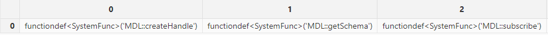
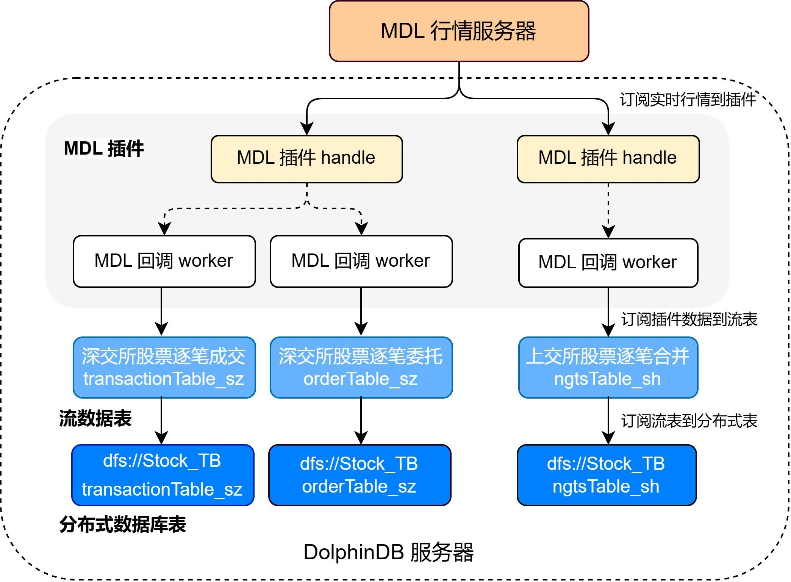
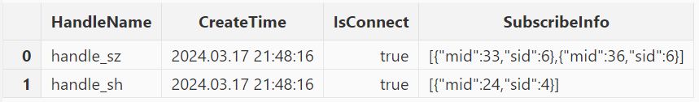
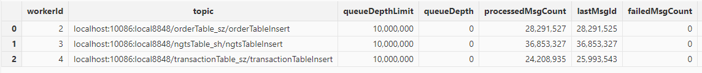

# MDL 行情插件最佳实践指南

通联数据依托于金融大数据，结合人工智能技术为投资者提供个性化、智能化、专业化投资服务。而 MDL 是通联数据提供的高频行情数据服务，DolphinDB 提供了能够从 MDL 服务器获取高频行情数据的 DolphinDB MDL 插件，帮助用户方便地通过 DolphinDB 脚本语言将实时行情数据接入 DolphinDB 中，以便进行后续的计算或存储。

本文主要介绍如何通过 MDL 插件将实时行情数据写入分布式数据库。本文全部代码需要运行在 2.00.11 或者更高版本的 DolphinDB Server 以及插件上，目前仅支持 Linux 系统。

## 1. MDL 行情插件介绍

MDL 插件基于 MDL 官方提供的行情数据服务 C++ SDK（即 TCP 版本 MDL）实现。MDL 插件最核心的功能是实现了行情回调函数，每次接收到行情时会写入订阅时所指定的 DolphinDB 共享流表中。DolphinDB MDL 插件目前已经支持了包括上交所、深交所、中金所 、郑商所、上期能源、大商所、广期所数据源的 50 余种数据类型，订阅使用所需指定的参数详情见下文。具体MDL 插件的接口介绍见 [DolphinDB MDL Plugin 使用说明](../plugins/MDL.md)。

## 2. 基本使用介绍

### 2.1 安装插件

MDL 插件目前可以在 2.00.11 版本及以后的 DolphinDB Server 通过插件市场进行安装。节点启动后，连接节点并在 GUI（或 VS Code、Web UI）等 [DolphinDB 客户端](https://docs.dolphindb.cn/zh/db_distr_comp/clients.md)中执行 `installPlugin` 函数，则可以下载到与当前 server 版本适配的 MDL 插件文件，插件文件包括插件描述文件及插件的二进制文件。

```
login("admin", "123456")
installPlugin("mdl")
```

`installPlugin` 函数若正常返回，则代表下载成功，其返回值为插件描述文件（*PluginMDL.txt*）的安装路径，如：

```
/path_to_dolphindb_server/server/plugins/MDL/PluginMDL.txt
```

`installPlugin` 函数实际上是完成从远程文件服务器拉取插件文件到 DolphinDB Server 所在的服务器，压缩后的 MDL 包大小约为 60 MB，下载需要一定的耗时。

### 2.2 加载插件

在脚本中调用插件相关的接口前，需要先加载插件。在 GUI（或 VS Code、Web UI）等[客户端](https://docs.dolphindb.cn/zh/db_distr_comp/clients.md)中执行 `loadPlugin("mdl")`。以下示例中使用了相对路径，也可以使用 2.1 中返回的绝对路径 */path\_to\_dolphindb\_server/server/plugins/MDL/PluginMDL.txt*。

```
loadPlugin("./plugins/MDL/PluginMDL.txt")
```

`loadPlugin` 函数正常返回则插件加载成功，以 VS Code 为例，首次加载成功后返回的部分信息如下，返回值内容是 MDL 插件所提供的函数：



## 3. 行情的接入与存储

本章以订阅沪深两市的全市场股票的逐笔数据、实时写入 DolphinDB 分布式数据库为例，对 MDL 插件的使用进行说明。

### 3.1 数据接入方案

数据接入的流程如下：

* 通过 MDL 插件订阅深圳市场的股票逐笔委托、逐笔成交，以及上海市场的逐笔合并数据逐笔数据写入 DolphinDB 的三个持久化流数据表。持久化流数据表是具备发布订阅功能的内存表。
* 订阅持久化流数据表写入 DolphinDB 分布式数据库，将数据存储到磁盘上。

注意：请勿使用 MDL 插件将行情数据直接写入分布式数据库。因为分布式数据库并不适用于此类高频的流式写入。建议在使用时，借助流数据表及其发布订阅功能以实现部分的批处理。这样既可以提高写入的吞吐量，也有助于降低时延。



MDL 行情接收流程图

下面分步骤介绍关键的 DolphinDB 代码实现，完整脚本见附录。

### 3.2 数据接入方案实施步骤

#### 3.2.1 流表和分布式表规划

注意：为保证后续的 `enableTableShareAndPersistence` 函数能够正常执行，需要节点启动之前在配置文件中（单节点：*dolphindb.cfg*，集群：*cluster.cfg*）指定配置参数 *persistenceDir*，配置参考[功能配置](https://docs.dolphindb.cn/zh/db_distr_comp/cfg/function_configuration.md)。

**获取表结构**

调用 `MDL::getSchema` 方法可以获取行情数据各个表的表结构。运行以下代码可以获取上海股票逐笔合并、深圳股票逐笔成交和逐笔委托三张表的表结构：

```
// 深交所股票逐笔成交
transactionSchema = MDL::getSchema(`MDLSID_MDL_SZL2, 36);
// 深交所股票逐笔委托
orderSchema = MDL::getSchema(`MDLSID_MDL_SZL2, 33);
// 上交所股票逐笔合并
ngtsSchema = MDL::getSchema(`MDLSID_MDL_SHL2, 24);
```

**创建持久化流数据表**

得到行情数据的表结构后，使用该表结构创建持久化流数据表。

```
cacheSize = 1000000

enableTableShareAndPersistence(table=streamTable(cacheSize:0, transactionSchema[`name], transactionSchema[`type]), tableName=`transactionTable_sz, cacheSize=cacheSize)
enableTableShareAndPersistence(table=streamTable(cacheSize:0, orderSchema[`name], orderSchema[`type]), tableName=`orderTable_sz, cacheSize=cacheSize)
enableTableShareAndPersistence(table=streamTable(cacheSize:0, ngtsSchema[`name], ngtsSchema[`type]), tableName=`ngtsTable_sh, cacheSize=cacheSize)
```

代码第二行的 `cacheSize` 变量控制了在建表时预分配内存的大小、以及流数据表可占用的最大内存，其单位是行，设置较大的 `cacheSize` 可以降低出现峰值时延的频率。具体大小可以根据实际的可使用的内存大小决定。具体优化原理可参考 [D](https://gitee.com/dolphindb/Tutorials_CN/blob/master/streaming_timer.md#211-%E5%88%9B%E5%BB%BA%E8%A1%A8%E6%97%B6%E9%A2%84%E5%88%86%E9%85%8D%E5%86%85%E5%AD%98)[olphinDB 流计算时延统计与性能优化](https://docs.dolphindb.cn/zh/tutorials/streaming_timer.html#%E5%86%85%E7%BD%AE%E7%8A%B6%E6%80%81%E5%87%BD%E6%95%B0%E4%B8%8E%E5%A2%9E%E9%87%8F%E8%AE%A1%E7%AE%97)。

**创建分布式数据库**

为将行情数据存入分布式数据库，需要根据之前得到的行情数据表结构来创建分布式库表，分区规则参考自[《基于 DolphinDB 存储金融数据的分区方案最佳实践》](https://docs.dolphindb.cn/zh/tutorials/best_practices_for_partitioned_storage.md)。

注意：由于 MDL 没有当天的日期字段，因此需要手动增加日期字段以便于分区。

```
transactionColName = transactionSchema[`name]
transactionColName.append!("Date")
transactionColType = transactionSchema[`type]
transactionColType.append!(DATE)
orderColName = orderSchema[`name]
orderColName.append!("Date")
orderColType = orderSchema[`type]
orderColType.append!(DATE)
ngtsColName = ngtsSchema[`name]
ngtsColName.append!("Date")
ngtsColType = ngtsSchema[`type]
ngtsColType.append!(DATE)

dbName = "dfs://Stock_TB"
transactionTbName = "transactionTable_sz"
orderTbName = "orderTable_sz"
ngtsTbName = "ngtsTable_sh"

dbDate = database(, partitionType=VALUE, partitionScheme=2024.01.01..2025.01.01)
dbID = database(, partitionType=HASH, partitionScheme=[SYMBOL, 25])
db = database(directory=dbName, partitionType=COMPO, partitionScheme=[dbDate, dbID],engine='TSDB',atomic='CHUNK')

tbSchema = table(1:0, transactionColName, transactionColType)
db.createPartitionedTable(table=tbSchema,tableName=transactionTbName,partitionColumns=`Date`SecurityID,sortColumns=`SecurityID`TransactTime)
tbSchema = table(1:0, orderColName, orderColType)
db.createPartitionedTable(table=tbSchema,tableName=orderTbName,partitionColumns=`Date`SecurityID,sortColumns=`SecurityID`TransactTime)
tbSchema = table(1:0, ngtsColName, ngtsColType)
db.createPartitionedTable(table=tbSchema,tableName=ngtsTbName,partitionColumns=`Date`SecurityID,sortColumns=`SecurityID`TickTime)
```

#### 3.2.2 订阅 MDL 行情将增量数据到流数据表

**建立 MDL 连接句柄**

用户配置 MDL 的连接信息及验证 TOKEN，使用 `MDL::createHandle` 函数创建连接的句柄。注意创建连接句柄并没有连接，只有在执行 `MDL::connectMDL` 后才会真正进行连接、接收数据。

因为通联 MDL 不支持同时订阅在不同服务器的数据源，也就是当同时订阅上交所 L2 和深交所 L2 时，只能收到其中一个数据源的行情。为了解决这个问题，需要创建两个句柄，分别订阅上交所 L2 和深交所 L2 的数据。

需要注意的是，在 `createHandle` 建立连接时可以指定 `workerNum` 线程数，如果指定了大于 1 的线程数，则 MDL 的回调会在多个线程内进行，因此写入 DolphinDB 流表的过程也是多线程的。下面的例子中指定线程数为 1，即单线程进行回调。

```
// 配置连接
HOST =  ["mdl-sse01.datayes.com","mdl01.datayes.com","mdl02.datayes.com","mdl01.datayes.com","mdl02.datayes.com","mdl01.datayes.com","mdl02.datayes.com","mdl01.datayes.com","mdl02.datayes.com","mdl-cloud-bj.datayes.com","mdl-cloud-sz.datayes.com","mdl01.datayes.com","mdl02.datayes.com"]
PORT =  [19010,19011,19011,19010,19010,19013,19013,19012,19012,19012,19012,19018,19018]
// TOKEN 根据实际需要进行替换
USERNAME = "97887ADLJFKAJLSDF98976WRUJD0KJDFLAKJDS"

handle_sh = MDL::createHandle(`handle_sh, HOST, PORT, USERNAME, 1)
handle_sz = MDL::createHandle(`handle_sz, HOST, PORT, USERNAME, 1)
```

**订阅行情数据**

使用 `MDL::subscribe` 函数进行 MDL 行情订阅，在订阅时需要传入要订阅的数据服务 ID 和版本号，并指定消息 ID。

```
// 深交所股票数据
MDL::subscribe(handle_sz, orderTable_sz, `MDLSID_MDL_SZL2, `MDLVID_MDL_SZL2, 33)
MDL::subscribe(handle_sz, transactionTable_sz, `MDLSID_MDL_SZL2, `MDLVID_MDL_SZL2, 36)
// 上交所股票数据
MDL::subscribe(handle_sh, ngtsTable_sh, `MDLSID_MDL_SHL2, `MDLVID_MDL_SHL2, 24)
```

有关 MDL 插件对数据品类的支持情况和相关订阅参数，请联系 DolphinDB 技术支持。

#### 3.2.3 订阅流表写入分布式库

订阅 3.2 节中的三个持久化流数据表，将增量数据实时写入分布式数据库。

```
Transaction = loadTable(database=dbName, tableName=transactionTbName)
Order = loadTable(database=dbName, tableName=orderTbName)
Ngts = loadTable(database=dbName, tableName=ngtsTbName)

def handleInsert(tb, mutable msg) {
	msg.addColumn("Date", DATE)
	msg.replaceColumn!("Date", take(date(now()), msg.size()))
	tableInsert(tb, msg)
}

subscribeTable(tableName="transactionTable_sz", actionName="transactionTableInsert", offset=-1, handler=handleInsert{Transaction}, msgAsTable=true, batchSize=20000, throttle=1, reconnect=true)
subscribeTable(tableName="orderTable_sz", actionName="orderTableInsert", offset=-1, handler=handleInsert{Order}, msgAsTable=true, batchSize=20000, throttle=1, reconnect=true)
subscribeTable(tableName="ngtsTable_sh", actionName="ngtsTableInsert", offset=-1, handler=handleInsert{Ngts}, msgAsTable=true, batchSize=20000, throttle=1, reconnect=true)
```

* `handleInsert` 自定义函数会手动新增一列新的 Date 数据，并写入当天的日期。
* 通过调整 [subscribeTable](https://docs.dolphindb.cn/zh/funcs/s/subscribeTable.md) 函数中的 \*batchSize \*和 \*throttle \*参数可以控制写入分布式数据库的频率。
  + *batchSize*=20000 表示当未处理消息的数量达到 20000 时，handler 才会处理消息。
  + *throttle*=1 表示继上次 handler 处理消息之后，若未处理消息的数量还没有达到 20000 ，但是时间间隔 1s 后也会处理消息。
  + 因此，达到 \*batchSize \*设置的条件或者达到 \*throttle \*设置的条件，才会向分布式数据库写入一次。

#### 3.2.4 启动 MDL 连接，开启数据写入

由于 MDL 需要在连接前设置完数据的订阅，连接后将无法添加订阅。所以在订阅后，使用函数 `MDL::connectMDL` 连接 MDL，行情数据将进入流数据表。

```
MDL::connectMDL(handle_sh)
MDL::connectMDL(handle_sz)
```

### 3.3 MDL 运行状态监控

运行过程中，可以查看 MDL 行情的接收情况。可以使用 `MDL::getHandleStatus` 查询 MDL 行情的接收情况。

```
stat = MDL::getHandleStatus()
select HandleName,CreateTime,IsConnect,SubscribeInfo from stat
```

返回结果如下，可以看到在本例提交了 MDL 订阅，订阅了深交所的逐笔成交和逐笔委托，以及上交所的逐笔合成，目前的连接状态为 true。



查询流表的订阅，可以看到发布订阅都正常进行。

```
getStreamingStat().subWorkers
```



查询 dfs 表中某一只股票的数据，观察数据。这里查询 `600100` 这支上交所股票的数据，执行以下命令，从 dfs 表中获取了从连接之后的所有该股票的逐笔数据。

```
select * from loadTable("dfs://Stock_TB", "ngtsTable_sh") where SecurityID=`600100
```


至此，已经成功订阅上交所和深交所的逐笔数据并将它落盘到 DolphinDB 分布式表中。

## 附录

### 1. 订阅落库的脚本文件

[MDL落库脚本.dos](script/mdl/MDL%E8%90%BD%E5%BA%93%E8%84%9A%E6%9C%AC.dos)

### 2. 常见问题

* 如果重复执行 `loadPlugin` 加载插件，会抛出模块已经被使用的错误提示，因为节点启动后，只允许加载一次 MDL 插件，即可在任意会话中调用该插件提供的函数。错误提示如下：

```
The module [MDL] is already in use.
```

可以通过 `try-cach` 语句捕获这个错误，避免因为插件已加载而中断后续脚本代码的执行：

```
try{ loadPlugin("./plugins/MDL/PluginMDL.txt") }catch(ex){print ex}
```

