# 存算分离最佳实践教程

存算分离架构是一种现代数据处理设计理念，旨在通过将计算和存储资源分离，提高系统的灵活性和性能。自 3.00.2 版本起，DolphinDB
引入了计算组的概念，通过为计算节点设置计算组，允许计算节点对查询的数据进行缓存，实现了存算分离架构。

本教程介绍 DolphinDB 存算分离架构的应用场景、配置方法、以及在数据库查询和并发查询测试场景中的性能测试结果。本教程全部代码需要运行在 3.00.2 或者更高版本的
DolphinDB server 上。

## 1. 存算分离架构应用场景

在企业级行情中心或数据中台的搭建过程中，随着用户数量和业务数据量的不断增加，系统的稳定性和性能成为了关键问题。尤其是在具有多资源组和多业务部门的使用场景下，不同业务部门之间对数据的使用需求和处理习惯往往存在较大差异，导致存储和计算资源的配置需求愈加复杂。在这种情况下，存算分离的架构配置成为了一种有效的解决方案。

DolphinDB
的存算分离架构主要通过引入计算组的概念实现。计算组由多个计算节点组成，是资源和故障隔离的基本单位。每个计算组中计算节点的数量和资源由用户配置，并直接影响计算组的计算能力。计算组拥有多级缓存机制，针对热点写入分区，热点查询分区和首次查询分区，可以采用不同的缓存策略，从而优化查询性能。在业务高峰或低谷时期，计算节点可以快速增减，且存储节点对此过程无感知。

具体来说，DolphinDB 存算分离架构推荐在以下业务场景中使用：

**多个用户组之间的资源隔离**

对于存在多个业务团队或部门，且团队之间对数据的使用方式有较大差异的场景，团队之间对数据服务通常会有不同需求，这些需求使得存算一体的架构难以满足所有团队对性能和稳定性的要求。使用存算分离架构，管理员可以为不同团队配置对应的计算组，不同计算组配置与需求相匹配的计算节点数量和功能参数。计算组由多个计算节点组成，每个计算节点只属于一个计算组。通过权限管理功能，管理员可以控制用户对计算组的访问，用户只能使用本计算组的计算资源，避免组间相互干扰和资源竞争。此外，不同计算组之间的故障也不会互相影响。

**数据节点和计算节点的隔离**

数据节点的稳定可用是数据存储的基本要求之一。针对这种场景，存算分离架构能够实现计算节点和数据节点之间的资源隔离，避免密集计算任务挤占数据节点的 CPU
和内存等计算资源。存算分离架构允许计算节点对常用查询数据进行缓存，能够有效降低对存储节点的访问频率，减少计算节点对数据节点的磁盘 IO 和网络 IO
资源占用。此外，存算分离架构能够有效降低故障范围，计算节点出现故障时，数据节点不会受到影响，从而提高数据访问和存储服务的稳定性。

另外，当企业具备充足的存储和计算资源时，采用存算分离的方式可以为计算组分配独立的计算和存储资源，利用灵活的数据调度能力，对不同类型的查询采取不同的执行策略。例如将频繁查询的分区缓存到计算节点，当再次查询相同的分区的时候，查询将被调度到计算组，避免再次从数据节点读取数据产生的磁盘和网络开销，提升查询效率。

**Ad hoc 场景的用户资源分配**

Ad hoc
指即席查询，是用户根据需求临时发起的查询请求。存算分离架构支持为不同用户动态分配计算和存储资源，以确保查询的高效执行和资源的公平使用，主要体现在计算组资源分配中。管理员可以为不同用户或用户组分配不同的计算组，使用固定的
CPU 、内存等资源配额。在 Ad hoc
查询中，系统会根据计算组的配额限制来分配资源，避免某个用户的查询占用过多资源，影响其他用户的查询性能。同时，在计算组内系统可以根据用户或查询的优先级动态分配计算资源，确保不同用户的查询能够得到合理的资源支持。

## 2. 存算分离架构部署

本节介绍在几个典型的业务场景下部署存算分离架构的步骤。2.2 介绍了在新增服务器中部署计算组的配置流程，2.3
介绍了在现有服务器中部署计算组的配置流程，用户可以根据实际需求选择阅读。

### 2.1 参数配置

本节列举了存算分离相关的配置项，帮助用户在之后的部署中合理设置参数。具体参数解释请参考 [功能配置](../db_distr_comp/cfg/function_configuration.md)。

#### 2.1.1 控制节点配置项

* *computeNodeCachingDelay*：规定了一个分区在最后一次更新后，需经过设定的时间间隔，才能被缓存到计算节点，单位为秒，默认值为
  360。*computeNodeCachingDelay* 对应[查询优化策略](../db_distr_comp/db/storage_compute_separation.html#topic_xbw_sdl_cdc)中的热点写入分区缓存策略，控制一个分区最后一次更新后多久能够被缓存到计算节点。若取值不为
  0，分区更新后经过指定的延迟时间后才允许被缓存。通过这个参数，频繁写入的分区将不会被缓存，避免不必要的数据传输；而非频繁写入的分区则可以被缓存在计算组，从而加速对它们的查询。
* *computeNodeCachingQueryThreshold*：当一个分区的访问次数超过设定的阈值后，才允许将该分区缓存到计算节点，取值范围为
  [0, 32767]，默认值为 1。*computeNodeCachingQueryThreshold* 对应[查询优化策略](../db_distr_comp/db/storage_compute_separation.html#topic_xbw_sdl_cdc)中的热点查询分区缓存策略，控制一个分区被访问多少次后才能被缓存到计算节点。若取值不为
  0，分区被执行指定的访问次数后才允许被缓存。通过这个参数，只有被频繁访问的分区才会被缓存到计算组，避免计算组存储资源的浪费。
* *enableComputeNodePrefetchData*：当查询的数据不在计算节点的缓存中时，系统将从数据节点获取数据，并异步地将数据缓存到计算节点；否则将直接从数据节点获取数据并缓存到计算节点。*enableComputeNodePrefetchData*对应[查询优化策略](../db_distr_comp/db/storage_compute_separation.html#topic_xbw_sdl_cdc)中的计算节点预热缓存策略。如果不开启异步缓存，当查询的分区不在计算组缓存中，且符合热点查询和非热点写入分区的条件时，计算组将直接从数据节点拉取并缓存对应的数据，再进行查询。开启异步缓存后，当查询符合上述条件时，本次查询将依然被下推至数据节点执行。执行结束后，计算节点将立即执行一次相同的查询，这次查询会将涉及到的分区数据拉取并缓存在计算组。这种方式规避了因缓存未命中导致的网络传输代价，使用户无感知首次查询时缓存未命中的延迟。同时当下次访问该分区时，它很可能已经在缓存中了。

#### 2.1.2 计算节点配置项

* *computeNodeCacheDir*：计算节点的缓存存储位置，示例：`/ssd/ssd0/SCSeparationDDB/Disaggregation`。

  注： 一个计算节点可配置多个缓存路径，路径之间需要使用“,” 分隔，详见[配置管理](../db_distr_comp/cfg/function_configuration.html#topic_storage_compute_separation)。如果一个计算组中的不同计算节点需要单独配置磁盘路径，磁盘路径之间需要使用“,”
  分隔，且每个路径后需增加`/<ALIAS>`，示例如下：`/ssd/ssd0/SCSeparationDDB/Disaggregatio/<ALIAS>,/ssd/ssd1/SCSeparationDDB/Disaggregation/<ALIAS>,/ssd/ssd2/SCSeparationDDB/Disaggregation/<ALIAS>,/ssd/ssd3/SCSeparationDDB/Disaggregation/<ALIAS>`
* *computeNodeCacheMeta*：计算节点缓存元数据的地址。如果一个计算组中需要配置多个计算节点，每个路径后需增加`/<ALIAS>`，示例如下：`/ssd/ssd0/SCSeparationDDB/Disaggregation/<ALIAS>/meta`。
* *computeNodeMemCacheSize*：计算节点的内存缓存容量上限。
* *computeNodeDiskCacheSize*：计算节点的磁盘缓存容量上限。
* *enableComputeNodeCacheEvictionFromQueryThread*：是否从计算节点的缓存中逐出不再使用的数据。

### 2.2 横向扩展部署

本节介绍横向扩展计算组配置的具体部署过程。如图 2-1 所示，基于存算一体架构的集群是 1 个 由 3
台服务器组成的高可用集群，供不同的业务部门或业务小组使用。

图 1. 图 2-1

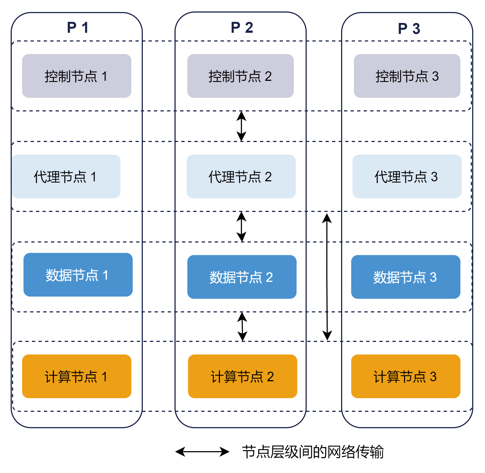

如果其中部分小组有独立的服务器资源，常用数据相对固定或希望与其他部门进行资源隔离，可以使用存算分离的架构，在集群中增加服务器并部署计算组，供小组成员使用。基于存算分离的集群架构如图
2-2 所示。示例架构在 P4 服务器上部署了一个计算组
cGroup1，其中的计算节点由代理节点统一进行管理，当读取未缓存的数据时会从数据节点进行获取。

注： 存算分离架构并不限制计算组中节点部署在哪台服务器，用户可以根据需求确定要部署的计算节点数量和所属服务器。

图 2. 图 2-2

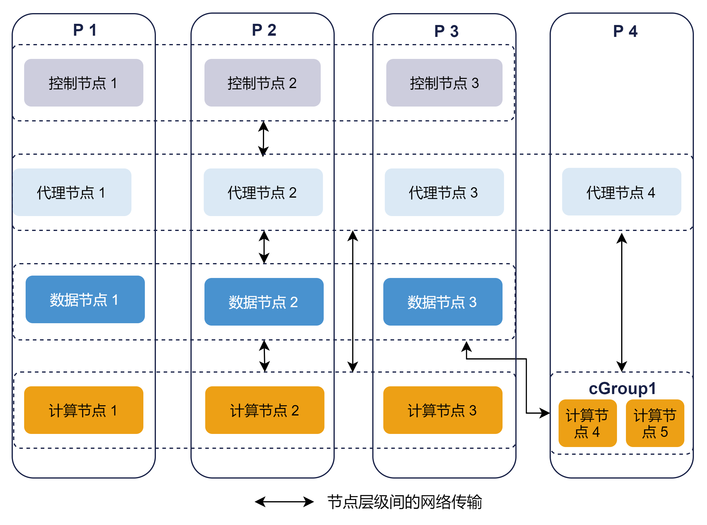

#### 2.2.1 初次部署

初次部署的具体步骤参考[附录1](#topic_ufz_qy2_h2c)：初次部署示例。

#### 2.2.2 在线动态扩展

在实际业务扩展过程中，有时我们会希望在已有的集群服务基础上新增一台服务器以满足算力需求，这时我们需要在新的服务器上先部署代理节点，再通过 web
管理界面增加计算组。

1. 部署代理节点：

* 拷贝 DolphinDB 安装包到新服务器，修改 *agent.cfg* 配置文件
* 启动代理节点
* 在线增加代理节点：如图 2-3 所示，进入控制节点的 Web 管理界面，点击左侧 **配置管理** 按钮，找到 **集群节点管理**
  页面，在已有节点下方点击 **新增节点**，输入节点信息后点击 **保存** 即可。

  图 3. 图 2-3

  

2. 增加计算组：

* 如图 2-4 所示，点击左侧 **配置管理** 按钮，找到 **集群节点管理** 页面：

  图 4. 图 2-4

  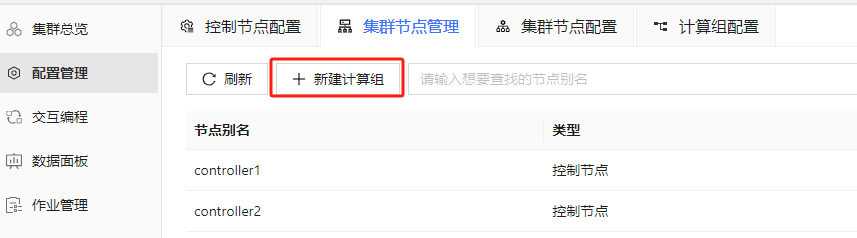

* 如图 2-5 所示，点击 **新建计算组**，可以设置计算组的名称并添加计算节点，点击
  **批量添加**，可以对节点进行批量添加：

  图 5. 图 2-5

  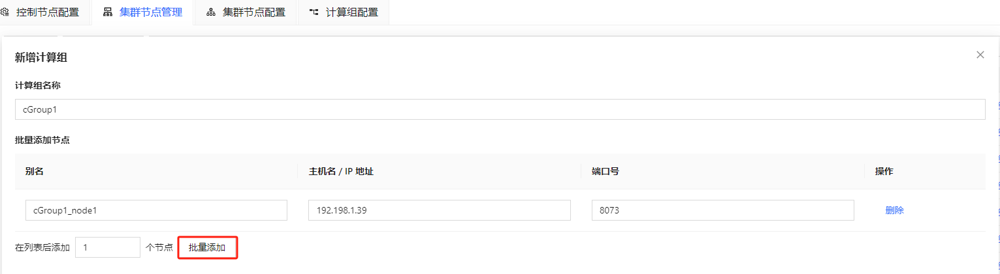

* 设置完节点后可以在页面下方进行计算组相关的参数配置。如图 2-6 所示，点击 **新增一条配置** 可以增加配置项，配置项详细信息可以参考
  [功能配置](../db_distr_comp/cfg/function_configuration.html#topic_storage_compute_separation)。不同计算组可以设置不同的参数以满足各自的业务需求和资源最优化分配。

  图 6. 图 2-6

  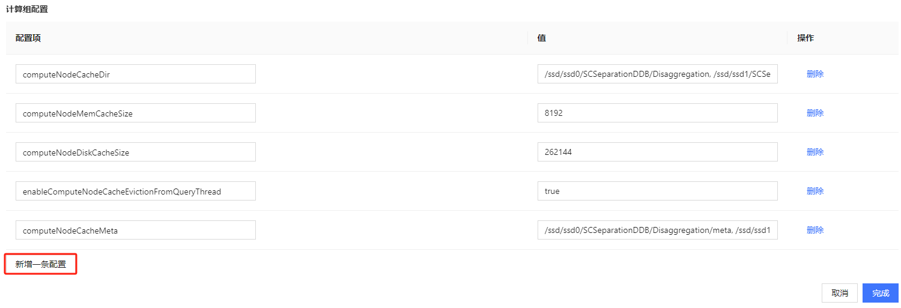

* 如果需要配置多个计算组且统一配置参数，或为计算组中的每个节点单独配置参数，可以在 **配置管理** - **集群节点配置** 中点击
  **新增配置** 进行配置。如果需要为指定计算节点配置参数，则要在 **限定词** 中填写需要配置的节点名，如图 2-7
  所示。如果要为多个计算组统一配置参数，则不需要填限定词。

  图 7. 图 2-7

  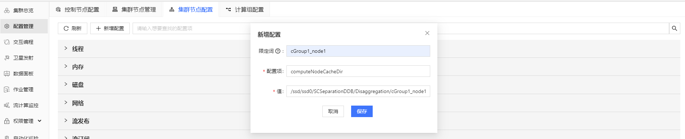

### 2.3 纵向扩展部署

有时我们不希望增加服务器，但目前部署的服务器中仍有充足的剩余磁盘空间和计算资源，这时我们可以纵向扩展集群，在已经部署 DolphinDB
集群的服务器上增加计算组，如图 2-8 所示。具体部署可以先参考 附录1 中的步骤增加 controller.cfg 的存算分离参数，再按照 2.2.2
小节的增加计算组步骤进行配置。

图 8. 图 2-8

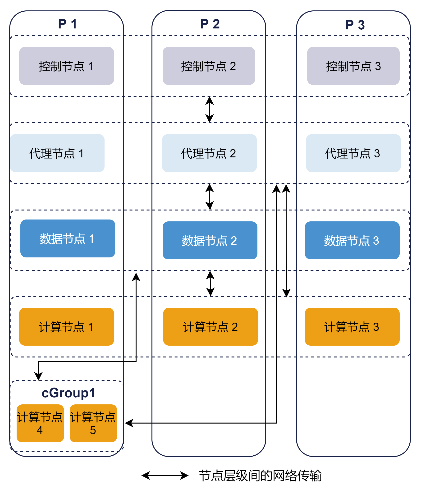

### 2.4 删除计算组

如图 2-9 所示，在 **集群节点管理** 页面，下拉到计算组部分，每个计算组旁边有 **删除计算组** 按钮，点击即可删除计算组。

图 9. 图 2-9

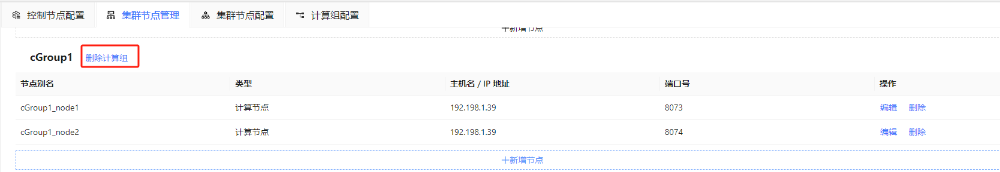

### 2.5 扩缩容计算组

对于已经配置好的计算组，我们同样可以通过 web 的集群管理进行计算节点的增加或删除。

**增加计算节点**

如图 2-10 及 2-11 所示，在 **集群节点管理** 中，点击需要增加计算节点的计算组下方 **新增节点** 并设置节点参数，设置完成后点击
**保存** 即可。注意：增加节点后，新节点默认为关闭状态，需要前往 Web 集群总览页面启动。

图 10. 图 2-10

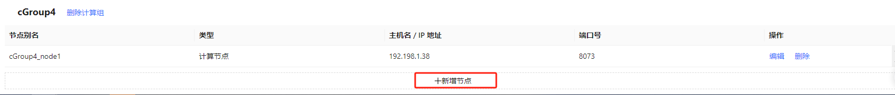

图 11. 图 2-11

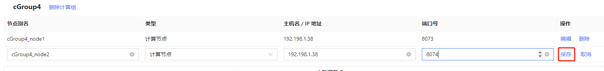

**删除计算节点**

通过从计算组中删除计算节点进行缩容。如图 2-12 所示，在 **集群节点管理** 中，点击需要删除的计算节点右侧 **删除**
按钮即可完成节点删除。

图 12. 图 2-12

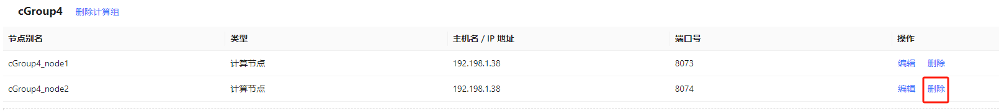

## 3. 存算分离架构性能测试

本节针对新增一台服务器部署计算组的场景，测试在配置了热点写入分区、热点查询分区和异步缓存策略之后，计算组的数据查询和计算性能。测试结果显示，在查询场景中，如果查询没有命中缓存，在计算节点进行的查询性能会低于在数据节点进行的查询性能；如果查询命中了缓存，计算节点的查询性能整体优于数据节点；在复杂计算场景中，计算组的查询性能随着计算组节点可用
CPU 核数的增加线性提高；在 Python API 并发查询场景中，QPS（每秒查询率）整体随着并发数增长而增加。

### 3.1 硬件配置

在 4 台服务器上进行测试，配置如下：

* 操作系统：CentOS Linux 7 (Core)
* CPU 型号：Intel(R) Xeon(R) Gold 5220R CPU @ 2.20GHz
* 内存：16\*32 GB RDIMM, 3200MT/s
* 网络：9.41Gbps（万兆以太网）
* 磁盘：6\*3.84TB 固态硬盘 SATA 读取密集型 6Gbps 512 2.5 英寸 Flex Bay AG 硬盘, 1DWPD

### 3.2 测试环境

本次测试在 4 台服务器上搭建了高可用集群，数据采用双副本。其中 3 台服务器配置 1 个控制节点，1 个数据节点，1 个计算节点；第 4 台服务器配置 1
个代理节点，1 个计算组，包含 2 个计算节点。

### 3.3 测试数据

使用 2023 年 2 月的通联快照和逐笔成交数据进行测试，数据使用 “时间维度按天 + 股票维度 HASH50” 的分区规则。使用存储引擎 TSDB，使用
“交易所类型 + 股票代码 + 交易时间” 作为排序列。

### 3.4 CPU 核数

测试对 3 台存储服务器设定了 CPU 核数为 12，并对计算组服务器的 CPU 核数设定了梯度测试，分别测试了 CPU 为 6、12、24 及 36
核时的性能表现。

### 3.5 计算组参数配置

* 控制节点的计算组参数均采用了默认配置：

  ```
  enableComputeNodePrefetchData=true
  computeNodeCachingQueryThreshold=1
  computeNodeCachingDelay=360
  ```
* 计算节点的计算组参数配置如下：

  ```
  computeNodeMemCacheSize=8
  computeNodeDiskCacheSize=256
  enableComputeNodeCacheEvictionFromQueryThread=true
  computeNodeCacheDir=/ssd/ssd0/SCSeparationDDB/Disaggregation/<ALIAS>, /ssd/ssd1/SCSeparationDDB/Disaggregation/<ALIAS>, /ssd/ssd2/SCSeparationDDB/Disaggregation/<ALIAS>, /ssd/ssd3/SCSeparationDDB/Disaggregation/<ALIAS>
  computeNodeCacheMeta=/ssd/ssd0/SCSeparationDDB/Disaggregation/<ALIAS>/meta, /ssd/ssd1/SCSeparationDDB/Disaggregation/<ALIAS>/meta, /ssd/ssd2/SCSeparationDDB/Disaggregation/<ALIAS>/meta, /ssd/ssd3/SCSeparationDDB/Disaggregation/<ALIAS>/meta
  ```

### 3.6 数据库查询测试

本节在计算节点 cGroup1\_node1 和数据节点 dnode1
上进行了数据查询和计算场景的测试，验证存算分离架构中的计算组查询和计算性能，对结果进行了统计。查询和计算测试在写入完成 5 分钟后进行（对应
computeNodeCachingDelay
参数，即查询数据非热点写入分区），每种核数的计算节点测试完成之后会清除缓存中的数据。冷查询表示在无数据缓存的情况下进行查询，热查询在对应的冷查询结束一段时间后执行（对应
computeNodeCachingQueryThreshold 参数，即查询数据为热点查询分区），此时对应的分区数据已经在缓存中。查询数据源为 level-2
快照表，查询 query 见附录 2。

* case 1：小数据量范围查询，随机 1 只股票 1 天的逐笔成交数据，查询数据量约 12,613 行 \* 19 列数据，内存占用 1.3
  MB，涉及分区数量为 1。计算节点 CPU 核数设置为 12，测试数据节点冷查询性能、计算节点无缓存查询性能、计算节点有缓存查询性能。

|  | **数据节点冷查询/ms** | **计算节点冷查询/ms** | **计算节点热查询/ms** |
| --- | --- | --- | --- |
| 1 | 24 | 68 | 6 |

测试结果显示，在计算节点没有命中缓存的情况下，由于计算节点要将查询任务下推到数据节点执行，再将结果返回计算节点，增加了节点间网络 IO
开销，计算节点的冷查询性能会低于数据节点。在计算节点命中缓存的情况下，由于数据节点分布在三台服务器且采用双副本存储，所以部分查询会产生节点间网络 IO
开销，计算节点的查询性能会优于数据节点。

* case 2：大数据量范围查询，全市场股票 1 天的逐笔成交数据，查询数据量约 92,352,296 行 \* 19 列数据，内存占用 9.7
  GB，涉及分区数量为 50。分别测试了计算组服务器的 CPU 核数 为 6、12、24 及 36 核时的性能表现。

|  | **数据节点冷查询/ms** | **计算节点冷查询/ms** | **计算节点热查询/ms** |
| --- | --- | --- | --- |
| 1 | 6,673 | 6核：20,637 | 6核：8,481 |
| 2 | 12核：17,245 | 12核：6,061 |
| 3 | 24核：15,306 | 24核：3,032 |
| 4 | 36核：14,909 | 36核：2,628 |

测试结果显示，在查询涉及到分区数较多时，查询性能随着计算组 CPU 核数增加而提高。

* case 3：大数据量聚合计算，按股票对全市场股票 1 周数据进行聚合，计算成交价最大值，查询数据量约 6,463 行 \* 2 列数据，内存占用 76
  KB，涉及分区数量为 250。分别测试了计算组服务器的 CPU 核数 为 6、12、24 及 36 核时的性能表现。

| 1 | **数据节点冷查询/ms** | **计算节点冷查询/ms** | **计算节点热查询/ms** |
| --- | --- | --- | --- |
| 2 | 1,328 | 6核：3,895 | 6核：2,804 |
| 3 | 12核：2,064 | 12核：1,439 |
| 4 | 24核：1,762 | 24核：809 |
| 5 | 36核：1,660 | 36核：617 |

测试结果显示，对于大数据量聚合场景，查询性能随着计算节点可用 CPU 核数的增加线性提高。在 3 个数据节点，每个节点 12
核的情况下，使用数据节点进行涉及到多分区的计算任务时，可以将任务下发到每个节点，充分运用每个数据节点的 CPU 资源，而计算组由于只能使用组内节点的 CPU
资源，所以当计算组 CPU 核数低于数据节点总核数时，数据节点在复杂计算中的性能会优于计算组节点。

### 3.7 预热缓存策略测试

本节在计算节点 cGroup1\_node1 上进行了预热缓存策略的性能测试，并对结果进行了统计。预热缓存策略对应参数
*enableComputeNodePrefetchData* ，具体参数解释参考
2.1.1。如果不开启异步缓存，当查询未命中缓存且符合缓存条件的分区时，计算节点会先从数据节点拉取数据并缓存，再执行查询。开启预热缓存后，查询上述分区时，查询将被下推到数据节点，之后再进行异步缓存，因此对于上述查询，开启预热缓存后的网络延迟会更低。

测试在写入完成 5 分钟后进行（对应 computeNodeCachingDelay 参数，即查询数据非热点写入分区）。测试内容会执行三次（对应
computeNodeCachingQueryThreshold
参数），即第一次查询时分区属于非热点查询分区，第二次查询时分区属于热点查询分区，第三次查询在第二次查询结束后一段时间进行，此时数据已经缓存在计算组中。计算组节点
CPU 核与数据节点 CPU 核数设置为 12 核。

测试内容为大数据量聚合计算 case，计算全市场股票 1 天数据计算买卖订单不平衡（Order Imbalance）。计算结果约 6450 行 \* 3
列数据，内存占用 120 KB。

| 1 | **是否开启预热缓存** | **第 1 次查询/ms** | **第 2 次查询/ms** | **第 3 次查询/ms** |
| --- | --- | --- | --- | --- |
| 2 | 是 | 12,237 | 11,216 | 17,888 |
| 3 | 否 | 11,814 | 27,745 | 18,756 |

测试结果显示，当未触发缓存机制时，无论是否开启预热缓存，计算节点的查询任务都会下推到数据节点，因此查询用时差距较小。当触发缓存机制时，如果开启了预热缓存，计算节点仍会将任务下推到数据节点，之后进行异步缓存；如果不开启预热缓存，计算节点会先将数据缓存到计算组，再执行查询，因此查询用时显著高于其他场景。当查询数据已经缓存在计算组中时，开启预热缓存与不开启预热缓存的查询效率差不多。由于数据节点共有
3 个（总可用核数为 36 核），计算组节点共有 2 个（总可用核数为 24 核），数据节点总可用核数高于计算组节点，因此第 1 次查询的效率高于第 3
次查询。

### 3.8 Python API 并发查询测试

本节针对多用户同时提交查询的场景，在 Python API 端进行了并发查询测试，验证存算分离架构中计算组的 API 并发查询性能，并对结果进行了统计。使用
Python API 连接计算组节点，测试了多种并发数场景下的查询性能。每次查询循环 100 次，并记录查询总耗时和每秒查询数
QPS。查询数据源为逐笔成交表。

* 查询场景 1 ：范围查询，随机 1 只股票 1 天数据，查询数据量约 16,800 行 \* 19 列数据，内存占用约 1.8 MB，查询涉及分区数量为
  1。计算节点 CPU 核数设置为 12，统计了不同并发数场景下的查询性能。

| **统计指标** | **并发数：1** | **并发数：10** | **并发数：50** | **并发数：100** |
| --- | --- | --- | --- | --- |
| 总耗时(s) | 1.1 | 1.8 | 3.7 | 5.5 |
| QPS | 92 | 559 | 1,334 | 1,824 |

测试结果显示，每秒查询数整体随着并发数增长而增加。

* 查询场景 2 ：大数据量聚合计算，按股票对全市场股票 1 周数据进行聚合，计算成交价最大值，查询数据量约 6,463 行 \* 2 列数据，内存占用 76
  KB，查询涉及分区数量为 250。统计了不同 CPU 核数在高并发场景下的查询性能。

| **并发数** | **统计指标** | **6核计算节点** | **12核计算节点** | **24核计算节点** | **36核计算节点** |
| --- | --- | --- | --- | --- | --- |
| 100 | 总耗时(s) | 2,764 | 1,732 | 934 | 688 |
| QPS | 3.6 | 5.7 | 10.7 | 14.5 |

测试结果显示，当并发数较大或查询分区数较多时，查询性能受 CPU 核数影响较大。

## 4. 总结

本教程首先介绍了 DolphinDB
存算分离架构设计的特性，分析了这些特性在企业级数据中心中的应用场景。接着，针对典型业务场景提供了具体的部署方案和参数设置。最后，进行了数据查询和计算的性能测试，测试结果显示：

* 在查询场景中，如果查询未命中缓存，计算节点的查询性能低于数据节点。
* 如果查询命中缓存，计算节点的查询性能优于数据节点。
* 在复杂计算或查询涉及分区数较多的场景中，计算组的查询性能随着可用 CPU 核数的增加而线性提升。
* 在 Python API 并发查询场景中，QPS 随着并发数和 CPU 核数的增加而提升。

这些结果表明了 DolphinDB 存算分离在不同场景下的性能表现，为用户提供参考。

## 附录

### 附录1：初次部署示例

部署示例采用 4 台服务器，其中 3 台服务器配置 1 个控制节点，1 个数据节点，1 个计算节点；第 4 台服务器配置 1 个代理节点，1 个计算组（包含 2
个计算节点）。

具体配置步骤如下：

四台部署服务器（P1, P2, P3, P4）对应的内网 IP 地址为：

```
P1：10.0.0.80
P2：10.0.0.81
P3：10.0.0.82
P4：10.0.0.83
```

1. 下载并更新软件授权许可

参考 [高可用集群部署与升级](ha_cluster_deployment.html#%E7%AC%AC%E4%B8%80%E6%AD%A5%E4%B8%8B%E8%BD%BD) 在每台服务器上下载 DolphinDB 安装包、解压并更新软件授权许可。

2. 集群配置

* P1, P2 和 P3 文件配置：参考 [高可用集群部署与升级](ha_cluster_deployment.html#%E7%AC%AC%E4%B8%80%E6%AD%A5%E4%B8%8B%E8%BD%BD) 配置 P1, P2 和 P3 的文件，并修改以下配置：
  + 修改 cluster.nodes，新增一列
    computeGroup，用以表示计算组名称。该列只能在计算节点后添加，每个计算节点只能属于一个计算组。集群配置文件示例如下：

    ```
    localSite,mode,computeGroup
    10.0.0.80:8070:controller1,controller,
    10.0.0.81:8070:controller2,controller,
    10.0.0.82:8070:controller3,controller,
    10.0.0.80:8072:dnode1,datanode,
    10.0.0.81:8072:dnode2,datanode,
    10.0.0.82:8072:dnode3,datanode,
    10.0.0.80:8071:agent1,agent,
    10.0.0.81:8071:agent2,agent,
    10.0.0.82:8071:agent3,agent,
    10.0.0.83:8071:agent4,agent,
    10.0.0.80:8073:cnode1,computenode,
    10.0.0.81:8073:cnode2,computenode,
    10.0.0.82:8073:cnode3,computenode,
    10.0.0.83:8073:cGroup1_node1,computenode,cGroup1
    10.0.0.83:8074:cGroup1_node2,computenode,cGroup1
    ```
  + 在 controller.cfg 中增加 2.1.1
    小节中介绍的存算分离参数。增加的参数示例如下：

    ```
    enableComputeNodePrefetchData=true
    computeNodeCachingQueryThreshold=1
    computeNodeCachingDelay=360
    ```
  + 在 cluster.cfg 中增加 2.1.2 小节中介绍的计算组参数。存算分离架构允许为每个计算组或每个计算节点指定计算组参数。
    - 如果需要为所有计算组统一指定参数，增加的参数示例如下。

      ```
      computeNodeCacheDir=/ssd/ssd0/SCSeparationDDB/Disaggregation/<ALIAS>, /ssd/ssd1/SCSeparationDDB/Disaggregation/<ALIAS>, /ssd/ssd2/SCSeparationDDB/Disaggregation/<ALIAS>, /ssd/ssd3/SCSeparationDDB/Disaggregation/<ALIAS>
      computeNodeMemCacheSize=8
      computeNodeDiskCacheSize=256
      enableComputeNodeCacheEvictionFromQueryThread=true
      computeNodeCacheMeta=/ssd/ssd0/SCSeparationDDB/Disaggregation/<ALIAS>/meta, /ssd/ssd1/SCSeparationDDB/Disaggregation/<ALIAS>/meta, /ssd/ssd2/SCSeparationDDB/Disaggregation/<ALIAS>/meta, /ssd/ssd3/SCSeparationDDB/Disaggregation/<ALIAS>/meta
      ```
    - 如果需要为整个计算组指定参数，增加的参数示例如下， cGroup1
      为计算组别名。

      ```
      cGroup1%.computeNodeCacheDir=/ssd/ssd0/SCSeparationDDB/Disaggregation/cGroup1/<ALIAS>, /ssd/ssd1/SCSeparationDDB/Disaggregation/cGroup1/<ALIAS>, /ssd/ssd2/SCSeparationDDB/Disaggregation/cGroup1/<ALIAS>, /ssd/ssd3/SCSeparationDDB/Disaggregation/cGroup1/<ALIAS>
      cGroup1%.computeNodeMemCacheSize=8
      cGroup1%.computeNodeDiskCacheSize=256
      cGroup1%.enableComputeNodeCacheEvictionFromQueryThread=true
      cGroup1%.computeNodeCacheMeta=/ssd/ssd0/SCSeparationDDB/Disaggregation/cGroup1/<ALIAS>/meta
      ```
    - 如果需要为计算组中的计算节点单独指定参数，增加的参数示例如下， cGroup1\_node1 和
      cGroup1\_node2
      为计算组别名。

      ```
      cGroup1_node1.computeNodeCacheDir=/ssd/ssd0/SCSeparationDDB/Disaggregation/cGroup1_node1, /ssd/ssd1/SCSeparationDDB/Disaggregation/cGroup1_node1, /ssd/ssd2/SCSeparationDDB/Disaggregation/cGroup1_node1, /ssd/ssd3/SCSeparationDDB/Disaggregation/cGroup1_node1
      cGroup1_node1.computeNodeMemCacheSize=4096
      cGroup1_node1.computeNodeDiskCacheSize=131072
      cGroup1_node1.enableComputeNodeCacheEvictionFromQueryThread=true
      cGroup1_node1.computeNodeCacheMeta=/ssd/ssd0/SCSeparationDDB/Disaggregation/cGroup1_node1/meta, /ssd/ssd1/SCSeparationDDB/Disaggregation/cGroup1_node1/meta, /ssd/ssd2/SCSeparationDDB/Disaggregation/cGroup1_node1/meta, /ssd/ssd3/SCSeparationDDB/Disaggregation/cGroup1_node1/meta
      cGroup1_node2.computeNodeCacheDir=/ssd/ssd0/SCSeparationDDB/Disaggregation/cGroup1_node2, /ssd/ssd1/SCSeparationDDB/Disaggregation/cGroup1_node2, /ssd/ssd2/SCSeparationDDB/Disaggregation/cGroup1_node2, /ssd/ssd3/SCSeparationDDB/Disaggregation/cGroup1_node2
      cGroup1_node2.computeNodeMemCacheSize=4096
      cGroup1_node2.computeNodeDiskCacheSize=131072
      cGroup1_node2.enableComputeNodeCacheEvictionFromQueryThread=true
      cGroup1_node2.computeNodeCacheMeta=/ssd/ssd0/SCSeparationDDB/Disaggregation/cGroup1_node2/meta, /ssd/ssd1/SCSeparationDDB/Disaggregation/cGroup1_node2/meta, /ssd/ssd2/SCSeparationDDB/Disaggregation/cGroup1_node2/meta, /ssd/ssd3/SCSeparationDDB/Disaggregation/cGroup1_node2/meta
      ```
* P4 文件配置：
  + agent.cfg 配置参考：

    ```
    mode=agent
    localSite=10.0.0.83:8801:agent4
    controllerSite=10.0.0.80:8800:controller1
    sites=10.0.0.83:8801:agent4:agent,10.0.0.80:8800:controller1:controller,10.0.0.81:8800:controller2:controller,10.0.0.82:8800:controller3:controller
    workerNum=4
    maxMemSize=4
    lanCluster=0
    ```
  + 修改集群成员参数文件和计算节点参数文件，保持和前三台服务器配置文件相同

3. 启动集群

* 参考 [高可用集群部署与升级](ha_cluster_deployment.html#%E7%AC%AC%E4%B8%80%E6%AD%A5%E4%B8%8B%E8%BD%BD) 启动 P1, P2 和 P3 的控制节点和代理节点以及 P4
  的代理节点，之后可以在 Web 管理界面启动或关闭数据节点、计算节点和计算组节点：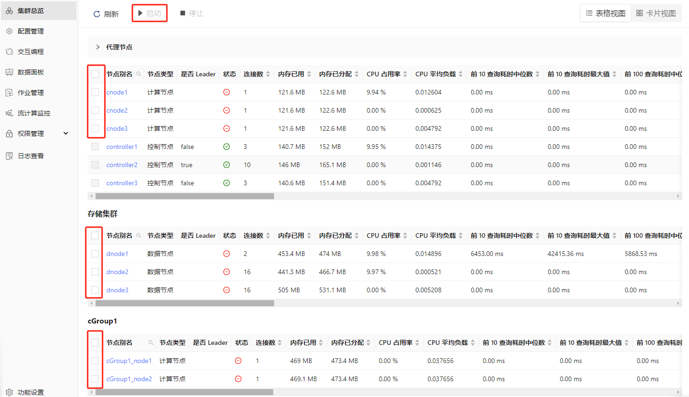
* 刷新页面后可看到对应的数据节点、计算节点和计算组节点已启动，如下图所示：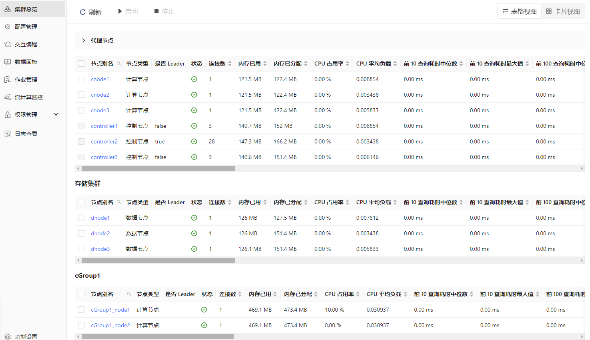

### 附录2：性能测试脚本

* 创建测试数据库表

  [创建库表.dos](script/best_practice_for_storage_compute_separation/%E5%88%9B%E5%BB%BA%E5%BA%93%E8%A1%A8.dos)
* 写入模拟数据脚本

  [生成模拟数据\_level2快照.dos](script/best_practice_for_storage_compute_separation/%E7%94%9F%E6%88%90%E6%A8%A1%E6%8B%9F%E6%95%B0%E6%8D%AE_level2%E5%BF%AB%E7%85%A7.dos)

  [生成模拟数据\_逐笔成交.dos](script/best_practice_for_storage_compute_separation/%E7%94%9F%E6%88%90%E6%A8%A1%E6%8B%9F%E6%95%B0%E6%8D%AE_%E9%80%90%E7%AC%94%E6%88%90%E4%BA%A4.dos)
* 查询性能测试脚本

  [查询性能.dos](script/best_practice_for_storage_compute_separation/%E6%9F%A5%E8%AF%A2%E6%80%A7%E8%83%BD.dos)
* 计算性能测试脚本

  [计算性能1\_1分钟深度不平衡\_买卖压力指标\_实际波动率.dos](script/best_practice_for_storage_compute_separation/%E8%AE%A1%E7%AE%97%E6%80%A7%E8%83%BD1_1%E5%88%86%E9%92%9F%E6%B7%B1%E5%BA%A6%E4%B8%8D%E5%B9%B3%E8%A1%A1_%E4%B9%B0%E5%8D%96%E5%8E%8B%E5%8A%9B%E6%8C%87%E6%A0%87_%E5%AE%9E%E9%99%85%E6%B3%A2%E5%8A%A8%E7%8E%87.dos)

  [计算性能2\_买卖订单不平衡.dos](script/best_practice_for_storage_compute_separation/%E8%AE%A1%E7%AE%97%E6%80%A7%E8%83%BD2_%E4%B9%B0%E5%8D%96%E8%AE%A2%E5%8D%95%E4%B8%8D%E5%B9%B3%E8%A1%A1.dos)
* 并发查询性能测试脚本

  [并发查询测试case1.ipynb](script/best_practice_for_storage_compute_separation/%E5%B9%B6%E5%8F%91%E6%9F%A5%E8%AF%A2%E6%B5%8B%E8%AF%95case1.ipynb)

  [并发查询测试case2.ipynb](script/best_practice_for_storage_compute_separation/%E5%B9%B6%E5%8F%91%E6%9F%A5%E8%AF%A2%E6%B5%8B%E8%AF%95case2.ipynb)

