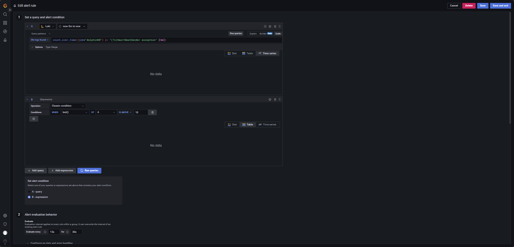

# 日志监控在 DolphinDB 中的最佳实践

随着大数据应用复杂度提升，高效的日志监控成为保障系统稳定性的关键。DolphinDB 作为高性能时序数据库，其高可用集群的运维需实时日志分析支持。本文基于
Loki、Promtail 与 Grafana
构建轻量级日志监控体系，提供从部署到告警的全流程实践，涵盖多节点环境配置、日志标签解析、实时告警规则及高频问题解决方案。通过低存储成本、高扩展性的设计，助力用户快速定位异常，提升运维效率，适用于金融、物联网等实时性要求高的场景。

## 1.日志监控方案概述

### 1.1 整体架构概述

典型的基于 Loki 的日志监控架构由 3 个组件组成：Promtail + Loki + Grafana

* Promtail 是一个用于日志采集和推送的代理工具，负责从数据源（如
  DolphinDB）抓取日志，将日志中的关键字解析为标签以便分类和过滤，并将日志以流的形式通过 HTTP API 推送到
  Loki，供进一步存储和查询。
* Loki 是主服务器，负责接收推送日志，存储日志及处理查询。
* Grafana 提供日志可视化查询面板、实时监控和警报通知功能。

本教程的架构示例图见图 1-1，不同颜色的箭头代表不同的数据流。其中红色箭头代表写入数据流，蓝色箭头代表查询数据流。

图 1. 图 1-1


### 1.2 Promtail 概述

Promtail 是一个代理程序，负责将本地日志的内容推送到私有的 Loki 实例上。它通常部署在需要监控的应用程序所在的每台机器上。

它的主要功能包括：

* 提取目标目录下日志
* 为日志流附加标签
* 将日志推送到 Loki 实例

目前，Promtail 可以从两个数据源获取日志：本地日志文件和 systemd 日志（适用于 ARM 和 AMD64 架构的机器）。

**日志文件发现**

在 Promtail 将日志数据从日志文件推送到 Loki 之前，它需要了解环境信息。这意味着 Promtail
需要找出是哪些应用程序将日志写入文件中，并且了解哪些文件需要被监控。

Promtail 直接采用Prometheus的服务发现机制，但受限于其守护进程部署模式（仅运行于单节点本地），无法实现跨节点标签发现。为此，Promtail
通过对接 Kubernetes API 获取所需的元数据标签，从而在分布式架构中完成日志采集的目标定位。

**配置**

类似 Prometheus，Promtail
使用配置段（stanza）进行配置。这使得用户可以对要获取的数据、要丢弃的数据以及附加到日志行上的元数据进行取舍。有关配置 Promtail
的更多详细信息，请参考文档 [configuring Promtail](https://grafana.com/docs/loki/latest/send-data/promtail/configuration/)。

### 1.3 Loki 概述

Loki 是由 Grafana Labs 开发的开源日志聚合系统，专为支持云原生应用而设计。它以高效、可扩展和成本低为核心理念，与传统日志系统不同，Loki
不对日志内容进行全文索引，而是通过元数据标签实现快速查询。这种设计使 Loki 更加轻量级且与 Prometheus 紧密集成，用户可以通过类似 PromQL
的查询语言（LogQL）轻松分析日志。

* **软件简介**

  Loki 是一个受 Prometheus 启发的横向可扩展、高可用、多租户的日志聚合系统。与 Prometheus
  专注于指标（metrics）不同，Loki 专注于日志，并通过推送而非拉取方式收集日志。Loki
  的设计目标是成本效益高且高度可扩展。与其他日志系统不同，Loki
  不对日志内容进行索引，而仅对日志的元数据进行索引，将每个日志流的元数据存储为一组标签。而日志流是指共享相同标签的一组日志。标签帮助 Loki
  在数据存储中快速找到日志流，因此拥有一组高质量的标签是实现高效查询的关键。日志数据会被压缩并以块的形式存储在对象存储中，例如 Amazon S3
  或 Google Cloud Storage (GCS)，也可以在开发或概念验证阶段存储在文件系统中。小型索引和高压缩率的数据块简化了 Loki
  的操作，同时显著降低了成本。

* **官方教程、下载、安装**

  Loki 是由 Grafana Labs开发和维护的。Grafana Labs
  是一个知名的开源监控和可视化平台提供商，旗下拥有多个流行的开源工具，包括：

  + Grafana：用于数据监控和可视化的核心平台。
  + Prometheus：时间序列数据库（与社区合作开发）。
  + Loki：轻量级日志聚合系统，与 Prometheus 深度集成。

  本文示例使用 Loki [2.5](https://grafana.com/docs/loki/latest/release-notes/v2-5/)。与 Grafana 的版本保持一致，其他版本的
  Loki 详情见[已发布的 Loki 版本](https://grafana.com/docs/loki/latest/release-notes/)。

* **Loki 部分核心功能介绍**
  + **可扩展性**

    Loki 设计为具有高扩展性，可以从运行在树莓派上的小规模实例扩展到每天处理 PB
    级数据的规模。在最常见的部署模式“简单可扩展模式”中，Loki
    将请求解耦为独立的读取和写入路径，使其可以分别扩展，从而实现灵活的大规模部署，能够快速适应任何时刻的工作负载需求。如果需要，Loki
    的各个组件也可以作为微服务运行，并原生支持 Kubernetes 环境。
  + [**多租户**](https://grafana.com/docs/loki/latest/operations/multi-tenancy/)

    Loki
    支持多个租户共享同一个 Loki 实例。通过多租户机制，每个租户的数据和请求都与其他租户完全隔离。多租户通过在代理中分配租户
    ID 来配置。
  + **第三方集成**

    许多第三方代理（客户端）通过插件支持 Loki。这使用户可以保留现有的可观测性工具，同时将日志推送到
    Loki。
  + **高效存储**

    Loki 使用高压缩的块存储来存储日志数据，并且它的索引只关注标签，这使得与其他日志工具相比，Loki
    的索引占用的空间明显更小。Loki
    采用对象存储作为唯一的数据存储方式，继承了对象存储的可靠性和稳定性。相比于本地的固态硬盘（SSD）或硬盘驱动器（HDD），对象存储具有更高的成本效益和更简便的操作。

    通过压缩存储块、更小的索引以及使用低成本对象存储，使得Loki
    的运行成本较低。
  + [**LogQL**](https://grafana.com/docs/loki/latest/query/)

    LogQL 是
    Loki
    的查询语言，可以用来生成日志查询。该语言还支持从日志数据中生成指标，这是一项强大的功能，远远超越了单纯的日志聚合。
  + **告警功能**

    Loki 包含一个名为 [Ruler](https://grafana.com/docs/loki/latest/alert/)
    的组件，可以持续监控日志并根据结果执行告警操作。借助这一功能，可以通过日志监控异常或特定事件。Loki 还与
    Prometheus 的 [Alertmanager](https://prometheus.io/docs/alerting/latest/alertmanager/) 或 Grafana
    内置的告警管理器集成。

利用这些核心功能，可以为 DolphinDB 实现日志监控、报错告警等功能，下文将以三个数据节点的 DolphinDB
高可用集群为例，逐步介绍安装部署、启动服务的过程。

## 2. 环境部署

* **模拟服务器环境：**

  | IP地址 | 主机名 | 节点类型 | 端口 | 部署服务 | 部署服务端口 |
  | --- | --- | --- | --- | --- | --- |
  | 10.0.0.80 | vagrant1 | controller  agent  datanode  computenode | 8800  8801  8802  8803 | Grafana  Loki  Promtail | 3000  3100  9080 |
  | 10.0.0.81 | vagrant2 | controller  agent  datanode  computenode | 8800  8801  8802  8803 | Promtail | 9080 |
  | 10.0.0.82 | vagrant3 | controller  agent  datanode  computenode | 8800  8801  8802  8803 | Promtail | 9080 |

* **软件环境：**

  | 软件名称 | 版本信息 |
  | --- | --- |
  | Grafana | 9.0.5 |
  | Loki | 2.5 |
  | Promtail | 2.5 |

注：

本教程需要在监控服务器提前部署 Grafana，具体安装方法可以参考[集群运维监控](cluster_monitor.html)中软件安装部署的部分。

## 3. Loki 安装、部署、应用流程

注：

在流程开始前建议预先构建具有多数据节点 DolphinDB 高可用集群。具体安装方法可以参考[高可用集群部署与升级](ha_cluster_deployment.html)。也可以参考[基于 Docker-Compose 部署
DolphinDB](docker-compose_high_cluster.html)。

### 3.1 Loki + Promtail 安装与部署

* **部署 Loki**

  于附件中下载 Loki 与 Promtail 的安装包，将
  `loki-linux-amd64.zip` 上传至监控服务器（10.0.0.80）；再将
  `promtail-linux-amd64.zip` 上传至 DolphinDB
  高可用集群（10.0.0.80、10.0.0.81、10.0.0.82）。

  在监控服务器（10.0.0.80）上创建目录
  `/usr/local/logsCollect/loki` 用于安装
  Loki：

  ```
  mkdir -p /usr/local/logsCollect/loki
  ```

  在监控服务器上（10.0.0.80）创建目录，用于文件存储和索引存储：

  ```
  mkdir  /data/loki
  mkdir  /data/loki/{chunks,index}
  ```

  使用 `cd`
  命令切换到 `loki-linux-amd64.zip` 安装包所在的目录，将其解压到
  `/usr/local/logsCollect/loki`
  目录下：

  ```
  unzip loki-linux-amd64.zip -d /usr/local/logsCollect/loki
  ```

  `cd`
  命令切换到 `/usr/local/logsCollect/loki`，创建配置文件
  `config.yaml`：

  ```
  vim config.yaml
  ```

  文件中加入以下内容：

  ```
  auth_enabled: false          #定义是否启用身份验证
  server:
    http_listen_port: 3100     #HTTP服务监听的端口号
  ingester:
    lifecycler:
      address: 10.0.0.80       #监控服务器ip，即本机地址
      ring:
        kvstore:
          store: inmemory      #将分片元数据存储在内存中。适合单节点部署, 可选值：inmemory、consul、etcd
        replication_factor: 1  #设置数据的副本数。值为1时不进行副本存储
      final_sleep: 0s          #生命周期结束前的等待时间，用于安全退出
    chunk_idle_period: 5m      #如果一个块在5分钟内没有接收到任何日志数据，则标记为已完成，准备写入存储。
    chunk_retain_period: 30s   #块完成后，等待30秒再将其写入存储
  schema_config:
    configs:
    - from: 2024-04-01         #模式生效的开始日期
      store: boltdb            #索引数据的存储类型, 常用值：boltdb、cassandra
      object_store: filesystem #块存储的类型, 常用值：filesystem、s3、gcs
      schema: v11              #Loki使用的存储模式版本
      index:
        prefix: index_
        period: 168h           #每张索引表覆盖的时间范围（7天）
  storage_config:
    boltdb:
      directory: /data/loki/index    #索引文件存储地址
    filesystem:
      directory: /data/loki/chunks   #块存储地址
  limits_config:
    enforce_metric_name: false       #是否强制要求日志流包含指标名称标签
    reject_old_samples: true         #是否拒绝超过最大时间范围的日志样本
    reject_old_samples_max_age: 168h #定义拒绝日志样本的时间窗口（7天）
    # 全局速率限制
    ingestion_rate_mb: 1024          #全局速率限制设置为 1024 MB/s（即 1 GB/s）
    ingestion_burst_size_mb: 2048    #全局突发速率设置为 2 GB/s

  chunk_store_config:
  # 最大可查询历史日期7天,这个时间必须是schema_config中的period的倍数，否则报错。
    max_look_back_period: 168h
  table_manager:
    retention_deletes_enabled: true  #是否启用过期表的自动清理
    retention_period: 168h           #定义表的保留时间（7天）
  ```

  配置时根据实际服务器的需求配置监听端口和服务器
  IP。额外配置了全局速率限制，因为 Loki 为防止其储存空间被快速占满，默认有 4MB/s
  的日志上传速率限制，若不更改则可能会报错。

  使用以下命令启动 Loki，注意需要在 Loki 对应的安装目录下执行
  :

  ```
  nohup ./loki-linux-amd64 -config.file=./config.yaml >./server.log 2>&1 &
  ```

  使用以下命令关闭
  Loki：

  ```
  kill -9 $(pgrep -f "loki-linux-amd64")
  ```

  查看启动信息：

  ```
  tail -200f server.log
  ```

  启动成功后的运行截图如图
  3-1：

  图 2. 图 3-1

  
* **在 DolphinDB 高可用集群中配置 Promtail：**

  按照教程在DolphinDB
  高可用集群（10.0.0.80、10.0.0.81、10.0.0.82）上依次执行以下操作，以 10.0.0.80
  为示例。

  创建目录 `/usr/local/logsCollect/promtail` 用于部署
  Promtail：

  ```
  mkdir -p /usr/local/logsCollect/promtail
  ```

  使用
  `cd` 命令切换到安装包所在目录，解压
  `promtail-linux-amd64.zip`：

  ```
  unzip promtail-linux-amd64.zip -d /usr/local/logsCollect/promtail
  ```

  使用
  `cd` 命令切换到
  `/usr/local/logsCollect/promtail` 并配置
  `promtail.yaml`：

  ```
  vim promtail.yaml
  ```

  在文件中加入以下内容：

  ```
  server:
    http_listen_port: 9080
    grpc_listen_port: 0

  positions:
    filename: ./positions.yaml

  clients:
    - url: http://10.0.0.80:3100/loki/api/v1/push # 日志服务器 Loki 地址和端口
  scrape_configs:
    # ucenter1
    - job_name: dolphinDB
      static_configs:
        - targets:
            - 10.0.0.80
          labels:
            job: dolphinDB
            host: 10.0.0.80
            __path__: /home/vagrant/v2.00.11.13/server/clusterDemo/log/*.log
      pipeline_stages:
        - regex:
            expression: '^(?P<ts>\d{4}-\d{2}-\d{2}\s\d{2}:\d{2}:\d{2}\.\d+)\s(?P<level><\w+>)\s:(?P<message>.*)$'
        - timestamp:
            source: ts
            format: 2006-01-02 15:04:05.000000
            timezone: "China/Beijing"
        - labels:
            level:
        - output:
            source: message
    - job_name: core_file_monitor
      static_configs:
        - targets:
            - 10.0.0.80
          labels:
            job: core_files
            host: 10.0.0.80
            __path__: /home/vagrant/v2.00.11.13/server/clusterDemo/log/core.*   # 对应地址匹配 core 文件
      pipeline_stages:
        - labels:
            filename: __path__  # 从文件路径提取文件名作为标签
        - output:
            source: filename  # 只记录文件名为日志内容
        - limit:
            rate: 10        # 限制每秒最多采集 10 条日志
            burst: 10       # 短时间内最多允许采集 10 条日志
            drop: true      # 超出限制时丢弃日志
  ```

  其中，`job_name:
  dolphinDB` 用于监控 DolphinDB 日志，`job_name:
  core_file_monitor` 用于监控 core 宕机文件生成。需要根据实际情况更改 Promtail
  的上传配置，例如对应已部署 Loki 的 `url`，本地存储 DolphinDB 日志的路径。日志路径
  `__path__` 中的 `*.log` 意为匹配当前目录下所有后缀为
  log 的文件。

  注： 配置文件中的 `targets`
  与 `job` 后的 IP 用于标识数据，向 Loki 标识上传日志数据的来源，因此填写当前正在进行部署的机器的
  IP。

  使用以下命令启动 Promtial，注意需要在 Promtail 对应的目录下执行
  :

  ```
  nohup ./promtail-linux-amd64 -config.file=./promtail.yaml >./server.log 2>&1 &
  ```

  使用以下命令关闭
  Promtail：

  ```
  kill -9 $(pgrep -f "promtail-linux-amd64")
  ```

  查看启动信息：

  ```
  tail -200f server.log
  ```

  启动成功后的运行截图如图3-2：

  图 3. 图 3-2

  

  出现类似输出则为启动成功，之后依次在集群的每台机器上部署 Promtail。

### 3.2 应用 Loki：告警配置

* **配置 Grafana 的 Loki 数据源：**

  根据[集群运维监控](cluster_monitor.html)中软件安装部署中 Grafana 部分的配置，Grafana
  默认在 3000 端口打开。本教程的监控服务器配置在 10.0.0.80，因此 `url`
  为`10.0.0.80:3000`，默认的登录账号与密码均为
  admin。

  登录成功后，在 Grafana 界面选择 Data Source，如图 3-3：

  图 4. 图 3-3

  
  在数据源配置界面，如图 3-4 所示，找到红框标记的 URL 输入框，将 URL 修改为 Loki 服务的地址：

  图 5. 图 3-4

  
  点击 save ＆ test 测试配置是否正确并保存配置。之后在主页左侧点击 Explore，选择 Loki
  作为数据源，然后依次点击 Log browser → dolphinDB → show logs，如图 3-5 所示：

  图 6. 图 3-5

  
  成功查询日志，则配置成功，如图 3-6 所示：

  图 7. 图 3-6

  
* **Alert 告警面板配置：**

  本部分指导如何在 Grafana 面板中配置基于 Loki
  的告警规则。本例的具体实现形式为：Loki 告警每 1 分钟会检查 1 次应用是否生成了新的报错日志，每次检查都会对过去 5
  分钟期间新生成的日志进行扫描。当 Loki 告警检查到报错日志时，则进入 2
  分钟的告警评估期，评估期内若始终满足程序的告警条件，则评估期结束后程序发送告警邮件。

  创建一个新的告警规则，在主界面的左边点击
  Alerting → Alert rules，再点击 `New alert rule` 创建，如图 3-7
  所示：

  图 8. 图 3-7

  

  为实现本例，请参考以下步骤进行设置，图 3-7 中的数字区域对应如下操作步骤：

  1. 选择告警数据源，选择 `Loki`；
  2. 选择单次告警的检查范围，图中选择查询在过去 5 分钟期间生成的新日志；
  3. 定义表达式，使用`count_over_time({job="dolphinDB"} |=
     "ERROR"[5m])` 表达式统计过去 5 分钟内包含
     `"ERROR"` 关键字的日志数量（结果如图 3-8 所示）。例如，若当前时间为
     15:25:10，则查询的时间范围为 15:20:10 - 15:25:10，并将结果记录在 15:25:10 时刻；
  4. 告警条件`Conditions` 中设置告警触发条件为 `WHEN last()
     OF A IS ABOVE 0`
     ，其中，`last()`的含义为：从第三步中的表达式获取最新结果，即当前时间在过去 5
     分钟的时间窗口内生成的目标日志数量；`IS ABOVE 0` 的含义为：如果获取值大于
     0，即时间窗口内至少有一条 "ERROR" 相关的日志，则告警条件满足，返回布尔值给程序，令程序进入告警评估期；
  5. 设置告警条件，设置第四步中的表达式作为告警条件；
  6. 设置检查频率与评估期时长，其中 Evaluate every 1m 代表每 1 分钟检查一次；for 2m 代表评估期设置为 2
     分钟；
  7. 没有报错日志生成时，第三步中的表达式不会得到数据，反映状态为 `Nodata` ，为了避免
     Grafana 误判无数据状态为异常情况，需要将 Alert state if no data or all values
     are null 选项修改为 OK，确保当日志查询结果为空时，系统不会触发错误告警。

  注：

  Grafana 通过接收一个布尔值来决定是否触发告警，当 `last() OF A > 0` 时，
  第四步的表达式返回 `true`，令程序进入告警评估期，`last() OF A ≤
  0` 时，查询 B 返回
  `false`，不触发告警，因此，单一的查询语句无法进行告警（单一的查询语句返回的是具体数值，不是布尔值），还需要一个查询来返回布尔值。

  图 9. 图 3-8

  

  图 3-9 为告警规则的状态。`Pending`
  表示该指标已经触发告警条件，但程序还处于告警评估期，一旦告警持续时间超过评估期，`Pending`
  就会变为 `Alerting`警告。`Nodata`
  表示表达式查询返回值为空。`Normal` 表示指标正常。

  图 10. 图 3-9

  

  点击 `Preview Alert` 可以对告警信息进行预览，图 3-10 中的 info
  部分为报错日志被 promtail 提取时所解析的标签（label），例如图 3-5 中的 filename，job，host
  等。具体配置可在 Promtail 配置文件中的 label 部分查看：

  图 11. 图 3-10

  
  用户可以根据需求自定义配置告警名称、属组等信息，如下图 3-11 所示：

  图 12. 图 3-11

  

  点击 Save ＆ exit 保存并离开该界面。
* **告警邮件发送配置：**

  首先需要为 Grafana 配置
  SMTP，即邮件发送服务器：

  根据前置文档的配置，grafana 的配置文件为`./grafana-9.0.5/conf/defaults.ini`，找到其中 SMTP
  的部分，进行配置：

  ```
  [smtp]
  enabled = true
  host = smtp.163.com:465    #指定 SMTP 服务器的地址和端口,此处使用网易邮箱
  user = xxxxxxxxx@163.com   #此处可以使用个人网页邮箱进行配置
  # If the password contains # or ; you have to wrap it with triple quotes. Ex """#password;"""
  password = xxxxxxxx        #此处使用网易邮箱授权码
  cert_file =
  key_file =
  skip_verify = false
  from_address = xxxxxxxx@163.com  #同前一步填写的邮箱
  from_name = Grafana
  ehlo_identity =
  startTLS_policy =
  ```

  如果有搭建好的 SMTP 服务器可以直接使用，如果没有可以使用 QQ
  邮箱，网易邮箱等服务。授权码并非邮箱密码，需要到邮箱界面获取。在配置好 SMTP 后重启 Grafana。

  注： 如果有钉钉或企业微信的告警需求，可参考[钉钉告警与预警](cluster_monitor.html#%E9%92%89%E9%92%89%E5%91%8A%E8%AD%A6%E4%B8%8E%E9%A2%84%E8%AD%A6)和[企业微信告警与预警](cluster_monitor.html#%E5%90%AF%E5%8A%A8%E4%BC%81%E4%B8%9A%E5%BE%AE%E4%BF%A1%E5%91%8A%E8%AD%A6)进行配置。

  回到 Alerting
  的页面，点击 `Contact points`，点击创建 `New contact
  point`，按照图 3-12
  配置即可。若想在告警邮件中加入动态标签（label）信息，可参考官方文档[模板注释和标签](https://grafana.com/docs/grafana-cloud/alerting-and-irm/alerting/alerting-rules/templates/)来配置 Message
  部分。

  图 13. 图 3-12

  

  Addresses 为接受告警邮件的邮件地址，Message 与 Subject
  为告警邮件所发送的内容与标题，可根据需求自定义修改，**Disable resolved message**
  勾选后，Loki 不会为告警解除单独发送一封邮件。完成配置后点击 Test 测试发送功能是否正常，若正常，对应邮箱会收到一封邮件，如图
  3-13：

  图 14. 图 3-13

  

  若测试成功，则点击 **Save contact point** 保存。

  接下来编辑
  `Notification policies`，参考图 3-14，只需要配置告警对应的
  `Default Contact point` 即可，点击 Save 保存。

  图 15. 图 3-14

  
* **验证配置：**

  打开高可用集群中的一个数据节点，执行数次以下语句，在 DolphinDB 日志中写入数行 ERROR
  日志信息：

  ```
  writeLogLevel(ERROR,"This is an ERROR message")
  ```

  写入错误信息后，设置的接收邮件会收到一封由
  Grafana 发送的告警邮件，如图 3-15，若发送时间符合告警规则配置，则配置成功。

  图 16. 图 3-15

  

## 4. 常见告警规则

* **设置非交易时间段静默**

  在 `Notification policies` 中选择 `New
  mute timing`，按照下图进行配置，点击 submit 应用即可，如图 4-1。

  图 17. 图 4-1

  

  其中 `Time range`
  可以创建数条静默时间规则，以覆盖一天中的多个时间段，此处设置 `00:00 - 09:00` 和
  `15:00 - 23:59` 以覆盖一日中的非交易时间段；`Days of the
  week`中配置 `monday:friday`，覆盖周一至周五；`Days
  of the month` 配置 `1:31`；而
  `Month` 配置
  `1:12`，`Years` 配置
  `2025` 以覆盖 2025 年 12 个月的每一天。
* **高频数据导入时的丢包监控：**

  上交所发送的股票逐笔数据中，股票和基金共享同一通道，通道内（ChannelNo）OrderIndex 和
  TradeIndex 按顺序排列，若其发生跳变，可视为通道异常，可以通过监控 SeqNo 字段的变化来判断是否发生了丢包。目前 insight
  插件已支持逐笔数据的丢包监控日志输出，其他插件也将在后续更新中提供该功能。可通过以下方式输出日志并配置告警机制，完成丢包监控与告警。

  于
  DolphinDB 中创建以下日志规则：

  输出日志如图 4-2：

  图 18. 图 4-2

  

  在 `Alert Rules`
  界面，配置告警时间等方式不再赘述，这里展示如何查询到该报错并进行告警，LogQL
  查询语句如下：

  ```
  count_over_time({job="dolphinDB"} |= "wrong applseqnum" [5m])
  ```

  查询
  5 分钟内，数据丢包的报错数量。并设置查询频率与评估期参数为：`Evaluate
  every:10s`，`For:20s`。
* **实时行情数据股票 ID 缺失或者 TradeDate 缺失日志监控：**

  日志级别监控 ERROR 预警：实时行情数据股票 ID 缺失或者
  TradeDate 缺失，可以在开发代码中使用 writeLogLevel 进行错误日志输出，该项报错会输出 ERROR 日志，因此对
  ERROR 字段进行监控即可，配置如图 4-3：

  图 19. 图 4-3

  

  LogQL
  查询语句如下：

  ```
  count_over_time({job="dolphinDB"} |= "ERROR"[5m])
  ```

  其他参数：

  `Evaluate
  every:1m`

  `For:2m`

  `Condition:
  When last() OF A IS ABOVE 0`
* **客户端连接超时日志监控：**

  在 5 分钟内出现超过 5 条包含 timeout 或 connection failed
  的日志，触发预警，配置如图 4-4。

  图 20. 图 4-4

  

  LogQL
  查询语句如下：

  ```
  count_over_time({job="dolphinDB"} |~ "(?i)failed to connect" [5m])
  ```

  其他参数：

  `Evaluate
  every:30s`

  `For:1m`

  `Condition:
  When last() OF A IS ABOVE 5`
* **元数据 recovery 日志监控：**

  元数据出现 recovery，如 1 分钟内 recovery 失败超过 10
  次，触发预警，配置如图 4-5。

  图 21. 图 4-5

  

  LogQL
  查询语句如下：

  ```
  count_over_time({job="dolphinDB"} |~ "(?i)failed to incrementally recover chunk"[1m])
  ```

  其他参数：

  `Evaluate
  every:15s`

  `For:30s`

  `Condition:
  When last() OF A IS ABOVE 10`
* **日志长时间不生成监控：**

  如果某个服务在 10 分钟内没有生成任何日志，触发预警，配置如图 4-6。

  图 22. 图 4-6

  

  LogQL
  查询语句如下：

  ```
  count_over_time({job="dolphinDB"}[10m])
  ```

  其他参数：

  `Evaluate
  every:1m`

  `For:2m`

  `Condition:
  When last() OF A IS BELOW 1`

  注：

  1.确保查询时间范围至少覆盖 `now-10m to now`。

  2.如果需要监控特定服务，可以在该查询语句的基础上增加标签，如
  `count_over_time{{filename="/home/vagrant/v2.00.11.13/server/clusterDemo/log/agent.log",job="dolphinDB"}[10m]}`，仅统计特定日志文件（agent.log）
  在过去 10 分钟内的日志条数。
* **用户登录失败日志监控：**

  如果某个用户在1小时内登录失败超过10次，触发预警，配置如图 4-7。

  图 23. 图 4-7

  

  LogQL
  查询语句如下：

  ```
  sum by (remoteIP) (count_over_time({job="dolphinDB"} |~ "failed.*The user name or password is incorrect" | logfmt | remoteIP!="" [1h]))
  ```

  该语句用于统计不同
  IP 登录失败的次数，并按 IP 地址（remoteIP） 进行分类聚合。只有当某个特定 IP
  的登录失败次数超出阈值时，才会触发告警。注意修改查询时间段，至少覆盖`now-1h to
  now`。

  其他参数：

  `Evaluate
  every:1m`

  `For:2m`

  `Condition:
  When last() OF A IS ABOVE 10`
* **内存 Out of memory 日志监控：**

  如果 5 分钟内出现超过 2 条 Out of memory
  的异常日志，触发预警，配置如图 4-8。

  图 24. 图 4-8

  

  LogQL
  查询语句如下：

  ```
  count_over_time({job="dolphinDB"} |= "Out of memory" [5m])
  ```

  其他参数：

  `Evaluate
  every:1m`

  `For:2m`

  `Condition:
  When last() OF A IS ABOVE 2`
* **core 文件生成监控：**

  有 core 文件生成，触发预警。

  Promtail 配置文件
  `promtail.yaml` 中 `job_name:
  core_file_monitor` 专门用于监控 core 宕机文件的生成，配置如图 4-9。

  图 25. 图 4-9

  

  LogQL
  查询语句如下：

  ```
  count_over_time({job="core_files"}[5m])
  ```

  其他参数：

  `Evaluate
  every:1m`

  `For:2m`

  `Condition:
  When last() OF A IS ABOVE 0`
* **节点停机日志监控：**

  节点若停机，触发预警，配置如图 4-10。

  图 26. 图 4-10

  

  LogQL
  查询语句如下：

  ```
  count_over_time({job="dolphinDB"} |= "MainServer shutdown." [5m])
  ```

  其他参数：

  `Evaluate
  every:15s`

  `For:30s`

  `Condition:
  When last() OF A IS ABOVE 0`
* **磁盘空间不足日志监控：**

  磁盘空间不足时，触发预警，配置如图 4-11。

  图 27. 图 4-11

  

  LogQL
  查询语句如下：

  ```
  count_over_time({job="dolphinDB"} |~ "(?i)No space left on device" [5m])
  ```

  其他参数：

  `Evaluate
  every:1m`

  `For:2m`

  `Condition:
  When last() OF A IS ABOVE 0`
* **节点频繁上下线或网络波动日志监控：**

  节点频繁上下线或网络波动时，若 3 分钟内上下线超过 10 次，触发预警，配置如图
  4-12。

  图 28. 图 4-12

  

  LogQL
  查询语句如下：

  ```
  count_over_time({job="dolphinDB"} |~ "(?i)HeartBeatSender exception" [3m])
  ```

  其他参数：

  `Evaluate
  every:15s`

  `For:30s`

  `Condition:
  When last() OF A IS ABOVE 10`

## 5.常见问题解答（FAQ)

* **Promtail 中对于日志条目时间戳的解析**

  在 Loki + Promtail 的日志监控架构中，若 Promtail
  并未解析日志的时间戳，则 Loki 会将日志条目推送至 Loki 的时间作为日志条目的新时间戳，如果想要解析日志条目的时间戳，则需要更改
  Promtail 的配置文件
  `Promtail.yaml`：

  ```
  server:
    http_listen_port: 9080
    grpc_listen_port: 0

  positions:
    filename: ./positions.yaml

  clients:
    - url: http://10.0.0.80:3100/loki/api/v1/push # 日志服务器 Loki 地址和端口
  scrape_configs:
    # ucenter1
    - job_name: dolphinDB
      static_configs:
        - targets:
            - 10.0.0.80
          labels:
            job: dolphinDB
            host: 10.0.0.80
            __path__: /home/vagrant/v2.00.11.13/server/clusterDemo/log/*.log
      pipeline_stages:
        # 使用正则表达式提取日志的时间戳、日志级别和消息内容
        - regex:
            expression: '^(?P<ts>\d{4}-\d{2}-\d{2}\s\d{2}:\d{2}:\d{2}\.\d+)\s(?P<level><\w+>)\s:(?P<message>.*)$'
            # `ts` 是时间戳，`level` 是日志级别，`message` 是日志内容

        # 解析提取到的时间戳字段，将其转化为标准时间格式
        - timestamp:
            source: ts # 取自正则提取的 `ts` 字段
            format: 2006-01-02 15:04:05.000000 # 时间戳格式（Golang 标准时间格式）
            timezone: "China/Beijing" # 设置时区为北京时间

        # 将日志级别作为标签，以便在 Loki 查询时使用
        - labels:
            level: # 提取日志级别，如 <INFO> 或 <ERROR>

        # 将日志内容指定为消息的主要输出
        - output:
            source: message # 提取正则中的 `message` 字段作为主要日志内容
  ```

  重新启动
  Loki + Promtail，Promtail 端可能报错 `“timestamp too old”` 如图
  5-1。

  图 29. 图 5-1

  

  原因是现在新导入的日志的时间戳不再以日志导入 Loki
  的时间作为新时间戳，而是直接解析日志原有的时间戳，因此若旧日志接受的时间戳范围超过 Loki 可接收范围，则会报错。修改 Loki
  的配置文件中的 `limit_config` 的
  `reject_old_samples_masx_age`
  部分：

  ```
  limits_config:
    enforce_metric_name: false
    reject_old_samples: true
    reject_old_samples_max_age: 1680h  # 可接受最旧的日志时间戳，将其调大
    ingestion_rate_mb: 1024
    ingestion_burst_size_mb: 2048
  ```

  重启 Grafana，发现 Loki
  可以使用 level 字段检索日志了（如图 5-2），且日志的时间戳只剩下一列（如图 5-3），因为日志的时间戳已经被解析并使用，不会再出现
  Loki 时间戳和日志时间戳并列的情况，解析时间戳成功；

  图 30. 图 5-2

  

  图 31. 图 5-3

  

  注： 在解析日志的 level 字段后，对 level
  字段的查询不能再以关键字搜索表示，应指定 level 标签搜索的形式表示，例，对 level=”ERROR” 的日志，LogQL
  查询语句原先为`count_over_time({job="dolphinDB"} |=
  "ERROR"[5m])`，应改为 `count_over_time({job="dolphinDB",
  level="ERROR"}[5m])`，告警规则也应对应进行更改。
* **告警配置中设置最短的告警评估期**

  若想令告警反馈尽可能及时，则应缩短评估期，使程序进入告警流程后尽快发送邮件提醒用户，参考配置见图
  5-4。

  图 32. 图 5-4

  

  `Evaluate
  every:10s`，`For:20s`，是对应参数可以设置的最小值，该配置下每 10s
  检查一次，评估期为 20s。

  注： `For`
  对应的参数值不能低于 `Evaluate every` 对应参数值的两倍，若检查频次设置为每 1m 检查 1
  次，则评估期至少为 2m。

## 6.总结

在分布式时序数据库 DolphinDB 的高可用集群中，日志监控是保障系统稳定性和快速定位异常的关键环节。本文提出的基于 ​**Loki + Promtail +
Grafana** 的日志监控方案，为 DolphinDB 提供了一套高效、灵活且低成本的日志管理实践。

## 7.附录

**参考链接：**

[集群运维监控](cluster_monitor.html)

[高可用集群部署与升级](ha_cluster_deployment.html)

[基于 Docker-Compose 部署
DolphinDB](docker-compose_high_cluster.html)

**安装包及参考配置文件：**

[Open loki+promtail.zip](script/best_practices_for_log_monitoring/lokipromtail.zip)

