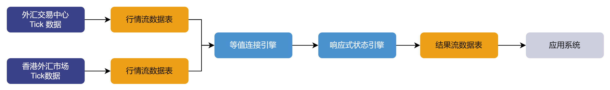
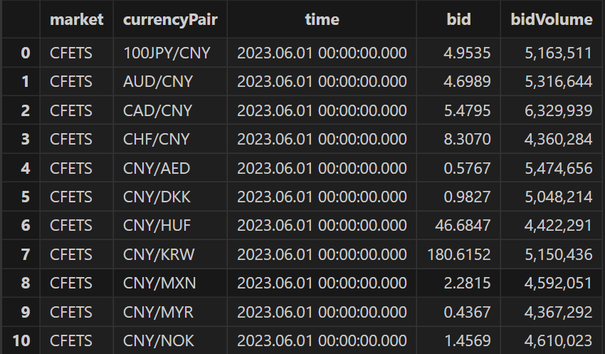
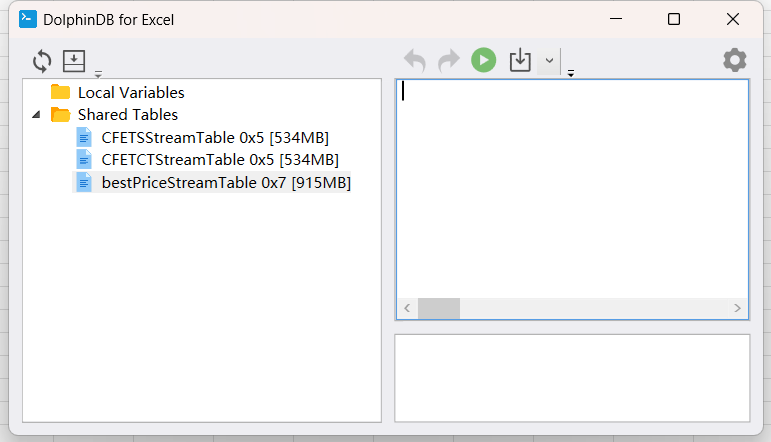
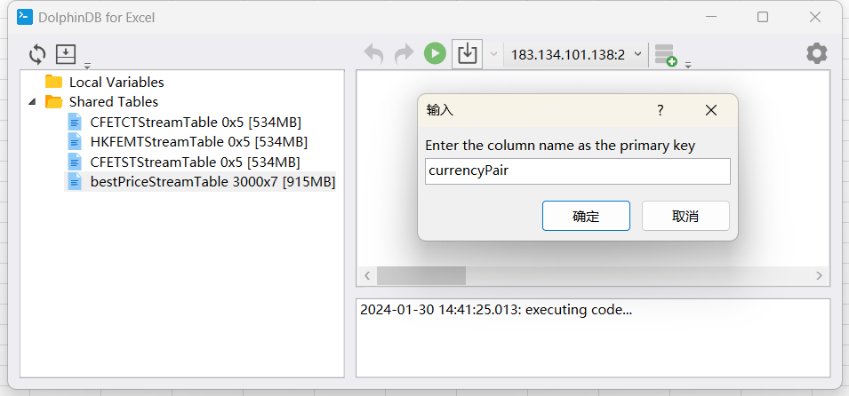
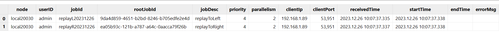
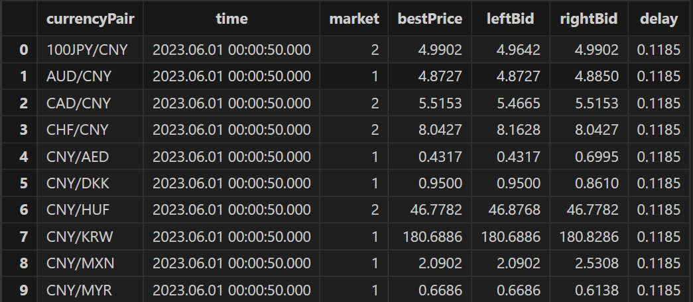
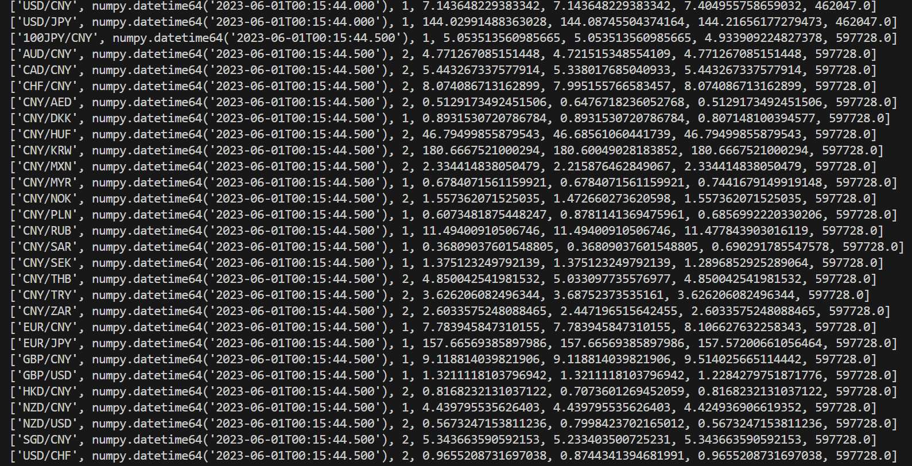
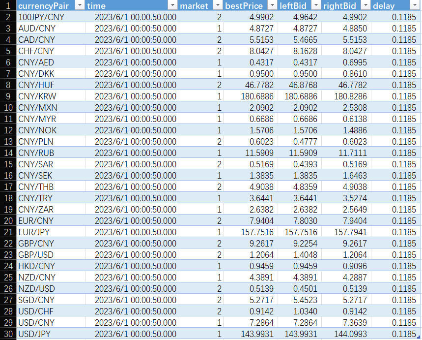
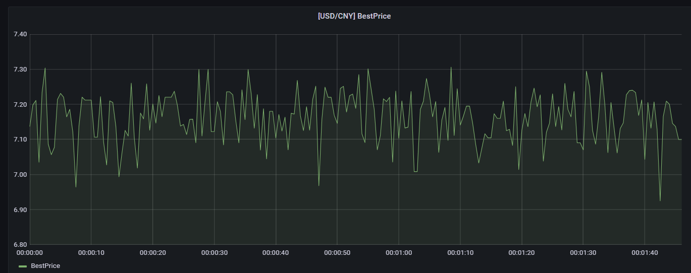

# 实时选取外汇行情多价源最优价

在外汇交易中，存在多个价源。多个价源之间，同一时刻的报价可能存在差异。在多个价源之间，实时选取最优价格具有重要意义，它有助于投资者获得更有利的交易执行价，降低交易成本，优化流动性，分散交易风险。特别对于高频交易者和算法交易者，获取多个价源间的最优价可以更合理地执行交易策略。此外，通过比较不同价源的价格，投资者还能够更好地了解市场的趋势和波动性，从而做出更明智的投资决策。

本文档基于 DolphinDB 流数据处理框架，提供一种多价源最优价实时选取的解决方案，主要包含以下内容：

## 1. 案例概述

本案例以 CFETS（中国外汇交易中心）和 HKFEMT（香港外汇市场）两个市场为例，通过买方报价 (bid) 举例说明，实现不同价源之间最优价的选取，并对异常数据做处理。详细规则如下：

* 为每个货币对的买方报价 (bid) 设定一个阈值，超过阈值的价格被视为异常报价
* 如果两个市场的买方报价 (bid) 都没超过该货币对的阈值，选取较大的买方报价 (bid) 做为最优价
* 如果有一个市场的买方报价 (bid) 超过了该货币对的阈值，选取另一个买方报价 (bid) 做为最优价
* 如果两个市场的买方报价 (bid) 都超过了该货币对的阈值，返回该货币对前一时刻的最优价

DolphinDB 的流数据引擎是一种专门用于处理实时数据流的高效、灵活的计算模块。它可以对流数据进行各种类型的分析，如时间序列、横截面、异常检测、连接等，并将结果输出到内存表、流数据表或其他终端。流数据教程详见：[流数据](../stream/str_intro.html)

本案例使用[等值连接引擎](../funcs/c/createEquiJoinEngine.html)和[响应式状态引擎](../funcs/c/createReactiveStateEngine.html)实现，流程图如下：



如流程图所示，整体数据处理过程如下：

* 两个市场的数据通过两个流数据表进入等值连接引擎
* 等值连接引擎根据货币对选取同一时刻的不超过阈值的最优价和最优价市场，如果两个市场的价格都是大于阈值的异常值，那么等值连接引擎会把此时刻的最优价和最优价市场设置为空值
* 等值连接引擎的结果输入到响应式状态引擎，响应式状态引擎对最优价和最优价市场使用向前填充的方法处理空值
* 最终结果实时输出到存储计算结果的流数据表中
* 应用系统可以订阅结果流数据表，实时获取最优价，用于指导交易、风险控制和可视化展示

## 2. 模拟数据

为了方便读者快速上手，本案例提供了模拟数据，结合 DolphinDB 提供的[数据回放](data_replay.html)功能，可仿真实时的外汇行情。没有真实行情数据的读者，可用此方法做全流程测试。模拟数据是 CFETS（中国外汇交易中心）和 HKFEMT（香港外汇市场）两个市场的一天的报价数据。本案例简化了数据结构，仅以买方报价 (bid) 举例说明，详细的数据表结构如下图所示：



为了使模拟数据更加接近真实行情，本案例使用了取自外汇交易中心官网的 29 个常见货币对在某个时间点的真实买方报价 (bid) 。以每个货币对的真实买方报价 (bid) 作为正态分布的期望值，0.1 作为正态分布的标准差，生成符合正态分布的模拟数据。为了过滤异常行情，把每个货币对真实值加上 0.08 做为异常阈值。每个货币对每 500 毫秒产生一条数据。

模拟数据及异常阈值生成的代码如下：

```
def genOneDayData(rawCurrencyPair,rawBid,date,marketName)
{
 dataTable = table(1:0,`market`currencyPair`time`bid`bidVolume,[`SYMBOL,`SYMBOL,`TIMESTAMP,"DOUBLE","INT"])
    num = 0
    for(i in 0..(rawCurrencyPair.size() - 1))
 {
        market = take(marketName,172800)
  currencyPair = take(rawCurrencyPair[i],172800)
  time = concatDateTime(date,00:00:00.000 + 500*(0..(172800-1)))
  bid = norm(rawBid[i],0.1,172800)
  bidVolume = int(norm(5000000,500000,172800))
  t = table(market,currencyPair,time,bid,bidVolume)
  dataTable.append!(t)
 }
 return select * from dataTable order by time,currencyPair
}

// The real data copied from the official website of CFETS
currencyPair = ["NZD/USD","USD/JPY","USD/CHF","GBP/USD","EUR/JPY","CNY/THB","CNY/TRY","CNY/SEK","CNY/PLN","CNY/SAR","CNY/KRW","CNY/RUB","CAD/CNY","SGD/CNY","AUD/CNY","HKD/CNY","EUR/CNY","CNY/MXN","CNY/NOK","CNY/DKK","CNY/HUF","CNY/AED","CNY/ZAR","CNY/MYR","CHF/CNY","NZD/CNY","GBP/CNY","100JPY/CNY","USD/CNY"]
bids = [0.61114,143.984,0.89425,1.27282,157.7,4.904,3.60415,1.4865,0.56205,0.51888,180.72,11.5679,5.4696,5.3465,4.7983,0.92282,7.9141,2.365,1.4956,0.9407,46.746,0.50849,2.5687,0.644,8.0801,4.4165,9.198,5.0189,7.2262]

date = 2023.06.01
// Create HKFEMT tick data
HKFEMT_Tick = genOneDayData(currencyPair,bids,date,`HKFEMT)
// Create CFETS tick data
CFETS_Tick = genOneDayData(currencyPair,bids,date,`CFETS)

//Set thresholds
threshold = dict(currencyPair,bids + 0.08)
```

生成的模拟数据存储在 *CFETS\_Tick* 和 *HKFEMT\_Tick* 两个内存表中，后续实时计算时，会把这两个内存表的数据回放到对应的流数据表中，生成仿真的实时行情。判断 29 个货币对的买方报价 (bid) 是否异常的阈值存储在字典变量 *threshold* 中，它的 Key 是货币对代码，Value 是该货币对的阈值。

## 3. 业务代码实现

### 3.1. 环境清理与流数据表创建

```
def cleanEnvironment(){
    try{ unsubscribeTable(tableName = `HKFEMTStreamTable, actionName = "joinLeft") }catch(ex){ print(ex) }
    try{ dropStreamTable(`HKFEMTStreamTable)}catch(ex){ print(ex) }
    try{ unsubscribeTable(tableName = "CFETSTStreamTable", actionName = "joinRight")}catch(ex){ print(ex) }
    try{ dropStreamTable(`CFETSTStreamTable)}catch(ex){ print(ex) }
    try{ dropStreamTable(`bestPriceStreamTable)}catch(ex){ print(ex) }
    try{ dropStreamEngine(`bestPricEngine)}catch(ex){ print(ex) }
    try{ dropStreamEngine(`fillPrevEngine)}catch(ex){ print(ex) }
}
cleanEnvironment()

def createStreamTableFunc()
{
    // Define streamTables that receive original market data: HKFEMTStreamTable and CFETSTStreamTable
    colName = `market`currencyPair`time`bid`bidVolume
 colType = [`SYMBOL,`SYMBOL,`TIMESTAMP,"DOUBLE","INT"]
    HKFEMTTemp = streamTable(20000000:0,colName,colType)
    try{ enableTableShareAndPersistence(table = HKFEMTTemp, tableName = "HKFEMTStreamTable", asynWrite = true, compress = true, cacheSize = 20000000, retentionMinutes = 1440, flushMode = 0, preCache = 10000) }
 catch(ex){ print(ex) }
    CFETSTemp = streamTable(20000000:0,colName,colType)
    try{ enableTableShareAndPersistence(table = CFETSTemp, tableName = "CFETSTStreamTable", asynWrite = true, compress = true, cacheSize = 20000000, retentionMinutes = 1440, flushMode = 0, preCache = 10000) }
 catch(ex){ print(ex) }

    // Define streamTables that save results: bestPriceTempStreamTable
    colName = `currencyPair`time`market`bestPrice`leftBid`rightBid`delay
 colType = [`SYMBOL,`TIMESTAMP,`INT,`DOUBLE,`DOUBLE,`DOUBLE,`DOUBLE]
    bestPriceTemp = streamTable(20000000:0,colName,colType)
    try{ enableTableShareAndPersistence(table = bestPriceTemp, tableName = "bestPriceStreamTable", asynWrite = true, compress = true, cacheSize = 20000000, retentionMinutes = 1440, flushMode = 0, preCache = 10000) }
 catch(ex){ print(ex) }
}
createStreamTableFunc()
go
```

* [go](../progr/statements/go.html) 语句的作用是对代码分段进行解析和执行
* [enableTableShareAndPersistence](../funcs/e/enableTableShareAndPersistence.html) 共享流数据表并持久化到磁盘。上述代码的主要作用是调用该函数创建三个共享的异步持久化流数据表。其中两个是 *HKFEMTStreamTable* 和 *CFETSTStreamTable*，它们分别用于接收和发布香港外汇市场和中国外汇交易中心的实时行情数据；另一个是 *bestPriceStreamTable*，它用于接收和发布引擎处理完毕的最优价结果。

### 3.2. 定义选取最优价及市场的函数

在本案例中，自定义一个函数用于实现最优价和最优价市场的选取，该函数输入参数的数据类型除 *threshold* 外都是向量，对应原始行情数据表中相关的列；输入参数 *threshold* 对应模拟数据生成的各个货币对的阈值，其数据类型是一个字典，它的 Key 是货币对代码，Value 是该货币对的阈值。这个函数后续以参数的方式配置到等值连接引擎中。

```
def bestPriceAndMarket(leftBid, rightBid, leftMarket, rightMarket, currencyPair, threshold)
{
    price = iif(leftBid > threshold[currencyPair] and rightBid > threshold[currencyPair],NULL,iif((leftBid > threshold[currencyPair]),rightBid,iif(rightBid > threshold[currencyPair],leftBid,max(leftBid,rightBid))))
    market = iif(leftBid > threshold[currencyPair] and rightBid > threshold[currencyPair],NULL,iif((leftBid > threshold[currencyPair]),2,iif(rightBid > threshold[currencyPair],1,iif(leftBid > rightBid,1,2))))
    return market, price
}
```

* [iif(cond, trueResult, falseResult)](../funcs/i/iif.html)：如果满足条件 *condition*，则返回 *trueResult*，否则返回 *falseResult*。它等效于对每个元素分别运行 if...else 语句
* 为了方便后续数据填充，市场的数据类型转为整形，引擎左表市场返回 1，引擎右表市场返回 2

### 3.3. 注册流计算引擎和订阅流数据表

本案例使用等值连接引擎和响应式状态引擎串联实现，等值连接引擎的输出是响应式状态引擎的输入。代码如下：

```
fillPrevSch = table(1:0,`time`currencyPair`market`bestPrice`leftBid`rightBid`inTime,[`TIMESTAMP,`SYMBOL,`INT,`DOUBLE,`DOUBLE,`DOUBLE,`NANOTIMESTAMP])
// create reactiveStateEngine
fillPrevEngine = createReactiveStateEngine(name = "fillPrevEngine", metrics = [<Time>,<ffill(Market)>,<ffill(BestPrice)>,<leftBid>,<rightBid>,<(now(true) - inTime) \ 1000000>], dummyTable = fillPrevSch, outputTable = bestPriceStreamTable, keyColumn="CurrencyPair")

HKFEMT_Table_left = table(1:0,`market`currencyPair`time`bid`bidVolume`inTime,[`SYMBOL,`SYMBOL,`TIMESTAMP,`DOUBLE,`INT,`NANOTIMESTAMP])
CFETS_Table_right = table(1:0,`market`currencyPair`time`bid`bidVolume`inTime,[`SYMBOL,`SYMBOL,`TIMESTAMP,`DOUBLE,`INT,`NANOTIMESTAMP])

// create equiJoinEngine
bestPricEejEngine = createEquiJoinEngine(name = "bestPricEngine", leftTable = HKFEMT_Table_left, rightTable = CFETS_Table_right, outputTable = fillPrevEngine, metrics = [<bestPriceAndMarket(HKFEMT_Table_left.bid,CFETS_Table_right.bid,HKFEMT_Table_left.market,CFETS_Table_right.market,currencyPair,threshold) as `market`bestPrice>,<HKFEMT_Table_left.bid>,<CFETS_Table_right.bid>,<max(HKFEMT_Table_left.inTime,CFETS_Table_right.inTime)>], matchingColumn = `currencyPair, timeColumn = `time)

def appendTime(engine,isLeftTable,mutable data)
{
    data[`inTime] = now(true)
    appendForJoin(engine,isLeftTable,data)
}
subscribeTable(tableName="HKFEMTStreamTable", actionName="joinLeft", offset=0, handler=appendTime{bestPricEejEngine, true,}, msgAsTable=true)
subscribeTable(tableName="CFETSTStreamTable", actionName="joinRight", offset=0, handler=appendTime{bestPricEejEngine, false,}, msgAsTable=true)
```

* 选取最优价及市场的函数配置在等值连接引擎中
* 等值连接引擎的输出参数配置为响应式状态引擎，表变量 *fillPrevSch* 表示响应式状态引擎输入的表结构，其字段顺序和类型要和等值连接引擎的输出完全一致
* [ffill](../funcs/f/ffill.html)：此函数用在响应式状态引擎中，表示对参数列中的空值用相同货币对的非空前值做填充
* 自定义函数 `appendTime` 在数据写入等值连接引擎前增加了写入时间，方便后续做延时的统计，该时间精度为纳秒

### 3.4. Python API 实时订阅最优价结果

通过 Python API 订阅结果表，能够实时获取最优价及对应的价源，订阅的代码如下：

```
import dolphindb as ddb
import numpy as np
from threading import Event

def resultProcess(lst):
    print(lst)

s = ddb.session()
s.enableStreaming()
s.subscribe(host = "192.168.100.3", port = 8848, handler = resultProcess, tableName = "bestPriceStreamTable", actionName="pySub", offset=-1, resub=False)

Event().wait()
```

* 执行 Python 代码前，必须先在 DolphinDB server 端定义流数据表 *bestPriceStreamTable*
* [s.enableStreaming()](https://docs.dolphindb.cn/zh/pydoc/BasicOperations/Subscription/Subscription.html) 函数表示启用流数据功能
* subscribe 方法
  + *host* 和 *port* 参数为 DolphinDB server 的 IP 地址和端口
  + *handler* 参数为回调函数，示例代码自定义了 `resultProcess` 回调函数，动作为打印实时接收到的数据
  + *tableName* 参数为 DolphinDB server 端的流数据表，示例代码订阅了 *bestPriceStreamTable*
  + *offset* 参数设置为 -1，表示订阅流数据表最新记录
  + *resub* 参数为是否需要自动重连

### 3.5. Excel 实时订阅最优价结果

Excel 是常用的办公软件，DolphinDB 的 Excel 插件能够把实时计算的结果推送至 Excel。在 Excel 插件连接到 DolphinDB server 之后，能够获取到共享的流数据表，本案例如下图所示：



右击 *bestPriceStreamTable* 流数据表，选择 **Export by Subscribe**，会弹出输入主键的对话框，如下图：



在对话框中输入货币对列 currencyPair，点击确定，即完成订阅。

### 3.6. Grafana 实时监控最优价

Grafana 是一个开源的数据可视化 Web 应用程序，擅长动态展示时序数据，支持多种数据源。DolphinDB 开发了 Grafana 数据源插件 (dolphindb-datasource)，让用户在 Grafana 面板 (dashboard) 上通过编写查询脚本、订阅流数据表的方式，与 DolphinDB 进行交互 (基于 WebSocket)，实现 DolphinDB 时序数据的可视化。详细教程参考：[Grafana 连接 DolphinDB 数据源](https://docs.dolphindb.cn/zh/api/grafana_2.html)

本案例展示货币对人民币对美元的最优价，Grafana 中的 Query 代码如下：

```
select  gmtime(time) as ts, bestPrice from bestPriceStreamTable where currencyPair='USD/CNY' context by second(time) limit -1
```

因为 Grafana 默认显示 UTC 时间，和 DolphinDB server 内的数据时间存在 8 个小时时差，所以 Grafana 中的 Query 需要使用 [gmtime](../funcs/g/gmtime.html) 函数进行时区的转换。

### 3.7. 历史数据回放

本章节在前文已搭建的整体框架的基础上，进行行情的回放，模拟实时数据写入。代码如下：

```
//replay data
submitJob("replayL","replayToLeft",replay,CFETS_Tick,`CFETSStreamTable,`time,,100)
submitJob("replayR","replayToRight",replay,CFETC_Tick,`CFETCTStreamTable,`time,,100)
t = getRecentJobs(2)
```

执行完后，查看变量 *t* 内的信息，如下图所示：



如果 endTime 和 errorMsg 字段为空，说明任务正在正常运行中。

## 4. 查询结果

随着数据回放模拟行情的注入，Python API，Excel，Grafana 等展示或接收端能够实时收到数据。

### 4.1. 客户端查询

通过 GUI，VScode 插件等客户端能够查询结果表，查询语句如下：

```
select top 29 * from bestPriceStreamTable order by time desc
```

多次执行此语句，可发现结果在实时发生变化。VScode 的数据查询结果如下：



* delay 列表示计算延时，单位是毫秒

### 4.2. Python API 实时订阅的计算结果



### 4.3. Excel 实时订阅的计算结果



### 4.4. Grafana 实时可视化展示



## 5. 计算性能

本案例的架构设计中包含了延时计算，统计了从第 1 个等值连接引擎收到数据至第 2 个响应式状态引擎输出结果所经历的时间。本案例的测试环境如下，该环境仅供参考：

* CPU：Intel(R) Xeon(R) Silver 4210R CPU @ 2.40GHz
* 内存：256GB
* 磁盘：SSD 3.5TB \* 4
* 操作系统：CentOs Linux release 7.6.1810

本案例最大延时的场景是 29 个货币对同时到达引擎，最小延时场景是只有 1 货币对到达引擎。在单线程情况下，其延时统计见下表：

| **货币对数量** | **延时（毫秒）** |
| --- | --- |
| 1 | 0.0841 |
| 29 | 0.1185 |

## 6. 案例总结

DolphinDB 内置的流数据框架支持流数据的发布、订阅、预处理、实时多表关联、实时内存计算、复杂指标的滚动窗口计算、滑动窗口计算、累计窗口计算等，是一个运行高效、使用便捷的流数据处理框架。

本教程基于 DolphinDB 流数据处理框架，提供了一种实时选取外汇行情多价源最优价的低码高效解决方案，旨在提高开发人员在使用 DolphinDB 内置的流数据框架开发流计算业务场景时的开发效率、降低开发难度，更好地挖掘 DolphinDB 在复杂实时流计算场景中的价值。

## 7. 附件

文档示例代码如下，请按文件顺序依次执行。

[script.zip](script/best-price-selection/script.zip)

