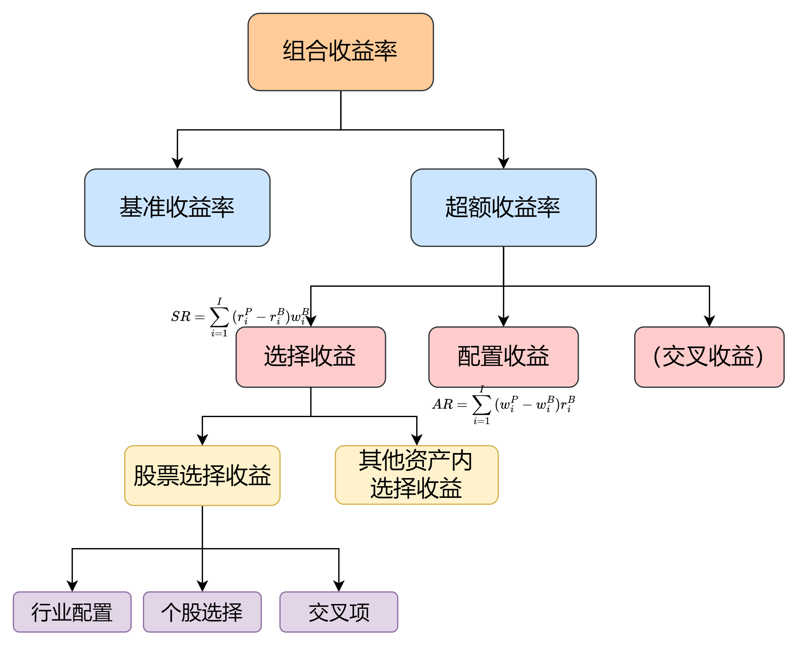
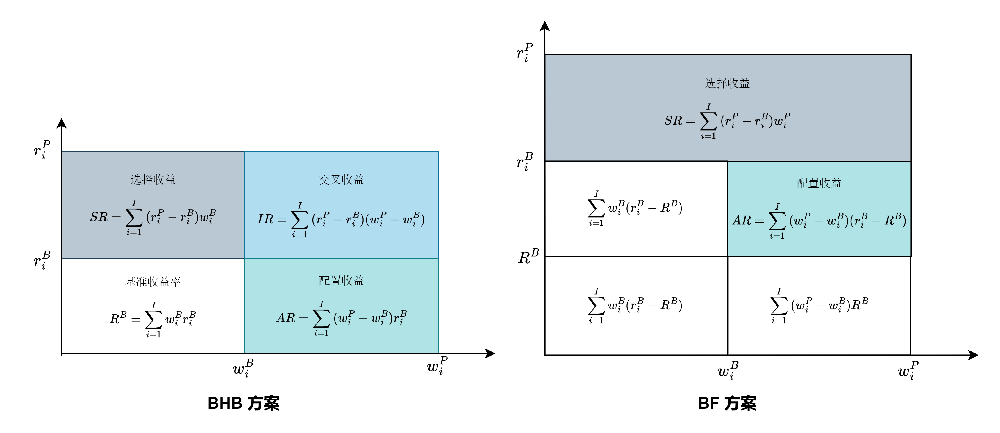
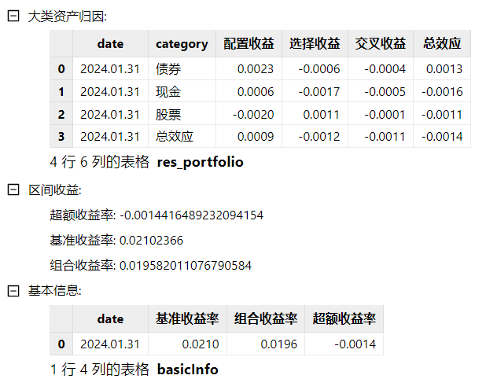
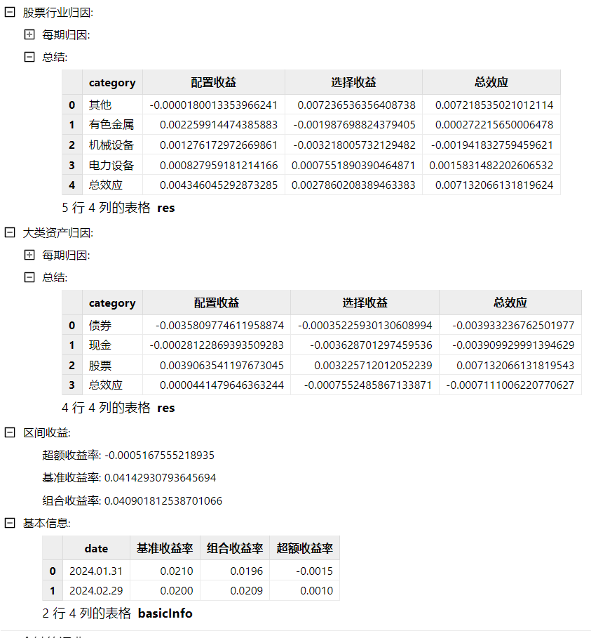
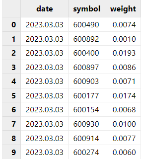
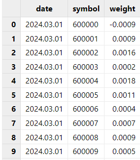
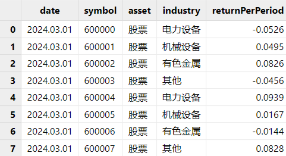

# 基于 DolphinDB 的 Brinson 绩效归因模型实践

在绩效归因中，Brinson 模型用于对股票型和混合型基金进行实证研究。Brinson 模型基于持仓数据，将基金的超额收益归于资产配置和标的选择两部分。并且有多种计算方式实现不同类型的基金组合收益归因。包括可以在各个行业上进行分解，或是针对调仓行为，有多种算法支持修正超额收益再投资所产生的多期收益。因此，Brinson 模型可以分析出基金经理在资产类别和行业配置上的偏好，也能从多期数据中观察出个券选择的稳定性。

为了方便用户便捷快速地计算 Brinson 结果，本文使用 DolphinDB 内置函数及表连接方式实现了不同方式的 Brinson 算法，并将其封装在单个函数中。本教程将介绍 Brinson 模型业绩归因分析的原理和在 DolphinDB 的实现步骤。

## 1. Brinson 模型介绍

Brinson 模型是一种基于持仓数据对基金业绩进行归因的工具，能够对单期或多期的基金超额收益来源进行详细分解。它通过分析基金具体的持仓信息，将基金当期的收益分解为不同的效应，从而对组合的损益来源有更明确的认识。因此，本文实现了一个更为通用的 Brinson 模型，可用于混合型基金中，用户可以灵活地选择归因方式，单期或者多期归因，以及每个大类资产组合中的归因信息。



### 1.1 归因方式

Brinson 归因方式主要包括 BF 方案和 BHB 方案，它们分别提出了不同的收益分解方式，为投资者提供了评估基金管理绩效的工具。

#### 1.1.1 BF 超额收益分解方案

在1985年，Brinson 和 Fachler 提出了一个收益分解方案，简称为 “BF 方案”。与 BHB 方案不同，BF 方案没有包含交互收益，而是将其并入了选择收益当中。因此，BF 方案仅有两个部分：

* 配置收益（Allocation Return, AR）：配置收益的定义与 BHB 方案相同，但BF 方案引入了基准组合的收益率，衡量基金经理在资产配置上的能力。
* 选择收益（Selection Return, SR）：在 BF 方案中，选择收益不仅衡量基金经理在具体标的选择上的能力，还包括了交互效应。因此，选择收益反映了基金经理在标的选择和资产配置共同作用下的综合超额收益。

#### 1.1.2 BHB 超额收益分解方案

1986 年，Brinson、Hood 和 Beebower 提出了另一种基于 Brinson 模型的超额收益拆分方案，简称为 “BHB 方案”。这一方案在业界应用广泛。BHB 方案通过构建两个虚拟组合——资产配置组合和标的选择组合，将基金组合的超额收益分解为三个部分：

* 配置收益（Allocation Return, AR）：配置收益衡量基金经理在不同资产类别或行业之间进行资产配置的能力。它反映了基金经理通过选择不同资产类别或行业的权重来超越基准的能力。
* 选择收益（Selection Return, SR）：选择收益衡量基金经理在具体标的选择上的能力。它反映了基金经理选择的个股或债券在相对于基准组合的超额收益。
* 交互收益（Interaction Return, IR）：交互收益反映了资产配置和标的选择之间的交互效应。它表示由于资产配置和标的选择共同作用而产生的超额收益。

我们可以用图形来更直观地展示 BF 和 BHB 方案的收益分解方式。下图白色部分代表了基准组合的收益，彩色部分代表了基金组合相对于基准的超额收益。

图 1. BHB 和 BF 方案的图形化表示



### 1.2 多期 Brinson 模型

多期 Brinson 模型与单期 Brinson 模型的主要区别在于对持仓变化和再投资收益的处理方式上。单期 Brinson 模型假定在样本期内基金经理没有调仓，组合没有现金流入和流出，因此其适用范围局限于单个时间段内的绩效分析。

然而，对于一个组合较长时间段内的收益分析，尤其是在组合持仓发生较大变化的情况下，单期 Brinson 模型的基本假设就不再适用。因此，多期 Brinson 模型的基本原理是将较长时期划分为多个单期，在每个单期内假设持仓保持不变并进行收益归因，最后将各个单期的归因结果进行合理加总，得到整个时期的绩效归因结果。

针对多期 Brinson 模型的算法设计，专家学者们提出了各种收益修正算法。为了将后续的再投资收益纳入考虑，此模型运用了 GRAP 算法。GRAP 算法的核心理念是将再投资收益归属到超额收益产生阶段，而非再投资收益的实际发生阶段，以确保修正后的各单期配置收益和选择收益能够直接相加，获得全样本期的绩效归因结果。因此，GRAP 算法中 n 期的多期超额收益 ER(n) 变为：


经 GRAP 算法修正后的三种收益分别为：


但如果行情表中已经对收益率有了修正，计算多期时，可以不用调整收益率，直接将每期的收益进行相加。

### 1.3 行业维度的 Brinson 模型

从大类资产层面分析了基金的各项收益后，此模型还可以把混合型基金中每个大类资产作为一个待归因分析的组合，例如股票组合、债券组合等。然后针对股票、债券组合分别做行业维度的 Brinson 归因分析，从而得到该大类资产下更为细分的归因信息。例如，将基金 A 里的股票资产单独作为一只新的股票型基金进行归因分析。由此，用户可以通过比较每个行业的权重和收益，更加具体地评估出两个基金的投资风格。

### 1.4 结果解释

在归因分析中，对结果的解释至关重要，它帮助我们理解基金在资产配置和标的选择上的决策效果。通过分析不同收益，我们可以全面评估基金组合的表现，并确定哪些决策对超额收益的贡献最大。

#### 1.4.1 配置收益

配置收益是由资产配置行为所产生的超额收益，因此配置收益的值越大，则说明相比于基准，由资产配置（不同的资产权重）产生的收益越大。对于 BHB 计算方案，配置收益为正代表组合内超配收益为正或者低配收益为负的资产；对于 BF 计算方案，配置收益为正代表在超越基准指数的资产上超配。

#### 1.4.2 选择收益

选择收益是由标的选择行为所产生的超额生意，因此选择收益越大，则说明相比于基准，组合中的标的产生的收益越大。

#### 1.4.3 交叉收益

BHB 计算方案中，超额收益减去配置收益与选择收益后的剩余收益即为交互收益，反映了配置与选择的协同效应。正向的交叉收益代表在行业中资产选择优于基准时进行超配，赚取了超额权重收益产生的收益，或者是在资产选择劣于基准时低配，低配使得组合不至于亏那么多。

## 2. 函数介绍

### 2.1 函数语法

`brinson(dailyPosition, benchmarkPosition, marketData, dateList, [method = 'BHB'], [multiPeriod = false], [industryBrinson = NULL], [showAll = false], [multiPeriodMethod = 'grap'])`

### 2.2 输入

在使用 Brinson 模型时，必须提供 *dailyPosition*, *benchmarkPosition*, *marketData* 三个表格。这些参数提供了组合和基准组合的信息，是模型计算的基础。*dateList* 控制了归因的研究区间，因此也是必选参数。*method*, *multiPeriod*, *multiPeriodMethod* 决定了 Brinson 归因的方法。*industryBrinson* 用于确认是否需要对某个或者某些大类资产中进行行业归因。*showAll* 决定是否需要展示每期信息。

#### 2.2.1 输入规范

Brinson 模型基于每期数据进行归因分析，因此 *dailyPosition*、*benchmarkPosition* 和 *marketData* 表格中使用的都是每期数据。模型的逻辑如下：

1. 构建日期向量：根据 *dateList* 参数构建一个包含每期日期的日期向量。例如，想要对 2024 年 1 月 1 号到 2024 年 1 月 5 号做每天的归因，那么 `dateList = 2024.01.01..2024.01.05`。如果想要根据交易日历的有效日期做归因，也可以使用 `getMarketCalendar` 函数获取日期范围内的有效日期。
2. 日期匹配：用这些日期与 *dailyPosition*、*benchmarkPosition* 和 *marketData* 表中的 date 列进行 `asof join`，即寻找日期匹配或最近的数据来代表每期数据。

#### 2.2.2 参数

* **dailyPosition 每期持仓明细**。Table，包含每期组合的持仓信息，提供每个标的的基本信息，包括占组合的权重，用于计算组合的各项收益指标。此表必须包含的列如下：

  | **列名** | **数据类型** | **备注** |
  | --- | --- | --- |
  | date | DATE | 持仓日期 |
  | symbol | STRING | 标的 |
  | weight | DOUBLE | 权重 |
* **benchmarkPosition 每期基准明细**。Table，包含每期基准组合的信息，提供基准组合内所包含的基准名称和权重，用于计算基准组合的各项收益指标。此表必须包含的列如下：

  | **列名** | **数据类型** | **备注** |
  | --- | --- | --- |
  | date | DATE | 日期 |
  | symbol | STRING | 标的名称 |
  | weight | DOUBLE | 权重 |
* **marketData 每期行情数据**。Table，包含所有组合和基准内包含的标的数据。需要包含每期日期每个标的所对应的行情数据。每一条数据需要包含以下信息：

  | **列名** | **数据类型** | **备注** |
  | --- | --- | --- |
  | date | DATE | 日期 |
  | symbol | STRING | 标的 |
  | asset | STRING | 大类资产名称 |
  | industry | STRING | 行业类型 |
  | returnPerPeriod | DOUBLE | 常规收益率。为上一个日期到下一个日期间的区间收益率。 |
* **dateList** 归因日期。DATE[]，表示需要归因的日期向量。
* **method** 选择用哪种方式计算归因。STRING，可取值为 "BHB", "BF"，代表两种不同的 Brinson 归因方式。默认值为 "BHB"。
* **multiPeriod** 是否需要多期归因。BOOL，决定是否需要进行多期 Brinson 模型归因（使用 GRAP 算法）。默认值为 false。
* **industryBrinson** 是否需要在大类资产中进行行业归因。NULL 或者 STRING[]，代表是否要对某个或某些大类资产进行行业维度的 Brinson 归因，例如 *industryBrinson* =["股票"]。默认值为 NULL。
* **showAll** 是否要展示每期的归因结果。BOOL，如果为 true，会展示每期归因的结果。如果选择行业维度的归因，则会分别展示每期的大类资产归因结果和每期的行业维度归因结果。默认值为 false。
* **multiPeriodMethod** 多期计算的方法。为 "grap" 或者 "sum"，分别代表用 grap 算法计算修正收益，或者直接将收益相加。默认值为 "grap"。

### 2.3 输出

返回一个字典，一定会包含区间收益、基础信息和大类资产归因三个字典。如果 industryBrinson 不为空，则包含基础信息、大类资产归因、行业归因产生的多个字典。

参数设定不同会导致返回结果的结构有稍许的不同，以下是几种常用的归因方式以及相对应的参数设定：

1. 使用 BHB 方法计算单期 Brinson 归因：`brinson(dailyPosition, benchmarkPosition, marketData, 2024.01.31, method = 'BHB', multiPeriod = false, industryBrinson = NULL, showAll = false)` 。返回结果如下图所示：
   
2. 使用 BHB 方法和 grap 算法计算多期 Brinson 归因，并对股票大类资产下进行行业归因，并且展示所有结果：`brinson(dailyPosition, benchmarkPosition, marketData, 2024.01.31 2024.02.29 2024.03.31, method = 'BF', multiPeriod = true, industryBrinson = ['股票'], showAll = true, multiPeriodMethod = 'grap')`。返回结果如下图所示：



## 3. 使用方法

本文基于已有持仓数据、行情数据、基准数据进行归因计算。若要使用 brinson 模块，请将 [*dolphinBrinson.dos*](script/brison/dolphinBrinson.dos) 放在 *[home]/modules* 目录下。[home] 目录由系统配置参数 *home* 决定，可以通过 `getHomeDir` 函数查看。以下示例中展示的都是模拟数据。具体流程如下：

### 3.1 数据预处理

如若没有数据，可以参考附件内[模拟数据脚本](script/brison/brinson_data_and_script.dos)生成的数据。如若已有数据，需保证现有的数据表中的字段名与输入参数中的字段名一致。以下示例中展示的都是模拟数据。

1. 持仓表：对于持仓表，需要整理成包含日期、标的、每日持仓权重的表格。因为 Brinson 支持多期归因，表格中需要包含多期持仓的具体组合和权重。

   
2. 每期基准表：对于基准表，与持仓表相同，需要每期的基准组合。

   
3. 行情数据表：行情数据表中需要包含所有基准中的成分及其收益率和权重。除此之外，也需要包含所有持仓中标的的行情数据表。例如下表中，包含了持仓及基准持仓中所有标的的行情数据。

   

### 3.2 参数设置

对于单期 Brinson 归因，，代表对 *dateList* 所包含的日期区间持仓进行归因。因为 Brinson 支持多期计算，也就是将期限内的持仓变动考虑在归因过程中，所以可以通过设置参数中的 *dateList* 来设置变动周期。例如，如果每天变动一次具体的持仓，可以将 *rule* 设置为 ’D‘。如若 `dateList = 2024.02.01..2024.03.01`，模型则会计算从 2024.02.01 至 2024.03.01 根据每天持仓产生的归因结果。

除此之外，上文已经介绍了 Brinson 的不同归因计算方式，包含 BHB 和 BF 计算模型、单期与多期模型和行业归因模型。可以通过设定不同的参数实现不同的需求。

### 3.3 模型调用

在清理好基础信息数据表后，就可以载入模型，常用的调用方式如下：

1. 使用 BF 方法计算单期 Brinson 归因，并展示每期结果：

   ```
   use dolphinBrinson
   dateList = 2024.01.31
   brinson(dailyPosition, benchmarkPosition, marketData, dateList, method = 'BF', multiPeriod = true,
   industryBrinson = NULL, showAll = true)
   ```
2. 使用 BHB 方法和 grap 修正计算多期 Brinson 归因，并对股票大类资产下进行行业归因，并且展示所有结果：

   ```
   use dolphinBrinson
   dateList = 2024.01.31 2024.02.29 2024.03.31
   brinson(dailyPosition, benchmarkPosition, marketData, dateList, method = 'BHB', multiPeriod = true,
   industryBrinson = `股票, showAll = true, multiPeriodMethod = 'grap')
   ```

## 4. 函数计算性能

本章节将展示 DolphinDB 实现的 `dolphinBrinson` 模块的计算性能。通过对函数在不同持仓规模、时间频率以及多期和单期归因设置下的性能测试，能够帮助用户更好地理解函数的计算复杂度以及在实际应用中的表现。

### 4.1 测试方法

**模拟数据**：

* 持仓数据 (dailyPosition)：模拟了 5 年期间每日包含 10, 100, 1000 只标的的持仓信息，包含股票、债券、现金。
* 基准持仓数据 (benchmarkPosition)：模拟了 10 年期间每日的基准持仓信息。
* 行情数据 (marketData)：模拟了 10 年期间 10000 只股票，股票、债券、现金资产的行情数据。

**归因分析配置**：

* 设置 *method* 为默认值 BHB。
* 通过改变 *dateList* 参数来调整运行频率，分别设置为每季度、每月和每日。
* 通过改变 *multiPeriod* 来设置是否进行多期归因
* 通过设置 `industryBrinson = ['股票']` 对股票资产进行归因
* 设置 *showAll* 为 false，不展示所有结果

### 4.2 测试结果

| **组合内 10 个持仓** | 多期 | 单期 |
| --- | --- | --- |
| 10 年每季度 | 2,070 ms | 1,648 ms |
| 10 年每月 | 2,190 ms | 1,754 ms |
| 10 年每天 | 4,026 ms | 3,090 ms |
| **组合内 100 个持仓** |  |  |
| 10 年每季度 | 2,404 ms | 1,765 ms |
| 10 年每月 | 2,560 ms | 2,099 ms |
| 10 年每天 | 5,823 ms | 3,120 ms |
| **组合内 1000 个持仓** |  |  |
| 10 年每季度 | 2,750 ms | 1,827 ms |
| 10 年每月 | 3,184 ms | 1,946 ms |
| 10 年每天 | 7,574 ms | 4,120 ms |

从上述结果来看，

1. 时间频率对运行时间的影响：随着时间频率的增加，运行时间增加。这是因为频率越高，数据量越大，计算复杂度也随之增加。虽然是多期，但 GARP 算法只是根据每期的收益率进行一次累积，10 年每月就是多了 120 次乘积计算，因此对计算量来说并没有太大的区别；但如果是每天归因，则增加了 3650 次乘积计算，因此时间会比季度或者月度频率要明显增多。
2. 持仓的影响：如果是每季度或者每月对不同持仓的组合进行一次多期分析，时间相差不大；如果每天进行归因分析，持仓多的组合的运行时间比持仓少的组合分析稍长。

## 5. 总结

本文基于 DolphinDB 内置的统计分析函数库、便捷的表连接方式以及向量化编程特性，完整实现了 Brinson模型。DolphinDB 将自身强大的计算功能与 Brinson 模型结合，能帮助用户更快更精准地了解混合型基金的收益组成，同时进一步优化组合以实现更高的投资回报。

## 6. 参考文献

* Brinson, Gary P., and Nimrod Fachler. 1985. “Measuring Non-US Equity Portfolio Performance.” Journal of Portfolio Management 11 (3): 73–76.
* Brinson, Gary P., L. Randolph Hood, Jr., and Gilbert L. Beebower. 1986.“Determinants of Portfolio Performance.” Financial Analysts Journal 42 (4):39–44．
* 林晓明，黄晓彬，张泽。Brinson绩效归因模型原理与实践[R].中国：华泰证券，2021.

## 7. 附录

[Brinson 实现脚本](script/brison/dolphinBrinson.dos)

[Brinson 数据模拟脚本](script/brison/brinson_data_and_script.dos)

