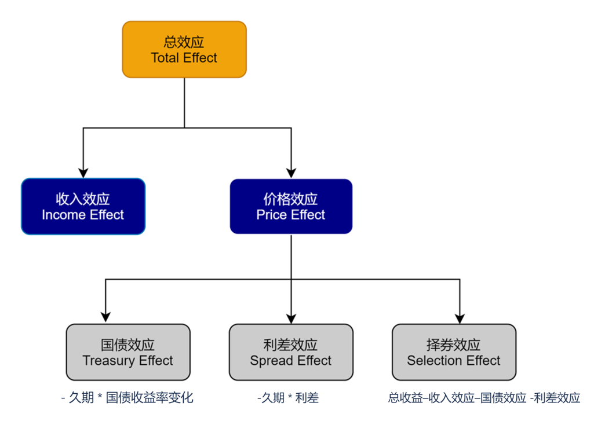
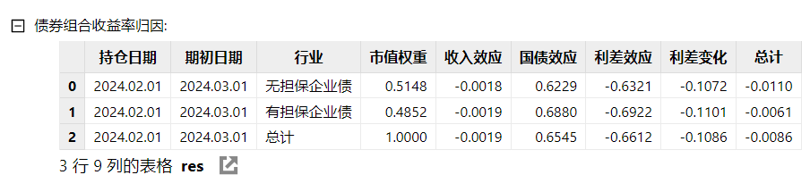
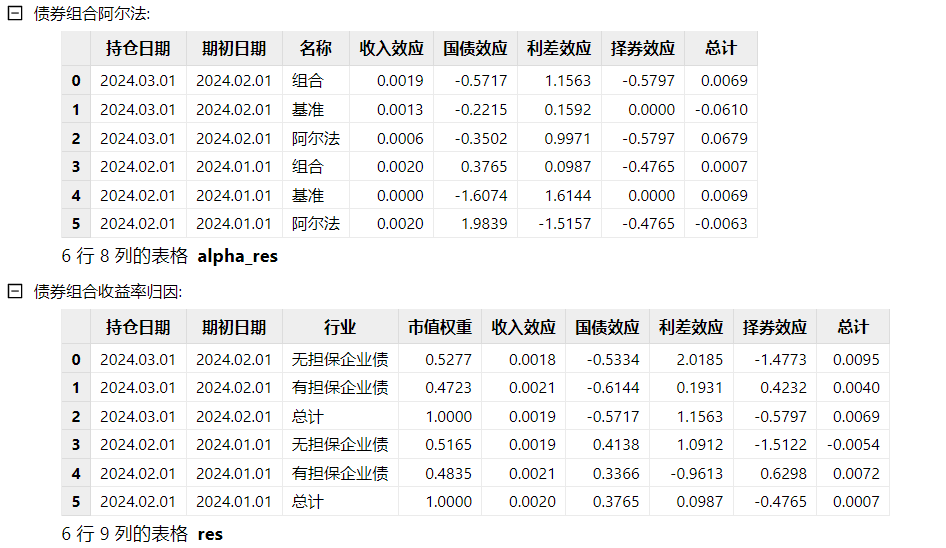
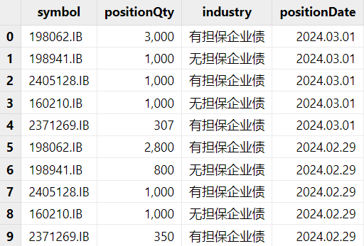
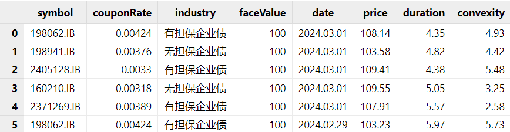
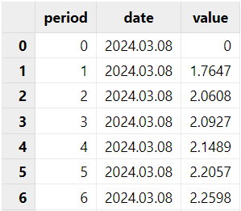
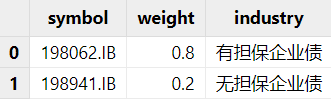
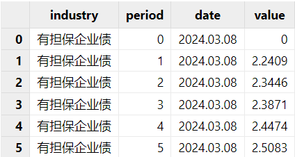

# 基于 DolphinDB 的 Campisi 绩效归因模型实践

债券型基金是我国公募基金的重要组成部分，其中纯债型基金的收益和波动主要源于债券型资产。绩效归因可以帮助我们进一步明确基金的收益来源，对于债券基金，Campisi 模型考虑了债券的特征和特殊风险，将债券收益分解为收入、国债、利差和择券四种效应，能够较好地反映自上而下的债券投资。

为了方便用户快速地计算 Campisi 结果，本模块使用 DolphinDB 内置函数及表连接方式实现了 Campisi 算法，并将其封装在单个函数中。本教程将详细介绍 Campisi 模型业绩归因分析的原理和函数在 DolphinDB 的实现步骤。

## 1. Campisi 模型介绍

Campisi 模型是一种用于分析债券组合收益的绩效归因模型。债券组合的收益来源主要包括票息收入和资本利得收入。为了更好地分析和理解这些收益来源，Campisi 模型将债券组合的总收益率（Total Return）分解为两个主要部分：收入效应（Income Effect）和价格效应（Price Effect）。

* 收入效应：持有债券期间所获得的票息收入。这部分收益相对稳定，不受市场价格波动的影响。
* 价格效应：由于债券价格变化所带来的资本利得或损失。价格收入可能受到多种因素的影响，因此需要进一步细分。

Campisi 模型进一步将影响价格效应的因素分为三类效应：

* 国债效应（Treasury Effect）：由于市场上无风险利率（通常由国债利率表示）的变动引起的债券价格变化。无风险利率的上升通常会导致债券价格下降，反之亦然。
* 利差效应（Spread Effect）：由于基准利差（通常是企业债券与同期限国债之间的利差）的变化引起的债券价格变化。如果基准利差收窄（即企业债券相对于国债的风险溢价降低），债券价格通常会上升，反之亦然。
* 择券效应（Selection Effect）：由于投资组合中个别证券的选择所带来的相对于基准的超额收益或亏损。这主要反映了基金经理或投资者的选股能力

总结来说，Campisi 将超额收益分为四种效应：收入效应指的是持有债券期间获得的票息收益；国债效应是由于无风险利率变动导致的价格变化；利差效应是由于基准平均利差变化导致的价格变化；择券效应则是超越基准的收益部分。

经验上，利差效应和国债效应是债券组合收益的核心价值。表现优异的基金通常在这两个方面获得了显著的阿尔法（超额收益），而择券效应的影响相对较小。从各部分收益对总收益的影响力来看，国债效应最大，其次是利差效应和票息效应，择券效应最小。数据显示，国债效应和利差效应与总收益的相关系数均在 0.5 左右，而收入效应与总收益呈负相关。

图 1. 图 1-1 Campisi 模型中的效应概述



### 1.1 计算方式

本章节将具体介绍模块中如何实现 Campisi 四种效应的计算。

下图为模块中的实现步骤：首先是对输入数据的预处理，包含持仓日期的对齐，排序等。然后，对于每一条有效数据进行债券指标的计算。接下来，对于这些指标进行行业维度的加权平均值计算以及效应计算并输出结果。具体的指标和计算公式在本章节中会有更详细的介绍。

图 2. 图 1-2 Campisi 模块的实现步骤


Campisi 绩效归因模型可以在两种不同的框架下使用，分别是无基准模型和有基准模型。无基准模型不参考任何市场基准或对照组，完全基于当前持仓债券的特征来分析收益来源。这种方法适用于那些没有固定市场基准的投资组合，或者希望独立评估组合在不同市场环境下的表现时。有基准模型则是在一个基准或市场对照组的基础上，分析债券组合相对于基准的超额收益。此方法更适合那些基于市场指数或行业基准进行投资的组合管理者。在此模型下，投资者不仅可以看到组合收益的构成，还能够看到相对于基准的超额表现来源。

#### 1.1.1 无基准模型

在不引入基准的情况下，Campisi 绩效归因模型将债券组合的收益归因到四个方面：收入效应、国债效应、利差效应和利差变动。通过对这些效应的分析，可以更好地理解债券组合的收益来源及其背后的驱动因素。

首先，我们需要计算个别债券的各项指标：

1. 市值 = 持仓数量 \* 期末价格
2. 面值 = 持仓数量 \* 面值
3. 持有时长（年） = 持有天数 / 365
4. 个股收入效应 = 面值 \* 票息率 \* 持有时长（年）/ 价格
5. 总收益率（%） = ((面值 \* 票息率 \* 持有时长（年）+ ( 期末价格 - 期初价格 ) ) / 期初价格 ) \* 100
6. 国债收益率变化 = 期末某期限国债收益率 - 期初同期限国债收益率。

对于国债收益率变化，需要先判断债券的剩余期限所处的区间，然后使用插值法计算国债收益率。插值法的计算公式是：（收益率 = 区间下限收益率 + （区间上限收益率 - 区间下限收益率）\*（个券剩余期限 - 区间下线期限））。

接下来，我们需要计算每个行业内所有债券的加权平均值，包括市值权重、总收益率、久期、凸性、国债收益率变化和收入效应。这些加权平均值将用于进一步分析整个组合的表现。

在计算无基准组合的各项效应时，是否考虑凸性会对结果有所影响。在不考虑凸性的情况下：

* 国债效应 = - 久期 \* 国债收益率变化
* 利差效应 = 总收益率 - 收入效应 - 国债效应
* 利差变化 = 利差效应 / 久期

如果考虑凸性，计算方法会有所不同。具体来说，我们在计算国债效应时会加上凸性的影响：

* 国债效应 = -久期 \* 国债收益率变化 + 0.5 \*（国债收益率变化）2 \* 凸性
* 利差效应 = 总收益率 - 收入效应 - 国债效应
* 利差变化 = 利差效应 / 久期

#### 1.1.2 有基准模型

在有基准的情况下，Campisi 绩效归因模型将债券组合的收益归因到不同方面，并比较组合相对于基准的表现。通过这种归因分析，可以更好地理解组合的阿尔法收益。

首先，对于基准债券组合，使用无基准 Campisi 方法，计算基准组合的各项收益指标。

对于实际持仓的债券组合，对于每个债券，依旧计算市值、面值、持有时长、收入效应、总收益率、国债收益率变化。此外，还需要计算每个债券对应的行业利差。行业利差的计算方式是行业期限收益率减去同期先国债到期收益率。其中，行业收益率和国债到期收益率的计算方法与国债收益率的计算方式相同，都是用插值法进行计算。

然后，根据每个债券的持仓数量，计算以下指标的行业加权平均值：市值权重、总收益率、久期、凸性、利差、国债收益率变化和收入效应。

在获得以上每个行业的指标加权平均值后，Campisi 模型就可以计算各项效应。在不考虑凸性的情况下：

* 国债效应 = -久期 \* 国债收益率变化
* 利差效应 = -久期 \* 利差
* 择券变化 = 总收益–收入效应–国债效应 -利差效应

考虑凸性的效应计算：

* 国债效应 = -久期 \* 国债收益率变化 + 0.5 \*（国债收益率变化）2 \* 凸性
* 利差效应 = -久期 \* 利差 + 0.5 \*（利差）2 \* 凸性
* 择券变化 = 总收益 – 收入效应 – 国债效应 - 利差效应

### 1.2 区间业绩归因

在进行区间业绩归因时，需要考虑每日的效应变化，并将其累积到整个区间内的表现。这种方法能够帮助投资者分析在一个较长时间段内，各种效应对组合整体收益的贡献。因此，在获得组合的单期业绩归因结果后，可在指定时间区间上对组合进行业绩归因。在此模型中，计算跨 T 天的区间效益 r 为：


其中，T 为计算的天数，rt为第 t 天组合的日度效应，Rs为第 s 天组合的债券总收益。

### 1.3 结果解释

本章节将介绍在 Campisi 绩效归因模型中所分解的效应对债券组合的贡献含义。

#### 1.3.1 收入效应

因为收入效应的组成为息票收益和价格收敛收益，因此收入效应一般为正。数值越大，代表在期限内由息票和价格变化产生的效益越大。

#### 1.3.2 国债效应

国债效应指的是国债利率变动带来的价格变动，反映了投资对于利率变动的敏感性。因为债券的价格与收益率的变化成反比：随着收益率的上升，债券价格下降；而随着收益率的下降，债券价格上升。国债效应也就是国债利率变动产生的影响。因此利率的上行会导致债券的国债效应为负，而利率的下行会导致国债效应为正。而数值的绝对值通常随着债券期限的增加而增加。

也就是，一个为正的国债效应代表国债利率的变化对债券价格产生收益，因为国债利率减小，债券的价格增高，因此债券的收益率增加。如果，国债效应为负，则代表国债利率对债券收益产生负影响。

#### 1.3.3 利差效应

利差效应，是指信用利差变动对债券价格的影响。

对于无基准组合，所有不能被收入效应和国债效应解释的收益都来自于利差效应。

对于有基准组合，利差效应。因此，效应越大，信用利差增大，从而引起信用债价格上涨，反之亦然。

#### 1.3.4 择券效应

对于有基准组合，所有无法通过收入效应、国债效应和利差效应解释的收益均归因于择券效应。因此，数值越大，表示券种配置收益和个券选择收益所产生的收益越高。

## 2. 函数介绍

### 2.1 函数语法

`campisi(dailyPosition,marketData,treasuryCurve,dateList,[convexity=false],[benchmark=false],[benchmarkPosition=NULL], [industryCurve=NULL], [multiPeriod=false])`

### 2.2 输入

在使用 Campisi 模型时，必须提供 *dailyPosition*、*marketData*、*treasuryCurve* 和 *dateList* 参数，这些参数提供了债券组合的基本信息和市场数据，是模型计算的基础。 *convexity* 决定是否考虑债券的凸性；*benchmark* 决定是否使用基准进行比较分析；在 *benchmark*= true 时，需要提供 *benchmarkPosition* 和 *industryCurve*，用于提供基准组合和行业曲线的数据。在默认设置下，Campisi 模型会计算不考虑凸性无基准组合的归因。以下是对这些参数的详细介绍：

1. ***dailyPosition* 持仓信息**。Table，包含债券组合的持仓信息。提供每个债券的基本信息，包括持仓数量和行业分类，用于计算组合的各项收益指标。此表必须包含的列如下：

   | **列名** | **数据类型** | **备注** |
   | --- | --- | --- |
   | symbol | STRING | 品种代码 |
   | positionQty | INT | 持仓数量 |
   | positionDate | DATE | 持仓日期 |
2. ***marketData* 行情数据**。Table，包含市场上的债券行情数据。提供市场数据，用于计算各债券的收益和风险指标。此表必须包含的列如下：

   | **列名** | **数据类型** | **备注** |
   | --- | --- | --- |
   | symbol | STRING | 品种代码 |
   | couponRate | DOUBLE | 票息率 |
   | industry | STRING | 行业类型 |
   | faceValue | DOUBLE | 面值 |
   | price | DOUBLE | 净价 |
   | duration | DOUBLE | 久期 |
   | convexity | DOUBLE | 凸性 |
   | date | DATE | 日期 |
3. ***treasuryCurve* 国债曲线**。Table，包含不同时期国债的收益率曲线数据。提供国债收益率数据，用于计算国债效应和利差效应。此表必须包含的列如下：

   | **列名** | **数据类型** | **备注** |
   | --- | --- | --- |
   | period | INT / DURATION | 剩余到期期限。如果为 INT 类型，则以年为单位。例如某国债产品还有 3 个月到期，那么可以为 0.25 或者 3M |
   | date | DATE | 日期 |
   | value | DOUBLE | 到期收益率，单位为百分位。例如 2.3 代表到期收益率为 2.3% |
4. ***dateList* 持仓日期**。DATE[]，指定计算的时间点。例如，想要对 2024 年 1 月 1 号到 2024 年 1 月 5 号做每天的归因，那 `dateList = 2024.01.01..2024.01.05`。如果想要根据交易日历的有效日期做归因，也可以使用 `getMarketCalendar` 函数获取日期范围内的有效日期。
5. ***convexity* 是否考虑凸性**。BOOL，决定在计算国债效应和利差效应时是否考虑债券的凸性。默认值为 false。
6. ***benchmark* 是否有基准**。BOOL，决定是否进行基准收益归因分析。默认值为 false。
7. ***benmarkPosition* 基准信息**。Table，包含基准债券组合的信息。提供基准债券组合的基本信息，用于与实际持仓进行比较分析。默认值为 NULL。此表必须包含的列如下：

   | **列名** | **数据类型** | **备注** |
   | --- | --- | --- |
   | symbol | STRING | 品种代码 |
   | weight | DOUBLE | 权重 |
   | industry | STRING | 行业类型 |
8. ***industryCurve* 行业曲线**。Table，包含行业收益率曲线数据。提供行业收益率数据，用于计算行业利差和利差效应。默认值为 NULL。此表必须包含的列如下：

   | **列名** | **数据类型** | **备注** |
   | --- | --- | --- |
   | industry | STRING | 行业类型 |
   | period | INT / DURATION | 剩余到期期限。如果为 INT 类型，则以年为单位。例如行业基准产品还有 3 个月到期，那么可以为 0.25 或者 3M |
   | date | DATE | date |
   | value | DOUBLE | 到期收益率 |
9. ***multiPeriod* 是否多期**。BOOL，选择是否需要多期计算。

### 2.3 输出

Campisi 模型的输出是一个 dict 类型的数据结构，包含了债券组合的绩效归因分析结果。根据是否考虑凸性和基准，结果的结构会有所不同。如果选择了无基准归因，返回字典里的值会是一个表格，包含了债券组合收益率归因结果；如果选择了有基准归因，字典里的值包含了两张表，分别是不同于基准的债券组合收益率归因和债券组合阿尔法。具体的示例如下：

1. **不考虑凸性的无基准组合单期归因：**`campisi(dailyPosition,marketData,treasuryCurve,2024.03.01 2024.02.01)`

   
2. **不考虑凸性有基准组合的多期归因：**`campisi(dailyPosition,marketData,treasuryCurve,2024.01.01 2024.02.01 2024.03.01,convexity=false,benchmark=true,benchmarkPosition=benchmarkPosition, industryCurve=industryCurve,multiPeriod=false)`

   

## 3. 使用方法

本章会基于已有持仓数据、行情数据、国债收益率曲线和基准数据、行业债券收益率曲线进行归因计算，若要使用 campisi 模块，请将 [*DolphinCampisi.dos*](script/campisi/dolphinCampisi.dos) 放在 *[home]/modules* 目录下。[home] 目录由系统配置参数 *home* 决定，可以通过 `getHomeDir` 函数查看。

使用模块的具体流程如下：

### 3.1 数据预处理

如若没有数据，可以参考附件内[模拟数据脚本](script/campisi/Campisi_data_and_script.dos)生成的数据。如若已有数据，需保证现有的数据表中的字段名与输入参数中的字段名一致。以下示例中展示的都是模拟数据。

1. 持仓表：对于持仓表，需要整理成包含标的，持仓数量，以及日期的每日持仓表。其中，必须包含所归因日期的持仓信息。可参考评论里的模拟数据脚本生成的数据。例如，我们每日的组合包含 5 种债券对应 2 种行业类型：有担保企业债和无担保企业债。

   图 3. dailyPosition 示例

   
2. 行情数据：对于行情数据，需要计算每个标的的久期及凸性。最终的行情表格里的价格为净价。需要注意的是，行情数据表里必须包含归因日期（期末）及期初的行情。参考评论里的模拟数据脚本生成的数据。例如，下图中的行情表就包含了组合中所有标的的行情数据以及其行业。

   图 4. marketData 示例

   
3. 国债收益率曲线：对于国债收益率曲线，我们需要针对归因的组合类型挑选合适的国债指数，并且取出其不同期限在不同日期下的收益率。其中，必须包含期初和期末日期的所有期限的收益率。

   图 5. treasuryCurve 示例

   
4. 基准数据：如果想要进行有基准的 Campisi 归因，则需要准备对应的基准数据。包含了基准内的标的以及对应在基准内的权重。例如，我们可以使用前五大重仓。或者通过自定义的方式定义基准中包含的标的。

   图 6. benmarkPosition示例

   
5. 行业债券收益率曲线：与国债收益率曲线的格式相同，只是需要多一列代表所对应的行业。为了确保归因的准确性，推荐包含持仓内所有行业所对应的行业收益率。其中，必须包含期初和期末日期的所有期限的收益率。例如下表包含了两个行业的曲线，industry 列表明了每个曲线所对应的行业。

   图 7. industryCurve 示例

   

### 3.2 参数设置

Campisi 的假设是，在一定期限内持仓不变的基础上，针对这一期限内的收益进行归因分析。因此，我们可以通过参数 *dateList* 来规定持仓日期。例如，用户在计算 2024.02.01 到 2024.03.01 间的归因时，就设置 `dateList= [2024.02.01 2024.03.01]`。如果用户想要计算 2024.02.01 到 2024.03.01 和 2024.01.01 到 2024.02.01 之间的归因，可以将 `dateList = [2024.01.01 2024.02.01 2024.03.01]` 。

其他设置则是对应不同的 campisi 算法。包括 *convexity* 参数决定是否需要考虑凸性；*benchmark*, *benchmarkPosition*, *industryCurve* 则是为 Campisi 模型提供了基准信息。

### 3.3 模型调用

在清理好基础信息数据表后，就可以载入模型，具体的调用方式如下：

1. 计算 2024.03.01 期限为一个月不考虑凸性的无基准 campisi 归因：

   ```
   use dolphinCampisi
   campisi(dailyPosition,marketData,treasuryCurve,2024.02.01 2024.03.01,
   convexity=false)
   ```
2. 计算 2024.03.01 和 2024.02.01 两个日期下期限为一个月不考虑凸性的有基准 campisi 归因：

   ```
   use dolphinCampisi
   campisi(dailyPosition,marketData,treasuryCurve,2024.01.01 2024.02.01 2024.03.01,
   convexity=false,benchmark=true,
   benchmarkPosition=benchmarkPosition, industryCurve=industryCurve)
   ```

需要注意的是，因为 2024.01.01 为休市日期，模型会自动寻找最近一条的记录，也就是 2023.12.31 的行情数据进行计算，也可以从结果中确认模型的期初和期末日期。

## 4. 函数计算性能

本章节将展示 DolphinDB 实现的 `dolphinCampisi` 模块的计算性能。通过对函数在不同持仓规模、时间频率以及区间归因设置下的性能测试，能够帮助用户更好地理解函数的计算复杂度以及在实际应用中的表现。

### 4.1 测试方法

**模拟数据：**

* 持仓数据 (dailyPosition)：模拟了 10 年期间每日包含 10，100，1000 只债券的持仓信息。
* 行情数据 (marketData)：模拟了 10 年期间 1000 只标的的每日行情数据。
* 国债收益率曲线 (treasuryCurve)：模拟了 10 年期间每天 30 个不同期限的国债收益率数据。
* 行业收益率曲线 (industryCurve)：模拟了 10 年期间每天 30 个不同期限的行业收益率数据。

**归因分析配置**：

* 设置 *convexity* 为默认值 false。
* 通过改变 *dateList* 参数来调整运行频率，分别设置为每季度、每月和每日。

### 4.2 测试结果

| **组合内 10 个持仓** | **单期有基准** | **单期无基准** | **区间有基准** | **区间无基准** |
| --- | --- | --- | --- | --- |
| 10 年每季度 | 164 ms | 97 ms | 221 ms | 101 ms |
| 10 年每月 | 167 ms | 129 ms | 225 ms | 131 ms |
| 10 年每天 | 358 ms | 318 ms | 535 ms | 322 ms |

| **组合内 100 个持仓** | **有基准** | **无基准** | **区间有基准** | **区间无基准** |
| --- | --- | --- | --- | --- |
| 10 年每季度 | 368 ms | 278 ms | 377 ms | 282 ms |
| 10 年每月 | 389 ms | 290 ms | 399 ms | 296 ms |
| 10 年每天 | 894 ms | 624 ms | 1071 ms | 720 ms |

| **组合内 1000 个持仓** | **有基准** | **无基准** | **区间有基准** | **区间无基准** |
| --- | --- | --- | --- | --- |
| 10 年每季度 | 2,010 ms | 1,584 ms | 2,022 ms | 1,622 ms |
| 10 年每月 | 2,135 ms | 1,605 ms | 2,203 ms | 1,644 ms |
| 10 年每天 | 5,623 ms | 4,725 ms | 5,845 ms | 4,755 ms |

从上述结果来看，

1. 时间频率对运行时间的影响：随着时间频率的增加，运行时间增加。这是因为频率越高，数据量越大，计算复杂度也随之增加。
2. 基准对运行时间的影响：无基准的运行时间明显短于有基准的情况。这是因为对于有基准的组合，我们需要分别对基准组合和持仓组合进行归因，并且需要寻找行业收益率以计算行业利差，因此时间会翻倍甚至更多。
3. 单期多期的影响：选择多期需要的时间回比单期稍长。

## 5. 总结

本文基于 DolphinDB 内置的统计分析函数库、便捷的表连接方式以及向量化编程特性，完整实现了 Campisi 模型。DolphinDB 将自身强大的计算功能与 Campisi 模型结合，能帮助用户更快更精准地了解债券基金的收益组成，同时进一步优化组合以实现更高的投资回报。

## 6. 参考文献

* Campisi, Stephen. 2000. “Primer on Fixed Income Performance Attribution.” Journal of Performance Measurement 4 (4): 14–25.

## 7. 附录

* Campisi 实现脚本：[dolphinCampisi.dos](script/campisi/dolphinCampisi.dos)
* 模拟数据脚本及使用脚本：[Campisi 模拟数据及使用脚本](script/campisi/Campisi_data_and_script.dos)

