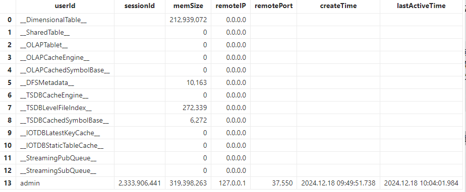

# 数据库缓存清理机制

数据库缓存在提升数据库性能和响应速度方面起着至关重要的作用。然而，不必要的缓存可能会占用过多的内存资源，从而影响系统效率。本文将介绍如何高效清理 DolphinDB
的缓存，以优化资源利用和系统性能。

## 1. 数据库缓存类型

在 DolphinDB 中，使用 [getSessionMemoryStat](../funcs/g/getSessionMemoryStat.md) 可获取当前节点的内存占用状态。



其中，不同数据库缓存类型介绍如下：

表 1-1 数据库缓存类型介绍表

| **数据库缓存类型** | **介绍** |
| --- | --- |
| \_\_DimensionalTable\_\_ | 维度表缓存，单位为字节。 |
| \_\_SharedTable\_\_ | 共享表缓存，单位为字节。 |
| \_\_OLAPTablet\_\_ | OLAP 引擎数据库表的缓存，单位为字节。 |
| \_\_OLAPCacheEngine\_\_ | OLAP 引擎 Cache Engine 的内存占用，单位为字节。 |
| \_\_OLAPCachedSymbolBase\_\_ | OLAP 引擎 SYMBOL 类型字典编码的缓存，单位为字节。 |
| \_\_DFSMetadata\_\_ | 分布式存储的元数据内存占用情况，单位为字节。 |
| \_\_TSDBCacheEngine\_\_ | TSDB 引擎 Cache Engine 的内存占用，单位为字节。 |
| \_\_TSDBLevelFileIndex\_\_ | TSDB 引擎 level file 索引的缓存，单位为字节。 |
| \_\_TSDBCachedSymbolBase\_\_ | TSDB 引擎 SYMBOL 类型字典编码的缓存，单位为字节。 |
| \_\_IOTDBStaticTableCache\_\_ | 点位管理引擎 IOTDB 的静态表缓存，单位为字节。 |
| \_\_IOTDBLatestKeyCache\_\_ | 点位管理引擎 IOTDB 的最新值缓存，单位为字节。 |
| \_\_StreamingPubQueue\_\_ | 流数据发布队列里未处理的消息数。 |
| \_\_StreamingSubQueue\_\_ | 流数据订阅队列里未处理的消息数。 |

## 2. 数据库缓存清理

下文将介绍如何清理不同类型的数据库缓存。

本文中的所有示例均已在 3.00.2 单节点版本上验证通过。清理缓存前后，可通过执行以下语句验证对应缓存是否已清除：

```
exec memSize from getSessionMemoryStat() where userId="__******__"
```

### 2.1 维度表缓存

维度表是分布式数据库中没有进行分区的表，查询时会将表中所有数据加载到内存，适用于存储不频繁更新的小数据集。

维度表缓存支持通过以下方式清理:

* 从 2.00.11 和 1.30.23 版本开始，维度表引入了自动回收机制，当内存使用超过系统配置参数 warningMemSize
  设定的阈值时，系统会根据 LRU（Least Recently Used）策略尝试释放部分维度表缓存。
* 调用 [clearCachedDatabase](../funcs/c/clearCachedDatabase.md) 手动释放维度表的缓存。
* 从 2.00.11 和1.30.23 版本开始，[clearAllCache](../funcs/c/clearAllCache.md) 函数也会清理维度表缓存。

例1，例2，例3脚本中所用数据库表由以下脚本生成

```
dbNameOLAP = "dfs://test_OLAP"
dbNameTSDB = "dfs://test_TSDB"
if(existsDatabase(dbNameOLAP)){
    dropDatabase(dbNameOLAP)
}
if(existsDatabase(dbNameTSDB)){
    dropDatabase(dbNameTSDB)
}
t = table(1..10 as x, symbol(string(1..10)) as y)
dbOLAP = database(dbNameOLAP, VALUE, 1..10)
dbTSDB = database(dbNameTSDB, VALUE, 1..10, engine="TSDB")
createTable(dbOLAP, t, `dt1).append!(t)
createTable(dbOLAP, t, `dt2).append!(t)
createTable(dbOLAP, t, `dt3).append!(t)
createTable(dbTSDB, t, `dt1, sortColumns=`x).append!(t)
createTable(dbTSDB, t, `dt2, sortColumns=`x).append!(t)
createTable(dbTSDB, t, `dt3, sortColumns=`x).append!(t)
```

例1. 清除指定维度表缓存

```
//生成维度表缓存
select * from loadTable(dbOLAP, `dt1)
select * from loadTable(dbTSDB, `dt1)
//output：544
exec memSize from pnodeRun(getSessionMemoryStat) where userId="__DimensionalTable__"

//清除指定维度表缓存
pnodeRun(clearCachedDatabase{dbNameOLAP, `dt1})
pnodeRun(clearCachedDatabase{dbNameTSDB, `dt1})
//output：0
exec memSize from pnodeRun(getSessionMemoryStat) where userId="__DimensionalTable__"
```

例2. 清除指定数据库中所有的数据表缓存

```
//生成维度表缓存
select * from loadTable(dbNameOLAP, `dt1)
select * from loadTable(dbNameOLAP, `dt2)
select * from loadTable(dbNameOLAP, `dt3)
select * from loadTable(dbNameTSDB, `dt1)
select * from loadTable(dbNameTSDB, `dt2)
select * from loadTable(dbNameTSDB, `dt3)
//output：1632
exec memSize from pnodeRun(getSessionMemoryStat) where userId="__DimensionalTable__"

//清除指定数据库中所有的数据表缓存
pnodeRun(clearCachedDatabase{dbNameOLAP})
pnodeRun(clearCachedDatabase{dbNameTSDB})
//output：0
exec memSize from pnodeRun(getSessionMemoryStat) where userId="__DimensionalTable__"
```

例3. `clearAllCach` 函数也会清除维度表缓存

```
//生成维度表缓存
select * from loadTable(dbNameOLAP, `dt1)
select * from loadTable(dbNameOLAP, `dt2)
select * from loadTable(dbNameOLAP, `dt3)
select * from loadTable(dbNameTSDB, `dt1)
select * from loadTable(dbNameTSDB, `dt2)
select * from loadTable(dbNameTSDB, `dt3)
//output：1632
exec memSize from pnodeRun(getSessionMemoryStat) where userId="__DimensionalTable__"

//清除维度表缓存
pnodeRun(clearAllCache)
//output：0
exec memSize from pnodeRun(getSessionMemoryStat) where userId="__DimensionalTable__"

```

### 2.2 共享表变量

内存表等本地对象默认在其他会话中不可见。通过 `share` 函数共享后，表可在其他会话中访问。

释放共享表变量可使用 [undef](../funcs/u/undef.md) 函数，并通过指定
*objType*=SHARED 来释放共享变量占用的内存。

例4. 释放指定共享表变量

```
//生成指定共享表变量
t = table(1..10 as x, 1..10 as y)
share t as st
//output：272
exec memSize from pnodeRun(getSessionMemoryStat) where userId="__SharedTable__"

//释放指定共享表变量
undef(`st, SHARED)
//output：0
exec memSize from pnodeRun(getSessionMemoryStat) where userId="__SharedTable__"
```

### 2.3 OLAP 引擎读缓存

OLAP
引擎自动将查询过的历史数据加载到读缓存，后续相关数据的查询将先从缓存中读取。多个会话共享分区表读缓存数据，以提高内存使用率。其分布式表的内存管理有如下特点：

* 内存以分区的一列为单位进行管理。
* 数据只加载到所在的节点，不会在节点间转移。
* 多个用户访问相同分区时，使用同一份缓存。
* 内存使用不超过 warningMemSize 情况下，尽量多缓存数据。

OLAP引擎读缓存支持通过以下方式清理：

* 当总的内存使用达到 warningMemSize 时，系统会采用 LRU 的内存回收策略，自动回收一部分内存。
* 使用 `clearAllCache` 函数或 `clearCachedDatabase`
  函数手动清理。

例5，例6脚本中所用数据库表由以下脚本生成

```
dbName = "dfs://test"
if(existsDatabase(dbName)){
    dropDatabase(dbName)
}
t = table(1..10 as x, symbol(string(1..10)) as y)
db = database(dbName, VALUE, 1..10)
pt1 = createPartitionedTable(db, t, `pt1, `x).append!(t)
pt2 = createPartitionedTable(db, t, `pt2, `x).append!(t)
pt3 = createPartitionedTable(db, t, `pt3, `x).append!(t)
```

例5. `clearAllCache` 清理 OLAP 引擎数据库表缓存

```
//生成 OLAP 引擎数据库表缓存
select * from loadTable(dbName, `pt1)
select * from loadTable(dbName, `pt2)
select * from loadTable(dbName, `pt3)
//output：240
exec memSize from pnodeRun(getSessionMemoryStat) where userId="__OLAPTablet__"

//clearAllCache 清理 OLAP 引擎数据库表缓存
pnodeRun(clearAllCache)
//output：0
exec memSize from pnodeRun(getSessionMemoryStat) where userId="__OLAPTablet__"

```

例6. `clearCachedDatabase` 清理 OLAP 引擎数据库表缓存

```
//生成 OLAP 引擎数据库表缓存
select * from loadTable(dbName, `pt1)
select * from loadTable(dbName, `pt2)
select * from loadTable(dbName, `pt3)
//output：240
exec memSize from pnodeRun(getSessionMemoryStat) where userId="__OLAPTablet__"

//clearCachedDatabase清理OLAP 引擎数据库表缓存
pnodeRun(clearCachedDatabase{dbName})
//output：0
exec memSize from pnodeRun(getSessionMemoryStat) where userId="__OLAPTablet__"

```

### 2.4 OLAP引擎写入缓存

Cache Engine 是 DolphinDB 中的一种数据写入缓存机制，用于提升海量数据写入性能。DolphinDB 采用先写入 Redo
log（预写式日志）和 Cache Engine（写入缓存）的通用做法，等数据积累到一定数量时，批量写入。

OLAP 引擎 Cache Engine 有两种自动回收机制：

* 每 30 秒一次的定期回收。
* 当缓存中的数据量达到 OLAPCacheEngineSize 的 30% 时，Cache Engine 会将内容写到列文件，完成回收。

OLAP 引擎 Cache Engine 的内存占用支持手动清理：

* 可使用 [flushOLAPCache](../funcs/f/flushOLAPCache.md)
  函数将缓冲区内已完成的事务强制写入数据库，从而释放 Cache Engine 的内存。
* 需要注意，`flushOLAPCache` 函数为异步操作，调用后内存不会立即释放。可通过 [getOLAPCacheEngineSize](../funcs/g/getOLAPCacheEngineSize.md) 函数监控 Cache Engine 的内存状态。

例7. 使用 `flushOLAPCache` 清理 OLAP 引擎 Cache Engine 的内存占用

```
//生成OLAP引擎写入缓存
dbName = "dfs://test"
if(existsDatabase(dbName)){
    dropDatabase(dbName)
}
t = table(1..10 as x, symbol(string(1..10)) as y)
db = database(dbName, VALUE, 1..10)
dt1 = createTable(db, t, `dt1).append!(t)
dt2 = createTable(db, t, `dt2).append!(t)
dt3 = createTable(db, t, `dt3).append!(t)
pt1 = createPartitionedTable(db, t, `pt1, `x).append!(t)
pt2 = createPartitionedTable(db, t, `pt2, `x).append!(t)
pt3 = createPartitionedTable(db, t, `pt3, `x).append!(t)

//output：480
exec memSize from pnodeRun(getSessionMemoryStat) where userId="__OLAPCacheEngine__"

//将 OLAP 引擎缓冲区里已经完成的事务强制写入数据库
pnodeRun(flushOLAPCache)
sleep(1000)
//output：0
exec memSize from pnodeRun(getSessionMemoryStat) where userId="__OLAPCacheEngine__"
```

### 2.5 OLAP引擎symbolBase缓存

在 OLAP 引擎中，当分布式表包含 SYMBOL 类型字段时，系统会在对其进行读写操作时缓存其 symbolBase（每个 symbol 与其对应 id
的映射字典，存储数据时存储 id 而非 symbol）。读缓存记录在 getSessionMemoryStat 的 OLAPTablet 中，写缓存即为
OLAPCachedSymbolBase。

为了管理内存使用，系统会根据缓存大小等条件定期清理 OLAPCachedSymbolBase，其中同时符合以下条件的 symbolBase 将被移出缓存：

* 超过 5 分钟未被访问。
* 对应的数据既不在 Cache Engine 中，也不在正在进行的事务中。

### 2.6 TSDB引擎写入缓存

TSDB 引擎的 Cache Engine 会对缓存数据进行排序。当 Cache Engine 写满一半或经过 10
分钟，系统会自动将缓存数据刷入磁盘。刷盘期间，Cache Engine 仍可继续写入，直至完全写满。

TSDB 引擎 Cache Engine 的内存占用可通过 [flushTSDBCache](../funcs/f/flushTSDBCache.md) 函数进行手动清理。该函数会将缓冲区中已完成的事务强制写入数据库，以释放内存资源。

例8. 使用 `flushTSDBCache`清理 TSDB 引擎 Cache Engine 的内存占用

```
//生成TSDB引擎写入缓存
dbName = "dfs://test"
if(existsDatabase(dbName)){
    dropDatabase(dbName)
}
t = table(1..10 as x, symbol(string(1..10)) as y)
db = database(dbName, VALUE, 1..10, engine="TSDB")
dt1 = createTable(db, t, `dt1, sortColumns=`x).append!(t)
dt2 = createTable(db, t, `dt2, sortColumns=`x).append!(t)
dt3 = createTable(db, t, `dt3, sortColumns=`x).append!(t)
pt1 = createPartitionedTable(db, t, `pt1, `x, sortColumns=`x).append!(t)
pt2 = createPartitionedTable(db, t, `pt2, `x, sortColumns=`x).append!(t)
pt3 = createPartitionedTable(db, t, `pt3, `x, sortColumns=`x).append!(t)

//output：7560
exec memSize from pnodeRun(getSessionMemoryStat) where userId="__TSDBCacheEngine__"
//将 TSDB 引擎缓冲区里已经完成的事务强制写入数据库
pnodeRun(flushTSDBCache)
//output：0
exec memSize from pnodeRun(getSessionMemoryStat) where userId="__TSDBCacheEngine__"
```

### 2.7 TSDB引擎levelFile索引缓存

与 OLAP 引擎存储数据的最小文件为列文件不同，TSDB 引擎存储数据的最小文件是 level file。每个 level file
都记录了元信息，数据块和数据块对应的索引。TSDB 查询分布式表数据时，会将分区下 level file
的索引部分加载到内存，然后将索引定位的数据部分加载到内存。正是因为通过索引就可以快速定位数据并加载，TSDB
只需要缓存索引数据，无需缓存查询的分区数据。TSDB 引擎 levelFile 索引缓存支持通过以下方式清理：

* 由配置参数 TSDBLevelFileIndexCacheSize 指定TSDB索引缓存的容量，单位为 GB，默认值为 maxMemSize 的
  5%，最小值为 0.1GB。若索引缓存空间不够时，会按照 LRU 算法，自动释放最近最少使用的 5% 的缓存空间。
* 使用 invalidateLevelIndexCache 函数手动清理。
* 从2.00.13/3.00.1版本开始，clearAllCache 函数也会对 TSDB 的 level file 索引缓存清理。

例9，例10脚本中所用数据库表由以下脚本生成

```
dbName = "dfs://test"
if(existsDatabase(dbName)){
    dropDatabase(dbName)
}
t = table(1..10 as x, symbol(string(1..10)) as y)
db = database(dbName, VALUE, 1..10, engine="TSDB")
dt1 = createTable(db, t, `dt1, sortColumns=`x)
dt2 = createTable(db, t, `dt2, sortColumns=`x)
dt3 = createTable(db, t, `dt3, sortColumns=`x)
pt1 = createPartitionedTable(db, t, `pt1, `x, sortColumns=`x)
pt2 = createPartitionedTable(db, t, `pt2, `x, sortColumns=`x)
pt3 = createPartitionedTable(db, t, `pt3, `x, sortColumns=`x)
```

例9. 使用 `invalidateLevelIndexCache` 清理TSDB引擎 level file 索引的缓存

```
dt1.append!(t)
dt2.append!(t)
dt3.append!(t)
pt1.append!(t)
pt2.append!(t)
pt3.append!(t)
//生成TSDB引擎 level file 索引的缓存
pnodeRun(flushTSDBCache)
//output：12510
exec memSize from pnodeRun(getSessionMemoryStat) where userId="__TSDBLevelFileIndex__"

//invalidateLevelIndexCache 清理TSDB引擎 level file 索引的缓存
pnodeRun(invalidateLevelIndexCache)
//output：0
exec memSize from pnodeRun(getSessionMemoryStat) where userId="__TSDBLevelFileIndex__"
```

例10. 使用 `clearAllCache` 清理TSDB引擎 level f

```
dt1.append!(t)
dt2.append!(t)
dt3.append!(t)
pt1.append!(t)
pt2.append!(t)
pt3.append!(t)
//生成TSDB引擎level file索引的缓存
pnodeRun(flushTSDBCache)
//output：12510
exec memSize from pnodeRun(getSessionMemoryStat) where userId="__TSDBLevelFileIndex__"

//clearAllCache 清理TSDB引擎level file索引的缓存
pnodeRun(clearAllCache)
//output：0
exec memSize from pnodeRun(getSessionMemoryStat) where userId="__TSDBLevelFileIndex__"
```

### 2.8 TSDB引擎symbolBase缓存

在 TSDB 中，当分布式表中存储了 symbol 类型字段时，会在对其读或写时进行 SymbolBase 的缓存。

在 2.00.13/3.00.1 版本之前，后台线程每 30s 会遍历所有缓存的 symbolBase，其中同时符合以下条件的 symbolBase
将被移出缓存：

* 超过 5 分钟未被访问。
* 对应的数据既不在 Cache Engine 中，也不在正在进行的事务中。

从 2.00.13/3.00.1 版本开始，我们对 TSDB symbolBase缓存清理机制进行修改，使用 LRU
缓存机制回收，移除缓存时根据容量和缓存时间两个维度来判断。容量通过配置项 TSDBCachedSymbolBaseCapacity 设置， 缓存时间通过配置项
TSDBSymbolBaseEvictTime 设置。

从2.00.13/3.00.1 版本开始，`clearAllCache` 函数和
`clearAllTSDBSymbolBaseCache` 函数都会清理 TSDB 中未被使用的 symbolBase
缓存。其中，未被使用的 symbolBase 是指其对应分区的数据不在 Cache Engine 中，也不在执行的任何事务中。

例11. 使用 `clearAllCache`清理 TSDB 引擎的 symbolBase 缓存

```
//生成TSDB引擎symbolBase缓存
dbName = "dfs://test"
if(existsDatabase(dbName)){
    dropDatabase(dbName)
}
t = table(1..10 as x, symbol(string(1..10)) as y)
db = database(dbName, VALUE, 1..10,,"TSDB")
dt1 = createTable(db, t, `dt1,,"x").append!(t)
dt2 = createTable(db, t, `dt2,,"x").append!(t)
dt3 = createTable(db, t, `dt3,,"x").append!(t)
pt1 = createPartitionedTable(db, t, `pt1, `x,,"x").append!(t)
pt2 = createPartitionedTable(db, t, `pt2, `x,,"x").append!(t)
pt3 = createPartitionedTable(db, t, `pt3, `x,,"x").append!(t)

//output：438
exec memSize from pnodeRun(getSessionMemoryStat) where userId="__TSDBCachedSymbolBase__"

//清理TSDB的symbolBase缓存
pnodeRun(flushTSDBCache)
sleep(61000) //flush后需等待1分钟
pnodeRun(clearAllCache)

//output：0
exec memSize from pnodeRun(getSessionMemoryStat) where userId="__TSDBCachedSymbolBase__"
```

### 2.9 点位管理引擎的静态表缓存

在点位管理引擎中，静态表存储对 sortColumns 中指定的除最后时间列外的其它列的映射。配置项 IOTDBStaticTableCacheSize
用于管理静态表缓存最大值，默认为 maxMemSize 的 5%。

静态表缓存管理与 symbolBase 一致，系统会将同时符合以下条件的静态表缓存清理：

* 定期（每隔 30 秒）踢出最近未使用的分区。
* 其对应的数据不在 Cache Engine 中，也不在正在进行的事务中。

此外，静态表缓存可用 [clearAllIOTDBStaticTableCache](../funcs/c/clearalliotdbstatictablecache.md) 函数手动清理。

例12. 使用 clearAllIOTDBStaticTableCache 清理静态表缓存

```
//生成静态表缓存
if(existsDatabase('dfs://test')){
	dropDatabase('dfs://test')
}
db1 = database(, partitionType=VALUE, partitionScheme=1..100)
db2 = database(, partitionType=VALUE, partitionScheme=2018.08.07..2018.08.11)
db = database('dfs://test', COMPO, [db1, db2], engine='IOTDB')
create table 'dfs://test'.'pt'(
	id INT,
	ticket SYMBOL,
	id2 LONG,
	ts TIMESTAMP,
	id3 IOTANY
)
partitioned by id, ts,
sortColumns=[`ticket, `id2, `ts],
sortKeyMappingFunction=[hashBucket{, 50}, hashBucket{, 50}],
latestKeyCache=true
pt = loadTable('dfs://test', 'pt')

n=10000
idv=take(1..100, n)
ticketv=take(`adsfe`basdfewf`csdffeaefast4et4eadf join NULL, n)
id2v=take(-2 3 4 5 NULL 2, n)
tsv=take(2018.08.07..2018.08.11, n)
id3v = take(string(1..1000000), n)
t = table(idv as id, ticketv as ticket, id2v as id2, tsv as ts, id3v as id3)
pt.append!(t)

//output：21600
exec memSize from pnodeRun(getSessionMemoryStat) where userId="__IOTDBStaticTableCache__"

//clearAllIOTDBStaticTableCache 清理静态表缓存
pnodeRun(clearAllIOTDBStaticTableCache)

//output：0
exec memSize from pnodeRun(getSessionMemoryStat) where userId="__IOTDBStaticTableCache__"

```

### 2.10 点位管理引擎的最新值缓存表缓存

在点位管理引擎中，系统会实时更新最新值缓存，并直接从缓存而非磁盘中读取数据，创建以分区为单位的最新值缓存表。配置项 IOTDBLatestKeyCacheSize
用于管理最新值缓存表最大值，默认为 maxMemSize 的 5%。

最新值缓存表缓存管理与 symbolBase 缓存管理机制相似，系统会将同时符合以下条件的最新值缓存表缓存清理：

* 定期（每隔 30 秒）踢出最近未使用的分区。
* 其对应的数据不在 Cache Engine 中，也不在正在进行的事务中。

此外，最新值缓存表缓存可用 [clearAllIOTDBLatestKeyCache](../funcs/c/clearalliotdblatestkeycache.md) 函数手动清理（注：如果某个分区在Cache
Engine有数据，则该分区的最新值缓存表不会从内存缓存中清除)。

例13. 使用 `clearAllIOTDBLatestKeyCache` 清理最新值缓存表缓存

```
//生成最新值缓存表缓存
if(existsDatabase('dfs://test')){
	dropDatabase('dfs://test')
}
db1 = database(, partitionType=VALUE, partitionScheme=1..100)
db2 = database(, partitionType=VALUE, partitionScheme=2018.08.07..2018.08.11)
db = database('dfs://test', COMPO, [db1, db2], engine='IOTDB')
create table 'dfs://test'.'pt'(
	id INT,
	ticket SYMBOL,
	id2 LONG,
	ts TIMESTAMP,
	id3 IOTANY
)
partitioned by id, ts,
sortColumns=[`ticket, `id2, `ts],
sortKeyMappingFunction=[hashBucket{, 50}, hashBucket{, 50}],
latestKeyCache=true
pt = loadTable('dfs://test', 'pt')

n=10000
idv=take(1..100, n)
ticketv=take(`adsfe`basdfewf`csdffeaefast4et4eadf join NULL, n)
id2v=take(-2 3 4 5 NULL 2, n)
tsv=take(2018.08.07..2018.08.11, n)
id3v = take(string(1..1000000), n)
t = table(idv as id, ticketv as ticket, id2v as id2, tsv as ts, id3v as id3)
pt.append!(t)

//output：55900
exec memSize from pnodeRun(getSessionMemoryStat) where userId="__IOTDBLatestKeyCache__"

//clearAllIOTDBLatestKeyCache 清理最新值缓存表缓存
pnodeRun(flushTSDBCache)
pnodeRun(clearAllIOTDBLatestKeyCache)

//output：0
exec memSize from pnodeRun(getSessionMemoryStat) where userId="__IOTDBLatestKeyCache__"

```

### 2.11 流数据消息缓存队列

DolphinDB 为流数据发送节点提供持久化队列缓存和发送队列缓存，为订阅节点提供接收数据队列缓存。

当数据进入流数据系统时，首先写入流数据表，然后写入持久化队列和发送队列。假设用户设置为异步持久化，则持久化队列异步写入磁盘，发送队列发送到订阅端。
当订阅端收到数据后，先放入接受队列，然后用户定义的 handler 从接收队列中取数据并处理。如果 handler
处理缓慢，会导致接收队列有数据堆积，占用内存。

StreamingPubQueue 为流数据发布队列里未处理的消息数， 其大小与 maxPubQueueDepthPerSite 配置项有关。

StreamingSubQueue 为流数据订阅队列里未处理的消息数， 其大小与 maxSubQueueDepth 配置项有关。

这两个类型的缓存只能等待消费完成后释放。

## 3. 小结

综上所述，DolphinDB 中不同类型的缓存可以通过对应的清理函数或机制清除，总结的关系表如下：

表 3-1 数据库缓存清理总结表

| **数据库缓存类型** | **介绍** | **清理方式** |
| --- | --- | --- |
| \_\_DimensionalTable\_\_ | 维度表缓存，单位为 Bytes。 | * `clearCachedDatabase`函数 * `clearAllCache`函数 * `warningMemSize`配置项 |
| \_\_SharedTable\_\_ | 共享表缓存，单位为 Bytes。 | `undef`函数 |
| \_\_OLAPTablet\_\_ | OLAP 引擎数据库表的缓存，单位为 Bytes。 | * `clearAllCache`函数 * `clearCachedDatabase`函数 * `warningMemSize`配置项 |
| \_\_OLAPCacheEngine\_\_ | OLAP 引擎 Cache Engine 的内存占用，单位为 Bytes。 | * `flushOLAPCache`函数 * `OLAPCacheEngineSize`配置项 |
| \_\_OLAPCachedSymbolBase\_\_ | OLAP 引擎 SYMBOL 类型字典编码的缓存，单位为 Bytes。 | 后台线程自动清理 |
| \_\_DFSMetadata\_\_ | 分布式存储的元数据内存占用情况，单位为字节。 | 非缓存，无需清理 |
| \_\_TSDBCacheEngine\_\_ | TSDB 引擎 Cache Engine 的内存占用，单位为 Bytes。 | * `flushTSDBCache`函数 * `TSDBCacheEngineSize`配置项 |
| \_\_TSDBLevelFileIndex\_\_ | TSDB 引擎 level file 索引的缓存，单位为 Bytes。 | * `invalidateLevelIndexCache`函数 * `clearAllCache`函数 * `TSDBLevelFileIndexCacheSize`配置项 |
| \_\_TSDBCachedSymbolBase\_\_ | TSDB 引擎 SYMBOL 类型字典编码的缓存，单位为 Bytes。 | * `clearAllCache`函数 * `TSDBSymbolBaseEvictTime`配置项 * `TSDBCachedSymbolBaseCapacity`配置项 |
| \_\_IOTDBStaticTableCache\_\_ | 静态表缓存，单位为字节。 | * `clearAllIOTDBStaticTableCache`函数 * `IOTDBStaticTableCacheSize`配置项 |
| \_\_IOTDBLatestKeyCache\_\_ | 最新值表缓存，单位为字节。 | * `clearAllIOTDBLatestKeyCache`函数 * `IOTDBStaticTableCacheSize`配置项 |
| \_\_StreamingPubQueue\_\_ | 流数据发布队列里未处理的消息数。 | 无需清理，等待消费完成 |
| \_\_StreamingSubQueue\_\_ | 流数据订阅队列里未处理的消息数。 | 无需清理，等待消费完成 |

