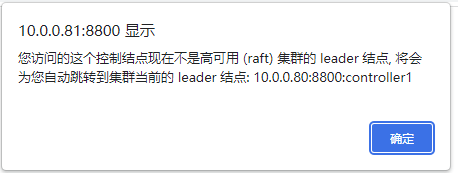
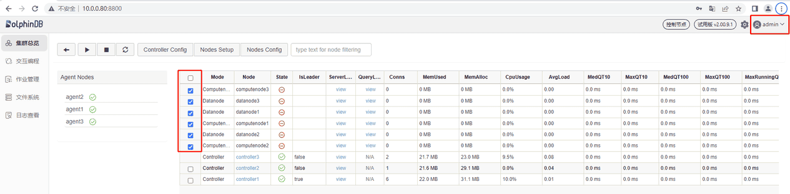
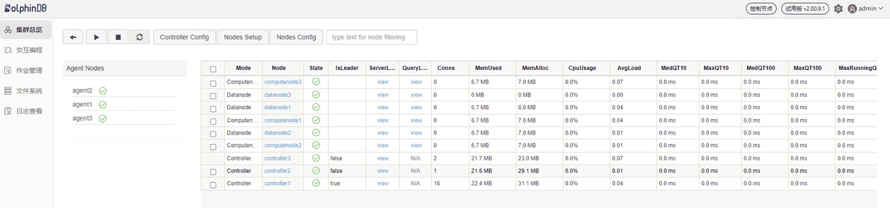

# P2 P3 相关内容已省略...
```

*files.tfvars* 文件记录了 Terraform 的变量，其中包含了一些关键配置项。以下是对每个配置项的简要说明：

1. dolphindb\_lic\_content：证书内容。这是 DolphinDB 的证书内容，用于许可验证。可在这里配置企业版license。
2. security\_group\_ids：安全组 ID，用于定义 EC2 实例的入站和出站流量规则。
3. cluster\_nodes：集群成员配置参数。
4. cluster\_cfg：数据节点和计算节点配置参数。
5. controller\_cfg\_p1：P1 控制节点配置参数。
6. agent\_cfg\_p1：P1 代理节点配置参数。
7. controller\_cfg\_p2：P2 控制节点配置参数。
8. agent\_cfg\_p2：P2 代理节点配置参数。
9. controller\_cfg\_p3：P3 控制节点配置参数。
10. agent\_cfg\_p3：P3 代理节点配置参数。

### 配置 *output.tf* 文件

在 *output.tf* 文件中添加以下内容：

```
output "public_ip_p1" {
  value = aws_instance.ddb_p1.public_ip
}

output "private_ip_p1" {
  value = aws_instance.ddb_p1.private_ip
}

output "public_ip_p2" {
  value = aws_instance.ddb_p2.public_ip
}

output "private_ip_p2" {
  value = aws_instance.ddb_p2.private_ip
}

output "public_ip_p3" {
  value = aws_instance.ddb_p3.public_ip
}

output "private_ip_p3" {
  value = aws_instance.ddb_p3.private_ip
}
```

这些参数会在集群部署完成后输出，下面是参数解释：

1. public\_ip\_p1：p1 的公网 IP
2. private\_ip\_p1：p1 的私网 IP
3. public\_ip\_p2：p2 的公网 IP
4. private\_ip\_p2：p2 的私网 IP
5. public\_ip\_p3：p3 的公网 IP
6. private\_ip\_p3：p3 的私网 IP

### 执行 Terraform 命令

通过终端进入 Terraform 项目文件夹：

```
cd /path/to/Dolphindb-Terraform
```

初始化目录：

```
terraform init
```

部署实例，可以根据实际的资源和需求来填写 *variables.tf* 文件中定义的变量：

```
terraform apply -var "region=<your_region>" -var "subnet_id_p1=<your_subnet_id_p1>" -var "subnet_id_p2=<your_subnet_id_p2>" -var "subnet_id_p3=<your_subnet_id_p3>"  -var "key_name=<your_key_pair_name>" -var "ddbversion=2.00.10.8" -var "az_p1=<your_az_p1>" -var "az_p2=<your_az_p2>" -var "az_p3=<your_az_p3>"  -var "key_location=<absolute_path_of_your_key_pair>" -var-file="files.tfvars"
```

按照提示输入 `yes` 确认创建资源。等待 Terraform 完成部署。

### 通过 Web 管理界面检查 DolphinDB 节点运行

可以通过 Web 管理界面启动或关闭数据节点和计算节点，以及修改集群的配置。在浏览器中输入任一控制节点的 IP 地址和端口号即可进入 Web 管理界面，例如，P2 上控制节点的 IP 为 10.0.0.81，端口号为 8800，所以访问地址为 10.0.0.81:8800。访问后若出现如下提示，表明当前控制节点不是 Leader 节点，点击确定即可自动跳转至 Leader 节点：



打开后的 Web 管理界面如下。以管理员身份（默认账号：admin，默认密码：123456）登录后，勾选数据节点和计算节点，再点击启动（关闭）按键即可启动（关闭）相应的数据节点和计算节点：



刷新页面后可看到对应的数据节点和计算节点已启动，如下图所示：



## 常见问题解答(FAQ)

### 如何为创建的实例配置 SSH 登录？

在 AWS EC2 中，`key_name` 参数用于指定启动实例时要使用的密钥对的名称。密钥对用于对实例进行身份验证，从而允许用户通过 SSH 登录到实例。以下是详细的步骤：

1. 创建密钥对：

   a. 在 AWS 控制台中导航到 EC2。

   b. 在左侧导航栏中，选择 "Key Pairs"（密钥对）。

   c. 单击 "Create Key Pair"（创建密钥对）。

   d. 输入密钥对的名称，然后选择 "Create"（创建）。

   e. 保存生成的私钥文件（通常以 `.pem` 结尾）。
2. 将私钥文件添加到 SSH 代理：

   在本地计算机上，使用以下命令将私钥添加到 SSH 代理。请将 `/path/to/your-key.pem` 替换为第一步中保存的私钥文件的实际路径。

```
ssh-add /path/to/your-key.pem
```

1. 设置密钥对名称和文件位置

```
terraform apply // 其他变量... -var "key_name=<your_key_pair_name>" -var "key_location=<absolute_path_of_your_key_pair>"
```

1. SSH 登录到实例：

使用以下命令通过 SSH 登录到 EC2 实例。请将 `your-instance-ip` 替换为实际的 IP 地址。

```
ssh -i /path/to/your-key.pem ec2-user@your-instance-ip
```

注意：ec2-user 是 Amazon Linux AMI 的默认用户名。请根据实际使用的 AMI 修改用户名，例如，若 AMI 是Ubuntu，则用户名填 `ubuntu`。

### 如何更新软件授权许可

在 *files.tfvars* 文件中，将 `dolphindb_lic_content` 变量的内容替换为企业版授权许可内容。同时，确保 *variables.tf* 文件中 *replace\_dolphindb\_lic* 的值设为 true（默认为 true）。

```
dolphindb_lic_content= <<EOF
// 替换后的 dolphindb.lic 文件内容
EOF
```

## 附录

* 部署 DolphinDB 单节点完整项目代码代码：
  + [files.tfvars](script/cloud_deployment_with_terraform/standalone/files.tfvars)
  + [main.tf](script/cloud_deployment_with_terraform/standalone/main.tf)
  + [variables.tf](script/cloud_deployment_with_terraform/standalone/variables.tf)
* 部署 DolphinDB 高可用集群完整代码：
  + [files.tfvars](script/cloud_deployment_with_terraform/cluster/files.tfvars)
  + [main.tf](script/cloud_deployment_with_terraform/cluster/main.tf)
  + [variables.tf](script/cloud_deployment_with_terraform/cluster/variables.tf)
  + [output.tf](script/cloud_deployment_with_terraform/cluster/output.tf)

