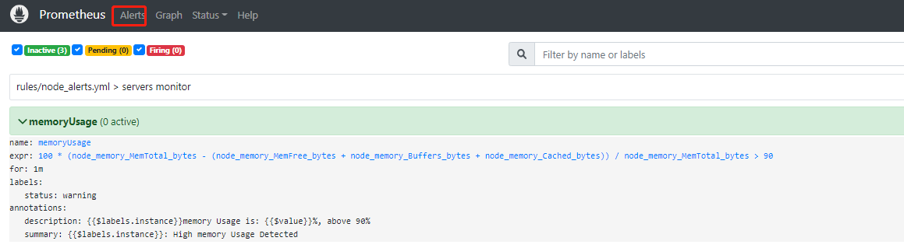

# Alertmanager configuration
alerting:
  alertmanagers:
    - static_configs:
        - targets: ["xxxxxxxx:xxx"] #alertmanager 的 IP 地址和端口号

rule_files:
  - "rules/node_alerts.yml" #告警规则的存放路径
```

之后在 Prometheus 安装目录里新建一个 rules 文件夹，在 rules 文件夹里新建一个 node\_alerts.yml 文件，该文件就是告警规则，需要在该文件下编写你的告警规则，以磁盘空间使用率为例：

```
groups:
- name: "servers monitor"
  rules:
  - alert: "diskUsage" #服务器磁盘空间使用率
    expr: (1-sum(node_filesystem_avail_bytes{mountpoint =~"/hdd.*?|/ssd.*?|/home.*?"})by (instance,mountpoint)/sum(node_filesystem_size_bytes{mountpoint =~"/hdd.*?|/ssd.*?|/home.*?"})by(instance,mountpoint))*100>90
    for: 5m
    labels:
      status: warning
    annotations:
      summary: "{{$labels.instance}} {{$labels.mountpoint}}: High disk Usage Detected"
      description: "{{$labels.instance}} {{$labels.mountpoint}} disk Usage is: {{$value}}%, above 90%"
```

最后在 Alertmanager 安装目录下新建一个 template 文件夹，在 template 文件夹里新建一个 wechat.tmpl 文件，该文件就是消息模板，在其中输入以下内容：

```
{{ define "wechat.default.message" }}
{{- if gt (len .Alerts.Firing) 0 -}}
{{- range $index, $alert := .Alerts -}}
{{- if eq $index 0 }}
========= 监控报警 =========
告警状态：{{   .Status }}
告警类型：{{ $alert.Labels.alertname }}
故障主机: {{ $alert.Labels.instance }}
告警主题: {{ $alert.Annotations.summary }}
告警详情: {{ $alert.Annotations.message }}{{ $alert.Annotations.description}}
故障时间: {{ ($alert.StartsAt.Add 28800e9).Format "2006-01-02 15:04:05" }}
========= = end =  =========
{{- end }}
{{- end }}
{{- end }}
{{- if gt (len .Alerts.Resolved) 0 -}}
{{- range $index, $alert := .Alerts -}}
{{- if eq $index 0 }}
========= 异常恢复 =========
告警类型：{{ .Labels.alertname }}
告警状态：{{   .Status }}
告警主题: {{ $alert.Annotations.summary }}
告警详情: {{ $alert.Annotations.message }}{{ $alert.Annotations.description}}
故障时间: {{ ($alert.StartsAt.Add 28800e9).Format "2006-01-02 15:04:05" }}
恢复时间: {{ ($alert.EndsAt.Add 28800e9).Format "2006-01-02 15:04:05" }}
{{- if gt (len $alert.Labels.instance) 0 }}
实例信息: {{ $alert.Labels.instance }}
{{- end }}
========= = end =  =========
{{- end }}
{{- end }}
{{- end }}
{{- end }}
```

以上，就完成了企业微信告警的配置。

##### 启动企业微信告警

重启 Prometheus，然后进入 alertmanager 安装目录，运行以下代码启动 alertmanager：

```
nohup ./alertmanager --config.file=alertmanager.yml --web.listen-address=":9093" --cluster.listen-address=localhost:9095 &
```

其中，--config.file 指定 alertmanager 的配置文件，--web.listen-address 指定 alertmanager 的运行端口，这里设置为9093，--cluster.listen-address 指定集群端口，默认值为9094，若默认端口被占用，则需指定一个未被占用的端口。

启动了 alertmanager 之后，在浏览器地址栏输入 Prometheus 的 IP 和端口，进入 prometheus，然后点击 `Alerts`，就会出现如下所示界面：



表示告警规则创建成功了。触发告警规则后，企业微信收到的信息样式如下：


至此，企业微信告警部署完毕，用户可根据上述步骤开启 DolphinDB 集群监控的企业微信告警。

