# CEP 引擎应用：股票中高频 CTA 策略实现与并行回测

**面向读者**

* 本教程面向已有一定基础的 DophinDB CEP 引擎使用者，意在帮助读者进一步学习 DolphinDB CEP 引擎在量化交易场景下的灵活用法
* 建议读者首先阅读和掌握以下教程，再阅读本文的内容
  + [CEP 引擎入门：初级高频量价因子策略的实现](getting_started_with_cep_engine.md)

**扩展材料**

* 除了基础 DolphinDB 概念外，本教程还推荐以下扩展阅读以更好理解本案例的代码：
  + [模拟撮合插件使用教程](matching_engine_simulator.md)
  + [数据面板（Dashboard）](dashboard_tutorial.md)
  + [数据回放（Replay）](../funcs/r/replay.md)

在上一篇[复杂事件处理（Complex Events Processing, CEP）引擎的系列教程](getting_started_with_cep_engine.md)中，我们详细介绍了 CEP 引擎和它的一些关键概念，如复杂事件和事件监听器等。随后又通过两个初级的 CEP 引擎使用案例介绍了创建并运行一个最简单结构的 CEP 引擎所需的步骤和模块，以及在 CEP 引擎内部调用其他流计算引擎进行实时因子计算的方法。

本文将进一步介绍如何基于 CEP 引擎实现一个股票 CTA 策略，并使用真实市场数据进行回测。为了实现回测，CEP 引擎将联动模拟撮合引擎（Matching Engine Simulator）插件来模拟委托订单的发出与快照行情的撮合。同时将介绍技术指标和买卖信号的实时可视化。在文末，将更进一步介绍如何在 CEP 引擎中实现并行的参数寻优，以最大程度地接近真实的使用场景。文章将提供完整的测试代码和脱敏后的测试数据，供读者在 3.00.1.3 及以上版本的 server 学习，详情见文末**附录**。

注：案例中使用的 CEP 引擎和模拟撮合引擎插件均需要相应的 license。欢迎联系 DolphinDB 小助手咨询试用，微信号 13306510479。

## 1. 策略逻辑

本教程中的案例策略是一种典型的趋势策略，基于实时的高频数据进行指标计算，旨在将短时间内量价指标的突变作为趋势开始的信号。该策略利用高频交易的速度优势提前建仓以跟踪趋势，并在指标显示趋势结束时平仓。策略信号将由 MACD、CCI 和成交量三个指标的条件组合所触发，具体信号产生的逻辑如下：

* 当 MACD 出现金叉（DIFF 上穿 DEA）后，出现以下任意情形之一则买入500股：
  + 过去30秒内的 CCI 指标从下向上突破+100线进入超买区间，并且过去30秒的成交量之和大于50000股
  + 过去30秒内的 CCI 指标从下向上突破-100线
* 当 MACD 出现死叉（DIFF 下穿 DEA）后，对相应标的作清仓操作（若有持仓）

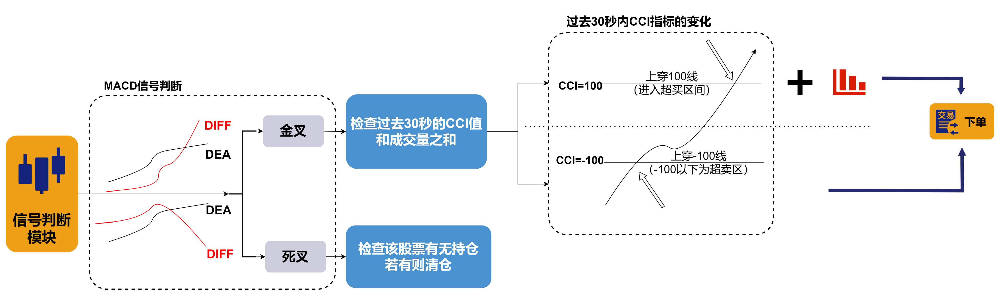

出现下单信号的场景一共有以下三种：

* 当 MACD 指标出现金叉，且过去 30 秒内 CCI 指标上穿 100，且过去 30 秒内成交量之和超过 50000 时， 触发下单；
* 当 MACD 指标出现金叉，且过去30秒内 CCI 指标上穿 -100时，触发下单；
* 当 MACD 指标出现死叉时，触发清仓。

## 2. 主要功能模块

上文中的策略逻辑将通过 CEP 引擎实现，此外，还利用了数据回放（Replay）和模拟撮合引擎（Matching Engine Simulator）插件进行策略回测。大致流程如下图所示。

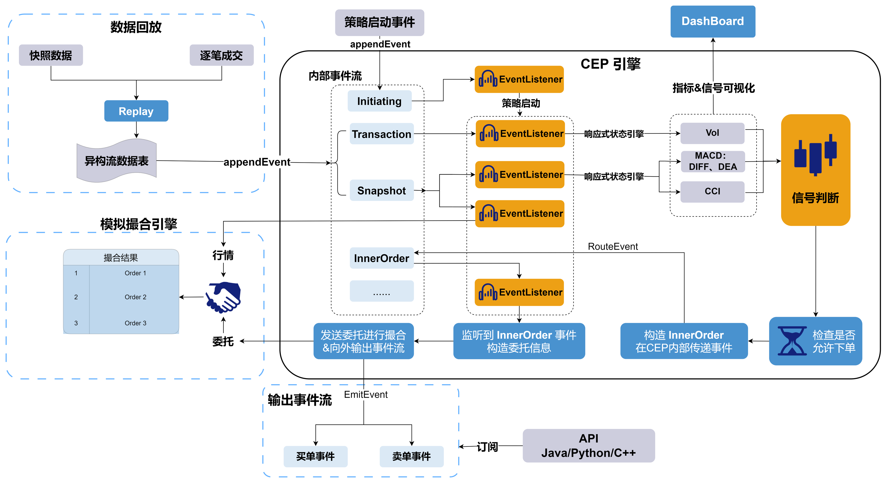

CEP 引擎中的事件监听器在监听到策略启动事件后将设置对快照事件、成交事件等事件的监听，这意味着启动整个策略。行情数据通过数据回放（Replay）功能进入引擎后，将被对应的监听器捕获并触发指标计算和后续的策略信号判断逻辑。下面将分模块地介绍它们的主要功能。

### 2.1 CEP 引擎

CEP 引擎模块是策略中最重要，也是最复杂的部分。在本案例中，采用了动态启动策略的方式：当引擎内的事件监听器（Event Listener）捕获策略启动事件时才会设置其他监听（如监听快照事件和逐笔成交事件）、创建模拟撮合和响应式状态引擎（Reactive State Engine，RSE）和所需的一些共享表。

策略启动后，行情数据通过数据回放进入 CEP 引擎时，将被反序列化为快照事件和逐笔成交事件。当快照事件和逐笔成交事件被对应的事件监听器所捕捉时，将触发对应的处理函数。一方面把快照数据和逐笔成交数据分别传入两个响应式状态引擎进行指标计算，另一方面将快照数据同步更新到模拟撮合引擎中。

两个响应式状态引擎将分别利用 ta 模块计算 MACD、CCI 和成交量指标，并将计算结果传递给对应的回调函数。回调函数把因子值写入共享流数据表，以便在数据面板（Dashboard）中进行可视化展示。与此同时，会按照上文中提到的信号判断逻辑进行一系列的信号判断。当产生买入或卖出的信号时构造内部订单事件（InnerOrder），而内部订单事件将被对应的监听器捕获，触发执行下单函数。本例的下单函数中，构造了符合模拟撮合引擎输入格式的委托订单，将其发送给模拟撮合引擎并与行情快照进行撮合。

### 2.2 数据回放

数据回放 `Replay` 是 DolphinDB 中常用于高频策略回测场景的方法，它可以根据指定的回放模式，按时间顺序将一个或多个数据表（或由 `replayDS` 函数返回的数据源列表）的数据回放到某个数据表或引擎，以模拟实时数据的写入。

由于行情快照由交易所按固定时间间隔推送，而逐笔成交数据的产生则完全取决于当日实际的交易情况，所以这两种数据的时间戳并不完全一致。 Replay 可以很好地将这两种数据按时间戳排序后输出到流数据表。并且，`Replay` 还可以将结构不同的多个表数据序列化后回放到一个异构流数据表中。通过订阅该异构流数据表，就可以向 CEP 引擎按时间顺序输入数据，以模拟事件按时间顺序发生的真实情况。

本案例数据将使用真实的历史行情快照和逐笔成交数据，通过数据回放模拟实时的事件流并进行处理。

### 2.3 模拟撮合引擎

在高频交易中，常有回测表现良好的策略，由于没有考虑到相应的滑点、发送订单的时延等摩擦成本，而在实盘交易中表现不佳。为了使策略研究时更贴近真实的交易情况，可以在回测过程中引入 DolphinDB 的模拟撮合插件来模拟真实交易的情况。模拟撮合引擎可以模拟用户在某个时间点发出订单或取消之前已发出订单的操作，并获取相应的交易结果，其逻辑架构如下图所示。

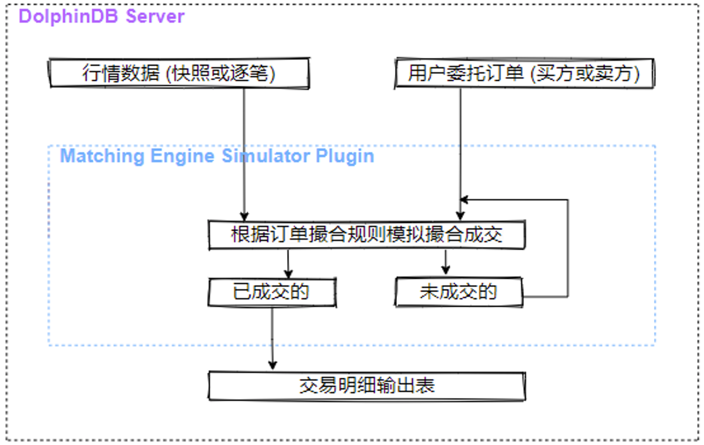

模拟撮合引擎以行情（快照数据或逐笔数据）和用户委托订单（买方或卖方）作为输入，根据订单撮合规则模拟撮合，将订单的成交结果（包含部分成交结果、拒绝订单和已撤订单）输出至交易明细输出表，未成交部分等待与后续行情撮合成交或者等待撤单。关于更多引擎运行机制的说明和撮合规则的解释见[官方文档](../plugins/matchingEngineSimulator/mes.md) 。

在本案例中，当策略启动以后才需要向模拟撮合引擎发送委托订单，因此创建模拟撮合引擎的函数将放在 CEP 引擎内部。

注：模拟撮合插件需要用户自行从插件仓库下载并加载，代码如下：

```
login("admin", "123456")
//使用 installPlugin 命令完成插件安装
installPlugin("MatchingEngineSimulator")
//使用 loadPlugin 命令加载插件。
loadPlugin("MatchingEngineSimulator")
```

## 3. 策略代码实现

在本章中我们将具体介绍策略代码的实现，包括定义事件、定义监视器、创建 CEP 引擎、启动策略实例、回放历史数据等功能模块，完整代码见文末附录。

### 3.1 定义事件类

首先定义在 CEP 引擎内部会涉及到的事件类，完整的事件定义代码见附件。

* 策略启动（Initiating）、行情快照（Snapshot）和逐笔成交（Transaction）事件均由外部写入 CEP 引擎中。
* 策略启动事件的成员属性中包含策略实例 id、初始现金、持仓量、股票池和策略参数等与策略初始设置相关的信息。
* 内部订单事件在 CEP 引擎中产生并通过 `routeEvent` 接口在引擎内部传递。此事件对于策略实现并不是必须的，仅仅为了在工程上解耦产生买入信号和下单两部分逻辑。
* 买单事件（BuyOrder）和卖单事件（SellOrder）在 CEP 引擎中产生，并通过 `emitEvent` 接口发送到外部。

  ```
  // 策略启动事件
  class Initiating {
      instanceId :: STRING
      factorParams :: ANY
      strategyParams :: ANY
      eventTime :: TIMESTAMP
      cashAmount :: INT
      holdingQty :: INT VECTOR
      stockPool :: STRING VECTOR
      def Initiating(instanceId_, factorParams_, strategyParams_, time_,
          cashAmount_,holdingQty_,stockPool_){
          instanceId = instanceId_
          factorParams = factorParams_
          strategyParams = strategyParams_
          eventTime = time_
          cashAmount = cashAmount_
          holdingQty = holdingQty_
          stockPool = stockPool_
      }
  }
  // 行情快照事件
  class Snapshot { ... }
  // 逐笔成交事件
  class Transaction { ... }
  // 内部订单事件
  class InnerOrder { ... }
  // 买单事件
  class BuyOrder { ... }
  // 卖单事件
  class SellOrder { ... }
  ```

  ​

### 3.2 定义监视器

CEP 引擎的创建和其内部监视器的配置是策略实现中最关键的步骤。监视器内封装了整个交易策略，其结构大致如下。

```
use ta
class Monitor {
    securitySelected :: STRING VECTOR
    instanceId :: STRING
    factorParams :: ANY
    strategyParams :: ANY
    newDiff :: ANY
    preDiff :: ANY
    preDea :: ANY
    pre30cci :: ANY
    pre30vol :: ANY
    newCci :: ANY
    priceJustTraded :: ANY
    orderState :: ANY
    availablePos :: ANY
    initCash :: INT
    availableCash :: INT
    initHoldingValue :: INT
    timestamp :: TIMESTAMP
    orderCount :: INT
    def Monitor(){
        availablePos = dict(STRING, INT)
        newDiff = dict(STRING, DOUBLE)
        preDiff = dict(STRING, DOUBLE)
        preDea = dict(STRING, DOUBLE)
        pre30cci = dict(STRING, DOUBLE)
        pre30vol = dict(STRING, DOUBLE)
        newCci = dict(STRING, DOUBLE)
        priceJustTraded = dict(STRING, DOUBLE)
        orderState = dict(STRING, BOOL)
        timestamp = 2023.02.01 08:00:00.000
        orderCount = 0
    }
        def createMatchingEngine(instanceId){}
        def emptyPosition(securityid){}
        def refreshOrderState(orderSecurity){}
        def buyOrder(innerOrder){}
        def handleMacdCciOutput(macdCciResult) {}
        def checkCciAndVol(securityid){}
        def orderStateCheck(innerOrder){}
        def checkGoldenCross(securityid, diff, dea) {}
        def handleVolOutput(volResult){}
        def updateMatchingEngineQuotes(SnapshotEvent){}
        def processSnapshot(SnapshotEvent) {}
        def processTrans(transactionEvent) {}
        def createCalFactorEngines(instanceId){}
        def initiatingStrategy(Initiating){}
        def onload() {
            addEventListener(handler=initiatingStrategy, eventType="Initiating", times="all")
        }
}
```

下面将按照 CEP 引擎运作的逻辑顺序，依次介绍监视器中各个成员方法的具体内容。

**onload 初始化**

创建引擎并实例化监视器后，将首先调用其内部的 `onload` 函数。回顾上文提到的 CEP 模块所负责的功能，其工作流的源头是监听策略启动事件，一旦监听到策略启动事件才进行下一步的操作。因此，在 `onload` 函数中，只需考虑设置相关的事件监听器以便启动策略即可。

```
def onload() {
    addEventListener(handler=initiatingStrategy, eventType="Initiating", times="all")
}
```

* 设置了一个事件监听器，监听所有的策略启动事件。目的是当监听到该事件时，下一步将启动整个策略，因此在对应的回调函数 `initiatingStrategy` 中需要包含对行情事件的监听器和创建所需要的计算引擎等步骤。从 `onload` 方法开始，函数调用的流程与实现的功能大致如下图所示。

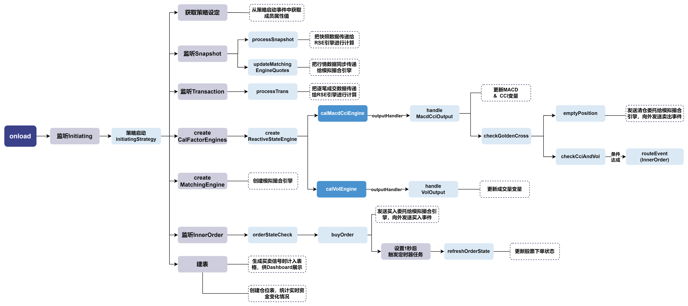

接下来从策略启动事件对应的回调函数 `initiatingStrategy` 开始来介绍具体的代码实现。

**启动策略**

```
def initiatingStrategy(Initiating){
    instanceId = Initiating.instanceId
    factorParams = Initiating.factorParams
    strategyParams = Initiating.strategyParams
    initCash = Initiating.cashAmount
    availableCash = initCash
    initHoldingQty = Initiating.holdingQty
    securitySelected = Initiating.stockPool
    availablePos[securitySelected] = initHoldingQty
    preCloTable = select SecurityID, PreCloPrice from loadTable("dfs://testDB",
    `snapshot) where date(TradeTime) = 2023.02.02 context by SecurityID limit 1
    preCloDict = dict(preCloTable.SecurityID, preCloTable.PreCloPrice)
    preClo = preCloDict[securitySelected]
    initHoldingValue =  sum(preClo * initHoldingQty)
    //创建表，统计实时情况
    share(table(100:0,["time","changeAmount","availableCash"],[TIMESTAMP, INT, INT]),
    "CashTable"+instanceId)
    cashTb = objByName("CashTable"+instanceId)
    cashTb.tableInsert(timestamp,0,availableCash
    //创建模拟撮合引擎
    createMatchingEngine(instanceId)
    //创建信号表，dashboard展示
    share(streamTable(100:0,`securityid`direction`Time`orderPrice`BS_Signal,
    `STRING`INT`TIMESTAMP`DOUBLE`DOUBLE),"signalTb"+instanceId)
    signalTb = objByName("signalTb"+instanceId)
    //监听快照
    addEventListener(handler=processSnapshot, eventType="Snapshot", times="all")
    addEventListener(handler=updateMatchingEngineQuotes, eventType="Snapshot",
     times="all")
    //监听逐笔成交
    addEventListener(handler=processTrans, eventType="Transaction", times="all")
    //监听内部事件，检查下单状态
    addEventListener(handler=orderStateCheck, eventType="InnerOrder",
    condition=<InnerOrder.instanceId=instanceId>, times="all")
    createCalFactorEngines(instanceId)
}
```

* 从监听到的 `Initiating` 事件中获取各种策略设定值，如指标计算参数字典、策略参数字典、初始资金和初始持仓等。
* 从数据库中取出对应股票的昨日收盘价，与初始持仓数量一起计算出初始的总持仓价值。
* 创建并共享一个资金统计表，用于统计策略实时的资金变化，并将初始的现金情况插入表中；创建并共享一个买卖信号表，用于可视化买卖信号。
* 调用 `createMatchingEngine` 函数，创建模拟撮合引擎。主要步骤包括配置文件修改、行情表和用户订单表结构定义、列名映射配置、成交明细输出表定义和创建引擎。

  ```
  def createMatchingEngine(instanceId){
      //撮合引擎cfg
      config = dict(STRING, DOUBLE);
      config["latency"] = 0;
      config["depth"] = 10;
      config["outputOrderBook"] = 0            //用户订单时延为0
      config["orderBookMatchingRatio"] = 1;    //与订单薄匹配时的成交百分比
      config["dataType"] = 1;                  //行情类别：1表示股票快照
      config["matchingMode"] = 1;  //撮合模式一：与最新成交价以及对手方盘口按配置的比例撮合
      config["matchingRatio"] = 0.1;           //快照模式下，快照的区间成交百分比
      //根据行情表和用户订单表的表结构来创建相应的列名映射字典
      //snapshot输入表结构
      dummyQuotationTable = table(1:0,`SecurityID`Market`TradeTime`LastPrice
      `UpLimitPx`DownLimitPx`TotalBidQty`TotalOfferQty`BidPrice`BidOrderQty
      `OfferPrice`OfferOrderQty,[STRING,STRING,TIMESTAMP,DOUBLE,DOUBLE,DOUBLE,LONG,
      LONG,DOUBLE[],INT[],DOUBLE[],INT[]])
      quotationColMap = dict(`symbol`symbolSource`timestamp`lastPrice`upLimitPrice
      `downLimitPrice`totalBidQty`totalOfferQty`bidPrice`bidQty`offerPrice`offerQty,
       `SecurityID`Market`TradeTime`LastPrice`UpLimitPx`DownLimitPx`TotalBidQty
       `TotalOfferQty`BidPrice`BidOrderQty`OfferPrice`OfferOrderQty)
      //委托订单结构
      dummyUserOrderTable = table(1:0, `symbol`time`orderType`price`qty`BSFlag
      `orderID, [STRING, TIMESTAMP, INT, DOUBLE, LONG, INT, LONG])
      userOrderColMap = dict( `symbol`timestamp`orderType`price`orderQty`direction
      `orderId, `symbol`time`orderType`price`qty`BSFlag`orderID)
      //自定义输出表的形式
      tradeOutputTable  = table(1:0, `orderId`symbol`direction`sendTime`orderPrice
      `orderQty`tradeTime`tradePrice`tradeQty`orderStatus`sysReceiveTime,
      [LONG, STRING, INT, TIMESTAMP,DOUBLE,LONG, TIMESTAMP,DOUBLE,LONG, INT,
      NANOTIMESTAMP])
      share(tradeOutputTable,"MatchingResult"+instanceId)
      matResultTb = objByName("MatchingResult"+instanceId)
      //撮合深交所股票
      exchange = "XSHE"
      //创建引擎
      name = "MatchingEngine"+instanceId
      matchingEngine = MatchingEngineSimulator::createMatchEngine(name, exchange,
      config, dummyQuotationTable, quotationColMap, dummyUserOrderTable,
      userOrderColMap, matResultTb)
  }
  ```

  + 在加载模拟撮合插件后，可以通过 `MatchingEngineSimulator::createMatchEngine` 函数创建模拟撮合引擎。
  + exchange 参数指定交易所代码，用于明确撮合规则。
  + 构造了一个 config 字典，并在字典中配置撮合引擎的撮合设定，如订单时延、输入给撮合引擎的行情类别、撮合模式等。更详细的参数设置和含义见[模拟撮合引擎使用教程](matching_engine_simulator.md)。
  + 对于输入表 dummyQuotationTable 和 dummyUserOrderTable，模拟撮合引擎要求它们必须包含指定的字段名称。如果自定义的行情数据表的字段名称与引擎要求不一致，可以通过 quotationColMap 字典进行映射；同样地，如果自定义的用户委托订单数据表的字段名称与引擎要求不一致，可以通过 userOrderColMap 字典进行映射。
  + 对于输出表 tradeOutputTable，模拟撮合引擎对它的字段名称没有要求，但其输出的每个字段有特定的含义，所以字段的顺序不能改变。
* 创建 4 个事件监听器，其中：

  + 监听所有的快照事件，一旦监听到快照事件，将立刻调用 `processSnapshot` 函数进行处理。该函数的功能是将快照数据写入响应式状态引擎进行指标的计算。

  ```
  def processSnapshot(SnapshotEvent) {
      timestamp = SnapshotEvent.snapshotTime
      macdCciCalEngine = getStreamEngine("CalMacdCciEngine"+instanceId)
      insert into macdCciCalEngine values([SnapshotEvent.snapshotTime,
      SnapshotEvent.securityid, SnapshotEvent.lastPrice, SnapshotEvent.openPrice,
      SnapshotEvent.highPrice, SnapshotEvent.lowPrice])
  }
  ```

  + 监听所有的快照事件，一旦监听到快照事件，将立刻调用 `updateMatchingEngineQuotes` 函数进行处理。该函数的功能是将行情数据写入模拟撮合引擎，使模拟撮合引擎中的行情与指标计算、产生信号的操作同步。在本案例中可以看到，在 CEP 引擎中同一个事件可以同时被多个事件监听器监听，触发不同的操作。

    ```
    def updateMatchingEngineQuotes(SnapshotEvent){
        SecurityID = SnapshotEvent.securityid
        Market = SnapshotEvent.market
        TradeTime = SnapshotEvent.snapshotTime
        LastPrice = SnapshotEvent.lastPrice
        UplimitPx = SnapshotEvent.upLimitPx
        DownLimitPx = SnapshotEvent.downLimitPx
        TotalBidQty = SnapshotEvent.totalBidQty
        TotalOfferQty = SnapshotEvent.totalOfferQty
        BidPrice = SnapshotEvent.bidPrice
        BidOrderQty = SnapshotEvent.bidOrderQty
        OfferPrice = SnapshotEvent.offerPrice
        OfferOrderQty = SnapshotEvent.offerOrderQty
        quoteTable = table(100:0,["SecurityID", "Market","TradeTime", "LastPrice",
        "UplimitPx","DownLimitPx","TotalBidQty","TotalOfferQty","BidPrice",
        "BidOrderQty","OfferPrice","OfferOrderQty"], [STRING, STRING, TIMESTAMP,
         DOUBLE, DOUBLE, DOUBLE, LONG, LONG, DOUBLE[], INT[], DOUBLE[], INT[]])
        quoteTable.tableInsert([SecurityID],[Market],[TradeTime],[LastPrice],
        [UplimitPx],[DownLimitPx],[TotalBidQty],[TotalOfferQty],[BidPrice],
        [BidOrderQty],[OfferPrice],[OfferOrderQty])
        MatchingEngineSimulator::insertMsg(getStreamEngine("MatchingEngine"+
        instanceId), quoteTable, 1)
    }
    ```
  + 监听所有的成交事件，一旦监听到成交事件，将立刻调用 `processTrans` 函数进行处理。该函数的功能是将成交数据写入响应式状态引擎进行指标的计算。

    ```
    def processTrans(transactionEvent) {
        if(transactionEvent.tradePrice != 0){
          timestamp = transactionEvent.transTime
          volCalEngine = getStreamEngine("CalVolEngine"+instanceId)
          insert into volCalEngine values([transactionEvent.securityid,
          transactionEvent.tradePrice, transactionEvent.volume,
          transactionEvent.transTime])
        }
        else{return}
    }
    ```
  + 监听所有的内部订单事件，一旦监听到内部订单事件，将立刻调用 `orderStateCheck` 函数进行处理，该函数的功能是检查下单状态后下单。该函数由内部订单事件触发，将在后文再做详细介绍。
* 调用 `createCalFactorEngines` 函数，创建对应的因子计算引擎（响应式状态引擎）。这是后续一切流程的开始，下面详细介绍该函数的功能实现。

**创建响应式状态引擎**

创建两个响应式状态引擎，分别对快照和逐笔数据计算不同的指标。

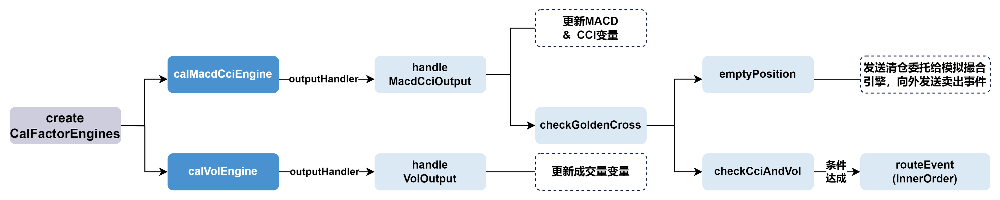

```
def createCalFactorEngines(instanceId){
    //MACD CCI计算
    calDummy = streamTable(1:0, ["snapshotTime","securityid","LastPrice","OpenPrice"
    ,"HighPrice","LowPrice"], [TIMESTAMP, STRING, DOUBLE, DOUBLE , DOUBLE , DOUBLE])
    macdFastPeriod = factorParams[`macd][`fastPeriod]
    macdSlowPeriod = factorParams[`macd][`slowPeriod]
    macdSignalPeriod = factorParams[`macd][`signalPeriod]
    cciTimePeriod = factorParams[`cci][`timePeriod]
    calMetrics = [<snapshotTime>, <ta::macd(LastPrice, macdFastPeriod, macdSlowPeriod,
    macdSignalPeriod) as `diff`dea`macdHistogram>, <ta::cci(HighPrice, LowPrice,
    LastPrice, cciTimePeriod) as `cci>]
    macdCciOutputTable = streamTable(1:0,  ["securityid", "time", "diff", "dea",
    "macdHistogram", "cci"],  [STRING, TIMESTAMP, DOUBLE, DOUBLE, DOUBLE, DOUBLE])
    share(macdCciOutputTable,"MacdAndCci"+instanceId)
    macdCciOutputTable = objByName("MacdAndCci"+instanceId)
    macdCciCalEngine = createReactiveStateEngine(name="CalMacdCciEngine"+instanceId,
    metrics=calMetrics, dummyTable=calDummy, outputTable=macdCciOutputTable,
    outputHandler=handleMacdCciOutput ,keyColumn=`securityid, keepOrder=true,
    msgAsTable=true)
    //引擎预热
    warmupTable = select TradeTime,SecurityID,LastPrice,OpenPrice,HighPrice,
    LowPrice from loadTable('dfs://testDB',`snapshot) where (second(TradeTime)
    >= second(09:30:00.000) and second(TradeTime) <= second(15:00:00.000)) and
    date(TradeTime) = 2023.02.01 order by TradeTime
    warmupStreamEngine(macdCciCalEngine, warmupTable)
    //vol计算
    volDummy = streamTable(1:0, ["securityid", "TradePrice", "vol", "transTime"],
    [STRING, DOUBLE, INT, TIMESTAMP])
    volTimePeriod = factorParams[`volume][`timePeriod]
    volMetrics = [<TradePrice>, <tmsum(transTime, vol, volTimePeriod)>, <transTime>]
    volOutputTable = streamTable(1:0, ["securityid", "TradePrice","vol", "time"],
    [STRING, DOUBLE,INT, TIMESTAMP])
    share(volOutputTable,"Vol"+instanceId)
    volOutputTable = objByName("Vol"+instanceId)
    volCalEngine = createReactiveStateEngine(name="CalVolEngine"+instanceId,
    metrics=volMetrics, dummyTable=volDummy, outputTable=volOutputTable,
    outputHandler=handleVolOutput ,keyColumn=`securityid, keepOrder=true,
    msgAsTable=true)
}
```

* 为了方便用户使用 TA - Lib 中的技术指标，DolphinDB 提供了以 DolphinScript 实现的 TA-Lib 中包含的指标函数，并封装在 DolphinDB [ta 模块](../modules/ta/ta.md) 中。 `createReactiveStateEngine` 函数通过 *metrics* 参数指定计算指标，本案例用到了 ta 模块（已经在创建监视器前声明 `use ta`）来方便地表达指标逻辑，省去了用户编写复杂计算公式的步骤。
* 以输入快照数据、计算 MACD 和 CCI 指标的响应式状态引擎为例，引擎计算的结果将交由 `handleMacdCciOutput` 函数处理。在该函数中将进行下单信号的判断，我们将在后文进行详细介绍。创建计算成交量指标的响应式状态引擎的流程类似，其计算结果交由 `handleVolOutput` 函数处理。注意，设置 *outputHandler* 参数后，引擎不再将每次的计算结果写到输出表 macdCciOutputTable，而是会不断地调用 *outputHandler* 参数指定的函数处理计算结果。

在创建计算引擎的函数中，有一段关于引擎预热的代码：

```
warmupTable = select TradeTime,SecurityID,LastPrice,OpenPrice,HighPrice,LowPrice
from loadTable('dfs://testDB',`snapshot) where (second(TradeTime) >=
second(09:30:00.000) and second(TradeTime) <= second(15:00:00.000)) and
date(TradeTime) = 2023.02.01 order by TradeTime
warmupStreamEngine(macdCciCalEngine, warmupTable)
```

* 这段代码的目的是对计算 MACD 和 CCI 指标的响应式状态引擎进行预热。`warmupStreamEngine` 会把前一天的数据写入流数据引擎并进行计算，但是不输出结果。当当日的数据正常写入此流数据引擎后，滑动窗口将包含前一日的快照数据。在本例中 MACD 指标中涉及时间最久的参数 slowPeriod = 520，即 520 个滑动窗口，若不进行预热，则会出现在开盘后近 30 分钟内指标计算结果为空的情况。

**处理响应式状态引擎计算结果**

**handleVolOutput**

```
def handleVolOutput(volResult){
    tableInsert(objByName("Vol"+instanceId), volResult)
    priceJustTraded[volResult.securityid[0]] = volResult.TradePrice[0]
    pre30vol[volResult.securityid[0]] = volResult[`vol][0]
}
```

* 把引擎的计算结果写入对应的输出表中，这与策略逻辑无关，仅供 Dashboard 可视化展示。
* 更新存储最新成交价的字典，字典的键值为股票，之后将用最新的成交价格作为委托买入或卖出的价格。
* 更新存储30秒成交量之和的字典 pre30vol，字典的键值为股票。

**handleMacdCciOutput**

函数调用流程与大致功能如下图所示。

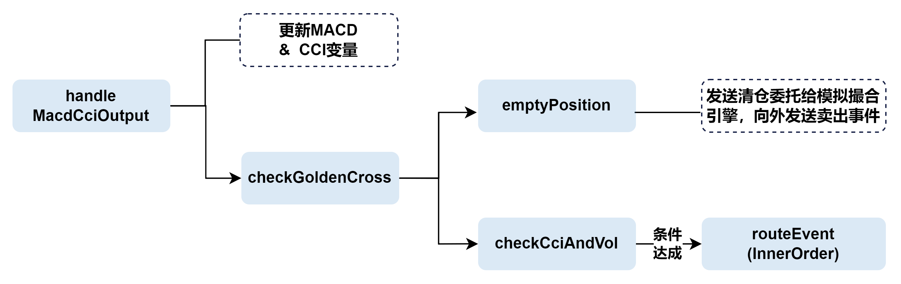

```
def handleMacdCciOutput(macdCciResult) {
    tableInsert(macdCciOutputTable, macdCciResult)
    if(second(macdCciResult.time)<09:30:00 or second(macdCciResult.time) >15:00:00 ){
      return
    }
    self.checkGoldenCross(macdCciResult.securityid[0], macdCciResult.diff[0],
    macdCciResult.dea[0])
    preDiff[macdCciResult.securityid[0]] = macdCciResult.diff[0]
    preDea[macdCciResult.securityid[0]] = macdCciResult.dea [0]
    if (pre30cci[macdCciResult.securityid[0]] == NULL) {
      pre30cci[macdCciResult.securityid[0]] = macdCciResult.cci[0]
    }
    else if(pre30cci[macdCciResult.securityid[0]] != NULL and
    newCci[macdCciResult.securityid[0]] == NULL){
      newCci[macdCciResult.securityid[0]] = macdCciResult.cci[0]
    }
    else{pre30cci[macdCciResult.securityid[0]] = newCci[macdCciResult.securityid[0]]
    newCci[macdCciResult.securityid[0]] = macdCciResult.cci[0]}
}
```

* 同理，先将计算结果插入到对应的共享表中以供 Dashboard 可视化展示。
* 调用金叉检查函数 `checkGoldenCross` 检查是否产生金叉：

  ```
  def checkGoldenCross(securityid, diff, dea) {
      if (self.preDiff[securityid] != NULL and self.preDea[securityid] != NULL) {
          if (self.preDiff[securityid] < self.preDea[securityid] and diff > dea) {
              newDiff[securityid] = diff
              checkCciAndVol(securityid)
          }
          if (self.preDiff[securityid] > self.preDea[securityid] and diff < dea){
              newDiff[securityid] = diff
              emptyPosition(securityid)
          }
      }
  }
  ```

  + 若产生死叉，调用函数 `emptyPosition` 进行清仓：函数将从持仓状态字典中获取死叉股票的现有持仓量，同时获取死叉出现时的时间戳作为委托卖单的时间。若死叉股票有持仓，则一方面构造 SellOrder 事件，通过 `emitEvent` 接口将其向外发送给事件输出队列；一方面按照模拟撮合引擎订单结构，构造相应的委托卖单订单消息，通过对应的插件接口发送给模拟撮合引擎。发出委托消息后，记录卖出信号供 Dashboard 展示使用，并更新死叉股票的持仓数量为0、将卖出的金额加入到可用现金中。

    ```
    def emptyPosition(securityid){
        availableQty = availablePos[securityid]
        sellTime = timestamp
        if (availableQty > 0){
            sellPrice = priceJustTraded[securityid]
            direction = 2
            orderType = 5
            orderID = long(orderCount)
            sellAmount = sellPrice * availableQty
            sellOrder = SellOrder(securityid, sellTime, orderType, sellPrice, availableQty, direction, orderID)
            emitEvent(sellOrder)
            t = objByName("signalTb"+instanceId)
            insert into t values (securityid, direction, sellTime, sellPrice, newDiff[securityid])
            msgBody = (securityid, sellTime, orderType, sellPrice, availableQty, direction, orderID)
            MatchingEngineSimulator::insertMsg(getStreamEngine("MatchingEngine"+instanceId), msgBody, 2)
            orderCount = orderCount + 1
            availablePos[securityid] = 0
            availableCash += sellAmount
            cashTb.tableInsert(sellTime,sellAmount,availableCash)
        }
    }
    ```
  + 若产生金叉，则调用函数 `checkCciAndVol`，进一步检查 CCI 和成交量条件是否达成。函数将判断 CCI 指标在最近30秒内是否发生了上穿的情况：

    - 若 CCI 上穿 -100 的阈值，则构造内部订单事件（InnerOrder），并通过 `routeEvent` 将该事件插入到当前 CEP 子引擎的事件队列的队首；
    - 若 CCI 上穿 100 的阈值，并且过去 30 秒的成交量之和大于 50000，则同样将内部订单事件插入到当前 CEP 子引擎的事件队列的队首。

      ```
      def checkCciAndVol(securityid){
          if(pre30cci[securityid] < strategyParams[`cci][`lowerBoundary] and
          newCci[securityid] > strategyParams[`cci][`lowerBoundary]){
              innerOrderTime = timestamp
              innerOrder = InnerOrder(securityid, innerOrderTime,
              priceJustTraded[securityid], strategyParams[`order][`orderQty],
              instanceId)
              routeEvent(innerOrder)
          }
          else if(pre30cci[securityid] < strategyParams[`cci][`upperBoundary] and
           newCci[securityid] > strategyParams[`cci][`upperBoundary] and
           pre30vol[securityid] > strategyParams[`volume][`triggerAmount]){
              innerOrderTime = timestamp
              innerOrder = InnerOrder(securityid, innerOrderTime,
              priceJustTraded[securityid], strategyParams[`order][`orderQty],
              instanceId)
              routeEvent(innerOrder)
          }
      }
      ```
  + 在金叉死叉判断结束后，更新对应的 MACD、CCI 指标字典，作为下一次信号判断的依据，字典的键值均为股票。

**监听内部订单事件**

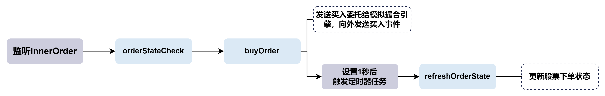

在通过 `initiatingStrategy` 函数初始化策略时，已经设置了一个事件监听器对内部订单事件进行监听。当该事件被插入到当前 CEP 子引擎的事件处理队列的队首，将被该监听器捕获，触发对应方法 `orderStateCheck` 进行下单状态检查。

```
def orderStateCheck(innerOrder){
    if(orderState[innerOrder.securityid] == 1){return}
    else {buyOrder(innerOrder)}
}
```

* 状态检查函数将检查下单状态字典，若状态为 "1" 表示“1s内刚下过单”，则不允许下单，反之允许下单。若允许下单，则调用下单函数 `buyOrder`：

  ```
  def buyOrder(innerOrder){
      orderPrice = innerOrder.priceJustTraded
      orderQty = innerOrder.quantity
      buyAmount = orderPrice * orderQty
      if (availableCash > buyAmount){
          orderSecurity = innerOrder.securityid
          orderTime = innerOrder.timestamp
          direction = 1
          orderType = 5
          orderCount = orderCount + 1
          orderID = long(orderCount)
          buyOrder = BuyOrder(orderSecurity, orderTime, orderType, orderPrice,
          orderQty, direction, orderID)
          emitEvent(buyOrder)
          msgBody = (orderSecurity, orderTime, orderType, orderPrice, orderQty,
          direction, orderID)
          t = objByName("signalTb"+instanceId)
          insert into t values (orderSecurity, direction, orderTime, orderPrice,
          newDiff[orderSecurity])
          MatchingEngineSimulator::insertMsg(
          getStreamEngine("MatchingEngine"+instanceId), msgBody, 2)
          //下单后把下单状态改为1，设置一个定时器1秒后更新下单状态
          orderState[orderSecurity] = 1
          addEventListener(handler=refreshOrderState{orderSecurity}, times=1, wait=1s)
          availableCash -= buyAmount
          cashTb.tableInsert(orderTime, -buyAmount, availableCash)
      }
  }
  ```

  + 首先判断是否有足够的可用现金，随后构造了委托订单消息传递给模拟撮合引擎，并将下单状态修改为 "1"。在可用现金中扣去下单所需的金额。
  + 将买入信号写入表中供 Dashboard 展示使用，构造了 BuyOrder 事件并发送到事件输出队列。
  + 更新持仓状态字典值，并通过 `addEventListener` 设置了一个定时器，令 times=1 且 wait=1s ，即1秒后执行1次回调函数 `refreshOrderState`，刷新对应股票的下单状态。这是为了避免出现交易中信号被反复触发，短时间内大量下单的情况。

    ```
    def refreshOrderState(orderSecurity){orderState[orderSecurity] = 0}
    ```

### 3.3 创建 CEP 引擎

```
def createCEP(){
    cepDummy = table(array(TIMESTAMP,0) as time, array(STRING, 0) as eventType,
    array(BLOB, 0) as blobs)
    //在emitOutput表中可以查看cep内部被emitEvent发出来的事件
    share(streamTable(array(STRING, 0) as eventType, array(BLOB, 0) as eventBody),
     "emitOutput")
    emitOutput = objByName("emitOutput")
    outputSerializer = streamEventSerializer(name=`serOutput, eventSchema=
    [BuyOrder, SellOrder], outputTable=emitOutput)
    engine = createCEPEngine(name='macdCciVol', monitors=<Monitor()>, dummyTable=
    cepDummy, eventSchema=[Snapshot, Transaction,Initiating],
    eventQueueDepth=10000000, outputTable=outputSerializer, useSystemTime=false,
    timeColumn=`time)
}
```

* 定义 CEP 引擎的输入表 cepDummy，使其格式和数据回放的结果表 replayOutput 保持一致。数据回放将在下一小节介绍。
* 创建并共享流数据表 emitOutput 作为序列化的结果表。如果在引擎内部调用了 `emitEvent` 接口，则创建引擎时需要指定 *outputTable* 参数为 `StreamEventSerializer` 返回的表对象。因为每个事件类的属性并不相同，需要通过`StreamEventSerializer`将引擎输出的事件序列化为 BLOB 格式，才能写入到同一个异构流数据表 emitOutput 中。
* 创建 CEP 引擎，指定监视器、输入表、以何种 schema 识别进入引擎的序列化数据等参数。注意，此处指定在引擎内部不使用系统时间，而是使用事件时间（`useSystemTime=false, timeColumn=`time`）。这将主要影响引擎内部的事件监听器的时间判断。

### 3.4 启动策略实例

在 CEP 引擎被创建后，引擎随即开始监听策略启动事件。在行情和逐笔数据开始回放前，需要通过向 CEP 引擎输入 `Initiating` 事件正式启动一个策略实例。

```
//创建一个表用来记录策略参数
share(table(100:0,["instanceId", "CCIThreshold","CCITimePeriod","VolumeThreshold",
"VolumeTimePeriod"],[STRING, STRING, INT, INT, INT]),"gridParamInfo")
macdPeriodParams = [240, 520, 180]
cciUpperBoundarie = [100]
cciLowerBoundarie = -cciUpperBoundarie
triggerAmount = [50000]
cciTimePeriod = [10]
volumeTimePeriod = [30 * 1000]
cashAmount_ = 300000
stockPool_ = ['111111','222222']
holdingQty_ = take([100,200,300],count(stockPool_))
time_ = 2023.01.30 09:30:00.000
CEPEngine = getStreamEngine("macdCciVol")
instanceId = 1

factorParams_ = dict(`macd`cci`volume,
                [
                dict(`fastPeriod`slowPeriod`signalPeriod, macdPeriodParams),
                dict(`timePeriod, cciTimePeriod),
                dict(`timePeriod, volumeTimePeriod)
                ]
            )
strategyParams_ = dict(`cci`volume`order,
                [
                dict(`upperBoundary`lowerBoundary, [cciUpperBoundarie, cciLowerBoundarie]),
                dict(`triggerAmount, triggerAmount),
                dict(`orderQty, [500])
                ]
            )

tmp = objByName("gridParamInfo")
insert into tmp(instanceId,CCIThreshold,CCITimePeriod,VolumeThreshold,
VolumeTimePeriod) values (instanceId, (cciUpperBoundarie.string() +","
+cciLowerBoundarie.string()), cciTimePeriod, triggerAmount, volumeTimePeriod)
initEvent = Initiating(instanceId, factorParams_, strategyParams_, time_,
cashAmount_,holdingQty_,stockPool_)
appendEvent(CEPEngine, initEvent)
```

* 创建并共享了一个策略参数表，用来记录所使用的策略参数
* 设置了策略的参数，包括指标计算、策略信号触发、初始持仓数量和股票池等参数
* 实例化一个策略启动事件，并通过 `appendEvent` 将该事件直接写入 CEP 引擎以正式启动策略。注意，策略启动事件不仅需要在回放开始前写入引擎，并且由于 CEP 引擎设置了使用事件时间，策略启动事件的时间属性值也需要比行情数据的时间早。

### 3.5 回放历史数据

在本例中，我们使用数据回放 `replay` 功能来模拟真实交易数据按时间顺序发生的情况。

```
def createReplayOutputTb(){
    share(streamTable(100:0,`timestamp`eventType`blob, [TIMESTAMP, STRING, BLOB])
    ,"replayOutput")
    subscribeTable(tableName="replayOutput", actionName="replayOutput",
    handler=getStreamEngine(`macdCciVol),msgAsTable=true)
}
createReplayOutputTb()
```

* 首先创建并共享回放功能的输出表 replayOutput，该表将作为 CEP 引擎的输入数据来源表。
* 订阅 replayOutput 表，将其 handler 设置为 CEP 引擎，即每批数据写入该表时就会写入 CEP 引擎。

```
def fromReplayToCEP(stockPool_){
    snapshotData = select string(Market) as Market, TradeTime as snapshotTime,
    string(SecurityID) as securityid, LastPrice, OpenPrice, HighPrice, LowPrice,
    UpLimitPx, DownLimitPx, long(TotalBidQty) as TotalBidQty,
    long(TotalOfferQty) as TotalOfferQty, BidPrice, BidOrderQty, OfferPrice,
    OfferOrderQty from loadTable("dfs://testDB","snapshot") where
    (second(TradeTime) >= second(09:30:00.000) and
    second(TradeTime) <= second(15:00:00.000)) and date(TradeTime) = 2023.02.02
    and (SecurityID in stockPool_) order by TradeTime
    transData = select SecurityID as securityid, TradePrice, TradeQty as volume,
    TradeTime as transTime from loadTable("dfs://testDB","trade")
    where (second(TradeTime) >= second(09:30:00.000) and
    second(TradeTime) <= second(15:00:00.000)) and
    date(TradeTime) = 2023.02.02 and (SecurityID in stockPool_) order by TradeTime
    input_dict=dict(["Snapshot", "Transaction"], [snapshotData, transData])
    time_dict=dict(["Snapshot", "Transaction"],[`snapshotTime, `transTime])
    submitJob("replayToCEP", "replayToCEP", replay, input_dict,
    objByName(`replayOutput), , time_dict,)
}
fromReplayToCEP(stockPool_)
```

* 从数据库中选出需要的行情快照数据和逐笔成交数据，然后通过分别指定行情数据和成交数据的时间列组成时间字典 time\_dict，作为 `replay` 的参数 timeColumn 来实现排序。
* 通过调整 `replay` 的 *replayRate* 参数可以设定回放的快慢。本例未指定 *replayRate* 参数，表示进行全速回放。

## 4. 结果检视

本小节通过可视化指标和信号、查看输出事件、查看模拟撮合结果等方式展示策略运行的结果。

### 4.1 指标与信号可视化

DolphinDB Web 端提供了强大的数据可视化和分析工具——数据面板（Dashboard），旨在帮助用户更好地理解和利用数据。在本例中，响应式状态引擎计算完成后和产生买卖信号时都将对应的数据写入了共享流数据表，如此在 Dashboard 中便可以选取需要的数据进行可视化。

更为详细的数据面板使用教程见[官方文档](dashboard_tutorial.md)，本案例的可视化结果如下（仅选取了一只股票进行展示）。在文末附录中将提供本案例中 Dashboard 的配置文件，导入配置文件即可复现本案例中的图表。

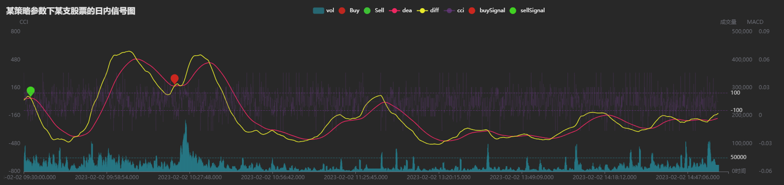

* 在上图中：
  + 黄色与红色线分别为 MACD 指标的 DIFF 和 DEA 线。
  + 紫色的线为 CCI 指标。
  + 蓝绿色柱状图为成交量数据。
  + 红色与绿色的标点为买入和卖出信号产生的位置。
  + 水平的三条虚线从上而下分别为 CCI 指标 +100 与 -100 的阈值和 50000 股成交量的阈值。
* 在数据回放的同时，Dashboard 将实时展示进度，同时在图中可以方便地检验买卖信号是否正确产生。

### 4.2 输出事件

在创建 CEP 引擎时指定了引擎的输出表为事件流序列化器（Stream Event Serializer），序列化器的输出表为异构流数据表 emitOutput。在数据回放后，随着 CEP 引擎不断地处理和向外部发送数据，emitOutput 表的行数也会不断增加。表中 eventType 为事件类型，eventBody 为事件实例序列化后的结果。

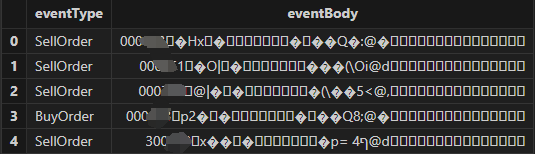

在实盘中，可以通过 C++、Java、Python 等客户端程序订阅 emitOutput 表，接收到下单事件后向交易柜台发送委托单。 C++ API 订阅事件流的方法见 [事件处理](https://docs.dolphindb.cn/zh/cppdoc/event_handling.md) 。

### 4.3 模拟撮合结果

在创建模拟撮合引擎时指定了模拟撮合的输出表为 MatchingResult，撮合完成后查看该表结果如下。

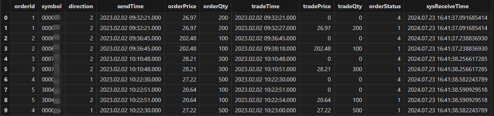

* 可以从撮合结果表中看到每一只股票的撮合方向（direction）、发送订单的时间（sendTime）、成交时间（tradeTime）和撮合的量价等信息。
* 在 orderStatus 一栏中可以看到订单的撮合结果。"4" 为“已报”，"1" 为“订单完全成交”。

## 5. 策略参数寻优

在上文中的案例中，我们介绍了如何使用 CEP 引擎运行一个多指标的策略并且进行模拟撮合。虽然我们已经可以计算出该案例策略的收益率，但该收益率很可能并不是策略的最佳表现。在真实的投研场景下，一个策略往往需要经过大量的回测来确定最适合某种市场情况的最优参数。那么，在上面的代码中作出哪些修改和调整，可以实现参数寻优的功能呢？

已知目前策略参数都由 `Initiating` 事件的监听传入，因此如果需要传入多组参数，就需要有多个策略启动事件来传递参数。同时，一个监视器又代表着一个正在运行的策略实例。如果依次向 CEP 引擎输入多个策略启动事件，以目前的代码结构，后一个策略启动事件的参数将总是覆盖前一个事件的参数，无法同时进行计算。

针对这种情况，DolphinDB 的 CEP 引擎中提供了一种方法来动态地生成多个结构相同的监视器实例，使不同参数的策略可以运行在不同的监视器中。

### 5.1 spawnMonitor 创建监视器的原理

在监视器中，可以通过 `spawnMonitor(handler,args..)` 函数方便地生成一个子监视器（subMonitor）。该函数将从原监视器中深拷贝所有的成员属性和成员方法，但不会拷贝原监视器中的事件监听器。并且，在子监视器实例化后，立刻执行对应的 handler，初始化该子监视器。

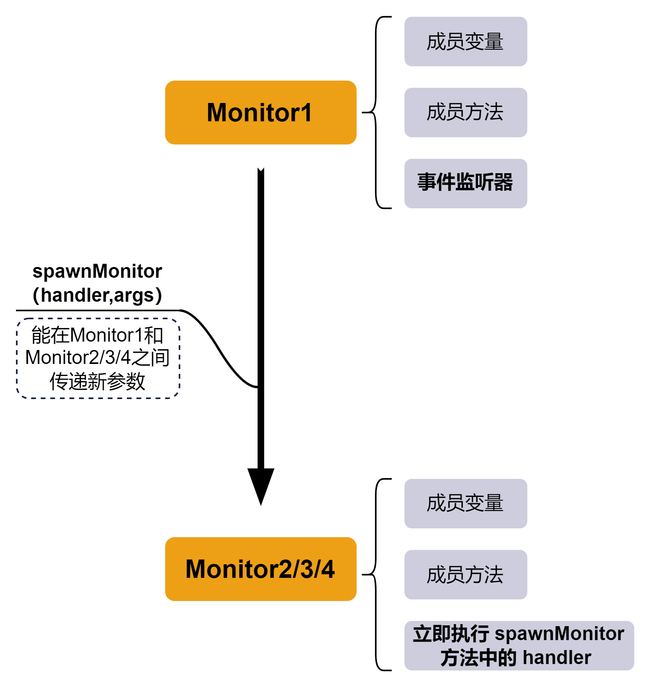

### 5.2 动态生成多个策略实例的代码实现

在了解了通过 `spawnMonitor` 生成监视器实例的原理后，我们可以对原来的代码作简单调整来实现动态生成多个策略实例，进而实现参数寻优。在原来的代码中，监听到策略启动事件后将进行对其他事件的监听、创建必要的引擎和表等操作。而为了同时运行多组参数策略，在监听到策略启动事件后，应立刻复制一个对应的子监视器来运行该参数下的策略实例。因此原代码中的 `initiatingStrategy` 函数中的内容，将作为 `spawnMonitor` 函数的 handler 参数。

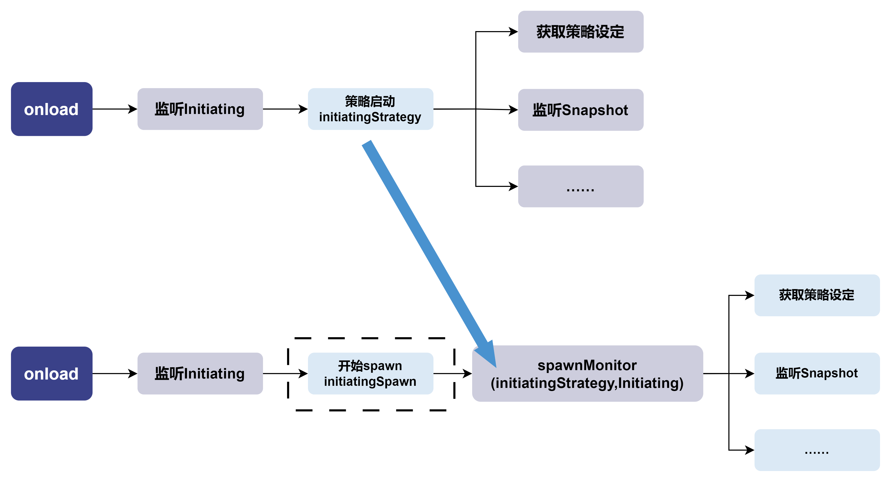

```
def initiatingSpawn(Initiating) {
    spawnMonitor(initiatingStrategy, Initiating)
}
def onload() {
    addEventListener(handler=initiatingSpawn, eventType="Initiating", times="all")
}
```

经过这样的调整，每次向引擎输入策略启动事件 `Initiating` 时，引擎将会通过 `spawnMonitor` 函数生成一个新的监视器实例。并且，通过立即以策略启动事件 `Initiating` 为入参调用 `initiatingStrategy` 函数，完成对该监视器实例的初始化。

**向引擎输入多个参数不同的策略启动事件**

1. 首先，增加希望测试的参数组合。

   ```
   cciUpperBoundaries = [50, 100,150]
   cciLowerBoundaries = -cciUpperBoundaries
   triggerAmounts = [50000, 150000]
   cciTimePeriods = [10,20]
   volumeTimePeriods = [30 * 1000, 60* 1000]
   ```
2. 其次，以遍历的方式将这些参数组合成参数字典，并构造对应的策略启动事件输入引擎。同时，把每一个参数组合都记录在 gridParamInfo 表中。下面代码中通过循环一共构造了 3*3*2*2*2=72 个策略启动事件，即72组不同的策略参数。

   ```
   for(cciTimePeriod in cciTimePeriods){
       for(volumeTimePeriod in volumeTimePeriods){
           // 因子计算参数
           factorParams_ = dict(`macd`cci`volume,
               [
               dict(`fastPeriod`slowPeriod`signalPeriod, [240, 520, 180]),
               dict(`timePeriod, [cciTimePeriod]),
               dict(`timePeriod, [volumeTimePeriod])
               ]
           )
           for(upperBoundary in cciUpperBoundaries){
               for(lowerBoundary in cciLowerBoundaries){
                   for(triggerAmount in triggerAmounts){
                       // 策略参数
                       strategyParams_ = dict(`cci`volume`order,
                                       [
                                       dict(`upperBoundary`lowerBoundary,
   [upperBoundary, lowerBoundary]),
                                       dict(`triggerAmount, [triggerAmount]),
                                       dict(`orderAmount, [500])
                                       ]
                       )
                       // 生成并添加事件实例
                       instanceId = string(instanceId)
                       tmp = objByName("gridParamInfo")
                       insert into tmp(instanceId,CCIThreshold,CCITimePeriod,
   VolumeThreshold,VolumeTimePeriod) values (instanceId, (upperBoundary.string()
   +","+lowerBoundary.string()), cciTimePeriod, triggerAmount, volumeTimePeriod)
                       initEvent = Initiating(instanceId, factorParams_,
   strategyParams_, time_, cashAmount_,holdingQty_,stockPool_)
                       appendEvent(CEPEngine, initEvent)
                       instanceId = int(instanceId)
                       instanceId += 1
                   }
               }
           }
       }
   }
   ```
3. 注意区分和标注事件“出处”。当同一个 CEP 子引擎（线程）上有多个监视器时，不同的监视器之间可以相互“沟通”，即监听和捕获其他监视器中产生的事件。因此，除非是类似于行情数据事件这样必须被每个监视器完整捕获的事件，都需要在构造和设置监听时设置独特的属性值条件以避免混淆。此外，在对各个共享表和引擎命名时，也需要注意进行区分。在本案例中使用了 instanceId 用来区分不同参数的策略实例。

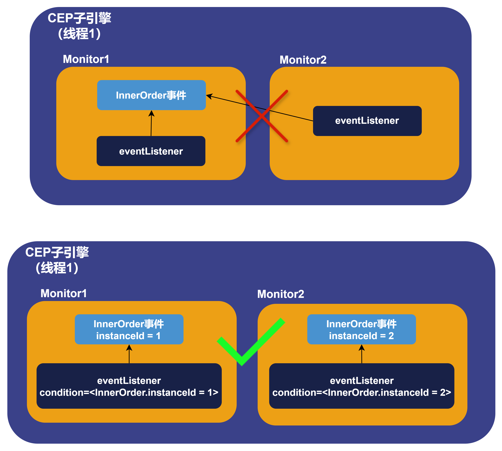

在遍历所有的参数组合构造策略启动事件输入引擎后，查看 web 界面可以发现接收事件数等于向 CEP 引擎输入的策略启动事件数量。监视器的数量为73个，来自初始的1个监视器加上 `spawnMonitor` 方法产生的 72 个子监视器。

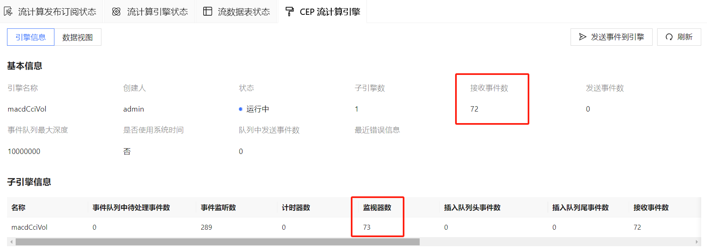

**计算策略收益率**

在计算完成后，我们需要统计各个参数组合下的策略实例收益率来挑选出最佳参数。收益率的计算逻辑为：（日末现金+日末持仓价值）/（初始现金+初始持仓股票价值）。为了确保日末的持仓和可用现金的金额准确，需要遍历所有的模拟撮合结果表，查询其中成交情况。同时，也要检查是否有不完全成交或者挂单未成交的情况。例如，若有买入失败的情况，则要将对应金额的现金加回至可用现金。同理，买卖情况都需要根据具体的撮合结果对金额、股数进行调整。收益率计算不是本文的重点，具体的计算损益函数见附件的策略代码。

## 6. 利用并行计算加速回测

在上文的代码实现中，无论是 1 个还是 73 个监视器的策略回测过程，都是运行在同一个 CEP 子引擎（线程）上。下图分别是不使用 `spawnMonitor` 仅回测一组参数、使用 `spawnMonitor` 回测多组参数的策略实例示意图。

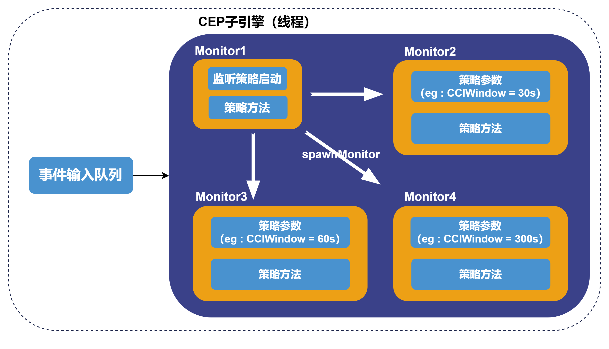

### 6.1 设置 *dispatchKey* 参数创建子引擎（线程）

在真实的投研环境中，我们还可以通过并行计算来加速策略回测的过程。CEP 引擎在创建时提供可选参数 *dispatchKey* 来指定事件中的成员属性作为分配线程的依据。引擎将根据该属性中的每个唯一值来创建一个子引擎（线程），各个子引擎之间相互独立且并行地处理数据。若不指定 dispatchKey 参数，则 CEP 引擎只有一个（与 CEP 引擎同名的）子引擎，即只有一个处理线程。此外，还可以辅以 dispatchBucket 参数，实现对 *dispatchKey* 指定的字段进行哈希分组，本案例未使用 dispatchBucket 参数。

在本案例中，可以通过策略启动事件中的成员属性 instanceId 来区分不同的策略参数组。因此，可以在创建 CEP 引擎时增加 dispatchKey 参数设置，代码和策略实例示意图如下所示。事件分发器根据 instanceId 将不同的策略启动事件发送到了不同的子引擎中。而逐笔成交事件和快照事件的属性值中不包含 instanceId，因此将会被发送到每一个的子引擎中。

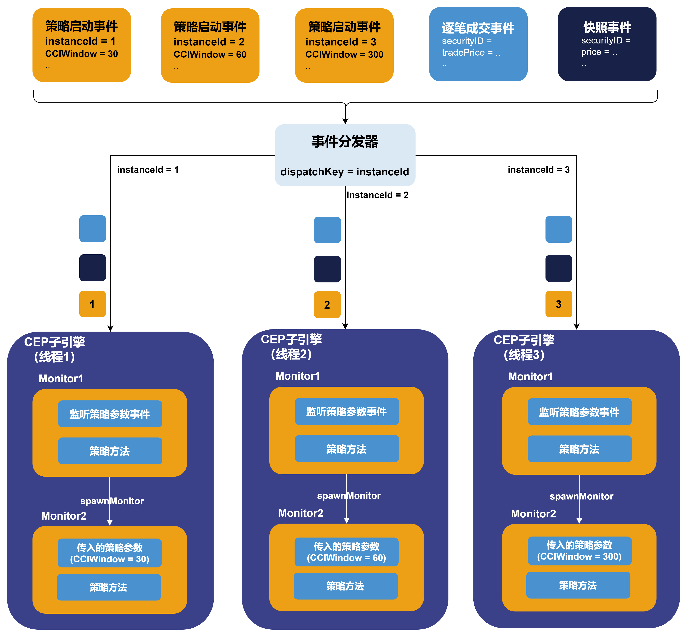

```
engine = createCEPEngine(name='macdCciVol', monitors=<Monitor()>, dummyTable=cepDummy,
eventSchema=[Snapshot, Transaction,Initiating], eventQueueDepth=10000000,
outputTable=outputSerializer, useSystemTime=false, timeColumn=`time,
dispatchKey=`instanceId)
```

开启并行后，再向 CEP 引擎输入 72 个策略启动事件，在 web 端可以观察到已经自动创建了72个子引擎，并且每个子引擎中都根据策略参数又生成了一个监视器实例来运行策略。

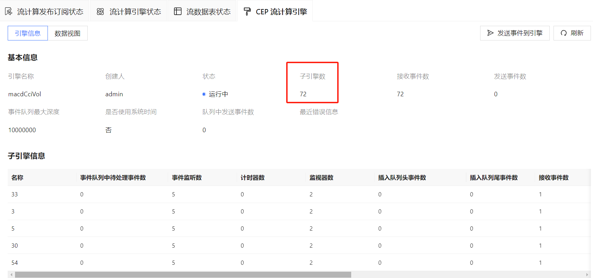

最后可视化的结果如下所示。（具体情况会根据策略参数、股票池选择而不同）

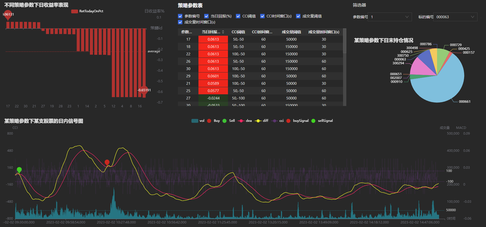

### 6.2 性能测试

测试数据量：50支股票1天的快照和成交数据，共1522416行。

测试方法：通过多组不同的策略参数启动多个策略实例，通过是否开启 *dispatchKey* 参数控制是否并行计算。统计一批策略实例全部完成回测的总耗时。单策略平均耗时=总耗时/策略实例数量。

测试环境：单节点部署 DolphinDB server。license 授权内存上限 256G，核数上限 64 核。worknum 设置为 64，具体配置文件见附录。测试使用的服务器配置如下。

表 6-1 测试服务器配置

| **配置项** | **信息** |
| --- | --- |
| OS（操作系统） | CentOS Linux 7 (Core) |
| 内核 | 3.10.0-1160.el7.x86\_64 |
| CPU | Intel(R) Xeon(R) Gold 5220R CPU @ 2.20GHz 96 逻辑 CPU 核心 |
| 内存 | 16\*32GB RDUNN, 3200MT/s 总共512GB |

测试结果如下：

* 在不启用并行计算（即并行度为1）时，随着策略实例数量的增加，单策略平均耗时仍然能够保持稳定，总耗时呈线性增加。
* 在启用并行计算时，随着并行度的增加，单策略平均耗时逐渐降低，系统吞吐量逐渐提高。
* 在相同策略实例数量下，并行计算显著降低了回测总耗时。例如，比较策略实例数为 40 的两个测试用例，并行计算提速了约 11.7 倍。

表 6-2 CEP 引擎性能测试结果

| **策略实例数量** | **并行度（子引擎数）** | **单策略平均耗时（秒）** | **总耗时（秒）** | **提速（倍，并行度为 1 时的总耗时/总耗时）** |
| --- | --- | --- | --- | --- |
| 1 | 1 | 45.0 | 45 | - |
| 10 | 1 | 39.0 | 390 | - |
| 20 | 1 | 37.5 | 780 | - |
| 30 | 1 | 41.2 | 1237 | - |
| 40 | 1 | 40.2 | 1608 | - |
| 10 | 10 | 6.9 | 69 | 5.7 |
| 20 | 20 | 4.2 | 84 | 8.9 |
| 30 | 30 | 3.6 | 108 | 11.5 |
| 40 | 40 | 3.4 | 137 | 11.7 |

## 7. 总结

本文通过循序渐进的方式，首先介绍了如何使用 CEP 引擎实现一个多指标高频股票策略的回测，其次介绍了通过 `spawnMonitor` 实现在一个子引擎中回测多组参数的方法，最后利用 *dispatchKey* 参数的设置实现了并行计算以加速参数寻优。此外，还展示了如何将 CEP 引擎与 DolphinDB 中其他的重要插件与功能联动使用，如模拟撮合引擎插件、数据回放功能、 ta 模块和数据面板（Dashboard）等。

## 8. 附录

**测试数据**

* [快照数据（5只股票3个交易日）](data/cta_strategy_implementation_and_backtesting/CEPExampleData_Snapshot.csv)
* [逐笔成交数据（5只股票2个交易日）](data/cta_strategy_implementation_and_backtesting/CEPExampleData_Transaction.csv)

**测试数据导入脚本**：

* [导入脚本](script/cta_strategy_implementation_and_backtesting/ImportDataToDB.dos)

**策略实现脚本**：

* [策略脚本](script/cta_strategy_implementation_and_backtesting/CTAStrategy.dos)

**数据面板（Dashboard）配置文件**：

* [Dashboard 配置](script/cta_strategy_implementation_and_backtesting/dashboard_CTA.json)

**server 配置文件**：

* [server 配置](script/cta_strategy_implementation_and_backtesting/dolphindb.cfg)

