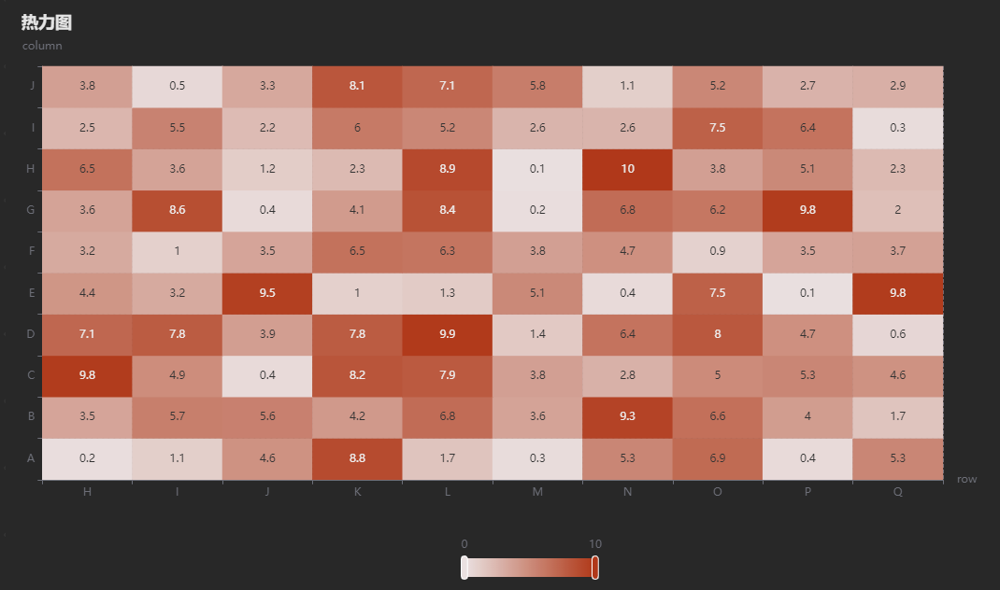

# 数据面板

数据面板（亦称为 Dashboard）是一个强大的数据可视化和分析工具，旨在帮助用户更好地理解和利用数据。

数据面板在数据分析和资源监控领域具有广泛的应用场景，因为它提供了许多强大功能和优势，包括：

* 直观的数据可视化：通过各种图表，可以帮助用户将数据转化为可理解的信息，从而能够更深入地了解业务或监控资源。
* 灵活性和可定制性：提供了多种图表，旨在满足各种行业和用例的需求。用户可以自定义布局、颜色、数据源等，以满足用户的特定需求。
* 数据互动性：支持用户与数据进行互动，包括筛选、搜索等功能，以便能够深入挖掘信息。
* 实时数据更新：用户可以通过配置，实现从多个数据源获取实时数据，确保始终处于最新的信息状态。
* 安全性和权限管理：提供强大的数据安全性和权限管理功能，以确保只有授权用户可以访问敏感信息。

下文将介绍如何创建面板、创建图表、设置数据源、设计可视化、分享面板。无论您是新手还是有相关产品使用经验的用户，本文都将帮助您快速上手以上功能。

## 基本概念

为便于用户理解，这里列举本文中用到的一些名词概念：

* **数据面板**：主要的工作区，用于组织和显示多个图表。
* **图表**：数据的展示形式。
* **数据源**：对 DolphinDB 中数据的 SQL 查询或对流数据表的订阅。
* **变量**：用于动态控制仪表板中的查询元素，帮助用户在运行时更改数据源的特定参数，以便更灵活地分析和呈现数据。

## 权限管理

数据面板的数据来自 DolphinDB ，管理员可在 DolphinDB
设置用户权限，用户只能对自己有权访问的库表或流数据表进行图表展示。有关具体权限规则，参考：[用户权限管理](ACL_and_Security.html)。

## 安装部署

### 部署

数据面板仅支持 2.00 系列版本，暂不支持 1.30 系列版本。仅支持浏览器语言为中文时使用。

数据面板做 2.00.11 开始内置的 Web 组件，用户在升级到此版本后无需额外部署。

如果 2.00.11 之前版本的用户希望使用此功能，请下载最新版本的安装包，用其中的 server/web/ 目录替换原有的 web。如果 DolphinDB
server 是以集群模式部署，需要将每个节点对应的 web 全部替换。其中 web 目录支持热替换，用户无需重启集群。

用户可通过在浏览器中访问 `<ip>:<port>` 进入 web 界面。这里的 ip 和 port
须指定为数据节点或计算节点。

数据面板 位于功能面板中，点击即可进入数据面板页面。

图 1. 数据面板


### 初始化

首次使用时，需要管理员 admin 在数据节点进行初始化。不能由其他用户或在其他节点执行。

1. 以 admin 身份登录 web 界面后，点击左侧边栏的“数据面板”功能，点击界面中的“初始化”按键。
2. 对于 2.00.11 及之后版本，需在节点的配置文件中增加以下配置，然后重启集群，即完成初始化。

   * 如果是单节点模式部署，配置文件为 dolphindb.cfg
   * 如果是集群模式部署，配置文件为 controller.cfg
   * 如果是高可用集群模式部署，需要修改所有控制节点对应的 controller.cfg

   ```
   thirdPartyCreateUserCallback=dashboard_grant_functionviews
   thirdPartyDeleteUserCallback=dashboard_delete_user
   ```
3. 对于 2.00.11 之前的版本，无需其他初始化步骤。但必须注意：**2.00.11
   之前的版本，初始化后创建用户时，需要管理员手动调用以下命令，才可为新创建的用户赋权使用 Dashboard。如果将来 server
   升级为
   2.00.11及之后版本，需要执行一次步骤2。**

   ```
   dashboard_grant_functionviews(<newUserName>, NULL, false)
   ```

## 基本操作

### 创建面板


在数据面板界面点击 “新建” ，输入要创建的面板名称，点击确定，可以创建一个空面板。

导出和导入功能：可以对已有面板的进行备份和迁移。导入和导出通过 json 格式文件实现。导入时，请确保 json 文件内容符合 数据面板配置要求。

分享功能：可通过链接的方式将面板分享给其他用户。选中面板后点击批量分享，即可获得模板对应的链接。将链接分享给集群中的其他用户，其他用户访问链接后需要先登录自己账号，然后即可进入预览模式，不可编辑。

### 编辑面板


1. 面板切换：在本节点的不同数据面板间切换。
2. 回到主界面：返回数据面板主界面。
3. 新增：创建一个空面板。
4. 保存：保存当前面板。
5. 导出：将本面板的相关配置信息以 json 文件的格式保存。
6. 创建副本：创建一个当前面板的副本。
7. 导入：将包含面板配置信息的 json文件 导入从而实现面板导入。
8. 修改名称：更改当前面板的名称。
9. 分享：将当前面板通过链接的形式分享给其他用户。分享前应确保最新改动已经保存。
10. 删除：删除当前面板。
11. 模式切换：切换编辑模式和预览模式。
12. 变量：由当前用户的变量，以供数据源和图表展示使用。
13. 数据源：设置当前用户的数据源，以供图表展示使用。
14. 图表列表：可供用户选用的所有图表。
15. 面板工作区：用户可在此编排图表。
16. 图表配置区：选中面板工作区的某一图表后才会显示，用于配置当前图表的信息。

### 编辑变量


**新建**：为当前数据面板新增变量。

**重命名**：指为当前变量重命名，变量名显示在左侧。

**删除**：删除当前变量。

**复制**：复制当前变量，可在不同数据面板的配置变量界面，通过 ctrl+v 粘贴。

**显示名称**：指当前变量在图表中显示的名称，如变量symbol，在图表中显示为债券名称。

**变量类型**：有单选、多选、自由文本、日期四种类型。其中单选和多选需要新增可选项，新增界面会在类型是为单选或多选时显示。

**变量值**：显示当前的变量值。如果是首次新增，应为变量设置一个初始值。如果是单选变量，在变量值选定为某一可选项后，无法在可选项列表中删除该项。如要删除，需要先修改变量值的选择。


当变量类型为单选或多选时，可以通过 SQL 导入的方式生成可选值。SQL
必须返回一个包含两列的表，第一列作为标签，第二列作为值。

### 编辑数据源

数据源可以选择 “表格” 和 “矩阵“ 两种数据类型。其中矩阵仅可作为热力图的数据源，可通过 DolphinDB SQL
编辑数据源；而”表格“可以选择“DolphinDB SQL”或“流数据” 两种方式编辑。


**新建**：为当前数据面板新增数据源。

**重命名**：为当前数据源重命名，数据源名称显示在左侧。

**删除**：删除当前数据源。

**复制**：复制当前数据源，可在不同数据面板的配置数据源界面，通过 ctrl+v 粘贴。

**DolphinDB SQL**，在代码区编辑需要查询的内容：

* 如需通过变量灵活配置，可以点击插入变量实现；
* 自动刷新可以及时获取最新信息；
* 最大行数将展示结果的前n条数据，若不设置最大行数，则默认展示所有数据。

**流数据**，左侧会显示当前节点所有流数据表，用户也可以手动过滤检索，选择需要展示数据的流数据表：

* 点选某个流表时，右侧会展示列名预览。
* 下方“IP 端口”展示当前连接的节点。
* 过滤分为列过滤和表达式过滤。列过滤需要在 DolphinDB 客户端配合函数
  `setStreamTableFilterColumn`
  指定过滤列；表达式过滤直接设置条件表达式，不符合条件的数据将被过滤掉，例如 `colName==3`
* 最大行数将展示结果的前n条数据，若不设置最大行数，则默认展示所有数据。

### 选择图表

数据面板提供了柱状图、折线图、饼图、表格、K线、混合图、订单图、富文本、描述表、编辑器、仪表盘、雷达图、变量、散点图、热力图等 15
个图供用户选择，其中柱状图、折线图、多源图、散点图、混合图支持进行阈值设置。可以通过”阈值类型“选项将阈值设置为百分比或绝对值两种类型，其中百分比是指相对于该轴当前的最大值。展示类型包括以下三种选项：

* 不展示：隐藏阈值。
* 区域填充：将当前阈值到大于此阈值的最小阈值之间的区域填充为其对应的颜色。例如，设置阈值 20% 为绿色，阈值 80% 为红色，则
  20%-80%之间填充为绿色，80%以上填充为红色。
* 线条：通过一条线来标识区域的下边界。线条的类型、线宽和颜色允许多种选择。例如，设置阈值 20% 为绿色，阈值 80% 为红色，则 20%
  处有一条绿色线，80% 处有一条红色线。

各图表的效果展示图详见附录。

使用时，在左侧图标列表选择要设置的图表，鼠标左键点击将其拖拽至工作区空白处；再点击“点击填充数据源”，选择一个数据源。

点击选中此图表，可按需调整其位置和大小。

图表右上角的复制按键，即可复制当前图表到剪贴板；在当前或其他数据面板通过 ctrl+v 实现粘贴。

注：

* 如果目标数据面板上没有足够的空间展示，会导致图表之间重叠，需手动拖动调整位置。
* 如果先复制图，再复制数据源，需要在图表的编辑数据源处重新“应用”一下数据源。

## 实例演示，使用数据面板展示 K 线图

已知 DolphinDB 当前节点有流表 klineStream 实时接收 K 线数据，klineStream
的表结构如下表所示，列”m1\_“、”m5\_“、”m15\_“、”m30\_“、”m60\_“前缀分别对应1分钟、5分钟、15分钟、30分钟、60分钟K线，”open“、”high“、”low“、”close“、”volume“分别对应开盘价、最高价、最低价、收盘价和成交量。

| name | typeString |
| --- | --- |
| createTime | TIMESTAMP |
| SECURITYID | SYMBOL |
| m1\_open | DOUBLE |
| m1\_high | DOUBLE |
| m1\_low | DOUBLE |
| m1\_close | DOUBLE |
| m1\_volume | LONG |
| m5\_open | DOUBLE |
| m5\_high | DOUBLE |
| m5\_low | DOUBLE |
| m5\_close | DOUBLE |
| m5\_volume | LONG |
| m15\_open | DOUBLE |
| m15\_high | DOUBLE |
| m15\_low | DOUBLE |
| m15\_close | DOUBLE |
| m15\_volume | LONG |
| m30\_open | DOUBLE |
| m30\_high | DOUBLE |
| m30\_low | DOUBLE |
| m30\_close | DOUBLE |
| m30\_volume | LONG |
| m60\_open | DOUBLE |
| m60\_high | DOUBLE |
| m60\_low | DOUBLE |
| m60\_close | DOUBLE |
| m60\_volume | LONG |

### 创建面板

点击 ”新建“，输入新数据面板名称为”K线 “，点击”确定“，创建一个空面板。

### 配置变量

1. 点击页面上方中央的编辑按键，切换到编辑模式。
2. 点击 ”变量” ->”新建” ，将新变量命名为“频率”：

   * 显示名称设置为“K线频率”，
   * 变量类型设置为“单选”，
   * 可选项新增5项，标签依次为“1分钟”、“5分钟”、“15分钟”、“30分钟”、“1小时”，其对应的值分别为”m1\_“、”m5\_“、”m15\_“、”m30\_“、”m60\_“，
   * 变量值可任选一个，例如“1分钟”。
3. 点击 “保存”。

   

1. 点击 ”变量” ->”新建” ，将新变量命名为“symbol”：
2. 显示名称设置为“债券名称”，
3. 变量类型设置为“自由文本”，
4. 变量值可设置为流表中SECURITYID的任一取值，例如 230210
5. 点击 ”保存”。

   

### 配置数据源

点击 “数据源”->”新建”，将新数据源命名为“K线”，在右侧选择“DolphinDB 脚本/SQL”，输入脚本

```
select createtime, securityid, decimal32({{频率}}high,4) as high,{{频率}}low as low,{{频率}}close as close,{{频率}}open as open,{{频率}}volume as volume,ma({{频率}}close, 5, 1) as ma5, ma({{频率}}close, 10, 1) as ma10, ma({{频率}}close, 20, 1) as ma20, ma({{频率}}close, 60, 1) as ma60 from klineStream where securityid == '{{symbol}}'
```

脚本中的 `{{频率}}` 和 `{{symbol}}`
通过点击下方的"插入变量"->"频率"和"symbol"，将上步骤中配置的变量插入。

开启自动刷新，并设置间隔时间为 1s，最大行数设置为 150 ，点击“保存”。

### 配置图表

1. 将左侧的“K线”拖动至面板空白处，点击“点击填充数据源”，选择之前配置的数据源“K线”。
2. 点击图表，在界面右侧配置本图表的各项属性：

* 基本属性：

  + 标题设置为“K线”，并根据需求设置标题字号和内边距等参数，
  + 提示框设置为”是“，代表当光标移动到图中某一位置时，是否显示这个一点的数据值，
  + X 轴、Y 轴缩略图，代表是否开启缩略轴。这里将 X 轴缩略轴设置为”是“，以便用户通过调整鼠标滚轮显示特定时间窗口的图像。
* 变量设置：

  + 配置数据源时插入了变量“频率”和“symbol”，所以设置关联变量为“频率”和“symbol”。
  + 每行变量数表示在图表中，每行展示可调整的变量数，设置为2 。
  + 查询按钮设置为“是”。考虑到变量“symbol”是自由文本类型，在文本输入过程中实时刷新查询会占用不必要的资源，所以将此选项设置为“是“，当变量调整完成后点击查询才会结合新的变量做查询。
* X轴配置：类型是时间轴，名称是时间，坐标列是 createtime ，时间格式化 HH:mm:ss 。
* Y轴配置：

  + Y 轴 1：类型是数据轴，名称是 k 线，位置是左侧。
  + Y 轴 2：类型是数据轴，名称是交易量，位置是右侧。
* 数据列：

  + 数据列1：OHLC 分别对应表中字段”open“、”high“、”low“、”close“，关联 Y 轴”k线“。
  + 数据列2：交易量 volume，关联 Y 轴 ”交易量“。
  + 通过点击”增加数据列“依次添加数据列3, 4, 5,
    6，分别设置数据列和名称为"ma5"、"ma10"、"ma20"、"ma60"，关联 Y 轴 "k线" 。
* 每行变量数：图中每行最多展示的变量数上限
* 查询按钮：是否设置一个查询按钮，每当更改变量后，需要点击查询按钮生效
* 按钮文案：上述按钮可展示为其他名称

注： 完成以上所有配置后，必须点击页面上方工具栏中的“保存”按键以保存上述设置。

最终K线图的展示效果如下图所示：


## 图表说明

数据面板提供了柱状图、折线图、饼图、表格、K线、混合图、订单图、富文本、描述表、编辑器、仪表盘、雷达图、变量、散点图、多源图、热力图等 16
个图表供用户选择。以下将分别介绍各图表的相关配置。

### 柱状图

数据源须为表格类型。

图 2. 柱状图


**基本属性**

| **配置项** | **说明** |
| --- | --- |
| 标题 | 设置该图表的标题，将显示在图表左上角 |
| 标题字号 | 设置标题的字号大小 |
| 上内边距 | 设置图表上侧空白区域高度 |
| 下内边距 | 设置图表下侧空白区域高度 |
| 左内边距 | 设置图表左侧空白区域宽度 |
| 右内边距 | 设置图表右侧空白区域宽度 |
| 是否开启动画 | 设置是否开启图表渲染动画 |

**变量设置**

| **配置项** | **说明** |
| --- | --- |
| 关联变量 | 设置图表上侧显示的变量控件 |
| 每行变量数 | 设置图表上侧每行展示的变量控件数 |
| 标签占位 | 设置变量标签相对单个变量的百分比占位 |
| 查询按钮 | 设置在变量右侧是否展示查询按钮：  * 无查询按钮时，修改变量值即会触发查询 * 有查询按钮时，点击查询才会触发查询 |
| 按钮文案 | 设置查询按钮展示的文案 |

**图例**

| **配置项** | **说明** |
| --- | --- |
| 是否展示 | 设置图表是否展示图例 |
| 布局 | 设置图表的布局，可选横向布局和纵向布局 |
| 图例类型 | 设置图例的类型，可选普通图例和滚动图例：  * 普通图例：按布局延展的图例 * 滚动图例：按布局延展，可滚动翻页的图例，当图例数量较多时可用； |
| 位置 | 设置图例的位置，依次可设置图例距离图表上、下、左、右侧距离，可设置的值如下：  * 数字，表示具体的像素值，如 20 * 比例，表示相对于图表宽高的百分比，如 20% * 枚举，可设置 left、right 与 center，会根据相应的位置自动对齐 |
| 图例间隔 | 设置每项图例之间的间隔，横向布局时为水平间隔，纵向布局时为纵向间隔 |
| 字号 | 设置图例文字的大小 |
| 标记大小 | 设置图例的标记大小 |
| 文字颜色 | 设置图例的文字颜色 |

**气泡提示**

| **配置项** | **说明** |
| --- | --- |
| 是否展示 | 设置是否展示气泡提示，即悬浮在数据点上时是否展示悬浮气泡 |

**网格线**

| **配置项** | **说明** |
| --- | --- |
| 是否展示 | 设置是否展示图表网格线 |
| 线颜色 | 设置图表网格线颜色 |
| 线宽 | 设置网格线的宽度 |
| 线类型 | 设置网格线的类型，可选值为实线、虚线和点线 |

**缩略轴**

| **配置项** | **说明** |
| --- | --- |
| X 轴缩略轴 | 设置是否展示 X 轴缩略轴 |
| Y 轴缩略轴 | 设置是否展示 Y 轴缩略轴 |

**X 轴配置**

| **配置项** | **说明** |
| --- | --- |
| 类型 | 设置坐标轴类型：  * 类目轴：适用于离散的类目数据； * 数据轴：适用于连续数据； * 时间轴：适用于连续的时序数据，采用该轴时需进行时间格式化； * 对数轴：适用于数据差距过大的场景，仅正数可使用； |
| 名称 | 设置坐标轴轴名称 |
| 字号 | 设置坐标轴轴文字（坐标轴名称与刻度文字）字号 |
| 字体颜色 | 设置坐标轴轴文字（坐标轴名称与刻度文字）颜色 |
| 线颜色 | 设置坐标轴线颜色 |
| 坐标列 | 设置 X 轴的坐标列，选择项为数据源列名 |
| 时间格式化（类型为时间轴或类目轴时展示） | 设置 X 轴的时间格式，可选项如下：  * HH: 时； * HH:mm：时:分； * HH:mm:ss：时:分:秒； * HH:mm:ss.SSS：时:分:秒.毫秒； * MM-DD HH:mm：月-日 时:分； * YYYY-MM-DD：年-月-日； * YYYY-MM-DD HH：年-月-日 时； * YYYY-MM-DD HH:mm：年-月-日 时:分； * YYYY-MM-DD HH:mm:ss：年-月-日 时:分:秒； * YYYY-MM-DD HH:mm:ss.sss：年-月-日 时:分:秒.毫秒； |
| 强制包含零刻度（类型为数据轴时展示） | 设置轴数据是否强制包含零刻度 |
| 刻度间隔（类型为数据轴时展示） | 强制设置坐标轴分割间隔 |
| 最小值（类型为数据轴时展示） | 设置坐标轴刻度的最小值 |
| 最大值（类型为数据轴时展示） | 设置坐标轴刻度的最大值 |
| 底数（类型为对数轴时展示） | 设置对数轴的底数 |

**Y 轴配置**

注： 可配置多条 Y 轴

| **配置项** | **说明** |
| --- | --- |
| 类型 | 设置坐标轴类型：  * 类目轴：适用于离散的类目数据； * 数据轴：适用于连续数据； * 时间轴：适用于连续的时序数据，采用该轴时需进行时间格式化； * 对数轴：适用于数据差距过大的场景，仅正数可使用； |
| 名称 | 设置坐标轴轴名称 |
| 字号 | 设置坐标轴轴文字（坐标轴名称与刻度文字）字号 |
| 字体颜色 | 设置坐标轴轴文字（坐标轴名称与刻度文字）颜色 |
| 线颜色 | 设置坐标轴线颜色 |
| 位置 | 设置坐标轴位置，可选左侧或右侧 |
| 偏移量 | 设置 Y 轴相对左右侧默认位置的偏移量 |
| 时间格式化（类型为时间轴或类目轴时展示） | 设置 X 轴的时间格式，可选项如下：  * HH: 时； * HH:mm：时:分； * HH:mm:ss：时:分:秒； * HH:mm:ss.SSS：时:分:秒.毫秒； * MM-DD HH:mm：月-日 时:分； * YYYY-MM-DD：年-月-日； * YYYY-MM-DD HH：年-月-日 时； * YYYY-MM-DD HH:mm：年-月-日 时:分； * YYYY-MM-DD HH:mm:ss：年-月-日 时:分:秒； * YYYY-MM-DD HH:mm:ss.sss：年-月-日 时:分:秒.毫秒； |
| 强制包含零刻度（类型为数据轴时展示） | 设置轴数据是否强制包含零刻度 |
| 刻度间隔（类型为数据轴时展示） | 强制设置坐标轴分割间隔 |
| 最小值（类型为数据轴时展示） | 设置坐标轴刻度的最小值 |
| 最大值（类型为数据轴时展示） | 设置坐标轴刻度的最大值 |
| 底数（类型为对数轴时展示） | 设置对数轴的底数 |

**数据列**

注： 可设置多条数据列

| **配置项** | **说明** |
| --- | --- |
| 数据源列名 | 设置此数据列关联的数据源列 |
| 名称 | 设置数据列名称 |
| 类型（不可选） | 默认为柱状图 |
| 颜色 | 设置柱状颜色 |
| 关联 Y 轴 | 设置数据列关联的 Y 轴 |
| 标记点 | 设置该数据列的标记点，可选择最大值、最小值或自定义数据值 |
| 参考线 | 设置图表参考线，可选最大值、最小值、平均值或自定义数据值 |
| 堆叠值 | 设置堆叠值，相同堆叠值的数据列将堆叠放置 |

**阈值设置**

注： 支持为多项数据轴设置阈值，每项阈值设置对应一个轴，若有多项阈值设置对应同一个轴，采用第一项阈值设置。

| **配置项** | **说明** |
| --- | --- |
| 关联轴类型 | 设置阈值关联的轴类型，可选 X 轴与 Y 轴 |
| 关联 X/Y 轴 | 设置阈值关联的轴（仅可选数据轴） |
| 展示类型 | 设置阈值分割的类型，可选不展示，区域填充或线条 |
| 阈值设置 | 依次选择阈值色与阈值数值，可添加阈值或者删除阈值：  * 展示类型为区域填充时，阈值以上区域会展示为选择的颜色； * 展示类型为线条时，阈值处会展示水平线或垂直线，颜色为阈值色 |

**重置配置**

重置右侧的表单，当数据源更改时，需要重置配置以适应最新的数据源结构。

### 折线图

数据源须为表格类型。

图 3. 折线图


**基本属性**

| **配置项** | **说明** |
| --- | --- |
| 标题 | 设置该图表的标题，将显示在图表左上角 |
| 标题字号 | 设置标题的字号大小 |
| 上内边距 | 设置图表上侧空白区域高度 |
| 下内边距 | 设置图表下侧空白区域高度 |
| 左内边距 | 设置图表左侧空白区域宽度 |
| 右内边距 | 设置图表右侧空白区域宽度 |
| 是否开启动画 | 设置是否开启图表渲染动画 |

**变量设置**

| **配置项** | **说明** |
| --- | --- |
| 关联变量 | 设置图表上侧显示的变量控件 |
| 每行变量数 | 设置图表上侧每行展示的变量控件数 |
| 标签占位 | 设置变量标签相对单个变量的百分比占位 |
| 查询按钮 | 设置在变量右侧是否展示查询按钮：  * 无查询按钮时，修改变量值即会触发查询 * 有查询按钮时，点击查询才会触发查询 |
| 按钮文案 | 设置查询按钮展示的文案 |

**图例**

| **配置项** | **说明** |
| --- | --- |
| 是否展示 | 设置图表是否展示图例 |
| 布局 | 设置图表的布局，可选横向布局和纵向布局 |
| 图例类型 | 设置图例的类型，可选普通图例和滚动图例：  * 普通图例：按布局延展的图例 * 滚动图例：按布局延展，可滚动翻页的图例，当图例数量较多时可用； |
| 位置 | 设置图例的位置，依次可设置图例距离图表上、下、左、右侧距离，可设置的值如下：  * 数字，表示具体的像素值，如 20 * 比例，表示相对于图表宽高的百分比，如 20% * 枚举，可设置 left、right 与 center，会根据相应的位置自动对齐 |
| 图例间隔 | 设置每项图例之间的间隔，横向布局时为水平间隔，纵向布局时为纵向间隔 |
| 字号 | 设置图例文字的大小 |
| 标记大小 | 设置图例的标记大小 |
| 文字颜色 | 设置图例的文字颜色 |

**气泡提示**

| **配置项** | **说明** |
| --- | --- |
| 是否展示 | 设置是否展示气泡提示，即悬浮在数据点上时是否展示悬浮气泡 |

**网格线**

| **配置项** | **说明** |
| --- | --- |
| 是否展示 | 设置是否展示图表网格线 |
| 线颜色 | 设置图表网格线颜色 |
| 线宽 | 设置网格线的宽度 |
| 线类型 | 设置网格线的类型，可选值为实线、虚线和点线 |

**缩略轴**

| **配置项** | **说明** |
| --- | --- |
| X 轴缩略轴 | 设置是否展示 X 轴缩略轴 |
| Y 轴缩略轴 | 设置是否展示 Y 轴缩略轴 |

**X 轴配置**

| **配置项** | **说明** |
| --- | --- |
| 类型 | 设置坐标轴类型：  * 类目轴：适用于离散的类目数据； * 数据轴：适用于连续数据； * 时间轴：适用于连续的时序数据，采用该轴时需进行时间格式化； * 对数轴：适用于数据差距过大的场景，仅正数可使用； |
| 名称 | 设置坐标轴轴名称 |
| 字号 | 设置坐标轴轴文字（坐标轴名称与刻度文字）字号 |
| 字体颜色 | 设置坐标轴轴文字（坐标轴名称与刻度文字）颜色 |
| 线颜色 | 设置坐标轴线颜色 |
| 坐标列 | 设置 X 轴的坐标列，选择项为数据源列名 |
| 时间格式化（类型为时间轴或类目轴时展示） | 设置 X 轴的时间格式，可选项如下：  * HH: 时； * HH:mm：时:分； * HH:mm:ss：时:分:秒； * HH:mm:ss.SSS：时:分:秒.毫秒； * MM-DD HH:mm：月-日 时:分； * YYYY-MM-DD：年-月-日； * YYYY-MM-DD HH：年-月-日 时； * YYYY-MM-DD HH:mm：年-月-日 时:分； * YYYY-MM-DD HH:mm:ss：年-月-日 时:分:秒； * YYYY-MM-DD HH:mm:ss.sss：年-月-日 时:分:秒.毫秒； |
| 强制包含零刻度（类型为数据轴时展示） | 设置轴数据是否强制包含零刻度 |
| 刻度间隔（类型为数据轴时展示） | 强制设置坐标轴分割间隔 |
| 最小值（类型为数据轴时展示） | 设置坐标轴刻度的最小值 |
| 最大值（类型为数据轴时展示） | 设置坐标轴刻度的最大值 |
| 底数（类型为对数轴时展示） | 设置对数轴的底数 |

**Y 轴配置**

注： 可配置多条 Y 轴

| **配置项** | **说明** |
| --- | --- |
| 类型 | 设置坐标轴类型：  * 类目轴：适用于离散的类目数据； * 数据轴：适用于连续数据； * 时间轴：适用于连续的时序数据，采用该轴时需进行时间格式化； * 对数轴：适用于数据差距过大的场景，仅正数可使用； |
| 名称 | 设置坐标轴轴名称 |
| 字号 | 设置坐标轴轴文字（坐标轴名称与刻度文字）字号 |
| 字体颜色 | 设置坐标轴轴文字（坐标轴名称与刻度文字）颜色 |
| 线颜色 | 设置坐标轴线颜色 |
| 位置 | 设置坐标轴位置，可选左侧或右侧 |
| 偏移量 | 设置 Y 轴相对左右侧默认位置的偏移量 |
| 时间格式化（类型为时间轴或类目轴时展示） | 设置 X 轴的时间格式，可选项如下：  * HH: 时； * HH:mm：时:分； * HH:mm:ss：时:分:秒； * HH:mm:ss.SSS：时:分:秒.毫秒； * MM-DD HH:mm：月-日 时:分； * YYYY-MM-DD：年-月-日； * YYYY-MM-DD HH：年-月-日 时； * YYYY-MM-DD HH:mm：年-月-日 时:分； * YYYY-MM-DD HH:mm:ss：年-月-日 时:分:秒； * YYYY-MM-DD HH:mm:ss.sss：年-月-日 时:分:秒.毫秒； |
| 强制包含零刻度（类型为数据轴时展示） | 设置轴数据是否强制包含零刻度 |
| 刻度间隔（类型为数据轴时展示） | 强制设置坐标轴分割间隔 |
| 最小值（类型为数据轴时展示） | 设置坐标轴刻度的最小值 |
| 最大值（类型为数据轴时展示） | 设置坐标轴刻度的最大值 |
| 底数（类型为对数轴时展示） | 设置对数轴的底数 |

**数据列**

注： 可设置多条数据列

| **配置项** | **说明** |
| --- | --- |
| 数据源列名 | 设置此数据列关联的数据源列 |
| 名称 | 设置数据列名称 |
| 类型（不可选） | 默认为柱状图 |
| 颜色 | 设置柱状颜色 |
| 关联 Y 轴 | 设置数据列关联的 Y 轴 |
| 标记点 | 设置该数据列的标记点，可选择最大值、最小值或自定义数据值 |
| 参考线 | 设置图表参考线，可选最大值、最小值、平均值或自定义数据值 |
| 堆叠值 | 设置堆叠值，相同堆叠值的数据列将堆叠放置 |

**阈值设置**

注： 支持为多项数据轴设置阈值，每项阈值设置对应一个轴，若有多项阈值设置对应同一个轴，采用第一项阈值设置

| **配置项** | **说明** |
| --- | --- |
| 关联轴类型 | 设置阈值关联的轴类型，可选 X 轴与 Y 轴 |
| 关联 X/Y 轴 | 设置阈值关联的轴（仅可选数据轴） |
| 展示类型 | 设置阈值分割的类型，可选不展示，区域填充或线条 |
| 阈值设置 | 依次选择阈值色与阈值数值，可添加阈值或者删除阈值：  * 展示类型为区域填充时，阈值以上区域会展示为选择的颜色； * 展示类型为线条时，阈值处会展示水平线或垂直线，颜色为阈值色 |

**重置配置**

重置右侧的表单，当数据源更改时，需要重置配置以适应最新的数据源结构。

### 饼图

数据源须为表格类型。

饼图中的颜色最多支持9种。

图 4. 饼图


**基本属性**

| **配置项** | **说明** |
| --- | --- |
| 标题 | 设置该图表的标题，将显示在图表左上角 |
| 标题字号 | 设置标题的字号大小 |
| 上内边距 | 设置图表上侧空白区域高度 |
| 下内边距 | 设置图表下侧空白区域高度 |
| 左内边距 | 设置图表左侧空白区域宽度 |
| 右内边距 | 设置图表右侧空白区域宽度 |
| 是否开启动画 | 设置是否开启图表渲染动画 |

**变量设置**

| **配置项** | **说明** |
| --- | --- |
| 关联变量 | 设置图表上侧显示的变量控件 |
| 每行变量数 | 设置图表上侧每行展示的变量控件数 |
| 标签占位 | 设置变量标签相对单个变量的百分比占位 |
| 查询按钮 | 设置在变量右侧是否展示查询按钮：  * 无查询按钮时，修改变量值即会触发查询 * 有查询按钮时，点击查询才会触发查询 |
| 按钮文案 | 设置查询按钮展示的文案 |

**图例**

| **配置项** | **说明** |
| --- | --- |
| 是否展示 | 设置图表是否展示图例 |
| 布局 | 设置图表的布局，可选横向布局和纵向布局 |
| 图例类型 | 设置图例的类型，可选普通图例和滚动图例：  * 普通图例：按布局延展的图例 * 滚动图例：按布局延展，可滚动翻页的图例，当图例数量较多时可用； |
| 位置 | 设置图例的位置，依次可设置图例距离图表上、下、左、右侧距离，可设置的值如下：  * 数字，表示具体的像素值，如 20 * 比例，表示相对于图表宽高的百分比，如 20% * 枚举，可设置 left、right 与 center，会根据相应的位置自动对齐 |
| 图例间隔 | 设置每项图例之间的间隔，横向布局时为水平间隔，纵向布局时为纵向间隔 |
| 字号 | 设置图例文字的大小 |
| 标记大小 | 设置图例的标记大小 |
| 文字颜色 | 设置图例的文字颜色 |

**气泡提示**

| **配置项** | **说明** |
| --- | --- |
| 是否展示 | 设置是否展示气泡提示，即悬浮在数据点上时是否展示悬浮气泡 |

**数据环**

| **配置项** | **说明** |
| --- | --- |
| 数值列 | 设置此数据列关联的数据源列 |
| 类别列 | 设置值关联的数据源列 |

**重置配置**

重置右侧的表单，当数据源更改时，需要重置配置以适应最新的数据源结构。

### 表格

数据源须为表格类型。

图 5. 表格


**基本属性**

| **配置项** | **说明** |
| --- | --- |
| 标题 | 设置该图表的标题，将显示在图表左上角 |
| 标题字号 | 设置标题的字号大小 |
| 上内边距 | 设置图表上侧空白区域高度 |
| 下内边距 | 设置图表下侧空白区域高度 |
| 左内边距 | 设置图表左侧空白区域宽度 |
| 右内边距 | 设置图表右侧空白区域宽度 |
| 是否开启动画 | 设置是否开启图表渲染动画 |

**变量设置**

| **配置项** | **说明** |
| --- | --- |
| 关联变量 | 设置图表上侧显示的变量控件 |
| 每行变量数 | 设置图表上侧每行展示的变量控件数 |
| 标签占位 | 设置变量标签相对单个变量的百分比占位 |
| 查询按钮 | 设置在变量右侧是否展示查询按钮：  * 无查询按钮时，修改变量值即会触发查询 * 有查询按钮时，点击查询才会触发查询 |
| 按钮文案 | 设置查询按钮展示的文案 |

**列配置**

注： 列配置下可以设置数据源所有列的配置信息

| **配置项** | **说明** |
| --- | --- |
| 数据列（不可选） | 设置此数据列关联的数据源列 |
| 是否展示 | 设置表格是否展示当前列 |
| 展示名称 | 设置当前列的表头名称 |
| 列宽 | 设置当前列的宽度 |
| 列样式 | 设置表当前列的样式，从左至右依次为字号、文字颜色和列背景色 |
| 表头样式 | 设置当前列的表头样式，从左至右依次为字号、文字颜色和列背景色 |
| 阈值 | 设置当前列的阈值，仅数值列生效，当设置阈值之后，高于阈值的数值背景展示为渐变红色，低于阈值的数值背景展示为渐变绿色，数值与阈值差值越大，颜色越深 |
| 时间格式化 | 设置当前列的时间格式 |
| 小数位数 | 设置当前列的小数位数 |
| 千位分隔符 | 设置当前列是否需要格式化为千分位展示，即 1,000,000 |
| 对齐方式 | 设置列的对齐方式，可选 left、center、right  * left：居左 * center：居中 * right: 居右 |
| 是否排序 | 设置列是否可排序，排序方式是直接将两数相减，非数值类型可能存在问题 |

**分页设置**

| **配置项** | **说明** |
| --- | --- |
| 是否分页 | 设置表格是否分页 |

### K 线图

数据源须为表格类型。

图 6. K 线图


**基本属性**

| **配置项** | **说明** |
| --- | --- |
| 标题 | 设置该图表的标题，将显示在图表左上角 |
| 标题字号 | 设置标题的字号大小 |
| 上内边距 | 设置图表上侧空白区域高度 |
| 下内边距 | 设置图表下侧空白区域高度 |
| 左内边距 | 设置图表左侧空白区域宽度 |
| 右内边距 | 设置图表右侧空白区域宽度 |
| 是否开启动画 | 设置是否开启图表渲染动画 |

**变量设置**

| **配置项** | **说明** |
| --- | --- |
| 关联变量 | 设置图表上侧显示的变量控件 |
| 每行变量数 | 设置图表上侧每行展示的变量控件数 |
| 标签占位 | 设置变量标签相对单个变量的百分比占位 |
| 查询按钮 | 设置在变量右侧是否展示查询按钮：  * 无查询按钮时，修改变量值即会触发查询 * 有查询按钮时，点击查询才会触发查询 |
| 按钮文案 | 设置查询按钮展示的文案 |

**图例**

| **配置项** | **说明** |
| --- | --- |
| 是否展示 | 设置图表是否展示图例 |
| 布局 | 设置图表的布局，可选横向布局和纵向布局 |
| 图例类型 | 设置图例的类型，可选普通图例和滚动图例：  * 普通图例：按布局延展的图例 * 滚动图例：按布局延展，可滚动翻页的图例，当图例数量较多时可用； |
| 位置 | 设置图例的位置，依次可设置图例距离图表上、下、左、右侧距离，可设置的值如下：  * 数字，表示具体的像素值，如 20 * 比例，表示相对于图表宽高的百分比，如 20% * 枚举，可设置 left、right 与 center，会根据相应的位置自动对齐 |
| 图例间隔 | 设置每项图例之间的间隔，横向布局时为水平间隔，纵向布局时为纵向间隔 |
| 字号 | 设置图例文字的大小 |
| 标记大小 | 设置图例的标记大小 |
| 文字颜色 | 设置图例的文字颜色 |

**气泡提示**

| **配置项** | **说明** |
| --- | --- |
| 是否展示 | 设置是否展示气泡提示，即悬浮在数据点上时是否展示悬浮气泡 |

**网格线**

| **配置项** | **说明** |
| --- | --- |
| 是否展示 | 设置是否展示图表网格线 |
| 线颜色 | 设置图表网格线颜色 |
| 线宽 | 设置网格线的宽度 |
| 线类型 | 设置网格线的类型，可选值为实线、虚线和点线 |

**缩略轴**

| **配置项** | **说明** |
| --- | --- |
| X 轴缩略轴 | 设置是否展示 X 轴缩略轴 |
| Y 轴缩略轴 | 设置是否展示 Y 轴缩略轴 |

**X 轴配置**

| **配置项** | **说明** |
| --- | --- |
| 类型（不可选） | K 线图 X 轴仅支持时间轴 |
| 名称 | X 轴名称 |
| 字号 | 设置 X 轴名称字号 |
| 坐标列 | 设置 X 轴的数据源列名 |
| 时间格式化 | 设置 X 轴刻度的时间格式化类型，可选项如下：  * HH: 时； * HH:mm：时:分； * HH:mm:ss：时:分:秒； * HH:mm:ss.SSS：时:分:秒.毫秒； * MM-DD HH:mm：月-日 时:分； * YYYY-MM-DD：年-月-日； * YYYY-MM-DD HH：年-月-日 时； * YYYY-MM-DD HH:mm：年-月-日 时:分； * YYYY-MM-DD HH:mm:ss：年-月-日 时:分:秒； * YYYY-MM-DD HH:mm:ss.sss：年-月-日 时:分:秒.毫秒； |
| 开始时间 | 设置 X 轴展示的开始时间 |
| 结束时间 | 设置 X 轴展示的结束时间 |

**Y 轴配置**

K 线为双 Y 轴配置，第一根 Y 轴用于 K 线数据，第二根 Y 轴用于展示交易量

| **配置项** | **说明** |
| --- | --- |
| 类型（不可选） | 类型仅支持数据轴 |
| 名称 | Y 轴名称 |
| 字号 | Y 轴名称字号 |
| 最小值 | Y 轴最小值 |
| 最大值 | Y 轴最大值 |
| 位置 | Y 轴位置，可选左侧与右侧 |
| 偏移量 | 设置 Y 轴相对左右侧默认位置的偏移量 |

**数据列**

默认设置两个数据列，第一个数据列为 K 线数据列，第二个数据列为交易量数据列，用户可自行添加其他数据列；

| **配置项** | **说明** |
| --- | --- |
| open | 设置 K 线 open 关联的数据源列 |
| close | 设置 K 线 close 关联的数据源列 |
| lowest | 设置 K 线 lowest 关联的数据源列 |
| highest | 设置 K 线 highest 关联的数据源列 |
| 关联 Y 轴 | 设置数据列的关联 Y 轴 |
| K 线颜色（涨） | 设置 K 线涨的颜色 |
| K 线颜色（跌） | 设置 K 线跌的颜色 |

交易量数据列配置项：

| **配置项** | **说明** |
| --- | --- |
| 交易量 | 设置交易量关联的数据源列 |
| 关联 Y 轴 | 设置数据列的关联 Y 轴 |

其他数据列

| **配置项** | **说明** |
| --- | --- |
| 数据列 | 设置此数据列关联的数据源列名 |
| 名称 | 设置数据列名称 |
| 类型（不可选） | 默认数据列类型为折线图 |
| 关联 Y 轴 | 设置数据列的关联 Y 轴 |
| 线颜色 | 设置数据列的线条颜色 |
| 标记点 | 设置该数据列的标记点，可选择最大值、最小值或自定义数据值 |
| 参考线 | 设置图表参考线，可选最大值、最小值、平均值或自定义数据值 |
| 线类型 | 设置线条类型，可选值为实线、虚线和点线 |

**重置配置**

重置右侧的表单，当数据源更改时，需要重置配置以适应最新的数据源结构。

### 混合图

数据源须为表格类型。

图 7. 混合图


**基本属性**

| **配置项** | **说明** |
| --- | --- |
| 标题 | 设置该图表的标题，将显示在图表左上角 |
| 标题字号 | 设置标题的字号大小 |
| 上内边距 | 设置图表上侧空白区域高度 |
| 下内边距 | 设置图表下侧空白区域高度 |
| 左内边距 | 设置图表左侧空白区域宽度 |
| 右内边距 | 设置图表右侧空白区域宽度 |
| 是否开启动画 | 设置是否开启图表渲染动画 |

**变量设置**

| **配置项** | **说明** |
| --- | --- |
| 关联变量 | 设置图表上侧显示的变量控件 |
| 每行变量数 | 设置图表上侧每行展示的变量控件数 |
| 标签占位 | 设置变量标签相对单个变量的百分比占位 |
| 查询按钮 | 设置在变量右侧是否展示查询按钮：  * 无查询按钮时，修改变量值即会触发查询 * 有查询按钮时，点击查询才会触发查询 |
| 按钮文案 | 设置查询按钮展示的文案 |

**图例**

| **配置项** | **说明** |
| --- | --- |
| 是否展示 | 设置图表是否展示图例 |
| 布局 | 设置图表的布局，可选横向布局和纵向布局 |
| 图例类型 | 设置图例的类型，可选普通图例和滚动图例：  * 普通图例：按布局延展的图例 * 滚动图例：按布局延展，可滚动翻页的图例，当图例数量较多时可用； |
| 位置 | 设置图例的位置，依次可设置图例距离图表上、下、左、右侧距离，可设置的值如下：  * 数字，表示具体的像素值，如 20 * 比例，表示相对于图表宽高的百分比，如 20% * 枚举，可设置 left、right 与 center，会根据相应的位置自动对齐 |
| 图例间隔 | 设置每项图例之间的间隔，横向布局时为水平间隔，纵向布局时为纵向间隔 |
| 字号 | 设置图例文字的大小 |
| 标记大小 | 设置图例的标记大小 |
| 文字颜色 | 设置图例的文字颜色 |

**气泡提示**

| **配置项** | **说明** |
| --- | --- |
| 是否展示 | 设置是否展示气泡提示，即悬浮在数据点上时是否展示悬浮气泡 |

**网格线**

| **配置项** | **说明** |
| --- | --- |
| 是否展示 | 设置是否展示图表网格线 |
| 线颜色 | 设置图表网格线颜色 |
| 线宽 | 设置网格线的宽度 |
| 线类型 | 设置网格线的类型，可选值为实线、虚线和点线 |

**缩略轴**

| **配置项** | **说明** |
| --- | --- |
| X 轴缩略轴 | 设置是否展示 X 轴缩略轴 |
| Y 轴缩略轴 | 设置是否展示 Y 轴缩略轴 |

**X 轴配置**

| **配置项** | **说明** |
| --- | --- |
| 类型 | 设置坐标轴类型：  * 类目轴：适用于离散的类目数据； * 数据轴：适用于连续数据； * 时间轴：适用于连续的时序数据，采用该轴时需进行时间格式化； * 对数轴：适用于数据差距过大的场景，仅正数可使用； |
| 名称 | 设置坐标轴轴名称 |
| 字号 | 设置坐标轴轴文字（坐标轴名称与刻度文字）字号 |
| 字体颜色 | 设置坐标轴轴文字（坐标轴名称与刻度文字）颜色 |
| 线颜色 | 设置坐标轴线颜色 |
| 坐标列 | 设置 X 轴的坐标列，选择项为数据源列名 |
| 时间格式化（类型为时间轴或类目轴时展示） | 设置 X 轴的时间格式，可选项如下：  * HH: 时； * HH:mm：时:分； * HH:mm:ss：时:分:秒； * HH:mm:ss.SSS：时:分:秒.毫秒； * MM-DD HH:mm：月-日 时:分； * YYYY-MM-DD：年-月-日； * YYYY-MM-DD HH：年-月-日 时； * YYYY-MM-DD HH:mm：年-月-日 时:分； * YYYY-MM-DD HH:mm:ss：年-月-日 时:分:秒； * YYYY-MM-DD HH:mm:ss.sss：年-月-日 时:分:秒.毫秒； |
| 强制包含零刻度（类型为数据轴时展示） | 设置轴数据是否强制包含零刻度 |
| 刻度间隔（类型为数据轴时展示） | 强制设置坐标轴分割间隔 |
| 最小值（类型为数据轴时展示） | 设置坐标轴刻度的最小值 |
| 最大值（类型为数据轴时展示） | 设置坐标轴刻度的最大值 |
| 底数（类型为对数轴时展示） | 设置对数轴的底数 |

**Y 轴配置**

注： 可配置多条 Y 轴

| **配置项** | **说明** |
| --- | --- |
| 类型 | 设置坐标轴类型：  * 类目轴：适用于离散的类目数据； * 数据轴：适用于连续数据； * 时间轴：适用于连续的时序数据，采用该轴时需进行时间格式化； * 对数轴：适用于数据差距过大的场景，仅正数可使用； |
| 名称 | 设置坐标轴轴名称 |
| 字号 | 设置坐标轴轴文字（坐标轴名称与刻度文字）字号 |
| 字体颜色 | 设置坐标轴轴文字（坐标轴名称与刻度文字）颜色 |
| 线颜色 | 设置坐标轴线颜色 |
| 位置 | 设置坐标轴位置，可选左侧或右侧 |
| 偏移量 | 设置 Y 轴相对左右侧默认位置的偏移量 |
| 时间格式化（类型为时间轴或类目轴时展示） | 设置 X 轴的时间格式，可选项如下：  * HH: 时； * HH:mm：时:分； * HH:mm:ss：时:分:秒； * HH:mm:ss.SSS：时:分:秒.毫秒； * MM-DD HH:mm：月-日 时:分； * YYYY-MM-DD：年-月-日； * YYYY-MM-DD HH：年-月-日 时； * YYYY-MM-DD HH:mm：年-月-日 时:分； * YYYY-MM-DD HH:mm:ss：年-月-日 时:分:秒； * YYYY-MM-DD HH:mm:ss.sss：年-月-日 时:分:秒.毫秒； |
| 强制包含零刻度（类型为数据轴时展示） | 设置轴数据是否强制包含零刻度 |
| 刻度间隔（类型为数据轴时展示） | 强制设置坐标轴分割间隔 |
| 最小值（类型为数据轴时展示） | 设置坐标轴刻度的最小值 |
| 最大值（类型为数据轴时展示） | 设置坐标轴刻度的最大值 |
| 底数（类型为对数轴时展示） | 设置对数轴的底数 |

**数据列**

数据列可选类型，可选项为柱状图、折线图、散点图

* 类型为柱状图： 其他配置项同柱状图的数据列配置。
* 类型为散点图：其他配置同散点图的数据列配置。
* 类型为折线图：其他配置同折线图的数据列配置。

**阈值设置**

注： 支持为多项数据轴设置阈值，每项阈值设置对应一个轴，若有多项阈值设置对应同一个轴，采用第一项阈值设置。

| **配置项** | **说明** |
| --- | --- |
| 关联轴类型 | 设置阈值关联的轴类型，可选 X 轴与 Y 轴 |
| 关联 X/Y 轴 | 设置阈值关联的轴（仅可选数据轴） |
| 展示类型 | 设置阈值分割的类型，可选不展示，区域填充或线条 |
| 阈值设置 | 依次选择阈值色与阈值数值，可添加阈值或者删除阈值：  * 展示类型为区域填充时，阈值以上区域会展示为选择的颜色； * 展示类型为线条时，阈值处会展示水平线或垂直线，颜色为阈值色 |

**重置配置**

重置右侧的表单，当数据源更改时，需要重置配置以适应最新的数据源结构。

### 订单图

数据源须为表格类型，且必须包含 sendingTime, bidmdEntryPrice, offermdEntryPrice 字段。

图 8. 订单图


**基本属性**

| **配置项** | **说明** |
| --- | --- |
| 标题 | 设置该图表的标题，将显示在图表左上角 |
| 标题字号 | 设置标题的字号大小 |
| 上内边距 | 设置图表上侧空白区域高度 |
| 下内边距 | 设置图表下侧空白区域高度 |
| 左内边距 | 设置图表左侧空白区域宽度 |
| 右内边距 | 设置图表右侧空白区域宽度 |
| 是否开启动画 | 设置是否开启图表渲染动画 |

**变量设置**

| **配置项** | **说明** |
| --- | --- |
| 关联变量 | 设置图表上侧显示的变量控件 |
| 每行变量数 | 设置图表上侧每行展示的变量控件数 |
| 标签占位 | 设置变量标签相对单个变量的百分比占位 |
| 查询按钮 | 设置在变量右侧是否展示查询按钮：  * 无查询按钮时，修改变量值即会触发查询 * 有查询按钮时，点击查询才会触发查询 |
| 按钮文案 | 设置查询按钮展示的文案 |

**图表配置**

| **配置项** | **说明** |
| --- | --- |
| 柱状图颜色 | 配置订单图柱状的颜色 |
| 曲线颜色 | 配置订单图曲线的颜色 |
| 倍率 | 配置订单图的倍率 |
| 行情数据档数 | 配置订单图的行情数据档数 |

**重置配置**

重置右侧的表单，当数据源更改时，需要重置配置以适应最新的数据源结构。

### 富文本

无数据源，仅需配置文本。

图 9. 富文本


### 描述表

数据源须为表格类型。

图 10. 描述表


**基本属性**

| **配置项** | **说明** |
| --- | --- |
| 标题 | 设置该图表的标题，将显示在图表左上角 |
| 标题字号 | 设置标题的字号大小 |
| 上内边距 | 设置图表上侧空白区域高度 |
| 下内边距 | 设置图表下侧空白区域高度 |
| 左内边距 | 设置图表左侧空白区域宽度 |
| 右内边距 | 设置图表右侧空白区域宽度 |
| 是否开启动画 | 设置是否开启图表渲染动画 |

**变量设置**

| **配置项** | **说明** |
| --- | --- |
| 关联变量 | 设置图表上侧显示的变量控件 |
| 每行变量数 | 设置图表上侧每行展示的变量控件数 |
| 标签占位 | 设置变量标签相对单个变量的百分比占位 |
| 查询按钮 | 设置在变量右侧是否展示查询按钮：  * 无查询按钮时，修改变量值即会触发查询 * 有查询按钮时，点击查询才会触发查询 |
| 按钮文案 | 设置查询按钮展示的文案 |

**列属性**

| **配置项** | **说明** |
| --- | --- |
| 标签列 | 设置描述表标签关联的数据源列 |
| 值列 | 设置描述表值关联的数据源列 |
| 标签字号 | 设置描述表的标签字号 |
| 值字号 | 设置描述表的值字号 |
| 每行展示数量 | 设置描述表每行展示的标签数量 |
| 标签列配置：选择标签列之后，可以根据数据源得到所有标签信息，配置单个标签-值的特有属性 | 列信息配置 |

**列信息配置**

| **配置项** | **说明** |
| --- | --- |
| 值颜色 | 配置值的文字颜色 |
| 阈值 | 设置值的阈值 |
| 低于阈值配色 | 设置阈值时才展示，用于设置值低于阈值时展示的颜色，不设置默认为绿色 |
| 高于阈值配色 | 设置阈值时才展示，用于设置值高于阈值时展示的颜色，不设置默认为红色 |
| 时间格式化 | 设置值的时间格式化，可选项如下：  * HH: 时； * HH:mm：时:分； * HH:mm:ss：时:分:秒； * HH:mm:ss.SSS：时:分:秒.毫秒； * MM-DD HH:mm：月-日 时:分； * YYYY-MM-DD：年-月-日； * YYYY-MM-DD HH：年-月-日 时； * YYYY-MM-DD HH:mm：年-月-日 时:分； * YYYY-MM-DD HH:mm:ss：年-月-日 时:分:秒； * YYYY-MM-DD HH:mm:ss.sss：年-月-日 时:分:秒.毫秒； |
| 小数位数 | 设置值保留的小数位数 |
| 是否千分位 | 设置当前列是否需要格式化为千分位展示，即 1,000,000 |

**重置配置**

重置右侧的表单，当数据源更改时，需要重置配置以适应最新的数据源结构。

### 编辑器

无数据源。

图 11. 编辑器


**基本属性**

| **配置项** | **说明** |
| --- | --- |
| 标题 | 设置编辑器标题 |
| 运行按钮文字 | 设置运行按钮的文案 |

### 仪表盘

数据源须为表格类型。

图 12. 仪表盘


**基本属性**

| **配置项** | **说明** |
| --- | --- |
| 标题 | 设置该图表的标题，将显示在图表左上角 |
| 标题字号 | 设置标题的字号大小 |
| 上内边距 | 设置图表上侧空白区域高度 |
| 下内边距 | 设置图表下侧空白区域高度 |
| 左内边距 | 设置图表左侧空白区域宽度 |
| 右内边距 | 设置图表右侧空白区域宽度 |
| 是否开启动画 | 设置是否开启图表渲染动画 |

**变量设置**

| **配置项** | **说明** |
| --- | --- |
| 关联变量 | 设置图表上侧显示的变量控件 |
| 每行变量数 | 设置图表上侧每行展示的变量控件数 |
| 标签占位 | 设置变量标签相对单个变量的百分比占位 |
| 查询按钮 | 设置在变量右侧是否展示查询按钮：  * 无查询按钮时，修改变量值即会触发查询 * 有查询按钮时，点击查询才会触发查询 |
| 按钮文案 | 设置查询按钮展示的文案 |

**数据配置**

| **配置项** | **说明** |
| --- | --- |
| 最小范围 | 设置仪表盘的最小值 |
| 最大范围 | 设置仪表盘的最大值 |
| 标签字号 | 设置仪表盘标签的字号 |
| 值字号 | 设置仪表盘展示值的字号 |
| 值精度 | 设置仪表盘值的精度 |
| 分段数 | 设置仪表盘的刻度段数量 |

**数据列配置**

注： 可以设置多项数据列

| **配置项** | **说明** |
| --- | --- |
| 数据列 | 设置数据关联的数据源列，注意：仪表盘展示的数据为数据源列的第一项数据 |
| 名称 | 设置数据列名称 |
| 指针颜色 | 设置该数据列的指针颜色 |
| 标题水平偏移 | 设置该数据列标题相对仪表盘中心的水平偏移位置 |
| 标题垂直偏移 | 设置该数据列标题相对仪表盘中心的垂直偏移位置 |
| 数值水平偏移 | 设置该数据列数值相对仪表盘中心的水平偏移位置 |
| 数值垂直偏移 | 设置该数据列数值相对仪表盘中心的垂直偏移位置 |

**重置配置**

重置右侧的表单，当数据源更改时，需要重置配置以适应最新的数据源结构。

### 雷达图

数据源须为表格类型。

图 13. 雷达图


**基本属性**

| **配置项** | **说明** |
| --- | --- |
| 标题 | 设置该图表的标题，将显示在图表左上角 |
| 标题字号 | 设置标题的字号大小 |
| 上内边距 | 设置图表上侧空白区域高度 |
| 下内边距 | 设置图表下侧空白区域高度 |
| 左内边距 | 设置图表左侧空白区域宽度 |
| 右内边距 | 设置图表右侧空白区域宽度 |
| 是否开启动画 | 设置是否开启图表渲染动画 |

**变量设置**

| **配置项** | **说明** |
| --- | --- |
| 关联变量 | 设置图表上侧显示的变量控件 |
| 每行变量数 | 设置图表上侧每行展示的变量控件数 |
| 标签占位 | 设置变量标签相对单个变量的百分比占位 |
| 查询按钮 | 设置在变量右侧是否展示查询按钮：  * 无查询按钮时，修改变量值即会触发查询 * 有查询按钮时，点击查询才会触发查询 |
| 按钮文案 | 设置查询按钮展示的文案 |

**图例**

| **配置项** | **说明** |
| --- | --- |
| 是否展示 | 设置图表是否展示图例 |
| 布局 | 设置图表的布局，可选横向布局和纵向布局 |
| 图例类型 | 设置图例的类型，可选普通图例和滚动图例：  * 普通图例：按布局延展的图例 * 滚动图例：按布局延展，可滚动翻页的图例，当图例数量较多时可用； |
| 位置 | 设置图例的位置，依次可设置图例距离图表上、下、左、右侧距离，可设置的值如下：  * 数字，表示具体的像素值，如 20 * 比例，表示相对于图表宽高的百分比，如 20% * 枚举，可设置 left、right 与 center，会根据相应的位置自动对齐 |
| 图例间隔 | 设置每项图例之间的间隔，横向布局时为水平间隔，纵向布局时为纵向间隔 |
| 字号 | 设置图例文字的大小 |
| 标记大小 | 设置图例的标记大小 |
| 文字颜色 | 设置图例的文字颜色 |

**气泡提示**

| **配置项** | **说明** |
| --- | --- |
| 是否展示 | 设置是否展示气泡提示，即悬浮在数据点上时是否展示悬浮气泡 |

**标签列**

| **配置项** | **说明** |
| --- | --- |
| 标签列 | 设置雷达图类别标签关联的数据源列 |

**数据列**

注： 可以设置多条数据列，每条数据列可配置内容相同

|  |  |
| --- | --- |
| **配置项** | **说明** |
| 数据列 | 设置雷达图类别数据关联的数据源列 |
| 最大值 | 设置雷达图此类别的最大值 |

**重置配置**

重置右侧的表单，当数据源更改时，需要重置配置以适应最新的数据源结构。

### 变量

无数据源。

图 14. 变量


**基本属性**

| **配置项** | **说明** |
| --- | --- |
| 标题 | 设置该图表的标题，将显示在图表左上角 |
| 标题字号 | 设置标题的字号大小 |
| 上内边距 | 设置图表上侧空白区域高度 |
| 下内边距 | 设置图表下侧空白区域高度 |
| 左内边距 | 设置图表左侧空白区域宽度 |
| 右内边距 | 设置图表右侧空白区域宽度 |
| 是否开启动画 | 设置是否开启图表渲染动画 |

**变量设置**

| **配置项** | **说明** |
| --- | --- |
| 关联变量 | 设置图表上侧显示的变量控件 |
| 每行变量数 | 设置图表上侧每行展示的变量控件数 |
| 标签占位 | 设置变量标签相对单个变量的百分比占位 |
| 查询按钮 | 设置在变量右侧是否展示查询按钮：  * 无查询按钮时，修改变量值即会触发查询 * 有查询按钮时，点击查询才会触发查询 |
| 按钮文案 | 设置查询按钮展示的文案 |

**重置配置**

重置右侧的表单，当数据源更改时，需要重置配置以适应最新的数据源结构。

### 散点图

数据源须为表格类型。

图 15. 散点图


**基本属性**

| **配置项** | **说明** |
| --- | --- |
| 标题 | 设置该图表的标题，将显示在图表左上角 |
| 标题字号 | 设置标题的字号大小 |
| 上内边距 | 设置图表上侧空白区域高度 |
| 下内边距 | 设置图表下侧空白区域高度 |
| 左内边距 | 设置图表左侧空白区域宽度 |
| 右内边距 | 设置图表右侧空白区域宽度 |
| 是否开启动画 | 设置是否开启图表渲染动画 |

**变量设置**

| **配置项** | **说明** |
| --- | --- |
| 关联变量 | 设置图表上侧显示的变量控件 |
| 每行变量数 | 设置图表上侧每行展示的变量控件数 |
| 标签占位 | 设置变量标签相对单个变量的百分比占位 |
| 查询按钮 | 设置在变量右侧是否展示查询按钮：  * 无查询按钮时，修改变量值即会触发查询 * 有查询按钮时，点击查询才会触发查询 |
| 按钮文案 | 设置查询按钮展示的文案 |

**图例**

| **配置项** | **说明** |
| --- | --- |
| 是否展示 | 设置图表是否展示图例 |
| 布局 | 设置图表的布局，可选横向布局和纵向布局 |
| 图例类型 | 设置图例的类型，可选普通图例和滚动图例：  * 普通图例：按布局延展的图例 * 滚动图例：按布局延展，可滚动翻页的图例，当图例数量较多时可用； |
| 位置 | 设置图例的位置，依次可设置图例距离图表上、下、左、右侧距离，可设置的值如下：  * 数字，表示具体的像素值，如 20 * 比例，表示相对于图表宽高的百分比，如 20% * 枚举，可设置 left、right 与 center，会根据相应的位置自动对齐 |
| 图例间隔 | 设置每项图例之间的间隔，横向布局时为水平间隔，纵向布局时为纵向间隔 |
| 字号 | 设置图例文字的大小 |
| 标记大小 | 设置图例的标记大小 |
| 文字颜色 | 设置图例的文字颜色 |

**气泡提示**

| **配置项** | **说明** |
| --- | --- |
| 是否展示 | 设置是否展示气泡提示，即悬浮在数据点上时是否展示悬浮气泡 |

**网格线**

| **配置项** | **说明** |
| --- | --- |
| 是否展示 | 设置是否展示图表网格线 |
| 线颜色 | 设置图表网格线颜色 |
| 线宽 | 设置网格线的宽度 |
| 线类型 | 设置网格线的类型，可选值为实线、虚线和点线 |

**缩略轴**

| **配置项** | **说明** |
| --- | --- |
| X 轴缩略轴 | 设置是否展示 X 轴缩略轴 |
| Y 轴缩略轴 | 设置是否展示 Y 轴缩略轴 |

**X 轴配置**

| **配置项** | **说明** |
| --- | --- |
| 类型 | 设置坐标轴类型：  * 类目轴：适用于离散的类目数据； * 数据轴：适用于连续数据； * 时间轴：适用于连续的时序数据，采用该轴时需进行时间格式化； * 对数轴：适用于数据差距过大的场景，仅正数可使用； |
| 名称 | 设置坐标轴轴名称 |
| 字号 | 设置坐标轴轴文字（坐标轴名称与刻度文字）字号 |
| 字体颜色 | 设置坐标轴轴文字（坐标轴名称与刻度文字）颜色 |
| 线颜色 | 设置坐标轴线颜色 |
| 坐标列 | 设置 X 轴的坐标列，选择项为数据源列名 |
| 时间格式化（类型为时间轴或类目轴时展示） | 设置 X 轴的时间格式，可选项如下：  * HH: 时； * HH:mm：时:分； * HH:mm:ss：时:分:秒； * HH:mm:ss.SSS：时:分:秒.毫秒； * MM-DD HH:mm：月-日 时:分； * YYYY-MM-DD：年-月-日； * YYYY-MM-DD HH：年-月-日 时； * YYYY-MM-DD HH:mm：年-月-日 时:分； * YYYY-MM-DD HH:mm:ss：年-月-日 时:分:秒； * YYYY-MM-DD HH:mm:ss.sss：年-月-日 时:分:秒.毫秒； |
| 强制包含零刻度（类型为数据轴时展示） | 设置轴数据是否强制包含零刻度 |
| 刻度间隔（类型为数据轴时展示） | 强制设置坐标轴分割间隔 |
| 最小值（类型为数据轴时展示） | 设置坐标轴刻度的最小值 |
| 最大值（类型为数据轴时展示） | 设置坐标轴刻度的最大值 |
| 底数（类型为对数轴时展示） | 设置对数轴的底数 |

**Y 轴配置**

注： 可配置多条 Y 轴

| **配置项** | **说明** |
| --- | --- |
| 类型 | 设置坐标轴类型：  * 类目轴：适用于离散的类目数据； * 数据轴：适用于连续数据； * 时间轴：适用于连续的时序数据，采用该轴时需进行时间格式化； * 对数轴：适用于数据差距过大的场景，仅正数可使用； |
| 名称 | 设置坐标轴轴名称 |
| 字号 | 设置坐标轴轴文字（坐标轴名称与刻度文字）字号 |
| 字体颜色 | 设置坐标轴轴文字（坐标轴名称与刻度文字）颜色 |
| 线颜色 | 设置坐标轴线颜色 |
| 位置 | 设置坐标轴位置，可选左侧或右侧 |
| 偏移量 | 设置 Y 轴相对左右侧默认位置的偏移量 |
| 时间格式化（类型为时间轴或类目轴时展示） | 设置 X 轴的时间格式，可选项如下：  * HH: 时； * HH:mm：时:分； * HH:mm:ss：时:分:秒； * HH:mm:ss.SSS：时:分:秒.毫秒； * MM-DD HH:mm：月-日 时:分； * YYYY-MM-DD：年-月-日； * YYYY-MM-DD HH：年-月-日 时； * YYYY-MM-DD HH:mm：年-月-日 时:分； * YYYY-MM-DD HH:mm:ss：年-月-日 时:分:秒； * YYYY-MM-DD HH:mm:ss.sss：年-月-日 时:分:秒.毫秒； |
| 强制包含零刻度（类型为数据轴时展示） | 设置轴数据是否强制包含零刻度 |
| 刻度间隔（类型为数据轴时展示） | 强制设置坐标轴分割间隔 |
| 最小值（类型为数据轴时展示） | 设置坐标轴刻度的最小值 |
| 最大值（类型为数据轴时展示） | 设置坐标轴刻度的最大值 |
| 底数（类型为对数轴时展示） | 设置对数轴的底数 |

**数据列**

注： 可以设置多条数据列，每条数据列可配置内容相同

| **配置项** | **说明** |
| --- | --- |
| 名称 | 设置数据列名称 |
| 类型（不可选） | 数据列类型，默认为散点图 |
| 数据列 | 设置数据源列 |
| 颜色 | 设置散点颜色 |
| 散点大小 | 设置散点大小 |
| 散点标记 | 设置散点标记，可选项如下：  * circle * rect * roundRect * triangle * diamond * pin * arrow |
| 关联 Y 轴 | 设置该数据列关联的 Y 轴 |
| 标记点 | 设置该数据列的标记点，可选择最大值、最小值或自定义数据值 |
| 参考线 | 设置图表参考线，可选最大值、最小值、平均值或自定义数据 |

**阈值设置**

注： 支持为多项数据轴设置阈值，每项阈值设置对应一个轴，若有多项阈值设置对应同一个轴，采用第一项阈值设置。

| **配置项** | **说明** |
| --- | --- |
| 关联轴类型 | 设置阈值关联的轴类型，可选 X 轴与 Y 轴 |
| 关联 X/Y 轴 | 设置阈值关联的轴（仅可选数据轴） |
| 展示类型 | 设置阈值分割的类型，可选不展示，区域填充或线条 |
| 阈值设置 | 依次选择阈值色与阈值数值，可添加阈值或者删除阈值：  * 展示类型为区域填充时，阈值以上区域会展示为选择的颜色； * 展示类型为线条时，阈值处会展示水平线或垂直线，颜色为阈值色 |

**重置配置**

重置右侧的表单，当数据源更改时，需要重置配置以适应最新的数据源结构。

### 多源图

多源图可以选择多个图表类型的数据源

图 16. 多源图


**基本属性**

| **配置项** | **说明** |
| --- | --- |
| 标题 | 设置该图表的标题，将显示在图表左上角 |
| 标题字号 | 设置标题的字号大小 |
| 上内边距 | 设置图表上侧空白区域高度 |
| 下内边距 | 设置图表下侧空白区域高度 |
| 左内边距 | 设置图表左侧空白区域宽度 |
| 右内边距 | 设置图表右侧空白区域宽度 |
| 是否开启动画 | 设置是否开启图表渲染动画 |
| 自动画图模式 | 设置是否开启自动画图模式 自动画图模式即将首个 X 轴类型的数据源列作为 X 轴数据，将所有数据源内的数值列作为数据列画图，默认均为折线图； |
| X 轴类型 | 开启自动画图模式时展示，用于设置 X 轴类型，若不选，默认为时间类型； |

**变量设置**

| **配置项** | **说明** |
| --- | --- |
| 关联变量 | 设置图表上侧显示的变量控件 |
| 每行变量数 | 设置图表上侧每行展示的变量控件数 |
| 标签占位 | 设置变量标签相对单个变量的百分比占位 |
| 查询按钮 | 设置在变量右侧是否展示查询按钮：  * 无查询按钮时，修改变量值即会触发查询 * 有查询按钮时，点击查询才会触发查询 |
| 按钮文案 | 设置查询按钮展示的文案 |

**图例**

| **配置项** | **说明** |
| --- | --- |
| 是否展示 | 设置图表是否展示图例 |
| 布局 | 设置图表的布局，可选横向布局和纵向布局 |
| 图例类型 | 设置图例的类型，可选普通图例和滚动图例：  * 普通图例：按布局延展的图例 * 滚动图例：按布局延展，可滚动翻页的图例，当图例数量较多时可用； |
| 位置 | 设置图例的位置，依次可设置图例距离图表上、下、左、右侧距离，可设置的值如下：  * 数字，表示具体的像素值，如 20 * 比例，表示相对于图表宽高的百分比，如 20% * 枚举，可设置 left、right 与 center，会根据相应的位置自动对齐 |
| 图例间隔 | 设置每项图例之间的间隔，横向布局时为水平间隔，纵向布局时为纵向间隔 |
| 字号 | 设置图例文字的大小 |
| 标记大小 | 设置图例的标记大小 |
| 文字颜色 | 设置图例的文字颜色 |

**气泡提示**

| **配置项** | **说明** |
| --- | --- |
| 是否展示 | 设置是否展示气泡提示，即悬浮在数据点上时是否展示悬浮气泡 |

**网格线**

| **配置项** | **说明** |
| --- | --- |
| 是否展示 | 设置是否展示图表网格线 |
| 线颜色 | 设置图表网格线颜色 |
| 线宽 | 设置网格线的宽度 |
| 线类型 | 设置网格线的类型，可选值为实线、虚线和点线 |

**缩略轴**

| **配置项** | **说明** |
| --- | --- |
| X 轴缩略轴 | 设置是否展示 X 轴缩略轴 |
| Y 轴缩略轴 | 设置是否展示 Y 轴缩略轴 |

**X 轴配置**

| **配置项** | **说明** |
| --- | --- |
| 类型 | 设置坐标轴类型：  * 类目轴：适用于离散的类目数据； * 数据轴：适用于连续数据； * 时间轴：适用于连续的时序数据，采用该轴时需进行时间格式化； * 对数轴：适用于数据差距过大的场景，仅正数可使用； |
| 名称 | 设置坐标轴轴名称 |
| 字号 | 设置坐标轴轴文字（坐标轴名称与刻度文字）字号 |
| 字体颜色 | 设置坐标轴轴文字（坐标轴名称与刻度文字）颜色 |
| 线颜色 | 设置坐标轴线颜色 |
| 坐标列 | 设置 X 轴的坐标列，选择项为数据源列名 |
| 时间格式化（类型为时间轴或类目轴时展示） | 设置 X 轴的时间格式，可选项如下：  * HH: 时； * HH:mm：时:分； * HH:mm:ss：时:分:秒； * HH:mm:ss.SSS：时:分:秒.毫秒； * MM-DD HH:mm：月-日 时:分； * YYYY-MM-DD：年-月-日； * YYYY-MM-DD HH：年-月-日 时； * YYYY-MM-DD HH:mm：年-月-日 时:分； * YYYY-MM-DD HH:mm:ss：年-月-日 时:分:秒； * YYYY-MM-DD HH:mm:ss.sss：年-月-日 时:分:秒.毫秒； |
| 强制包含零刻度（类型为数据轴时展示） | 设置轴数据是否强制包含零刻度 |
| 刻度间隔（类型为数据轴时展示） | 强制设置坐标轴分割间隔 |
| 最小值（类型为数据轴时展示） | 设置坐标轴刻度的最小值 |
| 最大值（类型为数据轴时展示） | 设置坐标轴刻度的最大值 |
| 底数（类型为对数轴时展示） | 设置对数轴的底数 |

**Y 轴配置**

注： 可配置多条 Y 轴

| **配置项** | **说明** |
| --- | --- |
| 类型 | 设置坐标轴类型：  * 类目轴：适用于离散的类目数据； * 数据轴：适用于连续数据； * 时间轴：适用于连续的时序数据，采用该轴时需进行时间格式化； * 对数轴：适用于数据差距过大的场景，仅正数可使用； |
| 名称 | 设置坐标轴轴名称 |
| 字号 | 设置坐标轴轴文字（坐标轴名称与刻度文字）字号 |
| 字体颜色 | 设置坐标轴轴文字（坐标轴名称与刻度文字）颜色 |
| 线颜色 | 设置坐标轴线颜色 |
| 位置 | 设置坐标轴位置，可选左侧或右侧 |
| 偏移量 | 设置 Y 轴相对左右侧默认位置的偏移量 |
| 时间格式化（类型为时间轴或类目轴时展示） | 设置 X 轴的时间格式，可选项如下：  * HH: 时； * HH:mm：时:分； * HH:mm:ss：时:分:秒； * HH:mm:ss.SSS：时:分:秒.毫秒； * MM-DD HH:mm：月-日 时:分； * YYYY-MM-DD：年-月-日； * YYYY-MM-DD HH：年-月-日 时； * YYYY-MM-DD HH:mm：年-月-日 时:分； * YYYY-MM-DD HH:mm:ss：年-月-日 时:分:秒； * YYYY-MM-DD HH:mm:ss.sss：年-月-日 时:分:秒.毫秒； |
| 强制包含零刻度（类型为数据轴时展示） | 设置轴数据是否强制包含零刻度 |
| 刻度间隔（类型为数据轴时展示） | 强制设置坐标轴分割间隔 |
| 最小值（类型为数据轴时展示） | 设置坐标轴刻度的最小值 |
| 最大值（类型为数据轴时展示） | 设置坐标轴刻度的最大值 |
| 底数（类型为对数轴时展示） | 设置对数轴的底数 |

**数据列配置**

* 自动画图模式下的配置

  自动画图模式下默认展示所有的数值列，用户可以自行配置规则，以完成个性化配置；可配置多条规则，具体配置项如下

  | **配置项** | **说明** |
  | --- | --- |
  | 匹配类型 | 设置数据列配置的匹配规则，可选项为： + 数据源匹配：即同数据源的数值列采用此配置 + 列名完全匹配：为某些指定列采用此配置 + 列名正则匹配：符合正则表达式的列名采用此配置 + 类型匹配：特定类型的某些列采用此配置 |
  | 数据源/筛选列/正则表达式/数据类型 | 数据源：匹配类型为“数据源匹配”时展示（多选） 筛选列：匹配类型为“列名完全匹配”时展示（多选）  正则表达式：匹配类型为“列名正则匹配”时展示  数据类型：匹配类型为“类型匹配”时展示（多选） |
  | 是否展示 | 设置数据列是否展示 |
  | 类型 | 设置数据列图表类型，可选： + 折线图 + 柱状图 + 散点图 |
  | 其他配置 | + 类型为折线图时，为折线图数据列配置（除名称、数据源列与类型） + 类型为柱状图时，为柱状图数据列配置（除名称、数据源列与类型） + 类型为散点图时，为散点图数据列配置（除名称、数据源列与类型） |
* 非自动画图模式下的配置

  | **配置项** | **说明** |
  | --- | --- |
  | 名称 | 数据列名称 |
  | 类型 | 设置数据列图表类型，可选： + 折线图 + 柱状图 + 散点图 |
  | 数据源 | 选择此数据列关联的数据源 |
  | X 轴数据列 | 选择此数据列的 X 轴数据列 |
  | Y 轴数据列 | 选择此数据列的 X 轴数据列 |
  | 其他配置 | + 类型为折线图时，为折线图数据列配置（除名称、数据源列与类型） + 类型为柱状图时，为柱状图数据列配置（除名称、数据源列与类型） + 类型为散点图时，为散点图数据列配置（除名称、数据源列与类型） |

**阈值设置**

注： 支持为多项数据轴设置阈值，每项阈值设置对应一个轴，若有多项阈值设置对应同一个轴，采用第一项阈值设置。

| **配置项** | **说明** |
| --- | --- |
| 关联轴类型 | 设置阈值关联的轴类型，可选 X 轴与 Y 轴 |
| 关联 X/Y 轴 | 设置阈值关联的轴（仅可选数据轴） |
| 展示类型 | 设置阈值分割的类型，可选不展示，区域填充或线条 |
| 阈值设置 | 依次选择阈值色与阈值数值，可添加阈值或者删除阈值：  * 展示类型为区域填充时，阈值以上区域会展示为选择的颜色； * 展示类型为线条时，阈值处会展示水平线或垂直线，颜色为阈值色 |

**重置配置**

重置右侧的表单，当数据源更改时，需要重置配置以适应最新的数据源结构。

### 热力图

数据源须为矩阵类型。

图 17. 热力图



**基本属性**

| **配置项** | **说明** |
| --- | --- |
| 标题 | 设置该图表的标题，将显示在图表左上角 |
| 标题字号 | 设置标题的字号大小 |
| 上内边距 | 设置图表上侧空白区域高度 |
| 下内边距 | 设置图表下侧空白区域高度 |
| 左内边距 | 设置图表左侧空白区域宽度 |
| 右内边距 | 设置图表右侧空白区域宽度 |
| 是否开启动画 | 设置是否开启图表渲染动画 |

**变量设置**

| **配置项** | **说明** |
| --- | --- |
| 关联变量 | 设置图表上侧显示的变量控件 |
| 每行变量数 | 设置图表上侧每行展示的变量控件数 |
| 标签占位 | 设置变量标签相对单个变量的百分比占位 |
| 查询按钮 | 设置在变量右侧是否展示查询按钮：  * 无查询按钮时，修改变量值即会触发查询 * 有查询按钮时，点击查询才会触发查询 |
| 按钮文案 | 设置查询按钮展示的文案 |

**气泡提示**

| **配置项** | **说明** |
| --- | --- |
| 是否展示 | 设置是否展示气泡提示，即悬浮在数据点上时是否展示悬浮气泡 |

**X 轴配置**

| **配置项** | **说明** |
| --- | --- |
| 类型（不可选） | 仅支持类目轴 |
| 名称 | 设置 X 轴名称 |
| 字号 | 设置坐标轴轴文字（坐标轴名称与刻度文字）字号 |
| 字体颜色 | 设置坐标轴轴文字（坐标轴名称与刻度文字）颜色 |
| 线颜色 | 设置坐标轴线颜色 |
| 时间格式化 | 设置 X 轴的时间格式，可选项如下：  * HH: 时； * HH:mm：时:分； * HH:mm:ss：时:分:秒； * HH:mm:ss.SSS：时:分:秒.毫秒； * MM-DD HH:mm：月-日 时:分； * YYYY-MM-DD：年-月-日； * YYYY-MM-DD HH：年-月-日 时； * YYYY-MM-DD HH:mm：年-月-日 时:分； * YYYY-MM-DD HH:mm:ss：年-月-日 时:分:秒； * YYYY-MM-DD HH:mm:ss.sss：年-月-日 时:分:秒.毫秒； |

**Y 轴配置**

注： 热力图仅支持单 Y 轴

| **配置项** | **说明** |
| --- | --- |
| 类型（不可选） | 热力图 Y 轴类型仅支持数据轴 |
| 名称 | 热力图 Y 轴类型仅支持数据轴 |
| 字号 | 设置 Y 轴字号（刻度文字和名称） |
| 字体颜色 | 设置 Y 轴刻度字号（刻度文字） |
| 线颜色 | 设置 Y 轴刻度线颜色和名称颜色 |
| 强制包含零刻度 | 设置轴数据是否强制包含零刻度 |

**图配置**

|  |  |
| --- | --- |
| **配置项** | **说明** |
| 阴暗色 | 设置热力图的阴暗色 |
| 明亮色 | 设置热力图的明亮色 |
| 最小值 | 设置热力图的最小值，用于颜色区分 |
| 最大值 | 设置热力图的最大值，用于颜色区分 |
| 展示标签 | 设置热力图区域块是否展示标签 |

当数据源设置为矩阵形式时，热力图的配置项无需选择数据列与坐标列。图中显示的横纵坐标对应于矩阵的行列标签。

用户可以在多源图中选择多个数据源，将多个源的数据展示在一张图上。

在基本属性栏中，提供了自动画图模式。

* 当选择 ”是“ 时，会增加 “X 轴类型” 配置项。系统会选择表中第一列数据类型为 “X 轴类型” 的列作为 X 轴，默认为时间类型，包括
  DATE, MONTH, TIME, MINUTE, SECOND, DATETIME, TIMESTAMP, NANOTIME,
  NANOTIMESTAMP, DATEHOUR 类型；数值类型列作为数据列，包括 SHORT, INT, LONG, FLOAT,
  DOUBLE, DECIMAL32, DECIMAL64, DECIMAL128
  类型。此时用户可以在数据列配置栏中设置配置规则，使用包括数据源匹配、列名完全匹配、列明正则匹配和类型匹配等四种匹配方式，选择将其中的部分数据列隐藏或展示。
* 当选择 ”否“ 时，用户可自行设置 X 轴、Y 轴，并在数据列配置栏中配置数据列。

**重置配置**

重置右侧的表单，当数据源更改时，需要重置配置以适应最新的数据源结构。

