# 数据导入最容易忽略的十个细节

数据导入是使用 DolphinDB 的重要一环。无论是从磁盘文件（如 csv 文件、txt 文件等）导入数据，还是使用插件从其他来源导入，如果忽略了一些操作细节，会导致导入失败或导入结果不符合预期。

本文将介绍使用 DolphinDB 进行数据导入时，最容易忽略的 10 个细节，涉及了数据格式、数据类型、导入速率、数据预处理、连接失败、分区冲突等方面，并给出了正确的解决方案，一起来看看吧。

## 1. 表头包含数字时的文件导入技巧

`loadText` 和 `ploadText` 是使用 DolphinDB 导入文本文件时最常使用的函数。但由于 DolphinDB 中列名必须以中文或英文字母开头，对于以数字开头的表头，`loadText` 和 `ploadText` 函数的处理规则如下：

* 不指定 *containHeader* 时，导入文本文件时将以字符串格式读取第一行数据，并根据该数据解析列名。但如果文件第一行记录中某列记录以数字开头，那么加载文件时系统会使用 *col0*, *col1*, … 等作为列名。
* 指定 *containHeader* = true 时，系统将第一行数据视为标题行，并解析出列名。如果文件第一行记录中某列记录以数字开头，那么加载文件时系统会使用 “c” 加列名作为列名。

如果忽略该细节，可能导致导入结果的列名不符合预期。

如导入下面的 *colName.csv*，有列名以数字开头，原始结构如下：

| **id** | **name** | **totalSale** | **2023Q1** | **2023Q2** | **2023Q3** |
| --- | --- | --- | --- | --- | --- |
| 1 | shirt | 8000 | 2000 | 3000 | 3000 |
| 2 | skirt | 10000 | 2000 | 5000 | 3000 |
| 3 | hat | 2000 | 1000 | 300 | 700 |

### 1.1. 错误操作

不指定 *containHeader* 时，系统将会使用 *col0*, *col1*, … 等作为列名。

执行 `loadText("/xxx/colName.csv")`，导入结果如下：

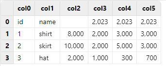

需要注意的是，由于 *col0* 和 *col1* 可以被视作一组具有离散值的变量，符合枚举类型的特征，被默认解析为 SYMBOL 类型；而 *col2* - *col5* 这几列数据都是整数形式，被默认解析为 INT 类型，因此 *col2* 原本的列名 *totalSale* 无法写入该列，为空；*col3* - *col5* 原本的列名只保留了开头可以解析为数字的 2023 部分。

### 1.2. 正确操作

指定 *containHeader* = true 时，系统会使用 “c” 加列名作为数字开头列的列名。

执行 `loadText("/xxx/colName.csv", containHeader = true)`，导入结果如下：

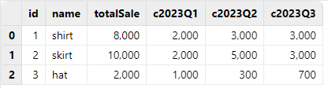

对于数字开头的列名，指定 *containHeader* = true，可以保证数据完整性，仅在列名前添加字符 “c”，是目前最佳的解决方案。因此，当使用 `loadText` 函数导入的文本文件表头有列名以数字开头时，应该指定 *containHeader* = true。

## 2. 自动解析数据类型的导入技巧

`loadText`、`ploadText` 和 `loadTextEx` 函数都提供了 *schema* 参数，用于传入一个表对象，以指定各字段的数据类型，并照此类型来加载数据。使用 `loadText`、`ploadText` 和 `loadTextEx` 函数时，如果用户不指定 *schema* 参数，会对数据文件进行随机抽样，并基于样本决定每列的数据类型。

由于自动解析数据类型的方法是对数据文件进行随机抽样，因此不一定每次都能准确决定各列的数据类型。为此，DolphinDB 提供了 `extractTextSchema` 函数，能够查看 DolphinDB 对数据文件进行自动解析数据类型的结果。在导入数据前，建议使用 `extractTextSchema` 确认对数据类型的自动解析结果；如果自动解析结果不符合预期，可以修改对应类型，并将修改后的表作为 `loadText`、`ploadText` 和 `loadTextEx` 的 *schema* 参数，再进行数据导入。

如导入下面的 *type.csv*，原始结构如下：

| **id** | **ticker** | **price** |
| --- | --- | --- |
| 1 | 300001 | 25.80 |
| 2 | 300002 | 6.85 |
| 3 | 300003 | 7.19 |

### 2.1. 错误操作

执行 `loadText("/xxx/type.csv")`，导入结果如下：

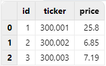

执行 `extractTextSchema("/xxx/type.csv")`，可以看到，*ticker* 列被默认解析为 INT 类型，不符合预期：

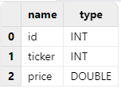

### 2.2. 正确操作

可以使用 `extractTextSchema` 函数先得到自动解析结果，再将 *ticker* 列的类型指定为 SYMBOL 类型，并用修改后的结果作为 `loadText` 函数的 *schema* 参数值进行导入，即可得到预期结果：

```
schema = extractTextSchema("/xxx/type.csv")
update schema set type =`SYMBOL where name = "ticker"
loadText("/xxx/type.csv", schema=schema)
```

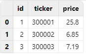

## 3. 日期与时间格式数据的手动导入方法

使用 `loadText` 函数导入符合日期、时间格式的数据时，如果用户不指定 *schema* 参数，会将符合日期、时间格式的数据优先解析为对应类型。规则如下：

* 当加载的数据文件中包含了表达日期、时间的数据时，满足分隔符要求的这部分数据（日期数据分隔符包含 ”-”、”/” 和 ”.”，时间数据分隔符为 ”:”）会解析为相应的类型。例如，”12:34:56” 解析为 SECOND 类型；”23.04.10” 解析为 DATE 类型。
* 对于不包含分隔符的数据，形如 ”yyMMdd” 的数据同时满足 0<=yy<=99，0<=MM<=12，1<=dd<=31 的条件时，会被优先解析成 DATE 类型；形如 ”yyyyMMdd” 的数据同时满足 1900<=yyyy<=2100，0<=MM<=12，1<=dd<=31 的条件时，会被优先解析成 DATE 类型。

如导入下面的 *notdate.csv*，原始结构如下：

| **id** | **ticker** | **price** |
| --- | --- | --- |
| 1 | 111011 | 133.950 |
| 2 | 111012 | 125.145 |
| 3 | 111013 | 113.240 |

### 3.1. 错误操作

直接使用 `loadText` 函数导入 DolphinDB，由于 *ticker* 列是形如 "yyMMdd" 的数据，且同时满足 0<=yy<=99，0<=MM<=12，1<=dd<=31 的条件，会被优先解析成 DATE 类型。

执行 `loadText("/xxx/notdate.csv")`，导入结果如下：

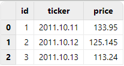

### 3.2. 正确操作

导入此类符合日期、时间格式的数据时，无需使用 `extractTextSchema` 函数查看自动解析结果，可提前在 *schema* 参数中将 *ticker* 列指定解析为 SYMBOL 类型，再进行导入，即可得到预期结果。

执行如下代码：

```
schema = table(`id`ticker`price as name, `INT`SYMBOL`DOUBLE as type)
loadText("/xxx/notdate.csv", schema = schema)
```

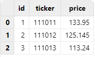

## 4. 提升数据导入效率的 `loadTextEx` 函数使用建议

在一些实际应用场景中，用户导入数据文件的下一步，都是将其写入分布式数据库进行存储，而不需要在内存中进行额外操作。DolphinDB 为此提供了 `loadTextEx` 函数，能够直接把数据文件入库，不需要把数据加载到内存表，既简化了步骤，又节省了时间。

如导入下面的 *data.csv*，原始结构如下：

| **ID** | **date** | **vol** |
| --- | --- | --- |
| 23 | 2023.08.08 | 34.461863990873098 |
| 27 | 2023.08.08 | 4.043174418620766 |
| 36 | 2023.08.08 | 5.356599518563599 |
| 98 | 2023.08.09 | 5.630887264851481 |
| … | … | … |

### 4.1. 初级操作

如果先使用 `loadText` 函数把该文件加载到内存，再写入数据库，耗时 771.618ms。

```
timer{
    t = loadText("/xxx/data.csv")
    loadTable("dfs://test_load","data").append!(t)
}

>> Time elapsed: 771.618ms
```

### 4.2. 进阶操作

直接使用 `loadTextEx` 函数将该文件入库，耗时 384.097ms。

```
timer{
    loadTextEx(database("dfs://test_load"), "data", "date", "/xxx/data.csv", sortColumns=`id)
}

>> Time elapsed: 384.097ms
```

数据量越大，两种方式的耗时差异越明显。

## 5. 在 `loadTextEx` 中使用 `transform` 参数预处理数据

在一些实际应用场景中，用户既希望能够使用 `loadTextEx` 函数直接把数据入库，又希望能够对数据做一些简单处理。针对这种需求，可以在 `loadTextEx` 中使用 *transform* 参数，对数据进行处理后再入库。这种做法无需把数据加载到内存来处理，简化了操作步骤。

例如，导入下面的 *dataWithNULL.csv* 时， *vol* 列有空值，需要先将 *vol* 列的空值填充为 0，再入库：

| **ID** | **date** | **vol** |
| --- | --- | --- |
| 52 | 2023.08.08 | 5.08143 |
| 77 | 2023.08.09 |  |
| 35 | 2023.08.08 | 0.22431 |
| 99 | 2023.08.09 |  |
| … | … | … |

### 5.1. 初级操作

如果先使用 `loadText` 函数把该文件加载到内存，使用 `nullFill!` 去除空值，再写入数据库，耗时 802.23ms。

```
timer{
    t = loadText("/xxx/dataWithNULL.csv")
    t.nullFill!(0.0)
    loadTable("dfs://test_load","data").append!(t)
}

>> Time elapsed: 802.23ms
```

### 5.2. 进阶操作

使用 `loadTextEx` 函数配合 *transform* 参数将该文件入库，耗时 385.086ms。

```
timer{
    loadTextEx(database("dfs://test_load"), "data", "date", "/xxx/dataWithNULL.csv", transform = nullFill!{, 0.0}, sortColumns=`id)
}

>> Time elapsed: 385.086 ms
```

可以看到，*transform* 参数使数据预处理变得非常便捷，无需在内存中额外处理数据，可以一步入库。

## 6. 避免将长整型时间戳数据以 TIMESTAMP 类型导入

在许多数据中，常常用长整型（LONG 类型）来表示 Unix 毫秒时间戳，即从 1970 年 1 月 1 日（UTC/GMT 的午夜）开始所经过的毫秒数。在导入这样的数据时，如果不预先指定导入类型，将会把这种形式的时间戳直接作为长整型导入，显示的是长整型数据；而如果指定这种形式的时间戳为 TIMESTAMP 类型，将其导入后并不会自动转换为对应的 TIMESTAMP，而会返回空值。因此，这两种做法的结果都不符合预期。

正确的做法是，先把原始数据以 LONG 类型导入，再使用 `timestamp` 函数手动转换为对应的 TIMESTAMP。

如导入下面的 *time.csv*，原始结构如下：

| **timestamp** | **ticker** | **price** |
| --- | --- | --- |
| 1701199585108 | SH2575 | 9.05991137959063 |
| 1701101960267 | SH1869 | 9.667245978489518 |
| 1701292328832 | SH1228 | 19.817104414105415 |
| 1701186220641 | SH2471 | 3.389011020772159 |

### 6.1. 错误操作

如果指定把 *timestamp* 列作为 TIMESTAMP 类型导入，该列导入结果将会全为空值：

```
schema = extractTextSchema("/xxx/time.csv")
update schema set type = "TIMESTAMP" where name = "timestamp"
loadText("/xxx/time.csv", schema=schema)
```

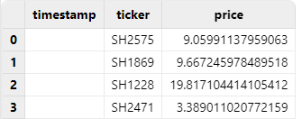

### 6.2. 正确操作

正确做法应该是把 *timestamp* 列以 LONG 类型直接导入，然后使用 `replaceColumn!` 和 `timestamp` 函数，将其手动转换为 TIMESTAMP 类型，即可得到预期结果：

```
t = loadText("/xxx/time.csv")
replaceColumn!(t, `timestamp, timestamp(exec timestamp from t))
t
```

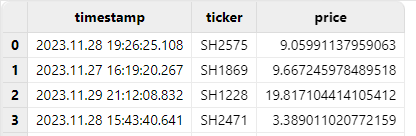

## 7. 长整型转换为 TIMESTAMP 类型时的时区注意事项

有的数据库在存储时间数据时，会将其转换为全球统一的 Unix 时间戳，并单独存储时区信息（即 UTC 偏移量）。 而 DolphinDB 将时间转换为本地时间戳直接存储，不会单独存储时区信息，具体可参考：[时区处理](https://docs.dolphindb.cn/zh/tutorials/timezone.html)。

因此，如果原始数据文件中的长整型是带时区信息的长整型，即已经加减了 UTC 偏移量的数据，导入 DolphinDB 进行转换时会被视为零时区数据处理，可能导致结果与预期不符。

如导入下面的 *localtime.csv*，原始结构如下：

| **timestamp** | **ticker** | **price** |
| --- | --- | --- |
| 1701331200000 | SH3149 | 8.676103590987622 |
| 1701331200000 | SH0803 | 12.16052254475653 |
| 1701331200000 | SH2533 | 12.076009283773601 |
| 1701331200000 | SH3419 | 0.239130933769047 |

其中，*timestamp* 列应为由北京时间 2023.11.30T16:00:00.000 转换的长整型：


### 7.1. 错误操作

直接把 *timestamp* 列以 LONG 类型直接导入，然后将其手动转换为 TIMESTAMP 类型后，得到的是零时区时间，和北京时间相差 8 个小时：

```
t = loadText("/xxx/localtime.csv")
replaceColumn!(t, `timestamp, timestamp(exec timestamp from t))
t
```

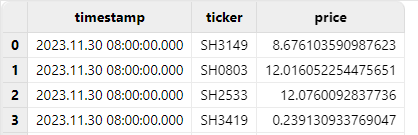

### 7.2. 正确操作

对于长整型转换为 TIMESTAMP 默认为零时区的现象，可以在转换类型时，利用 DolphinDB 内置的时区转换函数 `localtime`，把零时区时间转换成本地时间（本文测试的本地时间为东八区时间）：

```
t = loadText("/xxx/localtime.csv")
replaceColumn!(t, `timestamp, localtime(timestamp(exec timestamp from t)))
t
```

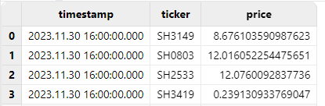

也可以利用 DolphinDB 内置时区转换函数 `convertTZ`，完成两个指定时区之间的转换：

```
t = loadText("/xxx/localtime.csv")
replaceColumn!(t, `timestamp, convertTZ(timestamp(exec timestamp from t), "UTC", "Asia/Shanghai"))
t
```

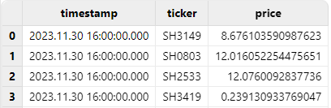

## 8. 使用标准格式的连接字符串连接 ODBC

通过 ODBC 插件可以连接其它数据源，将其他数据源的数据导入到 DolphinDB。在连接其他数据源时，有可能遇到报错：`FATAL: password authentication failed for user "xxx"`，但用户名和密码均正确，导致排查问题来源时没有头绪。许多情况下，这是因为使用的 ODBC 连接字符串有问题。有关连接字符串的标准格式，请参阅 [连接字符串参考](https://www.connectionstrings.com/)。

### 8.1. 错误操作

如下面的场景，使用 DSN 连接字符串连接 PostgreSQL，运行后出现报错：

```
odbcConfig = "DSN=PIE_PGSQL;Server="+ip+";port="+port+";DATABASE="+db+";Uid="+userName+";Password="+password+";"
conn = odbc::connect(odbcConfig)

>> FATAL: password authentication failed for user "pie_dev"
```

Linux 版本的 ODBC 插件基于 unixODBC 开发，isql 是 unixODBC 提供的基本工具，能够快速排查 ODBC 相关问题。使用相同的 DSN 连接字符串运行 isql，出现了相同的报错：

```
[28P01][unixODBC]FATAL: password authentication failed for user "pie_dev"
[ISQL]ERROR: Could not SQLDriverConnect
```

说明该问题与 DolphinDB 的 ODBC 插件无关，可能是连接字符串有问题。

### 8.2. 正确操作

查阅 [连接字符串参考](https://www.connectionstrings.com/)，发现 PostgreSQL 的 ODBC 标准连接字符串如下：

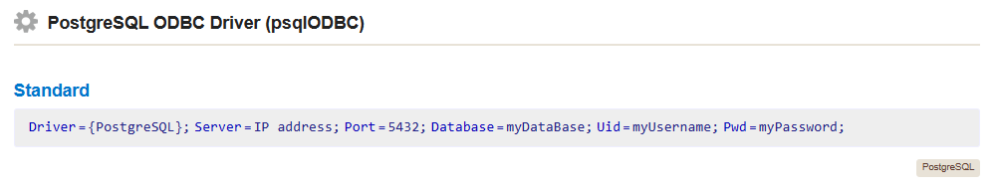

按照标准连接字符串形式，参考如下方式修改连接字符串：

```
odbcConfig = "Driver={PostgreSQL};Server="+ip+";port="+port+";DATABASE="+db+";Uid="+userName+";Password="+password+";"
conn = odbc::connect(odbcConfig)
```

运行后，连接成功。

## 9. 同磁盘下数据解压和导入的并行处理注意事项

许多时候，用户的原始数据文件是压缩包形式的，需要先解压再进行导入。如果用户采取的是一边解压一边导入的方式，且原始数据所在磁盘与解压后存储 DolphinDB 数据库的磁盘是同一块时，会降低导入的速率。如果忽略这个细节，可能导致数据导入的耗时额外增加。

如导入下面的 *mdl\_6\_28\_0.csv*，大小为 4.3 GB：

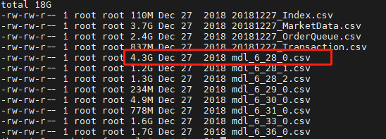

### 9.1. 错误操作

在该 DolphinDB 数据存储的磁盘上进行一个 .zip 文件的解压任务，同时使用 `loadTextEx` 函数将另一个已解压的 csv 文件入库，耗时约 1m41s：

```
timer loadText(database("dfs://test_load"), "data", "SecurityID", "/xxx/mdl_6_28_0.csv", sortColumns=`SecurityID`UpdateTime)

>> Time elapsed: 101156.78ms
```

在导入过程中，观察磁盘读写速率如下：

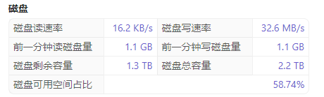

可以看到，当在同一块磁盘同时解压数据和导入数据时，数据导入的速率降低了许多。

### 9.2. 正确操作

磁盘空闲，没有解压任务在执行时，直接使用 `loadTextEx` 函数入库相同的文件，耗时约 46s：

```
timer loadText(database("dfs://test_load"), "data", "SecurityID", "/xxx/mdl_6_28_0.csv", sortColumns=`SecurityID`UpdateTime)

>> Time elapsed: 46203.117ms
```

在导入过程中，观察 DolphinDB 磁盘读写速率如下：

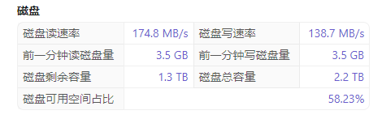

## 10. 避免并行写入同一分区时的冲突解决方案

在导入数据并写入分布式数据库时，有可能会存在并行写入同一分区的情况。在这种场景下，根据创建数据库时设置的 *atomic* 参数的不同，可能出现以下不同的情况：

* *atomic* 参数设置为 ’TRANS’，写入事务的原子性层级为事务，即一个事务写入多个分区时，若某个分区被其他写入事务锁定而出现写入冲突，则该事务的写入全部失败。因此，该设置下，不允许并发写入同一个分区。
* *atomic* 参数设置为 ’CHUNK’，写入事务的原子性层级为分区。若一个事务写入多个分区时，某分区被其它写入事务锁定而出现冲突，系统会完成其他分区的写入，同时对之前发生冲突的分区不断尝试写入，尝试数分钟后仍冲突才放弃。此设置下，允许并发写入同一个分区，但由于不能完全保证事务的原子性，可能出现部分分区写入成功而部分分区写入失败的情况。同时由于采用了重试机制，写入速度可能较慢。

当发生分区冲突导致写入失败时，将会抛出错误代码 S00002，错误信息为：`<ChunkInTransaction>filepath has been owned by transaction`，表示某个分区已经被一个事务锁定，新的事务无法再次锁定相同分区。如果忽略此细节，可能导致数据导入任务失败。

下面的 *dfs://test\_month* 数据库，按月分区，且 *atomic* 参数为 ’TRANS’：

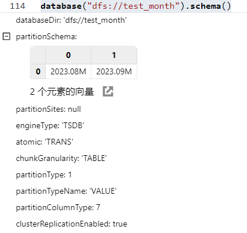

### 10.1. 错误操作

并行导入下面的 csv 文件入库，他们入库的目标分区都为 2023.08M：

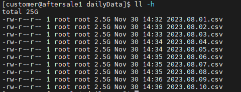

使用 `submitJob` 提交导入任务：

```
filePath = "/xxx/dailyData"
for (i in files(filePath).filename){
    submitJob("loadCSVTest", "load daily files to monthly db", loadTextEx, database("dfs://test_month"), "data", "date", filePath+i)
}
```

查看任务完成情况，可以看到，只有一个任务导入成功，别的任务都因为分区冲突而失败，抛出错误代码 S00002：

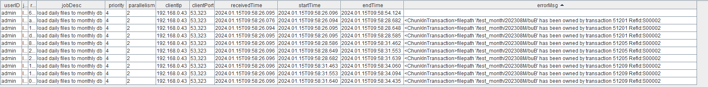

### 10.2. 正确操作

对于这种情况，我们可以串行导入文本文件，避免并行写入同一分区时的冲突：

```
def loadDaily(filePath){
	for (i in files(filePath).filename){
		loadTextEx(database("dfs://test_month"), "data",`date,filePath+i,sortColumns=`ID)
	}
}

path = "/xxx/dailyData/"
submitJob("loadCSVTest","load daily files to monthly db",loadDaily, path)
```

查看任务完成情况，可以看到，数据能够导入成功，没有报错：

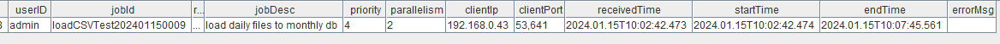

## 11. 总结

本文介绍了使用 DolphinDB 进行数据导入时，最容易忽略的 10 个细节，涵盖了数据格式、数据类型、导入速率、数据预处理、连接失败、分区冲突等多个方面。忽略了这些细节，可能导致数据导入失败或导入结果不符合预期。用户了解了这些细节，并合理进行数据导入，可以极大提升数据导入的速度和质量。

