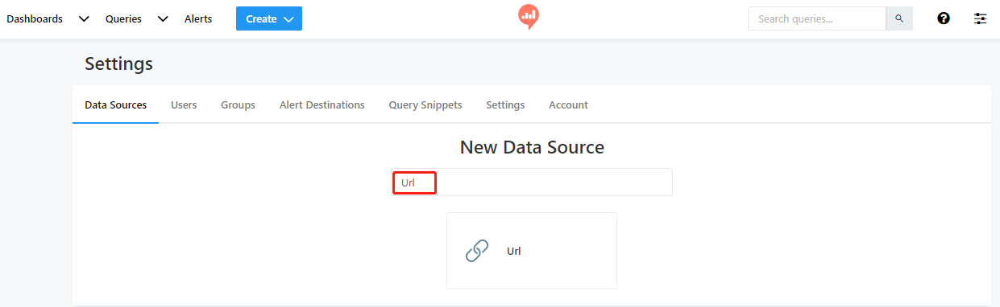

# Redash 连接 DolphinDB 数据源

Redash 是一款开源的 BI 工具，提供了基于 Web 的数据库查询和数据可视化功能。DolphinDB 支持 HTTP 协议的 `POST` 和 `GET` 接口获取数据，所以可以使用 Redash 中对应的 `JSON` 和 `URL` 两种数据源来连接 DolphinDB。

本文详细介绍在 Redash 中配置数据源及如何查询 DolphinDB 中的数据。

## 1. 使用 JSON 数据源连接 DolphinDB

Redash 当前仅在线（SAAS）版本中支持 JSON 数据源，因此使用在线版本的用户，可以选择这种连接方案，这种方案需要 DolphinDB 也能够通过外网访问。
要使用 Redash 在线版本，需要先到 [redash 官方网站](https://redash.io) 注册并登录。

在首页上可以选择创建数据源，按如下步骤进行配置：

* 选择建立新的数据源

  
* 选择 JSON 数据源

  
* 在 Name 里配置数据源名称

  

  然后通过 Create 按钮，创建一个 Query：

  

JSON 数据源需要使用 yaml 格式编辑，

* DolphinDB 接口需要 query 中包含基本的三种元素`url, method, json`
  + url：接受数据的地址，即 DolphinDB 数据节点，如`http://192.168.1.113:8848`
  + method：http 提交方式，JSON 接口必须使用 post 方式，`method: "post"`
  + json：提交的 JSON 数据，此处 DolphinDB 接口需要提供固定的 key 值 `client,queries`, 比如：`{client:"redash","queries":"\[sql query]"}`，用户可以使用任意的 sql 语句来替换[sql query]部分。
  + query 部分整体 query 如下所示：

    ```
    	url: http://115.239.209.224:18531
    	method: "post"
    	json: {'client':'redash','queries':'select * from typeTable'}
    ```

## 2. 使用 URL 数据源连接 DolphinDB

Redash 的 URL 数据源不仅在线版本支持，在开源独立部署的版本上也可以支持。
因此，使用独立部署的用户可以通过这种方式来连接 DolphinDB。

连接和配置数据源的方式与 JSON 方式基本相同，在数据源选择时选择 URL 类型数据源，如下图：



* 在 URL 中配置数据源名称和路径，`URL Base path`是获取数据的跟地址，配置成 DolphinDB 的数据节点 web 地址即可
  
* 创建一个`new query`,在编辑区以 URL 参数字符串的形式输入查询内容，查询内容格式上有如下要求：

  + 子路径必须为 /json
  + query 参数必须包含：`client` 和 `queries` 两个 key，其中 `client` 指定固定值为 `redash`
  + 完整的 query 内容示例如下：

  ```
  /json?client=redash&queries=select * from typeTable where id between (1..10)
  ```

**注意事项**

由于 Redash 对 URL 方式的参数要进行编码校验，所以一些特殊字符需要手工编码才能通过校验，比如 query 中出现 `://`,`+`,`&` 等字符，需要替换为 `%3a%2f%2f`,`%2b`,`%26` 才能通过校验。

例如，DolphinDB 中的分布式数据库路径 `dfs://dbpath`，需要用 URL 编码替换为 `dfs%3a%2f%2fdbpath` 才能通过 Redash 的校验，实际代码如下：

* 需要提交的 query:

  ```
  /json?client=redash&queries=login('admin','123456');select avg(ofr-bid) from loadTable('dfs://TAQ','quotes') group by minute(time) as minute
  ```
* 实际写到 Redash 的编辑器中要替换为：

  ```
  /json?client=redash&queries=login('admin','123456');select avg(ofr-bid) from loadTable('dfs%3a%2f%2fTAQ','quotes') group by minute(time) as minute
  ```

