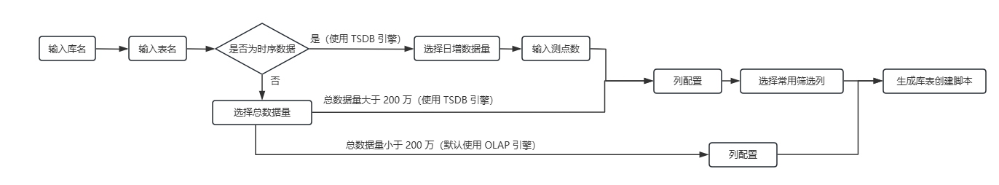
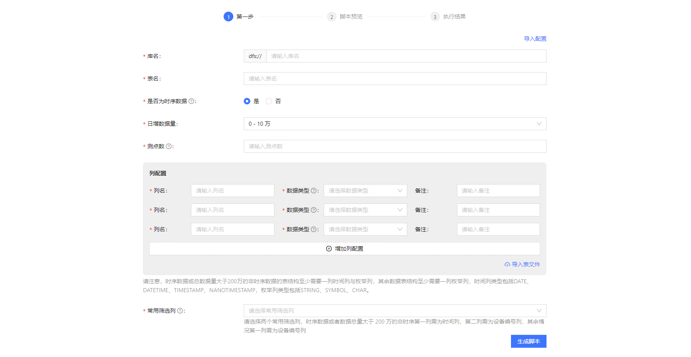
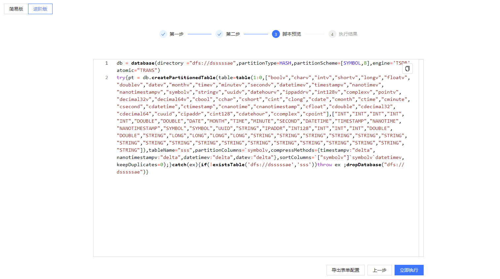
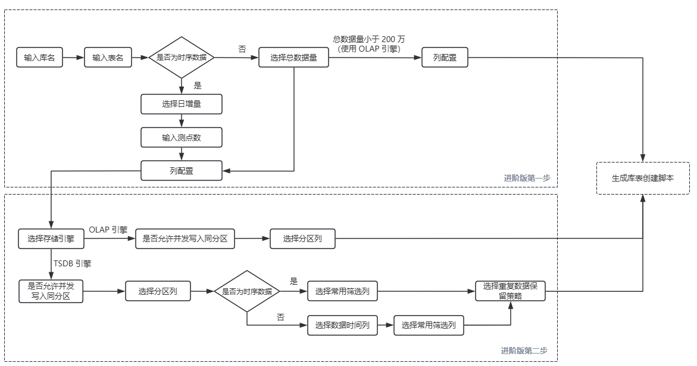
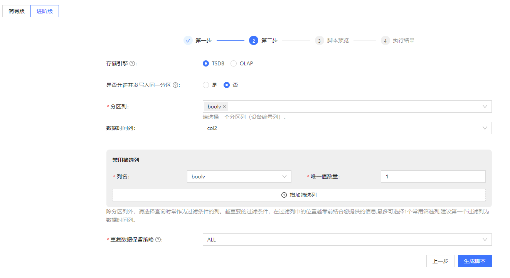
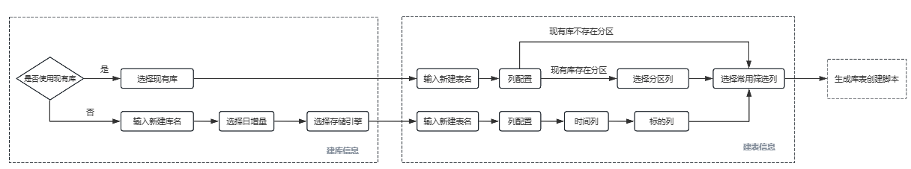
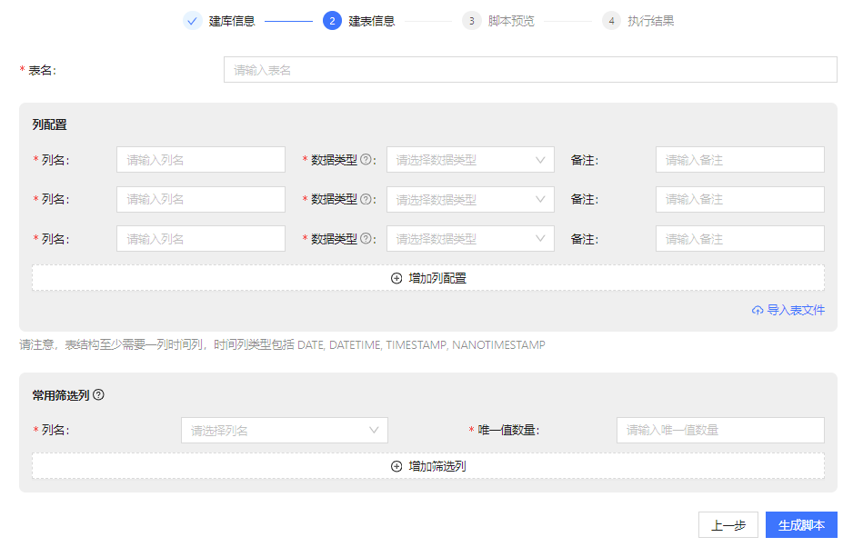
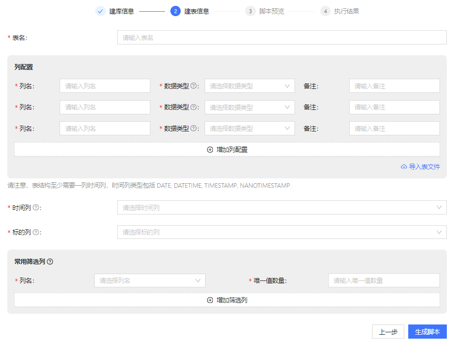

# DolphinDB Web 界面库表创建指南

时序数据适用于现代社会的各类应用场景分析。无论是物联网场景的数据采集还是金融场景的交易分析，时序数据无处不在，因此，时序数据库的重要程度与日俱增。时序数据库会利用各种索引和压缩技术存储时序数据，从而高效完成数据的读取与写入。随着时序数据库的日渐流行，如何针对时序数据库进行数据规划，即如何设计数据库的数据结构、存储方案、分区策略以实现数据的查询优化，也成为了众多时序数据库用户面临的痛点。

用户在进行时序数据库规划时，通常会面临以下两类问题：

* **如何确定数据需求：**确定数据需求是数据规划的首要任务，包括理解业务需求、确定数据类型、结构和关系，以及定义数据的粒度和范围。用户可能具备丰富的领域知识和经验，但并不能将领域知识准确的应用到数据规划中去。
* **如何选择适当的数据存储方案和优化数据性能：**涉及选择合适的数据库技术、设计有效的索引和分区策略，并考虑数据量、访问模式和性能需求等因素。对于业务用户而言，理解数据库设计原理和性能优化概念有一定的难度。

针对上述问题，DolphinDB
针对目前时序数据应用最为广泛的两类场景，即物联网场景和金融场景，提供了库表创建向导。此向导根据用户选择，收集建库建表信息，并结合了实际的业务场景，生成库表创建脚本，从而帮助用户完成库表创建。用户可以通过
Web 访问 DolphinDB，在"功能设置"中开启库表创建功能。

## 1. 物联网场景向导

物联网设备广泛应用于各个工业领域，这些设备传感器实时采集环境、设备和过程数据，为物联网设备的预测性维护和优化提供分析依据。此类场景下，各项目数据结构与主键列名都有所不同，因此，一库一表的设计更符合物联网的业务需求。物联网数据通常可以分为**时序数据**与**非时序数据**两类，其中时序数据指的是严格时间增长的数据，例如测点采集的数据；非时序数据指的是不随时间严格增长的数据，例如设备监控表会存储设备ID、点位
ID、设备阈值上下限与阈值更新时间，但是阈值更新时间间隔不定。从用户视角出发，我们按用户所熟知的测点数、采集频率、日增数据量等概念来引导用户进行数据规划，并按需提供了简易版与进阶版库表创建向导：

* 简易版主要面向对数据库不甚了解的用户，如领域业务专家；
* 进阶版面向对 DolphinDB 数据库领域知识相对了解的用户，如运维人员。

### 1.1 简易版

简易版将隐藏一部分数据库存储、索引相关的配置信息，如存储引擎和分区列，我们会根据用户填写的信息提供默认值，从而降低数据规划的复杂度，用户仅需按照界面表单提示填写信息，即可生成库表创建脚本，简易版步骤如图1所示。

图 1. 图1. 物联网库表创建向导简易版步骤图

具体步骤如下：

1. 输入库名
2. 输入表名
3. 选择是否为时序数据
4. 日增数据量与总数据量选择
   * 时序数据时需选择日增数据量
   * 非时序数据需选择总数据量
5. 输入测点数：为时序数据时输入
6. 列配置

   时序数据或者总数据量大于 200 万的非时序数据会使用 TSDB 引擎，总数据量小于 200 万的非时序数据使用 OLAP
   引擎，物联网场景使用测点收集各种传感器数据和设备状态，需要一列用于存储测点信息。因此，列配置存在两类情况：
   * 时序数据或者总数据量大于 200 万的非时序数据时，需要一列时间列与枚举列
   * 其余情况下，需要一列枚举列

   支持手动输入、本地文件导入与服务器文件导入三种配置方式
   * 手动输入：可以手动添加列信息，包括列名、列的数据类型以及备注信息
   * 本地文件导入：可以将本地的数据源文件导入，解析得到其中的列以及列类型
   * 服务器文件导入：可以输入表格文件在服务器的绝对路径地址，解析得到列和列类型
7. 选择常用筛选列

   常用筛选列是查询经常作为筛选条件的列，越重要的过滤条件，在筛选列中的位置越靠前，唯一值数量用于判断是否需要对数据进行降维。常用筛选列的选择也分为两类情况：
   * 总数据量小于 200 万的非时序数据，使用 OLAP 引擎，无需选择常用筛选列
   * 时序数据或者总数据量大于 200 万的非时序数据，使用 TSDB
     引擎，常用筛选列第一列需为时间列，第二列需要设备编号列

填写信息如图 2 所示

图 2. 图2. 物联网向导简易版信息填写

当填写完信息之后点击生成脚本，即可进入下一步预览库表创建的脚本，在这一步，可以直接执行生成的脚本，也可复制脚本进行修改；脚本预览界面如图 3 所示。

图 3. 图3. 脚本预览界面

### 1.2 进阶版

相较简易版，进阶版假设用户对 DolphinDB
比较了解，为其提供更多的高级配置，例如存储引擎、分区列以及重复数据处理策略等信息。进阶版信息填写分为两步：基本信息填写与高阶信息填写，填写步骤如图 4
所示，其中第一步填写信息与简易版一致，在此不做赘述。

当存储数据为时序数据或者总数据量大于 200
万的非时序数据（后文统一使用”非时序数据”指代）时，会开放高阶信息。时序数据指的是随着时间严格增长的数据，而非时序数据指的是不随时间严格增长的数据。但需注意，物联网场景中非时序数据不一定没有时间信息，例如设备监控表会存储设备ID、点位
ID、设备阈值上下限与阈值更新时间，但是阈值更新时间间隔不定。

图 4. 图4. 物联网进阶版库表创建引导步骤图

高阶信息填写规则如下：

1. 选择存储引擎，[OLAP](../db_distr_comp/db/olap.md) 或者 [TSDB](../db_distr_comp/db/tsdb.md)
2. 选择是否[允许并发写入同一分区](../funcs/s/setAtomicLevel.md)
   * 允许并发写入同一分区指的是若一个事务写入多个分区时，某分区被其它写入事务锁定而出现冲突，系统会完成其他分区的写入，同时对之前发生冲突的分区尝试写入，写入方式在不同
     server 版本有所差异：
     + **release 200 及之前的版本：**数据节点收到写入的数据后，计算数据涉及的分区，并向
       controller
       申请所有分区的分布式锁，向成功申请锁的分区写入数据，在完成事务后，释放写入完成的分区的锁；申请锁失败的分区则在
       sleep
       一段时间后重新申请分布式锁，直至所有分区都完成写入。此类情况下，先提交的写入请求可能一直拿不到锁，处于饥饿状态，因为
       sleep 时，锁可能被其他后提交的写入请求持有，导致写入请求的完成时间没有保障。
     + **release 300 及之后的版本：**数据节点将写入请求发送到 controller，controller
       收到请求后，将其放到统一的队列里管理调度，如果分区可写，则主动通知数据节点写入。此类情况下，一次写入会被分为多个事务，如果发生回滚，会导致某次写入只写了一部分数据。
   * 不允许并发写入同一分区指的是一个事务写入多个分区时，若某个分区被其他写入事务锁定而出现写入冲突，则该事务的写入全部失败。
3. 选择分区列

   根据用户填写的前置信息（日增量、总数据量以及测点等），会推荐分区列个数与各分区列的数据类型，用户需按照推荐的信息选择分区列。

   **时序数据：**根据日增数据量判断分区层数。

   * 一层分区：需要选择选择一个分区列，且仅能选择时间列
   * 两层分区：需要选择两个分区列，第一列分区列为时间列，第二列分区列为设备编号列

   **非时序数据：**需要选择一个分区列，即设备编号列。
4. 选择数据时间列（非必选）

   当存储引擎选择 TSDB
   且为非时序数据时展示，非时序数据仅需选择设备编号列作为分区列，当数据含有时间信息时可以将时间信息列作为数据时间列，此列也将作为
   sortColumns 用于查询优化。
5. 选择常用筛选列与其唯一值数量

   常用筛选列是查询时经常作为筛选条件的列，越重要的过滤条件，在筛选列中的位置越靠前，而唯一值数量用于判断是否需要对数据进行降维，常用筛选列也将作为
   sortColumns 用于查询优化。

   * 存储引擎为 TSDB 时才能选择常用筛选列，OLAP 分区内不支持索引
   * 根据填写的前置信息，会推荐常用筛选列个数，选择的数量不能少于推荐的个数，且仅能选择可枚举类型（STRING、SYMBOL 和 CHAR
     类型）
6. 选择重复数据处理策略

   DolphinDB 提供了三种策略处理同分区中 sortColumns 值相同的数据：

   * ALL：保留所有数据
   * LAST：仅保留最新数据
   * FIRST：仅保留第一条数据

选择完高阶信息之后即可生成库表创建脚本，此步骤与简易版一致，可直接执行生成的脚本，返回上一步修改库表创建信息或者复制脚本进行修改。

图 5. 图5. 物联网进阶版信息填写表单

## 2. 金融场景向导

在金融领域，股票交易数据分析是至关重要的一环，DolphinDB
能实时存储和处理股票、债券等市场数据，支持快速分析和决策。在金融场景下，日增量和标的对于数据库建库建表至关重要，了解日增量可以帮助合理预测未来数据存储需求，帮助设计表结构与索引策略，优化查询性能，而不同的金融产品往往具备不同的数据特征，设计数据库时需要根据标的的类型规划相应的表结构和字段。因此，在此场景下，我们根据用户选择的日增量和标的信息，引导用户进行数据规划。在金融场景下，用户可选择新建库表或者基于现有库创建数据表，主要分为建库信息、建表信息与脚本生成三个步骤，步骤图如图
6 所示。

图 6. 图6. 金融场景库表创建引导步骤图

### 2.1 建库信息

金融场景下可选在现有库中新建数据表，或者新建库表。主要步骤如下：

1. 选择是否使用现有库
2. 选择现有库（现有库场景）
3. 输入新建库名（新建库场景）
4. 选择日增量（新建库场景）
5. 选择存储引擎，[OLAP](../db_distr_comp/db/olap.md) 或者 [TSDB](../db_distr_comp/db/tsdb.md)（新建库场景）

### 2.2 建表信息

已有库场景与新建库场景下的建表信息如图 7 和 图 8 所示，具体步骤如下：

1. 输入新建表名
2. 列配置

   与物联网场景相同，支持手动输入、本地文件导入与服务器文件导入三种配置方式，表结构必须含有一列时间列，类型包括DATE, DATETIME,
   TIMESTAMP, NANOTIMESTAMP。

   支持手动输入、本地文件导入与服务器文件导入三种配置方式：

   * 手动输入：可以手动添加列信息，包括列名、数据类型以及备注信息
   * 本地文件导入：可以将本地的表格文件导入，解析得到表格中的列以及列类型
   * 服务器文件导入：可以输入表格文件在服务器的绝对路径地址，解析得到列和列类型
3. 选择时间列

   新建库场景且总数据量大于 200 万时选择，且需选择严格按照时序增长排序的时间类型列（
   DATE、DATETIME、TIMESTAMP），将会按照此列对数据进行分区。
4. 选择标的列

   新建库场景且总数据量大于 200 万或日增量大于 100 万时选择，仅支持选择 SYMBOL 和 STRING
   列，此列用于对数据进行分区，用户可以选择如股票 ID、期货品种之类的列。
5. 选择分区列

   在已有库场景下，且该库存在分区时选择，数量和数据类型需与已有库分区信息一致。
6. 选择常用筛选列与其唯一值数量

   常用筛选列是查询经常作为筛选条件的列，越重要的过滤条件，在筛选列中的位置越靠前，唯一值数量用于判断是否需要对数据进行降维，金融场景下的常用筛选列含有以下规则：

   * 数量不多于 2 列
   * 数据类型需为能枚举的类型，如 CHAR、STRING、SYMBOL等

图 7. 图7. 金融建表信息（已有库场景）

图 8. 图8. 金融建表信息（新建库场景）

信息填写完毕点击【生成脚本】按钮即可生成库表创建脚本，脚本预览界面与物联网场景一致，此步骤可直接执行生成的脚本，返回上一步修改库表创建信息或者复制脚本进行修改。

