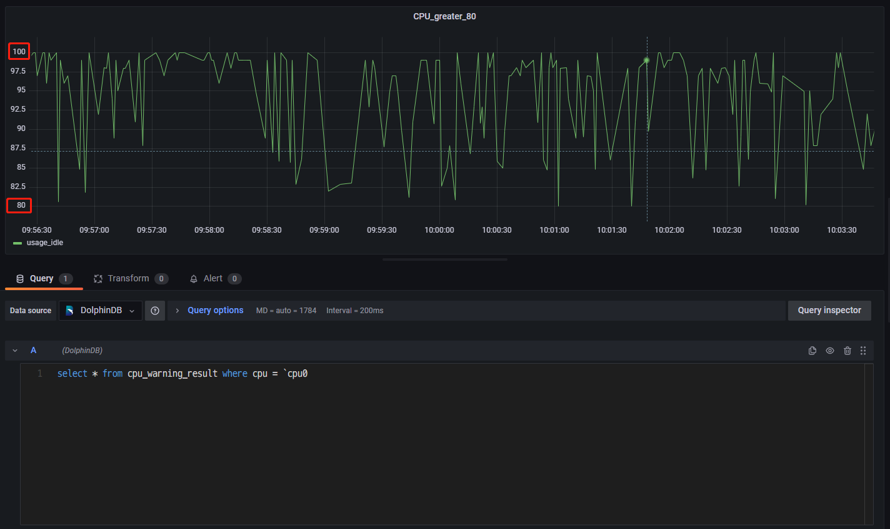

# If use the debug mode.
debug = true

```

1. 修改 DolphinDB 配置文件，用于支持创建磁盘持久化流数据表。在 dolphindb.cfg 中设置持久化路径如下（<DolphinDBDir>是自定义的数据存放路径，可以与 server 保持同一目录）：

```
volumes=<DolphinDBDir>/volumes
redoLogDir=<DolphinDBDir>/redoLog
chunkMetaDir=<DolphinDBDir>/chunkMeta
TSDBRedoLogDir=<DolphinDBDir>/TSDBRedoLog
persistenceDir<DolphinDBDir>/persistence
persistenceOffsetDir=<DolphinDBDir>/streamlog
```

1. 连接登录 DolphinDB，在 DolphinDB 中创建存储 CPU 指标数据的流数据表 cpu\_stream。

```
//登录
login(`admin,`123456)

//清理缓存
undef(all)
clearAllCache()

//持久化流数据表 cpu_stream
cpuColnames = `timestamp`cpu`usage_idle
cpuColtypes =[TIMESTAMP,STRING,DOUBLE]
enableTableShareAndPersistence(table = streamTable(1000:0,cpuColnames,cpuColtypes), tableName=`cpu_stream, cacheSize = 5000000)
```

1. 在 DolphinDB 中订阅流数据表 cpu\_stream 中的数据，一方面将流数据表中的数据导入到分布式表 dfs\_cpu 中进行持久化存储，另一方面对流数据表中的数据进行流计算，预警统计 CPU 使用率大于 80% 的指标数据，并将统计的数据存入流数据表 cpu\_warning\_result 中。

```
//创建分布表 dfs_cpu ，并订阅 cpu_stream 中的数据导入到 dfs_cpu 中。
dbName = "dfs://telegraf"
db_telegraf = database(directory=dbName, partitionType=VALUE,partitionScheme = 2022.01.01..2022.12.31)
cpu = table(1:0,cpuColnames,cpuColtypes)
dfs_cpu = createPartitionedTable(dbHandle = db_telegraf,table = cpu,tableName = "cpu",partitionColumns ="timestamp",compressMethods = {timestamp:"delta"});
subscribeTable(tableName="cpu_stream", actionName="append_cpu_stream_into_dfs", offset=0, handler=loadTable(dbName,"cpu"), msgAsTable=true,batchSize=100000, throttle=1, reconnect=true)

//进行流计算，预警统计 cpu 使用率大于80%的指标数据，并将统计的数据存入流数据表 cpu_warning_result 中
enableTableShareAndPersistence(table = streamTable(1000:0,cpuColnames,cpuColtypes), tableName=`cpu_warning_result, cacheSize = 5000000)
def handler_cpu(mutable warning_result, msg)
{
    t = select * from msg where usage_idle >= 80;
	warning_result.append!(t)
}
subscribeTable(tableName="cpu_stream", actionName="cpu_warning", offset=0, handler=handler_cpu{cpu_warning_result}, msgAsTable=true,batchSize=100000, throttle=1, reconnect=true)
```

1. 启动 Telegraf 服务。

```
telegraf --config $TelegrafConfig
```

1. 查看 cpu\_stream 中最近的 100 条 CPU 指标数据，查看 dfs\_cpu 中最近的 100 条 CPU 指标数据，查看 cpu\_warning\_result 中最近的 100 条 预警数据。

```
dbName = "dfs://telegraf"
dfs_cpu = loadTable(dbName,"cpu")
select top 100 * from cpu_stream order by timestamp desc
select top 100 * from dfs_cpu order by timestamp desc
select top 100 * from cpu_warning_result order by timestamp desc
```

1. 登录 Grafana 监控 CPU 利用率大于 80% 的预警数据。连接上 DolphinDB 数据源并创建面板 Panel 后，直接可视化 cpu\_warning\_result 中的数据即可（这里只监控了单核 cpu0 的预警数据）。



## 6. 附件

1. telegraf-dolphindb-outputs 插件：[telegraf-dolphindb-outputs](plugin/DolphinDB_Telegraf_Grafana/telegraf-dolphindb-outputs)
2. 编译源码：[telegraf.zip](script/DolphinDB_Telegraf_Grafana/telegraf.zip)
3. TelegrafConfig：[TelegrafConfig](script/DolphinDB_Telegraf_Grafana/TelegrafConfig)

