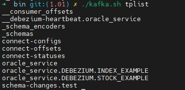

# Debezium + Kafka 实时同步 Oracle 11g 数据到 DolphinDB 运维手册

**教程难度**

* 高级

**面向读者**

* 已经掌握：[Debezium+Kafka 实时同步 Oracle 11g 数据到 DolphinDB](Debezium_Kafka_Oracle_sync.md)
* 本教程提供了操作步骤，掌握了上面内容的读者可以跟随教程内容进行运维操作

基于开源技术 Debezium + Kafka 实时同步数据到 DolphinDB 中，我们目前已经支持了 Mysql 和 Oracle 11g。由于当前方案涉及到四个程序的部署，而且具体的 Source 同步任务和 Sink 同步任务还需要额外的管理，在运维上具有一定难度。本篇中基于 Oracle 11g 实时同步数据到 DolphinDB 的场景进行运维操作的介绍。

## 1. 数据同步运维工具包准备

本同步方案包含对 Kafka 操作命令、通过 REST API 对 Kafka-Connect 的操作，这些操作命令涉及的参数比较多，但有些参数比如 Kafka 的访问 IP、端口等当操作环境固定之后，都是固定的参数。因此为了提高操作数据同步程序的便捷性，封装了一些运维操作脚本到 kafka-tools 工具包中。

### 1.1 安装和配置

下载地址请参见附录。

将 *kafka-tools.tar* 包解压缩，本例中解压到 */KFDATA* 路径下。

```
 tar -xvf kafka-tools.tar
```

按当前环境配置 kafka-tools 工具包的配置文件。

```
vim /KFDATA/kafka-tools/config.properties
```

配置项配置如下

kafka-tools 中提供了 3 个脚本，每个脚本不带参数执行时可以输出使用说明。

kafka.sh : 封装了一些对 Kafka 的操作脚本，如创建、查看 topic 明细，查看指定 topic 当前 offsets 等。

图 1.  图1-1 kafka.sh 脚本函数列表


rest.s : 封装了通过 REST API 访问 Kafka-Connect 进行同步任务配置、检查等操作。

图 2.  图1-2 rest.sh 脚本函数列表


tpconsumer : 用于查看 topic 中数据的脚本，对 Kafka 中的序列化数据，加载 Schema Registry 中的表元数据数据进行反序列化解析。

图 3.  图1-3 tpconsumer.sh 脚本参数列表


## 2. 同步程序和同步任务的基础操作

**注意：手册中的所有操作都需要使用 kafka 用户来进行，并默认 kafka 用户拥有 sudo 权限。**

### 2.1 同步程序组件的启动和停止

同步程序组件包括 ZooKeeper、Kafka Server、Schema Registry 和 Kafka-Connect，这些组件在部署教程中已被设置为 Linux 服务，可以通过 Linux 系统命令 *systemctl 进行启动*。

按如下顺序启动各个组件：

```
sudo systemctl start zookeeper
sudo systemctl start kafka-server
sudo systemctl start schema-registry
sudo systemctl start kafka-connect
```

按如下顺序停止各个组件：

```
sudo systemctl stop kafka-connect
sudo systemctl stop schema-registry
sudo systemctl stop kafka-server
sudo systemctl stop zookeeper
```

如果只暂停同步，则只需要停止 Kafka-Connect 程序。停止 Kafka-Connect 程序后，可以对 Kafka 进行修改 topic 消费进度、删除 topic 等操作：

```
sudo systemctl stop kafka-connect
```

可以通过以下脚本快速查看当前同步程序的四个服务是否在运行状态。如下图所示则同步程序均正常运行。

```
sudo systemctl list-units |egrep 'zookeeper|kafka-server|schema-registry|kafka-connect'
```

图 4.  图2-1 同步程序服务状态展示


### 2.2 同步任务部署操作

同步任务是指通过 REST API 向 Kafka-Connect 发起调用，开启从 Oracle11g 到 Kafka 的 source 数据同步和从Kafka 到 DolphinDB 的 sink\* \*数据同步任务。

* **Oracle 的 source 数据同步操作**

  创建连接 Oracle 的 source 连接器配置文件如下：

  ```
  mkdir -p /KFDATA/datasyn-config
  vim /KFDATA/datasyn-config/source-oracle.json
  ```

  录入以下配置，*hostname* 和 *kafka* 启动地址参数需按实际情况对应修改：

  ```
  {
      "name": "oracle-connector",
      "config": {
       "connector.class": "io.debezium.connector.oracle.OracleConnector",
       "tasks.max": "1",
       "topic.prefix": "oracle_service",
       "database.hostname": "183.134.101.144",
       "database.port": 1521,
       "database.user": "debezium",
       "database.password": "123456",
       "database.dbname": "testdb",
       "database.connection.adapter": "logminer",
       "schema.include.list": "debezium",
       "table.include.list": "debezium.index_example,debezium.stock_example",
       "schema.history.internal.kafka.bootstrap.servers": "183.134.101.144:9092",
       "schema.history.internal.kafka.topic": "schema-changes.test",
       "event.processing.failure.handling.mode": "skip",
       "decimal.handling.mode": "string",
       "snapshot.mode": "initial",
       "log.mining.strategy": "online_catalog",
       "log.mining.query.filter.mode": "in",
       "log.mining.continuous.mine": true,
       "heartbeat.interval.ms": "20000",
       "schema.history.internal.store.only.captured.tables.ddl": true,
       "schema.history.internal.store.only.captured.databases.ddl": true
    }
  }
  ```

  通过封装了 REST API 的脚本启动 Oracle 的 source 数据同步任务：

  ```
  cd /KFDATA/kafka-tools/bin
   ./rest.sh create /KFDATA/datasyn-config/source-oracle.json
  ```

  启动成功如下图所示：
  ​

  图 5.  图2-2 source 同步任务启动成功展示

  

  对于已启动的数据同步任务，我们可以通过如下命令查看当前同步任务列表：

  ```
  cd /KFDATA/kafka-tools/bin
  ./rest.sh showall
  ```

  ​

  图 6. 图2-3 查看当前同步任务列表

  

  查看 Source 同步任务启动后，Oracle 中配置了数据同步的数据表数据会同步到 Kafka 中的 topic 中。当前 Kafka 中的 topic 列表可以通过如下命令查看：

  ```
  ./kafka.sh tplist
  ```

  如下图所示 Oracle Source 同步任务创建后，Kafka 中的 topic。
  ​

  图 7. 图2-4 查看当前 Kafka 中的 topic

  

  上图中：

  + 下划线开头的 topic 为 Kafka 和同步程序创建的内部 topic。
  + *connect-configs*、*connnect-offsets*、*connect-statuses* 是 Kafka-connect 程序创建的 topic，用于存储同步云运行的配置、状态、偏移量等信息。
  + oracle\_service 是 Oracle Source 同步任务信息记录 topic。
  + oracle\_service.Debezium 开头的 *topic* 则是存储表 Oracle 中同步表的数据的 topic。
  + 包含 schema 的字符串的是 schema-registry 存储表元数据及改变的 topic。

  ​
* **DolphinDB 的 sink 数据同步操作**

  创建 DolphinDB 数据同步任务配置文件：

  ```
  cd /KFDATA/datasyn-config
  vim ddb-sink.json
  ```

  ddb-sink.json 的配置内容如下：

  ```
  {
      "name": "ddb-sink",
      "config": {
          "connector.class": "io.confluent.connect.jdbc.JdbcSinkConnector",
          "tasks.max": "2",
          "topics": "oracle_service.DEBEZIUM.INDEX_EXAMPLE,oracle_service.DEBEZIUM.STOCK_EXAMPLE",
          "connection.url": "jdbc:dolphindb://183.134.101.144:8848?user=admin&password=123456",
          "transforms": "unwrap",
          "transforms.unwrap.type": "io.debezium.transforms.ExtractNewRecordState",
          "transforms.unwrap.drop.tombstones": "false",
          "auto.evolve": "false",
          "insert.mode": "insert",
          "delete.enabled": "true",
          "batch.size":"10000",
          "pk.mode": "record_key",
          "ddbsync.config.table":"dfs://ddb_sync_config,sync_config",
          "ddbsync.addSortColFlag": "true"
      }
  }
  ```

  通过封装了 REST API 的脚本启动 DolphinDB 的 sink 数据同步任务。

  ```
  cd /KFDATA/kafka-tools/bin
  ./rest.sh create /KFDATA/datasyn-config/ddb-sink.json
  ```

  查看同步任务状态。如下图所示，当前正在运行了 一个 source 同步任务和 一个 sink 同步任务。

  ```
  ./rest.sh showall
  ```

  图 8. 图2-5 当前的 source 和 sink 同步任务展示

  

## 3. 运维检查

本章将介绍日常运维的一些检查操作。

### 3.1 检查同步程序运行状态

同步程序包含 4 个部署程序，通过以下命令检查这个 4 个同步程序是否正常运行状态。如下图则为全部正常寻运行。

```
sudo systemctl list-units |egrep 'zookeeper|kafka-server|schema-registry|kafka-connect'
```

图 9. 图3-1 同步程序 4 个服务运行状态列表


### 3.2 同步任务检查及操作

**第一步**：查看当前有哪些同步任务：

```
./rest.sh list
```

下图中，可以看到有 2 个同步任务。

图 10. 图3-2 查看当前同步任务


**第二步**：根据同步任务名称查看某个同步任务的状态。

```
./rest.sh status ddb-sink
```

每个同步任务包含 1 个 connector 和至少 1 个 task ，如下图所示当前同步任务的 connector 和 task 均为正常运行状态 *RUNNING*。

图 11. 图3-3 查看同步状态明细


**第三步**：快速查看当前全部同步任务状态。

```
./rest.sh showall
```

图 12. 图3-4 查看全部同步任务同步状态


**第四步**：暂停同步任务，该操作会停止当前整体 connector 同步任务。

```
./rest.sh c_pause ddb-sink
```

图 13. 图3-5 暂停 ddb-sink 同步任务


**第五步**：恢复暂停的同步任务。

```
./rest.sh c_resume ddb-sink
```

图 14. 图3-6 将 ddb-sink 任务从暂停状态恢复


**第六步**：恢复同步异常终止的 task。

对于曾经由于数据库连接失败而一度暂停的同步任务的某个 task，在数据库问题消除后，只要 connector 运行正常，可以通过以下命令使其恢复同步：

```
./rest.sh t_restart ${connector_name} ${task_id}
```

### 3.3 检查数据同步情况

本小节内容主要介绍当发现 DolphinDB 与 Oracle 数据不一致时，如何进行调查。

**第一步：检查数据同步是否落后 Oracle 实时写入进度过多。**

Oracle 的 SCN 是一个递增的序列号，用于标识数据库中所有事务的提交顺序和数据的变更点。可以通过以下命令查看 Oracle 的最新 *SCN*，即 Oracle 当前的最新事务号。

```
select current_scn from v$database;
```

图 15. 图3-7 Oracle 的当前 SCN 序号


Kafka-Connect 框架接收到 Oracle 的增量数时，也会获得对应的 *SCN*，在处理完增量数据后（配置了同步的表数据会写入 Kafka 中的 *topic*，未配置同步的表的增量数据会被跳过）会将已经处理完的数据的对应 *SCN* 记录到名字为 *connect-offsets* 的 *topic* 中。那么我们通过以下命令可以跟踪当前最新完成同步的增量数据的 *SCN* 。

```
./consume.sh --topic connect-offsets --from-beginning|grep oraclenew
```

上图中代码中的 oraclenew 是source 同步任务的 connector name。已完成同步的增量数据的 *SCN* 在 commit\_scn 上记录。

图 16. 图3-8 同步程序在 kafka 的 topic 中记录的 SCN 记录


如果 Oracle 中的最新 SCN 和 connect-offsets topic 中记录的 commit\_scn 落差很大，说明 Oracle source 同步任务落后 Oracle 实时写入很多，需要分析原因（例如 Oracle 的 logminer 挖掘比较慢，网络传输慢、Kafka 数据写入慢等）。

**第二步：检查当前同步各表的数据同步状态**

DolphinDB 的 *sink* 写入程序通过消费 Kafka 中的数据，并按照 Kafka 中数据的顺序写入 DolphinDB 中。通过查看同步程序对 Kafka 中数据的消费进度可以检查每张同步数据表的同步进度。

首先，查看当前 Kafka 中的消费组列表。

```
./kafka.sh cm_list
```

图 17. 图3-9 Kafka 中的消费组列表


DolphinDB 的 *sink* 写入任务的 *connector name* 前面拼接 *connect* 就是这个同步写入任务的消费组名字，

这里我们只有一个消费组，即我们同步程序使用的消费组。查看这个消费组的 *topic* 数据消费状态。

```
./kafka.sh cm_detail connect-ddb-sink-oracle
```

图 18. 图3-10 Kafka 中消费组的消费状态


图中的 LOG-END-OFFSET 是对应 Oracle 目标表同步到 Kafka 中的数据条数，CURRENT-OFFSET 当前已经消费执行了对 DolphinDB 进行写入的数据条数。LAG 表示当前未消费的 topic 中数据的数量。如果 LAG 全部为 0，则代表当前 Kafka 中的数据全部同步到 DolphinDB 中，如果 LAG 值很多都大于 0，且很大，则表明当前数据同步延迟很高。

**第三步：查看 Kafka 的中数据。**

当发生 Oracle 中的数据和同步到 DolphinDB 数据发生不一致时， 首先需要判断是数据传递到 Kafka 中出现了转换错误，还是数据从 Kafka 传递到 DolphinDB 时发生了转换错误，那么就需要对 Kafka 中的数据进行检查。Kafka 中存储的数据是已序列化的二进制存储，需要使用 avro 调用 Schema Registry 中的表结构信息并进行反序列化。这里我们提供了 tpconsumer.sh 脚本，可以获取反序列化后的 Kafka 中的真实数据，并匹配上该条数据对应的表结构，用于核查 Kafka 中的数据是否正确。

```
./tpconsumer.sh --op=2 --topic=mysqlserver.basicinfo.index_components --offset=1 --max-messages=2
```

上图中 --offset 参数表示从第多少条数据开始, --max-messages 参数表示展示多少条数据。

图 19. 图3-11 tpconsumer.sh 脚本解析 Kafka 中数据


*tpconsumer.sh* 脚本使用时的参数，在不传递参数时会输出参数说明。

## 4. 表结构同步调整相关操作

本节介绍了如何进行单表数据修复，以及当部分表结构调整等同步运维操作。

### 4.1 单表数据修复

当发生某张表数据因意外情况数据不一致时，我们可以对这张表进行单独的数据修复，操作步骤如下。

**第一步**：停止要修复数据表在 Oracle 中的数据写入，并确认该表的 Kafka 中数据都已经同步到 DolphinDB 中。可以通过第 3节中 \*\*检查当前同步各表的数据同步状态 \*\*部分内容的方法进行判断。

**第二步**：暂停同步任务。

可以直接停止 Kafka-Connect 程序来停止全部同步任务。

```
sudo systemctl stop kafka-connect
```

也可以通过以下脚本停止同步任务

```
./rest.sh showall
```

图 20. 图4-1 查看当前同步任务


暂停同步任务 *oraclenew* 。由下面图中可见同步任务 *oraclenew* 的 *connector* 和 worker 都已变成停止状态。

后续可以使用 c\_resume 参数进行恢复。

```
 ./rest.sh c_pause oraclenew
```

图 21. 图4-2 暂停同步任务


**第三步**：删除该表对应的 Kafka 中的 \*topic，\*可以使用以下命令进行。

```
./kafka.sh tp_delete oracle_service.SCHEMA.TABLENAME
```

**第四步**：此时执行这张表的全量数据同步，可以使用 DataX 工具将 Oracle 中这张表的数据一次性同步到 DolphinDB 中。

**第五步**：恢复同步任务，并检查同步任务的状态。

```
sudo systemctl start kafka-connect
```

如果是单独停止同步任务，可以使用以下命令进行恢复。

```
./rest.sh c_resume oraclenew
```

图 22. 图4-3 恢复暂停的同步任务


**第六步**：此时 Oracle 的这张表可以数据写入，后续的增量数据会继续实时同步到 DolphinDB 中。

### 4.2 表结构变更

当必须进行表结构变更时，可以结合上一小节中的单表修复的方式来进行操作。具体操作步骤如下。

**第一步**：停止要修复数据表在 Oracle 中的数据写入，并确保表结构变更之前，这张表的变更数据已被消费完毕。任何情况的表结构变更都可以使用单表全量同步修复的方式完成变更。

**第二步**：暂停同步任务，详细操作参见 4.1 小节。

**第三步**：删除该表对应的 kafka topic。

```
./kafka.sh tp_delete oracle_service.SCHEMA.TABLENAME
```

**第四步**：在 Oracle 中执行对目标表的表结构变更操作。

**第五步**：DolphinDB 对应表drop后重建，注意进行对应表结构更改。

**第六步**：使用 DataX 进行该表的全量数据同步。

**第七步**：恢复同步任务，并确认同步任务状态。

**第八步**：此时可以恢复对该表的数据写入。

### 4.3 单独对表添加字段

由于大表全量同步花费时间高，在某些情况下也可以通过直接同步更改 DolphinDB 表结构的方式完成变更。**目前只支持在表末尾增加一列**，且该表不可包含 *dummySortKey\_\_* 列。操作步骤如下：

**第一步**：停止要修复数据表在 Oracle 中的数据写入，并确保表结构变更之前，这张表的变更数据已被消费完毕。

**第二步**：暂停同步任务。

**第三步**：在 Oracle 和 DolphinDB 的中添加新增字段。新增字段必须时当前表的最后一个字段切不能调整字段顺序。在Oracle 中添加字段时，该字段不能设置默认值。

**第四步**：恢复同步任务，并确认同步任务状态。

**第五步**：此时可以恢复对该表的数据写入。

### 4.4 增加一张同步表

当需要额外增加一张 Oracle 中的数据表，并进行数据同步时，可以按如下步骤进行操作。

**第一步**：在 Oracle 中为 Logminer 用户增加该表的 *SELECT* 和 *FLASHBACK* 权限。

```
GRANT SELECT ON schema.tablename to debezium;
GRANT FLASHBACK ON schema.tablename to debezium;
```

如果给用户赋权时赋了所有表的 \*SELECT \*和 *FLASHBACK* 权限，则跳过。

**第二步**：为该表设置全字段补充日志。

```
alter table schema.tablename add supplemental log data (all) columns;
```

如果设置的是数据库级别的全字段补充日志，则跳过（推荐按表设置，数据层级设置最小权限）。

**第三步**：在 DolphinDB 中创建表，并配置同步配置表。

* 根据 Oracle 表结构创建 DolphinDB 中的对应表，设置 sortColumns，确认是否需要增加dummySortKey\_\_。
* 在 DolphinDB Sink 任务中参数 *ddbsync.config.table* 所指定的 DolphinDB 配置表内增加一行该表的配置信息。

**第四步**：使用 DataX 从 Oracle 全量同步该表数据到 DolphinDB。

**第五步**：修改 Oracle Source 任务配置。

* 修改原有配置文件，在 *table.include.list* 配置项中增加该表。
* 将原来配置文件复制一份，只保留 \*config \*中的内容，其余均删除。

```
cp /KFDATA/datasyn_config/source-oracle.json /KFDATA/datasyn_config/source-oracle-alter.json
```

修改 */KFDATA/datasyn\_config/source-oracle-alter.json* ,在 *table.include.list* 参数中添加要同步的新表。

格式示例：

```
{
    "connector.class" : "io.debezium.connector.oracle.OracleConnector",
    "tasks.max" : "1",
    "topic.prefix" : "oracle_service",
    "table.include.list" : "debezium.deltest,debezium.bigtb,debezium.doubletest",
    ...
}
```

该修改是对 *config* 内容的完全替换，因此不能只设置修改项，需要提供完整的配置。

* 修改Oracle 的 source 同步任务

```
./rest.sh c_alter oracle-connector /KFDATA/datasyn_config/source-oracle-alter.json
```

其中 oracle-connector 为设置的 Oracle Source 任务的中的 connector 的名称。

**第六步**：修改 DolphinDB Sink 任务配置

* 修改原有配置文件，在 *topic* 配置项中增加该表对应的 topic 名称。
* 将原来配置文件复制一份，只保留 *config* 中的内容，其余均删除。

```
cp /KFDATA/datasyn_config/ddb-sink.json /KFDATA/datasyn_config/ddb-sink-alter.json
```

修改 `/KFDATA/datasyn_config/ddb-sink-alter.json`

格式示例：

```
{
    "connector.class": "io.confluent.connect.jdbc.JdbcSinkConnector",
    "tasks.max": "4",
    "topics": "oracle_service.SCHEMA.TABLE1,oracle_service.SCHEMA.TABLE2",
    ...
}
```

* 修改 DolphinDB 的 sink 同步任务

```
./rest.sh c_alter ddb-sink /KFDATA/datasyn_config/ddb-sink-alter.json
```

其中 ddb-sink 为设置的 DolphinDB Sink 任务的 connector 的名称

以上配置修改完毕后，新表的实时增量数据会自动同步到 DolphinDB 的对应表中。

### 4.5 重新消费 Kafka 中数据

为了方便运维人员排查问题，有时候需要同步程序重新消费某个 Kafka Topic 中的数据。为此，我们需要重置 Kafka 中记录的对该 Topic 的消费进度。该操作主要包含以下步骤：

* 停止 Kafka Connect

```
sudo systemctl stop kafka-connect
```

这一步是为了确保没有活跃的消费者订阅该 Topic。

* 重置 Kafka 中消费进度到某个 offset

```
cd /KFDATA/kafka-tools/bin
./kafka.sh cm_reset_offsets connect-ddb-sink oracle_service.DEBEZIUM.TESTTB 0
```

示例中的 *connect-ddb-sink* 为消费者名称，*oracle\_service.DEBEZIUM.TESTTB* 为目标 Kafka 中的 topic 的名称，0 表示设置为从头开始消费，0 可以替换成数字。

* 重新启动 Kafka Connect

```
sudo systemctl start kafka-connect
```

重启后，同步程序会自动从该 offset 的位置开始消费。

### 4.6 不产生数据变更日志的特殊情况

当前数据同步程序机制上依赖于数据库产生数据改变日志，对于 DDL 更改带来的数据变更，因为并不会产生数据改变日志，所以 DDL 更改带来的数据更改无法捕获到，这种情况下会影响数据的一致性。下面列了已知的两种情况：

* **更改数据类型导致数据改变**

例如 Oracle 中的 CHAR 类型，当 Oracle从 CHAR(5) 变更到 CHAR(6) 类型时，原来字符串长度为 5 的数据会被自动填充到长度为 6，填充的部分为空格。该数据变更属于 DDL 变更，无法自动同步。解决方法是做 4.1 节中的单表修复，整表重新拉取一遍数据。

* **新增列并设置默认值**

4.3 小节中提到，如果需要在 Oracle 表末尾添加一列的这种情况，DolphinDB 可以同步做添加列操作来完成表结构的变更。此时如果 Oracle 在增加列时设置了该列的默认值，该操作属于 DDL 操作，DolphinDB 变更表结构后同步无法该列的默认值，需要手动设置 DolphinDB 中该列的默认值。

## 5. Oracle 和 DolphinDB 的数据校验

为了检查实时同步的两边表是否一致，需要进行数据校验。本节提供了数据校验工具，并介绍如何使用。目前数据校验工具仅支持 Oracle 和 DolphinDB 的数据校验。

数据校验工具包 oracle\_ddb\_datacompare.zip 下载地址详见附件。

数据校验工具主要包含三个部分：

1. 行数校验：行数校验可以快速比较 Oracle 和 DolphinDB 对应表的行数是否相等。
2. 整表数据校验：整表数据校验通过计算 MD5 值来校验整张表的数据是否完全一致。
3. 错误定位：错误定位用于当整表数据校验未通过时，具体定位是哪一行的数据不一致。

目前数据校验工具暂不包含表结构校验，能正确进行数据校验的前提是表结构必须一致，尤其列名必须保持一致，可不区分大小写。

### 5.1 数据校验中的数据转换

数据校验的基础是相同的数据行可以用相同的字符串表示出来，Oracle 数据类型到 DolphinDB 会有一些数据转换行为。

* **时间类型处理**

Oracle 的时间类型和 DolphinDB 不能完全对应。比如 Oracle 中常用的 DATE 类型实际精度在秒级，DolphinDB 中的 DATE 类型精度在日期，且不包含任何时间信息。Oracle 中使用了 DATE 类型的表示某种日期含义的列，存储的数据也只有日期，如果 DolphinDB 中明确只需要日期数据，则也可以选择存储类型为 DATE 类型。对应的在数据校验时我们容忍了这种精度不同，当 Oracle 数据是 2024-01-01 00:00:00，我们认为这和 DolphinDB 中存储的 2024.01.01 是一致的，校验通过。但如果 Oracle 中的数据是 2024-01-01 12:00:00，而在 DolphinDB 使用了 DATE 类型，DolphinDB 中接收到的同步数据会变成 2024.01.01，这种情况我们的校验结果是这两者数据不一致，校验不通过。

* **浮点数处理**

Oracle 常用的是 NUMBER 类型，存储的是十进制的精确值，实际应该对应 DolphinDB 的 DECIMAL 类型。但考虑到在 DolphinDB 中 DOUBLE 类型非常常用，并且 DOUBLE 类型在计算速度方面对 DECIMAL 类型有一定优势，因此我们也支持了 Oracle NUMBER 类型和 DolphinDB DOUBLE 类型的校验。精确的十进制数转浮点数一定会发生精度丢失，两者值实际是不相等的，四舍五入进行比较也不能保证完全校验正确。为了可以正常校验，当 DolphinDB 的类型是 DOUBLE 时，我们将 NUMBER 类型转换为双精度浮点数，并取 Oracle 和 DolphinDB 两边浮点数的十六进制值作为字符串进行比较。

* **数据类型对照表**

| **Oracle 数据类型** | **DolphinDB 数据类型** |
| --- | --- |
| DATE, TIMESTAMP(N) | DATE, TIMESTAMP |
| NUMBER | INT, LONG, DOUBLE, DECIMAL |
| CHAR(N)，VARCHAR(N) | STRING, SYMBOL |

表5-1 数据类型对照表

### **5.2 整表数据校验**

* 数据校验程序原理
  ​

图 23. 图5-1 数据校验 md5 计算逻辑


数据校验的原理是将各类型数据按相同规则转换为字符串，根据字符串计算得到 MD5 值，两边数据库只比较MD5 值即可判断数据是否一致。由于字符串长度限制等因素，我们以行为单位计算 MD5 值，并将每行的 MD5 值进行相加再得到最终的校验值。

理论上，数据校验正确无法 100% 保证数据完全一致，但实际中，数据校验计算的 md5值 一致而数据不一致的情况极为罕见，因此数据校验的结果具有较高可信度。

* 数据校验程序用法

数据校验程序对应的 Python 程序为 datacompare.py，执行 `python datacompare.py config.json` 即可进行数据校验。

配置 JSON 文件示例：

```
{
    "config": {
        "oracle_host": "183.134.101.144",
        "oracle_port": 1521,
        "oracle_dbname": "dbname",
        "oracle_user": "username",
        "oracle_password": "password",
        "oracle_table_list": "schema.tb1,schema.tb2",
        "ddb_host": "183.134.101.144",
        "ddb_port": 8848,
        "ddb_user": "username",
        "ddb_password": "password",
        "ddb_table_list": "dfs://db.tb1,dfs://db.tb2"
        "use_config_table": true,
        "config_table": "dfs://ddb_sync_config.sync_config",
        "worker_num": 4,
        "oracle_parallel": 8
    }
}
```

配置文件的各个参数说明：

| **参数名** | **参数含义** |
| --- | --- |
| oracle\_host | Oracle 数据库的 IP 地址。 |
| oracle\_port | Oracle 数据库的端口。 |
| oracle\_dbname | 连接 Oracle 数据库的库名。 |
| oracle\_user | 连接 DolphinDB 数据库的用户名。 |
| oracle\_password | 连接 DolphinDB 数据库的用户名密码。 |
| oracle\_table\_list | Oracle 数据库需要校验的表名列表。 |
| ddb\_host | DolphinDB 数据库的 IP 地址。 |
| ddb\_port | DolphinDB 数据库的端口。 |
| ddb\_user | 连接 DolphinDB 数据库的用户名。 |
| ddb\_password | 连接 DolphinDB 数据库的用户名密码。 |
| ddb\_table\_list | DolphinDB 数据库需要校验的表名列表，需和 oracle\_table\_list 参数中的表顺序保持一致。如果指定了 use\_config\_table = true，无需再填写该参数。 |
| use\_config\_table | 是否使用配置表，默认值为 false。配置表存储了实时同步配置信息，该配置项设置为 true 时，程序会直接根据配置表来设置 Oracle 表到 DolphinDB 表之间的映射。 |
| config\_table | 配置表表名。格式为库名.表名。例如dfs://ddb\_sync\_config.sync\_config。 |
| worker\_num | 工作进程数，默认值为1。设置值大于1时，程序将使用 Python 多进程模块并行发起多个查询请求。 |
| oracle\_parallel | Oracle 并发数，默认不开启并发。设置后，程序将在 Oracle 查询语句中添加 parallel 关键字来触发并行查询。 |

表5-2 配置参数介绍表

### **5.3 错误定位**

* 错误定位程序原理

错误定位程序根据 Oracle 设定的主键划分数据，每次计算 M 行数据的 MD5 值。如果 Oracle 和 DolphinDB 两边的 MD5 值相同，则计算下一个 M 行数据。否则，取 M 行数据中的前 N 行数据计算 MD5 值，如果两边校验相同则计算下一批数据，否则将取出该 N 行数据的具体值进行逐行比较，即可找到错误数据。在程序中 M 值设定为 100000，N 值设定为 5000，该设定值可以高效的进行错误定位。

* 错误定位程序用法

与整表数据校验不同，错误定位目前只支持单表，参数设置与整表数据校验的参数基本一致。如果设置了多个表，错误定位只会对第一个表生效。错误定位程序仅会找出第一条错误数据并返回，不会继续往下查找。

错误定位程序对应的 python 程序为 errorlocation.py，执行 `python errorlocation.py config.json` 即可进行错误定位。

### 5.4 数据校验示例

Oracle 建表脚本：

```
CREATE TABLE DEBEZIUM.SYNC_TB
(
  SYNC_ID INTEGER NOT NULL,
  SYNC_DT DATE NOT NULL,
  SYNC_VAL1 NUMBER(10, 4) NOT NULL,
  SYNC_VAL2 NUMBER(10, 4) NOT NULL,
  SYNC_STR VARCHAR(20) NOT NULL
);

ALTER TABLE DEBEZIUM.SYNC_TB ADD PRIMARY KEY (SYNC_ID, SYNC_DT);
```

在 Oracle 表中插入一些数据：

```
INSERT INTO DEBEZIUM.SYNC_TB
SELECT LEVEL, TO_DATE('2020-01-01', 'YYYY-MM-DD') + LEVEL - 1, ROUND(LEVEL * 0.1234, 4), ROUND(LEVEL * 1.1111, 4), 'a' || LEVEL
FROM DUAL
CONNECT BY LEVEL <= 1000;
```

DolphinDB 建表脚本：

```
tbName = "sync_tb"
dbName = "dfs://sync_db"
colNames = ["SYNC_ID", "SYNC_DT", "SYNC_VAL1", "SYNC_VAL2", "SYNC_STR"]
colTypes = [INT, DATE, DOUBLE, DECIMAL64(4), STRING]
t = table(1:0, colNames, colTypes)
db = database(dbName, HASH, [INT, 1], engine="TSDB")
db.createTable(t, tbName, sortColumns=`SYNC_ID`SYNC_DT, keepDuplicates=LAST)
```

在 DolphinDB 表中插入相同的数据，这一步也可以通过实时同步来做。

```
ids = 1..1000
days = 2020.01.01 + ids - 1
val1 = round(ids * 0.1234, 4)
val2 = round(1..1000 * decimal64("1.1111", 4), 4)
str1 = "a" + 1..1000$STRING
t = table(ids, days, val1, val2, str1)
loadTable("dfs://sync_db", "sync_tb").append!(t)
```

新建数据校验任务配置：

```
vim config.json
```

编辑配置文件，其中 IP、用户名需修改。

```
{
    "config": {
        "oracle_host": "183.134.101.144",
        "oracle_port": 1521,
        "oracle_dbname": "dbname",
        "oracle_user": "username",
        "oracle_password": "password",
        "oracle_table_list": "debezium.sync_tb",
        "ddb_host": "183.134.101.144",
        "ddb_port": 8848,
        "ddb_user": "username",
        "ddb_password": "password",
        "ddb_table_list": "dfs://sync_db.sync_tb",
        "use_config_table": false,
        "worker_num": 4,
        "oracle_parallel": 8,
        "float_mode": "hex"
    }
}
```

可以先执行行数校验查看是否一致：

```
python rowscheck.py config.json
```

任务输出如下，这表明两张表的行数一致。

图 24. 图5-2 数据比对行数一致


再执行整表数据校验任务：

```
python datacompare.py config.json
```

任务输出如下，这表明两张表数据一致。

图 25. 图5-3 数据比对行数一致


修改 Oracle 中的一条数据，使得两张表数据不一致：

```
UPDATE DEBEZIUM.SYNC_TB SET SYNC_VAL1 = '9.999' WHERE SYNC_DT = TO_DATE('2020-01-31', 'YYYY-MM-DD')
```

再执行一次校验任务：

```
python datacompare.py config.json
```

图 26. 图5-4 数据比对不一致


此时，我们需使用错误定位程序来定位具体不一致的数据行。错误定位的配置文件和数据校验基本一致，区别在于错误定位一次只能定位一张表。这里我们可以复用同样的配置文件进行错误定位。

```
python errorlocation.py config.json
```

任务输出如下所示，最后一行的输出表明主键值 sync\_id 为 31，sync\_dt 为 2020-01-31 所在数据行不一致，后面的 oracle value 和 ddb value 是数据行经过一定规则转换后的字符串。可以利用该主键查找两边数据，对比不一致的地方。

图 27. 图5-5 数据比对定位不一致数据行


在校验耗时较长的大表时，推荐使用后台运行的方式执行。校验结果可以从日志文件中查看，在*oracle\_ddb\_datacompare/logs/* 目录下。

## 6. 附录

[运维工具包 kafka-tools](script/debezium_kafka_real_time_synchronization_of_oracle_11g_data/kafka-tools.tar)

[数据校验工具包](script/debezium_kafka_real_time_synchronization_of_oracle_11g_data/oracle_ddb_datacompare.zip)

