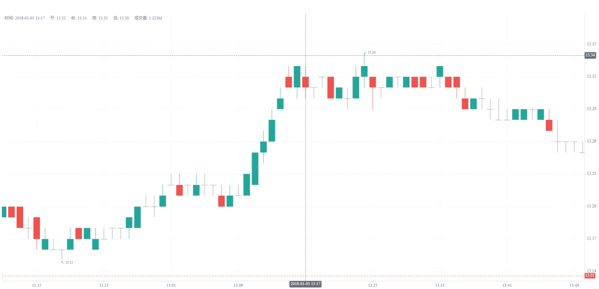

# 使用 KLineChart 展示 DolphinDB K 线

[KLineChart](https://github.com/klinecharts/KLineChart) 是一款开源的简单易用，适用场景丰富的 Web 前端金融图表，可以用于渲染金融 K 线图，它基于 html5 canvas 构建，零依赖压缩包仅 40K 非常轻量。同时 KLineChart 支持多种数据源，并提供丰富的交互功能以及指标计算接口。该库高度可定制且用户友好，非常适合开发者将复杂的图表功能集成到其他金融应用程序中。

DolphinDB 身为一个高性能的数据库，不仅在存储和数据分析上具有优势，也提供了丰富的 API 接口和插件，和各种外部工具对接和集成。

DolphinDB JavaScript API 封装了操作 DolphinDB 数据库的能力，如：连接数据库、执行脚本、调用函数、上传变量、订阅流表等。利用该 API，用户可以读取 DolphinDB 数据与前端工具自由对接。本文即以对接 KLineChart 为例，展示如何读取 DolphinDB 存储的 K 线数据以快速绘制前端 K 线图。

**数据准备**

本例使用的 K 线数据通过下述示例文件 candle\_201801.csv 文件导入，以下为导入脚本：

```
t = loadText("<yourPath>/candle_201801.csv")
share t as jsTable
```

示例数据：[单只股票一个月的数据](data/displaying_the_dolphindb_k-line_with_klinechart/candle_201801.csv)

## 1. 数据类型

与前端工具的对接的主要难点在于字段的对齐，即从 DolphinDB 中读取的数据类型必须与前端工具接收的数据类型对齐，保证数据可以对接。

KLineCharts 对于对接的数据有固定的字段名和类型要求：

```
{
  // Timestamp, millisecond, required fields
  timestamp: number
  // Open price, required fields
  open: number
  // Close price, required field
  close: number
  // Highest price, required field
  high: number
  // Lowest price, required field
  low: number
  // volume, optional field
  volume: number
  // Turnover, a non-required field, if you need to display the technical indicators 'EMV' and 'AVP',
      you need to fill this field with data.
  turnover: number
}
```

从 DolphinDB 下载数据到 JavaScript 时，对应的数据类型转换关系为 **（下表仅列出部分常规类型）**：

| **DolphinDB** | **JavaScript** |
| --- | --- |
| TEMPORAL（所有时间类型）STRING/SYMBOLDECIMALCHAR | String |
| LONG | BigInt |
| DOUBLE/FLOATINT/SHORT | Number |

## 2. 环境准备

导入 KLineCharts 的 JavaScript 代码如下：

```
<head>
    <title>DolphinDB</title>
    <meta charset="utf-8">
    <script type="text/javascript"
        src="https://cdn.dolphindb.cn/vendors/klinecharts/dist/umd/klinecharts.min.js">
    </script>
</head>
```

通过模块化方式引入 DolphinDB JavaScript API 并建立与 DolphinDB 节点的连接。

```
import { DDB } from 'https://cdn.dolphindb.cn/assets/api.js;
let conn = new DDB('ws://ip:port');
```

## 3. 通过历史数据生成 K 线

通过 JavaScript API 的 `execute` 方法可以直接执行 DolphinDB 脚本。

此处使用 SQL Select 语句查出 K 线数据中绘图必要的字段 timestamp, open, high, low, close, volume, turnover。

```
conn.execute('select unixTime as timestamp, open, high, low, close, volume, turnover from jsTable');
```

DolphinDB 中上述数据字段对应的数据类型为：

| **字段** | **DolphinDB 类型** | **JavaScript 类型** |
| --- | --- | --- |
| unixTime | LONG | BigInt |
| open | DOUBLE | Number |
| high | DOUBLE | Number |
| low | DOUBLE | Number |
| close | DOUBLE | Number |
| volume | INT | Number |
| turnover | DOUBLE | Number |

可以发现 unixTime 会转换为 BigInt 类型，与 KLineChart 的 Number 类型不一致，此处需要进行一个转换。有两种转换思路：

（1）在 DolphinDB 端转换，直接转成不丢失精度的 DOUBLE 类型：

```
const re = await conn.execute('select double(unixTime) as timestamp,
    open, high, low, close, volume, turnover from jsTable');
```

（2）使用 JavaScript 脚本进行强制类型转换：

```
const re = await conn.execute('select unixTime as timestamp, open, high, low, close, volume,
    turnover from jsTable');
// 默认是 bigInt 需要转成 Number
re.data.forEach(item => {
    item.timestamp = Number(item.timestamp);
});
```

上述两种类型转换方式都可以成功绘制出 KLine 图，但在本例中，第一种方法更为高效。

KLineChart 的 applyNewData 接口适配于全量数据的渲染，因此本例中调用 `chart.applyNewData` 写入历史数据。

```
// 绘制 kline
const chart = klinecharts.init('k-line-chart');
chart.applyNewData(re.data);
```

最后绘制的效果如下：



上述完整可参考的 HTML 脚本如下：

```
<!DOCTYPE html>
<html>
<head>
    <title>DolphinDB</title>
    <meta charset="utf-8">
    <script type="text/javascript"
        src="https://cdn.dolphindb.cn/vendors/klinecharts/dist/umd/klinecharts.min.js">
    </script>
</head>
<body>
    <div id="main" style="width: 600px; height:50px;"></div>
    <div id="k-line-chart" style="height:800px;"></div>
    <script type="module">
        import { DDB } from 'https://cdn.dolphindb.cn/assets/api.js';
        // <ip:port> 需要替换成自己的 DolphinDB 节点 ip 和端口号。
        let conn = new DDB('ws://<ip:port>');
        const re = await conn.execute('select unixTime as timestamp, open, high, low, close, volume,
            turnover from jsTable');
        // 默认是 bigInt 需要转成 Number
        re.data.forEach(item => {
            item.timestamp = Number(item.timestamp);
        });
        const chart = klinecharts.init('k-line-chart');
        chart.applyNewData(re.data);
    </script>
</body>
</html>
```

## 4. 通过实时数据生成 K 线

如果通过历史数据合成 K 线，只需要将数据通过 DolphinDB SQL 查询计算，全量获取结果，然后调用该接口写入前端即可渲染展示。

如果上游接入的是实时数据源，则前端有两种方案去获取**后端**的实时数据：

* 通过 DolphinDB 的 JavaScript API 的流订阅的接口：使用 JavaScript API 的流订阅接口获取实时数据时，后端增量推送实时数据到前端，前端累积订阅数据，通过回调函数发布给 KLineChart 进行展示。该方式的优点在于后端增量推送数据，且前端有数据到来才会去回调渲染 K 线。
* 通过 SQL 的定时轮询查询获：使用 SQL 定时轮询查询获取实时数据，和基于历史数据生成 K 线类似，只是查询对象从普通表替换成了流数据表。上游数据流入流表，API 定时查询进行前端渲染。其优点在于对于不需要频繁渲染的场景，可以自行调控渲染的时间间隔，而不是每次数据更新都去渲染；其缺点是 SQL 每次都全量读取后端的数据，如果数据量大，会造成很大的延时，无法实现流订阅接口那样增量推送即时渲染效果。

对于前端数据的渲染，KLineChart 提供的函数对应了两种追加方式：

* 全量追加（较为推荐）：使用 `chart.applyNewData` 函数。添加新数据，此方法会清空图表数据，不需要额外调用clearData方法。
* 增量追加：使用 `chart.updateData` 函数。更新数据，目前只会匹配当前最后一条数据的时间戳，相同则覆盖，不同则追加。

用户可以根据各自的场景选取合适的方式实现，下文给出两种方式的实现参考。

### 4.1 流数据订阅

**解决方案**：DolphinDB 后端利用行情插件、消息中间件等实时拉取或实时合成 K 线数据，前端利用 JavaScript API 的流数据接口订阅 K 线数据。

JavaScript API 的流数据订阅示接口如下：

```
export interface StreamingParams {
    table: string
    action?: string
    handler (message: StreamingMessage): any
}
```

其中 `handler` 部分用于定义回调函数，对每次接收到的订阅数据进行处理。KLineChart 绘图逻辑可以在 `handler` 中实现。

全量追加：JavaScript API 的 message 对象维护了一个缓存所有订阅数据的接口 `message.window.data`，可以直接将该对象应用在 `chart` 上以实现实时 KLine 图像绘制。

```
handler (message) {
  chart.applyNewData(message.window.data); // 更新图表数据
}
```

增量追加：借助 chart.updateData 接口进行数据追加或更新。该接口支持最后一条数据的更新和逐条数据追加，因此对于 API 端获取的增量 Array 数据，需要用 forEach 进行遍历。调用后，KLineChart 对每新增的一条数据都去渲染一次前端的图表，其性能较全量追加的方案会略差。

```
handler (message) {
    message.data.data.forEach(function(data){
      chart.updateData(data)
    }); // 更新图表数据
}
```

如果有数据过滤或处理的需求，也可以通过 `message.data.data` 获取每个批次订阅到的数据。

上述完整可参考的 HTML 脚本如下：

```
<!DOCTYPE html>
<html>
<head>
    <title>DolphinDB</title>
    <meta charset="utf-8">
    <script type="text/javascript"
        src="https://cdn.dolphindb.cn/vendors/klinecharts/dist/umd/klinecharts.min.js">
    </script>
</head>
<body>
    <div id="main" style="width: 600px; height:50px;"></div>
    <div id="k-line-chart" style="height:800px;"></div>
    <script type="module">
        import { DDB } from 'https://cdn.dolphindb.cn/assets/api.js';
        const chart = klinecharts.init('k-line-chart');
        let allData = []; // 用于累积所有接收到的数据
        const lastData = [];
        let conn = new DDB('ws://<ip:port>', {
            autologin: true,
            username: 'admin',
            password: '123456',
            streaming: {
                table: 'st', // 替换成自己的流表名
                action: 'sub',
                // 流数据处理回调, message 的类型是 StreamingMessage
                handler (message) {
                    chart.applyNewData(message.window.data); // 更新图表数据
                    // 或者
                    // message.data.data.forEach(function(data){
                    //    chart.updateData(data)
                    //});
                }
            }
        })
        await conn.connect()
    </script>
</body>
</html>
```

执行该 HTML 脚本前，需要先创建流数据表 st：

```
t1 = select timestamp(unixTime) as ts, double(unixTime) as timestamp, open, high, low, close, volume,
    turnover from jsTable
share streamTable(1:0, ['ts', 'timestamp', 'open', 'high', 'low', 'close', 'volume', 'turnover'],
    [TIMESTAMP, DOUBLE, DOUBLE, DOUBLE, DOUBLE, DOUBLE, INT, DOUBLE]) as st
```

建立流订阅后，在 DolphinDB 后端通过 `replay` 接口模拟实时流数据回放：

注： 由于目前 JavaScript API 流订阅暂不支持设置 *offset*，默认从最新一条数据发起订阅（offset=-1）。需要前端脚本执行建立连接后，再调用 `replay` 函数进行回放。

```
// 回放流表，模拟实时数据注入
replay(inputTables=t1, outputTables=st, dateColumn=`ts, replayRate=1000, absoluteRate=true);
```

由于 `replay` 需要指定回放的时间列，该时间列必须是 DolphinDB 时间类型的数据，且 DolphinDB 的时间字段在 JavaScript 端会转换为字符串，因此不能和 KLineCharts 的时间字段共用。为此，本例额外定义了 ts 字段作为回放时间列字段。

### 4.2 SQL 定时轮询

**解决方案**：在后端接收或合成 KLine 数据，然后通过流表推送到一个键值表（按照时间去重）。前端定时查询该键值表并刷新 K 线图表。

利用 KLineChart 的 applyNewData 的特性：自动清空图表数据，不需要额外调用 `clearData` 方法。每次执行查询获取 DolphinDB 端的数据后，直接调用 `chart.applyNewData` 即可，无需再调用刷新数据的方法。

由于 JavaScript API 的执行接口是异步的，因此定时调用的函数也需要封装成异步的接口：

```
async function updateChart(conn) {
   const re = await conn.execute('select timestamp, open, high, low, close, volume, turnover from kt');
   chart.applyNewData(re.data);
}
```

前端定时查询利用 `setInterval` 函数即可实现，刷新的时间间隔根据具体的场景设置，本例由于数据源是通过 `replay` 函数每秒匀速回放的，故而采用每秒刷新一次的方案,，如果对前端刷新要求不高，可以手动调整这个参数。

```
setInterval(() => updateChart(conn), 1000)
```

上述完整可参考的 HTML 脚本如下：

```
<!DOCTYPE html>
<html>
<head>
    <title>DolphinDB</title>
    <meta charset="utf-8">
    <script type="text/javascript"
        src="https://cdn.dolphindb.cn/vendors/klinecharts/dist/umd/klinecharts.min.js">
    </script>
</head>
<body>
    <div id="main" style="width: 600px; height:50px;"></div>
    <div id="k-line-chart" style="height:800px;"></div>
    <script type="module">
        import { DDB } from 'https://cdn.dolphindb.cn/assets/api.js';
        const chart = klinecharts.init('k-line-chart');
        let conn = new DDB('ws://<ip:port>');
        await conn.connect();

        async function updateChart(conn) {
            const re = await conn.execute('select timestamp, open, high, low, close, volume,
                turnover from kt');
            chart.applyNewData(re.data);
        }
        setInterval(() => updateChart(conn), 1000)

    </script>
</body>
</html>
```

执行该 HTML 脚本前，需要先创建共享表 kt：

```
t1 = select timestamp(unixTime) as ts, double(unixTime) as timestamp, open, high, low, close, volume,
    turnover from jsTable
share streamTable(1:0, ['ts', 'timestamp', 'open', 'high', 'low', 'close', 'volume', 'turnover'],
    [TIMESTAMP, DOUBLE, DOUBLE, DOUBLE, DOUBLE, DOUBLE, INT, DOUBLE]) as st

share keyedTable(`timestamp, 1:0, ['ts', 'timestamp', 'open', 'high', 'low', 'close', 'volume',
    'turnover'], [TIMESTAMP, DOUBLE, DOUBLE, DOUBLE, DOUBLE, DOUBLE, INT, DOUBLE]) as kt
// 订阅一张实时的流表，然后写入一个 keyedTable 去维护不包含重复时间戳的数据
subscribeTable(tableName="st", actionName="sub_st", handler=kt)
```

本例中 kt 表订阅流数据表 st 的数据，对其进行时间戳去重。

建立流订阅后，在 DolphinDB 后端通过 `replay` 接口模拟实时流数据回放：

```
// 回放流表，模拟实时数据注入
replay(inputTables=t1, outputTables=st, dateColumn=`ts, replayRate=100, absoluteRate=true);
```

## 5. 总结

本文利用 DolphinDB JavaScript API 提供的脚本执行和流订阅等接口，实现了与 KLineChart 前端工具的对接。总体流程为：DolphinDB 后端合成和存储 K 线数据，JavaScript API 订阅 K 线数据并将其写入 KLineChart 的图表接口。由于 JavaScript API 接口的封装和适配，以及 KLineChart 轻量级的图表接口，该过程仅需 10 到 20 行代码即可轻松完成。

更复杂的 K 线功能请参考 KLineChart 官方文档：[Quick Start | KLineChart](https://klinecharts.com/en-US/guide/quick-start)

JavaScript API 的用法请参考 DolphinDB 官方文档：[JavaScript API](https://docs.dolphindb.cn/zh/jsdoc/js.md)

更多 DolphinDB K 线合成的教程可以参考官方教程：[基于快照行情的股票和基金 K 线合成](k.md)

## 6. 附录

本教程使用的代码文件如下：

[完整代码文件](script/displaying_the_dolphindb_k-line_with_klinechart/script.zip)

