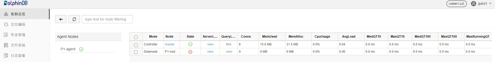
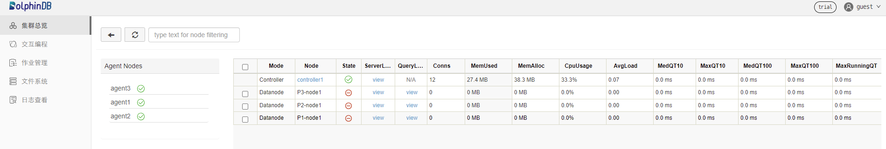

# 基于 Docker-Compose 部署 DolphinDB

`Docker Compose` 项目是 Docker 官方的开源项目，负责实现对 Docker 容器集群的快速编排。

本文介绍如何使用 `Docker Compose` 进行 DolphinDB 多容器普通集群和高可用集群的部署，以及可能出现的相关问题。

## 环境准备

* **安装 Docker**

  `Docker Compose` 基于 Docker 运行，安装 `Docker Compose` 前需要先安装 Docker。Docker 可以方便地在 Linux/Mac OS/Windows 平台上安装。安装方法请参考 [Docker 官方文档](https://www.docker.com/products/docker)。
* **安装 Docker Compose**

  本教程推荐从 [官方 GitHub Release](https://github.com/docker/compose/releases)上下载编译好的 `Docker Compose` 二进制文件。具体安装和使用方法可参考[Docker Compose 官方文档](https://docs.docker.com/compose/install/)
* **主机信息**

  + 单机版：

    | 主机名 | IP | 部署服务 | 数据盘挂载 |
    | --- | --- | --- | --- |
    | cnserver9 | xx.xx.xx.122 | dolphindb | /ddbdocker |
  + 多机版：

    | 主机名 | IP | 部署服务 | 数据盘挂载 |
    | --- | --- | --- | --- |
    | host1 | xx.xx.xx.81 | dolphindb controller1&dolphindb agent1 | /host1 |
    | host2 | xx.xx.xx.82 | dolphindb controller2&dolphindb agent2 | /host2 |
    | host3 | xx.xx.xx.83 | dolphindb controller3&dolphindb agent3 | /host3 |

## 集群结构介绍

DolphinDB 提供数据、元数据以及客户端的高可用方案，使得数据库部分节点发生故障时，依然可以正常运作，保证业务不会中断。

DolphinDB Cluster 包括四种类型节点：数据节点（datanode），计算节点（compute node），代理节点（agent）和控制节点（controller）。

* 数据节点：用于数据存储。可以在数据节点创建分布式数据库表。
* 计算节点：只用于计算，包括流计算、分布式关联、机器学习等。
* 代理节点：用于关闭或开启数据节点。
* 控制节点：用于集群元数据的管理和数据节点间任务的协调。

**注意**：

* 集群中任意一个数据节点或计算节点都可以作为客户端，进行数据读取，但是控制节点仅用于内部管理协调，不能作为任务的主入口；
* 节点的IP地址需要使用内网IP。如果使用外网地址，不能保证节点间网络通信性能。在 Docker 容器之间为了保证通讯，一般要提前设置虚拟网桥并分配虚拟 IP 地址；
* 每个物理节点必须要有一个代理节点，用于启动和关闭该物理节点上的一个或多个数据节点。

关于 DolphinDB 集群结构的更多详细介绍，请参见 [集群结构](multi_machine_cluster_deployment.html#%E9%9B%86%E7%BE%A4%E7%BB%93%E6%9E%84)

## 快速体验（单机非高可用）

该部分介绍基于 `dolphindb/dolphindb:v2.00.5` 镜像 `Docker Compose` 多容器集群部署的快速体验。由于社区版认证文件里限制了数据节点和控制节点的数量，本节只介绍部署一个控制节点的容器和一个数据节点的容器，其中 DolphinDB 的镜像版本是 `v2.00.5`。

* 登录机器，执行如下命令，创建集群：

  ```
  $ git clone https://github.com/dolphindb/dolphindb-k8s
  $ cd dolphindb_k8s/docker-compose/ddb_cluster_quick && docker-compose up -d
  ```

  预期输出

  ```
  [+] Running 2/2
   ⠿ ddb_controller Pulled                                                                                                 4.5s
   ⠿ ddb_agent1 Pulled                                                                                                     4.4s
  [+] Running 3/3
   ⠿ Network dev_ddb           Created                                                                                     0.1s
   ⠿ Container ddb_controller  Started                                                                                     0.5s
   ⠿ Container ddb_agent1      Started                                                                                     0.8s
  ```
* 在浏览器中，输入本机IP:端口号(8900)，结果如下图所示

  

## 生产环境（单机高可用）

### 部署介绍

本节通过 `Docker Compose` 在单机的多个容器中快速部署具有多个控制节点和多个数据节点的高可用集群。您可下载一个基于 `Docker Compose` 部署的具有三个控制节点和三个数据节点的 DolphinDB 高可用集群项目。本次所使用的 DolphinDB 镜像是 `v2.00.5` 。请注意，社区版不支持搭建高可用集群，企业版支持搭建高可用集群，但需要替换证书文件。

### 使用步骤

* 登录机器执行如下命令，获取项目内容：

  ```
  $ git clone https://github.com/dolphindb/dolphindb-k8s
  ```
* 执行如下命令，查看项目目录架构：

  ```
  $ cd dolphindb-k8s/docker-compose/ddb_high_cluster && tree ./
  ```

  预期输出：

  ```
  ./
  ├── cfg
  │   ├── agent1.cfg
  │   ├── agent2.cfg
  │   ├── agent3.cfg
  │   ├── cluster.cfg
  │   ├── cluster.nodes
  │   ├── controller1.cfg
  │   ├── controller2.cfg
  │   └── controller3.cfg
  ├── cluster
  │   ├── agent
  │   │   ├── data
  │   │   └── log
  │   └── controller
  │       ├── data
  │       └── log
  ├── docker-compose.yml
  └── dolphindb.lic

  8 directories, 10 files
  ```

  文件说明如下：

  | 文件（夹）名 | 文件（夹）说明 | 宿主机映射路径（相对路径） | 容器映射路径（绝对路径） |
  | --- | --- | --- | --- |
  | docker-compose.yml | 用于构建容器服务 | 无 | 无 |
  | dolphindb.lic | DolphinDB 证书文件 | ./dolphindb.lic | /data/ddb/server/dolphindb.lic |
  | cfg | 用于存储 DolphinDB 各角色相关配置文件 | ./cfg/agent1.cfg;./cfg/agent2.cfg;./cfg/agent3.cfg; ./cfg/cluster.cfg;./cfg/cluster.nodes; ./cfg/controller1.cfg;./cfg/controller2.cfg; ./cfg/controller3.cfg | /data/ddb/server/clusterDemo/config/agent1.cfg; /data/ddb/server/clusterDemo/config/agent2.cfg; /data/ddb/server/clusterDemo/config/agent3.cfg; /data/ddb/server/clusterDemo/config/cluster.cfg; /data/ddb/server/clusterDemo/config/cluster.nodes; /data/ddb/server/clusterDemo/config/controller1.cfg; /data/ddb/server/clusterDemo/config/controller2.cfg; /data/ddb/server/clusterDemo/config/controller3.cfg; |
  | cluster | 用于存储各容器所部署的 DolphinDB的 数据和日志 | ./cluster/controller/data;./cluster/controller/log; ./cluster/agent/data;./cluster/agent/log | /data/ddb/server/clusterDemo/data; /data/ddb/server/clusterDemo/log |
* 执行如下命令启动 Docker Compose 服务：

  ```
  $ docker-compose up -d
  ```

  预期输出：

  ```
  [+] Running 7/7
   ⠿ Network dev_ddb            Created                                                                                    0.2s
   ⠿ Container ddb_controller3  Started                                                                                    1.0s
   ⠿ Container ddb_controller1  Started                                                                                    1.0s
   ⠿ Container ddb_controller2  Started                                                                                    0.9s
   ⠿ Container ddb_agent3       Started                                                                                    1.9s
   ⠿ Container ddb_agent1       Started                                                                                    1.9s
   ⠿ Container ddb_agent2       Started                                                                                    1.8s
  ```
* 在浏览器中，输入本机IP:端口号(8901)，在浏览器看到如下结果，说明运行正常

  

  点击右上角登录按钮，输入用户名 admin 和密码123456登录，来启动容器服务等；
* 自定义添加、删改节点和使用高可用功能。可结合[DolphinDB高可用集群部署教程](ha_cluster_deployment.html)和[Docker Compose官方文档](https://docs.docker.com/compose/compose-file/)进行操作

  **注意**：在单机高可用版的项目中，关于配置文件中 DolphinDB 各节点ip地址所配置的是 `Docker Compose` 构建的虚拟网段中的，因此无法扩展为多机高可用集群。如要扩展成多机高可用版的集群，需要需要修改配置文件中各节点的ip信息为其所属容器的宿主机ip以实现各宿主机容器间的通信，详情见下一节。

## 生产环境（多机高可用）

### 部署介绍

本节通过 `Docker Compose` 在多个机器的多个容器中快速部署具有多个控制节点和多个数据节点的高可用集群，您可下载一个基于 `Docker Compose` 部署的具有三个控制节点和三个数据节点的 DolphinDB 高可用集群项目。本次所使用的 DolphinDB 镜像是 `v2.00.5` 。请注意，社区版不支持搭建高可用集群，企业版支持搭建高可用集群，但需要替换证书文件。

### 使用步骤

* 在三台机器上分别执行如下命令获取项目内容：

  host1:

  ```
  $ git clone https://github.com/dolphindb/dolphindb-k8s  \
  && cd dolphindb_k8s/docker-compose/ddb_high_cluster_multi_machine/host1
  ```

  host2:

  ```
  $ git clone https://github.com/dolphindb/dolphindb-k8s  \
  && cd dolphindb_k8s/docker-compose/ddb_high_cluster_multi_machine/host2
  ```

  host3:

  ```
  $ git clone https://github.com/dolphindb/dolphindb-k8s  \
  && cd dolphindb_k8s/docker-compose/ddb_high_cluster_multi_machine/host3
  ```
* 在三台机器的项目目录下，分别执行如下命令查看项目目录结构：

  ```
  $ tree ./
  ```

  预期输出：

  + host1:

    ```
    ./
    ├── cfg
    │   ├── agent1.cfg
    │   ├── cluster.cfg
    │   ├── cluster.nodes
    │   └── controller1.cfg
    ├── cluster
    │   ├── agent
    │   │   ├── data
    │   │   └── log
    │   └── controller
    │       ├── data
    │       └── log
    ├── docker-compose.yml
    └── dolphindb.lic

    8 directories, 6 files
    ```
  + host2:

    ```
    ./
    ├── cfg
    │   ├── agent2.cfg
    │   ├── cluster.cfg
    │   ├── cluster.nodes
    │   └── controller2.cfg
    ├── cluster
    │   ├── agent
    │   │   ├── data
    │   │   └── log
    │   └── controller
    │       ├── data
    │       └── log
    ├── docker-compose.yml
    └── dolphindb.lic

    8 directories, 6 files
    ```
  + host3:

    ```
    ./
    ├── cfg
    │   ├── agent3.cfg
    │   ├── cluster.cfg
    │   ├── cluster.nodes
    │   └── controller3.cfg
    ├── cluster
    │   ├── agent
    │   │   ├── data
    │   │   └── log
    │   └── controller
    │       ├── data
    │       └── log
    ├── docker-compose.yml
    └── dolphindb.lic

    8 directories, 6 files
    ```

  文件说明如下：

  | 文件（夹）名 | 文件（夹）说明 | 宿主机映射路径（相对路径） | 容器映射路径（绝对路径） |
  | --- | --- | --- | --- |
  | docker-compose.yml | 用于构建容器服务 | 无 | 无 |
  | dolphindb.lic | DolphinDB证书文件 | ./dolphindb.lic | /data/ddb/server/dolphindb.lic |
  | cfg | 用于存储 DolphinDB 各角色相关配置文件 | ./cfg/agent1.cfg;./cfg/agent2.cfg;./cfg/agent3.cfg; ./cfg/cluster.cfg;./cfg/cluster.nodes; ./cfg/controller1.cfg;./cfg/controller2.cfg; ./cfg/controller3.cfg | /data/ddb/server/clusterDemo/config/agent1.cfg; /data/ddb/server/clusterDemo/config/agent2.cfg; /data/ddb/server/clusterDemo/config/agent3.cfg; /data/ddb/server/clusterDemo/config/cluster.cfg; /data/ddb/server/clusterDemo/config/cluster.nodes; /data/ddb/server/clusterDemo/config/controller1.cfg; /data/ddb/server/clusterDemo/config/controller2.cfg; /data/ddb/server/clusterDemo/config/controller3.cfg; |
  | cluster | 用于存储各容器所部署的 DolphinDB的 数据和日志 | ./cluster/controller/data;./cluster/controller/log; ./cluster/agent/data;./cluster/agent/log | /data/ddb/server/clusterDemo/data; /data/ddb/server/clusterDemo/log |

  所部署的集群服务的各节点及其容器信息如下

  | 容器名称（唯一） | 部署服务类型 | 宿主机ip | 对应节点名称、类型、端口 |
  | --- | --- | --- | --- |
  | ddb\_controller1 | 控制节点 | xx.xx.xx.81 | controller1,controller,8901 |
  | ddb\_controller2 | 控制节点 | xx.xx.xx.82 | controller2,controller,8902 |
  | ddb\_controller3 | 控制节点 | xx.xx.xx.83 | controller3,controller,8903 |
  | ddb\_agent1 | 代理节点&数据节点 | xx.xx.xx.81 | agent1,agent,8904P1-node1,datanode,8905 |
  | ddb\_agent2 | 代理节点&数据节点 | xx.xx.xx.82 | agent2,agent,8906P2-node1,datanode,8907 |
  | ddb\_agent3 | 代理节点&数据节点 | xx.xx.xx.83 | agent3,agent,8908P3-node1,datanode,8909 |

**注意**：

* 由于在文件映射过程中，宿主机文件目录会覆盖对应容器的内容，因此在创建容器时需要确认是否保留宿主机文件夹下的 data、log 以及相关配置文件；
* 参考[DolphininDB 多服务器集群部署](multi_machine_cluster_deployment.html)中关于各服务器 IP 地址的配置，修改宿主机的 IP，需要保证宿主机之间、容器与容器之间、宿主机与容器之间可以通信。
* 在三台服务器的项目目录下（即 docker-compose.yml 文件同目录）分别执行如下命令启动服务：

  ```
  $ docker-compose up -d
  ```

  预期输出：

  + host1：

    ```
    [+] Running 3/3
     ⠿ Network dev_ddb            Created                                                                                0.1s
     ⠿ Container ddb_controller1  Started                                                                                1.7s
     ⠿ Container ddb_agent1       Started                                                                                3.3s
    ```
  + host2:

    ```
    [+] Running 3/3
     ⠿ Network dev_ddb            Created                                                                                0.1s
     ⠿ Container ddb_controller2  Started                                                                                1.4s
     ⠿ Container ddb_agent2       Started                                                                                3.2s
    ```
  + host3:

    ```
    [+] Running 3/3
     ⠿ Network dev_ddb            Created                                                                                0.1s
     ⠿ Container ddb_controller3  Started                                                                                1.7s
     ⠿ Container ddb_agent3       Started                                                                                3.4s
    ```
* 在浏览器中，输入本机IP:端口号(8901)。若界面显示如下，则说明运行正常

  

  点击右上角登录按钮，输入用户名 admin 和密码123456登录，来启动容器服务等；
* 自定义添加、删改节点和使用高可用功能。可结合[DolphinDB高可用集群部署教程](ha_cluster_deployment.html)和[Docker Compose官方文档](https://docs.docker.com/compose/compose-file/)进行操作

## 常见问题

### 如何升级 DolphinDB 版本

* 选择所需要升级的 DolphinDB 镜像，以 `dolphindb/dolphindb:v2.00.6` 为例
* 如果需要升级所有容器的 DolphinDB 版本，在 docker-compose.yml 的同级目录下找到 .env 文件，修改其有关镜像的环境变量如下

  ```
  IMAGE=dolphindb/dolphindb:v2.00.6
  ```
* 在 docker-compose.yml 所在目录下执行如下命令，重启正在运行的服务

  ```
  $ docker-compose down && docker-compose up -d
  ```

  预期输出：

  ```
  [+] Running 7/7
   ⠿ Container ddb_agent3       Removed                                                                                    1.6s
   ⠿ Container ddb_agent1       Removed                                                                                    1.6s
   ⠿ Container ddb_agent2       Removed                                                                                    1.3s
   ⠿ Container ddb_controller1  Removed                                                                                    2.7s
   ⠿ Container ddb_controller2  Removed                                                                                    2.6s
   ⠿ Container ddb_controller3  Removed                                                                                    2.6s
   ⠿ Network dev_ddb            Removed                                                                                    0.1s
  ```

### 报错及解决方案

* 报错信息如下

  ```
  but no declaration was found in the volumes section.
  ```

  此报错表示没有声明数据卷，或没有采用相对路径来映射数据卷。

  解决方案：在文件中配置数据卷名称，并采用相对路径进行文件映射。

