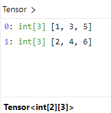
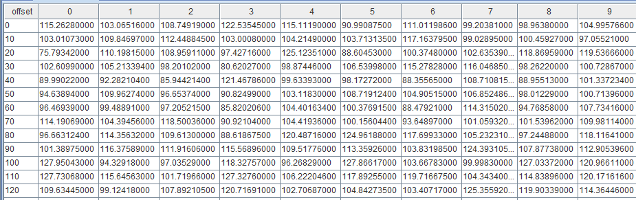
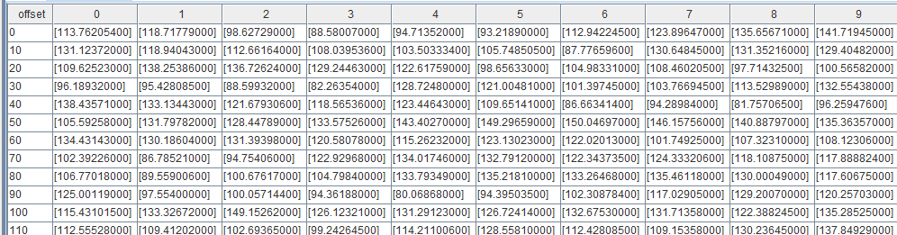

# 保存供 LibTorch 插件加载使用
traced_model.save("model.pt")
```

LibTorch 插件使用的是 2.1 版本的 LibTorch 库，为避免训练、加载和预测模型时使用的 PyTorch 版本不同导致产生兼容性问题，推荐使用
2.0 及以上版本的 PyTorch 进行模型训练。

### 2.3 Tensor 数据类型转换

LibTorch 插件要求预测的数据输入形式是 DolphinDB Tensor，可以使用 `tensor` 函数将
DolphinDB 其他的数据形式转换为 Tensor 形式，如下是具体的转换规则：

| 其他数据形式 | DolphinDB Tensor |
| --- | --- |
| Scalar | 1 维 Tensor |
| Vector | 1 维 Tensor |
| Matrix | 2 维 Tensor |
| Table | 2 维 Tensor |
| Tuple of Vector（即 Tuple 的每个元素都为 Vector） | 2 维 Tensor |
| Tuple of Matrix（即 Tuple 的每个元素都为 Matrix） | 3 维 Tensor |
| Tuple of (Tuple of Vector) | 3 维 Tensor |
| Tuple of (Tuple of (Tuple of …)) | n 维 Tensor |

```
// 标量转为 tensor
tensor(3)
/* 输出一个长度为 1 的 1 维 tensor<int[1]>:
0: int 3
*/

// 向量转为 tensor
tensor(1 2 3)
/* 输出一个长度为 3 的 1 维 tensor<int[3]>：
0: int 1
1: int 2
2: int 3
*/

//列式元组转为 tensor
tp = [[1.3,2.5,2.3], [4.1,5.3,5], [4.1,5.3,5]]
tp.setColumnarTuple!()
tensor(tp)

/* 输出一个 2 维 tensor<double[3][3]>：
0: double[3] [1.3, 2.5, 2.3]
1: double[3] [4.1, 5.3, 5]
2: double[3] [4.1, 5.3, 5]
 */
```

另外还需要注意的是，在 DolphinDB 场景中，普通的 tuple of vector 的每一个元素都是代表一列，和 Python 不同，如：

```
t = [[1,2],[3,4],[5,6]]
tensor(t)
```

`[1,2], [3,4], [5,6]` 每个分别代表一列，所以共有两行三列，转换成的 Tensor 如下：



可以使用 `setColumnarTuple!` 函数，将该 tuple of vector 转成行存储的形式，如

```
t = [[1,2],[3,4],[5,6]].setColumnarTuple!()
tensor(t)
```

这样处理后`[1,2], [3,4], [5,6]`每个分别代表一行，所以是三行两列，转换成的 Tensor 如下：


同样，如果输入的是多重嵌套的数组，且也希望按照行存储形式转换成 Tensor
时，也需要通过`setColumnarTuple!`函数处理，如下：

```
data = [[[1,2],[3,4],[5,6]], [[7,8],[9,10],[11,12]]]
tensor(data) // 按列存储方向解析，转换成 2 * 2 * 3 形状的 tensor

for (i in 0: size(data)) {
    data[i] = data[i].setColumnarTuple!()
}
tensor(data) // 按行存储方向解析，转换成 2 * 3 * 2 形状的 tensor
```

### 2.4 基础接口使用说明

LibTorch
插件主要有`load`和`predict`两个接口，用于加载模型文件和进行预测操作。

通过`load`接口加载模型文件，加载后返回一个句柄，并在会话结束时自动释放。参数
*modelPath* 是一个 STRING 类型标量，指定加载模型文件的路径。

```
model = LibTorch::load("path/model.pth")
```

通过`predict`接口进行预测，输入数据得到预测结果。

```
tensor1 = tensor([[0.7740, -1.7911], [0.0267, 0.1928]])
tensor2 = tensor([[0.0267, 0.1928], [-1.6544, 1.2538]])
ans = LibTorch::predict(model, [tensor1, tensor2], true)
```

接口`predict`的第一个参数 *model* 是加载模型得到的句柄；第二个参数 *input*
是输入数据，要求是一个 Tensor 对象或由多个 Tensor 对象组成的数组；第三个是可选参数 *parseResult*
用来指定是否解析预测结果，为 false 时`predict`接口返回 Tensor 形式的结果，默认为
true，此时返回嵌套数组形式的结果。

## 3. 案例演示

本例以预测未来股票收盘价的模型为例，来展示模型加载和预测的操作过程，脚本代码见[附录 1](#topic_aqk_zth_rdc__ol_d31_b5h_rdc)。

首先在 Python 中训练一个模型，该模型使用了 LSTM(Long Short-Term Memory)
模型，旨在根据过去的收盘价数据预测未来的股票收盘价，模型的每个输入样本只有一个特征，即股票的收盘价。模型定义脚本见[附录 2](#topic_aqk_zth_rdc__ol_d31_b5h_rdc)。

将某标的一年的收盘价数据导入到 DolphnDB server 中，之后通过该数据来预测未来的股票收盘价，导入脚本如下：

```
data_vector = float(loadText("/path/closing_prices.csv").Closing_Price)
```



定义输入数据预处理函数。

```
//模型预测需要三维结构，所以需要对输入数据做预处理
def prepareData(data_vector){
    // 对数据进行归一化操作，归一化到 [-1,1]范围
    minv = min(data_vector)
    maxv = max(data_vector)
    data_normal = 2 * ((data_vector - minv) / (maxv - minv)) - 1

    // 按照 20 大小的滑动窗口展开成3维预测数据
    input = []
    aggrJoin = defg(mutable re, data){
        re.append!(matrix(data))
        return 0
    }
    moving(aggrJoin{input}, data_normal, 20)
    return input
}
```

输入数据集预处理，并将数据转换成 Tensor 形式。

```
input_data = prepareData(data_vector)
input = tensor(input_data)
```

加载 LibTorch 模型文件，传入数据进行预测。

```
model = LibTorch::load("/path/scripted_model.pth")
output = LibTorch::predict(model, input)
```

对预测的结果做反归一化处理，得到预测的未来股票收盘价结果。

```
maxv = max(data_vector)
minv = min(data_vector)
result = (output + 1) * (maxv - minv) / 2 + minv
```



## 4. 总结

本篇文章介绍了 DolphinDB 中的 Tensor 数据形式和 LibTorch 模型推理插件使用。文章说明了如何在 DolphinDB
环境中将常规的如向量、矩阵、表等数据转换为 Tensor
形式，并将其用作模型输入以生成预测结果，提供了一个在数据库环境中完成数据查询、数据处理、模型预测的解决方案。

## 附件

1. [案例脚本.dos](script/DolphinDB_Tensor_Libtorch_tutorial/%E6%A1%88%E4%BE%8B%E8%84%9A%E6%9C%AC.dos)
2. [模型定义脚本.py](script/DolphinDB_Tensor_Libtorch_tutorial/%E6%A8%A1%E5%9E%8B%E5%AE%9A%E4%B9%89%E8%84%9A%E6%9C%AC.py)
3. 输入数据 [closing\_prices.csv](script/DolphinDB_Tensor_Libtorch_tutorial/closing_prices.csv)
4. 模型文件 [scripted\_model.pth](script/DolphinDB_Tensor_Libtorch_tutorial/scripted_model.pth)

