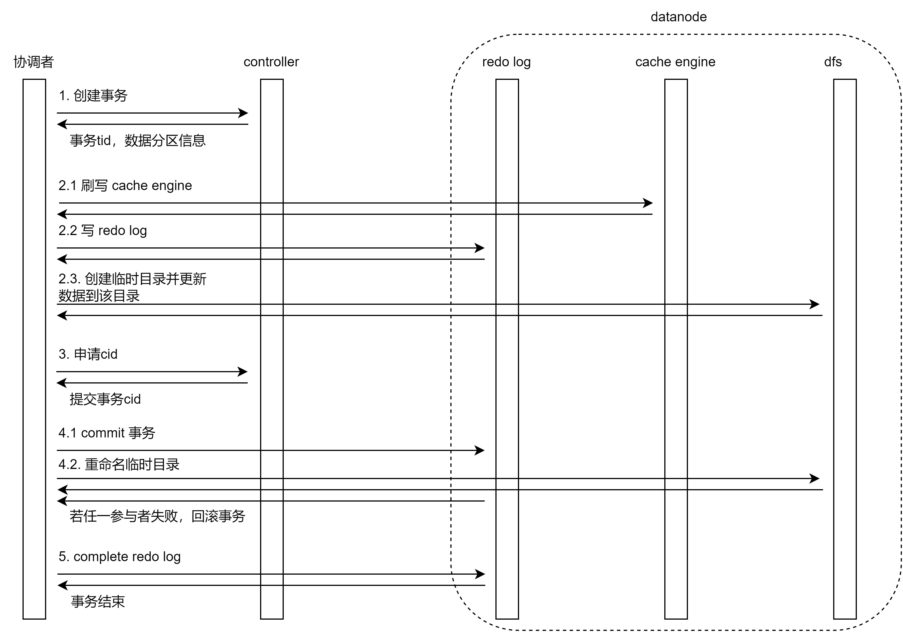

# 4.1. OLAP 存储引擎更新原理

## 4.1.1. 更新流程



分布式表数据更新过程是一个事务，采用 [两阶段提交](https://en.wikipedia.org/wiki/Two-phase_commit_protocol) 协议和 [MVCC](https://en.wikipedia.org/wiki/Multiversion_concurrency_control) 机制，OLAP 引擎数据更新的具体流程如下：

1. 向控制节点申请创建事务，控制节点会给涉及的分区加锁，并分配事务 tid，返回分区 chunk ID 等信息；
2. 判断是否开启 OLAP cache engine：

   * 如果开启了 cache engine，先刷写所有已完成的事务的缓存数据到磁盘；
   * 数据写入 redo log；
   * 在数据节点上创建事务和对应临时目录，并更新数据到该目录下。

   系统通过事务 tid 生成一个临时路径 `physicalDir_tid_tidValue`，并把数据更新到该目录下。部分文件采用硬链接优化以提升性能。

   如果未开启 cache engine，仅执行写入临时目录操作。
3. 向控制节点申请事务提交的 cid，作为提交动作的唯一标识；
4. 通知所有事务参与者提交事务：

   * 写 commit redo log 并持久化；
   * 重命名临时目录为 `physicalDir_cid`；
5. 通知所有参与者完成事务，写 complete redo log。事务失败时通过决议机制恢复，历史版本最终被回收。

## 4.1.2. 定期回收机制

系统每 60 秒会清理一定时间前的历史版本，最多保留 5 个更新版本。

## 4.1.3. 快照隔离级别

更新过程满足 ACID，通过 MVCC 实现读写分离。

查询过程中通过查找小于 cid 的最大版本满足一致性读取。

查询时可以通过以下命令查看当前版本：

```
getTabletsMeta().createCids

## 5. 数据更新实验

接下来我们通过实验来验证数据更新的基本原理，并对比分析 OLAP 和 TSDB 引擎在常见场景的性能特点。

### 5.1. 实验准备

#### 5.1.1. 部署集群

- Linux 系统

- DolphinDB v2.00.7 版本

- 单机集群部署 1 个控制节点 +1 个数据节点

- 单 SSD 硬盘，硬盘速度为 6 Gbps，文件系统为 xfs

- 开启 cache engine 和 redo log

#### 5.1.2. 创建库表和写入数据

参考[《DolphinDB 入门：物联网范例》](./iot_examples.md)第 2.3、2.4 节，创建多值模型数据库表，并写入数据。注意此处[脚本](./script/multipleValueModeWrite.txt)为异步写入，可以通过 getRecentJobs() 方法查看写入是否完成。

本实验将模拟 100 台机器 5 天的数据量，每台机器每天产生 86400 条记录，5 天总数据量为 43200000 条。OLAP 和 TSDB 引擎的基本数据和建库名如下表所示：

|              | OLAP     | TSDB     |
| ------------ | -------- | -------- |
| 占用磁盘空间 | 8.3 GB   | 8.3 G    |
| 每个分区大小 | 169 MB   | 170 MB   |
| 建库名       | olapDemo | tsdbDemo |

参考以下脚本修改[《DolphinDB 入门：物联网范例》](iot_examples.md)2.3 节的 createDatabase 函数。注意实验中需要修改 createPartitionedTable 函数的 keepDuplicates 参数值：

```python
def createDatabase(dbName,tableName, ps1, ps2, numMetrics){
	m = "tag" + string(1..numMetrics)
	schema = table(1:0,`id`datetime join m, [INT,DATETIME] join take(FLOAT,numMetrics) )
	db1 = database("",VALUE,ps1)
	db2 = database("",RANGE,ps2)
	db = database(dbName,COMPO,[db1,db2],,'TSDB')
	db.createPartitionedTable(schema,tableName,`datetime`id ,,`id`datetime, keepDuplicates=LAST)
}
```

实验的基本思路为观察执行 update 语句前后数据目录和文件的变化与上文阐述的原理是否一致。

### 5.2. OLAP 引擎更新实验

* 更新前

  首先进入到需要更新的数据所在目录，默认位置在 <HomeDir>/<nodeAlias>/storage/CHUNKS/olapDemo/20200901/1\_11/2。其中，最后的 2 为表的物理名索引。通过 tree 命令查看 machines 表的列数据文件：

  ```
  $ tree
  .
  └── 2
      └── machines_2
          ├── datetime.col
          ├── id.col
          ├── tag10.col
          ├── tag11.col
           ...
          └── tag9.col
  ```
* 执行更新

  在 GUI 执行如下脚本，对分区 20200901 下分区 1\_11 里的数据进行 20 次更新：

  ```
  machines = loadTable("dfs://olapDemo", "machines")
  for(i in 0..20)
  	update machines set tag1=i,tag5=i where id in 1..5,date(datetime)=2020.09.01
  ```

  更新过程中使用 ll 命令可以看到，命名带 tid 的中间文件夹已生成：

  ```
  $ ll
  total 20
  drwxrwxr-x 2 dolphindb dolphindb 4096 Sep  7 05:26 machines_2_115
  drwxrwxr-x 2 dolphindb dolphindb 4096 Sep  7 05:26 machines_2_116
  drwxrwxr-x 2 dolphindb dolphindb 4096 Sep  7 05:26 machines_2_117
  drwxrwxr-x 2 dolphindb dolphindb 4096 Sep  7 05:26 machines_2_118
  drwxrwxr-x 2 dolphindb dolphindb 4096 Sep  7 05:26 machines_2_119
  drwxrwxr-x 2 dolphindb dolphindb  120 Sep  7 05:26 machines_2_tid_120
  ```
* 更新后

  查看目录文件，如果没触发周期性清理旧版本，可以看到只保留了 5 个更新版本：

  ```
  $ ll
  total 20
  drwxrwxr-x 2 dolphindb dolphindb 4096 Sep  7 05:26 machines_2_121
  drwxrwxr-x 2 dolphindb dolphindb 4096 Sep  7 05:26 machines_2_122
  drwxrwxr-x 2 dolphindb dolphindb 4096 Sep  7 05:26 machines_2_123
  drwxrwxr-x 2 dolphindb dolphindb 4096 Sep  7 05:26 machines_2_124
  drwxrwxr-x 2 dolphindb dolphindb 4096 Sep  7 05:26 machines_2_125
  ```

  在触发周期性清理旧版本前，使用 ll 命令查看更新后的列数据文件，注意到只有更新的列 tag1 和 tag5 的数据文件链接数为 1，其他数据文件链接数均为 5 即硬链接。这是因为只更新了 tag1 和 tag5 的列，其他列无变化，因此直接创建了硬链接。如下所示：

  ```
  $ ll machines_2_125/
  total 169632
  -rw-rw-r-- 5 dolphindb dolphindb 3469846 Sep  7 05:15 datetime.col
  -rw-rw-r-- 5 dolphindb dolphindb   14526 Sep  7 05:15 id.col
  -rw-rw-r-- 5 dolphindb dolphindb 3469845 Sep  7 05:15 tag10.col
  -rw-rw-r-- 5 dolphindb dolphindb 3469846 Sep  7 05:15 tag11.col
  ...
  -rw-rw-r-- 1 dolphindb dolphindb 1742158 Sep  7 05:26 tag1.col
  ...
  -rw-rw-r-- 1 dolphindb dolphindb 1742158 Sep  7 05:26 tag5.col
  ...
  ```

  更新后过一段时间，发现只保留了最新的版本。这是因为系统会定时进行回收，最终只保留一个最新的副本。如下所示：

  ```
  $ ll
  total 4
  drwxrwxr-x 2 dolphindb dolphindb 4096 Sep  7 05:26 machines_2_125
  ```

### 5.3. TSDB 引擎更新实验

#### 5.3.1. keepDuplicates = LAST

* 更新前

  首先设置 createPartitionedTable 方法的 keepDuplicates 参数为 LAST，然后建库和导入数据。

  进入需要更新的数据所在的目录，默认位置在 <HomeDir>/<nodeAlias>/storage/CHUNKS/tsdbDemo/20200901/1\_11/S，最后的 S 为表的物理名索引。用 tree 命令查看 machines 表的 level file：

  ```
  $ tree
  .
  ├── chunk.dict
  └── machines_2
      ├── 0_00000010
      ├── 0_00000011
      ├── 0_00000012
      ├── 0_00000013
      ├── 0_00000014
      └── 1_00000002

  1 directory, 7 files
  ```
* 执行更新

  在 GUI 执行如下脚本，对分区 20200901 下分区 1\_11 里的数据进行 20 次更新：

  ```
  machines = loadTable("dfs://tsdbDemo", "machines")
  for(i in 0..20)
  	update machines set tag1=i,tag5=i where id in 1..5,date(datetime)=2020.09.01
  ```

  更新时或更新后，用 tree 命令查看数据文件，可见并没有生成新版本的临时目录，但 machines\_2 目录下的 level file 变多，说明 keepDuplicates =LAST 时，更新等同于追加数据。如下所示：

  ```
  $ tree
  .
  ├── chunk.dict
  └── machines_2
      ├── 0_00000010
      ├── 0_00000011
      ├── 0_00000012
      ├── 0_00000013
      ├── 0_00000014
      ├── 0_00000241
      ├── 0_00000243
       ...
      ├── 1_00000002
      ├── 1_00000050
      └── 1_00000051

  1 directory, 21 files
  ```
* 更新后

  更新后过一段时间，用 tree 命令查看数据文件，发现 level file 进行了合并。合并 level file 时，系统会自动删除更新时的冗余数据，数量由 20 个减少为 6 个。如下所示：

  ```
  tree
  .
  ├── chunk.dict
  └── machines_2
      ├── 0_00000272
      ├── 0_00000274
      ├── 0_00000276
      ├── 1_00000002
      ├── 1_00000050
      └── 1_00000051

  1 directory, 7 files
  ```

#### 5.3.2. keepDuplicates = ALL

* 更新前

  设置 createPartitionedTable 方法的 keepDuplicates 参数为 ALL，然后建库和导入数据。

  通过 tree 命令查看 machines 表的 level file：

  ```
  $ tree
  .
  ├── chunk.dict
  └── machines_2
      ├── 0_00000273
      ├── 0_00000275
      ├── 0_00000277
      ├── 0_00000278
      ├── 0_00000279
      └── 1_00000054

  1 directory, 7 files
  ```
* 执行更新

  更新过程中使用 tree 命令可以看到，有命名包含 tid 的中间文件夹生成：

  ```
  $ tree
  .
  ├── chunk.dict
  ├── machines_2
  │   ├── 0_00000273
  │   ├── 0_00000275
  │   ├── 0_00000277
  │   ├── 0_00000278
  │   ├── 0_00000279
  │   └── 1_00000054
  └── machines_2_tid_199
      ├── 0_00000515
      ├── 0_00000516
      ├── 0_00000517
      ├── 0_00000518
      └── 0_00000519
  ```
* 更新后

  使用 tree 命令，可以看到如果没触发周期性清理旧版本，则保留了 5 个更新版本，如下所示：

  ```
  $ tree
  .
  ├── chunk.dict
  ├── machines_2_215
  │   ├── 0_00000595
  │   ├── 0_00000596
  │   ├── 0_00000597
  │   ├── 0_00000598
  │   └── 0_00000599
  ├── machines_2_216
  │   ├── 0_00000600
  │   ├── 0_00000601
  │   ├── 0_00000602
  │   ├── 0_00000603
  │   └── 0_00000604
  ├── machines_2_217
  │   ├── 0_00000605
  │   ├── 0_00000606
  │   ├── 0_00000607
  │   ├── 0_00000608
  │   └── 0_00000609
  ├── machines_2_218
  │   ├── 0_00000610
  │   ├── 0_00000611
  │   ├── 0_00000612
  │   ├── 0_00000613
  │   └── 0_00000614
  └── machines_2_219
      ├── 0_00000615
      ├── 0_00000616
      ├── 0_00000617
      ├── 0_00000618
      └── 0_00000619
  ```

  在触发周期性清理旧版本前，使用 ll 查看更新后的列数据文件，注意到所有 level file 链接数均为 1，即不存在硬链接：

  ```
  $ ll machines_2_219
  total 284764
  -rw-rw-r-- 1 dolphindb dolphindb 57151251 Sep  7 05:48 0_00000615
  -rw-rw-r-- 1 dolphindb dolphindb 57151818 Sep  7 05:48 0_00000616
  -rw-rw-r-- 1 dolphindb dolphindb 58317419 Sep  7 05:48 0_00000617
  -rw-rw-r-- 1 dolphindb dolphindb 59486006 Sep  7 05:48 0_00000618
  -rw-rw-r-- 1 dolphindb dolphindb 59482644 Sep  7 05:48 0_00000619
  ```

  更新后过一段时间，发现只保留了最新的版本：

  ```
  $ tree
  .
  ├── chunk.dict
  └── machines_2_219
      ├── 0_00000615
      ├── 0_00000616
      ├── 0_00000617
      ├── 0_00000618
      └── 0_00000619

  1 directory, 6 files
  ```

#### 5.3.3. keepDuplicates = FIRST

createPartitionedTable 方法的 keepDuplicates 参数为 FIRST 时更新操作的表现与 keepDuplicates 参数为 ALL 时相同。

## 6. 性能分析

在上文实验的基础上，我们重复执行循环更新脚本，并统计耗时。

更新 1 条记录的 2 列脚本如下：

```
machines = loadTable("dfs://olapDemo", "machines")
timer update machines set tag1=1, tag5=5 where id=1 and datetime=2020.09.01T00:00:00
```

更新 20 次 分区 20200901 下分区 1\_11 里的数据，总计 432000\*20=8640000 条记录，2 列脚本如下：

```
machines = loadTable("dfs://olapDemo", "machines")
timer{
for(i in 0..20)
	update machines set tag1=i,tag5=i where id in 1..5,date(datetime)=2020.09.01
}
```

更新 20 次 分区 20200901 下分区 1\_11 里的数据，总计 432000\*20=8640000 条记录，20 列脚本如下：

```
machines = loadTable("dfs://olapDemo", "machines")
timer{
for(i in 0..20)
	update machines set tag1=i,tag2=i,tag3=i,tag4=i,tag5=i,tag6=i,tag7=i,tag8=i,tag9=i,tag10=i,tag11=i,tag12=i,tag13=i,tag14=i,tag15=i,tag16=i,tag17=i,tag18=i,tag19=i,tag20=i where id in 1..5,date(datetime)=2020.09.01
}
```

统计更新操作耗时如下表：

| 配置 | 第一次执行耗时（ms） | 第二次执行耗时（ms） | 第三次执行耗时（ms） |
| --- | --- | --- | --- |
| OLAP |  |  |  |
| 更新1条记录的2列 | 131.263 | 135.649 | 150.013 |
| 更新8640000条记录的2列 | 1,389.31 | 1,414.918 | 1,331.718 |
| 更新8640000条记录的20列 | 6,309.484 | 5,800.256 | 5,511.421 |
| TSDB，keepDuplicates=LAST |  |  |  |
| 更新1条记录的2列 | 29.745 | 31.686 | 29.333 |
| 插入1条记录 | 10.002 | 12.259 | 10.14 |
| 更新8640000条记录的2列 | 19,358.699 | 21,832.69 | 19,686.798 |
| 更新8640000条记录的20列 | 20,782.819 | 22,750.596 | 20,643.41 |
| 插入8640000条记录 | 10,813.92 | 9,506.557 | 12,695.168 |
| TSDB，keepDuplicates=ALL |  |  |  |
| 更新8640000条记录的20列 | 69,385.771 | 70,563.928 | 62,621.552 |
| TSDB，keepDuplicates=FIRST |  |  |  |
| 更新8640000条记录的20列 | 57,614.807 | 65,081.804 | 58,425.8 |

注：程序运行性能受硬件性能、系统运行状况等因素影响，该表格运行耗时仅供参考。

* 存储引擎配置为 OLAP 时

  更新性能与需要更新的列数有关，因为更新操作实现为重新生成需要更新的列，而对未更新的列使用了硬链接。故更新 20 列比更新 2 列耗时明显长。
* 存储引擎配置为 TSDB keepDuplicates=LAST 时

  性能相较 keepDuplicates=ALL 或 keepDuplicates=FIRST 更好，因为更新操作只需要向 LSM 树的追加数据，而 LSM 树具有吞吐量大的特点，写性能优异。更新性能比插入性能慢 2-3 倍，是因为更新需要先读取数据到内存，而插入不需要。
* 存储引擎配置为 TSDB keepDuplicates=ALL 或 FIRST 时

  更新性能较差，因为该配置下每次更新都会在一个新的目录产生一个新的版本，且未变化的列也会被更新，磁盘 IO 较大，故而性能较差。

综上所述，DolphinDB 只适合低频更新。使用 TSDB 引擎时，若对更新的性能有要求，建议配置 keepDuplicates=LAST。

## 7. 总结

本文对比介绍了 OLAP 和 TSDB 两种存储引擎更新分布式表数据的使用方法和基本原理，通过实验来验证基本原理，并分析了常见场景的性能问题。

OLAP 存储引擎的更新性能与需要更新的列数和操作系统是否支持硬链接有关。TSDB 存储引擎的更新性能与建表参数 keepDuplicates 有关，建表参数 keepDuplicates=LAST 比 TSDB keepDuplicates=ALL 或 FIRST 时更新性能更好。

实际应用中使用哪种引擎需要考虑更多的应用场景和实际的性能，更多详细信息可见：

* [TSDB 存储引擎](../db_distr_comp/db/tsdb.md)
* [OLAP 存储引擎](../db_distr_comp/db/olap.md)

有关上述各章节提到的函数，参考：[函数章节](../funcs/funcs_intro.md)

## 8. 附件

* [建库表脚本](script/dolphindb_update/dolphindb_update.dos)

