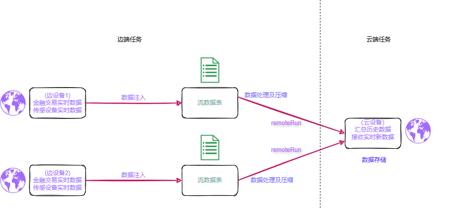

# DolphinDB 实现边到云的实时数据汇聚

边端传感器的广泛应用使得边端设备与云端之间的实时数据同步成为确保系统高效运行和支持智能决策的关键环节。通过实时数据同步，边端设备能够迅速将现场采集到的大量数据传输至云端，以便进行更深入的存储、分析和处理。这种能力在工业物联网、智能交通、智慧城市、医疗健康和智能家居等众多行业应用中至关重要。实时数据同步大幅提升了系统的响应速度，从而支持智能化决策和实时反馈，最终提升用户体验和服务质量。

在云边数据同步场景中，DolphinDB 作为一款高性能分布式时序数据库与实时计算平台，展现出独特的优势。

* DolphinDB
  具备卓越的实时数据处理能力，能够快速处理来自边端设备的大量数据，并以极低的延迟将处理结果实时同步到云端，而且可以将同步数据进行压缩提高同步效率。这对于需要实时反馈和即时决策的场景，如工业设备的预测性维护、交通流量的实时管理或智能家居设备的联动控制，尤为关键。
* 此外，DolphinDB
  的分布式架构和灵活的扩展性使其能够根据业务需求进行规模扩展，支持从小型边端设备到大规模云端集群的多种部署方式，支持同时部署云边两端并且快速同步数据。
* DolphinDB 还可以支持边端存储数据，进一步保障数据的安全。
* DolphinDB 灵活的开发模式可以使云端边端开发部署工作更轻量化。

通过
DolphinDB，企业能够实现高效的数据同步和深度分析，不仅确保从边端设备到云端的全面数据管理，还为智能化决策提供强有力的支持。这种端到端的数据处理能力，帮助企业在各类物联网和分布式应用中实现智能化转型，推动业务发展迈向新的高度。

## 1. DolphinDB 实时同步方案

DolphinDB
实现了一套模块化且具备高度扩展性的流处理架构，能够对实时数据流执行即时计算与分析。与传统的批量处理不同，流处理允许数据在到达时即刻处理，遵循时间序列进行逐条或逐批次的增量式处理，极大地提升了数据处理的时效性。这一特性使其成为实时数据同步场景的理想选择。

在 DolphinDB
中，流表的概念被引入以实现流处理框架，并依托经典的发布/订阅（Pub/Sub）模型，通过消息队列机制来完成流数据的分发与接收。当新的流数据被写入到某个节点的发布表中时，DolphinDB
立即将这些数据推送到对应的消息队列，随后由发布线程负责将数据分发至各个订阅端，确保了数据的实时传递。

本文所探讨的同步方案正是基于流表的这些特性构建的。订阅机制在 DolphinDB
中分为本地订阅和远端订阅两种形式。本地订阅方式在本地对流表进行数据整合与处理，结合数据发送机制，由此衍生出了基于

`remoteRun` 函数的同步方案。以下将详细介绍同步方案的具体设计。

本方案利用了 DolphinDB 中内置的 `remoteRun` 函数，这个函数的主要作用就是在两个 DolphinDB
服务器之间传输数据和指令。边端通过 `remoteRun` 函数将需要执行的函数代码等发送到云端，使函数在云端执行。

使用 `remoteRun` 传输数据时可以选择压缩方式，目前压缩方式有 lz4 与 zstd 压缩两种。lz4
压缩方案压缩比低，但是在云端解压快；zstd 压缩的压缩比高，但是解压速度慢。

利用流表的实时性和快速分发特性，可以有效地保证数据处理的实时性。在边端本地订阅流表，这样信息能够通过订阅动作调用 `remoteRun`
函数。边端调用 `remoteRun`
函数时，云端会生成并执行对应的函数代码，从而实现数据同步。这个方案的优势是能够在占用较少内存及网络资源的情况下完成数据同步。数据压缩，数据传输以及云端处理方案都在边端完成，实现云端轻负载。

图 1. 图1-1 云边实时数据汇聚架构模型



## 2. 同步方案实施实例

本次云边同步的实例为场区机器人巡检数据的边云同步场景。为了全面展示同步功能和性能，案例中通过 DolphinDB
脚本模拟了多种可能的情况，测试了不同数据量下的数据同步速率。测试涵盖了单次数据量从 4800 条到 144,000,000
条不等的场景，模拟实时同步与月末整合同步等不同情形。

模拟的数据为共30天的100个机器人的活动数据，总共14,400,000条数据，共3.3G。测试了从小数据量到大数据量下的多种情况下的传输效率，所有数据同时产生并进行实时同步。方案中选用具有消息队列机制的流表对数据消息进行接收与分发。机器人巡检产生的数据实时接入流表，通过流表将数据分发到订阅端。

考虑到数据的存储性能以及查找性能问题，接收端建立的分布式表采用了分区存储方案。根据 DolphinDB
的最佳性能要求，并考虑到数据存储的扩展性，将数据按照日期进行分区，提升效率。具体分区原则，请参考 [分区数据库设计和操作](database.html)。

针对该数据集的建模**，**按 detect\_time 进行日期值分区，其中 detect\_time 列按日期的值分为30个区，将机器人设备 ID
设置为排序列，以提升查询性能 。建模方案如下：

```
if (existsDatabase("dfs://Robot")) { dropDatabase("dfs://Robot") }
CREATE DATABASE "dfs://Robot" PARTITIONED BY VALUE(2020.06.01..2026.06.30) ENGINE="TSDB"
CREATE TABLE "dfs://Robot"."data" (
    device_id SYMBOL,
    error BOOL，
    detect_time TIMESTAMP,
    temp DOUBLE,
    humidity DOUBLE,
    ......
)
PARTITIONED BY detect_time
sortColumns=`device_id`detect_time

```

详细数据生成代码及字段含义见[附录1](#topic_gpx_t51_k2c)。

## 3. 同步方案的性能评估

### 3.1 测试环境资源

本次设备使用两台台服务器，一台模拟云设备，用来接收同步数据，一台模拟边缘设备，用来生成需要同步的数据。设备的硬件资源以及 DolphinDB
的配置如下表3-1，3-2所示。

图 2. 表 3-1 设备模拟

| **主机** | **说明** |
| --- | --- |
| 10.0.0.80 | 模拟云设备 |
| 10.0.0.81 | 模拟边设备1 |

* **硬件资源**

图 3. 表 3-2 硬件资源配置

| **模拟环境** | **数量** | **实际环境** | **型号/配置/软件名称/软件版本号** |
| --- | --- | --- | --- |
| 云端主机 | 1 | 物理服务器1台 | OS：Centos 7.6 |
| CPU：Intel(R) Xeon(R) Silver 4214 CPU @ 2.20GHz（48逻辑CPU核数或超线程数） |
| Mem：188 GB |
| DolphinDB: 3.00.0.1 |
| 边端主机 | 1 | 物理服务器1台 | Disk：2T SSD \* 2 500M/s ;2T HDD\*1 250M/s |
| Net：100Mbps |
| DolphinDB: 3.00.0.1 |

* **DolphinDB 配置信息**

云端设备配置信息如下所示：

```
localSite=localhost:8848:local8848
mode=single
maxMemSize=32
maxConnections=512
workerNum=4
localExecutors=3
maxBatchJobWorker=4
dataSync=1
OLAPCacheEngineSize=2
TSDBCacheEngineSize=1
newValuePartitionPolicy=add
maxPubConnections=64
subExecutors=4
perfMonitoring=true
lanCluster=0
subThrottle=1
persistenceWorkerNum=1
maxPubQueueDepthPerSite=100000000
```

为模拟边端设备资源受限的情况，本次测试边端设备配置为 4C8G，边端设备配置信息如下所示：

```
localSite=localhost:8848:local8848
mode=single
maxMemSize=8
maxConnections=512
workerNum=4
localExecutors=3
maxBatchJobWorker=4
dataSync=1
OLAPCacheEngineSize=2
TSDBCacheEngineSize=2
newValuePartitionPolicy=add
maxPubConnections=64
subExecutors=4
perfMonitoring=true
lanCluster=0
subThrottle=1
persistenceWorkerNum=1
```

### 3.2 实时同步性能测试

本方案测试 DolphinDB 在不同数据量下的同步性能，以及内存，CPU 还有网络带宽的消耗情况
。测试范围涵盖从4,800条数据到14,400,000条数据的同步，适应大部分实际应用场景。此外，方案还测试了在使用
`remoteRun` 函数时，不同压缩方式（ zstd 和
lz4）下的资源消耗和传输效率，以确定不同条件下的最优方案。

图 4. 表 3-3 测试结果汇总表

| 数据量（行） | 压缩方式 | 耗时（毫秒） | 平均每秒同步量(条/S) | CPU使用 | 内存使用（G） | 网络传输（MB/s） |
| --- | --- | --- | --- | --- | --- | --- |
| 4,800 | lz4 | 60 | 80,000 | 103% | 0.6 | 0.04 |
| zstd | 62 | 77,419 | 105% | 0.6 | 0.04 |
| 无 | 74 | 64,864 | 105% | 0.6 | 0.06 |
| 240,000 | lz4 | 1,883 | 127,456 | 120% | 0.7 | 1.22 |
| zstd | 1,720 | 139,535 | 120% | 0.7 | 0.94 |
| 无 | 2,853 | 84,122 | 120% | 0.7 | 2.12 |
| 1,920,000 | lz4 | 14,384 | 133,482 | 140% | 1.1 | 9.5 |
| zstd | 13,208 | 145,366 | 140% | 1.1 | 7.93 |
| 无 | 22,362 | 85,859 | 145% | 1.1 | 11.5 |
| 14,400,000 | lz4 | 108,529 | 132,683 | 140% | 1.7 | 10.1 |
| zstd | 98,080 | 146,819 | 140% | 1.8 | 8.85 |
| 无 | 167,579 | 85,930 | 145% | 1.3 | 11.4 |

注： 上表中的资源使用记录均为峰值

DolphinDB 可以在较大数据量下的情况下实现高效的同步，同时保持较低的内存和CPU资源消耗，能够有效节约云端资源。

从表格中可以明显看到，带压缩传输的效率以及同步速度都高于未压缩的情况。比较 lz4 和zstd 两种压缩方式可以发现，zstd
压缩的压缩比更高，但是解压时间也更长。从表中可以看到，在小数据量的情况下，由于解压缩时间过长，因此 zstd 传输效率不如 lz4 传输；数据量越大，zstd
的传输效率相比于 lz4 越快。在小数据量（4800条数据）下，各个传输方式的传输效率基本相同，且其它资源消耗也基本相同。

对比无压缩的方式与 lz4
压缩的方式，网络传输速率的峰值已经基本达到本实验设备的带宽上限。想要提升同步速度，需要提升资源分配，提高带宽配置。无压缩的方式由于完整的传输所有数据，所以消耗在传输过程中的时间更高，消耗的时间高于压缩与解压缩的时间，因此速度慢于有压缩的方式。

对于 zstd 方式，限制其同步速度的主要原因不是网络带宽，而是订阅分发速度。因此想要提升这种方式的同步速度，需要升级 DolphinDB 的配置。

具体的实现细节以及测试过程在附录说明。

## 4. 总结

本文的实时数据同步方式在实现数据同步的过程中，能够有效减轻云端的资源消耗，通过 DolphinDB
内置的带压缩传输能有显著降低传输耗时，节约带宽资源，且传输速率较快，内存等其他资源消耗小，是一种云端轻负载的同步方案。

这个方案在使用难度以及运维上对使用人员有一定的要求。这个方案需要对边端实时生成的数据进行获取后封装，通过 `remoteRun`
函数将数据发送到云端，并且可以在边端对数据进行预处理，实现边缘计算，缓解云端资源压力。这对于边端运维人员的维护成本较大，需要边端运维人员熟悉云端的数据处理方式，并且能够熟练运行
DolphinDB 的各类函数。其中关于边缘计算的实现可参考文章：[云边协同：DolphinDB 构建一体化振动监控与故障诊断解决方案](https://zhuanlan.zhihu.com/p/694447050) 。

该方案总体来说适用于边端资源充分，空闲资源较多，且云端资源紧张、带宽有限的场景。

## 附录

### 附录1：模拟数据字段说明表

| **字段名** | **字段类型** | **字段说明** |
| --- | --- | --- |
| device\_id | LONG | 机器人设备ID |
| error | BOOL | 是否报错 |
| detect\_time | TIMESTAMP | 上报时间 |
| temp | DOUBLE | 温度 |
| humidity | DOUBLE | 湿度 |
| temp\_max | DOUBLE | 设备最高温度 |
| humidity\_max | DOUBLE | 设备最高湿度 |
| trace | INT | 设备运行预设轨迹 |
| position | SYMBOL | 设备当前位置 |
| point\_one | BOOL | 是否到达点位1 |
| point\_two | BOOL | 是否到达点位2 |
| point\_three | BOOL | 是否到达点位3 |
| point\_four | BOOL | 是否到达点位4 |
| point\_five | BOOL | 是否到达点位5 |
| point\_six | BOOL | 是否到达点位6 |
| point\_seven | BOOL | 是否到达点位7 |
| point\_eight | BOOL | 是否到达点位8 |
| point\_nine | BOOL | 是否到达点位9 |
| point\_ten | BOOL | 是否到达点位10 |
| responsible | SYMBOL | 负责人 |
| create\_time | TIMESTAMP | 创建时间 |
| rob\_type | INT | 机器人类型 |
| rob\_sn | SYMBOL | 机器人出厂识别码 |
| rob\_create | TIMESTAMP | 机器人创建时间 |
| rob\_acc1 | DOUBLE | 机器人工作准确度1 |
| rob\_acc2 | DOUBLE | 机器人工作准确度2 |
| rob\_acc3 | DOUBLE | 机器人工作准确度3 |
| rob\_acc4 | DOUBLE | 机器人工作准确度4 |
| rob\_acc5 | DOUBLE | 机器人工作准确度5 |

### 附录2：同步方案的各个方式具体实现

**1. lz4 压缩**

首先继续按照上面的数据库格式创建存放数据的数据库，在发送端创建流表并订阅自己的流表并且常见 `handler`
函数，在流表有新数据写入时触发函数，函数的主要功能就是将流表中的数据，利用 `remoterRun`
函数发送到接收端并写入到接收端的数据库中，发送的数据使用 `compress` 函数进行压缩并在接收端使用
`decompress`
函数解压后写入数据库，由于订阅流表会在产生新数据过程中分段发送，因此发送耗时也需要分段记录，为此在接收端创建了保存每一段订阅数据发送耗时的数据表。相关部分主要代码如下。

云端（接收端）

```
login("admin","123456")
share streamTable(1:0,`sourceDevice`startTime`endTime`cost`rowCount,[INT,TIMESTAMP,TIMESTAMP,DOUBLE,INT]) as timeCost

colNames = `device_id`error`detect_time`temp`humidity`temp_max`humidity_max`trace`position`Point_one`point_two`point_three`point_four`point_five`point_six`point_seven`point_eight`point_nine`point_ten`responsible`create_time`rob_type`rob_sn`rob_create`rob_acc1`rob_acc2`rob_acc3`rob_acc4`rob_acc5
colTypes = [SYMBOL,BOOL,TIMESTAMP,DOUBLE,DOUBLE,DOUBLE,DOUBLE,INT,SYMBOL,BOOL,BOOL, BOOL, BOOL, BOOL, BOOL, BOOL, BOOL, BOOL, BOOL, SYMBOL, TIMESTAMP, INT, SYMBOL, TIMESTAMP, DOUBLE, DOUBLE, DOUBLE, DOUBLE, DOUBLE]

if(existsDatabase("dfs://Robot")){dropDatabase("dfs://Robot");}
data= table(1:0, colNames, colTypes)
db = database(directory = "dfs://Robot",partitionType = VALUE, partitionScheme = [today()],engine=`TSDB)
createPartitionedTable(dbHandle=db, table=data, tableName = `data, partitionColumns = `detect_time,sortColumns = `device_id`detect_time)
```

边端（发送端）

```
def pushData(ip,port,compressMethod,msg){
        pubNodeHandler1=xdb(ip,port,`admin,123456)
        StartTime=now()
        table1=select * from msg;
        y=compress(table1,compressMethod)
        remoteRun(pubNodeHandler1,'def insertTableToDatabase(y,StartTime){

                                        pt=loadTable("dfs://Robot",`data)
                                        pt.append!(decompress(y))
                                        endTime=now()
                                        duration=endTime-StartTime
                                        tmp = table([0] as c1,[StartTime] as c2,[endTime] as c3,[duration] as c4,[y.size()] as c5)
                                        timeCost.append!(tmp)
                        }')

        remoteRun(pubNodeHandler1,'insertTableToDatabase',y,StartTime)
}
ip = "xx.xx.xx.xx"
port = xxxx
compressMethod = "lz4"
subscribeTable(,`data,`pushData,0,pushData{ip,port,compressMethod},msgAsTable=true,batchSize=500000,throttle=1)
```

为了对比在不同传输数据量下不同方案的性能，通过不断改变生成的数据量并测量不同情况下的各个资源的消耗，最终结果汇总如下。

| 数据量（行\*列） | 耗时（毫秒） | 平均每秒同步量（条/s） | cpu使用（%） | 内存使用（%） | 网络传输（MB/s） |
| --- | --- | --- | --- | --- | --- |
| 4800 | 60 | 80,000 | 103% | 0.6 | 0.04 |
| 240,000 | 1,883 | 127,456 | 120% | 0.7 | 1.22 |
| 1,920,000 | 14,384 | 133,482 | 140% | 1.1 | 9.5 |
| 14,400,000 | 108,529 | 132,683 | 140% | 1.7 | 10.1 |

随着传输数据量的增加，网络带宽消耗明显增加，内存消耗以及 cpu
消耗小幅增加，其中网络传输基本到达网络传输瓶颈。可以看到网络传输速率已经基本达到本实验设备的带宽上限，想要提升同步速度，需要提升资源分配，提高带宽配置。

**2.zstd 压缩**

将压缩格式改为 zstd。`compressMethod="zstd"`

**3. 无压缩**

这部分主要是与带压缩的传输形成对比，将发送端代码替换为如下代码：

```
def pushDataNoCompress(ip,port,msg){
        pubNodeHandler1=xdb(ip,port,`admin,123456)
        StartTime=now()
        remoteRun(pubNodeHandler1,'def insertTableToDatabase(y,StartTime){

                                        pt=loadTable("dfs://Robot",`data)
                                        pt.append!(y)
                                        endTime=now()
                                        duration=endTime-StartTime
                                        tmp = table([0] as c1,[StartTime] as c2,[endTime] as c3,[duration] as c4,[y.size()] as c5)
                                        timeCost.append!(tmp)
                        }')

        remoteRun(pubNodeHandler1,'insertTableToDatabase',msg,StartTime)
}
ip = "xx.xx.xx.xx"
port = xxxx
subscribeTable(,`data,`pushData,0,pushDataNoCompress{ip,port},msgAsTable=true,batchSize=500000,throttle=1)
```

### 附录3：完整测试脚本

附件中包含云边数据同步方案测试脚本 : [云边数据同步.zip](script/edge_to_cloud/%E4%BA%91%E8%BE%B9%E6%95%B0%E6%8D%AE%E5%90%8C%E6%AD%A5.zip)

