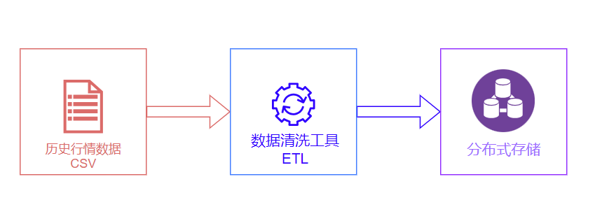
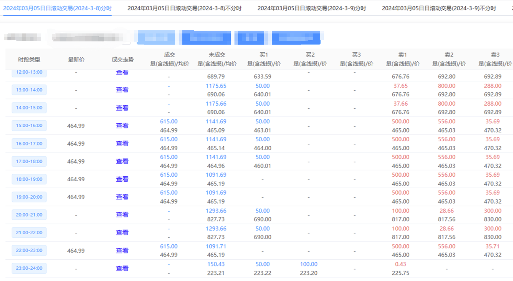
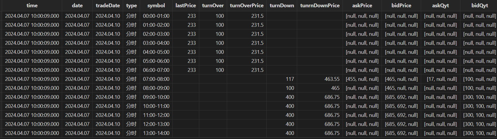
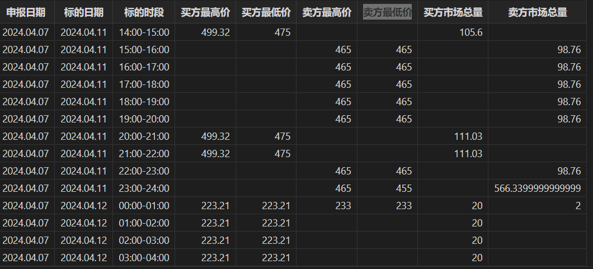

# 当电力市场碰上量化技术，如何构建高效电力交易解决方案？

在数字化浪潮的推动下，物联网技术正重塑着各领域，电力交易市场亦不例外。作为能源市场的关键一环，电力交易的效率和透明度对于保障能源系统的稳定运行和可持续发展具有重要意义。物联网技术的兴起为电力交易市场带来了精细化资源管理的新机遇。物联网通过连接数以亿计的设备和传感器，收集和交换数据，为电力交易提供了前所未有的洞察力与自动化潜力。基于此，行情数据解决方案通过集成先进的数据分析工具和算法，对电力市场的供需变化、价格波动等关键信息进行深入挖掘和分析，帮助市场参与者制定更精准的交易决策，优化电力资源配置，同时提升市场响应速度和交易效率。

本文作为电力交易市场主体信息化的开篇之作，为大家介绍如何构建高效的电力交易行情数据存储与清洗的解决方案，助力市场参与者精准理解市场动态，提升决策质量与效率。

## 1. 综述

### 1.1 电力交易简介

电力交易是指将电力作为一种商品，在电力市场中进行买卖的行为。在电力市场中，电力交易不仅包括电能量交易，还包括合同转让交易、发电权交易等。按照种类划分，电力交易可以分为中长期交易、现货交易和辅助服务交易等。

电力市场化交易通过优化资源配置，实现电力资源在时间和空间上的高效分配，从而提升电力系统的运行效率。此外，市场化交易还有助于构建公平竞争的市场环境，推动可再生能源的广泛应用。通过诸如绿色电力交易等机制，市场化交易促进了可再生能源的有效利用，为能源行业的绿色、低碳转型提供了有力支持。

目前，我国电力市场正在朝着更加市场化、绿色化和高效化的方向发展，已处于现货市场建设的关键环节。同时，市场主体多元化、交易范围扩大以及政策支持都是推动电力市场发展的重要因素。

### 1.2 电力交易中的量化交易技术

量化交易技术是一种运用数学模型和计算机算法来分析市场数据，实现交易策略自动化执行的先进交易方法。

电力交易中引入量化交易技术，能够提高交易效率、减少人为错误、快速响应市场变化、发现和利用套利机会以及执行复杂的交易策略。一套完整的量化交易大体上包含行情数据接入、数据清洗、数据存储、因子挖掘、因子相关性分析、策略回测、实盘和绩效归因等流程。

在量化交易中，行情数据是基石。电力行情包含了申报日期、标的日期、标的时段、最新价、成交量、成交均价、未成交量、未成交均价、买卖三档量价等丰富的数据，蕴藏了价格波动、市场走势和交易信号等信息。基于电力行情数据，交易员和策略研究员可以构建电力交易的量化因子，通过量化因子进行收益率预测、风险管理、投资组合构建、策略开发和市场分析等。

## 2. 电力交易行情数据管理面临的挑战

电力交易行情数据的管理面临以下挑战：

* 行情数据清洗：参与电力交易的市场主体整体信息化水平处于初级阶段，数据清洗绝大多数都是人工进行的，每一天都需要手工进行一次行情数据清洗，耗费了大量的时间。
* 行情数据存储：数据存储绝大多数都是基于 Excel。市场初期，通过 Excel 等简单工具可以勉力维持，但随着电力现货市场的常态化运行、交易流动性的持续增加以及跨省交易的不断发展，行情数据的量级会呈爆炸式增长，以 Excel 为载体便无法满足需求。
* 实时行情数据接入：现阶段，由于法律法规和信息披露的要求，电力交易中心并未向市场主体开放实时行情数据的接入接口，市场主体无法像金融市场主体一样获取实时的行情数据，只能获取到历史数据。

因此，一套高效的数据清洗、数据存储解决方案，能够极大地提高研究员的效率，更加专注于因子和策略本身。

## 3. 构建高效的电力交易解决方案

电力交易市场的行情数据是一种带时间戳的结构化数据，从划分上来说，行情数据属于时序数据。引入数据库是行情数据管理信息化最优的解决方案。

DolphinDB 作为一款基于高性能时序数据库，支持复杂分析与流处理的实时计算平台，集成了功能强大的编程语言和高吞吐率的流数据分析系统，为海量结构化数据的快速存储、检索、分析及计算提供一站式解决方案。

上述电力交易行情数据在数据清洗与存储时面对的问题，可由 DolphinDB 在存储、分析和计算上支持的以下特性，以及基于这些特性的组合使用得以解决：

* 强大的数据 ETL 工具：DolphinDB 内置1500+函数，提供了丰富的转换和清洗功能，支持数据格式化、缺失值填充、异常值处理、离散化处理、数据整合、数据过滤、聚合和排序等操作。这些功能使得电力行情数据清洗和转换变得简单而高效。
* 高效存储方式：数据分区列式存储。针对电力行情数据可采用时间 + 标的日的方式组合分区来达成灵活分区存储，对于不同分区数据可以多线程并行操作。
* 高效压缩算法：支持 lz4、Delta（delta-of-delta encoding） 压缩算法，大大提升压缩率，节约硬件资源。
* 高效排序算法：sortColumn 对分区内数据排序存储，快速定位数据在分区中的位置。



## 4. 存储方案设计

### 4.1 数据模型设计

数据模型与数据的写入、查询、更新、删除常见操作密切相关，合理的数据模型不仅能高效地表现数据中蕴藏的信息，还能极大地提升效率，在一定程度上节约硬件资源。因此，在实施整个解决方案之前，需先设计合理的数据模型。

以中长期连续运营交易为例，原始行情数据包含申报日期、标的日期、标的时段、最新价、成交量、成交均价、未成交量、未成交均价、买卖三档量价、持仓量等字段。如下表1所示：

| **字段名称** | **数据类型** | **描述** |
| --- | --- | --- |
| time | TIMESTAMP | 时间戳 |
| date | DATE | 申报日期 |
| tradeDate | DATE | 标的日期 |
| type | SYMBOL | 是否分时交易 |
| symbol | SYMBOL | 标的时段 |
| lastPrice | DOUBLE | 最新价 |
| turnOver | LONG | 成交量 |
| turnOverPrice | DOUBLE | 成交均价 |
| turnDown | LONG | 未成交量 |
| turnDownPrice | DOUBLE | 未成交均价 |
| askPrice1 | DOUBLE | 买一档价 |
| askPrice2 | DOUBLE | 买二档价 |
| askPrice3 | DOUBLE | 买三档价 |
| askVolume1 | DOUBLE | 买一档量 |
| askVolume2 | DOUBLE | 买二档量 |
| askVolume3 | DOUBLE | 买三档量 |
| bidPrice1 | DOUBLE | 卖一档价 |
| bidPrice2 | DOUBLE | 卖二档价 |
| bidPrice3 | DOUBLE | 卖三档价 |
| bidVolume1 | DOUBLE | 卖一档量 |
| bidVolume2 | DOUBLE | 卖二档量 |
| bidVolume3 | DOUBLE | 卖三档量 |

表1所示的行情数据在 DolphinDB 中有两种建模方案，第一种方案将买卖三档的量价分别用一个字段来表示，表结构如表1所示；第二种方案将买三档量、买三档价、卖三档量、卖三档价分别用一个字段来存储。

第二种建模方案的数据表结构如表2所示：

| **字段名称** | **数据类型** | **描述** |
| --- | --- | --- |
| time | TIMESTAMP | 时间戳 |
| date | DATE | 申报日期 |
| tradeDate | DATE | 标的日期 |
| type | SYMBOL | 是否分时交易 |
| symbol | SYMBOL | 标的时段 |
| lastPrice | DOUBLE | 最新价 |
| turnOver | LONG | 成交量 |
| turnOverPrice | DOUBLE | 成交均价 |
| turnDown | LONG | 未成交量 |
| turnDownPrice | DOUBLE | 未成交均价 |
| askPrice | DOUBLE[] | 买三档价 |
| askQyt | DOUBLE[] | 买三档量 |
| bidPrice | DOUBLE[] | 卖三档价 |
| bidQyt | DOUBLE[] | 卖三档量 |

第二种建模方式引入了 DolphinDB 特有的数据存储结构：Array Vector。Array Vector 是 DolphinDB 针对包含多档位信息行情数据的特点研发的一种方便、灵活且高效的数据结构。

与第一种建模方案相比，第二种方案可以显著地简化某些常用的查询与计算代码，提高存储和计算性能。

### 4.2 分区方案设计

数据库分区是将一个大型的数据表分成多个小型子表的技术，每个子表称为一个分区，每个分区可以独立地进行管理和维护。在电力行情数据存储中，对于策略研究人员来说，分区技术能缩减数据的范围，提高查询性能。此外，分区还能提高系统的并发能力与可用性等。

那么，如何对电力行情数据进行分区呢？分区的主要目的之一是提高数据库在海量数据场景下的查询性能，只有了解行情数据的使用场景和方式，才能给出合理的分区方案。一般来说，进行数据分析与因子挖掘时，通常根据申报日期、标的日期、标的时段、交易类型等条件筛选数据。

因此，分区方案如下：从申报日和标的日两个维度来进行分区，竞价日选择按天进行值分区；标的日也选择按天进行值分区。

### 4.3 压缩算法设计

对数据进行压缩时，不仅要考虑压缩率，还要兼顾解压速度。DolphinDB 内置 lz4 和 delta 两种压缩算法，根据不同类型的数据采用合适的压缩算法能极大地提升压缩率，降低存储成本。

对于 SHORT, INT, LONG, DECIMAL, 时间或日期类型数据，采用 delta 算法压缩能提升压缩率的同时保证解压速度，其余类型的数据一般建议选择 lz4 算法。

### 4.4 建库建表

综上所述，连续运营行情数据的建库建表代码如下所示：

```
create database "dfs://snapshot1" partitioned by VALUE(2024.01.01..2024.01.10),VALUE(2024.01.01..2024.01.10),engine = "TSDB"
create table "dfs://snapshot1"."data"(
    time TIMESTAMP [comment = "当前时刻",compress = "delta"],
    date DATE [comment = "当前日期",compress = "delta"],
    tradeDate DATE [comment = "标的日",compress = "delta"],
    type SYMBOL [comment = "是否分时交易"],
    symbol SYMBOL [comment = "标的时段"],
    lastPrice DOUBLE [comment = "最新价"]
    turnOver DOUBLE [comment = "成交量(含线损)"],
    turnOverPrice DOUBLE [comment = "成交均价"],
    turnDown DOUBLE [comment = "未成交量(含线损)"],
    turnDownPrice DOUBLE [comment = "未成交均价"],
    askPrice DOUBLE[] [comment = "买三档价格"],
    askQyt DOUBLE[] [comment = "买三档量"],
    bidPrice DOUBLE[] [comment = "卖三档价格"],
    bidQyt DOUBLE[] [comment = "卖三档量"]
)
partitioned by date,tradeDate,
sortColumns = ["type","symbol","time"],
keepDuplicates = ALL
```

## 5. 数据清洗与导入

电力交易中心交易平台中，连续运营交易多档行情数据界面如下图所示：



上图中包含了申报日、标的日和市场行情等信息。正常情况下，交易申报日（T 日）为周一至周三时，连续运营日滚动交易标的为 T+3日至 T+5日每日24个时段的电量；交易申报日（T 日）为周四至周五时，连续运营日滚动交易标的为 T+3日至 T+6日每日24个时段的电量。上图中，申报日为3月5日，标的日为3月8日、3月9日，3月10日。数据中没有申报日、标的日、交易类型等字段。因此在入库时，需要进行清洗，将这些字段补全。此外，还需要将买卖三档的量价数据组织成 ArrayVector 形式。

导入脚本详见附录1。在脚本中，定义了 `importData` 函数。`importData` 接收一个字符串参数 `agrs`，用于指定导入行情数据文件的存放路径。`importData` 函数将行情数据 csv 文件导入成 DolphinDB 内存表，经过一系列的数据清洗，最终转换成标准的行情数据，并落库存储。其实现步骤如下：

* 将 csv 文件数据加载到 DolphinDB 内存表
* 数据清洗，处理行情数据的量和价
* 增加申报日、标的日两个字段

行情数据导入后，在 DolphinDB 中查看数据如下图所示：



行情数据导入后，基于行情数据，可以计算一些简单的因子，如买方最高价/最低价，卖方最高价/最低价，买方市场总量，卖方市场总量等因子。如下图所示：



## 6. 展望

本文是电力交易市场主体信息化的开篇之作。后续，我们计划逐步发布一系列深入文章和教程，涵盖如何基于 DolphinDB 挖掘电力交易因子、进行因子管理、因子相关性分析，以及如何基于 DolphinDB 进行电力交易策略开发和回测等。随着电力交易市场信息化进程的持续推进和市场法规的逐步完善，我们还将探讨如何利用 DolphinDB 接入实时市场数据，以提高整个交易流程的效率和流畅性，实现市场主体信息化的全面贯通，从而打通信息化建设的“最后一公里”。

## 附录1：数据清洗导入脚本

```
def importData(filePath){
//filePath：文件路径
    schema = extractTextSchema(filePath)
    totalNum = schema.size()
    if(totalNum==13){
        schema["type"] = `STRING`DOUBLE`STRING join take(`DOUBLE,10)
    }else{
        schema["type"] = `STRING`DOUBLE`STRING join take(`DOUBLE,totalNum-3)
    }
    t = loadText(filePath,,schema)
    update t set col2 = "查看"

    //行号为奇数的是量，偶数的是价
    data = select *,rowNo(col3)+1 as RN from t[,3:11]
    //前8行为量，后8行为价
    tmp = table(matrix(select * from data where RN%2 = 1) join matrix( select * from data where RN%2 = 0))
    dropColumns!(tmp,`col8`col17)
    askAndBid = select col0 as 成交量含线损,col9 as 成交均价含线损,col1 as 未成交量含线损,col10 as 未成交均价含线损,
                        fixedLengthArrayVector(col2,col3,col4) as 买三档量,
                        fixedLengthArrayVector(col5,col6,col7) as 卖三档量,
                        fixedLengthArrayVector(col11,col12,col13) as 买三档价格,
                        fixedLengthArrayVector(col14,col15,col16) as 卖三档价格
                from tmp

    //行号为奇数的是一条
    tmp1 = select *,rowNo(col0)+1 as RN from t
    tmp2 = select col0 as 交易时段,col1 as 最新价,col2 as 趋势,col11 as 持有量,col12 as 未成交量 from tmp1 where RN%2 = 1
    tmp3 = tmp2 join askAndBid

    //为数据打上当前日期，交易日期，是否为分时用户
    Date = temporalParse(left(right(filePath,12),8),"yyyyMMdd")

    //确定连续滚动的日期范围
    if(Date in 2024.04.01..2024.04.03){
        tradeDates = Date + (3..7)
    }else if( Date in 2024.04.28..2024.04.30){
        tradeDates = Date + (3..9)
    }else if(Date == 2024.04.07){
        tradeDates = Date + (3..5)
    }else if(weekday(Date) in (1,2,3)){
        tradeDates = Date + (3..5)
    }else{
        tradeDates = Date + (3..6)
    }
    DateList = take(Date,tmp3.size())
    tradeDateList = stretch(tradeDates,tradeDates.size()*48)
    isTime = take(stretch(`分时`非分时,48),tradeDates.size()*48)
    res = table(DateList as 当前日期,tradeDateList as 交易日期,isTime as 是否分时) join tmp3
    newColumn = `当前日期`交易日期`是否分时`交易时段`最新价`成交量含线损`成交均价含线损`未成交量含线损`未成交均价含线损`买三档价格`卖三档价格`买三档量`卖三档量`持有量`未成交量`趋势
    res.reorderColumns!(newColumn)

    res = select
            take(2024.04.07T10:00:09.000,res.size()) as time,
            当前日期 as date,
            交易日期 as tradeDate,
            是否分时 as type,
            交易时段 as symbol,
            最新价 as lastPrice,
            成交量含线损 as turnOver,
            成交均价含线损 as turnOverPrice,
            未成交量含线损	as turnDown,
            未成交均价含线损 as tunrnDownPrice,
            买三档价格 as askPrice,
            卖三档价格	 as bidPrice,
            买三档量 as askQyt,
            卖三档量 as bidQyt
          from res
    pt1 = loadTable("dfs://snapshot","data")
    pt1.append!(res)
}

//文件路径
filePath = "./20240407.csv"
importData(filePath)
```

