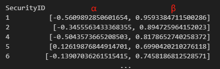
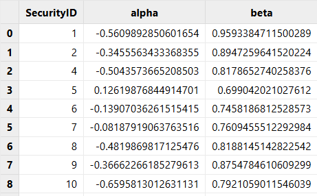

# 风险和绩效计算（Empyrical）指标库

Empyrical 库是一个由 Quantopian 开发的开源 Python
库，专门用于计算常用的金融风险和绩效归因指标。它包含了许多用于策略回测分析的工具，可以用于计算年平均回报、最大回撤、Alpha 值、Beta 值、卡玛比率、Omega
比率、夏普比率等。为了方便用户在 DolphinDB 中计算这些指标，我们使用 DolphinDB 脚本实现了 Empyrical 库中包含的指标函数，并封装在
DolphinDB Empyrical 模块中。

## 1. 函数的命名与入参规范

Empyrical 模块中的所有函数命名规则为函数具体功能名， 如
`simpleReturns`、`cumReturns`、`cumMaxDrawdown`、`calmarRatio`、`sharpeRatio`、`rollSharpeRatio`、`alpha`等。

本教程涉及到的所有字段如下：

| **参数名称 / 标准字段名称** | **参数含义** |
| --- | --- |
| prices | 收盘价 |
| returns | 日度简单回报率，非累计 |
| factorReturns | 用于比较的基准回报率/因子回报 |
| factorLoadings | 因子载荷 |

注意：

* 在 `perfAttrib` 函数中 *factorReturns* 为不同因子的因子回报，输入为多列的表格。
* 回报率，可以仅输入基准回报率向量。
* 由于 `beta` 函数与 DolphinDB 中内置关键字冲突，Empyrical 中将此函数命名为
  `covarBeta`（因为Empyrical 计算方法为 covariance / variance，DolphinDB
  的 `beta` 为 Y 在 X 上的回归系数的最小二乘估计[beta](../funcs/b/beta.html)）。
* DolphinDB 中 `maxDrawdown` 函数为与峰值的最大差值，Empyrical
  库中此函数的定义为累积最大相对回撤比例。由于命名冲突，将 Empyrical 中计算最大回撤的函数命名为
  `cumMaxDrawdown`。
* `valueAtRisk` 与 DolphinDB 中同名函数意义相同，在 Empyrical
  库中，我们采用历史模拟方法计算在险价值。由于命名冲突，将 Empyrical 中的计算在险价值的函数命名为
  `hisValueAtRisk`。

## 2. 使用范例

本章节将通过环境配置、数据准备、计算调用方法等方面具体介绍 Empyrical.dos 模块的具体用法。

### 2.1. 环境配置

把附件的 Empyrical.dos 放在 [home]/modules 目录下，[home] 目录由系统配置参数 *home* 决定，可以通过
getHomeDir() 函数查看。

有关模块使用的更多细节，请参见：[模块](tu_modules.html)。

### 2.2. 脚本中直接使用指标函数

对一个向量直接使用 Empyrical 模块中的 `sharpeRatio` 函数进行计算：

```
use Empyrical
ret = 0.072 0.0697 0.08 0.74 1.49 0.9 0.26 0.9 0.35 0.63
x = sharpeRatio(ret);
```

### 2.3. 在 SQL 语句中分组使用

用户经常需要在数据表中对多组数据在每组内进行计算。在以下例子中，我们构造了一个包含2个股票的数据表：

```
close = 7.2 6.97 7.08 6.74 6.49 5.9 6.26 5.9 5.35 5.63 3.81 3.935 4.04 3.74 3.7 3.33 3.64 3.31 2.69 2.72
date = (2023.03.02 + 0..4 join 7..11).take(20)
symbol = take(`F,10) join take(`GPRO,10)
t = table(symbol, date, close)
```

对其中每只股票使用 Empyrical 模块中的 `simpleReturns` 函数进行计算收益：

```
update t set ret = simpleReturns(close) context by symbol
```

### 2.4. 返回多个列的结果

某些函数会返回多个列的结果，例如函数 `alphaBeta`。

直接使用的例子：

```
use Empyrical

ret = 0.072 0.0697 0.08 0.74 1.49 0.9 0.26 0.9 0.35 0.63
factorret = 0.702 0.97 0.708 1.74 0.49 0.09 1.26 0.59 1.35 0.063
alpha, beta = alphaBeta(ret, factorret);
```

在 SQL 语句中使用的例子：

```
use Empyrical

ret = 0.072 0.0697 0.08 0.74 1.49 0.9 0.26 0.9 0.35 0.63 0.702 0.97 0.708 1.74 0.49 0.09 1.26 0.59 1.35 0.063
factorret = 0.702 0.97 0.708 1.74 0.49 0.09 1.26 0.59 1.35 0.063 0.072 0.0697 0.08 0.74 1.49 0.9 0.26 0.9 0.35 0.63
symbol = take(`F,10) join take(`GPRO,10)
date = (2022.03.02 + 0..4 join 7..11).take(20)
t = table(symbol as sym, date as dt, ret, factorret)
select sym,alphaBeta(ret, factorret) as `alpha`beta from t context by sym

/*
sym  alpha                beta
---- -------------------- ------------------
F    2.936093190579921E62 -0.276883617899559
F    2.936093190579921E62 -0.276883617899559
...
*/
```

## 3. 函数计算性能

本节将以 `rollSharpeRatio` 函数为例做直接使用的性能对比，同时使用真实股票日频数据对所有函数进行分组使用性能对比。

### 3.1. 直接使用性能对比

在 DolphinDB 中：

```
use Empyrical

ret= 0.072 0.0697 0.08 0.74 1.49 0.9 0.26 0.9 0.35 0.63
ret = take(ret, 10000000)
timer x = rollSharpeRatio(ret, windows =10)
```

对一个长度为 10000000 的向量直接使用 Empyrical 模块中的 `rollSharpeRatio` 函数，耗时为
300.135ms。

与之对应的 Python 代码如下：

```
import numpy as np
import empyrical as em
import time
ret = np.array([0.072, 0.0697, 0.08, 0.74, 1.49, 0.9, 0.26, 0.9, 0.35, 0.63])
ret = np.tile(ret,10000000)
start_time = time.time()
x = em.roll_sharpe_ratio(ret, 10)
print("--- %s seconds ---" % (time.time() - start_time))
```

Python `Empyrical` 库中的 `roll_sharpe_ratio` 函数耗时为
25965.46ms，是 DolphinDB Empyrical module 中的 `rollSharpeRatio` 函数的
86 倍。

### 3.2. 分组使用性能对比

* 性能测试数据为2019年1月3日至2022年7月1日全部A股的日频收益数据以及模拟因子数据及持有份额比例，总记录数为3,452,106
  条。附录提供了测试文件的部分样例数据。解压后放置于[home]下。
* 计算逻辑为按照股票代码进行分组计算各指标。
* 为了测试函数计算性能，DolphinDB 和 Python 测试代码都是单线程运行。
* 如需测试 `computeExposure`、`perfAttrib`
  函数，需额外提供风险因子及投资组合仓位数据，本教程提供模拟数据 *factors*，可以依据需要进行下载。

测试结果如下表所示：

| **序号** | **函数** | **DolphinDB耗时** | **Python耗时** | **Python/DolphinDB** |
| --- | --- | --- | --- | --- |
| 1 | simpleReturns | 190.7 ms | 5,871.1ms | 30.78 |
| 2 | aggregateReturns | 238.5 ms | 11,167.8 ms | 46.83 |
| 3 | annualReturns | 66.8 ms | 889.1ms | 13.30 |
| 4 | cumReturns | 84.7 ms | 2,758.7ms | 32.56 |
| 5 | cumReturnsFinal | 82.4 ms | 835.4ms | 10.13 |
| 6 | alpha | 131.2 ms | 6,910.7 ms | 52.67 |
| 7 | rollAlpha | 548.1 ms | 5,143.4 ms | 9.38 |
| 8 | covarBeta | 84.3ms | 5,422.9 ms | 64.32 |
| 9 | rollCovarBeta | 195.9 ms | 4,306.8 ms | 21.98 |
| 10 | alphaBeta | 112.5 ms | 6,929.8 ms | 61.59 |
| 11 | rollAlphaBeta | 547.7 ms | 8,676.7 ms | 15.84 |
| 12 | upAlphaBeta | 156.1 ms | 5,653.1 ms | 36.21 |
| 13 | downAlphaBeta | 148.6 ms | 5,722.9 ms | 38.52 |
| 14 | betaFragilityHeuristic | 262.7 ms | 12,906.5 ms | 49.14 |
| 15 | annualVolatility | 64.5 ms | 776.5 ms | 12.03 |
| 16 | rollAnnualVolatility | 136.9 ms | 2,869.9 ms | 20.96 |
| 17 | downsideRisk | 137.3 ms | 679.0 ms | 4.94 |
| 18 | hisValueAtRisk | 152.9 ms | 710.3 ms | 4.64 |
| 19 | conditionalValueAtRisk | 155.8 ms | 306.2 ms | 1.97 |
| 20 | gpdRiskEstimates | 7.3s | 26.4s | 3.61 |
| 21 | tailRatio | 235.4 ms | 1,224.2 ms | 5.20 |
| 22 | capture | 103.7 ms | 2,343.0 ms | 22.59 |
| 23 | upCapture | 165.7 ms | 4,284.7 ms | 25.69 |
| 24 | downCapture | 165.6 ms | 4,254.3 ms | 25.85 |
| 25 | upDownCapture | 232.8 ms | 7,380.0 ms | 31.70 |
| 26 | rollUpCapture | 30.1 s | 2,204.8 s | 73.33 |
| 27 | rollDownCapture | 30.4 s | 2,195.3 s | 72.32 |
| 28 | rollUpDownCapture | 53.7 s | 4,146.4 s | 77.20 |
| 29 | omegaRatio | 111.6 ms | 3,946.0 ms | 35.37 |
| 30 | cumMaxDrawdown | 99.4 ms | 500.3ms | 5.03 |
| 31 | rollCumMaxDrawdown | 1.4s | 3.1s | 2.11 |
| 32 | calmarRatio | 118.3 ms | 1,338.4 ms | 11.32 |
| 33 | sharpeRatio | 100.6 ms | 974.7 ms | 9.68 |
| 34 | rollSharpeRatio | 160.7 ms | 3,277.3 ms | 20.39 |
| 35 | excessSharpe | 103.6 ms | 2,828.9 ms | 27.31 |
| 36 | sortinoRatio | 180.5 ms | 988.8 ms | 5.47 |
| 37 | rollSortinoRatio | 287.0 ms | 3,160.3 ms | 11.01 |
| 38 | stabilityOfTimeseries | 365.5 ms | 1,707.9 ms | 4.67 |
| 39 | computeExposure | 183.6 ms | 256.5 ms | 1.39 |
| 40 | perfAttrib | 251.9 ms | 3,484.8 ms | 13.83 |

从测试结果分析可知：

* DolphinDB Empyrical module 中的函数计算性能大部分都超过了 Python Empyrical 库，最大的性能差距达到 70
  倍，普遍性能差距在 9 倍左右。

**Python pandas 测试核心代码**

```
grouped = returns.groupby('SecurityID')
cum_returns = grouped['ret'].apply(lambda x: em.cum_returns(x))
```

**DolphinDB 测试核心代码**

```
cumReturns =
    select SecurityID, DateTime, cumReturns(ret) as cumReturns
    from returns
    context by SecurityID
```

## 4. 正确性验证

基于分组使用性能对比中的测试数据和代码，验证 DolphinDB Empyrical module 中函数的计算结果是否和 Python Empyrical
库一致。

### 4.1. NULL 值的处理

若 Python Empyrical 的输入向量开始包含空值，会将空值带入函数中进行计算。Empyrical 模块采用了相同的策略。

对一个滚动/累积窗口长度为 k 的函数，每组最初的 (k-1) 个位置的结果均为空。这一点 Empyrical 模块与 Python 中 Empyrical
库的结果一致。

DolphinDB 代码与结果：

```
ret = NULL NULL 0.08 0.74 1.49 0.9 0.26 0.9 0.35 0.63 0.702 0.97 0.708 1.74
0.49 0.09 1.26 0.59 1.35 0.063
rollAnnualVolatility(ret, windows =10)

/*
[,,,,,,,,,7.107626186006128,6.650903096572676,6.445987651244765,5.4412961691126505,
7.3080574710383885,6.603612950499143,7.349681897878303,7.448075187590415,
7.475411961892134,7.649430305584855,8.584637604465316]
*/
```

Python 代码与结果：

```
ret = np.array([np.nan, np.nan, 0.08, 0.74, 1.49, 0.9, 0.26,
0.9, 0.35, 0.63, 0.702, 0.97, 0.708, 1.74, 0.49, 0.09, 1.26, 0.59, 1.35, 0.063])
print(em.roll_annual_volatility(ret,10))

/*
[7.10762619 6.6509031  6.44598765 5.44129617 7.30805747 6.60361295
 7.3496819  7.44807519 7.47541196 7.64943031 8.5846376 ]
 */
```

### 4.2. 函数输出形式优化

**结果有差异的函数：**

* `alphaBeta, upAlphaBeta, downAlphaBeta, gpdRiskEstimates`

原因：

Python Empyrical 中，`alphaBeta, upAlphaBeta, downAlphaBeta` 结果将
alpha、beta 组合为一个二维数组，后续还需要进一步的处理。如：



而在 DolphinDB 的 Empyrical 模块中，我们利用SQL查询语句可以直接将 alpha、beta 拆分为两列：

```
select SecurityID, alphaBeta(ret, factorRet) as `alpha`beta
from return1
group by SecurityID
```



对于`gpdRiskEstimates`，Python 中输出所有估计系数处于一列，如下图所示：


DolphinDB 的 Empyrical 模块中将不同估计系数分为单独的列，更方便结果展示。


## 5. 实时流计算

在DolphinDB V1.30.3
中发布的响应式状态引擎（`createReactiveStateEngine`）是许多金融场景流批统一计算中的重要构件，DolphinDB
Empyrical module 在开发时就对其做了适配，使得 Empyrical 模块中的大部分函数可以在响应式状态引擎中实现增量计算。

示例代码如下：

```
//clean environment
def cleanEnvironment(){
    try{ unsubscribeTable(tableName="inputTable",actionName="calculateEmpyrical") }
    catch(ex){ print(ex) }
    try{ dropStreamEngine("EmpyricalReactiveSateEngine") } catch(ex){ print(ex) }
    try{ dropStreamTable(`inputTable) } catch(ex){ print(ex) }
    try{ dropStreamTable(`outputTable) } catch(ex){ print(ex) }
    undef all
}
cleanEnvironment()
go

//load module
use Empyrical

//load data
schema = table(`DateTime`SecurityID`ret`factor2`factor1`factor3`position as name,
`DATE`SYMBOL`DOUBLE`DOUBLE`DOUBLE`DOUBLE`DOUBLE as type)
data=loadText(<YOUR_DIR>+"factors_data.csv" ,schema=schema)
//define stream table
share streamTable(1:0, `DateTime`SecurityID`ret`factor2`factor1`factor3`position,
`DATE`SYMBOL`DOUBLE`DOUBLE`DOUBLE`DOUBLE`DOUBLE) as inputTable
share streamTable(1:0,`SecurityID`DateTime`sortinoRatio`annualVolatility`sharpeRatio,
`SYMBOL`DATE`DOUBLE`DOUBLE`DOUBLE) as outputTable

//register stream computing engine
reactiveStateMetrics=<[
    DateTime,
    Empyrical::rollAnnualVolatility(ret) as `sortinoRatio,
    Empyrical::rollSharpeRatio(ret) as `annualVolatility,
    Empyrical::rollSortinoRatio(ret) as `sharpeRatio
]>
createReactiveStateEngine(name="EmpyricalReactiveSateEngine",
metrics=reactiveStateMetrics, dummyTable=inputTable, outputTable=outputTable,
keyColumn=`SecurityID, keepOrder=true)
subscribeTable(tableName="inputTable", actionName="calculateEmpyrical",
offset=-1, handler=getStreamEngine("EmpyricalReactiveSateEngine"),
msgAsTable=true, reconnect=true)
//replay data
submitJob("replay","replay",replay{data,inputTable,`tradedate,`tradedate,1000,true})
```

## 6. DolphinDB Empyrical 函数列表

### 6.1 收益处理类函数

| **函数** | **语法** | **解释** |
| --- | --- | --- |
| simpleReturns | simpleReturns(prices) | 简单收益 |
| aggregateReturns | aggregateReturns(returns,date, convertTo='yearly') | 按周、月或年聚合收益 |
| annualReturns | annualReturn(returns, period="daily", annualization=NULL) | 复合年增长率（CAGR） |
| cumReturns | cumReturns(returns, startingValue=0) | 简单收益的累计收益 |
| cumReturnsFinal | cumReturnsFinal(returns, startingValue=0) | 简单收益的总收益 |

### 6.2 alpha&beta类函数

| **函数** | **语法** | **解释** |
| --- | --- | --- |
| alpha | alpha(returns, factorReturns, riskFree=0.0, period="daily", annualization=NULL, beta=NULL) | 年化alpha值 |
| rollAlpha | rollAlpha(returns, factorReturns, riskFree=0.0, period="daily", annualization=NULL, windows = 10) | 滚动窗口alpha |
| covarBeta | covarBeta(returns, factorReturns, riskFree=0.0) | beta值 |
| rollCovarBeta | rollCovarBeta(returns, factorReturns, riskFree=0.0, windows = 10) | 滚动窗口beta |
| alphaBeta | alphaBeta(returns, factorReturns, riskFree=0.0, period="daily", annualization=NULL) | 年化alpha和beta值 |
| rollAlphaBeta | rollAlphaBeta(returns, factorReturns, riskFree=0.0, period="daily", annualization=NULL, windows=10) | 滚动窗口alpha和beta |
| upAlphaBeta | upAlphaBeta(returns, factorReturns, riskFree=0.0, period="daily", annualization=NULL) | 基准收益为正时期的alpha,beta |
| downAlphaBeta | downAlphaBeta(returns, factorReturns, riskFree=0.0, period="daily", annualization=NULL) | 基准收益为负时期的alpha,beta |
| betaFragilityHeuristic | betaFragilityHeuristic(returns, factorReturns) | 估计beta下降时的脆弱性 |

### 6.3 风险管理类函数

| **函数** | **语法** | **解释** |
| --- | --- | --- |
| annualVolatility | annualVolatility(returns, period="daily", annualization=NULL, alpha=2.0) | 年度波动率 |
| rollAnnualVolatility | rollAnnualVolatility(returns, period="daily", annualization=NULL, windows=10, alpha=2.0) | 滚动窗口年度波动率 |
| downsideRisk | downsideRisk(returns, requiredReturn=0.0, period="daily", annualization=NULL) | 确定一个阈值以下的下行偏差 |
| hisValueAtRisk | valueAtRisk(returns, cutoff=0.05) | 在险价值 |
| conditionalValueAtRisk | conditionalValueAtRisk(returns, cutoff=0.05) | 条件在险价值 |
| gpdRiskEstimates | gpdRiskEstimates(returns, varP=0.01) | 使用广义Pareto分布（GPD）来估计VaR和ES |
| tailRatio | tailRatio(returns) | 右尾部（95%）和左尾部（5%）之间的比率 |

### 6.4 捕获比率类函数

| **函数** | **语法** | **解释** |
| --- | --- | --- |
| capture | capture(returns, factorReturns, period="daily", annualization=NULL) | capture比率 |
| upCapture | upCapture(returns, factorReturns, period="daily", annualization=NULL) | 在基准收益为正的时期内的上行capture比率 |
| downCapture | downCapture(returns, factorReturns, period="daily", annualization=NULL) | 在基准收益为负的时期内的下行capture比率 |
| upDownCapture | upDownCapture(returns, factorReturns, period="daily", annualization=NULL) | 上行capture比率和下行capture比率的比值 |
| rollUpCapture | rollUpCapture(returns, factorReturns, windows=10, period="daily", annualization=NULL) | 滚动上行capture比率 |
| rollDownCapture | rollDownCapture(returns, factorReturns, windows=10, period="daily", annualization=NULL) | 滚动下行capture比率 |
| rollUpDownCapture | rollUpDownCapture(returns, factorReturns, windows=10, period="daily", annualization=NULL) | 滚动上行capture比率和下行capture比率的比值 |

### 6.5 风险调整收益类函数

| **函数** | **语法** | **解释** |
| --- | --- | --- |
| omegaRatio | omegaRatio(returns, period="daily", riskFree=0.0, requiredReturn=0.0, annualization=NULL) | omega比率 |
| cumMaxDrawdown | maxdrawdown(returns) | 最大回撤 |
| rollCumMaxDrawdown | rollCumMaxDrawdown(returns, windows = 10) | 滚动窗口最大回撤 |
| calmarRatio | calmarRatio(returns, period="daily", annualization=NULL) | 策略的Calmar比率，即回撤比率 |
| sharpeRatio | sharpeRatio(returns, riskFree=0.0, period="daily", annualization=NULL) | 夏普比率 |
| rollSharpeRatio | rollSharpeRatio(returns, riskFree=0.0, period="daily", annualization=NULL, windows=10) | 滚动夏普比率 |
| excessSharpe | excessSharpe(returns, factorReturns) | 超额夏普比率 |
| sortinoRatio | sortinoRatio(returns, requiredReturn=0.0, period="daily", annualization=NULL) | 索提诺比率 |
| rollSortinoRatio | rollSortinoRatio(returns, requiredReturn=0.0, period="daily", annualization=NULL, windows=10) | 滚动索提诺比率 |

### 6.6 收益稳定及绩效归因类函数

| **函数** | **语法** | **解释** |
| --- | --- | --- |
| stabilityOfTimeseries | stabilityOfTimeseries(returns) | 积累对数收益的线性拟合的R^2 |
| computeExposure | computeExposures( factorLoadings, factorColumns=`factor1`factor2`factor3, positionName=`position`position`position, dtName=`DateTime) | 每日风险因子敞口 |
| perfAttrib | perfAttrib(returns, factorReturns, factorLoadings, factorColumns=`factor1`factor2`factor3, positionName=`position`position`position, dtName=`DateTime) | 绩效归因（将投资回报归因于一组风险因素） |

## 7. 附录

[Empyrical.dos](script/empyrical/Empyrical.dos)

[samples.zip](script/empyrical/samples.zip)

