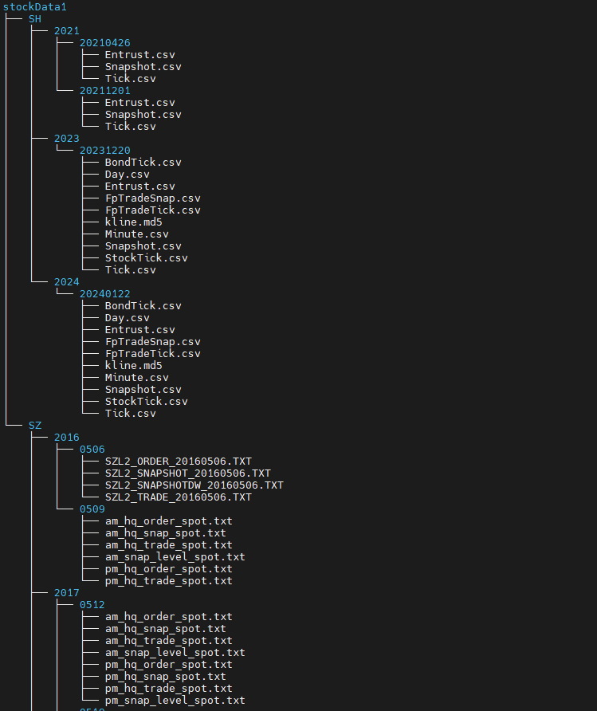
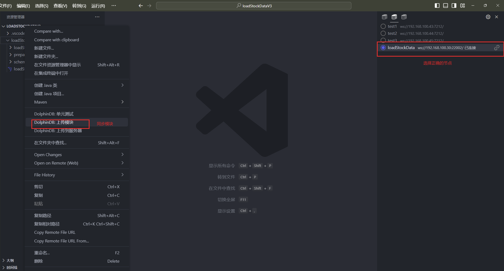
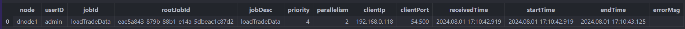
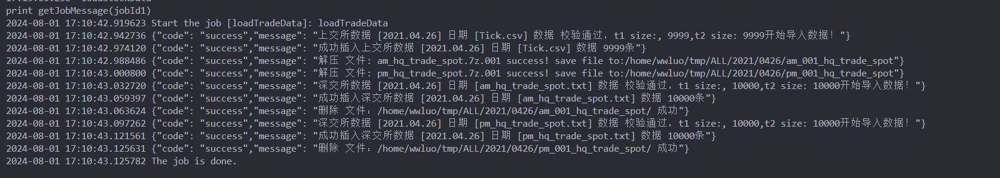
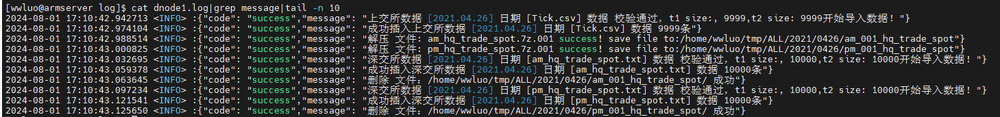
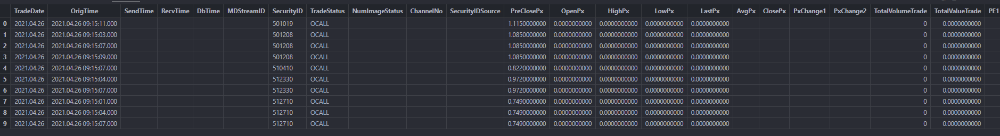
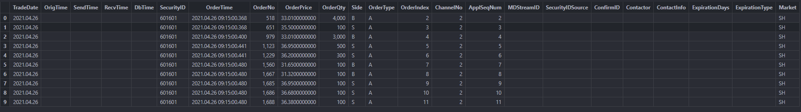
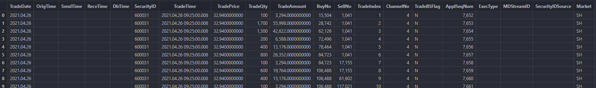
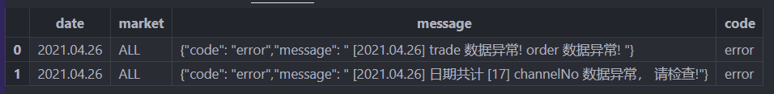

# ExchData 交易所历史股票数据自动化导入功能模块使用教程

在部署完 DolphinDB 后，需要将历史股票数据批量导入数据库，再进行数据查询、计算和分析等操作。为便于用户快速导入交易所 Level-2 历史行情数据，DolphinDB 开发了 ExchData 模块，主要用于沪深交易所 Level-2 行情原始数据的自动化导入，目前已支持的数据源包括：

* 沪深 Level-2 快照行情
* 沪深逐笔委托
* 沪深逐笔成交
* 上交所逐笔合并

**注意**：本教程代码基于 DolphinDB 2.00.11.3 开发，建议用户使用 2.00.11.3 及以上版本 。

## 1. 模块介绍

ExchData 模块主要包含预加载数据表结构、创建数据库及分区表、导入数据三部分。

### 1.1 数据表结构

*schema* 文件夹下的模块是根据本文第二章节中的合并规则整理的数据结构。该文件夹按照数据源格式，包含以下几个模块文件：

* tradeSchema 用于指定逐笔成交数据存入数据库的数据格式以及 DolphinDB 读取 CSV 文件时的数据格式。
* orderSchema 用于指定逐笔委托数据存入数据库的数据格式以及 DolphinDB 读取 CSV 文件时的数据格式。
* snapshotSchema 用于指定 Level-2 快照行情数据存入数据库的数据格式以及 DolphinDB 读取 CSV 文件时的数据格式。
* tradeOrderSchema 用于 DolphinDB 读取上交所逐笔合并数据的 CSV 文件时的数据格式。

### 1.2 创建数据库和分区表

数据库和分区表创建可参考 *createTB.dos*，其用于创建存储交易所数据的分布式库表。根据业务需求，这里对沪深股票 Level-2 高频行情数据采用一库三表的建库建表方案，分区方案如下：

表 1-1 分区方案

| **表名** | **分区方案** | **分区列** | **排序列** |
| --- | --- | --- | --- |
| trade | 时间维度按天分区+交易所 VALUE 分区 + 证券代码维度 HASH 25分区 | TradeDate、Market、SecurityID | SecurityID 和 TradeTime |
| order | 时间维度按天分区 +交易所 VALUE 分区+ 证券代码维度 HASH 25分区 | TradeDate、Market、SecurityID | SecurityID 和 OrderTime |
| snapshot | 时间维度按天分区+交易所 VALUE 分区+ 证券代码维度 HASH 25分区 | TradeDate、Market、 SecurityID | SecurityID 和 OrigTime |

### 1.3 数据导入

数据导入部分涉及 *ExchData* 文件夹和 *ExchData.dos*，作用如下：

* *ExchData* 包含了 *Order.dos* 、*Snapshot.dos*、*Trade.dos*、*TradeOrder.dos* 三个模块文件，分别用于导入沪深交易所的逐笔委托、行情快照和逐笔成交 Level-2 高频行情数据。
* *ExchData.dos* 用于导入指定目录下的所有交易所数据，是对前面所有模块的整合。

下面列出模块中的主要函数 `ExchData` 的语法和参数介绍。

**语法**

`ExchData(dbName, tbNames, filePath, startDate, endDate, dataTypes, market="ALL", tmpPath=NULL, rowCount=1000000, deleteDuplicate=true, initialTB=false, initialDB=false)`

**详情**

将 *fileDir* 路径下从 *startDate* 到 *endDate* 日期的 *dataSource* 数据导入 `dbName` 数据库中的 `tableName` 表里。

**参数**

**dbName** 字符串，数据库名称。

**tbNames** 字符串型的向量，分布式表名称。若需要导入逐笔合并数据，需要传入如 [“Order”, “Trade”] 的逐笔成交和逐笔委托表名；若需要导入其他行情数据，只需要传入导入的单一表名即可。

**filePath** 字符串，指定的存放数据的路径，需要确保和第一章的文件结构一致。

**startDate** 字符串，导入数据的起始日期，比如 2022.01.01(包括这一天)。默认值为 NULL，此时从上一个交易日开始导入。

**endDate** 字符串，导入数据的结束日期，比如 2022.12.31(包括这一天)。默认值为 NULL，此时从上一个交易日开始导入。

**dataTypes** 字符串型的向量，导入行情的数据源类型， “Snapshot”, “Order”, “Trade” 三选一或者 [“Order”, “Trade”]。

**market** 字符串，交易所，目前只能 “ALL”, “SZ”, “SH” 三选一。当 market=“ALL” 时，会将沪深的数据全部导入一张名为 tableName 的分布式表；否则，会只导入一个交易所的数据。

**tmpPath** 字符串，指定的临时文件存放路径，用于存放解压后的深交所的中间文件，解压后会将解压的临时文件删除。默认为 NULL，此时不会去解压缩，并基于指定的文件夹去识别数据文件导入数据。

**rowCount** 整数，分段写入的最高数据量。指定后会对 CSV 数据分段写入分布式库表。默认值为 0，此时全量导入数据。

**deleteDuplicate** 布尔值，表示是否需要删除数据库已导入的数据。默认值为 true，此时导入数据前不会删除库表中已存在的数据。

**initialDB** 布尔值，是否需要初始化数据库。如果已经存在名为 dbName 的数据库，当 initialDB=true 时，会删除原来的数据库并重新创建；否则会保留原来的数据库并输出 "[dbName] 数据库已经存在" 的提示。

**initialTB** 布尔值，是否需要初始化分布式表。如果在 dbName 数据库下已经存在名为 tbName 的表，当 initialTB=true 时，会删除原来的表并重新创建；否则会保留原来的表并输出 "数据库 [dbName] 已经存在表 [tbName]" 的提示。

## 2. 历史股票数据文件结构

在使用本功能模块时，需要准备解压缩后的历史股票数据文件（未解压缩的文件结构见附件），并确保在主目录下创建了对应的文件目录，不同时间段下（见第二章不同数据源的文件说明）的文件结构如下,假设最上层文件夹为 Data 文件夹，Data 文件夹下存放对应上交所（SH）、深交所（SZ）的交易所股票行情原始数据。

```
Data
└──SH
|   ├── 2015
|   │   └── 20150105
|   │      ├── Entrust.csv
|   │      ├── Snapshot.csv
|   │      └── Tick.csv
|   |      ……
|   ├── 2020
|   │   └── 20200104
|   │      ├── Entrust.csv
|   │      ├── Snapshot.csv
|   │      └── Tick.csv
|   |      ……
|   └── 2023
|      └── 20231205
|         ├── Snapshot.csv
|         └── StockTick.csv
|         ……
└──SZ
    ├── 2016
    │   └── 0506
    │   │   ├── SZL2_ORDER_20160506.TXT
    │   │   ├── SZL2_SNAPSHOT_20160506.TXT
    │   │   ├── SZL2_SNAPSHOTDW_20160506.TXT
    │   │   └── SZL2_TRADE_20160506.TXT
    │   └── 0509
    │       ├── am_hq_order_spot.txt
    │       ├── am_hq_snap_spot.txt
    │       ├── am_hq_trade_spot.txt
    │       ├── am_snap_level_spot.txt
    │       ├── pm_hq_order_spot.txt
    │       └── pm_hq_trade_spot.txt
    |      ……
```

## 3. 行情数据存储模型设计

ExchData 模块将两个交易所的数据合并为一张表，其中表中的字段是两个交易所数据字段的并集，并新增字段 *Market* 为分区列用于标识数据来自哪个交易所。

上交所和深交所两个交易所数据的结构不同，且不同时期同一个交易所的数据结构也不同。根据《深圳证券信息有限公司高频增强行情数据服务》和《上海证券交易所历史股票数据接口说明书》，我们整理了两个交易所提供的各个时期的数据结构，最终确定以下述的表结构将数据存入数据库。

### 3.1 逐笔成交数据

* 沪深交易所导入逐笔成交数据的源文件

| 交易所 | 数据说明 | 文件命名 | 文件说明 |
| --- | --- | --- | --- |
| 上海交易所 | 竞价逐笔成交数据 | Tick.csv | 原行情系统~2023.12.03,文件关闭时间以逐笔合并上线为准 |
| 竞价逐笔合并数据 | StockTick.csv | 包括新增委托订单和删除委托订单（撤单）、产品状态订 单及成交。2023.12.04 新增,文件启用时间以逐笔合并上线为准 |
| 深圳交易所 | 增强逐笔成交行情 | SZL2\_TRADE\_YYYYMMDD.txt | 原行情系统~2016.05.06 |
| 现货逐笔成交行情 | am\_hq\_trade\_spot.txt、pm\_hq\_trade\_spot.txt | 2016.05.09 至今 |

* 沪深交易所逐笔成交库表结构

| **字段含义** | **入库字段名** | **入库数据类型** | **上交所字段** | **上交所字段说明** | **深交所字段** | **深交所字段说明** |
| --- | --- | --- | --- | --- | --- | --- |
| 成交日期 | TradeDate | DATE | - |  | TradeDate |  |
| 数据生成时间 | OrigTime | TIMESTAMP | - |  | OrigTime | 2016 年 5 月 9 日新增 |
| 发送时间 | SendTime | TIMESTAMP | SendingTime | 业务时间20150803093008，精确到百分之一秒自 2021年 4 月 26 日启 | SendTime |  |
| 接收时间 | Recvtime | TIMESTAMP | - |  | Recvtime | 2016 年 5 月9 日新增 |
| 入库时间 | Dbtime | TIMESTAMP | - |  | Dbtime | 2016 年 5 月 9 日新增 |
| 证券代码 | SecurityID | SYMBOL | SecurityID |  | SecurityID |  |
| 成交时间 | TradeTime | TIMESTAMP | TradeTime | 业务时间 2015112309163002 ，精确到百分之一秒 | TradeTime |  |
| 成交价格 | TradePrice | DOUBLE | TradePrice |  | Price |  |
| 成交量 | TradeQty | INT | TradeQty |  | TradeQty |  |
| 成交金额 | TradeAmount | DOUBLE | TradeAmount |  | - |  |
| 买方订单号 | BuyNo | LONG | BuyNo |  | BidApplSeqNum |  |
| 卖方订单号 | SellNo | LONG | SellNo |  | OfferApplSeqNum |  |
| 成交序号 | TradeIndex | INT | TradeIndex |  |  |  |
| 频道代码 | ChannelNo | INT | ChannelNo |  | ChannelNo |  |
| 内外盘标志 | TradeBSFlag | SYMBOL | TradeBSFlag | 内外盘标志： B – 外盘，主动买 S – 内盘，主动卖 N – 未知 |  |  |
| 业务序列号 | ApplSeqNum | LONG | BizIndex | 业务序列号 与竞价逐笔委托消息合并后 的连续编号，从 1 开始，按Channel 连续 | ApplSeqNum |  |
| 成交类别 | ExecType | SYMBOL | - |  | ExecType | 4＝撤消F=成交 |
| 行情类别 | MDStreamID | SYMBOL | - |  | MDStreamID | MDStreamID=0112016 年 5 月 9 日新增 |
| 证券代码源 | SecurityIDSource | SYMBOL | - |  | SecurityIDSource | 102 = 深圳证券交易所2016 年 5 月 9 日新增 |
| 交易所名称 | Market | SYMBOL | - | 取值为SH | - | 取值为SZ |

### 3.2 逐笔委托数据

* 沪深交易所导入逐笔委托数据的源文件列表

| 交易所 | 数据说明 | 文件命名 | 文件说明 |
| --- | --- | --- | --- |
| 上海交易所 | 竞价逐笔委托数据 | Entrust.csv | 原行情系统~2023.12.03,文件关闭时间以逐笔合并上线为准 |
| 竞价逐笔合并数据 | StockTick.csv | 包括新增委托订单和删除委托订单（撤单）、产品状态订 单及成交。2023.12.04新增,文件启用时间以逐笔合并上线为准 |
| 深圳交易所 | 增强逐笔委托行情 | SZL2\_ORDER\_YYYYMMDD.txt | 原行情系统~2016.05.06 |
| 现货逐笔委托行情 | am\_hq\_order\_spot.txt、pm\_hq\_order\_spot.txt | 2016.05.09至今 |

* 沪深交易所逐笔委托库表结构

| **字段含义** | **入库字段名** | **入库数据类型** | **上交所字段** | **上交所字段说明** | **深交所字段** | **深交所字段说明** |
| --- | --- | --- | --- | --- | --- | --- |
| 成交日期 | TradeDate | DATE |  |  | TradeDate |  |
| 数据生成时间 | OrigTime | TIMESTAMP |  |  | OrigTime | 交易所数据生成时间2016年5月9日新增 |
| 发送时间 | SendTime | TIMESTAMP |  |  | SendTime |  |
| 接收时间 | Recvtime | TIMESTAMP |  |  | Recvtime | 2016年5月9日新增 |
| 入库时间 | Dbtime | TIMESTAMP |  |  | Dbtime | 2016年5月9日新增 |
| 证券代码 | SecurityID | SYMBOL | SecurityID |  | SecurityID |  |
| 委托时间 | OrderTime | TIMESTAMP | TransactTime | 如 20150803093008000 精确到毫秒 | TransactTime |  |
| 委托订单号 | OrderNo | INT | OrderNo |  |  |  |
| 委托价格（元） | OrderPrice | DOUBLE | Price |  | Price |  |
| 委托数量 | OrderQty | INT | Balance | 剩余的委托数量 | OrderQty | 相对于上交所，该字段为总委托数量 |
| 已成交的委托数量 | TradeMoney | INT | TradeQty | 逐笔合并新增字段，用以区分Balance，表明成交的委托数量 |  |  |
| 买卖标志 | Side | SYMBOL | OrderBSFlag | 对于委托订单： B – 买单 S – 卖单 | Side | 1＝买，2＝卖G=借入，F＝借出 |
| 订单类别 | OrderType | SYMBOL | OrdType | 订单类型A – 新增委托订单D – 删除委托订单，即撤单 | OrderType | 1=市价，2＝限价，U＝本方最优 |
| 委托序号 | OrderIndex | INT | OrderIndex | 从 1 开始，按 Channel 连 |  |  |
| 频道代码 | ChannelNo | INT | ChannelNo | 通道 | ChannelNo | 证券集代号 |
| 业务序列号 | ApplSeqNum | LONG | BizIndex | 业务序列号 与竞价逐笔成交消息合并后的连续编号，从 1 开始，按Channel 连续 | ApplSeqNum | 消息ID |
| 行情类别 | MDStreamID | SYMBOL |  |  | MDStreamID | 2016年5月9日新增 |
| 证券代码源 | SecurityIDSource | SYMBOL |  |  | SecurityIDSource | 102 = 深圳证券交易所2016年5月9日新增 |
| 定价行情约定号 | ConfirmID | INT |  |  | ConfirmID | 2016年5月9日新增 |
| 联系人 | Contactor | STRING |  |  | Contactor | 2016年5月9日新增 |
| 联系方式 | ContactInfo | STRING |  |  | ContactInfo | 2016年5月9日新增 |
| 期限 | ExpirationDays | INT |  |  | ExpirationDays | 2016年5月9日新增 |
| 期限类型 | ExpirationType | INT |  |  | ExpirationType | 2016年5月9日新增 |
| 交易所 | Market | SYMBOL | - | SH | - | SZ |

### 3.3 Level-2 快照数据

* 沪深交易所导入 Level-2 快照数据的源文件列表

| 交易所 | 数据说明 | 文件命名规则 | 文件说明 |
| --- | --- | --- | --- |
| 上海交易所 | Level-2 行情快照数据 | snapshot.csv | Level-2 行情快照数据的快照间隔为 3 秒或 5 秒（其中，部分指数快照间隔 为5秒，个股及部分指数快照间隔为3秒，相邻快照如果完全相同就保留第一幅）， 将全天所有证券的快照保存在同一个文件中 |
| 深圳交易所 | 证券行情快照 | SZL2\_SNAPSHOT\_YYYYMMDD.txt | 原行情系统~2016.05.06 |
| am\_hq\_snap\_spot.txt、pm\_hq\_snap\_spot.txt | 2016.05.09 至今 |
| 证券委托队列 | SZL2\_SNAPSHOTDW\_YYYYMMDD.txt | 原行情系统~2016.05.06 |
| 证券行情快照挡位 | am\_hq\_snap\_level\_spot.txt、pm\_hq\_snap\_level\_spot.txt | 2016.05.09 至今 |

* 沪深交易所 Level-2 快照行情表结构

| **字段含义** | **入库字段名** | **入库数据类型** | **上交所字段** | **上交所字段说明** | **深交所字段** | **深交所字段说明** |
| --- | --- | --- | --- | --- | --- | --- |
| 成交日期 | TradeDate | DATE |  |  | TradeDate |  |
| 数据生成时间 | OrigTime | TIMESTAMP | DateTime | 业务时间 格式如20151123091630 | OrigTime |  |
| 发送时间 | SendTime | TIMESTAMP | SendingTime | 自 2021 年 12 月 1 日启用 | SendTime |  |
| 接收时间 | Recvtime | TIMESTAMP |  |  | Recvtime |  |
| 入库时间 | Dbtime | TIMESTAMP |  |  | Dbtime |  |
| 行情类别 | MDStreamID | SYMBOL |  |  | MDStreamID |  |
| 证券代码 | SecurityID | SYMBOL | SecurityID |  | SecurityID |  |
| 交易状态 | TradeStatus | SYMBOL | InstrumentStatus | INIT 启动时段 PCALL 集中撮合时段 POSMT 连续交易时段 ENDPT 闭市时段 POSSP 停牌 |  |  |
| 快照类型 | NumImageStatus | INT | NumImageStatus | 1: 全量 2: 增量 自 2021 年12 月 1 日启用 |  |  |
| 频道代码 | ChannelNo | INT |  |  | ChannelNo |  |
| 证券代码源 | SecurityIDSource | SYMBOL |  |  | SecurityIDSource | 102 = 深圳证券交易所 |
| 昨收价 | PreClosePx | DOUBLE | PreClosePx |  | PreClosePx |  |
| 开盘价 | OpenPx | DOUBLE | OpenPx |  | OpenPx |  |
| 最高价 | HighPx | DOUBLE | HighPx |  | HighPx |  |
| 最低价 | LowPx | DOUBLE | LowPx |  | LowPx |  |
| 最新价 | LastPx | DOUBLE | LastPx |  | LastPx |  |
| 均价 | AvgPx | DOUBLE | AvgPx | 自 2021 年 12 月 1 日启用 |  |  |
| 收盘价 | ClosePx | DOUBLE | ClosePx | 自 2021 年 12 月 1 日启用 |  |  |
| 升跌1 | PxChange1 | DOUBLE |  |  | PxChange1 |  |
| 升跌2 | PxChange2 | DOUBLE |  |  | PxChange2 |  |
| 成交总量 | TotalVolumeTrade | INT | TotalVolumeTrade | 股票：股 基金：份 债券：千元面额 指数：手 | TotalVolumeTrade |  |
| 成交总金额 | TotalValueTrade | DOUBLE | TotalValueTrade | 元 | TotalValueTrade |  |
| 市盈率1 | PE1 | DOUBLE |  |  | PERatio1 |  |
| 市盈率2 | PE2 | DOUBLE |  |  | PERatio2 |  |
| 申买十价 | BidPrice | DOUBLE[10] | BidPrice |  | BidPX1/…/BidPX10 |  |
| 申买十量 | BidOrderQty | INT[10] | BidOrderQty |  | BidSize1/…/BidSize10 |  |
| 申买十实际总委托笔数 | BidNumOrders | INT[10] | BidNumOrders |  | NUMORDERS\_B1 |  |
| 买一揭示委托笔数 | BidNoOrders1 | INT |  |  | NOORDERS\_B1 |  |
| 申买一前50笔订单 | BidOrders | INT[50] | BidOrders |  | ORDERQTY\_B1 |  |
| 申卖十价 | OfferPrice | DOUBLE[10] | OfferPrice |  | OfferPX1/…/OfferPX10 |  |
| 申卖十量 | OfferOrderQty | INT[10] | OfferOrderQty |  | OfferSize1/…/OfferSize10 |  |
| 申卖十实际总委托笔数 | OfferNumOrders | INT[10] | OfferNumOrders |  | NUMORDERS\_S1 |  |
| 申卖一前50笔订单 | OfferOrders | INT[50] | OfferOrders |  | ORDERQTY\_S1 |  |
| 卖一揭示委托笔数 | OfferNoOrders1 | INT |  |  | NOORDERS\_S1 |  |
| 成交笔数 | NumTrades | INT | NumTrades |  | NumTrades |  |
| 基金T-1净值 | PreNAV | DOUBLE |  |  | PreNAV | 基金 |
| 基金实时参考净值IOPV | RealTimeNAV | DOUBLE |  |  | RealTimeNAV | 基金 |
| ETF 净值估值 | IOPV | DOUBLE | IOPV | 从 20221104 日开始 |  |  |
| 权证溢价率 | WarrantPremiumRate | DOUBLE |  |  | WarrantPremiumRate | 权证 |
| 买入总量 | TotalBidQty | INT | TotalBidQty | 股票：股 基金：份 债券：千元面额 | totalbidqty | 协议 量和价是合一个条目中 |
| 卖出总量 | TotalOfferQty | INT | TotalOfferQty | 股票：股 基金：份 债券：千元面额 | totalofferqty |  |
| 买入加权平均价 | WeightedAvgBidPx | DOUBLE | WeightedAvgBidPx |  | weightedavgbidpx | 协议 量和价是合一个条目中 |
| 卖出加权平均价 | WeightedAvgOfferPx | DOUBLE | WeightedAvgOfferPx |  | weightedavgofferpx |  |
| 买入总比数 | TotalBidNumber | INT | TotalBidNumber |  |  |  |
| 卖出总比数 | TotalOfferNumber | INT | TotalOfferNumber |  |  |  |
| 总持仓量 | TotalLongPosition | INT |  |  | TotalLongPosition |  |
| 涨停价 | UpLimitPx | DOUBLE |  |  | UpLimitPx |  |
| 跌停价 | DownLimitPx | DOUBLE |  |  | DownLimitPx |  |
| 买入成交最大等待时间 | BidTradeMaxDuration | LONG | BidTradeMaxDuration |  |  |  |
| 卖出成交最大等待时间 | OfferTradeMaxDuration | LONG | OfferTradeMaxDuration |  |  |  |
| 买方委托价位数 | NumBidOrders | LONG | NumBidOrders |  |  |  |
| 卖方委托价位数 | NumOfferOrders | LONG | NumOfferOrders |  |  |  |
| 买入撤单笔数 | WithdrawBuyNumber | LONG | WithdrawBuyNumber |  |  |  |
| 买入撤单数量 | WithdrawBuyAmount | LONG | WithdrawBuyAmount |  |  |  |
| 买入撤单金额 | WithdrawBuyMoney | DOUBLE | WithdrawBuyMoney |  |  |  |
| 卖出撤单笔数 | WithdrawSellNumber | INT | WithdrawSellNumber |  |  |  |
| 卖出撤单数量 | WithdrawSellAmount | INT | WithdrawSellAmount |  |  |  |
| 卖出撤单金额 | WithdrawSellMoney | DOUBLE | WithdrawSellMoney |  |  |  |
| ETF 申购笔 | ETFBuyNumber | INT | ETFBuyNumber |  | xwnum | 自 2024 年 01 月 04 日新增 |
| ETF 申购数量 | ETFBuyAmount | INT | ETFBuyAmount |  | xwsize | 自 2024 年 01 月 04 日新增 |
| ETF 申购金额 | ETFBuyMoney | DOUBLE | ETFBuyMoney |  |  |  |
| ETF 赎回笔数 | ETFSellNumber | INT | ETFSellNumber |  | xxnum | 自 2024 年 01 月 04 日新增 |
| ETF 赎回数量 | ETFSellAmount | INT | ETFSellAmount |  | xxsize | 自 2024 年01 月 04 日新增 |
| ETF 赎回金额 | ETFSellMoney | DOUBLE | ETFSellMoney |  |  |  |
| 消息序号 | MsgSeqNum | INT | MsgSeqNum | 自 2021 年 12 月 1 日启用 |  |  |
| 债券质押式回购品种加权平均价 | WarLowerPx | DOUBLE | WarLowerPx | 自 2021 年 12 月 1 日启 |  |  |
| 产品实时阶段 | TradingPhaseCode | SYMBOL | TradingPhaseCode | 自 2021 年 12 月 1日启用 | TradingPhaseCode | 产品所处的交易阶段代码第 0 位：S=启动（开市前）O=开盘集合竞价T=连续竞价B=休市C=收盘集合竞价E=已闭市H=临时停牌A=盘后交易V=波动性中断第 1 位：0=正常状态1=全天停牌 |
| 加权平均价涨跌 | xj | DOUBLE |  |  | xj | 自 2017 年 5月 12 日新增 |
| 昨收盘加权平均价 | xk | DOUBLE |  |  | xk | 自 2017 年 5月 12 日新增 |
| 加权平均价 | Vwap | DOUBLE |  |  | Vwap | 自 2017 年 5月 12 日新增 |

## 4. 使用示例

* 第一步：用户按照第 2 章文件结构中准备好数据。假设数据放在 */home/wwluo/data/stockData* 目录下，文件结构如下图：

  
  图 4-1 文件结构示例
  ​
* **第二步：** 将模块同步至 DolphinDB的 *getHomeDir()+/modules* 的目录下
  ​
  
  图 4-2 更新模块示例
* **第三步**：载入模块和导入数据方法如下，其中为了数据完整性以及避免执行 `shell` 函数引入安全问题，推荐基于本模块（见附录中的 ExchData.zip 文件）直接导入全量数据，若需要解压缩、分段导入，则分别需要指定`tmpPath`、`rowCount`等参数。

  ```
  use ExchData::ExchData
  go;

  // 导入逐笔成交数据 day=2021.04.26
  startDate,endDate = 2021.04.26,2021.04.26
  dbName = "dfs://TSDB_level2"
  tbName = "trade"
  dataType = "trade"
  filePath = "/home/wwluo/data/stockData/"
  tmpPath = "/home/wwluo/tmp/ALL/"
  // 沪深交易所一起导入
  market="ALL"
  // 手动解压后导入数据；如需要自动解压缩需要指定tmpPath路径
  tmpPath = NULL
  // 全量导入数据；如需要指定分段导入，指定大于0的rowCount即可
  rowCount = 0
  jobId1 = submitJob("loadTradeData","loadTradeData",
      ExchData{dbName,tbName,filePath,startDate,endDate,dataType,market,tmpPath,rowCount,false,false})
  getJobStatus(jobId1)
  print getJobMessage(jobId1)

  // 导入逐笔委托数据
  dbName = "dfs://TSDB_level2"
  tbName = "order"
  dataType = "order"
  startDate,endDate = 2021.04.26,2021.04.26
  filePath = "/home/wwluo/data/stockData/"
  tmpPath = "/home/wwluo/tmp/ALL/"
  // 沪深交易所一起导入
  market="ALL"
  // 手动解压后导入数据；如需要自动解压缩需要指定tmpPath路径
  tmpPath = NULL
  // 全量导入数据；如需要指定分段导入，指定大于0的rowCount即可
  rowCount = 0
  jobId2 = submitJob("loadOrderData","loadOrderData",
      ExchData{dbName,tbName,filePath,startDate,endDate,dataType,market,tmpPath,rowCount,false,false})
  print getJobMessage(jobId2)

  // 导入快照数据
  dbName = "dfs://TSDB_level2"
  tbName = "snapshot"
  dataType = "snapshot"
  startDate,endDate = 2021.04.26,2021.04.26
  filePath = "/home/wwluo/data/stockData/"
  // 沪深交易所一起导入
  market="ALL"
  // 手动解压后导入数据；如需要自动解压缩需要指定tmpPath路径
  tmpPath = NULL
  // 全量导入数据；如需要指定分段导入，指定大于0的rowCount即可
  rowCount = 0
  jobId3 = submitJob("loadSnapshotData","loadSnapshotData",
      ExchData{dbName,tbName,filePath,startDate,endDate,dataType,market,tmpPath,rowCount,false,false})
  print getJobMessage(jobId3)

  // 导入逐笔合并数据
  startDate,endDate = 2024.01.22,2024.01.22
  dbName = "dfs://TSDB_level2"
  tbNames = ["trade","order"]
  dataTypes = ["trade","order"]
  filePath = "/home/wwluo/data/stockData/"
  tmpPath = "/home/wwluo/tmp/ALL/"
  // 只导入上交所数据
  market="ALL"
  // 手动解压后导入数据；如需要自动解压缩需要指定tmpPath路径
  tmpPath = NULL
  // 全量导入数据；如需要指定分段导入，指定大于0的rowCount即可
  rowCount = 0
  jobId4 = submitJob("loadSHTradeOrderData","loadSHTradeOrderData",
      ExchData{dbName,tbNames,filePath,startDate,endDate,dataTypes,market,tmpPath,rowCount,false,false})
  print getJobMessage(jobId4)
  ```
* **第四步**：查询任务状态

  （1）使用 `getJobStatus(jobId)` 可以查询任务状态，当 endTime 有值的时候表示任务结束。例如：
  ​
  
  图 4-3 getJobStatus 示例
  ​

  （2）使用 `getJobMessage(jobId)` 可以查询任务中间信息，例如：
  ​
  
  ​图 4-4 getJobMessage 示例

  （3）可以通过查询日志内容，查看任务执行结果。例如：

  ```
  cat dolphindb.log | grep message
  ```

  ​

  
  图 4-5 log 示例
* **第五步**：查询数据
  (1)快照数据

  ```
  select * from loadTable("dfs://TL_Level-2", "snapshot") limit 10
  ```

  
  图 4-6 快照数据预览
  ​

  (2)逐笔委托

  ```
  select * from loadTable("dfs://TL_Level-2", "snapshot") limit 10
  ```

  
  图 4-7 逐笔委托预览

  (3)逐笔成交

  ```
  select * from loadTable("dfs://TL_Level-2", "snapshot") limit 10
  ```

  
  图 4-8 逐笔成交预览

## 5. 数据校验

在处理和分析交易所的 Level-2 历史行情数据时，针对原始数据的数据校验是一个至关重要的步骤。基于本模块的数据校验功能，可以监测交易所的 Level-2 历史行情数据是否存在数据遗漏、数据异常。

### 5.1 校验规则

ExchData 模块的 *checkStockData.dos* 支持对沪深交易所的逐笔成交和逐笔委托数据做数据校验，校验逻辑包括：

* 检查导入的逐笔成交和逐笔委托数据量是否小于 1500 万，否则提示数据异常。
* 针对2023年以后的数据，检查逐笔数据的 *ChannelNo* 的取值范围，检查上交所的 *ChannelNo* 所有取值是否包含 1~6 、深交所的 *ChannelNo* 所有取值是否包含2011~2014。
* 检查逐笔数据每一支 *ChannelNo* 下的所有 *ApplSeqNum* 是否连续；若不连续检查是否存在重复数据，以及是否存在数据缺失的异常情况。

### 5.2 校验接口

**语法**

```
checkAlldata(startDate, endDate, market)
```

**详情**

校验 *startDate* 和 *endDate* 期间的逐笔数据，若校验未通过将返回统计信息表。

**参数**

* **startDate** 开始日期。
* **endDate** 结束日期。
* **market** 交易所类型，支持”SH”、”SZ”、”ALL”。

**使用示例**

如下校验 2021.04.26 的逐笔数据是否存在异常，结果如下：

```
use ExchData::checkStockData
go;
checkAllData(2021.04.26,2021.04.26,"ALL")
```


图 5-1 数据校验示例

## 6. 异常处理

导入交易所的 Level-2 历史行情数据过程可拆分为如下步骤，其中每一步均可能存在异常，如下表所示。

1. 创建库表：第一次运行时创建数据库表；若已存在本地库表，会与模块中库表的表结构做对比
2. 解压缩：若导入深交所行情文件，若文件未解压缩，需要先将文件解压缩
3. 加载 CSV：检查行情文件是否存在；若存在，检查文件的表结构与模块中预先指定的表结构的列数是否一致
4. 数据导入：基于预先指定的表结构导入对应行情文件
5. 数据校验：导入完成以后，进行数据校验

| 阶段 | 异常情况 | 输出信息 |
| --- | --- | --- |
| 创建库表 | 创建数据库时，名为 `dbName` 的数据库已经存在且 `initialDB=false` | {"code": "warning","message": "[dbName] 数据库已经存在"} |
| 创建库表 | 创建分布式表时，名为 `tableName` 的表已经存在且 `initialDB=false` | {"code": "warning","message": "数据库 [dbName] 已经存在表 [tableName]"} |
| 解压缩 | 导入深交所文件时解压失败 | {"code": "error","message": "解压文件失败: [fileName]，请检查日志"} |
| 加载 CSV | 日期文件夹下，没有对应的 CSV 文件 | {"code": "error","message": "深交所 [day] 日期的 [CSVNames] 的 CSV 文件不全或者不存在"}{"code": "error","message": "上交所 [day] 日期的 [CSVNames] 的 CSV 文件不全或者不存在"} |
| 加载 CSV | 实际 CSV 文件的数据列数和 *CsvSchema.dos* 模块里面预设的表结构的列数不一致 | {"code": "error","message": "[CSVPath] 的数据格式有误，列数不匹配"} |
| 数据导入 | 写入分布式库表的数据量和 CSV 的数据量不一致 | {"code": "error","message": "深交所 [day] 日期的 [CSVNames] 的 CSV数据和写入dfs数据不一致,t1 size:[n1],t2 size:[n2]"}{"code": "error","message": "上交所 [day] 日期的 [CSVNames] 的 CSV数据和写入dfs数据不一致,t1 size:[n1],t2 size:[n2]"} |
| 数据导入 | 导入上交所逐笔合并数据时，CSV 文件的格式与模块中的 schema 不一致 | {"code": "error","message": "CSV 文件[StockTick.csv] 与分布式表待入库数据[“dfs:\TSDB\_Level-2“,”trade”]不一致"}{"code": "error","message": "CSV 文件[StockTick.csv] 与分布式表待入库数据[“dfs:\TSDB\_Level-2“,”order”]不一致"} |
| 数据导入 | 导入深交所快照行情数据时，快照行情和挡位表行数不一致 | {"code": "error","message": "深交所 [" + string(day) + "] 日期 [CSVName1] 和 [CSVName2]!"} |
| 数据校验 | 数据校验发现逐笔数据缺失channelNo | {"code": "error","message": "上交所 [" + string(day) + "] 日期 [" +"channelNo 数据缺失，共计 [" + string(channelSh.size()) + "] 个， 预计6个，请检查!"}{"code": "error","message": "深交所 [" + string(day) + "] 日期 [" +"channelNo 数据缺失，共计 [" + string(channelSh.size()) + "] 个， 预计4个，请检查!"} |
| 数据校验 | 数据校验发现逐笔数据小于 1500万 | {"code": "error","message": " [day] trade 数据异常! order 数据异常! "} |
| 数据校验 | 数据校验发现逐笔数据的某一支 channelNo 存在重复数据 | {"code": "error","message": "[深交所] 交易所 [day] 日期 [channelNo] channelNo 存在 [n] 条重复数据， 请检查!"}{"code": "error","message": "[上交所] 交易所 [day] 日期 [channelNo] channelNo 存在 [n] 条重复数据， 请检查!"} |
| 数据校验 | 数据校验发现逐笔数据的某一支 channelNo 存在 ApplSeqNum 数据缺失 | {"code": "error","message": "[深交所] 交易所 [day] 日期 [channelNo] channelNo [ApplSeqNum] ApplSeqNum缺失， 请检查!"}{"code": "error","message": "[上交所] 交易所 [day] 日期 [channelNo] channelNo [ApplSeqNum] ApplSeqNum缺失， 请检查!"} |
| 数据导入/数据校验 | 其他错误【通过 try{}catch(ex){} 捕获异常】 | {"code": "error","message": 输出报错信息 ex} |

## 7. 注意事项

1. 导入数据时，请确保数据源文件路径正确，否则会导致导入失败。极端情况下，可能存在数据源文件未完全同步完，导致数据导入异常
2. **由于分段导入非强事务操作，因此内存充足情况下，不建议使用本模块分块导入数据**；若部署的 DolphinDB 服务内存不足，一次性写入的沪深交易所数据量超过了 *maxMemSize* 大小，建议导入数据时设置较小的 *rowCount* 以确保能正常导入数据
3. **由于本模块是基于** `shell` **函数执行服务器解压缩 shell 命令，该过程会存在安全问题的风险，因此不建议直接基于本模块去解压缩以导入深交所数据**；若需要基于本模块解压缩深交所源文件，需要提前配置`enableShellFunction=true`
4. 若服务器为 ARM 版本，解压深交所文件时调用的 shell 命令需要指定 7zz 命令的绝对路径，7zz 解压时需要替换 ExchData 模块下的 prepare.dos 文件的 7zz 命令，需要替换 *prepare.dos* 的 `unzipFile` 中为实际使用的 7zz 命令路径（例如，/usr/local/bin/7zz x …… -o…… -y）
5. 导入深交所文件时，需要注意解压的文件是否存在分卷解压的情况，若存在需要确保各卷文件未存在数据缺失，导致解压失败

## 8. 总结

DolphinDB ExchData 模块为用户导入和处理沪深交易所 Level-2 行情数据提供了一套完整的解决方案， 本文介绍了模块的功能、行情文件结构及表结构、使用示例、数据校验等方面。用户基于本模块自动化的流程以及完整的校验机制，可以提高 Level-2 行情数据导入的效率以及数据完整性。

## 附录

* [*ExchData* 导入模块](data/exchdata_exchange_historical_stock_data_auto_import_module_tutorial/ExchData.zip)
* 未压缩的文件结构：

```
SH
├── 2015
│   └── 20150105
│      ├── Entrust.csv
│      ├── Snapshot.csv
│      └── Tick.csv
|      ……
├── 2020
│   └── 20200104
│      ├── Entrust.csv
│      ├── Snapshot.csv
│      └── Tick.csv
|      ……
└── 2023
│   └── 20231205
│      ├── Snapshot.csv
│      └── StockTick.csv
|      ……
SZ
├── 2016
│   ├── 0506
│   │   ├── SZL2_ORDER_20160506.7z.001
│   │   ├── SZL2_SNAPSHOT_20160506.7z.001
│   │   ├── SZL2_SNAPSHOTDW_20160506.7z.001
│   │   └── SZL2_TRADE_20160506.7z.001
│   └── 0509
│       ├── am_hq_order_spot.7z.001
│       ├── am_hq_snap_spot.7z.001
│       ├── am_hq_trade_spot.7z.001
│       ├── am_snap_level_spot.7z.001
│       ├── pm_hq_order_spot.7z.001
│       ├── pm_hq_snap_spot.7z.001
│       ├── pm_hq_trade_spot.7z.001
│       └── pm_snap_level_spot.7z.001
|      ……
```

