# FICC 固收系列函数使用示例及性能

FICC 业务是金融行业中一个重要的业务板块，通常涉及以下几个核心领域：

* **固定收益业务**（Fixed Income）：包括债券的发行和交易，如企业债、公司债、金融债等，以及相关的衍生品交易。
* **外汇业务**（Currency）：涉及货币的交易和对冲，包括即期和远期外汇交易、外汇掉期等。
* **大宗商品业务**（Commodities）：涉及能源、金属、农产品等大宗商品的交易和风险管理。

FICC
业务在金融市场中的作用至关重要，它为各类金融机构提供了一个相互连接、高效交易的渠道。在市场波谲云诡的当下，如何快速、精准地处理这些海量多样化的数据，同时快速计算出各类指标，成了各类金融机构投资盈利的关键一步。

DolphinDB 为此开发了 FICC 系列函数，方便用户快速地计算各类指标，涵盖了债券、外汇、期货期权等多种类型。同时 DolphinDB
还基于实时流技术拓展了流计算引擎，满足客户在交易中对资产实时估值定价的需求。

本教程将详细介绍这些函数的业务背景、算法、使用案例等，并对部分函数做了性能测试。

## 1. FICC 业务背景及函数介绍

本章将不同的函数分为估值定价、风险管理、曲线拟合三大类。每一子章节将详细介绍 DolphinDB
已经实现指标的概念、业务场景、具体使用的算法等，同时给出对应的函数说明和使用范例，方便读者快速理解与使用。

自 2.00.14 和 3.00.2 版本起，DolphinDB 开始提供 FICC 固收系列函数，赋能机构 FICC 业务。

本教程全部代码需要运行在 2.00.14 和 3.00.2 或者更高版本的 DolphinDB server 上，本教程测试环境配置的 DolphinDB Server
模式为单节点模式，默认端口 8848。安装教程如下：

| 软件名称 | 版本信息 | 教程&下载链接 |
| --- | --- | --- |
| DolphinDB | 3.00.2 | [DolphinDB单节点部署教程](standalone_server.html) |
| [DolphinDB下载链接](https://dolphindb.cn/) |
| DolphinDB GUI | 3.00.2.0 | [DolphinDB GUI下载链接](https://dolphindb.cn/product#client) |
| DolphinDB VS Code 插件 | 3.0.200 | [DolphinDB VS Code插件下载](https://dolphindb.cn/product#client) |

### 1.1 估值定价

**应付利息（Accrued Interest）**

* 业务含义：应付利息（Accrued Interest），是指自上次票息支付（last coupon
  payment）以来到交易日（settlement）所赚取的利息，主要用于和全价联动计算净价。此外，业务上可能会需要用应付利息等相关字段进行因子计算或者进一步的展示。但是某些数据源的债券行情数据里只有收益率字段，没有应付利息等相关价格字段，所以需要根据收益率字段计算出应付利息。
* 计算公式：

  

变量说明：

计息天数，上一利息支付日至买卖结算日的天数

计息周期，当前付息周期的实际天数

* DolphinDB 函数实现：[bondAccrInt](../funcs/b/bondaccrint.html)

举例说明：

```
//标量实现
sd = 2022.09.28; md = 2027.07.25;rate = 0.025; fre = 1; yld = 0.0255; redemption = 100; bas = 1; btype = 0

AI = bondAccrInt(settlement=sd, maturity=md, coupon=rate, frequency=fre, par=redemption, basis = bas)
AI

//向量化实现
n = 1000
input = table(take(2022.09.28,n) as sd, take(2027.07.25,n) as md, take(0.025,n) as rate, take(0.0255,n) as yld, take(1,n) as fre, take(100,n) as redemption, take(1,n) as basis, take(0,n) as btype)
sd = input.sd; md = input.md; rate = input.rate; yld = input.yld; fre = input.fre; redemption = input.redemption; bas = input.basis; btype = input.btype

AI = bondAccrInt(settlement=sd, maturity=md, coupon=rate, frequency=fre, par=redemption, basis = bas)
AI
```

**债券全价（Dirty Price）与净价（Clean Price）：**

* 业务含义：全价交易是指买卖债券时以含有应计利息的价格申报并成交，也按该全价价格进行清算交割。净价交易是指在现券买卖时，以不含有自然增长应计利息的价格报价并成交的交易方式。在净价交易条件下，由于交易价格不含有应计利息，其价格形成及变动能够更加准确地体现债券的内在价值、供求关系及市场利率的变动趋势。两者都是债券价值的表示。全价的作用是便于国债交易的税务处理，净价的作用是使销售者节省了在交易所销售所必需花费的佣金，能保证销售者有一个较好的净利润。业务上可能会需要用全价或净价等相关字段进行因子计算或者对冲策略构建。但是某些数据源的债券行情数据里只有收益率字段，没有全价或者净价等相关价格字段，所以需要根据收益率字段计算出全价和净价。
* 计算公式：


变量说明：

i，付息周期

n，债券到期日对应的付息次数

* DolphinDB 函数实现：`bondDirtyPrice`
  是用于计算全价的函数。`bondAccrInt` 是用于计算应付利息的函数，两者相减即是净价。

[bondDirtyPrice](../funcs/b/bondDirtyPrice.html) 用于计算面值为 100
的债券的含息价格（全价） 。当前函数支持固息债券、零息债券和贴现债券价格计算。

举例说明：

```
//标量实现，全价
sd = 2022.09.28; md = 2027.07.25;rate = 0.025; fre = 1; yld = 0.0255; redemption = 100; bas = 1; btype = 0
DP = bondDirtyPrice(settlement=sd, maturity=md, coupon=rate, yield=yld, frequency=fre, basis=bas, bondtype=btype)
DP

//向量化实现，全价
n = 1000
input = table(take(2022.09.28,n) as sd, take(2027.07.25,n) as md, take(0.025,n) as rate, take(0.0255,n) as yld, take(1,n) as fre, take(100,n) as redemption, take(1,n) as basis, take(0,n) as btype)
sd = input.sd; md = input.md; rate = input.rate; yld = input.yld; fre = input.fre; redemption = input.redemption; bas = input.basis; btype = input.btype

DP = bondDirtyPrice(settlement=sd, maturity=md, coupon=rate, yield=yld, frequency=fre, basis=bas, bondtype=btype)
DP

//净价
CP = DP -AI
```

**IRS 利率互换定价函数：**

* 业务含义：利率互换（interest rate swap）是一种利率类衍生品，
  其特点为互换参与的双方，按照合约约定的未来固定时间，进行某种资产或资产现金流的交换。双方交换的现金流，以合约中约定的利率进行。利率互换的本质为两个现金流，
  一个固定端现金流（fixed leg），一个浮动端现金流（floating
  leg），因此利率互换的定价方式，就是将这两个现金流折现，获得固定端现值与浮动端现值。利率互换的价值就等于两者的轧差。
  按照定义，利率互换的固定端支付方为利率互换合约的买方，浮动端支付方为利率互换合约的卖方。
* 计算公式： 利率互换合约价值 = 固定端现值 - 浮动端现值

* DolphinDB 函数实现：[irs](../funcs/i/irs.html)
  函数返回对于浮动利率支付方的利率互换估值，该估值是一个 DOUBLE 类型的标量或向量。

**其他估值函数：**

除上面常见的估值定价函数外，DolphinDB 还实现了其他类似的指标。详细内容可参见具体函数的使用手册，这里不再赘述。

| 指标名称 | 内容概述 | 使用手册链接 |
| --- | --- | --- |
| 债券收益率计算 | 债券收益率，这里指的是到期收益率（yield-to-maturity）。债券收益率的计算，是根据债券的净价和未来现金流，反算债券净价计算公式中的到期收益率。目前 `bondYield`函数支持多种常见的规划求解器，包括牛顿法（Newton）, brent， Nelder-Mead，BFGS等。 | [bondYield](../funcs/b/bondyield.html) |
| 香草期权定价函数 | 使用 Black-Scholes-Merton 模型对欧式期权进行定价。 | [vanillaOption](../funcs/v/vanillaoption.html) |
| CDS 信用违约互换估值函数 | 信用违约互换（Credit Default Swap，CDS）是一种金融衍生品，它是一种可供投资人规避信用风险的契约。具体实现方式参考：<https://data.bloomberglp.com/professional/sites/10/WhitePaper_Wen.pdf> | [cds](../funcs/c/cds.html) |
| CRMW 信用风险缓释凭证定价函数 | 信用风险缓释凭证（Credit Risk Mitigation Warrant，CRMW）是指由标的实体以外的机构创设的，为凭证持有人就标的债务提供信用风险保护的、可交易流通的有价凭证。  本函数使用[中债估值](https://pdf.dfcfw.com/pdf/H3_AP201811151246405013_1.pdf)方法，对标的债务为到期一次还本付息的短期债券的信用风险缓释凭证进行估值。短期债券指在一年或更短的时间内到期的债券。 | [crmwCBond](../funcs/c/crmwcbond.html) |
| treasuryFutures 国债期货转换因子函数 | 国债期货实行一篮子可交割国债的多券种交割方式。由于可交割债券的剩余期限、票面利率、付息频率、付息时间等各不相同，各交割券价值会有一定区别。因此交割时就要通过转换因子将可交割国债转换成名义标准券，使所有可交割券在交割时的价值基本相当。  本函数使用[中金所的方法](http://www.cffex.com.cn/5tf/)对转换因子进行计算。 | [treasuryBonversionFactor](../funcs/t/treasuryconversionfactor.html) |

### 1.2 风险管理

**债券的久期（Duration）和凸性（Convexity）：**

* 业务含义：久期，是衡量债券利率风险的重要指标。久期越大（债券暴露在市场的有效期限越长），代表债券价格对利率变化越敏感。凸性，是债券利率变化率对债券价格变化率的二阶导，是为了弥补久期本身也会随着利率变化而变化的不足，提升估价精确度。久期和凸性有着广泛的使用场景，比如：

  + 免疫策略：通过久期和凸度匹配，构建利率变化对债券价格的影响可以互相抵消的投资组合。这样的组合使附息债券精确地近似于零息债券。久期和凸度免疫是一种消极投资策略，组合管理者并非通过利率预测追求超额收益，而是回避利率波动风险的条件下实现既定的收益率目标。
  + Campisi 业绩归因：在 Campisi
    模型中，债基收益被拆分为票息收益、国债效应收益和利差效应收益三大板块。针对债券业绩归因，在构造因子时，需要考虑到久期、凸度因子的构建。由于两者都是债券价格对收益率的敏感度指标，可以构建久期、凸度管理类的因子，以刻画利率波动下债券的收益表现。
* 计算公式：


变量说明：

n，债券到期日对应的付息次数

注意，函数实现的久期是麦考利久期，如果需要计算修正久期，可以根据上面的公式自行调整。


变量说明：

n，债券到期日对应的付息次数

* DolphinDB 函数实现：

[bondDuration](../funcs/b/bondDuration.html)，[bondConvexity](../funcs/b/bondconvexity.html)
函数分别计算面值为100的债券的麦考利久期和凸性 。当前函数支持计算固息债券、零息债券和贴现债券价格。

举例说明：

```
//标量实现
sd = 2022.09.28; md = 2027.07.25;rate = 0.025; fre = 1; yld = 0.0255; redemption = 100; bas = 1; btype = 0

D = bondDuration(settlement=sd, maturity=md, coupon=rate, yield=yld, frequency=fre, basis=bas, bondtype=btype)  //久期
C = bondConvexity(settlement=sd, maturity=md, coupon=rate, yield=yld, frequency=fre, basis=bas, bondtype=btype)   //凸度

//向量化实现
n = 1000
input = table(take(2022.09.28,n) as sd, take(2027.07.25,n) as md, take(0.025,n) as rate, take(0.0255,n) as yld, take(1,n) as fre, take(100,n) as redemption, take(1,n) as basis, take(0,n) as btype)
sd = input.sd; md = input.md; rate = input.rate; yld = input.yld; fre = input.fre; redemption = input.redemption; bas = input.basis; btype = input.btype

D = bondDuration(settlement=sd, maturity=md, coupon=rate, yield=yld, frequency=fre, basis=bas, bondtype=btype)
C = bondConvexity(settlement=sd, maturity=md, coupon=rate, yield=yld, frequency=fre, basis=bas, bondtype=btype)
```

**在险价值（valueAtRisk ）：**

* 业务含义：风控指标 Value at
  Risk，指在市场正常波动情况下，在一定置信度下，某一证券或资产组合在未来特定时间区间内可能出现的最大价值损失。

  + 例如银行、保险公司、投资基金、养老金基金及非金融公司采用 VaR 方法作为金融衍生工具风险管理的手段。VaR
    方法可以使每个交易员或交易单位都能量化地认识到正在进行有多大风险的金融交易，并可以为每个交易员或交易单位设置 VaR
    限额，以防过度投机行为出现，这能避免一些金融交易的重大亏损。此外，在量化交易中，部分风险因子的生成或需要使用到 VaR
    指标。
  + 具体到期货交易，若 VaR
    值比历史均值等参照指标大，则表示当日进场所承担机会成本将会较大，反之，则表示当日进场所承担机会成本将会较小。而对己拥有期货头寸的期货投资者来说，VaR
    可以告诉投资者目前所承担的风险是否己超过可忍受的限度。
* 计算公式：

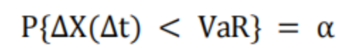

变量说明：

P，资产价值损失小于可能损失上限的概率。

ΔX，某一金融资产在一定持有期损失额。

Δt，一定阶段的持有期

VaR，在险价值，根据价值分布确定和设定的置信区间。

α，给定的置信水平

* DolphinDB 函数实现：

[valueAtRisk](../funcs/v/var_0.html)
函数用于量化在给定的置信水平（例如95%或99%）和特定时间范围内，金融资产可能遭受的最大损失，即最低收益率水平。返回值为绝对值。

举例说明：

```
ret = [0.0, -0.0023816107391389394, -0.0028351258634076834, 0.00789570628538656, 0.0022056267475062397, -0.004515475812603498, 0.0031189325339843646, 0.010774648811452205, 0.0030816164453268957, 0.02172541561228001, 0.011106185767699728, -0.005369098699244845, -0.0096490689793588, 0.0025152212699484314, 0.017822140037111668, -0.02837536728283525, 0.018373545076599204, -0.0026401111537113003, 0.019524374522517898, -0.010800546314337627, 0.014073362622486131, -0.00398277532382243, 0.008398647051501285, 0.0024056749358184904, 0.007093080335863512, -0.005332549248384733, -0.008471915938733665, -0.0038788486165083342, -0.01308504169086584, 0.00350496242864784, 0.009036118926745962, 0.0013358223875250545, 0.0036426642608267563, 0.003974568474545581, -0.003944066366522669, -0.011969668605022311, 0.015116930499066374, 0.006931427295653037, -0.0032650627551519267, 0.003407880132851648]
valueAtRisk(returns=ret, method = 'historical', confidenceLevel=0.9);   //method共有四种：'normal','lognormal','historical','monteCarlo'
```

**一致性风险度量（condValueAtRisk ）：**

* 业务含义：一致性风险度量指满足次可加性、正齐次性、平移不变性和单调性的风险度量。常用的方差不满足平移不变性和单调性，而 VaR
  不满足次可加性，所以它们都不是一致性风险度量。条件风险价值 CVaR（Conditional Value at Risk）和期望短缺
  ES（Expected Shortfall）两种度量方法是等价的，并且满足一致性度量的定义。常用的业务场景有：

  + 风险控制：CVaR 用以确定金融机构为抵御市场风险所需求的内部风险资本，并为交易员或业务部门设置风险限额，以防止过度投机行为，这与
    VaR 的作用类似。而 CVaR 设置头寸限额具有更多优点，CVaR
    限额考虑了组合的风险分散的效果，并且更易设置层次性风险限额结构。
  + 资本配置：经典投资组合模型是以最小方差为基准目标的，在此基础上加入 CVaR 代替方差，对投资组合进行约束，寻找最小
    CVaR，即构成最优均值——CVaR 模型。这在均值-方差空间上表现为一条与 Markowitz 有效边界相交的斜线。CVaR
    模型的优点在于与机构的 CVaR 风险测量及 CVaR
    风险限额保持一致性，因此做到优化投资组合，降低投资风险。固定收益水平下，通过调整头寸使 CVaR 最小；固定 CVaR
    水平下，通过调整头寸使收益最大化。
* 计算公式：


变量说明：

c，所选取的 VaR 对应的置信水平

VaR，为选取的在险价值

x，为损益值

p(x)，为该损益值发生的概率。

* DolphinDB 函数实现：

[condValueAtRisk](../funcs/c/cvar.html) 函数（Conditional Value at
Risk，简称 CVaR；也可称 Expected Shortfall，简称 ES），用于计算超过VaR 的损失的平均值，即收益率低于 VaR
的情况的平均值。

举例说明：

```
ret = [0.0, -0.0023816107391389394, -0.0028351258634076834, 0.00789570628538656, 0.0022056267475062397, -0.004515475812603498, 0.0031189325339843646, 0.010774648811452205, 0.0030816164453268957, 0.02172541561228001, 0.011106185767699728, -0.005369098699244845, -0.0096490689793588, 0.0025152212699484314, 0.017822140037111668, -0.02837536728283525, 0.018373545076599204, -0.0026401111537113003, 0.019524374522517898, -0.010800546314337627, 0.014073362622486131, -0.00398277532382243, 0.008398647051501285, 0.0024056749358184904, 0.007093080335863512, -0.005332549248384733, -0.008471915938733665, -0.0038788486165083342, -0.01308504169086584, 0.00350496242864784, 0.009036118926745962, 0.0013358223875250545, 0.0036426642608267563, 0.003974568474545581, -0.003944066366522669, -0.011969668605022311, 0.015116930499066374, 0.006931427295653037, -0.0032650627551519267, 0.003407880132851648]
condValueAtRisk(returns=ret, method='historical', confidenceLevel=0.9);    //method共有四种：'normal','lognormal','historical','monteCarlo'
```

### 1.3 曲线拟合与插值

**分段线性回归**

* 业务含义：对冲基金在股票交易中经常使用金融信号处理技术，但金融时间序列具有高度非平稳的特性。为此，给定一个金融时间序列数据，学习信号模式的初始处理步骤通常是将时间序列表示为线段，以减轻数据的不确定性和噪声。对于金融交易策略，线段断点数量
  K 是市场趋势变化次数的度量，也是在获得合理交易利润的同时，在市场中交易次数的指标。因此，从最小化给定 K 的全局平方误差开始，并派生出 K
  个段的每个段的最优表示，成为了量化交易中判断交易时机、获得超额收益的一个重要方法。
* 计算公式： 

变量说明：

t，代表回归所在的时点

Yt，时点 t 因变量 Y 的时间序列值

Xt，时点 t 解释变量 X 的时间序列值

β，脚标 0 代表线性回归截距，脚标 1,2... 代表不同线性分段斜率系数

Xt0，代表解释变量的分段点，示例中仅有一个分段点 Xt0，若有多个分段点可以表示为
Xt1，Xt2….

Dt0，代表哑变量的分段点，示例中仅有一个分段点 Dt0，若有多个分段点可以表示为
Dt1，Dt2….

ut，随机变量时间序列，代表误差

* DolphinDB 函数实现：

[piecewiseLinFit](../funcs/p/piecewiselinfit.html)
函数为给定数据点集和给定线段数拟合一个连续的分段线性回归（MSLR）函数，使用差分进化算法，通过最小化平方误差之和，来找到给定数量的线段断点的最优位置。

举例说明：

```
X = 1..20
Y = rand(50.0,20)
model = piecewiseLinFit(X, Y, 5)
model
```

**分段线性回归模型预测**

* 业务含义：在分段回归（`piecewiseLinFit`）函数运行后，对资产价格等金融时间序列的未来值进行预测。
* 计算公式：使用拟合后的连续分段线性回归模型来对输入的数据点进行预测。可以用在利率曲线预测上，分段回归出其他的点。
* DolphinDB 函数实现： [pwlfPredict](../funcs/p/pwlfpredict.html)

举例说明：

```
X = 1..20
Y = rand(50.0,20)
model = piecewiseLinFit(X, Y, 5)
xHat = sort(rand(20.0,10))
pwlfPredict(model, xHat)
//model.predict(xHat) 语句得到的预测结果与pwlfPredict(model, xHat)结果相同
```

**中债收益率曲线构建-赫尔米特模型**

* 业务含义：收益率曲线是反映一组货币和信用风险均相同，但期限不同的债券收益率值的连线。自1999年发布首条人民币国债收益率曲线以来，中央国债登记结算有限责任公司（简称“中央结算公司”）形成了一系列债券收益率曲线和估值基本原则。中债收益率曲线由中央结算公司的全资子公司，中债金融估值中心有限公司（简称“中债估值中心”）负责设计、管理、发布。在2019年发布的中债债券收益率曲线原则中，
  中债估值中心选取了赫尔米特模型作为中债收益率曲线的构建模型，该模型更加贴合中国境内债券市场实际情况。
* 计算公式：

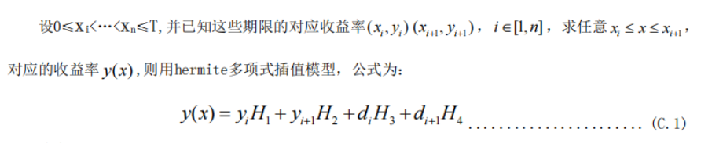
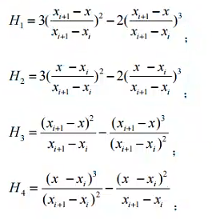

变量说明：

xi，期限；

yi，收益率。

* DolphinDB 函数实现：

[kroghInterpolate](../funcs/k/kroghinterpolate.html)
函数为一组点集进行多项式插值。该多项式通过点集中所有的点对 ( xi, yi)。可以额外指定在每个点
xi 处的多个导数值，用户通过重复 xi 值并将导数值指定为连续的 yi
值来实现。

举例说明：

```
def linspace(start, end, num, endpoint=true){
        if(endpoint) return end$DOUBLE\(num-1), start + end$DOUBLE\(num-1)*0..(num-1)
        else return start + end$DOUBLE\(num-1)*0..(num-1)
}

x = 0 1 2 3 4 5
y = sin(x)
xx = linspace(0.0, 5.0, 10)[1]
yy=kroghInterpolate(x,y,xx)
yy;

yy1=kroghInterpolate(x,y,xx,1)
yy1;
```

**利率期限结构参数化拟合**

* 业务含义：利率期限结构是指某个时点不同期限的即期利率与到期期限的关系及变化规律。不同期限的债券会有不同的收益率，会形成特定的利率期限结构，它体现了收益率和期限之间的关系。债券的收益曲线是其它债务工具，例如抵押贷款利率和银行贷款利率的基准，而且这些曲线形状的变动可以用来预测经济产出及其增长的变动。收益率曲线一般具有以下三个特征：不同期限的债券收益率有同向运动的趋势；收益率曲线通常倾向于向上倾斜；短期债券收益率的波动通常要比长期债券收益率的波动大。参数化拟合模型则采用整段曲线拟合技术对收益率曲线进行拟合，其优点在于模型参数经济意义明确，需要估计的参数较少。其中
  Nelson-Siegel 模型及其扩展模型是许多国家的央行进行利率期限结构静态估计的主要方法之一。
* 计算公式：

Nelson-Siegel(NS) 模型公式：

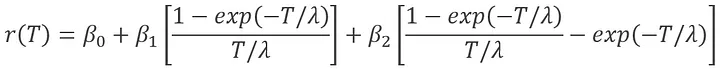

Nelson-Siegel-Svensson(NSS) 模型公式：

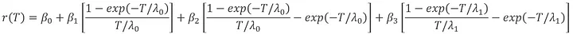

变量说明：

λ，衰减速率因子

T，为到期期限。

* DolphinDB 函数实现：

[nss](../funcs/n/nss.html) 函数使用 Nelson-Siegel(NS) 模型/
Nelson-Siegel-Svensson(NSS) 模型和 nelder-mead 优化方法来拟合债券的收益率曲线。NS
模型将收益率曲线表示为三个参数：水平、斜率和曲率的函数，并假设一种公式形式，反映债券收益率的历史模式。Nelson-Siegel-Svensson(NSS)
模型通过增加一个额外的因素来捕捉收益曲线随时间变化的斜率从而对 Nelson-Siegel 模型进行了扩展。

举例说明：

```
maturity = [1,2,3,4,5,8,10,15,20,25,30]
yield = [0.0039,0.0061,NULL,NULL,0.0166,NULL,0.0258,NULL,NULL,0.0332,NULL]
model = nss(maturity, yield)

model.modelName
//output: nss

model.params
//output：[0.038184469794996,-0.048575389082029,-0.022287414169806,0.047523360012739,1.873046195772644,0.161159907274023]

model.fminResult
/* Output:
xopt->[0.038184469794996,-0.048575389082029,-0.022287414169806,0.047523360012739,1.873046195772644,0.161159907274023]
fopt->5.456415848001168E-9
iterations->541
fcalls->860
warnFlag->0
*/

```

当需要使用上述计算出来的模型对数据进行预测时，可以使用函数 `predict` 也可以直接调用 NS 模型及 NSS
模型专用预测函数 [nsspredict](../funcs/n/nsspredict.html)
，预测结果是一样的。

```
// 调用预测函数进行预测
model.predict([3,1])
// 两者结果一致
nssPredict(model, [3,1])
```

**其他相关函数：**

下表列举了 DolphinDB 其他相关的曲线拟合与插值函数，详细内容可参考具体函数的使用手册，这里不再赘述。

| 插值方法 | 内容概述 | 使用手册链接 |
| --- | --- | --- |
| 线性插值法 | 线性插值通过已知的两个数据点 [x0, y0] 和 [x1, y1] ，求解在[x0, x1] 区间内某一个位置的 xi 所对应的 yi 值。 | [linearInterpolateFit](../funcs/l/linearinterpolatefit.html) |
| 三次样条插值法 | 三次样条插值法是一种常用的数值分析方法，可以通过给定的一组散点数据来拟合出一条光滑的连续函数曲线。其基本思想是用低次多项式逼近一段小区间内的数据，并利用这些多项式的连接处衔接条件来保证整个曲线的光滑性。 | [cubicSpline](../funcs/c/cubicspline.html) |
| 多项式拟合 | 根据给定的数据点集 (xi, yi)，通过一个多项式函数，使拟合曲线尽可能接近已知的数据点。 | [polyFit](../funcs/p/polyfit.html) |

### 1.4 实时计算引擎

在实际业务场景中，往往需要根据市场上的最新行情和信息实时拟合价格曲线，计算和更新金融资产的估值和价格。为了能够帮助客户更准确地判断市场动态，做出更优的投资决策，以及更有效地管理市场风险，DolphinDB
结合实时流技术和 FICC 系列函数实现了实时曲线拟合引擎和估值定价引擎。

用户可以很方便地使用这两个引擎对最新价格利率数据进行拟合预测，并根据拟合预测的数据计算金融资产的估值数据，从而得以判断当前市场的报价与预估价格的差异，从而做出更准确的决策。同时快速的实时风险计算可以及时帮助客户规避市场风险。

**曲线拟合引擎**

* 业务场景：


引擎接入到实时行情数据时，根据用户自定义的曲线拟合指标，对不同组别的资产进行实时利率曲线拟合，也可以根据拟合结果进行进一步结果的预测。

* DolphinDB 函数实现：

```
createYieldCurveEngine(name, dummyTable, assetType, fitMethod, keyColumn, modelOutput, frequency, [timeColumn], [predictDummyTable],[predictInputColumn], [predictKeyColumn],[predictTimeColumn], [predictOutput], [extraMetrics],[fitAfterPredict=false])
```

其中，*fitMethod*
是用户需要指定的具体利率拟合使用的算法。引擎支持对不同类型的资产，采用不同的拟合算法，目前支持的曲线拟合函数有：`piecewiseLinFit`
, `nss` , `cubicSpline`,
`linearInterpFit`, `polyFit`,
`kroghInterpFit` 。关于函数参数使用说明，请参考 [createYieldCurveEngine](../funcs/c/createyieldcurveengine.html)。

**估值定价引擎**

* 业务场景：


与曲线拟合引擎相似，估值定价引擎接入到实时行情数据后，可以实时根据用户自定义的计算指标，进行指标计算。

估值定价引擎也可以结合曲线拟合引擎一起使用，曲线拟合引擎将最新的行情数据，拟合的利率数据，预测的利率数据等发布给估值定价引擎，估值定价引擎可以根据不同的利率数据进行估值定价指标计算，以此对市场行情做出更精准的判断。

* DolphinDB 函数实现：

```
createPricingEngine(name, dummyTable, timeColumn, typeColumn, securityType, method, outputTable, [securityReference], [keyColumn], [extraMetrics])
```

其中，*method*
是用户需要指定的具体估值使用的算法，也支持用户根据需要传入自定义函数或表达式。目前支持的估值计算函数有：`bondDirtyPrice`,
`bondAccrInt`, `bondDuration`,
`irs`, `vanillaOption`等等。关于函数参数使用说明，请参考 [createPricingEngine](../funcs/c/createpricingengine.html)。

### 1.5 其他相关函数

在实现上述函数过程中，需要用到一些数学统计类的函数，DolphinDB 专门为此开发了相关的函数并进行了一定的优化。以下是在 FICC
场景中常用的一些数学统计函数，这里不再对每个函数做过多的赘述，如有需要，可以自行查看开发手册查看详细信息。如果读者需要更多的函数，欢迎联系我们进行完善。

| 函数链接 | 功能描述 |
| --- | --- |
| [brute](../funcs/b/brute.html) | 通过穷举法在给定范围内最小化一个函数 |
| [fmin](../funcs/f/fmin.html) | 使用 Nelder-Mead 单纯形算法找到目标函数的最小值。 |
| [fminBFGS](../funcs/f/fminbfgs.html) | 使用 BFGS 算法找到目标函数的最小值。 |
| [fminLBFGSB](../funcs/f/fminlbfgsb.html) | 使用 L-BFGS-B 算法找到目标函数的最小值。 |
| [fminSLSQP](../funcs/f/fminslsqp.html) | 使用顺序最小二乘编程方法（Sequential Least Squares Programming, SLSQP）找到目标函数的最小值。 |
| [fminNCG](../funcs/f/fminncg.html) | 使用牛顿共轭梯度法（Newton conjugate gradient；也称为截断牛顿法，Truncated Newton method）对目标函数进行无约束最小化。本方法适用于解决大型非线性优化问题。 |
| [gaussianKde](../funcs/g/gaussiankde.html)  [gaussianKdePredict](../funcs/g/gaussiankdepredict.html) | 使用核密度估计方法中的高斯核来估计随机变量的概率密度。  生成的模型可以作为 `gaussianKdePredict` 函数的输入进行预测。 |

## 2. 函数性能测试

本教程对于性能测试使用的硬件环境如下：

| 硬件名称 | 配置信息 |
| --- | --- |
| 操作系统 | 64位 CentOS Linux 7 (Core) |
| 内存 | 256 GB |
| CPU 类型 | Intel(R) Xeon(R) Silver 4216 CPU @ 2.10GHz |
| License 核数限制 | 12核 |

### 2.1 数据构造及概览

* 数据结构

为方便进行性能测试，本教程在保证关键字段不缺失情况下，简化了数据结构后，同时进行数据模拟构造。

债券表结构：

| 字段名 | 字段含义 | 数据类型（DolphinDB） |
| --- | --- | --- |
| id | 有价证券代码 | SYMBOL |
| sd | 有价证券的结算日 | DATE |
| md | 有价证券的到期日 | DATE |
| coupon | 年票息率 | DOUBLE |
| yld | 年贴现率 | DOUBLE |
| fre | 付息频率，可选值为   * 1：按年支付； * 2：按半年期支付； * 4：按季支付； * 12：按月支付。 | INT |
| redemption | 到期赎回价值，即面额 | INT |
| basis | 日期基数基准类型   * 0：US(NASD) 30/360； * 1：实际/实际； * 2：实际/360； * 3：实际/365； * 4：欧洲 30/365。 | INT |
| btype | 债券类型   * 0：固息债券：定期（季度、半年或一年）按息票利率支付利息； * 1：贴现债券：没有利息支付，以贴现方式发行的债券，期末 FV=面值； * 2：零息债券：期末一次性支付利息和面值，期末FV=面值+利息。 | INT |
| ret | 日收益率 | DOUBLE |

利率曲线数据表结构：

| 字段名 | 字段含义 | 数据类型（DolphinDB） |
| --- | --- | --- |
| TRADE\_DT | 日期 | DATE |
| B\_ANAL\_CURVENUMBER | 曲线编号 | INT |
| B\_ANAL\_CURVETERM | 到期年限 | DOUBLE |
| B\_ANAL\_YIELD | 收益率 | DOUBLE |

* 数据构造

本教程使用 DolphinDB
自带的随机数种子、随机数等函数，按上述表结构模拟生成债券的样本数据。构造的债券数据量共100万条，其中共有1万支债券，每只债券100条数据，脚本如下：

```
//FICC测试表构造
n = 10000
days = 100
startday = 2022.06.01
maturity = 2027.07.01
fretype = 1 2 4 12
basistype = 0 1 2 3 4
bondtype = 0 1 2
setRandomSeed(321)

ficc = table(
string(take(1..n,take(days,n))).symbol() as id,
take(startday..(startday+(days-1)),n*days) as sd,
take(maturity,n*days) as md,
take(rand(1..15,n)\100,take(days,n)) as coupon,
take(rand(0.1,n),take(days,n)) as yld,
take(rand(fretype,n),take(days,n)) as fre,
take(100,n*days) as redemption,
take(rand(basistype,n),take(days,n)) as basis,
take(rand(bondtype,n),take(days,n)) as btype,
randNormal(0,0.1,n*days) as ret
)
```

利率曲线数据可以直接从 csv 中导入，csv 数据文件见附件：

```
curveOneday = loadText("<YourDir>/curveOneDay.csv")
```

* 数据概览

数据构造成功后，执行代码查看前十条 ficc 数据：

```
select top 10 * from ficc
```

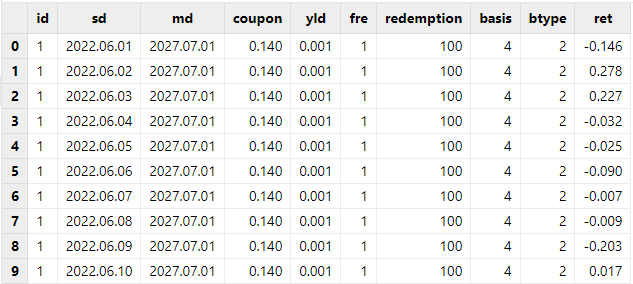

执行代码查看前十条利率曲线分段回归测试数据：

```
select top 10 * from curveOneday
```

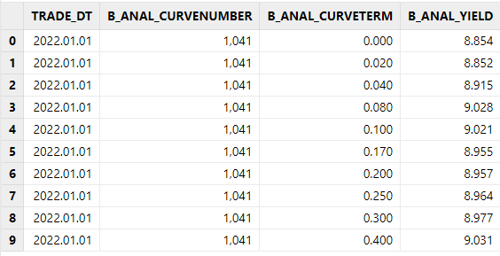

### 2.2 估值定价与风控计算性能测试

本小节测试 DolphinDB 估值定价与风控类函数，在实际大数据量业务场景下的计算效率：

* 业务场景：给定债券
  ID，结算日，到期日，票息率，贴现率，付息频率，债券类型和收益率等数据，计算全价，应付利息，久期，凸度，在险价值（VaR）和条件在险价值（CVaR）等量价指标。
* CPU 核数：估值定价与风控类函数使用内存表进行测试，只分配了一个线程运行。

测试脚本如下：

```
defg getvar(data){
        return valueAtRisk(returns=data, method='normal', confidenceLevel=0.95)
}

defg getcvar(data){
        return condValueAtRisk(returns=data, method='normal', confidenceLevel=0.95)
}

//耗时测试
def testtime(data){
        timer{select bondDirtyPrice(settlement=sd, maturity=md, coupon=coupon, yield=yld, frequency=fre, basis=basis, bondtype=btype) from data}
        timer{select bondAccrInt(settlement=sd, maturity=md, coupon=coupon, frequency=fre, par=redemption, basis=basis) from data}
        timer{select bondDuration(settlement=sd, maturity=md, coupon=coupon, yield=yld, frequency=fre, basis=basis, bondtype=btype) from data}
        timer{select bondConvexity(settlement=sd, maturity=md, coupon=coupon, yield=yld, frequency=fre, basis=basis, bondtype=btype) from data}
        timer{select getvar(ret) from data group by id}
        timer{select getcvar(ret) from data group by id}
}
testtime(ficc)

//结果生成
def getResult(data){
        res = select id,sd,
        bondDirtyPrice(settlement=sd, maturity=md, coupon=coupon, yield=yld, frequency=fre, basis=basis, bondtype=btype) as DirtyPrice,
        bondAccrInt(settlement=sd, maturity=md, coupon=coupon, frequency=fre, par=redemption, basis=basis) as AccuredInterest,
        bondDuration(settlement=sd, maturity=md, coupon=coupon, yield=yld, frequency=fre, basis=basis, bondtype=btype) as Duration,
        bondConvexity(settlement=sd, maturity=md, coupon=coupon, yield=yld, frequency=fre, basis=basis, bondtype=btype) as Convexity from data
        update res set CleanPrice = Dirtyprice - AccuredInterest
    res1 = select getvar(ret) as VaR, getcvar(ret) as CVaR from data group by id
        return res, res1
}

res, res1 = getResult(ficc)
res
res1
```

耗时如下：

| 估值定价与风控函数函数 | 标的个数 | 总数据量（行） | 测试耗时（ms) |
| --- | --- | --- | --- |
| bondDirtyPrice | 10,000 | 100万 | 240 |
| bondAccrInt | 10,000 | 100万 | 104 |
| bondDuration | 10,000 | 100万 | 219 |
| bondConvexity | 10,000 | 100万 | 224 |
| valueAtRisk | 10,000 | 100万 | 225 |
| condValueAtRisk | 10,000 | 100万 | 207 |

结果展示：

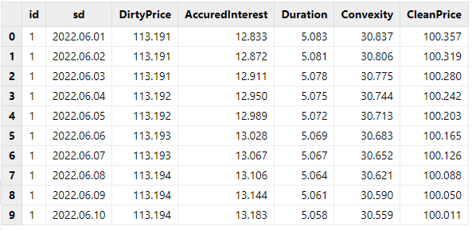

### 2.3 分段回归性能测试

本小节使用分段回归函数对不同曲线，进行不同分段数的回归计算性能测试，并观察计算效率：

* 业务场景：使用 `piecewiseLinFit` 函数对一天共400+标的的利率曲线数据进行测试。

  + 分别测试了 3段、4段、5段、10段回归的性能
  + 每一种情况，都测试了1只标的和多只标的下的性能
* CPU 核数：多个标的计算，使用单线程进行计算。
* 注意点：对比分段回归拟合函数和预测函数，耗时集中在模型拟合上，预测耗时可以忽略不计。因此，测试仅展示回归拟合的耗时结果。python 中有
  pwlf 包，效果类似于 DolphinDB 中的 `picewiseLinFit` 函数，因此加入 python
  耗时作为对比。python 测试代码附于文章附录。该函数由于受 openblas
  的线程数影响较大，所以将这个线程数统一设置为1，观察两边的性能对比。

```
curveOneday = loadText("<YourDir>/curveOneDay.csv")
curverno = exec distinct(curveOneday.B_ANAL_CURVENUMBER) as curverno from curveOneday
def getPiecewiseLinFit(data, numSegments, symcode){
    res = select piecewiseLinFit(B_ANAL_CURVETERM,B_ANAL_YIELD,numSegments) from data where B_ANAL_CURVENUMBER = symcode
    return res
}

// 3段回归
timer{getPiecewiseLinFit(curveOneday, 3, 4242)}
timer{loop(getPiecewiseLinFit{curveOneday, 3}, curverno) }
// 4段回归
timer{getPiecewiseLinFit(curveOneday, 4, 4242)}
timer{loop(getPiecewiseLinFit{curveOneday, 4}, curverno) }
// 5段回归
timer{getPiecewiseLinFit(curveOneday, 5, 4242)}
timer{loop(getPiecewiseLinFit{curveOneday, 5}, curverno) }
```

测试性能结果如下：

| 线段数量 | 标的个数 | 数据量（行） | DDB测试耗时（s) | python测试耗时（s） |
| --- | --- | --- | --- | --- |
| 3 | 1 | 15 | 0.05 | 0.39 |
| 437 | 52,978 | 23.35 | 165.90 |
| 4 | 1 | 15 | 0.13 | 0.95 |
| 437 | 52,978 | 80.97 | 516.50 |
| 5 | 1 | 15 | 0.26 | 2.46 |
| 437 | 52,978 | 206.61 | 1,226.80 |

执行结果如下：

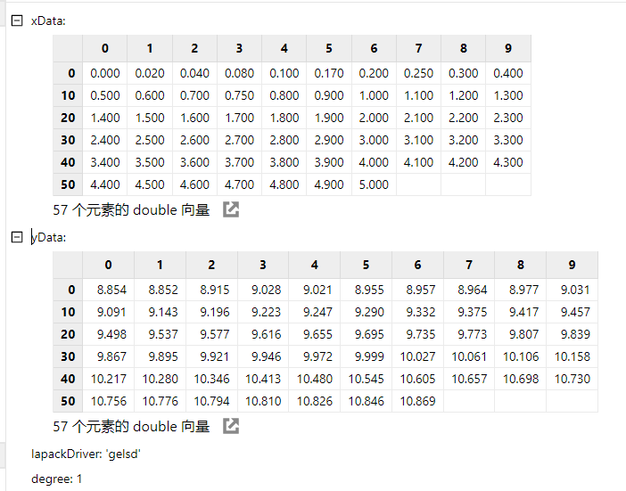

### 2.4 赫尔米特模型

本小节测试 DolphinDB 赫尔米特函数在实际可能业务场景下的性能表现，业务场景如下：

* 使用了一天共400+标的的利率曲线数据进行测试。增大数据量以测试不同数据量下的性能差异。
* DolphinDB 使用函数 `kroghInterpolate`；python 使用
  `scipy.interpolate.KroghInterpolator` 函数实现。
* CPU 核数：多个标的计算，但只用到了单个核，DolphinDB 可以使用向量化处理，结合 SQL 使用。
* DolphinDB 代码如下，python 代码请参考附录

```
// 基础数据，性能测试
curveOneday = loadText("<YourDir>/curveOneDay.csv")
timer select kroghInterpolate(B_ANAL_CURVETERM,B_ANAL_YIELD,[1.3]) from curveOneday group by TRADE_DT,B_ANAL_CURVENUMBER
// 扩展成1月数据的性能测试
dateStart = 2022.01.01
dateEnd = 2022.01.31
curveOneday = select B_ANAL_CURVENUMBER, B_ANAL_CURVETERM, B_ANAL_YIELD from curveOneday
allDates = table((dateStart..dateEnd) as TRADE_DT)
curveFullMth = cj(allDates, curveOneday)
timer select kroghInterpolate(B_ANAL_CURVETERM,B_ANAL_YIELD,[1.3]) from curveFullMth group by TRADE_DT,B_ANAL_CURVENUMBER
// 扩展成1年数据的性能测试
dateStart = 2022.01.01
dateEnd = 2022.12.31
curveOneday = select B_ANAL_CURVENUMBER, B_ANAL_CURVETERM, B_ANAL_YIELD from curveOneday
allDates = table((dateStart..dateEnd) as TRADE_DT)
curveFullYear = cj(allDates, curveOneday)
timer select kroghInterpolate(B_ANAL_CURVETERM,B_ANAL_YIELD,[1.3]) from curveFullYear group by TRADE_DT,B_ANAL_CURVENUMBER

```

测试的性能结果如下：

| 天数 | 标的个数 | 总数据量（行） | DDB测试耗时（s) | python测试耗时（s) |
| --- | --- | --- | --- | --- |
| 1 | 437 | 52,978 | 0.09 | 16.49 |
| 31 | 437 | 1,642,318 | 2.63 | 515.95 |
| 365 | 437 | 19,336,970 | 31.01 | 6038.68 |

部分计算结果展示：

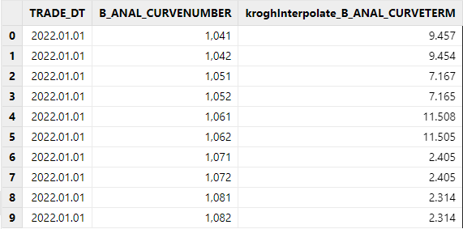

### 2.5 Nelson-Siegel-Svensson(NSS) 模型

本小节测试 DolphinDB `nss` 函数在实际可能业务场景下的性能表现，业务场景如下：

* 使用了一天共400+标的的利率曲线数据进行测试。增大数据量以测试不同数据量下的性能差异。
* DolphinDB 使用函数 `nss`；python 由于没有可以直接使用的函数，参照模型的公式，使用
  `fmin` 和 numpy 相关函数实现。注意：python
  代码运行可能会出现报错，这是因为 `numpy.exp` 函数无法处理较大数值，这与
  `fmin` 迭代求解有关，但是该报错不影响代码运行，可以忽略。
* CPU 核数：多个标的计算，但都只用到了单个核计算。
* DolphinDB 代码如下，python 代码请参考附录：

```
curveOneday = loadText("<YourDir>/curveOneDay.csv")

// nss模型 性能对比测试
curveOneday = select * from curveOneday where B_ANAL_CURVETERM > 0
def getNss(data,dt,curverno){
    return exec nss(B_ANAL_CURVETERM, B_ANAL_YIELD) from data where TRADE_DT = dt , B_ANAL_CURVENUMBER = curverno
}
dt = select distinct(curveOneday.TRADE_DT) as dt from curveOneday
curverno = select distinct(curveOneday.B_ANAL_CURVENUMBER) as curverno from curveOneday
params = cj(dt, curverno)
timer{loop(getNss{curveOneday} ,params.dt, params.curverno)}

// 扩展到1周
dateStart = 2022.01.01
dateEnd = 2022.01.07
curveOneday = select B_ANAL_CURVENUMBER, B_ANAL_CURVETERM, B_ANAL_YIELD from curveOneday
allDates = table((dateStart..dateEnd) as TRADE_DT)
curveOneWeek = cj(allDates, curveOneday)
curveOneWeek = select * from curveOneWeek where B_ANAL_CURVETERM > 0
dt = select distinct(curveOneWeek.TRADE_DT) as dt from curveOneWeek
curverno = select distinct(curveOneWeek.B_ANAL_CURVENUMBER) as curverno from curveOneWeek
params = cj(dt, curverno)
timer{loop(getNss{curveOneWeek} ,params.dt, params.curverno)}

// 扩展到1月
dateStart = 2022.01.01
dateEnd = 2022.01.31
curveOneday = select B_ANAL_CURVENUMBER, B_ANAL_CURVETERM, B_ANAL_YIELD from curveOneday
allDates = table((dateStart..dateEnd) as TRADE_DT)
curveOneMonth = cj(allDates, curveOneday)
curveOneMonth = select * from curveOneMonth where B_ANAL_CURVETERM > 0
dt = select distinct(curveOneMonth.TRADE_DT) as dt from curveOneMonth
curverno = select distinct(curveOneMonth.B_ANAL_CURVENUMBER) as curverno from curveOneMonth
params = cj(dt, curverno)
timer{loop(getNss{curveOneMonth} ,params.dt, params.curverno)}

```

测试的性能结果如下：

| 天数 | 标的个数 | 总数据量（行） | DDB测试耗时（s) | python测试耗时（s) |
| --- | --- | --- | --- | --- |
| 1 | 437 | 52,628 | 4.25 | 1,374.81 |
| 7 | 437 | 368,396 | 31.63 | 11,503.09 |
| 31 | 437 | 1,631,468 | 162.55 | 43,559.79 |

计算结果展示：

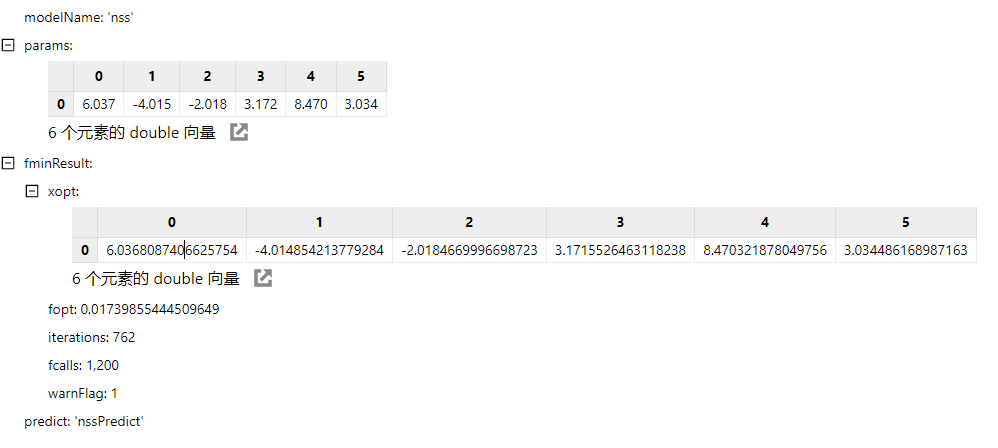

## 3. 总结

本教程详细介绍了 DolphinDB 在 FICC 固收领域开发的一些函数以及适用的业务场景范围，函数覆盖了估值定价、曲线拟合、风险指标计算等多种不同类型的业务场景。此外
DolphinDB 尽可能将函数设计的更加方便，以便用户在相关的业务场景中可以快速地使用。

本教程基于债券构造的数据和利率曲线数据，分别测试了各个函数在不同业务场景下的性能，同时与 python 的实现进行比对。可以看到，DolphinDB
具有强大的向量化计算能力，大部分大数据量计算只需要毫秒级即可完成计算，计算性能比 python 要快一个数量级以上。

未来随着版本更新，DolphinDB 也会推出更多更丰富的 FICC 固收系列内置函数。

## 4. 常见问题解答（FAQ）

* **函数目前主要支持哪些品种**

2.00.14 和 3.00.2 版本的 FICC
系列函数，各类品种都有一定的支持，不过具体子品种上并不是所有都已经支持，比如信用债，可转债的估值定价正在开发中。具体支持的品种可以查阅函数详细手册来确定。

* **函数的源码是否可以开放出来，是否可以直接在我们的函数的基础上进行修改**

函数的源码暂时不对外开放。如确实有需要，可以发邮件，电话或直接联系我司的销售市场等负责人。也欢迎对 FICC
系列函数提出意见和建议，我们会在需求整理评估后决定是否开发支持。

## 5. 附件

* 性能测试使用的数据：<data/ficc_func_usage_and_performance/curveOneDay.csv>
* 分段回归性能测试 python 对比代码：<script/ficc_func_usage_and_performance/piecewiseLinFit.py>
* 赫尔米特模型性能测试 python 对比代码：<script/ficc_func_usage_and_performance/kroghInterpolate.py>
* Nelson-Siegel-Svensson(NSS) 模型性能测试 python 对比代码：<script/ficc_func_usage_and_performance/nss.py>

