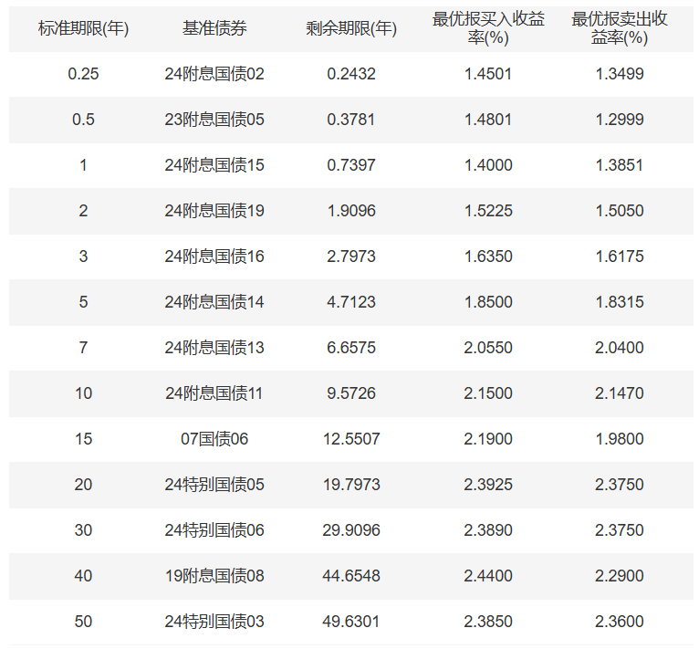
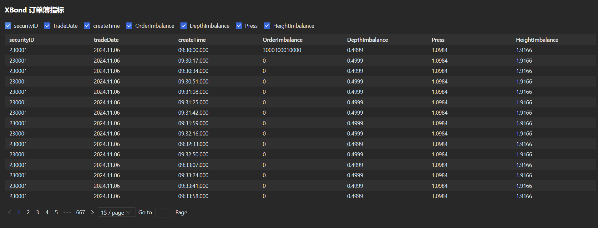
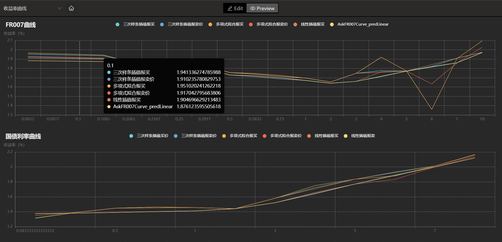
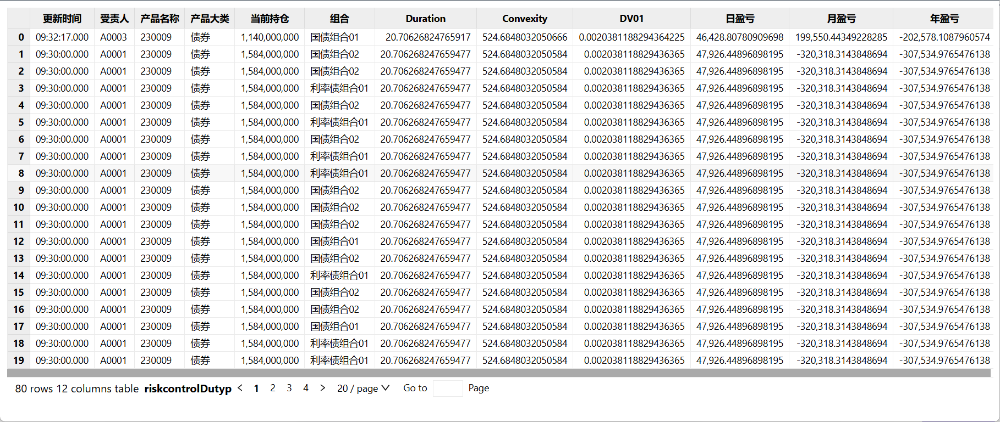
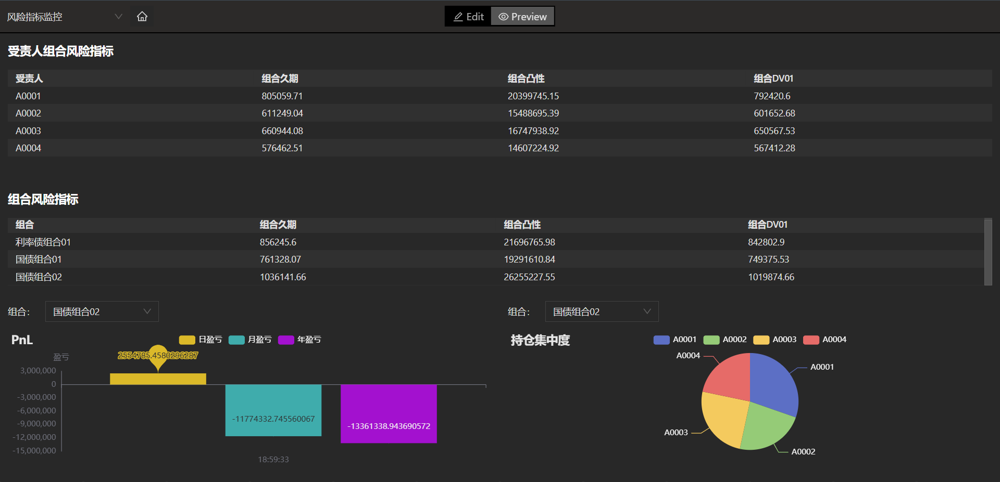
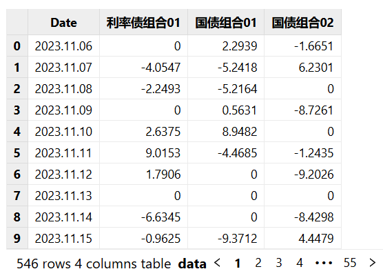
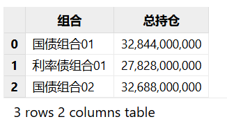
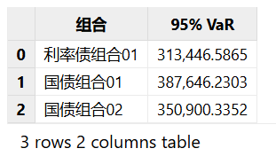
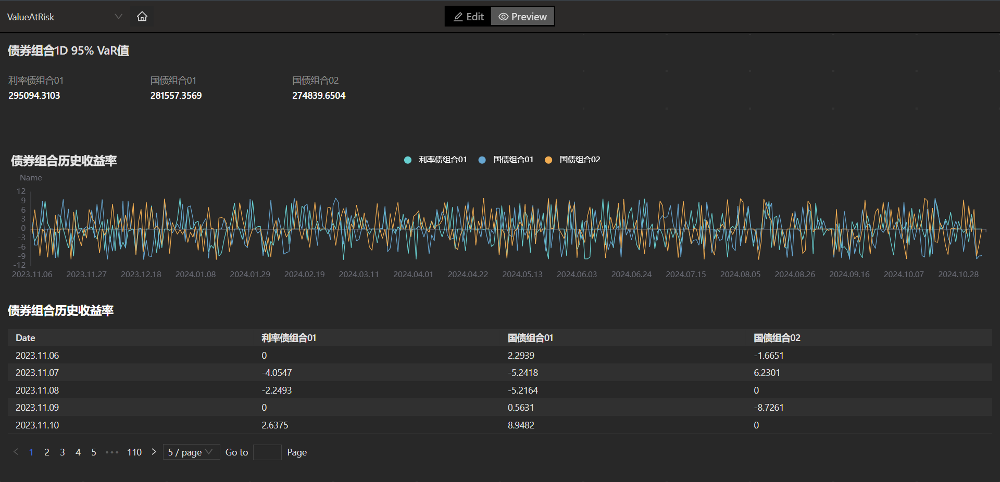

# FICC 固收系列函数应用场景

本教程针对的目标用户群体：在 FICC 领域存在估值定价和风险计量等需求的初阶及中阶用户。

FICC 业务所涉及的资产种类繁多，包括固定收益（Fixed
Income），外汇（Currency）以及大宗商品（Commodity）等。在估值定价和风险计量方面，不同资产采用不同的计算框架和风险计量模型。
此外，在实际业务场景下，不同客户类型 （银行、券商、公募、私募等），有不同的业务目标和使用需求，因此，我们将根据不同的业务场景，介绍 DolphinDB 目前已发布的 FICC
应用中的曲线拟合和估值定价功能，并展示相关案例。

## 1. 曲线拟合和插值

由于在 FICC 业务中，多种资产的价值变动与各类利率结构挂钩，例如各类债券、利率类衍生品、信用类衍生品等。
因此为了准确地对此类产品进行估值定价和风险计量，利率曲线的拟合和插值成为重要的基础工具。

### 1.1 利率曲线概述及构建

市场中的利率分为即期利率（spot rate）和远期利率（forward rate)。 其中即期利率是当前时刻的市场利率，表示零息债券（zero coupon
bond）的到期收益率；而远期利率指的是在未来某一点开始到另一时间点的预期利率水平。 两者的关系为，
通过到期日不同的即期利率，可以推算出所隐含的远期利率。

FICC 场景下所涉及的即期利率，有着不同的来源。
比如：3个月期国债发行利率为财政部最新发行的3个月期国债发行价格所对应的参考收益率，由中国外汇交易中心每日发布国债实时收益率均值曲线。

通常即期利率都是按照不同的期限（term），公布特定期限的到期收益率。因此市场上的利率期限结构为离散值。



在具体业务场景中，如果需要使用上述的国债收益率曲线去进行估值定价，比如对于特定类型的债券计算其现值，则需要每一期现金流所对应的利率期限结构。市场上直接可得的即期利率，可能无法直接用于该债券的定价。因此，需要先构建一个完整的期限结构（term
structure），再对债券的未来现金流逐项进行折现计算，得到债券的现值，这时就需要用到曲线的拟合与插值方法。

### 1.2 什么是曲线拟合与插值

曲线的拟合与插值，是两类构建利率曲线的方法。两种方法的共同目的都是通过市场中的特定利率点，来构建完整的利率期限结构。也就是在该利率曲线上的每个对应的期限，都可以根据现有的离散点，通过数学模型来推算出所对应的利率值。

### 1.3 曲线插值与拟合的区别

曲线拟合和曲线插值都是为了获得完整的利率期限结构，但两者在实现路径和结果上存在差异。

两者的主要差异在于，所获得完整曲线是否需要严格通过给定的数据点。
曲线插值的目标为在已知数据点之间，通过线性或非线性连接，形成一条完整的曲线，来估算中间值，并且需要通过所有已知数据点。
而曲线拟合的目标是使结果曲线尽可能的接近已知数据点，但并不要求通过所有点，允许有一定误差。下表对两者的差异进行了对比总结：

|  | 曲线插值 | 曲线拟合 |
| --- | --- | --- |
| 数据点的利用 | 必须通过所有已知数据点 | 不要求必须通过所有已知数据点 |
| 曲线生成目标 | 构建精确的连续曲线 | 反映曲线的总体趋势 |
| 曲线应用 | 债券、利率类衍生品的估值定价 | 利率风险评估及预测 |
| 数据要求 | 精确数据点 | 允许一定噪点和误差的数据 |
| 可选方法 | 线性插值  三次样条插值  Krogh插值 | 分段线性拟合  多项式拟合  Nelson-Siegel-Svensson（nss 模型） |

### 1.4 曲线插值方法介绍

**线性插值法**

线性插值通过已知的两个数据点，从而可以根据两个已知点，算出该区间直线上任意 x 点所对应的 y 值。详情参见手册：[linearInterpolateFit](../funcs/l/linearinterpolatefit.html)。

**三次样条插值法**

在给定的数据点区间内，假设曲线三次多项式，且需要满足边界点等于给定数值。因此在每个区间内，需要求解 4 个待定系数。假设共有 n 个区间，那么需要确定 4n
个参数，来确定整条曲线分段的插值函数。此种插值方法称为三次样条插值。详情参见手册：[cubicSpline](../funcs/c/cubicspline.html)。

**克罗格插值法**

Krogh
插值法为一种多项式插值方法，通过构建一个多项式，使其不仅通过所有给定的数据点，还要满足这些点的导数条件，这样的插值称为**埃尔米特（Hermite）插值**。
该多项式通过所有给定的 (xi, yi) 数据点，xi
为给点的期限时间，yi 为对应的利率值。此外，通过指定每个 xi 的导数数量，通过重复值
xi 并将导数指定为连续的 yi 值来实现插值。详情参见手册：[kroghInterpolate](../funcs/k/kroghinterpolate.html)。

### 1.5 曲线拟合方法介绍

**分段线性拟合**

分段线性拟合（piecewise linear fit）是一种通过线性回归，来描述 (xi, yi)
之间关系的拟合方法。
此方法假设，两个已知点之间的期限和收益率之间服从线性关系。分段线性回归方法则是将已知数据点按照所选择的分段数量（segments），逐段进行线性回归，并利用最小二乘法（OLS），通过最小化平方误差之和，确定给定数量的线段断点的最优位置。详情参见手册：[piecewiseLinFit](../funcs/p/piecewiselinfit.html)。

**多项式拟合**

根据给定的数据点集 (xi, yi) ，通过一个多项式函数，使拟合曲线尽可能接近已知的数据点。

通过建立一个 n 阶多项式，其中 n 决定了拟合的精度和计算复杂度。 一般来说，阶数 n 越高，拟合精度越高。 在选择阶数 n
的时候，同时需要考虑阶数过高可能导致的过拟合现象。详情参见手册：[polyFit](../funcs/p/polyfit.html)。

**nss 拟合**

Nelson-Siegel 拟合函数，是根据 Nelson-Siegel (1987) 所建立的一种拟合函数。 NS
模型的基础假设为，收益率曲线的形状可以通过三个参数 β0, β1, β2 来描述，
分别代表了曲线的长期水平（level）, 曲线的斜率（slope）和曲线的曲度（curvature)。此外参数 λ 为衰减速率因子。

Nelson-Siegel-Svensson （nss模型）通过增加一个额外的参数 β3
，来对应曲线的额外曲度项，从而提高对于长期利率预测的拟合精度，同时引入另外一个控制衰减速率的因子 λ1 。详情参见手册：[nss](../funcs/n/nss.html)。

## 2. 估值定价函数

估值定价（valuation & pricing）在 FICC
领域乃至整个金融领域的投资决策中发挥着重要作用。估值定价的主要目的是通过某种特定的计算方法，得到对应资产的理论价格。
再依据该理论价格，比照市场报价或者其他价格来源，发现交易机会或管理相关风险。准确的估值定价工具，有助于构建高效的金融市场和提高资产流动性。

### 2.1 估值定价模型

估值定价通过金融模型估算资产的理论价值。这种理论价值建立于一系列的假设之上。由于金融市场的复杂性和快速变化的特性，市场价格具有难以预测的波动性，有可能在特定的时间段内，市场价格与理论价格之间会出现较大的偏离。这种偏离可能使得金融机构面对更大的风险敞口。因此也对估值定价工具提出了更高的要求，要求其能够快速且准确地捕捉市场情况的变动，并将这种变化融入到估值定价结果中。

### 2.2 估值定价函数的设计

估值定价函数是通过工程化的方法，将金融模型抽象成可以直接调用的定价工具。相比通过脚本方式来实现估值定价功能，定价函数更加高效便捷。
同一类金融资产的估值定价，根据不同金融模型的数理原理，会有不同的实现路径。因此在开发估值定价函数中，DolphinDB
考虑到用户在不同场景下对于不同模型的偏好，函数也提供了不同的模型选项。比如，在期权定价函数中，不仅支持常用的 Black-Scholes (BS)
模型，同时支持有限差分模型，Heston 模型，以及 FDHeston 模型。

此外，估值定价模型函数的设计还要考虑到使用的灵活性。 尤其是需要对市场日历，计息基准，曲线选择等参数进行暴露，并在函数底层进行相应的计算能处理。

### 2.3 估值定价函数介绍

DolphinDB 针对 FICC 业务场景的特点，开发了一系列估值定价函数，旨在帮助市场参与者更好的进行投资决策和风险管理。 DolphinDB
在后续新版本的开发中，会不断增加针对于不同品种资产的定价函数，以覆盖当前 FICC 业务中所涉及到的所有资产大类。

#### 2.3.1 债券定价函数

**债券应计利息**

债券的定价日期（settlement
date）是指距离上一次付息日所经过的时间，此期间累积的债券票息收益归债券持有人所有。尽管债券交易中的报价通常以净价形式呈现，但在交易达成后的结算中使用的是债券全价。详情参见手册：[bondAccrInt](../funcs/b/bondaccrint.html)。

**债券全价计算**

债券是一种由发行人（政府、公司或金融机构）向投资者借款的一种资产类型。 发行人在发行时约定未来按照某个时间频率偿还本金及支付利息。
因为绝大部分债券在发行时就已经确定了未来现金流的时间，因此可以通过按照对应的到期收益率进行折现的方式，计算出债券的当前价格。详情参见手册：[bondDirtyPrice](../funcs/b/bondDirtyPrice.html)。

**债券收益率计算**

债券收益率指的是到期收益率（yield-to-maturity）。
其含义是指以当前市场价格购买的债券，持有到债券到期日（maturity）所获得的年化收益率。

在 FICC 业务中，债券收益率发挥着重要作用。 通过计算各类债券的到期收益率，市场参与者可以获得当前市场利率水平、信用利差、政策预期、流动性状况等信息。
此外，一些债券收益率曲线的构建依赖于通过债券市场的价格信息，计算出对应到期日的收益率 （bootstrapping 或者
extrapolation）。

债券收益率的计算是根据债券的净价和未来现金流，反算债券净价计算公式中的到期收益率。
由于债券净价计算公式为关于到期收益率的高阶非线性函数，因此需要用到规划求解器（solver），通过数量方法（numerical
method），进行求解。目前债券收益率函数支持多种常见的规划求解器，包括牛顿法（Newton）, brent， Nelder-Mead，BFGS
等。详情参见手册：[bondYield](../funcs/b/bondyield.html)。

#### 2.3.2 利率互换定价函数

利率互换（interest rate swap）是一种利率类衍生品，
其特点为互换参与的双方按照合约约定的未来固定时间，进行某种资产或资产现金流的交换。双方基于合约中约定的利率交换现金流。

按照定义，利率互换的固定端支付方为利率互换合约的买方，浮动端支付方为利率互换合约的卖方。利率互换的合约价值等于固定端现值和浮动端现值和的轧差。自营机构可以根据目前的持仓结构，通过使用利率互换，匹配资产和负债两端的现金流。

此外，利率互换合约的固定端利率水平，一定程度上反映了市场对未来利率走势的预期，为利率类产品的投资提供决策工具。详情参见手册：[irs](../funcs/i/irs.html)。

#### 2.3.3 香草期权定价函数

期权合约按照不同种类，可以确定不同底层资产，包括：股票、指数、利率、汇率等。期权的价格会随着底层资产价格的变动而变动。因此，在对期权进行定价的时候，需要对底层资产的价格变动进行金融建模。

期权按照可选择行权日期不同，又可分为欧式期权（European Options）和美式期权（American
Options）。欧式期权持有者只可以在合约到期日（expiration
date），才能选择是否行权；美式期权持有者可以在合约到期日之前选择是否行权，如果提前行权，该合约提前结束。

在 FICC
业务场景中，期权可以提供风险对冲，套利交易，策略增强等功能，也可以用于设计更为复杂的结构性产品。期权的准确定价对以上业务的开展提供有力的决策工具。详情参见手册：[vanillaOption](../funcs/v/vanillaoption.html)。

#### 2.3.4 信用违约互换估值函数

Credit Default Swap （CDS) 信用违约互换作为金融衍生品，主要用于信用风险的管理。CDS 一般为双边合约，其中 CDS
买方定期向卖方支付信用保费，也称为 CDS 的利差
（spread），以换取在实体（通常是公司、政府或主权机构）发生信用事件时的赔偿。信用事件指的是实体，例如发生信用违约，信用评级迁移，破产等事件。

CDS 是管理信用风险的主要工具之一。在 FICC 业务场景下，可以根据当前的风险敞口情况，使用 CDS 衍生品，对信用风险进行转移，通过支付 CDS
保费，将信用风险转移给第三方，从而降低自身的风险敞口。此外，CDS 市场价格还具有一定价格发现的功能，可以通过当前 CDS
合约的市场价格，反算实体的信用利差，进而推导出违约概率。企业在选择进行发债时，也可以通过嵌入 CDS
合约的方式，来降低债券的信用风险，从而提高信用评级。抑或是通过当前 CDS 市场价格，参照估值定价模型所给出的理论价值，进行套利交易。

详情参见手册：[cds](../funcs/c/cds.html)。

#### 2.3.5 信用风险缓释凭证定价函数

Credit Risk Mitigation Warrant （CRMW） 信用风险缓释凭证为一种管理和转移信用风险的金融工具。CRMW
凭证通常由标的实体以外的机构所创设，为凭证持有人就标的提供信用风险保护的有价凭证。 和 CDS类似，CRMW
凭证持有方也需要向卖方支付信用保护费用，以换取底层资产发生违约时候的赔偿保护。

CRMW 凭证和 CDS 的区别在于，CRMW 凭证主要保护的是特定资产的信用事件，而 CDS 主要保护的是实体信用事件；此外，CRMW
凭证多为标准化合约，流动性高，可以在二级市场上交易，而 CDS 多为场外合约，主要通过对手方直接达成交易。详情参见手册：[crmwCBond](../funcs/c/crmwcbond.html)。

#### 2.3.6 国债期货转换因子函数

国债期货的交易品种包括 2 年期国债、5 年期国债、10 年期国债、30 年期国债期货等 。在期货合约的结算交割过程中，合约的卖出方（futures
seller）可以选择市面上流通的符合要求的国债进行交割。

由于每个交易日市面上流通的国债的剩余期限、票面利率、付息频率、计息基准不同，因此需要一套转换机制，将不同品种的国债按照一定规则转换成对等的名义标准券，才可以进行交割。

国债转换因子的计算方法，不同交易所有不同规则。目前的函数是根据[中金所推荐方法](http://www.cffex.com.cn/5tf/)对转换因子进行计算。详情参见手册：[treasuryConversionFactor](../funcs/t/treasuryconversionfactor.html)。

## 3. 风险计量函数

FICC 业务 (Fixed Income, Currency, Commodity) 场景，涉及到多种资产类型，对相关的风险进行管理非常重要。 FICC
业务中可能面临的风险种类多种多样，包括但不限于：市场风险、信用风险、流动性风险、合规风险等，对于风险指标的计算提出了相应要求。而不同的资产种类，对应的风险指标计算方法，也各有差异。

目前支持债券的久期和凸性，期权的希腊字母等风险指标的计算，以及用于评估市场风险敞口的在险价值 Value at Risk（VaR）和期望损失 Conditional
VaR。

### 3.1 债券敏感性指标

**债券久期**

债券的久期（duration） 是衡量债券价格对于利率变动的风险指标。债券的久期越大，市场利率每变动1个基点时，债券的价格变动幅度越大。详情参见手册：[bondDuration](../funcs/b/bondDuration.html)。

债券久期作为风险指标，在 FICC 业务中有多种重要用途：

1. 利率风险的管理：久期是衡量债券价格对于利率变动的敏感性，通过计算债券组合的久期，可以对组合的利率风险进行监控和管理；
2. 交易策略：根据当前市场对于短期利率走势的预期，可以通过调整投资组合的久期，以优化收益和控制风险；
3. 免疫策略：可以通过匹配资产和负债端的久期，以实现投资组合的利率变动风险中性；
4. 风险评估：久期作为重要的债券风险指标，广泛应用于各类报表；

**债券凸性**

债券凸性实际上是债券价格对于利率变动的二阶导数。详情参见手册：[bondConvexity](../funcs/b/bondconvexity.html)。

在实际应用中，使用久期和凸性两个债券价格敏感性指标，来计算债券价格变动更为准确。这是因为单独使用久期进行计算，则假设为债券价格变化与利率之间为线性关系，而实际上，债券价格变动与利率之间为非线性关系。加上二次敏感性，即凸性，可以更准确的反映大幅度利率变动对于债券价格的影响。

### 3.2 期权希腊字母

期权风险指标为对应的希腊字母（Greeks），计算原理为 BS 公式中期权价格对于期权合约要素的导数。

由于BS公式具有确定表达式，因此希腊字母的计算也有各自对应的确定表达式。

* **Delta** 为期权价格对于底层资产价格 S0 的一阶导数，反映的是期权价格对于底层资产价格的敏感性。
* **Gamma** 为期权价格对于底层资产价格 S0 的二阶导数，反映的是期权 Delta
  对于底层资产价格的敏感性。
* **Theta** 为期权价格对于合约到期日 T 的一阶导数，反映的是期权价格对于时间的敏感性。
* **Vega** 为期权价格对于底层资产价格波定性 σ 的一阶导数，反映的是期权价格对于资产波动性的敏感性。
* **Rho** 为期权价格对于无风险利率 r 的一阶导数，反映的是期权价格对于无风险利率的敏感性。

详情参见手册：[vanillaOption](../funcs/v/vanillaoption.html)。

### 3.3 在险价值

在险价值 Value at Risk (VaR)，是管理市场风险的重要工具之一。VaR
是一个直观的损失值，其具体含义是在设定的置信水平下（通常为95%），在一定时间内，投资组合可能遭受的最大损失。

举例说明：`3- dayVaR95 = 100 万`

具体含义为，3天内最大损失，有 95% 的概率不超过100万。

`valueAtRisk` 函数目前支持的方法，包括正态参数法、对数正态参数法、历史模拟法、蒙特卡洛模拟法等。

**正态参数法**

假设资产的收益率服从正态分布，按照选定的置信区间对应的正态分布 Z 值，乘以对应的资产收益率的波定性即可得到 VaR 。

**对数正态参数法**

假设资产的收益率服从对数正态分布，计算逻辑和正态参数法一致，差异在于这里使用的收益率波动率为对数收益率。

**历史模拟法**

历史模拟法和参数法不同，其并不假设资产收益率服从某种分布，而是对选取的历史时间段内的资产收益率进行排序，按照数据条数，取置信水平所对应百分位的值，乘以投资组合的价值
P，得到 VaR 值。

`1- dayVaR95 = -5分位损失值 * P`

由于历史模拟法，是通过对历史数据的实际损益排序，得到相应的 VaR
值，因此在选取历史数据的长度上，需要考虑选取的时间窗口是否符合需求。如果选取过长的历史数据，可能会包括一些极端情况，在未来的时间段内，再次出现的概率较低。抑或选取的历史时间段过短，可能导致无法准备的反映资产价格在不同市场环境下的损益情况。

**蒙特卡洛模拟法**

蒙特卡洛模拟法通过对资产价格按照适当的模型进，模拟资产在未来一定时间段内的变化。根据模拟结果，找到对应的置信水平的分位数，获得资产的损益值。

以股票为例，假设股票价格服从几何布朗运动（Geometric Brownian
Motion），通过随机生成大量价格路径，计算每条路径的收益或损失。根据所有的收益损失、已经选取的置信水平对应的分位数，确定 VaR 值。

以上所介绍的 VaR 值得计算方法各有其优势，使用者应该根据实际需求和数据特性，权衡各种方法的利弊，选取适合的方法。详情参见手册：[valueAtRisk](../funcs/v/var_0.html)。

### **3.4 期望损失**

期望损失 Conditional VaR 是为了弥补 VaR 的不足，也就是 VaR 只反映了在置信水平
下的最大损失，而无法反映一旦损失突破了该阈值，所造成的期望损失为多少。这里为了更加准确衡量尾部风险，引入了
`condValueAtRisk` 函数 ，也被成为 Expected Shortfall
(ES)。`condValueAtRisk` 的具体含义为，市场风险加剧的情况下，一旦发生高于 VaR95
的损失阈值，所遭受的全部损失的期望值为多少。因此 `condValueAtRisk` 的本质为一个期望值。

`condValueAtRisk`
函数的计算方法为对损益部分求取平均值，支持正态参数法、对数正态参数法、历史模拟法、蒙特卡洛模拟法等。详情参见手册：[condValueAtRisk](../funcs/c/cvar.html)

## 4. 具体场景案例

FICC 业务按照应用场景， 可以分为交易、投研、和风控。 DolphinDB 通过一个完整的债券业务流程，展示 FICC 业务的解决方案：

* 投研场景：

  + 接入 X-Bond 实时交易数据，根据 Order Book 构建技术面指标，包括订单不平衡（Order
    Imbalance）、深度不平衡（Depth Imbalance）、 宽度不平衡（Height Imbalance）、
    和买卖压力（Press）。 可以通过对订单簿的分析，开发交易策略。
  + 批量化对曲线进行拟合，获得收益率曲线。
  + 使用拟合的曲线，可以进行估值和风控指标的开发，也可以按照不同的组合、账户等维度对计算出来的值进行聚合分析。
  + 金融市场中的收益曲线拟合与预测：使用银行间债券 X-Bond
    数据进行回放，应用不同拟合方法生成不同的利率曲线，与市场上公开发布的曲线进行对比，产生交易的信号。
  + 利率产品的定价：根据不同的产品，输入对应的基础信息及行情数据，实时进行估值定价
* 风控场景：

  + 通过模拟实时交易场景，模拟出订单，持仓和行情。
  + 实时计算出相关风控指标，并和限额进行对比，判断是否超限触发风控条件。

下文将逐步介绍该解决方案的实现步骤。本次代码示例需要运行在 **DolphinDB server V3.00.2** 或 **V2.00.14**
及以上版本。

### 4.1 数据准备

银行间债券交易行情数据包括： ESP 报价、ESP 成交、X-Bond 报价、X-Bond 成交等。本文仅使用其中两类数据：XBondDepth 和
XBondTrade。通过 Mock 模块中的函数生成单日 XBondDepth 报价数据和 XBondTrade 成交数据。

```
tradeDate = 2024.11.06
secCount = 500
ESPDepthData = ESPDepth(tradeDate=tradeDate, securityNumber=secCount)
ESPTradeData = ESPTrade(tradeDate=tradeDate, securityNumber=secCount)
XBondDepthData = XBondDepth(tradeDate=tradeDate, securityNumber=secCount)
XBondTradeData = XBondTrade(tradeDate=tradeDate, securityNumber=secCount)
```

MockData生成模块脚本链接：[金融 Mock 数据生成模块](financial_mock_data_generation_module.html)。

### 4.2 计算订单簿指标

通过X-Bond Depth 表和 X-Bond Trade 表， 可以计算订单不平衡（Order Imbalance）、深度不平衡（Depth
Imbalance）、 宽度不平衡（Height Imbalance）、 和买卖压力（Press）等订单簿指标。指标计算方法参考： [深度不平衡、买卖压力指标、波动率计算](sql_performance_optimization_wap_di_rv.html)。

由于篇幅限制，本教程仅展示指标计算的核心代码部分，完整代码请参考附件。

```
// 定义Order Imbalance 指标计算函数
def getOrderImbalance(BidPrice0, BidVolumes0, AskPrice0, AskVolumes0){
        deltaVtB = getDeltaVtB(BidPrice0, BidVolumes0)
        deltaVtA = getDeltaVtA(AskPrice0, AskVolumes0)
        return deltaVtB - deltaVtA
}
// 定义Depth Imblance 指标计算函数
def getDepthImbalance(bidQty, askQty){
        return (bidQty - askQty) \ (bidQty + askQty)
}
// 定义Height Imbalance 指标计算函数
def getHeightImbalance(mutable BidPrices, mutable AskPrices){
        if(size(BidPrices)>=2 and size(AskPrices)>=2){
        bid_diff = byRow(deltas, BidPrices)
        ask_diff = byRow(deltas, AskPrices)
        return (bid_diff - ask_diff) \ (bid_diff + ask_diff)
    }
}
// 定义press 指标计算函数
def getPress(bidPrice1, bidQty1, askPrice1, askQty1){
        bidPrice = double(bidPrice1[0])
        bidQty = double(bidQty1[0])
        askPrice = double(askPrice1[0])
        askQty = double(askQty1[0])
        wap = (bidPrice * askQty + askPrice * bidQty) \ (bidQty + askQty) // 量加权平均中间价
        bidw = (1.0 \ (bidPrice - wap))
        bidw = bidw \ (bidw.rowSum())
        askw = (wap \ (askPrice - wap))
        askw = askw \ (askw.rowSum())
        return log((bidQty * bidw).rowSum()) - log((askQty * askw).rowSum())
}
```

可以通过配置 [Dashboard](dashboard_tutorial.html) ， 展现指标计算结果。



### 4.3 建立收益率曲线与估值模型

* 使用银行间债券 X-Bond 数据进行回放，并输入到不同的拟合方法中生成不同的利率曲线。
* 根据不同的产品，输入对应的基础信息及曲线拟合后的 yield 数据，实时进行估值定价。

DolphinDB
在最新版本中，提供了曲线拟合引擎和估值定价引擎。在批量进行曲线插值拟合，以及利用拟合好的曲线进行债券全价计算时，可以搭配使用曲线拟合引擎和估值定价引擎，以便更加高效地完成
FICC 业务场景下的批量计算任务。

曲线拟合引擎（`createYieldCurveEngine`），目前支持线性插值、 三次样条插值、 Hermite 插值、
Krogh 插值、 分段回归、 多项式拟合、 NS/NSS 模型等。可以根据指定参数，创建一个曲线拟合引擎，对不同曲线选择对应的插值或拟合方法进行构建及预测。
比如国债曲线的拟合可以使用 ns 模型，地方债则可以使用 Krogh 插值方法。


目前仅支持拟合债券收益率曲线，后续将逐步支持其它类型的收益率曲线和衍生品曲线，如期权波动率曲线，远期利率，信用利差曲线等。曲线拟合引擎详情参见手册：[createYieldCurveEngine](../funcs/c/createyieldcurveengine.html)

```
// 定义曲线拟合引擎脚本
def createCurveEngine(){
    assetType = [0, 1]
    // 指定传入表结构、资产类型、拟合算法
    for(model in ("nss", "krogh", "piece")){
        if(model == "nss"){
            // nss模型：买和卖分别用不同的利率
            fitMethod = [
                <nss(timetoMaturity,bidyield1, "nss")>,
                <nss(timetoMaturity,askyield1, "nss")>
            ]
        }else if(model == "krogh"){
            // 中债-赫尔米特模型：买和卖分别用不同的利率
            fitMethod = [
                <kroghInterpolateFit(timetoMaturity, bidyield1, timetoMaturity)>,
                <kroghInterpolateFit(timetoMaturity, askyield1, timetoMaturity)>
            ]
        }else{
            // piecewiseLinFit模型：10段
            fitMethod = [
                <piecewiseLinFit(timetoMaturity, bidyield1, 10)>,
                <piecewiseLinFit(timetoMaturity, askyield1, 10)>
            ]
        }
        colNames = `time`assetType`dataSource`clearRate`symbol`model
        colTypes = [TIMESTAMP, INT, INT, SYMBOL, SYMBOL, BLOB]
        // 指定模型输出表和预测结果输出表
        modelOutput = streamTable(1:0, colNames, colTypes)
        share(modelOutput, model + `curveModelOutputSt)
        go;

        colNames = `time`assetType`dataSource`clearRate`symbol`x`y
        colTypes = [TIMESTAMP, INT, INT, SYMBOL, SYMBOL, DOUBLE, DOUBLE]
        predictOutput = streamTable(1:0, colNames, colTypes)
        share(predictOutput, model + `curveOutputSt)
        go;

        try{ dropStreamEngine(model + `curveTestEngine) } catch(ex) {print ex}

        // 基于上述参数创建曲线拟合引擎
        engine = createYieldCurveEngine(
            name = model + `curveTestEngine,
            dummyTable = objByName(`inputSt),
            assetType = assetType,
            fitMethod = fitMethod,
            keyColumn = `dir`dataSource`clearRate`symbol,
            modelOutput = objByName(model + `curveModelOutputSt),
            frequency = 1m,
            timeColumn = `sendingtime,
            predictInputColumn = `timetoMaturity,
            predictTimeColumn = `sendingtime,
            predictOutput =objByName(model + `curveOutputSt),
            fitAfterPredict = true
        )
    }
}
```

下图为使用曲线拟合引擎，对 FR007 和国债收益率曲线，按照不同方法进行拟合。在后续对债券估值计算中，可以选择对应曲线作为定价收益率曲线。



获得各类曲线之后，就可以对债券进行估值。和曲线插值拟合类似，可以调用估值定价引擎，批量对债券进行估值定价。估值定价引擎详情参见手册：[createPricingEngine](../funcs/c/createpricingengine.html)。

```
def createPriceEngine(securityReference){
    for(model in ("nss", "krogh", "piece")){
        try{ dropStreamEngine(model + `priceTestEngine) } catch(ex) {print ex}
        outputTable = streamTable(
            1:0,
            `tradeTime`type`symbol`result`predictY`predictX,
            [TIMESTAMP, INT, SYMBOL, DOUBLE[], DOUBLE, DOUBLE]
        )
        share(outputTable, model + `priceOutputSt)
        typeList = [0,1]
        dt = 2024.11.06
        par = 100
        methodList = [
            <[
                bondDirtyPrice(dt, maturity, coupon, y, frequency, basis),
                bondAccrInt(dt, maturity, coupon, frequency,par, basis),
                bondDuration(dt, maturity, coupon, y, frequency, basis),
                bondConvexity(dt, maturity, coupon, y, frequency, basis)
            ]>,

            <[
                bondDirtyPrice(dt, maturity, coupon, y, frequency, basis),
                bondAccrInt(dt, maturity, coupon, frequency,par, basis),
                bondDuration(dt, maturity, coupon, y, frequency, basis),
                bondConvexity(dt, maturity, coupon, y, frequency, basis)
            ]>
        ]
        priceEngine = createPricingEngine(
            name = model + "priceTestEngine",
            dummyTable = objByName(model + `curveOutputSt),
            timeColumn = `time,
            typeColumn = `assetType,
            securityType = typeList,
            method = methodList,
            outputTable = objByName(model + `priceOutputSt),
            securityReference = securityReference,
            keyColumn = `symbol,
            extraMetrics = [<y>, <x>]
        )
        subscribeTable(
            tableName = model + `curveOutputSt,
            actionName = model + `priceAct,
            handler = append!{priceEngine},
            msgAsTable = true
        )
    }
}
```

### 4.4 风控指标计算

对于债券的组合持仓，通过调用曲线拟合以及估值定价引擎，可以计算出单个债券的久期、凸性、DV01
等指标，再通过加权计算，可以得到整个组合的风险指标值。风险指标的计算可以按照不同的维度进行，例如下面示例中按组合维度、责任人划分和产品维度进行风险指标计算。

在实时风控场景下，可以根据估值数据计算持仓金额及损益，设置相应的风控规则，如组合久期不能大于某个值、最大持仓额不能超过某个值、亏损不能超过某个值等。一旦超过阈值，可能触发相应的风控预警。

```
// 组合维度
riskcontrolPorts = select
  dutyid as 受责人,
  bondid as 产品名称,
  dealtype as 产品大类,
  sum(pos) as 当前持仓,
  portfolio as 组合,
  avg(upToDatePrice*fiDuration(date(dealtime), 到期日期, 票面利率说明\100, upToDateYield\100, 2)\ 面值) as Duration,
  avg(fiConvexity(date(dealtime), 到期日期, 票面利率说明\100, upToDateYield\100, 2)) as Convexity,
  avg(upToDatePrice*fiDuration(date(dealtime), 到期日期, 票面利率说明\100, upToDateYield\100, 2)\ 面值\(1+票面利率说明\100\2)*0.0001) as DV01,
  sum((upToDatePrice-costprice)*pos\100\(date(tradeDate)-date(dealtime))) as 日盈亏,
  sum(norm(0,0.5,1)[0]\(date(tradeDate)-date(dealtime))*(upToDatePrice-costprice)*pos*21\100) as 月盈亏,
  sum(norm(0,0.5,1)[0]\(date(tradeDate)-date(dealtime))*(upToDatePrice-costprice)*pos*252\20\100) as 年盈亏
  from trade_pos_table context by portfolio order by createTime desc limit 20

// 受责人划分
riskcontrolDutyp = select
  createTime as 更新时间,
  dutyid as 受责人,
  bondid as 产品名称,
  dealtype as 产品大类,
  sum(pos) as 当前持仓,
  portfolio as 组合,
  avg(upToDatePrice*fiDuration(date(dealtime), 到期日期, 票面利率说明\100, upToDateYield\100, 2)\ 面值) as Duration,
  avg(fiConvexity(date(dealtime), 到期日期, 票面利率说明\100, upToDateYield\100, 2)) as Convexity,
  avg(upToDatePrice*fiDuration(date(dealtime), 到期日期, 票面利率说明\100, upToDateYield\100, 2)\ 面值\(1+票面利率说明\100\2)*0.0001) as DV01,
  sum((upToDatePrice-costprice)*pos\100\(date(tradeDate)-date(dealtime))) as 日盈亏,
  sum(norm(0,0.5,1)[0]\(date(tradeDate)-date(dealtime))*(upToDatePrice-costprice)*pos*21\100) as 月盈亏,
  sum(norm(0,0.5,1)[0]\(date(tradeDate)-date(dealtime))*(upToDatePrice-costprice)*pos*252\20\100) as 年盈亏
  from trade_pos_table context by dutyid order by createTime desc limit 20

// 产品维度
riskcontrolproduct = select
  createTime as 更新时间,
  dutyid as 受责人,
  bondid as 产品名称,
  dealtype as 产品大类,
  sum(pos) as 当前持仓,
  portfolio as 组合,
  avg(upToDatePrice*fiDuration(date(dealtime), 到期日期, 票面利率说明\100, upToDateYield\100, 2)\ 面值) as Duration,
  avg(fiConvexity(date(dealtime), 到期日期, 票面利率说明\100, upToDateYield\100, 2)) as Convexity,
  avg(upToDatePrice*fiDuration(date(dealtime), 到期日期, 票面利率说明\100, upToDateYield\100, 2)\ 面值\(1+票面利率说明\100\2)*0.0001) as DV01,
  sum((upToDatePrice-costprice)*pos\100\(date(tradeDate)-date(dealtime))) as 日盈亏,
  sum(norm(0,0.5,1)[0]\(date(tradeDate)-date(dealtime))*(upToDatePrice-costprice)*pos*21\100) as 月盈亏,
  sum(norm(0,0.5,1)[0]\(date(tradeDate)-date(dealtime))*(upToDatePrice-costprice)*pos*252\20\100) as 年盈亏
  from trade_pos_table context by bondid order by createTime desc limit 20
```



在显示页面，可以灵活按照发行主体（受责人）或者债券类别（组合），对各类风控场景中的相关指标进行监控。 比如下图的示例中，
按照受责人来计算并显示组合久期，组合凸性和组合 DV01 。 对于资产大类的风险管理，可以按照债券类别计算组合的收益和持仓集中度。



### 4.5 VaR 在险价值指标计算

在本示例中，采用正态参数法计算组合维度在一天之内且置信水平为 95% 的 VaR 值。首先获取了 2023.11.06 - 2024.11.06
期间的历史债券价格数据， 通过价格数据计算了价格收益率。 再按照每日持仓量计算组合维度的价格收益率。



`valueAtRisk` 函数计算结果的含义为单位时间内最大的损失值，因此还需要计算每个组合的总持仓价值。



```
positionTotal = select sum(当前持仓) as 总持仓 from riskcontrolDutyp group by 组合
positionPort01 = exec 总持仓 from positionTotal where 组合 = '利率债组合01'
positionPort02 = exec 总持仓 from positionTotal where 组合 = '国债组合01'
positionPort03 = exec 总持仓 from positionTotal where 组合 = '国债组合02'

riskReturnPort01 = array(`Double).append!(exec 利率债组合01\100 from data)
port01VaR = valueAtRisk(nullFill!(riskReturnPort01, 0.000001), "historical") * positionPort01

riskReturnPort02 = array(`Double).append!(exec 国债组合01\100 from data)
port02VaR =valueAtRisk(nullFill!(riskReturnPort02, 0.000001), "historical") * positionPort02

riskReturnPort03 = array(`Double).append!(exec 国债组合02\100 from data)
port03VaR = valueAtRisk(nullFill!(riskReturnPort03, 0.000001), "historical") * positionPort03

portVaR = round(array(`Double, 0).append!([port01VaR[0], port02VaR[0], port03VaR[0]])\10000,4)
portName = ['利率债组合01', '国债组合01', '国债组合02']

table(portName, portVaR)
```



示例中所使用的数据为日频数据，因此 VaR 值为该组合在1天内最大可能损失，置信度为默认 95%。



## 5. Road Map

### 5.1 交易决策平台

我们准备开发一个交易决策平台，将结合 DolphinDB 开发的 FICC 相关系列函数，开发一套专为 FICC
资产的投资研究和交易决策的工具，帮助投资团队在多种资产类别上进行深入研究和决策支持。该平台的主要功能包括投前分析（pretrade
analysis），投后分析（post trade analysis），交易成本分析（transaction cost
analysis），投资组合管理（portfolio management）， 估值定价（valuation and pricing），风险分析（ risk
analysis ）等。

### 5.2 进一步增加 FICC 相关函数

**估值函数**

* **债券**：新增浮息债估值，可转债估值，含权债估值，摊还本金债券估值，信用债估值相关函数
* **远期：**新增远期利率合约估值（FRA）和标债远期估值估值
* **IRS：**新增本金摊销型利率互换和浮动/浮动利率互换
* **期权：**新增奇异期权估值，包含 Asian Option（亚式期权），Barrier Option（障碍期权），Basket
  Option（一揽子期权），Cliquet Option（分阶段期权/棘轮期权），Forward Option（远期期权），Quanto
  Option（外汇 Quanto 期权）等。

**风险指标函数**

新增关键利率久期（Key Rate Duration），违约损失率（LGD），风险敞口（EAD）等计算函数。

### 5.3 情景模拟和压力测试

**情景模拟功能**

后续会增加通过设定特定的市场或经济条件来评估投资组合表现的方法。如基于历史数据、假设或预期的市场变化，模拟利率变化、经济衰退、市场波动等情景，对固定收益、股票和衍生品等不同资产类别进行分析，进一步帮助管理投资组合决策及风险。

**压力测试功能**

后续会增加压力测试功能，模拟极端市场环境下的投资组合表现，评估潜在的风险敞口及资本充足率等。

## 6. 总结

本教程介绍了 DolphinDB 针对 FICC
业务特点，所开发的函数以及引擎。当前提供的工具主要用于估值定价和风险计量业务场景。本文介绍了如何结合使用估值定价、风险计量函数、曲线拟合引擎和估值定价引擎，以满足
FICC 业务中投研和风控端实时计算需求。文中模拟了 X-Bond 数据，并展示了一个包括实时数据处理、曲线拟合、估值定价、风险指标计算和风险监控的完整案例。

## 7. 附录

代码脚本：[demoCode.dos](script/ficc_funcs_application/demoCode.dos)

所需数据：[demoData.zip](data/ficc_funcs_application/demoData.zip)

