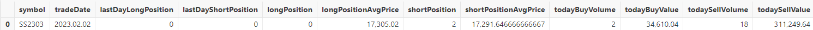

# 期货分钟频CTA策略回测案例

CTA 策略在现代金融市场中扮演着重要角色，通过技术分析和趋势跟踪，其能够帮助用户捕捉市场动向，实现风险对冲和利润最大化。在中高频交易中，CTA 策略对交易效率、盈利能力的助益尤为明显。

在投入实盘交易之前，利用市场的历史数据对量化中高频策略进行测试和评估是确保交易策略有效性和可行性的重要步骤。DolphinDB 凭借其高性能计算引擎和强大的数据处理能力，成为中高频交易策略回测的理想选择。在本文中，我们将通过一个期货分钟频率 CTA 策略的回测案例，详细介绍 DolphinDB 中高频回测引擎的使用，展示其在实际应用中的强大性能。

## 1. 背景介绍

本文将详细展示如何结合多个技术分析指标，如 ATR （平均真实范围）和 RSI （相对强弱指数），实现 CTA 策略的逻辑，包括具体的开仓和止损条件设定。

在介绍期货分钟频 CTA 策略的实现之前，为使读者更好地理解案例，本章将简要介绍 CTA 策略，以及 DolphinDB 提供的中高频回测解决方案。

### 1.1 CTA 策略背景介绍

CTA 投资策略主要通过技术分析和系统化交易方法，在期货和期权市场上进行交易，可分为主观 CTA 和量化 CTA 两大主流策略。主观 CTA 策略依赖管理人的判断，通过基本面分析和主观判断市场走势来获取收益。而量化 CTA 策略则通过建立量化模型，根据模型产生的买卖信号进行投资决策。

量化 CTA 策略依赖技术分析工具和指标，如移动平均线（MA）、相对强弱指数（RSI）和平均真实范围（ATR）等，来识别市场趋势和交易机会。同时， CTA 策略高度重视风险管理，通常设定止损和止盈点，以保护投资组合免受重大损失。期货资产买卖的双向交易和 T+0 交易制度优势，使得量化 CTA 策略能够快速适应市场环境，更直观地捕捉市场变化带来的机遇。因此，当期货市场出现剧烈上涨或下跌波动时，量化CTA策略往往能够有效地从中获利。

从交易策略进行分类，量化 CTA 策略可以分为趋势跟踪、趋势反转、套利对冲。

* 趋势跟踪：主要通过追随已形成的价格趋势获利，在上涨趋势时持有多仓，下跌时持有空仓，当趋势结束时平仓。
* 趋势反转：通过价格拐点从价格回归过程中获利。信号反转向上时持有多仓，显示价格反转向下时持有空仓，实现回归时进行平仓。
* 套利对冲：通过对相关品种/合约进行交易。可以做多低估值品种，做空高估值品种；也可以从价格回归中获利，包括期现套利、跨期套利、跨品种套利、跨市场套利等。

本文将通过 DolphinDB 实现期货分钟频率 CTA 的趋势反转策略。

### 1.2 DolphinDB 中高频回测解决方案概述

中高频量化交易策略回测平台的实现主要包括三个重要环节：行情数据按顺序回放，委托订单撮合，以及策略开发与策略回测绩效评估。而在实现中高频策略回测时往往面临以下几个挑战：

首先，海量中高频交易数据对回测引擎的查询与计算性能提出了极高的要求。

其次，为确保策略评估和优化的有效性，回测过程中应尽可能模拟实际的交易过程，例如考虑订单能否成交、成交价格、成交量以及市场冲击等因素。

此外，回测引擎还应具有灵活的架构，能够支持多种交易策略和技术指标的实现，并且易于扩展，以适应不同的市场和交易需求。

针对上述挑战，DolphinDB 基于其高性能的分布式存储和计算架构，为用户提供了一个易扩展、性能优的中高频量化交易策略回测解决方案。该方案实现了库内行情回放、模拟撮合引擎和事件型中高频回测引擎三大核心组件，支持通过 DolphinScript、Python 或 C++语言完成中高频策略的研发和测试。具体来说，该方案涵盖以下三个模块：

* 回放功能：支持将一个或多个不同结构的分布式表中的数据严格按照时间或者按指定多列排序顺序**回放**到流表中，因此可以方便地解决因子计算和量化策略研发中研发和生产一体化的问题。
* 模拟撮合引擎插件：支持沪深交易所 Level-2 逐笔行情和快照行情，实现与交易所一致的“**价格优先，时间优先**”的高精度的撮合、基于多种行情数据的撮合模式、丰富的可用于模拟实盘环境的撮合配置。
* 回测插件：用户可以在其中自定义指标，支持基于逐笔、快照、分钟和日频行情进行策略回测，获取回测的收益、持仓、交易明细等信息。其中基于逐笔和快照行情进行高精度策略回测，用户可以实现仿真和回测一体化的策略验证。

值得一提的是，这三个模块化解决方案与外部解决方案兼容性良好。即使用户已经实现了某个环节的解决方案，DolphinDB 提供的解决方案也可以与其融合成一个完整的回测方案。

## 2. 基于 DolphinDB 的期货 CTA 趋势反转策略实现

本案例基于分钟频率数据，结合ATR（平均真实范围）和RSI（相对强弱指数）技术分析指标，实现期货 CTA 趋势反转策略，具体策略逻辑如下：

1. **计算指标：**
   * 计算1分钟内标的的最高价、最低价与前收盘价的绝对值差（TR指标），然后求得TR指标的平均值（ATR）。
   * 用过去10分钟的收盘价数据计算RSI指标。
2. **开仓：**
   * 当RSI值大于70且ATR大于其10分钟均值时，买入开仓。
   * 当RSI值小于30且ATR大于其10分钟均值时，卖出开仓。
3. **止损：**
   * 持有多仓时，若K线达到最高点后回落0.004，卖平。
   * 持有空仓时，若K线达到最低点后反弹0.004，买平。

### 2.1 编写自定义策略

**首先，基于分钟频行情数据定义两个重要的技术分析指标：** 平均真实范围（ATR）和相对强弱指数（RSI）。ATR 用于衡量市场的波动性，而 RSI 则用来评估市场的超买或超卖状态。

为了满足使用中高频行情数据计算类似量价因子的需求，DolphinDB 回测引擎采用了状态响应式引擎。这一引擎能够实现流批统一计算，并有效处理带有状态的高频因子，具体也可以参考[状态响应式引擎用户手册](../funcs/c/createReactiveStateEngine.html)定义相应的指标。以下是定义技术指标 ATR 和 RSI 的代码示例：

```
@state
def atr(high, low, close, m=14,n=10) {
    prevClosePrice=prev(close)
    tr = rowMax([high-low,abs(high-prevClosePrice),abs(low-prevClosePrice)])
    atr=ema(tr, m)
    mAtr=mavg(atr,n)
    return atr,mAtr
}
@state
def rsi(close, timePeriod=14) {
     deltaClose = deltas(close)
     up = iif(nullCompare(>, deltaClose, 0), deltaClose, 0)
     down = iif(nullCompare(>, deltaClose, 0), 0, -deltaClose)
     upAvg = ema(up, timePeriod)
     downAvg = ema(down, timePeriod)
     return 100.0 * upAvg / (upAvg + downAvg)
}
```

中高频回测中，策略通常是事件驱动的，而一个策略逻辑通常需要涉及多种事件，比如新的行情到来、新的订单成交等等。DolphinDB 回测引擎采用事件驱动机制，提供了全面的事件函数如策略初始化函数、盘前回调函数、行情回调函数、每日盘后回调函数等，用户可以在相应的回调函数中编写策略逻辑实现相应的策略。后续本案例将会展示不同的事件函数是如何实现的。

**在策略初始化函数中，首先订阅基于主连复权（平滑）处理之后的最高价、最低价和收盘价行情数据计算 ATR、过去10分钟的 ATR 均值指标和 RSI 指标。** 这里 signal 字段为数组向量，存储的数据分别为主连行情复权之后的最高价，最低价和最新收盘价。subscribeIndicator 接口获取回测引擎名、需要计算的数据类型、需要计算的指标字典（key 为指标名，用于之后访问；value 为指标计算的元代码），之后计算结果将传入`onBar` 等策略回调函数。

```
def initialize(mutable contextDict){
    d=dict(STRING,ANY)
    d["ATR"]=<atr(signal[0], signal[1], signal[2], 14,10)[0]>
    d["mATR"]=<atr(signal[0], signal[1], signal[2], 14,10)[1]>
    d["RSI"]=<rsi(signal[2], 14)>
    Backtest::subscribeIndicator(contextDict["engine"], "kline", d)
    //RSI买入信号指标
    contextDict["buySignalRSI"]=70.
    //RSI卖出信号指标
    contextDict["sellSignalRSI"]=30.
    ///平仓线
    contextDict["closeLine"]=0.004
    //
    contextDict["lowPrice"]=dict(STRING,ANY)
    contextDict["highPrice"]=dict(STRING,ANY)
    //
}
```

**在每日盘前回调交易函数中，可以初始化当日的全局变量或者订阅当日的股票池。** 这里回测接口 Backtest::setUniverse 可以更换当日股票池。

```
def beforeTrading(mutable contextDict){
    ////每日盘前回调函数
    ////通过contextDict["tradeDate"]可以获取当日；
    print ("beforeTrading: "+contextDict["tradeDate"])
    //通过Backtest::setUniverse可以更换当日股票池
    Backtest::setUniverse(contextDict["engine"],["000001.XSHE"])
}
```

**在 K 线行情回调函数** `onBar` **中，通过获取订阅的 ATR 和 RSI 指标来生成买入或卖出信号，并在存在多仓或者空仓时，当行情回调时进行相应的止损操作。** `onBar` 函数的 *msg* 参数，为回测引擎传来的最新分钟频行情，以及 `initialize` 中定义的指标计算结果。*msg* 是一个字典，字典的 key 为期货标的名，而 value 为这支期货标的对应的行情信息以及指标计算结果。以下代码展示了买入开仓与卖出开仓的判断逻辑：

```
def onBar(mutable contextDict, msg){
    for(istock in msg.keys()){
        longPos=Backtest::getPosition(contextDict["engine"],istock).longPosition[0]
        shortPos=Backtest::getPosition(contextDict["engine"],istock).shortPosition[0]
        price=msg[istock]["close"]
        //没有多头持仓，并且多头趋势时，买入
        if(longPos<1 and shortPos<1 and msg[istock]["ATR"]>msg[istock]["mATR"] and
                msg[istock]["RSI"]>contextDict["buySignalRSI"] and msg[istock]["mATR"]>0){
            Backtest::submitOrder(contextDict["engine"], (istock,msg[istock]["symbolSource"],
                      contextDict["tradeTime"],5, price+0.02, 0., 2, 1, 0),"buyOpen")
                contextDict["highPrice"][istock]=price
                continue
        }
        //没有空头持仓，并且空头趋势时，卖出
        if(longPos<1 and shortPos<1 and msg[istock]["ATR"]>msg[istock]["mATR"] and
                msg[istock]["RSI"]<contextDict["sellSignalRSI"] and msg[istock]["mATR"]>0){
            Backtest::submitOrder(contextDict["engine"], (istock,msg[istock]["symbolSource"],
                      contextDict["tradeTime"],5,price-0.02, 0., 2, 2, 0),"sellOpen")
                      contextDict["lowPrice"][istock]=price
                      continue}
    }
}
```

这里的 Backtest::submitOrder 是回测引擎提供的下单接口：

```
Backtest::submitOrder(engine, msg, label="")
//engine 引擎实例
//msg:订单信息元组或表，(股票代码, 下单时间, 订单类型, 订单价格, 订单数量, 买卖方向)
//label:可选参数，方便用于对订单进行分类
```

除了根据行情到来编写相应策略外，中高频回测引擎还支持针对委托订单发生订单状态变化、成交、每日盘后进行账户信息统计、策略结束之前处理相应的业务逻辑等编写相应策略。要了解所有中高频回测引擎支持的事件回调函数，请参阅[回测插件接口说明文档](../plugins/backtest.html)。

### **2.2 根据策略设置相应的配置参数**

回测的开始与结束日期、初始资金、手续费和印花税、行情类型、订单延时、动态分红除权等均可以通过参数进行配置。这些参数允许用户灵活地调整回测条件，以模拟不同的市场环境和交易策略的效果。本案例为期货策略的回测，因此策略类型参数应设置为 “future”，以确保回测引擎能够正确识别和处理期货交易的特定规则和逻辑。具体的初始参数配置代码示例如下：

```
userConfig=dict(STRING,ANY)
userConfig["startDate"]= 2023.02.01
userConfig["endDate"]= 2023.02.28
userConfig["strategyGroup"]= "future"
userConfig["cash"]= 10000000
userConfig["commission"]= 1.5
userConfig["tax"]= 0.0 // useless in future goods backtest engine
userConfig["dataType"]=3
userConfig["msgAsTable"]= false
userConfig["frequency"]= 0
userConfig["outputOrderInfo"]= true
userConfig["depth"]= 5
```

创建期货回测时，需要用户配置期货合约的基本信息表，包括期货合约的合约乘数、交易单位、手续费和手续费的计费方式的（按手数计费或者按成交金额计费）等，具体配置可见[回测引擎接口说明文档](../plugins/backtest.html)。

### 2.3 创建回测引擎

```
engine=Backtest::createBacktestEngine(strategyName, userConfig,, initialize,
  beforeTrading, onTick, onSnapshot, onOrder, onTrade, afterTrading, finalize)
```

### 2.4 执行回测引擎

通过 Backtest::createBacktestEngine 创建回测引擎之后，可以通过以下方式执行回测。messageTable 数据为相应的分钟频率行情数据，行情数据字段和类型说明参考[回测插件的接口文档](../plugins/backtest.html)。

```
Backtest::appendQuotationMsg(engine,messageTable)
```

### 2.5 **获取回测结果**

回测运行结束之后，可以通过相应的接口获取每日持仓、每日权益、收益概述、成交明细和策略中用户自定义的逻辑上下文。回测插件提供的完整回测结果接口可以参阅[回测插件的接口说明文档](../plugins/backtest.html)。下图为本例获得的每日持仓数据：



## 3. 性能测试

为了更清晰地展示 DolphinDB 中高频回测引擎的性能，我们选取了两组数据进行测试：一组是某只期货主力合约一个月内的数据，另一组是77只期货主力合约一个月内的数据。所用数据均为2023年2月份的期货1分钟频率数据。测试模式设定为单线程，以模拟真实交易环境下的回测性能。

本文使用的测试环境配置为：

* DolphinDB v3.00.1 单节点
* CPU：Intel(R) Xeon(R) Silver 4216 CPU @ 2.10GHz 64核
* 内存：400G
* 硬盘：SSD 12 Gbps

表 3-1：期货分钟频 CTA 策略回测性能测试结果

| **数据量** | **订单数（笔）** | **总耗时（秒）** |
| --- | --- | --- |
| 12,232 条（1 只主力合约 1 个月内数据） | 19 | 0.6 |
| 597,316 条（77 只主力合约 1 个月内数据） | 1,792 | 12 |

上述表格展示了 DolphinDB 在处理中高频数据时的效率，充分体现了其在中高频交易策略回测中的优势。

## 4. 总结与展望

本文展示了如何通过 DolphinDB 回测引擎实现期货中高频策略的回测，展现了 DolphinDB 回测引擎优异的性能、丰富的策略触发机制以及全面的回测结果信息。接下来我们还将陆续发布股票、期权等回测案例，以进一步展示 DolphinDB 在不同市场和策略中的应用。

## 5. 附录

[期货 CTA 策略回测 demo](script/futures_minute_frequency_cta_strategy_backtest_example/futureCTAStrategy.dos)

