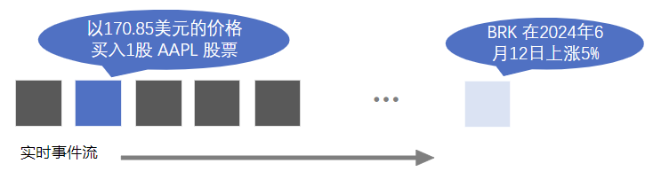
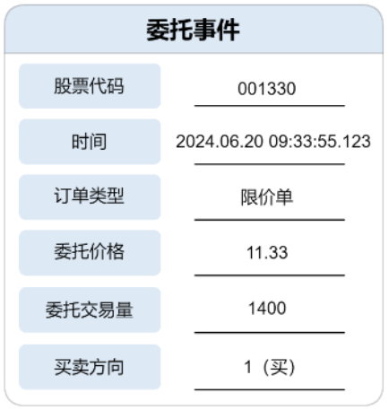
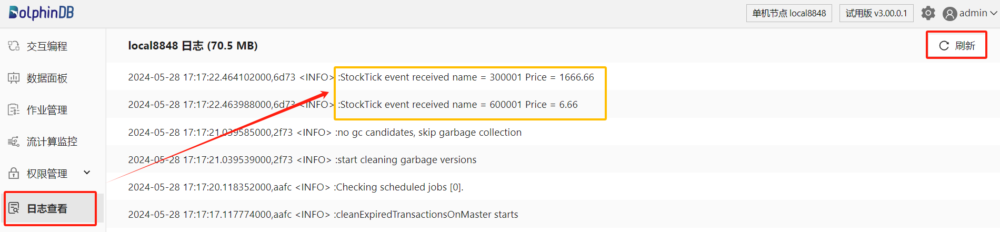
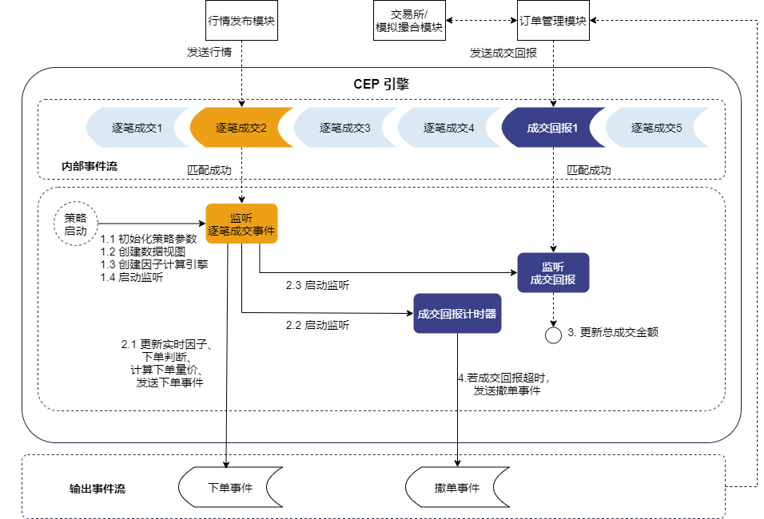
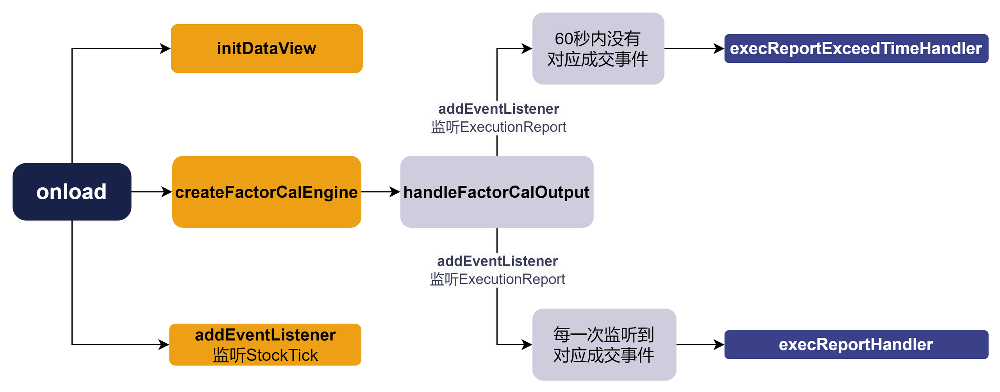
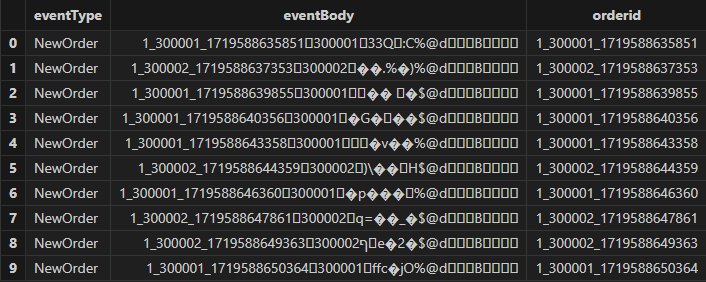
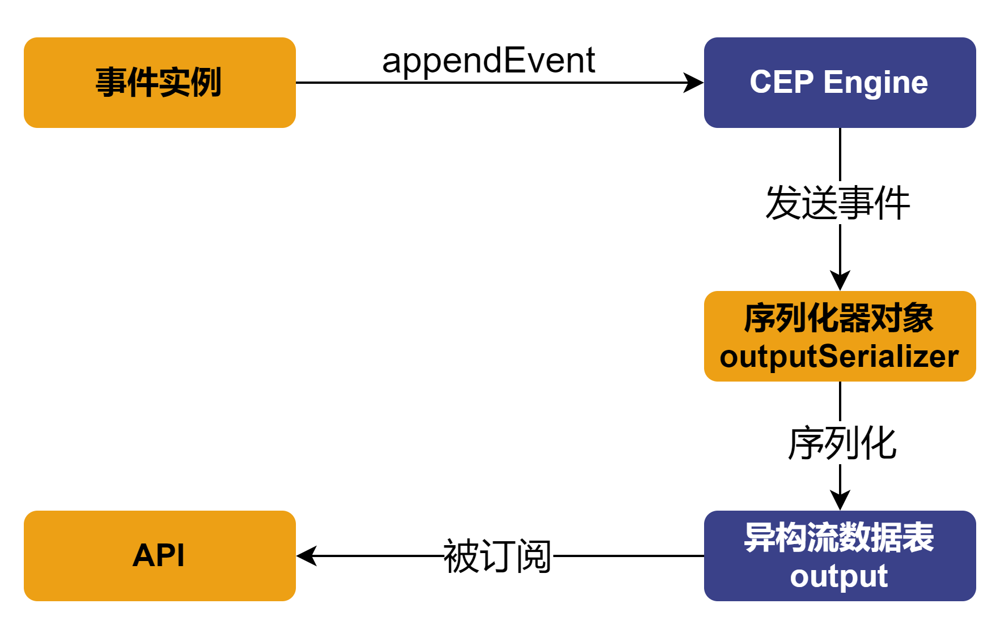
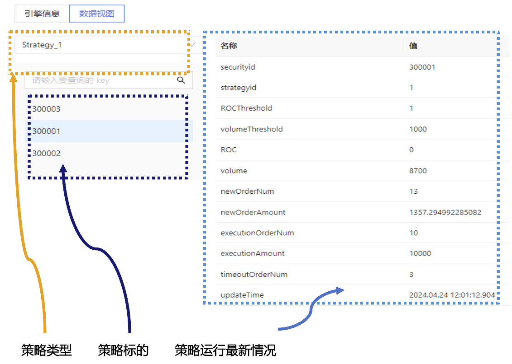

# CEP 引擎入门：初级高频量价因子策略的实现

提示： 本教程涉及以下 DolphinDB 概念，读者可以按需进行查询和扩展阅读：

* [编程语言](https://docs.dolphindb.cn/zh/progr/progr_intro.html)
* [复杂事件处理（CEP）引擎官方文档](https://docs.dolphindb.cn/zh/stream/cep_intro.html)
* [响应式状态引擎](https://docs.dolphindb.cn/zh/stream/reactive_state_engine.html)
* [流数据表](https://docs.dolphindb.cn/zh/stream/str_table.html)
* [CEP 引擎白皮书](https://dolphindb.cn/whitepaper/cep)

高频交易（High-Frequency Trading, HFT）作为现代金融市场中的重要组成部分，以其高速、自动化和复杂的算法交易策略而著称。高频交易策略通过分析大量实时变化的市场数据，利用市场的微小价格波动迅速做出交易决策，从而在极短的时间内获取利润。这样的需求对数据基础设施提出了极高的要求，而DolphinDB 作为一款高性能分布式时序数据库，可以凭借其高效的计算能力和丰富的功能模块辅助高频策略的投研。

在本篇文章中，我们将详细介绍 DolphinDB 流数据框架中的复杂事件处理（Complex Event Processing, 下称CEP ）引擎。CEP 引擎能够从大规模和复杂的实时数据流中提取事件信息，对符合预定模式的事件进行实时的分析和决策，解决普通流数据处理无法满足的复杂需求。在本文中，我们将通过两个例子逐步介绍如何使用 CEP 引擎处理事件流数据。

## 1. 关键概念

在处理事件以及复杂事件数据前，首先要了解一些关于 CEP 引擎最基础、最核心的概念。这些概念将贯穿整个 CEP 引擎的使用过程。例如，在 DolphinDB 的框架下，什么是事件和复杂事件？

### 1.1 [事件（Event）](https://docs.dolphindb.cn/zh/stream/cep_intro.html#ariaid-title2)和复杂事件（Complex Event）

在 CEP 系统中，**事件是一段时间内发生的特定事情或状态的数据表示，是描述对象变化的属性值的集合**。例如“以170.85美元的价格买入1股 AAPL 股票”和“BRK 在2024年6月12日上涨5%”都是事件。它源源不断地产生，并以流的形式存在。


图1-1

在 CEP 系统中，定义一个事件时需要指定事件类型及其包含的每个属性的名称和类型。在 DolphinDB 中，使用类（Class）来定义事件，类名为事件类型，类的对象实例是一次具体的事件。同时，在 DolphinDB 中可以用流数据表来存储事件流，流数据表中的每一行记录存储了一次具体的事件。



图1-2

通常，用户在事件流中除了查找并处理特定的事件外，还会对事件进行额外的规则限制。复杂事件（Complex Event）不仅仅指某一个事件类型，还往往涉及复杂的事件匹配规则。常见的匹配规则有：

* 事件顺序规则：如“MACD 出现金叉后 30 秒内 CCI 进入超买区间”
* 事件属性值规则：如“某一成交事件中，成交量超过 50000 股”
* 时间规则：如“收到 A 股票成交回报后1分钟内不再对 A 进行下单”

在 DolphinDB 中，主要通过 `addEventListener` 函数的各项参数来表达丰富的匹配规则。

### 1.2 [监视器（Monitor）](https://docs.dolphindb.cn/zh/stream/cep_intro.html#ariaid-title8)

监视器是 CEP 系统中**负责监控并响应事件**的组件，它包含了完整的业务逻辑。

在 DolphinDB 中，使用类（Class）来定义监视器。监视器在创建 CEP 引擎（`createCEPEngine`）时被实例化。一个监视器中主要包含以下内容：

* 一个或多个事件监听器（Event Listener)。事件监听器用于捕捉特定规则的事件。
* 一个或多个回调函数。回调函数是在捕捉到特定事件后执行的操作。
* 一个 `onload` 函数。`onload` 函数可以被视为初始化监视器的操作，通常包括启动一个或多个事件监听器。该函数仅在监视器被实例化时被执行一次。

### 1.3 [事件监听器（Event Listener）](https://docs.dolphindb.cn/zh/stream/cep_engine.html#ariaid-title3)

事件监听器包含了需要捕捉的特定事件规则，并能够**进行实时地规则匹配，一旦条件满足就会触发预设的操作**。这些条件可以是简单的数据阈值判断，也可以是复杂的模式匹配（序列模式、计时器等）。

在 DolphinDB 中，执行监视器中的 `addEventListener` 函数即可启动特定的事件监听器。通过 `addEventListener` 函数不同的参数配置可以灵活地描述匹配规则。

假设 CEP 引擎具体的使用情景为量化交易，则监视器（Monitor）可以被视为一个包含一个或多个交易逻辑的容器，而事件监听器（Event Listener）则是容器中用于检测特定市场条件的组件。在实际应用中，一个监视器可能包含多个事件监听器，每个监听器负责监测一种特定类型的市场活动或条件。当所有相关条件都满足时，交易策略（即监视器）将执行预定的交易动作，如买入、卖出或调整仓位。

## 2. 案例 I ：监听股价并记入日志

我们先在一个简单的场景中应用 CEP 引擎。假设现在希望把实时的市场行情记录到日志中，应该如何通过 CEP 引擎实现呢？

### 2.1 定义事件类

在这个初级案例中，我们将对代码进行详细的解释，以帮助用户理解代码逻辑。而在后续的案例中，会减少一些不必要的代码解释。

CEP 引擎的处理对象为事件，因此要先定义引擎内需要的事件。此处定义了一个名为 StockTick 的[事件类](https://docs.dolphindb.cn/zh/progr/oop.html)，这个类包含股票的名称（name）和价格（price）两个属性，用来代表市场上股票的价格变动信息。

```
//定义一个事件类，表示每个tick的股票行情事件
class StockTick{
    name :: STRING
    price :: FLOAT
    def StockTick(name_, price_){
        name = name_
        price = price_
    }
}
```

* `class StockTick` ：定义一个名为 StockTick 的类，用来表示从市场数据源接收的股票行情。
* `name :: STRING` ：在类中定义一个名为 name 的字符串属性，用于存储股票的名称。
* `price :: FLOAT`：在类中定义一个名为 price 的浮点属性，用于存储股票的价格。
* `def StockTick(name_, price_)`：类的构造函数，用于实例化一个 StockTick 对象。

### 2.2 定义监视器和设置监听

其次，定义一个名为 SimpleShareSearch 的监视器类，该监视器通过变量 newTick 存储最新接收到的 StockTick 事件。同时，监视器在启动时会调用 `onload` 函数，随即注册一个事件监听器，它会捕获所有的 StockTick 事件，并在回调函数 `processTick` 中处理这些事件。处理过程中，监视器将接收到的股票信息记录到日志中。

```
class SimpleShareSearch {
	//保存最新的 StockTick 事件
	newTick :: StockTick
	def SimpleShareSearch(){
		newTick = StockTick("init", 0.0)
	}
	def processTick(stockTickEvent)

	def onload() {
		addEventListener(handler=processTick, eventType="StockTick", times="all")
	}
	def processTick(stockTickEvent) {
		newTick = stockTickEvent
		str = "StockTick event received" +
			" name = " + newTick.name +
			" Price = " + newTick.price.string()
		writeLog(str)
	}
}
```

* `class SimpleShareSearch`：定义一个名为 SimpleShareSearch 的监视器类。
* `newTick :: StockTick`：定义一个属性 newTick，类型为 StockTick，用于存储最新接收到的 StockTick 事件。
* `def SimpleShareSearch()`：类的构造函数。
* `def onload()`：**监视器必须包含的方法**，当 CEP 引擎被创建时将会实例化监视器，这将调用 onload 方法对监视器进行初始化。在本例中启动了一个事件监听器 。
* `addEventListener(handler=processTick, eventType="StockTick", times="all")`：该事件监听器在 `onload`中注册，在创建引擎时立刻开始监听所有类型为 StockTick 的事件，并对所有 StockTick 事件使用`processTick`方法处理。times 参数的默认设置为 "all"，表示监听并响应每一次匹配的事件。如果 times=1，事件监听器将在找到一个对应事件后终止 。更为详细的参数设置规则可以参考[相应文档](https://docs.dolphindb.cn/zh/stream/cep_engine.html)。
* `def processTick(stockTickEvent)`：定义事件处理方法，接收一个 StockTick 类型的事件作为参数。类的成员方法需要至少先声明或者定义之后才能被调用，因此需要先声明`processTick`方法以防止`onload`中的`addEventListener`函数调用报错。在收到 StockTick 事件之后执行`processTick`，将在日志中记录 StockTick 相关信息。
* `newTick = stockTickEvent`：更新监视器中的属性 newTick 为最新接收到的事件。在本例中，这一操作并不是必选的，仅仅为了展示监视器中可以存储运行过程中的变量这一功能。例如，基于此功能可以扩展本例为同时打印出上一条行情与最新的行情。

### 2.3 创建 CEP 引擎

创建一个 CEP 引擎，配置好相关的表结构和监视器，以便引擎能够接收和处理 StockTick 类型的事件。

```
dummyTable = table(array(STRING, 0) as eventType, array(BLOB, 0) as eventBody)
try {dropStreamEngine(`simpleMonitor)} catch(ex) {}
createCEPEngine(name="simpleMonitor", monitors=<SimpleShareSearch()>,
dummyTable=dummyTable, eventSchema=[StockTick])
```

* `dummyTable`：包含 eventType 和 eventBody 两列的表作为引擎的输入表，这个表将被用作 CEP 引擎创建时的 dummyTable 参数。在 2.4 小节将进一步介绍该参数的含义。
* `try {dropStreamEngine(`simpleMonitor)} catch(ex) {}`：这是 CEP 引擎脚本中常见的清理环境方法。若已存在同名引擎，则引擎无法被成功创建，因此在创建引擎前尝试删除叫 simpleMonitor 的流引擎，并捕获可能因为引擎并不存在而返回的异常。
* `createCEPEngine`：创建 CEP 引擎，命名为 simpleMonitor。同时，指定引擎将使用 SimpleShareSearch 类的实例作为其监视器，dummyTable 为输入表，最后指定引擎将输入表中的数据解析为 StockTick 事件类。

### 2.4 向引擎输入模拟数据

在 DolphinDB 中可以通过两种不同的方法，向 CEP 引擎注入事件：

* `appendEvent(engine, events)`：直接将事件实例写入 CEP 引擎的方法。
* `append! / tableInsert / insert into`：通过向 CEP 引擎写入一张表的方式来向引擎输入数据。这种方式在事件注入引擎之前，需要先将其序列化为 BLOB 格式写入异构流数据表中，再通过上述几个函数之一向引擎输入数据。因此，在上文中创建的 CEP 引擎输入表 dummyTable 中进行了相应的设置，eventType 列储存事件类型，eventBody 列储存对应事件的序列化结果。该方法的好处是可以将多个不同的事件类型写入到一个异构流数据表中。然后通过订阅该异构流数据表，向引擎输入事件数据。

向 CEP 引擎输入数据，查看日志并检查引擎运行结果是否符合预期。

```
stockTick1 = StockTick('600001',6.66)
getStreamEngine(`simpleMonitor).appendEvent(stockTick1)
stockTick2 = StockTick('300001',1666.66)
getStreamEngine(`simpleMonitor).appendEvent(stockTick2)
```

* 在上面的代码中，模拟了2个 StockTick 事件。事件1的股票代码为600001，股价为6.66；事件2的股票代码为300001，股价为1666.66元。
* 通过 `getStreamEngine` 函数返回名为"simpleMonitor"的 CEP 引擎的句柄，然后通过 `appendEvent` 方法直接向 CEP 引擎写入两个事件实例。
* 在 DolphinDB 的 Web 端选择日志查看并在页面右上角刷新，即可看到 CEP 引擎已经识别了输入的事件，并且执行了写入日志的操作。



图2-1

### 2.5 实现流程

1. 定义 CEP 引擎将要监听或处理的事件类。在本例中，定义了一个有名称和价格两个属性的 StockTick 类作为监控的对象，用来代表市场上股票的价格变动信息。
2. 定义一个监视器类，其中必须包含 `onload`方法，该方法将在创建 CEP 引擎时被首先调用。本例中 `onload` 方法中调用了 `addEventListener`函数，即在引擎创建时就启动监听，并在每一次监听到对应的事件后交由指定回调函数处理。
3. 定义回调函数，即处理事件的方法。本例中该函数将股票价格变动写入了日志。
4. 创建 CEP 引擎。在本例中，创建引擎时对命名了引擎，指定了引擎的监视器（monitors）、输入表结构（dummyTable）和要处理的事件类型（eventSchema）。
5. 模拟事件数据并输入引擎，查看日志检查结果是否符合设计预期。

至此，便实现了对市场行情的实时监控，并且以一定的格式记录到了日志中。通过这种方式，DolphinDB 的 CEP 引擎提供了一种高效的机制来实时监测和响应事件流中的事件，使得用户可以根据实时数据变动快速地进行应对，而上文仅仅是一个简单的金融领域的例子。

在上面的例子中，我们对 CEP 引擎和它的关键概念、基本的代码运行逻辑有了初步的了解，并且可以实现单一事件流监控并记录日志的操作。但这样的单一类型流数据计算和监控用 DolphinDB 已有的流计算框架也能够实现，那么还为什么需要额外的 CEP 引擎呢？

因为上文中的案例不涉及复杂的事件匹配规则。当所需要处理的事件类型越多、越复杂，所需监控的事件模式和特定模式下需执行的响应操作越多、越复杂，则在 CEP 引擎框架下，通过 DolphinDB 脚本直接进行事件描述和匹配等操作进行的程序开发效率就越高。CEP 引擎既保留了流计算引擎高吞吐、低时延、流批一体等强大优势，又在灵活性与事件描述语言等方面进行了改进。

## 3. 案例 II ：初级高频量价因子策略实现

在金融高频量化场景下，CEP 引擎还可以为用户实现涉及多种事件的复杂交易策略，如套利交易、组合交易等策略，还可以进行风险控制、可视化监控等业务。我们可以再从一个初级的事件化量价因子驱动的交易策略开始，进一步感受 CEP 引擎的灵活性。

### 3.1 策略逻辑

基于股票逐笔成交数据，策略将根据每支股票最新的成交价涨幅和累计成交量判断是否执行下单或撤单等操作，具体流程如下所示。



图3-1

具体的策略判断逻辑细节如下：

* 根据每一笔成交数据触发计算两个实时因子：最新成交价相对于15秒内最低成交价的涨幅 （变量 ROC）和过去1分钟的累计成交量 （变量 volume ）；
* 在策略启动时设定每支股票的两个因子阈值（ ROC0、volume0 ），每当实时因子值更新后判断是否 ROC > ROC0 且 volume > volume0。
  + 若是，则触发下单；
  + 若下单后1分钟内仍未成交，则触发对应的撤单。

**比案例 I 更进一步之处**

* **在 CEP 引擎内使用了[响应式状态引擎](https://docs.dolphindb.cn/zh/stream/reactive_state_engine.html)（Reactive State Engine, RSE）计算因子。** 响应式状态引擎支持实时数据的高性能增量计算。在本例中的 CEP 引擎内部，使用了响应式状态引擎及其内置的状态函数对两个因子值进行计算。
* **向外部系统发送事件。** 在策略执行的过程中，当满足某些具体的条件时，CEP 引擎内部需要将特定事件（本例中为下单和撤单事件）通过 `emitEvent` 接口发送到 CEP 引擎外部。
* **使用了超时计时器。** 在 `addEventListener` 函数中有关于事件监听器触发方式和触发次数的可选参数设置。通过这些可选参数可以实现不同的监听触发效果，如事件匹配、计时器、定时器等。本例在每次下单后开启一个新的计时器，若计时超时则触发对应操作。

### 3.2 代码实现

在本小节中将详细介绍案例的代码实现，完整代码附件见文末附录。

#### 3.2.1 定义事件类

```
//  定义股票逐笔成交事件
class StockTick {
	securityid :: STRING
	time :: TIMESTAMP
	price ::  DOUBLE
	volume :: INT
	def StockTick(securityid_, time_, price_, volume_) {
		securityid = securityid_
		time = time_
		price = price_
		volume = volume_
	}
}
// 定义成交回报事件
class ExecutionReport {
	orderid :: STRING
	securityid :: STRING
	price :: DOUBLE
	volume :: INT
	def ExecutionReport(orderid_, securityid_, price_, volume_) {
		orderid = orderid_
		securityid = securityid_
		price = price_
		volume = volume_
	}
}
// 定义下单事件
class NewOrder {
	orderid :: STRING
	securityid :: STRING
	price :: DOUBLE
	volume :: INT
	side :: INT
	type :: INT
	def NewOrder(orderid_, securityid_, price_, volume_, side_, type_) {
		orderid = orderid_
		securityid = securityid_
		price = price_
		volume = volume_
		side = side_
		type = type_
	}
}
// 定义撤单事件
class CancelOrder {
	orderid :: STRING
	def CancelOrder(orderid_) {
		orderid = orderid_
	}
}
```

#### 3.2.2 定义监视器和设置监听

定义一个监视器 StrategyMonitor，在此处封装整体的交易策略。一些策略相关的属性和变量，如策略编号和参数，可以在定义监视器类时进行定义和初始化，整体监视器的结构大致如下。

```
class StrategyMonitor {
	strategyid :: INT // 策略编号
	strategyParams :: ANY // 策略参数：策略标的、标的参数配置
	dataview :: ANY // Data View 监控
	def StrategyMonitor(strategyid_, strategyParams_) {
		strategyid = strategyid_
		strategyParams = strategyParams_
	}
	def execReportExceedTimeHandler(orderid, exceedTimeSecurityid)
	def execReportHandler(execReportEvent)
	def handleFactorCalOutput(factorResult)
	def tickHandler(tickEvent)
	def initDataView()
	def createFactorCalEngine()
	def onload(){
		initDataView()
		createFactorCalEngine()
		securityids = strategyParams.keys()
		addEventListener(handler=tickHandler, eventType="StockTick",
		condition=<StockTick.securityid in securityids>, times="all")
	}
}
```

* 在创建 CEP 引擎时，将首先调用 `onload` 方法，因此代码的解读也从该方法开始。本案例中，`onload` 调用了 `initDataView` 和 `createFactorCalEngine` 方法，并启动对 StockTick 事件的监听。其中，initDataView 方法将在第4节单独讲解，其主要功能是为 Web 端策略运行监控的数据视图更新指定的数据键值，并不是策略重点，因此不在本章详细讲解。
* 在 `createFactorCalEngine` 方法中，对监听到的事件数据进行因子计算后，将计算得到的结果交由 `handleFactorCalOutput`方法处理。
* 在 `handleFactorCalOutput` 方法中启动了两个事件监听器，同时监听成交回报事件，但是设置两个不同的触发条件：

1. 当60秒内没有成交事件时，则触发 `execReportExceedTimeHandler` 方法进行撤单；
2. 每次成交事件发生时，触发 `execReportHandler` 将查询订单号和计算成交金额进行更新。

函数调用流程示意图如下所示。



图3-2

**创建因子计算引擎**：`createFactorCalEngine` 方法具体包含相应的引擎创建和计算逻辑设定，同时规定了数据输入表 dummyTable 和输出表 factorResult 的结构、引擎的计算逻辑 metrics（计算最新成交价/15秒内最低成交价的值、1分钟累计成交量的值和最新成交价的值），创建了名叫 factorCal 的响应式计算引擎。

```
def createFactorCalEngine(){
	dummyTable = table(1:0, `securityid`time`price`volume,
	`STRING`TIMESTAMP`DOUBLE`INT)
	metrics = [<(price\tmmin(time, price, 15s)-1)*100>, <tmsum(time, volume, 60s)>,
	<price> ] // 最新成交价相对于15秒内最低成交价涨幅 ,1分钟累计成交量, 最新成交价
	factorResult = table(1:0, `securityid`ROC`volume`lastPrice,
	`STRING`INT`LONG`DOUBLE)
	createReactiveStateEngine(name="factorCal", metrics=metrics ,
	dummyTable=dummyTable, outputTable=factorResult, keyColumn=`securityid,
	outputHandler=handleFactorCalOutput, msgAsTable=true)
}
```

* 创建响应式状态引擎时，指定参数 `outputHandler=handleFactorCalOutput`，意味着引擎计算结束后，不再将计算结果写到输出表（即使定义了输出表的结构），而是会调用 `handleFactorCalOutput` 方法处理计算结果。同时，设置参数 `msgAsTable=true` 表示引擎的计算结果将以表的形式呈现，且计算结果表的结构与引擎参数 outputTable 指定的表 factorResult 的格式一致。
* 在上述代码中创建的响应式状态引擎将接收与 dummyTable 格式一致的表数据作为输入，按照 metrics 指定的计算方法进行计算，最后把与输出表格式相同的计算结果传递给`handleFactorCalOutput`进行处理。

```
def handleFactorCalOutput(factorResult){
	factorSecurityid = factorResult.securityid[0]
	ROC = factorResult.ROC[0]
	volume = factorResult.volume[0]
	lastPrice = factorResult.lastPrice[0]
	updateDataViewItems(engine=self.dataview, keys=factorSecurityid,
	valueNames=["ROC","volume"], newValues=(ROC,volume))
	if (ROC>strategyParams[factorSecurityid][`ROCThreshold]
	&& volume>strategyParams[factorSecurityid][`volumeThreshold]) {
		orderid = self.strategyid+"_"+factorSecurityid+"_"+long(now())
		newOrder = NewOrder(orderid , factorSecurityid, lastPrice*0.98, 100, 'B', 0)
		emitEvent(newOrder) // 发送下单事件到外部
		newOrderNum = (exec newOrderNum from self.dataview where
		securityid=factorSecurityid)[0] + 1
		newOrderAmount = (exec newOrderAmount from self.dataview where
		securityid=factorSecurityid)[0] + lastPrice*0.98*10
		updateDataViewItems(engine=self.dataview, keys=factorSecurityid,
		valueNames= ["newOrderNum", "newOrderAmount"],
		newValues=(newOrderNum, newOrderAmount)) // 更新data view
		addEventListener(handler=self.execReportExceedTimeHandler{orderid,
		factorSecurityid}, eventType="ExecutionReport",
		condition=<ExecutionReport.orderid=orderid>, times=1, exceedTime=60s)
		addEventListener(handler=execReportHandler, eventType="ExecutionReport",
		condition=<ExecutionReport.orderid=orderid>, times="all") // 启动成交回报监听
	}
}
```

* `handleFactorCalOutput`函数接收响应式状态引擎的计算结果 factorResult 作为入参，取引擎计算结果中的股票代码、最新成交价相对于15秒内最低成交价的涨幅因子( ROC )、过去一分钟的累计成交量因子( volume )和最新价格的数据，然后进行比较判断。如果条件满足，则执行一系列操作：
  + 由策略 id、股票代码和时间构建订单 id。
  + 构造下单事件，按低于最新成交价的2%买入一手。
  + 发送下单事件到 CEP 引擎外部。
  + 向 DataView 获取和更新订单数据和金额（稍后章节单独介绍）。
  + 动态增加了两个事件监听器，都监听成交回报事件，其中：
    - 成交回报监听器：监听到成交回报事件时，触发`execReportHandler`方法，查询订单号和计算成交金额，并将他们更新到 DataView 。
    - 成交超时监听器：通过 times=1 和 exceedTime=60s 设置了一个超时计时器，即 60s 内如果没有匹配到成交回报事件（超时），则触发`execReportExceedTimeHandler`方法1次，发送撤单事件到外部，然后更新 DataView 。否则删除这个事件监听器。

```
def execReportExceedTimeHandler(orderid, exceedTimeSecurityid){
	emitEvent(CancelOrder(orderid)) // 发送撤单事件到外部
	timeoutOrderNum = (exec timeoutOrderNum from self.dataview
	where securityid=exceedTimeSecurityid)[0] + 1
	updateDataViewItems(engine=self.dataview, keys=exceedTimeSecurityid,
	valueNames=`timeoutOrderNum, newValues=timeoutOrderNum) // 更新data view
}
def execReportHandler(execReportEvent) {
	executionAmount = (exec executionAmount from self.dataview
	where securityid=execReportEvent.securityid)[0] +
	execReportEvent.price*execReportEvent.volume
	executionOrderNum = (exec executionOrderNum from self.dataview
	where securityid=execReportEvent.securityid)[0] + 1
	updateDataViewItems(engine=self.dataview, keys=execReportEvent.securityid,
	valueNames=["executionAmount","executionOrderNum"],
	newValues=(executionAmount,executionOrderNum)) // 更新data view
}
```

**启动事件监听器**：`onload` 中初始化了事件监听器监听 StockTick 事件，并且在事件的股票 id 与策略设定需监听的股票 id 相符合时，调用指定的 `tickHandler` 方法。

```
def tickHandler(tickEvent){
	factorCalEngine = getStreamEngine(`factorCal)
	insert into factorCalEngine values([tickEvent.securityid,
	tickEvent.time, tickEvent.price, tickEvent.volume])
}
```

* `tickHandler`方法中，用`getStreamEngine`取得因子计算引擎的句柄后，向引擎插入数据。数据为被事件监听器捕获的符合条件的 StockTick 事件中的股票 id、时间和量价数据。

#### 3.2.3 创建 CEP 引擎

```
dummy = table(array(STRING, 0) as eventType, array(BLOB, 0) as eventBody)
share(streamTable(array(STRING, 0) as eventType, array(BLOB, 0) as eventBody,
array(STRING, 0) as orderid), "output")
outputSerializer = streamEventSerializer(name=`serOutput,
eventSchema=[NewOrder,CancelOrder], outputTable=objByName("output"),
commonField="orderid")
strategyid = 1
strategyParams = dict(`300001`300002`300003,
[dict(`ROCThreshold`volumeThreshold, [1,1000]),
dict(`ROCThreshold`volumeThreshold, [1,2000]),
dict(`ROCThreshold`volumeThreshold, [2, 5000])])
engine = createCEPEngine(name='strategyDemo', monitors=<StrategyMonitor(strategyid,
strategyParams)>, dummyTable=dummy, eventSchema=[StockTick,ExecutionReport],
outputTable=outputSerializer)
```

* 通过`createCEPEngine`方法创建一个 CEP 引擎。
* 在创建引擎时，指定 StrategyMonitor 类作为 CEP 引擎的监视器，并传入 strategyid 和 strategyParams 作为实例化监视器方法的入参。
* 规定引擎的输入表 dummy 的结构，该表有 eventType 列表示事件类型，eventBody 列表示事件序列化的结果；创建一个叫 output 的共享流数据表作为 CEP 引擎的输出结果表。
* 若进入引擎的数据为序列化数据，则它将按照 CEP 引擎的 eventSchema 规定的事件形式进行反序列化。本案例中使用`appendEvent`接口直接向引擎输入事件实例，因此数据进入 CEP 引擎时不涉及数据的反序列化。
* 在上文中提到，如果监视器中调用了`emitEvent`接口，则需要指定 outputTable 参数为序列化器`StreamEventSerializer`的句柄。因此，此处需要创建一个事件序列化器，并通过它将接收到的事件序列化为 BLOB 格式，写入异构流数据表 output 中。序列化器将按对应的 eventSchema 指定的键的顺序把事件序列化为对应的值（此处的 eventSchema 为序列化器的参数）。在本例中，这个序列化处理器将接收`emitEvent`发送出来的事件实例并进行处理，因此序列化器的 eventSchema 事件参数应该设置为发送出 CEP 引擎的事件。

#### 3.2.4 向引擎输入模拟数据

构造 StockTick 事件实例，并且通过 `appendEvent` 输入CEP 引擎。

```
ids = `300001`300002`300003`600100`600800
for (i in 1..120) {
    sleep(500)
    tick = StockTick(rand(ids, 1)[0], now()+1000*i,
10.0+rand(1.0,1)[0], 100*rand(1..10, 1)[0])
    getStreamEngine(`strategyDemo).appendEvent(tick)
}
```

* 定义了一组股票代码，生成120条逐笔成交数据。每次循环中创建一个 StockTick 实例模拟股票的逐笔成交数据，包含股票代码、成交时间、成交价格和成交量。将生成的 StockTick 事件发送到 CEP 引擎中，以便处理这些模拟的成交数据。

```
sleep(1000*20)
print("begin to append ExecutionReport")
for (orderid in (exec orderid from output where eventType="NewOrder")){
    sleep(250)
    if(not orderid in (exec orderid from output where eventType="CancelOrder")) {
        execRep = ExecutionReport(orderid, split(orderid,"_")[1], 10, 100)
        getStreamEngine(`strategyDemo).appendEvent(execRep)
    }
}
```

* sleep(1000\*20) 是为了模拟已经有挂单，但还没成交的场景。
* 遍历所有的新订单，查询从输出表中获取的所有新订单 id。检查当前订单 id 是否未被撤销。若未被撤销，则生成一个成交回报事件。

**查看结果**

执行代码，查看结果表 output 如下所示。其中 eventType 展示了被发送到输出事件队列的事件类型，eventBody 为事件序列化的结果。 orderid 并不是必选的，这里作为单个订单事件唯一的标识符。


图3-3

整体流程上看：

1. 事件实例进入引擎，经由监视器中的事件监听器进行监听和触发相应的回调函数。
2. 随后，通过 `emitEvent` 方法将事件插入到引擎事件输出队列的尾部。
3. 这些事件将会被发送到 outputTable 参数指定的 `streamEventSerializer` 返回的序列化器对象 outputSerializer 中进行序列化。
4. 最后将序列化后的事件数据输出到异构流数据表 output 中，供各种 API 接口进行订阅和反序列化操作。

   ​



图3-4

## 4. 数据视图（DataView）

在案例 II 中，为了可以方便地监控策略运行时一些数据的最新状态，在初始化监视器时的`onload`方法中创建了一个数据视图引擎（DataView Engine）。本章介绍案例 II 中具体的数据视图创建和更新的代码。

数据视图（DataView） 是在某一时刻对特定数据的快照。在 CEP 系统中，DataView 用于持续追踪和显示 CEP 引擎处理的中间变量或监控值的最新状态。这些监控值可能是由事件触发并在事件处理过程中动态计算和更新的，例如交易量、价格等随事件不断变化的量。请注意，数据视图页面仅展示监控值的最新快照，不支持查看历史快照。若需要查看监控值的历史快照和趋势变化图，请使用[数据面板](https://docs.dolphindb.cn/zh/tutorials/dashboard_tutorial.html?hl=)功能（Dashboard）。

数据视图引擎（[DataView Engine](https://docs.dolphindb.cn/zh/stream/cep_monitoring.html?hl=dataview#topic_wlf_rz5_x1c__%E5%88%9B%E5%BB%BA-DataView-%E5%BC%95%E6%93%8E)） 是一个特殊的 DolphinDB 引擎，负责维护和管理一个或多个 DataView 。它允许 CEP 引擎在运行过程中将监控值写入到这些 DataView 中。引擎保存每个监控值的最新快照，并负责将这些数据输出到目标表（通常是流数据表），使得这些数据可以被其他程序订阅或查询。在 CEP 系统中，可以创建多个 DataView Engine，并在创建时指定需要维护的监控值名称。

### 4.1 初始化数据视图

```
def onload() {
    // 初始化 data view
    initDataView()
    ......
}
```

* 在 `onload` 中调用初始化 DataView 的函数，然后在监视器内完善 `initDataView` 方法。

```
def initDataView(){
    share(streamTable(1:0, `securityid`strategyid`ROCThreshold
`volumeThreshold`ROC`volume`newOrderNum`newOrderAmount`executionOrderNum
`executionAmount`timeoutOrderNum`updateTime,
`STRING`INT`INT`INT`INT`INT`INT`DOUBLE`INT`DOUBLE`INT`TIMESTAMP), "strategyDV")
    dataview = createDataViewEngine(name="Strategy_"+strategyid,
outputTable=objByName(`strategyDV), keyColumns=`securityId, timeColumn=`updateTime)
    num = strategyParams.size()
    securityids = strategyParams.keys()
    ROCThresholds = each(find{,"ROCThreshold"}, strategyParams.values())
    volumeThresholds = each(find{,"volumeThreshold"}, strategyParams.values())
    dataview.tableInsert(table(securityids, take(self.strategyid, num) as
strategyid, ROCThresholds, volumeThresholds, take(int(NULL), num) as ROC,
take(int(NULL), num) as volume, take(0, num) as newOrderNum,
take(0, num) as newOrderAmount, take(0, num) as executionOrderNum,
take(0, num) as executionAmount, take(0, num) as timeoutOrderNum))
}
```

* 函数 `initDataView` 首先创建并共享了一个叫”strategyDV”的流数据表，用作 DataViewEngine 的输出表。该表规定了输出表的结构，指定了希望监控的相应数据。
* 通过 `createDataViewEngine` 创建了引擎，设定了引擎键值，对于每个键值，引擎都只保留最新的 1 条数据。
* `find` 函数从每个股票的策略参数字典中查找 ROCThreshold 和 volumeThreshold 键的值。
* `each` 函数把 `find` 函数应用到每个股票的策略参数字典上，为每个股票提取出策略因子的阈值。
* 最后将提取的阈值和初始状态值插入到 DataView 的表中。

### 4.2 更新数据视图指定键值的数据

[updateDataViewItems](https://docs.dolphindb.cn/zh/stream/cep_monitoring.html?hl=dataview#topic_wlf_rz5_x1c__%E6%9B%B4%E6%96%B0%E6%95%B0%E6%8D%AE%E8%A7%86%E5%9B%BE%E6%8C%87%E5%AE%9A%E9%94%AE%E5%80%BC%E7%9A%84%E6%95%B0%E6%8D%AE) 可以更新 DataView 引擎中指定键值对应的指定属性的值。它被多次用在不同的方法中。

* 更新超时订单数量：当一个成交回报事件超时未收到时，函数会增加超时订单的数量并更新相应的 DataView 。

```
def execReportExceedTimeHandler(orderid, exceedTimeSecurityid){
	emitEvent(CancelOrder(orderid)) // 发送撤单事件到外部
	timeoutOrderNum = (exec timeoutOrderNum from self.dataview
	where securityid=exceedTimeSecurityid)[0] + 1
	updateDataViewItems(engine=self.dataview, keys=exceedTimeSecurityid,
	 valueNames=`timeoutOrderNum, newValues=timeoutOrderNum) // 更新data view
}
```

* 更新成交金额和订单数量：先计算给定 securityid 的成交金额和订单数量，再用`updateDataViewItems`方法更新它们。

```
def execReportHandler(execReportEvent) {
	executionAmount = (exec executionAmount from self.dataview
	where securityid=execReportEvent.securityid)[0] +
	execReportEvent.price*execReportEvent.volume
	executionOrderNum = (exec executionOrderNum from self.dataview
	where securityid=execReportEvent.securityid)[0] + 1
	updateDataViewItems(engine=self.dataview, keys=execReportEvent.securityid,
	valueNames=["executionAmount","executionOrderNum"],
	newValues=(executionAmount,executionOrderNum)) // 更新data view
}
```

* 更新 ROC 和成交量数据：当因子计算引擎输出结果时，更新相关的 ROC 和成交量数据。

```
def handleFactorCalOutput(factorResult){
    factorSecurityid = factorResult.securityid[0]
    ROC = factorResult.ROC[0]
    volume = factorResult.volume[0]
    lastPrice = factorResult.lastPrice[0]
    updateDataViewItems(engine=self.dataview, keys=factorSecurityid,
    valueNames=["ROC","volume"], newValues=(ROC,volume))
    ......
}
```

* 更新新订单数量和金额：在创建新订单时，更新订单数量和金额。

```
if (ROC>strategyParams[factorSecurityid][`ROCThreshold] && volume
>strategyParams[factorSecurityid][`volumeThreshold]) {
    ...
    newOrderNum = (exec newOrderNum from self.dataview
where securityid=factorSecurityid)[0] + 1
    newOrderAmount = (exec newOrderAmount from self.dataview
where securityid=factorSecurityid)[0] + lastPrice*0.98*10
    updateDataViewItems(engine=self.dataview, keys=factorSecurityid,
valueNames= ["newOrderNum", "newOrderAmount"],
newValues=(newOrderNum, newOrderAmount)) // 更新data view
    ...
}
```

在策略运行时，某一时刻的 DataView 情况如下图所示。


图4-1

## 5. 总结

在本篇文章中，我们首先详细介绍了 DolphinDB 的复杂事件处理引擎和一些关键概念，如复杂事件和事件监听器等。随后，文章介绍了两个初级的 CEP 引擎使用案例。通过在案例 I 中实现监听市场行情并记录到日志中的功能，我们介绍了创建并运行一个最简单结构的 CEP 引擎所需的步骤和模块。为了更进一步地靠近真实的金融场景，在案例 II 中我们实现了一个事件化量价因子驱动策略。在这个初级的量价策略中，我们联动了 DolphinDB 的响应式状态引擎进行高性能的实时计算，此外介绍了在 CEP 引擎中通过对 `addEventListener` 方法参数的调整来设置定时任务，以及通过 `emitEvent` 接口向引擎外部发送事件。

在 CEP 引擎系列教程的下一篇文章中，我们将介绍一个更加复杂、也更加贴近生产情况的量化策略。在这个策略中，不仅涉及到通过数据回放、 模拟撮合引擎对真实交易情况进行仿真，还包括 MACD 和 CCI 等复杂指标的计算和在策略参数寻优时进行并行计算等高阶用法，最终将通过 Dashboard 可视化策略运行的结果。

## 6. 代码附录

[案例 I ：监听股价并计入日志](script/getting_started_with_cep_engine/example1.dos)

[案例 II ：初级高频量价因子策略实现](script/getting_started_with_cep_engine/example2.dos)

