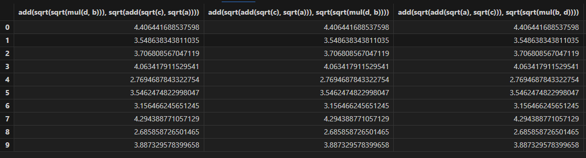

# Shark GPLearn 快速上手

## 1.1 背景

在金融领域，gplearn 经常被用于利用历史数据挖掘出合适的因子来指导股票/期货的买卖决策。然而，当前的 gplearn 面临着一些挑战：

* **计算效率低：**
  为了挖掘出高质量的因子，需要增加单个算子的复杂度、初始化公式数量、迭代次数等，这导致了更多的计算负担。以使用4年A股数据进行单因子挖掘为例，单轮挖掘（15代）需要耗时约5
  - 24小时。
* **算子不足：** 目前的 gplearn 提供的基础数学算子难以拟合金融领域数据的复杂特征。
* **难以处理三维数据：** 基础的 gplearn
  只能处理二维的输入数据，如同一时间所有股票的数据（横截面数据）或同一股票不同时间的数据（时序数据）。对于三维数据（不同时间+不同股票+特征），需要额外的分组操作（group
  by），这增加了数据处理的复杂度。

## 1.2 概述

Shark GPLearn 是一个利用遗传算法解决符号回归问题的框架，旨在自动生成与数据分布相拟合的因子。相比传统 gplearn，Shark GPLearn
带来了以下改进：

* **GPU 加速：** Shark GPLearn 利用 GPU 大幅提高了因子挖掘的效率，加快了计算速度。
* **丰富的算子库：** Shark GPLearn 整合了 DolphinDB
  数据库内置的函数，大大丰富了算子库，使其能够更准确地拟合数据的复杂特征。
* **处理三维数据：**Shark GPLearn 支持对三维数据的处理，用户只需设置分组列名，无需进行额外的手动分组。

注： 社区版 License 暂不支持该功能。如需使用，请前往[官网下载页面](https://dolphindb.cn/product#downloads-top)，点击 Shark 产品的“试用 License”，申请对应 License。

## 1.3 原理

遗传算法是一种搜索优化方法，灵感来自自然选择和达尔文的进化论，尤其是“适者生存”的思想。遗传算法中有一些关键概念，如“种群”，“交叉（杂交）”，“突变”和“选择”，均来源于进化论。种群是所有可能解的集合。交叉是一种方式，通过组合两个解的部分，产生新的解。突变是对解的随机更改，以增加种群的多样性。选择是保留适应度较好的解的过程。

Shark GPLearn 的原理可以概括为以下步骤：

1. 初始化：生成一个随机公式的种群。
2. 评估：评估每个公式的适应度（即对数据拟合的准确性），给出适应度评分。
3. 选择：根据其适应度评分选择公式，以用于下一代。适应度更好的公式有更高的被选中的概率。
4. 进化与变异：随机选取两个公式，然后从一个公式中选取一部分，与另一个公式的一部分交换，生成两个新的公式。或随机更改一部分公式，产生一个新的公式。
5. 迭代：重复第 2-4 步，直到满足停止准则，如达到最大的迭代次数，或者找到一个足够好的公式。

图 1. Shark GPLearn


## 1.4 显卡要求

DolphinDB 的 Shark GPLearn 功能要求显卡的计算能力达到 6.0 或以上。有关不同型号显卡算力的计算方法，请查阅 [Nvidia 官方文档](https://developer.nvidia.com/cuda-gpus)。

## 2. 快速上手

支持 Shark GPLearn 的 DolphinDB 部署在一台支持 GPU 的服务器上。部署流程请参考[单节点部署](standalone_server.html) 与 [集群部署](single_machine_cluster_deploy.html)。

1. 准备训练数据：

   ```
   def prepareData(num){
       total =num
       data=table(total:total, `a`b`c`d,[FLOAT,FLOAT,FLOAT,FLOAT])// 1024*1024*5 行
       data[`a]=rand(10.0, total)  - rand(5.0, total)
       data[`b]=rand(10.0, total)   - rand(5.0, total)
       data[`c]=rand(10.0, total)   - rand(5.0, total)
       data[`d]=rand(10.0, total)   - rand(5.0, total)
       return data
   }
   num = 1024 * 1024 * 5
   source = prepareData(num)
   ```
2. 准备预测数据：

   ```
   a =  source[`a]
   b = source[`b]
   c = source[`c]
   d = source[`d]
   predVec = a*a*a*a/(a*a*a*a+1) + b*b*b*b/(b*b*b*b+1) +  c*c*c*c/( c*c*c*c+1) +  d*d*d*d/(d*d*d*d+1)
   ```
3. 执行训练：

   ```
   engine = createGPLearnEngine(source, predVec,
       functionSet=['add','sub','mul','div','sqrt','sin','cos','tan'],constRange=0,initDepth = [2,5],restrictDepth=true)
   engine.gpFit(10)
   ```
4. 进行预测：

   ```
   predict = engine.gpPredict(source, 3)
   ```
5. 训练过程输出：

   

图 2. 训练结果


图 3. 预测结果



## 3. 相关函数

在以上的操作步骤中使用了以下函数：

* [createGPLearnEngine](../funcs/c/creategplearnengine.html)：创建一个 GPLearn 引擎用于训练和预测。
* [gpFit](../funcs/g/gpfit.html)：查看训练生成的公式。函数返回一个表：
  + 第一列为 program 列，STRING 类型，用于存储得到的公式；
  + 第二列为 fitness 列，DOUBLE 类型，存储公式的适应度；
  + 当 programCorr 为 true 时，第三列为 programCorr 列，是DOUBLE
    类型的数组向量，存储公式之间的相关性。
* [gpPredict](../funcs/g/gppredict.html)：采用上次训练得到的适应度函数较小的前 programNum 个公式用于预测。如果指定
  groupCol，计算时还会依据 groupCol 分组。函数返回一个表，共 programNum 列，列名为 gpFit 训练得到的公式。
* [setGpFitnessFunc](../funcs/s/setgpfitnessfunc.html)：重置 GPLearn 引擎的适应度函数。
* [addGpFunction](../funcs/a/addgpfunction.html)：在现有训练函数的基础上增加用户自定义函数，用于初始化公式树和进化时使用。支持的算子详见附录。

## 附录

目前已支持的训练函数：

注： 对于所有的 m 系列函数，如果当前窗口小于 n，则会直接返回 0。而 DolphinDB 默认返回空值。

| 函数名 | 入参数量 | 描述 |
| --- | --- | --- |
| add(x,y) | 2 | 加法 |
| sub(x,y) | 2 | 减法 |
| mul(x,y) | 2 | 乘法 |
| div(x,y) | 2 | 除法， 如果除数的绝对值小于0.001，返回1 |
| max(x,y) | 2 | 最大值 |
| min(x,y) | 2 | 最小值 |
| sqrt(x) | 1 | 按照绝对值开方 |
| log(x) | 1 | `iif(x < 0.001, 0, log(abs(x)))` |
| neg(x) | 1 | 相反数 |
| reciprocal(x) | 1 | 倒数，如果x的绝对值小于0.001，将返回0 |
| abs(x) | 1 | 绝对值 |
| sin(x) | 1 | 正弦函数 |
| cos(x) | 1 | 余弦函数 |
| tan(x) | 1 | 正切函数 |
| sig(x) | 1 | sigmoid函数 |
| signum(x) | 1 | 返回 x 的符号标志 |
| mcovar(x, y, n) | 2 | 滑动窗口为n时，x和y的协方差 |
| mcorr(x, y, n) | 2 | 滑动窗口为n时，x和y的相关性 |
| mstd(x, n) | 1 | 滑动窗口为n时，x的样本标准差 |
| mmax(x, n) | 1 | 滑动窗口为n时，x的最大值 |
| mmin(x, n) | 1 | 滑动窗口为n时，x的最小值 |
| msum(x, n) | 1 | 滑动窗口为n时，x的和 |
| mavg(x, n) | 1 | 滑动窗口为n时，x的平均数 |
| mprod(x, n) | 1 | 滑动窗口为n时，x的积 |
| mvar(x, n) | 1 | 滑动窗口为n时，x的样本方差 |
| mvarp(x, n) | 1 | 滑动窗口为n时，x的总体方差 |
| mstdp(x, n) | 1 | 滑动窗口为n时，x的总体标准差 |
| mimin(x, n) | 1 | 滑动窗口为n时，x的最小值下标 |
| mimax(x, n) | 1 | 滑动窗口为n时，x的最大值下标 |
| mbeta(x, y, n) | 2 | 滑动窗口为n时，x在y上的回归系数的最小二乘估计 |
| mwsum(x, y, n) | 2 | 滑动窗口为n时，x和y的内积 |
| mwavg(x, y, n) | 2 | 滑动窗口为n时，x以y为权重的加权平均值 |

**相关信息**

* [createGPLearnEngine](../funcs/c/creategplearnengine.html "createGPLearnEngine")
* [gpFit](../funcs/g/gpfit.html "gpFit")
* [gpPredict](../funcs/g/gppredict.html "gpPredict")
* [setGpFitnessFunc](../funcs/s/setgpfitnessfunc.html "setGpFitnessFunc")
* [addGpFunction](../funcs/a/addgpfunction.html "addGpFunction")

