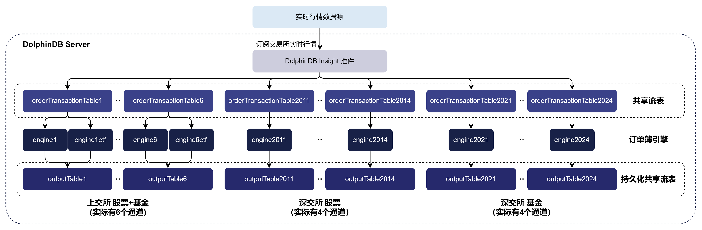
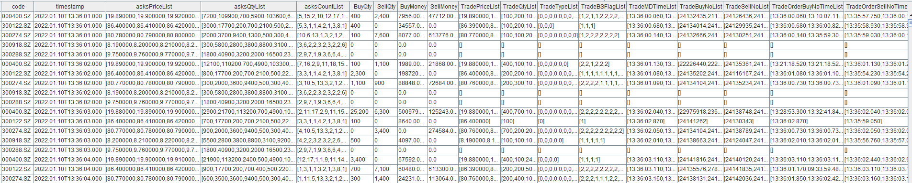
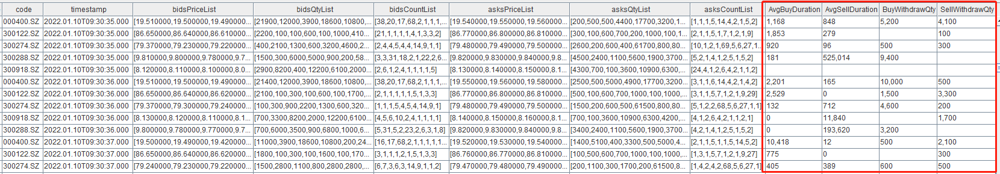

# 实时合成自定义频订单簿快照：DolphinDB INSIGHT 行情插件与订单簿引擎应用

**教程难度**

* 中级

**面向读者**

* 已经掌握 DolphinDB 基础编程语法和流数据基础功能的用户：
  + [编程语言](https://docs.dolphindb.cn/zh/progr/progr_intro.md)
  + [流数据表](https://docs.dolphindb.cn/zh/stream/str_table.md)
  + [发布与订阅](https://docs.dolphindb.cn/zh/stream/sub_pub.md)
  + [订单簿引擎](https://docs.dolphindb.cn/zh/tutorials/orderBookSnapshotEngine.md)
  + [INSIGHT 行情插件](https://docs.dolphindb.cn/zh/tutorials/insight_plugin.md)
* 本教程提供了完整的测试代码，初学者也可以跟随教程内容复现业务场景

[INSIGHT](https://findata-insight.htsc.com:9151/help/) 是华泰证券依托大数据存储、实时分析等领域的技术积累，整合接入国内多家交易所高频行情数据，为投资者提供集行情接入、推送、回测、计算及分析等功能于一体的行情数据服务解决方案。基于 INSIGHT 官方提供的行情数据服务 C++ SDK（TCP 版本），DolphinDB 开发了能够获取市场行情数据的 INSIGHT 插件，帮助用户方便地通过 DolphinDB 脚本语言将实时行情数据接入 DolphinDB，以便进行后续的计算或存储。

订单簿是交易市场上买卖双方正在报价的不同价格的列表。订单簿快照反应了特定时刻市场上的交易意图，比如交易活跃的证券标的往往有着密集的订单簿。订单簿快照对量化金融的交易策略、风险管理和市场分析等方面都具有重要意义。 DolphinDB 基于其在高性能流计算上的技术储备，以及和金融客户的紧密业务合作，推出了经过正确性校验的高性能订单簿引擎。用户只需要通过 `createOrderbookSnapshotEngine` 函数即可定义订单簿引擎，再通过向引擎输入符合约定的逐笔成交和逐笔委托数据来合成订单簿。

本文主要介绍如何通过 INSIGHT 插件将逐笔成交、逐笔委托数据实时写入订单簿引擎，以实现实时合成 1 秒频订单簿快照。此外，本文还将介绍如何实现节点启动时自动订阅行情并开始订单簿合成，以及提供在盘后将当日数据批量写入分布式数据库的脚本。

订单簿引擎需要在商业版 license 的基础上额外开通订单簿引擎功能，欢迎联系小助手或销售申请试用。此外，本文全部代码需要运行在 2.00.12 及以上版本的 DolphinDB server 上。因为 INSIGHT 插件只支持 Linux 系统，故脚本仅支持运行在 Linux 系统上。

本文不提供 INSIGHT 行情账号，如需运行文中的行情订阅脚本请将部分代码改写为您的 INSIGHT 账号。DolphinDB 也提供 amdQuote、MDL、NSQ 等行情数据插件，您可以将本文中的 INSIGHT 行情订阅部分改为其他行情源。

## 1. INSIGHT 插件基本使用介绍

### 1.1 安装插件

节点启动后，连接节点并在 GUI（或 VS Code、Web UI）等 [DolphinDB 客户端](https://docs.dolphindb.cn/zh/db_distr_comp/clients.md)中执行 `installPlugin` 函数，则可以下载到与当前 server 版本适配的 INSIGHT 插件文件，插件文件包括插件描述文件及插件的二进制文件。

```
login("admin", "123456")
installPlugin("insight")
```

`installPlugin` 函数若正常返回，则代表下载成功，其返回值为插件描述文件（PluginInsight.txt）的安装路径，如：

```
/path_to_dolphindb_server/server/plugins/insight/PluginInsight.txt
```

`installPlugin` 函数实际上是从远程文件服务器拉取插件文件到 DolphinDB server 所在的服务器，因此需要一定的耗时，请耐心等待大约一分钟。

### 1.2 加载插件

在脚本中调用插件相关的接口前，需要先加载插件。在 GUI（或 VS Code、Web UI）等[客户端](https://docs.dolphindb.cn/zh/db_distr_comp/clients.md)中执行 `loadPlugin` 函数加载插件。以下示例中使用了插件名称作为入参，也可以使用 2.1 中返回的绝对路径 */path\_to\_dolphindb\_server/server/plugins/insight/PluginInsight.txt*。

```
loadPlugin("insight")
```

`loadPlugin` 函数正常返回则插件加载成功，以 VS Code 为例，首次加载成功后返回的部分信息如下，返回值是 INSIGHT 插件提供的所有函数。至此插件安装与加载已全部完成：


需要注意：

* 因为节点启动后，只允许加载一次 INSIGHT 插件，即可在任意会话中调用该插件提供的函数。如果重复执行 `loadPlugin` 加载插件，则会抛出模块已经被使用的错误提示：

```
The module [insight] is already in use.
```

为避免因为这种错误中断后续脚本代码的执行，可以通过 `try-cach` 语句捕获错误：

```
try{ loadPlugin("Insight") }catch(ex){print ex}
```

* 若节点重启则需要重新加载插件。

## 2. 实时合成 1 秒频订单簿快照

本文结合使用 INSIGHT 行情插件和订单簿引擎（`createOrderBookSnapshotEngine`），基于实时的逐笔委托和逐笔成交数据，合成全市场股票和基金的 1 秒频订单簿快照数据。

实时合成的数据处理流程如下。本章将实时合成的脚本拆分为多个步骤进行详细介绍，完整的脚本见[附录](#%E9%99%84%E5%BD%95)：



实际上共有14个结果流数据表，分别对应 INSIGHT 的输入数据的上交所股票与基金通道（1、2、3、4、5、6）、深交所股票通道（2011、2012、2013、2014）、深交所基金通道（2021、2022、2023、2024）。

在实际部署时，我们往往还需要将输入数据和输出结果存入数据库。在上图的基础上可以对输入和结果的流数据表再增加订阅，以实现实时写入数据库。而如果考虑到实盘计算资源有限，也可以考虑在盘后将数据存入数据库。在本文第 3 章我们将介绍盘后全量数据存入数据库的脚本。

### 2.1 清理环境（可选）

由于相同的流计算引擎名、流数据表名和订阅无法进行重复定义，因此在重复执行脚本前，需要先取消相关订阅并清除需要用到的流数据表、流计算引擎。为保证本文的示例脚本能够反复执行，特提供了以下流环境清理脚本。

```
def cleanEnvironment(){
    try {
        tcpClient  = insight::getHandle()
        insight::unsubscribe(tcpClient)
        insight::close(tcpClient)
    } catch(ex) { print(ex) }
    for(channelno_ in 1..6){
        try { unsubscribeTable(tableName="orderTransactionTable" + string(channelno_), actionName="orderbookDemo" + string(channelno_)) } catch(ex) { print(ex) }
        try { unsubscribeTable(tableName="orderTransactionTable" + string(channelno_), actionName="orderbookDemo" + string(channelno_) + "etf") } catch(ex) { print(ex) }
        try { unsubscribeTable(tableName="orderTransactionTable" + string(channelno_), actionName="orderTransactionTableInsert" + string(channelno_)) } catch(ex) { print(ex) }
        try { unsubscribeTable(tableName="outputTable" + string(channelno_), actionName="outputTableInsert" + string(channelno_)) } catch(ex) { print(ex) }
        try { dropStreamEngine("orderbookEngine" + string(channelno_)) } catch(ex) { print(ex) }
        try { dropStreamEngine("orderbookEngine" + string(channelno_) + "etf") } catch(ex) { print(ex) }
        try { dropStreamTable("orderTransactionTable" + string(channelno_)) } catch(ex) { print(ex) }
        try { dropStreamTable("outputTable" + string(channelno_)) } catch(ex) { print(ex) }
    }
    for(channelno_ in 2011..2014){
        try { unsubscribeTable(tableName="orderTransactionTable" + string(channelno_), actionName="orderbookDemo" + string(channelno_)) } catch(ex) { print(ex) }
        try { unsubscribeTable(tableName="orderTransactionTable" + string(channelno_), actionName="orderTransactionTableInsert" + string(channelno_)) } catch(ex) { print(ex) }
        try { unsubscribeTable(tableName="outputTable" + string(channelno_), actionName="outputTableInsert" + string(channelno_)) } catch(ex) { print(ex) }
        try { dropStreamEngine("orderbookEngine" + string(channelno_)) } catch(ex) { print(ex) }
        try { dropStreamTable("orderTransactionTable" + string(channelno_)) } catch(ex) { print(ex) }
        try { dropStreamTable("outputTable" + string(channelno_)) } catch(ex) { print(ex) }
    }
	for(channelno_ in 2021..2024){
        try { unsubscribeTable(tableName="orderTransactionTable" + string(channelno_), actionName="orderbookDemo" + string(channelno_)) } catch(ex) { print(ex) }
        try { unsubscribeTable(tableName="orderTransactionTable" + string(channelno_), actionName="orderTransactionTableInsert" + string(channelno_)) } catch(ex) { print(ex) }
        try { unsubscribeTable(tableName="outputTable" + string(channelno_), actionName="outputTableInsert" + string(channelno_)) } catch(ex) { print(ex) }
        try { dropStreamEngine("orderbookEngine" + string(channelno_)) } catch(ex) { print(ex) }
        try { dropStreamTable("orderTransactionTable" + string(channelno_)) } catch(ex) { print(ex) }
        try { dropStreamTable("outputTable" + string(channelno_)) } catch(ex) { print(ex) }
    }
	undef all
}
cleanEnvironment()
```

### 2.2 创建库表

#### 2.2.1 获取订单簿引擎的输入表的表结构

订单簿引擎要求将逐笔成交和逐笔委托数据放在同一张表中作为输入。INSIGHT 行情插件对此进行了适配，支持同时接收逐笔成交和逐笔委托并处理成订单簿引擎要求的表结构写入 DolphinDB 流数据表。

调用 [insight::getSchema](https://docs.dolphindb.cn/zh/plugins/insight/insight_2.html#getschema) 方法可以获取行情数据各个表的表结构。以下代码获取逐笔成交和委托合并表的表结构：

```
orderTransactionSchema = insight::getSchema(`OrderTransaction)
```

#### 2.2.2 创建接收 INSIGHT 行情数据的流数据表

得到行情数据的表结构后，使用该表结构创建流数据表。

```
capacity = 10000000
colName = orderTransactionSchema[`name]
colType = orderTransactionSchema[`type]
//上交所 股票+基金
for(channelno_ in 1..6){
    share(streamTable(capacity:0, colName, colType), `orderTransactionTable + string(channelno_))
}
//深交所 股票
for(channelno_ in 2011..2014){
	share(streamTable(capacity:0, colName, colType), `orderTransactionTable + string(channelno_))
}
// 上交所 基金
for(channelno_ in 2021..2024){
	share(streamTable(capacity:0, colName, colType), `orderTransactionTable + string(channelno_))
}
```

* capacity 变量控制了在建表时预分配内存的大小，其单位是行，设置较大的 `capacity` 可以降低出现峰值时延的频率。具体大小可以根据实际的逐笔数据总量、环境可使用的内存大小共同决定。具体优化原理可参考 [DolphinDB 流计算时延统计与性能优化](https://docs.dolphindb.cn/zh/tutorials/streaming_timer.html#%E5%86%85%E7%BD%AE%E7%8A%B6%E6%80%81%E5%87%BD%E6%95%B0%E4%B8%8E%E5%A2%9E%E9%87%8F%E8%AE%A1%E7%AE%97)。

#### 2.2.3 创建存储订单簿快照的持久化流数据表

在创建订单簿引擎时可以指定需要输出的字段，本文在创建引擎时指定订单簿引擎使用默认输出，因此结果表表结构如下。由于结果表的列长达80列，为避免内存不足，这里使用持久化流数据表作为结果表。实际使用中，若内存资源充足也可以使用共享流数据表作为结果表。

```
// 持久化流数据表创建
cacheSize = 10000000
preCache = 0
depth = 10
suffix = string(1..depth)
colNames = `SecurityID`timestamp`lastAppSeqNum`tradingPhaseCode`modified`turnover`volume`tradeNum`totalTurnover`totalVolume`totalTradeNum`lastPx`highPx`lowPx`ask`bid`askVol`bidVol`preClosePx`invalid  join ("bids" + suffix) join ("bidVolumes" + suffix) join ("bidOrderNums" + suffix) join ("asks" + suffix)  join ("askVolumes" + suffix) join ("askOrderNums" + suffix)
colTypes = [SYMBOL,TIMESTAMP,LONG,INT,BOOL,DOUBLE,LONG,INT,DOUBLE,LONG,INT,DOUBLE,DOUBLE,DOUBLE,DOUBLE,DOUBLE,LONG,LONG,DOUBLE,BOOL] join take(DOUBLE, depth) join take(LONG, depth) join take(INT, depth) join take(DOUBLE, depth) join take(LONG, depth) join take(INT, depth)
cacheSize=5000000
preCache=0

for(channelno_ in 1..6){
    enableTableShareAndPersistence(table=streamTable(cacheSize:0, colNames, colTypes), tableName=`outputTable + string(channelno_), cacheSize=cacheSize, preCache=preCache)
}
for(channelno_ in 2011..2014){
	enableTableShareAndPersistence(table=streamTable(cacheSize:0, colNames, colTypes), tableName=`outputTable + string(channelno_), cacheSize=cacheSize, preCache=preCache)
}
for(channelno_ in 2021..2024){
	enableTableShareAndPersistence(table=streamTable(cacheSize:0, colNames, colTypes), tableName=`outputTable + string(channelno_), cacheSize=cacheSize, preCache=preCache)
}
```

* 为了`enableTableShareAndPersistence` 函数能够正常执行，需要节点启动之前在配置文件中（单节点：*dolphindb.cfg*，集群：*cluster.cfg*）指定配置参数 *persistenceDir*，配置参考[功能配置](https://docs.dolphindb.cn/zh/db_distr_comp/cfg/function_configuration.md)。
* 代码第二行的 *cacheSize* 变量控制了在建表时预分配内存的大小以及流数据表在内存中最大的大小，单位是行，设置较大的 *cacheSize* 可以降低出现峰值时延的频率。具体大小可以根据实际的可使用的内存大小决定。具体优化原理可参考[DolphinDB 流计算时延统计与性能优化](https://gitee.com/dolphindb/Tutorials_CN/blob/master/streaming_timer.md#211-%E5%88%9B%E5%BB%BA%E8%A1%A8%E6%97%B6%E9%A2%84%E5%88%86%E9%85%8D%E5%86%85%E5%AD%98)。

### 2.3 创建订单簿引擎

为每一个通道的逐笔数据创建一个订单簿引擎。注意，不要对一个引擎输入多个通道的数据，这可能会影响输出结果的正确性。订单簿引擎的具体工作原理和使用方式见 [基于逐笔数据合成高频订单簿：DolphinDB 订单簿引擎](https://docs.dolphindb.cn/zh/tutorials/orderBookSnapshotEngine.md)。

```
// 建立 14 个订单簿引擎
// 输入表列名与订单簿引擎内计算时需要的变量建立映射
inputColMap = dict(`codeColumn`timeColumn`typeColumn`priceColumn`qtyColumn`buyOrderColumn`sellOrderColumn`sideColumn`msgTypeColumn`seqColumn, `SecurityID`MDTime`Type`Price`Qty`BuyNo`SellNo`BSFlag`SourceType`ApplSeqNum)
// 创建引擎参数 prevClose，即昨日收盘价，prevClose 不影响最终的输出结果中除昨日收盘价以外的其他字段
prevClose = dict(SYMBOL, DOUBLE)

// 定义引擎，每 1 秒计算输出 10 档买卖盘口
for(channelno_ in 1..6){
    createOrderBookSnapshotEngine(name="orderbookEngine" + string(channelno_), exchange="XSHG", orderbookDepth=10, intervalInMilli=1000, date=date(now()), startTime=09:30:00.000, prevClose=prevClose, dummyTable=objByName("orderTransactionTable" + string(channelno_)), inputColMap=inputColMap, outputTable=objByName("outputTable" + string(channelno_)), orderBySeq=true)
    createOrderBookSnapshotEngine(name="orderbookEngine" + string(channelno_) + "etf", exchange="XSHGFUND", orderbookDepth=10, intervalInMilli=1000, date=date(now()), startTime=09:30:00.000, prevClose=prevClose, dummyTable=objByName("orderTransactionTable" + string(channelno_)), inputColMap=inputColMap, outputTable=objByName("outputTable" + string(channelno_)), orderBySeq=true)
}

for(channelno_ in 2011..2014){
    createOrderBookSnapshotEngine(name="orderbookEngine" + string(channelno_), exchange="XSHE", orderbookDepth=10, intervalInMilli=1000, date=date(now()), startTime=09:30:00.000, prevClose=prevClose, dummyTable=objByName("orderTransactionTable" + string(channelno_)), inputColMap=inputColMap, outputTable=objByName("outputTable" + string(channelno_)), orderBySeq=true)
}

for(channelno_ in 2021..2024){
    createOrderBookSnapshotEngine(name="orderbookEngine" + string(channelno_), exchange="XSHEFUDN", orderbookDepth=10, intervalInMilli=1000, date=date(now()), startTime=09:30:00.000, prevClose=prevClose, dummyTable=objByName("orderTransactionTable" + string(channelno_)), inputColMap=inputColMap, outputTable=objByName("outputTable" + string(channelno_)), orderBySeq=true)
}
```

* *exchange* 参数分别指定 XSHG, XSHGFUND, XSHE, XSHEFUND，表示上交所股票、上交所基金、深交所股票、深交所基金。
* *orderbookDepth* 指定订单簿深度，本例为 10 档。
* *intervalInMilli* 为输出的时间间隔，单位为毫秒，决定了输出的快照频率。本例为 1 秒。
* *inputColMap* 参数指定了引擎输入表中的字段与其内部计算时所需要的关键变量之间的映射关系。
* *prevClose* 参数表示昨收价，其作为静态数据传入引擎，不影响订单簿合成，仅输出到结果表中的昨收价字段。本例传入了空的字典作为昨收价，实际使用中用户可以从历史数据中获取昨收价。
* *orderBySeq=true* 表示按逐笔数据中的 seqColumn 字段有序处理输入，这是因为本文使用的 INSIGHT 接口（TCP 版本）不能保证一整个通道的逐笔数据按 seqColumn 字段有序到达。若行情插数据原本就是按 seqColumn 字段有序到达，那么也可以将这个参数设置为 false，即按数据注入引擎的先后顺序直接处理。

上文以及附录中的脚本均以输出 1 秒频率 10 档订单簿为例，主要是帮助用户理解实时合成订单簿的全流程。而在此基础上，只需对本小节创建引擎以及 2.2 小节中创建订单簿结果表的脚本进行简单修改，用户便可以实现更个性化的实时输出，以满足不同业务场景下的订单簿和衍生指标要求。下面我们介绍如何做出相应的脚本修改以实现不同的输出要求。需要注意的是，如需数据需要存入分布式表，则分布式数据库的库表结构也应做对应修改，此处不展开讨论。

用户也可以先跳过以下内容、直接进入 2.4 小节继续了解 INSIGHT 行情实时接入订单簿引擎。在跟随全文完成最基础的订单簿实时合成之后，再回到本节学习如何输出更个性化的订单簿。

* **修改订单簿深度**

```
createOrderBookSnapshotEngine(name="orderbookEngine" + string(channelno_), exchange="XSHE", orderbookDepth=20, intervalInMilli=1000, date=date(now()), startTime=09:30:00.000, prevClose=prevClose, dummyTable=objByName("orderTransactionTable" + string(channelno_)), inputColMap=inputColMap, outputTable=objByName("outputTable" + string(channelno_)), orderBySeq=true)
```

订单簿深度通过 `createOrderBookSnapshotEngine` 函数的 *orderbookDepth* 参数指定，以上代码将订单簿深度修改为 20 档。因为本文的示例脚本未使用 array vector 存储深度行情，所以若修改订单簿引擎输出的深度，则需要相应的修改 2.2 小节结果流数据表的表结构，20 档深度的订单簿建表语句如下，需要修改变量 depth 为 20。

```
depth = 20
suffix = string(1..depth)
colNames = `SecurityID`timestamp`lastAppSeqNum`tradingPhaseCode`modified`turnover`volume`tradeNum`totalTurnover`totalVolume`totalTradeNum`lastPx`highPx`lowPx`ask`bid`askVol`bidVol`preClosePx`invalid  join ("bids" + suffix) join ("bidVolumes" + suffix) join ("bidOrderNums" + suffix) join ("asks" + suffix)  join ("askVolumes" + suffix) join ("askOrderNums" + suffix)
colTypes = [SYMBOL,TIMESTAMP,LONG,INT,BOOL,DOUBLE,LONG,INT,DOUBLE,LONG,INT,DOUBLE,DOUBLE,DOUBLE,DOUBLE,DOUBLE,LONG,LONG,DOUBLE,BOOL] join take(DOUBLE, depth) join take(LONG, depth) join take(INT, depth) join take(DOUBLE, depth) join take(LONG, depth) join take(INT, depth)
```

* **修改订单簿频率**

```
createOrderBookSnapshotEngine(name="orderbookEngine" + string(channelno_), exchange="XSHE", orderbookDepth=10, intervalInMilli=500, date=date(now()), startTime=09:30:00.000, prevClose=prevClose, dummyTable=objByName("orderTransactionTable" + string(channelno_)), inputColMap=inputColMap, outputTable=objByName("outputTable" + string(channelno_)), orderBySeq=true)
```

订单簿频率通过 `createOrderBookSnapshotEngine` 函数的 *intervalInMilli* 参数指定，以上代码将订单簿频率修改为 500 毫秒。修改订单簿频率不影响输出表的表结构，因此无需修改结果表的建表语句。修改订单簿频率只会影响引擎输出的数据量。

* **输出衍生指标**

```
depth = 10
orderBookAsArray = true
outputColMap = genOutputColumnsForOBSnapshotEngine(basic=true, time=true, depth=(depth, orderBookAsArray), tradeDetail=true, orderDetail=false, withdrawDetail=false, orderBookDetailDepth=0, prevDetail=false)[0]
createOrderBookSnapshotEngine(name="orderbookEngine" + string(channelno_), exchange="XSHE", orderbookDepth=depth, intervalInMilli=1000, date=date(now()), startTime=09:30:00.000,  prevClose=prevClose, dummyTable=objByName("orderTransactionTable" + string(channelno_)), inputColMap=inputColMap, outputTable=objByName("outputTable" + string(channelno_)), orderBySeq=true, outputColMap=outputColMap, orderBookAsArray=orderBookAsArray)
```

创建引擎时使用 *outputColMap* 参数可以选择输出的字段，引擎能够输出的所有指标字段见 [createOrderBookSnapshotEngine](https://docs.dolphindb.cn/zh/2.00.12/funcs/c/createorderbooksnapshotengine.html#topic_orx_zdb_bbc) 附录。以上脚本创建的订单簿每 1 秒计算输出深交所股票 10 档深度行情，并且扩展了逐笔成交明细字段，且 10 档深度行情以 array vector 形式存储。

为了方便用户使用 *outputColMap* 参数选择需要输出的字段，DophinDB server 提供了`genOutputColumnsForOBSnapshotEngine` 函数，该函数返回要求引擎输出包含的字段以及对应的输出表结构。`genOutputColumnsForOBSnapshotEngine` 函数的参数用于指定订单簿引擎需要输出的字段，本节设置 *basic*、*time*、*depth* 和 *tradeDetail* 为 true ，其余都设置为 false，表示只需要基础成交信息、时间、订单簿以及成交明细字段。

注意，若通过 *outputColMap* 参数选择输出衍生指标，则应该相应地修改 2.2 小节结果流数据表的表结构。

```
depth = 10
orderBookAsArray = true
outputTableSch = genOutputColumnsForOBSnapshotEngine(basic=true, time=true, depth=(depth, orderBookAsArray), tradeDetail=true, orderDetail=false, withdrawDetail=false, orderBookDetailDepth=0, prevDetail=false)[1]
colNames = outputTableSch.schema().colDefs.name
colTypes = outputTableSch.schema().colDefs.typeString
```

包含逐笔成交明细的输出结果如下，逐笔成交明细指两条订单簿快照之间全部的成交数据以 array vector 存储，包括如成交量、成交价、成交方向等指标。衍生指标默认在最后若干列，下图为了方便展示，修改了字段顺序。



* **输出用户自定义指标**

```
depth = 10
orderBookAsArray =true
outputColMap = genOutputColumnsForOBSnapshotEngine(basic=true, time=false, depth=(depth, orderBookAsArray), tradeDetail=true, orderDetail=false, withdrawDetail=true, orderBookDetailDepth=0, prevDetail=false)[0]
// 用户自定义因子
def userDefinedFunc(t){
        AvgBuyDuration = rowAvg(t.TradeMDTimeList-t.TradeOrderBuyNoTimeList).int()
        AvgSellDuration = rowAvg(t.TradeMDTimeList-t.TradeOrderSellNoTimeList).int()
        BuyWithdrawQty = rowSum(t.WithdrawBuyQtyList)
        SellWithdrawQty = rowSum(t.WithdrawSellQtyList)
        return (AvgBuyDuration, AvgSellDuration, BuyWithdrawQty, SellWithdrawQty)
}
createOrderBookSnapshotEngine(name="orderbookEngine" + string(channelno_), exchange="XSHE", orderbookDepth=depth, intervalInMilli=1000, date=date(now()), startTime=09:30:00.000,  prevClose=prevClose, dummyTable=objByName("orderTransactionTable" + string(channelno_)), inputColMap=inputColMap, outputTable=objByName("outputTable" + string(channelno_)), orderBySeq=true, outputColMap=outputColMap, orderBookAsArray=orderBookAsArray, userDefinedMetrics=userDefinedFunc)
```

创建引擎时指定 *userDefinedMetrics* 参数可以使引擎输出用户自定义指标。以上脚本创建的订单簿每 1 秒计算输出深交所股票 10 档订单簿，并且扩展了 4 个用户自定义指标，指标定义如下：

| **指标名称** | **含义** |
| --- | --- |
| AvgBuyDuration | 过去 1 秒内，成交中买方的平均挂单时长 |
| AvgSellDuration | 过去 1 秒内，成交中卖方的平均挂单时长 |
| BuyWithdrawQty | 过去 1 秒内，买方撤单的总量 |
| SellWithdrawQty | 过去 1 秒内，卖方撤单的总量 |

*userDefinedMetrics* 参数是一个一元函数，用于自定义指标的计算逻辑。该函数的入参必须是一张表，这张表的每一行是一个标的的快照，快照的每一列是 *outputColMap* 参数指定的引擎内置指标。用户可以操作这些引擎内置的指标实现自定义指标。此处用引擎提供的两笔订单簿快照之间的逐笔成交明细和撤单明细，计算了这个窗口内的挂单时长和撤单量等指标。

当指定 *userDefinedMetrics* 参数后，引擎的输出表结构不再和 *outputColMap* 参数的内容一一对应，而是仅包含两部分内容：一部分是 `genOutputColumnsForOBSnapshotEngine` 函数对应的 *basic* 和 *depth* 指标；另一部分是用户自定义指标。此时，需要相应地修改 2.2 小节结果流数据表的表结构。

```
depth = 10
orderBookAsArray =true
outputTableSch = genOutputColumnsForOBSnapshotEngine(basic=true, time=false, depth=(depth, orderBookAsArray), tradeDetail=false, orderDetail=false, withdrawDetail=false, orderBookDetailDepth=0, prevDetail=false)[1]
colNames = outputTableSch.schema().colDefs.name join (`AvgBuyDuration`AvgSellDuration`BuyWithdrawQty`SellWithdrawQty)
colTypes = outputTableSch.schema().colDefs.typeString join (`INT`INT`INT`INT)
```

包含自定义指标的输出结果如下，红框部分为用户自定义指标。用户自定义指标默认在最后若干列，下图为了方便展示，修改了字段顺序。



### 2.4 订阅流数据表将 INSIGHT 行情数据增量写入订单簿引擎

订阅 2.2 节中接收 INSIGHT 行情数据的流数据表，将增量数据实时写入订单簿引擎，引擎会实时输出快照到结果流数据表。

```
subscribeTable(tableName="orderTransactionTable1", actionName="orderbookDemo1", handler=getStreamEngine("orderbookEngine1"), msgAsTable=true, batchSize=1, throttle=0.001, reconnect=true, hash=0)
subscribeTable(tableName="orderTransactionTable2", actionName="orderbookDemo2", handler=getStreamEngine("orderbookEngine2"), msgAsTable=true, batchSize=1, throttle=0.001, reconnect=true, hash=1)
subscribeTable(tableName="orderTransactionTable3", actionName="orderbookDemo3", handler=getStreamEngine("orderbookEngine3"), msgAsTable=true, batchSize=1, throttle=0.001, reconnect=true, hash=2)
subscribeTable(tableName="orderTransactionTable4", actionName="orderbookDemo4", handler=getStreamEngine("orderbookEngine4"), msgAsTable=true, batchSize=1, throttle=0.001, reconnect=true, hash=3)
subscribeTable(tableName="orderTransactionTable5", actionName="orderbookDemo5", handler=getStreamEngine("orderbookEngine5"), msgAsTable=true, batchSize=1, throttle=0.001, reconnect=true, hash=4)
subscribeTable(tableName="orderTransactionTable6", actionName="orderbookDemo6", handler=getStreamEngine("orderbookEngine6"), msgAsTable=true, batchSize=1, throttle=0.001, reconnect=true, hash=5)

subscribeTable(tableName="orderTransactionTable1", actionName="orderbookDemo1etf", handler=getStreamEngine("orderbookEngine1etf"), msgAsTable=true, batchSize=1, throttle=0.001, reconnect=true, hash=0)
subscribeTable(tableName="orderTransactionTable2", actionName="orderbookDemo2etf", handler=getStreamEngine("orderbookEngine2etf"), msgAsTable=true, batchSize=1, throttle=0.001, reconnect=true, hash=1)
subscribeTable(tableName="orderTransactionTable3", actionName="orderbookDemo3etf", handler=getStreamEngine("orderbookEngine3etf"), msgAsTable=true, batchSize=1, throttle=0.001, reconnect=true, hash=2)
subscribeTable(tableName="orderTransactionTable4", actionName="orderbookDemo4etf", handler=getStreamEngine("orderbookEngine4etf"), msgAsTable=true, batchSize=1, throttle=0.001, reconnect=true, hash=3)
subscribeTable(tableName="orderTransactionTable5", actionName="orderbookDemo5etf", handler=getStreamEngine("orderbookEngine5etf"), msgAsTable=true, batchSize=1, throttle=0.001, reconnect=true, hash=4)
subscribeTable(tableName="orderTransactionTable6", actionName="orderbookDemo6etf", handler=getStreamEngine("orderbookEngine6etf"), msgAsTable=true, batchSize=1, throttle=0.001, reconnect=true, hash=5)

subscribeTable(tableName="orderTransactionTable2011", actionName="orderbookDemo2011", handler=getStreamEngine("orderbookEngine2011"), msgAsTable=true, batchSize=1, throttle=0.001, reconnect=true, hash=6)
subscribeTable(tableName="orderTransactionTable2012", actionName="orderbookDemo2012", handler=getStreamEngine("orderbookEngine2012"), msgAsTable=true, batchSize=1, throttle=0.001, reconnect=true, hash=7)
subscribeTable(tableName="orderTransactionTable2013", actionName="orderbookDemo2013", handler=getStreamEngine("orderbookEngine2013"), msgAsTable=true, batchSize=1, throttle=0.001, reconnect=true, hash=8)
subscribeTable(tableName="orderTransactionTable2014", actionName="orderbookDemo2014", handler=getStreamEngine("orderbookEngine2014"), msgAsTable=true, batchSize=1, throttle=0.001, reconnect=true, hash=9)

subscribeTable(tableName="orderTransactionTable2021", actionName="orderbookDemo2021", handler=getStreamEngine("orderbookEngine2021"), msgAsTable=true, batchSize=1, throttle=0.001, reconnect=true, hash=6)
subscribeTable(tableName="orderTransactionTable2022", actionName="orderbookDemo2022", handler=getStreamEngine("orderbookEngine2022"), msgAsTable=true, batchSize=1, throttle=0.001, reconnect=true, hash=7)
subscribeTable(tableName="orderTransactionTable2023", actionName="orderbookDemo2023", handler=getStreamEngine("orderbookEngine2023"), msgAsTable=true, batchSize=1, throttle=0.001, reconnect=true, hash=8)
subscribeTable(tableName="orderTransactionTable2024", actionName="orderbookDemo2024", handler=getStreamEngine("orderbookEngine2024"), msgAsTable=true, batchSize=1, throttle=0.001, reconnect=true, hash=9)
```

* 通过调整 [subscribeTable](https://docs.dolphindb.cn/zh/funcs/s/subscribeTable.md) 函数中的 *batchSize* 和 *throttle* 参数可以控制写入分布式数据库的频率。
  + *batchSize* = 1 , *throttle* = 0.001 表示会立即处理注入流数据表中的数据。
  + *hash* 表示处理流数据的后台线程，为了更好地分配 CPU 资源，可以在订阅时，把不同的订阅消费任务分配到不同的线程上。

### 2.5 订阅 INSIGHT 行情将增量数据实时写入流数据表

#### 2.5.1 建立 INSIGHT 连接

用户配置 INSIGHT 账户信息，使用 [insight::connect](https://docs.dolphindb.cn/zh/plugins/insight/insight_2.html#connect) 函数进行连接，*handles* 用于设置接收行情数据的流数据表，可以按照通道号，把数据分别写入不同的流数据表中。INSIGHT 插件提供了接收逐笔成交和逐笔委托到同一张表的处理方式，该表可以直接作为订单簿引擎的输入。为了满足订单簿引擎必须分通道合成快照的需求，INSIGHT 插件在数据接入时需要指定需要接收的逐笔数据的通道号，比如深交所股票的通道号为2011至2014。注意，INSIGHT 的账户信息需要根据实际环境进行修改。

```
// 配置账户信息
HOST = "111.111.111.111"
PORT = 111
USER = "111"
PASSWORD = "111"
handles = dict(['OrderTransaction'], [dict([1,2,3,4,5,6,2011,2012,2013,2014,2021,2022,2023,2024], [orderTransactionTable1,orderTransactionTable2,orderTransactionTable3,orderTransactionTable4,orderTransactionTable5,orderTransactionTable6,orderTransactionTable2011,orderTransactionTable2012,orderTransactionTable2013,orderTransactionTable2014,orderTransactionTable2021,orderTransactionTable2022,orderTransactionTable2023,orderTransactionTable2024])]);
tcpClient= insight::connect(handles,HOST, PORT, USER, PASSWORD,,,true);
```

#### 2.5.2 订阅行情数据

使用 [insight::subscribe](https://docs.dolphindb.cn/zh/plugins/insight/insight_2.html#subscribe) 函数进行 INSIGHT 行情订阅，行情数据将进入流数据表。

```
insight::subscribe(tcpClient, [`MD_ORDER_TRANSACTION], `XSHE, `StockType)insight::subscribe(tcpClient, [`MD_ORDER_TRANSACTION], `XSHG, `StockType)insight::subscribe(tcpClient, [`MD_ORDER_TRANSACTION], `XSHG, `FundType)insight::subscribe(tcpClient, [`MD_ORDER_TRANSACTION], `XSHE, `FundType)
```

### 2.6 查询 INSIGHT 行情接收情况

运行过程中，可以查看 INSIGHT 行情的接收情况。首先调用 [insight::getHandle](https://docs.dolphindb.cn/zh/plugins/insight/insight_2.html#gethandle) 函数获取连接句柄，再使用 [insight::getStatus](https://docs.dolphindb.cn/zh/plugins/insight/insight_2.html#getstatus) 查询 INSIGHT 行情的接收情况。

```
tcpClient = insight::getHandle()
insight::getStatus(tcpClient)
```

## 3 当日数据全量写入分布式数据库

在第 2 章代码的基础上通过 `subscribeTable` 函数订阅逐笔数据和快照数据可以实现将数据实时写入分布式数据库。但是在计算资源有限的情况下，也可以在盘后再将全量的当日数据写入分布式数据库中。本章我们将介绍盘后全量写入数据库的脚本。

### 3.1 创建分布式数据库

执行创建分布式库表的语句前，需要登陆有创建权限的账号，执行如下代码登录默认的管理员账号：

```
login("admin", "123456")
```

为将行情数据和合成的快照存入分布式数据库，需要根据之前得到的行情数据表结构来创建分布式库表，分区规则参考自[《基于 DolphinDB 存储金融数据的分区方案最佳实践》](https://gitee.com/dolphindb/Tutorials_CN/blob/master/best_practices_for_partitioned_storage.md)。这里是将上交所和深交所的数据存入两个库。

```
if(!existsDatabase("dfs://SZ_TB")) {
	// 建立分布式数据库
	dbDate = database(, partitionType=VALUE, partitionScheme=2023.01.01..2024.01.01)
	dbID = database(, partitionType=HASH, partitionScheme=[SYMBOL, 25])
	db = database(directory="dfs://SZ_TB", partitionType=COMPO, partitionScheme=[dbDate, dbID],engine='TSDB',atomic='CHUNK')
}

if(!existsDatabase("dfs://SH_TB")) {
	// 建立分布式数据库
	dbDate = database(, partitionType=VALUE, partitionScheme=2023.01.01..2024.01.01)
	dbID = database(, partitionType=HASH, partitionScheme=[SYMBOL, 25])
	db = database(directory="dfs://SH_TB", partitionType=COMPO, partitionScheme=[dbDate, dbID],engine='TSDB',atomic='CHUNK')
}

if(!existsTable("dfs://SZ_TB", "orderTransactionTable")) {
	db = database("dfs://SZ_TB")
	// 建立分布式数据表，用于存储行情数据
	colName = `SecurityID`MDDate`MDTime`SecurityIDSource`SecurityType`Index`SourceType`Type`Price`Qty`BSFlag`BuyNo`SellNo`ApplSeqNum`ChannelNo`receivedTime
	colType = [SYMBOL,DATE,TIME,SYMBOL,SYMBOL,LONG,INT,INT,LONG,LONG,INT,LONG,LONG,LONG,INT,NANOTIMESTAMP]
	tbSchema = table(1:0, colName, colType)
	db.createPartitionedTable(table=tbSchema,tableName="orderTransactionTable",partitionColumns=`MDDate`SecurityID,sortColumns=`SecurityID`MDTime)
}

if(!existsTable("dfs://SH_TB", "orderTransactionTable")) {
	db = database("dfs://SH_TB")
	// 建立分布式数据表，用于存储行情数据
	colName = `SecurityID`MDDate`MDTime`SecurityIDSource`SecurityType`Index`SourceType`Type`Price`Qty`BSFlag`BuyNo`SellNo`ApplSeqNum`ChannelNo`receivedTime
	colType = [SYMBOL,DATE,TIME,SYMBOL,SYMBOL,LONG,INT,INT,LONG,LONG,INT,LONG,LONG,LONG,INT,NANOTIMESTAMP]
	tbSchema = table(1:0, colName, colType)
	db.createPartitionedTable(table=tbSchema,tableName="orderTransactionTable",partitionColumns=`MDDate`SecurityID,sortColumns=`SecurityID`MDTime)
}

if(!existsTable("dfs://SZ_TB", "tick1sTable")) {
	db = database("dfs://SZ_TB")
	// 建立分布式数据表，用于存储合成快照数据
	depth = 10
	suffix = string(1..depth)
	colName = `SecurityID`timestamp`lastAppSeqNum`tradingPhaseCode`modified`turnover`volume`tradeNum`totalTurnover`totalVolume`totalTradeNum`lastPx`highPx`lowPx`ask`bid`askVol`bidVol`preClosePx`invalid  join ("bids" + suffix) join ("bidVolumes" + suffix) join ("bidOrderNums" + suffix) join ("asks" + suffix)  join ("askVolumes" + suffix) join ("askOrderNums" + suffix)
	colType = [SYMBOL,TIMESTAMP,LONG,INT,BOOL,DOUBLE,LONG,INT,DOUBLE,LONG,INT,DOUBLE,DOUBLE,DOUBLE,DOUBLE,DOUBLE,LONG,LONG,DOUBLE,BOOL] join take(DOUBLE, depth) join take(LONG, depth) join take(INT, depth) join take(DOUBLE, depth) join take(LONG, depth) join take(INT, depth)
	tbSchema = table(1:0, colName, colType)
	db.createPartitionedTable(table=tbSchema,tableName="tick1sTable",partitionColumns=`timestamp`SecurityID,sortColumns=`SecurityID`timestamp)
}

if(!existsTable("dfs://SH_TB", "tick1sTable")) {
	db = database("dfs://SH_TB")
	// 建立分布式数据表，用于存储合成快照数据
	depth = 10
	suffix = string(1..depth)
	colName = `SecurityID`timestamp`lastAppSeqNum`tradingPhaseCode`modified`turnover`volume`tradeNum`totalTurnover`totalVolume`totalTradeNum`lastPx`highPx`lowPx`ask`bid`askVol`bidVol`preClosePx`invalid  join ("bids" + suffix) join ("bidVolumes" + suffix) join ("bidOrderNums" + suffix) join ("asks" + suffix)  join ("askVolumes" + suffix) join ("askOrderNums" + suffix)
	colType = [SYMBOL,TIMESTAMP,LONG,INT,BOOL,DOUBLE,LONG,INT,DOUBLE,LONG,INT,DOUBLE,DOUBLE,DOUBLE,DOUBLE,DOUBLE,LONG,LONG,DOUBLE,BOOL] join take(DOUBLE, depth) join take(LONG, depth) join take(INT, depth) join take(DOUBLE, depth) join take(LONG, depth) join take(INT, depth)
	tbSchema = table(1:0, colName, colType)
	db.createPartitionedTable(table=tbSchema,tableName="tick1sTable",partitionColumns=`timestamp`SecurityID,sortColumns=`SecurityID`timestamp)
}
```

### 3.2 当日数据全量写入分布式数据库

逐笔数据使用共享流数据表，所以全部保留在内存中，因此可以方便地获取到全量数据。而订单簿快照数据因为使用持久化流数据表，有一部分数据已经持久化到了磁盘上，所以此处用订阅的方式增量获取当日的订单簿并入库。使用以下示例脚本，当日志中出现 "All data has been written to the dfs database." 时，说明所有数据已经写入分布式数据库中。

```
SZ_orderTransaction = loadTable("dfs://SZ_TB", "orderTransactionTable")
SZ_output = loadTable("dfs://SZ_TB", "tick1sTable")
SH_orderTransaction = loadTable("dfs://SH_TB", "orderTransactionTable")
SH_output = loadTable("dfs://SH_TB", "tick1sTable")
for(channelno_ in 1..6){
    SH_orderTransaction.append!(objByName(`orderTransactionTable + string(channelno_)))
}

for(channelno_ in 2011..2014){
    SZ_orderTransaction.append!(objByName(`orderTransactionTable + string(channelno_)))
}

for(channelno_ in 2021..2024){
    SZ_orderTransaction.append!(objByName(`orderTransactionTable + string(channelno_)))
}

for(channelno_ in 1..6){
    subscribeTable(tableName="outputTable" + string(channelno_), actionName="outputTableInsert" + string(channelno_), offset=0, handler=tableInsert{SH_output}, msgAsTable=true, batchSize=20000, throttle=5, reconnect=true, hash=13)
}

for(channelno_ in 2011..2014){
    subscribeTable(tableName="outputTable" + string(channelno_), actionName="outputTableInsert" + string(channelno_), offset=0, handler=tableInsert{SZ_output}, msgAsTable=true, batchSize=20000, throttle=5, reconnect=true, hash=14)
}

for(channelno_ in 2021..2024){
    subscribeTable(tableName="outputTable" + string(channelno_), actionName="outputTableInsert" + string(channelno_), offset=0, handler=tableInsert{SZ_output}, msgAsTable=true, batchSize=20000, throttle=5, reconnect=true, hash=15)
}

SH_Count = exec count(*) from SH_output where date(timestamp) = date(now())
SZ_Count = exec count(*) from SZ_output where date(timestamp) = date(now())

SH_Total_Count = 0
SZ_Total_Count = 0
for(channelno_ in 1..6){
    SH_Total_Count += getPersistenceMeta(objByName(`outputTable + string(channelno_)))[`totalSize]
}

for(channelno_ in 2011..2014){
    SZ_Total_Count += getPersistenceMeta(objByName(`outputTable + string(channelno_)))[`totalSize]
}

for(channelno_ in 2021..2024){
    SZ_Total_Count += getPersistenceMeta(objByName(`outputTable + string(channelno_)))[`totalSize]
}

do{
    SH_Count = exec count(*) from SH_output where date(timestamp) = date(now())
    SZ_Count = exec count(*) from SZ_output where date(timestamp) = date(now())
}while(SH_Count != SH_Total_Count || SZ_Count != SZ_Total_Count)

writeLog("All data has been written to the dfs database.")
```

## 4 节点启动时自动订阅 INSIGHT 实时合成订单簿

DolphinDB 系统的启动流程如下图所示：


* 系统初始化脚本（*dolphindb.dos*）

  系统初始化脚本是必需的，默认加载版本发布目录中的 *dolphindb.dos*。不建议做修改，因为版本升级的时候需要用新版本发布包中的系统初始化脚本覆盖。
* 用户启动脚本（*startup.dos*）

  用户启动脚本是通过配置参数 *startup* 配置后才会执行。单节点模式在 *dolphindb.cfg* 中配置，集群模式在 *cluster.cfg* 中配置，可配置为绝对路径或相对路径。若配置了相对路径或者没有指定目录，系统会依次搜索本地节点的 home 目录、工作目录和可执行文件所在目录。

  配置举例如下:

  ```
  startup=/DolphinDB/server/startup.dos
  ```

  将附录中的实时订单簿合成脚本添加到 */DolphinDB/server* 目录的 *startup.dos* 文件中，并在对应的配置文件中配置参数 *startup*，即可完成节点启动时的自动订阅部署。
* 定时任务脚本（*postStart.dos*）

  DolphinDB 中通过 `scheduleJob` 函数定义的定时任务会进行持久化。所以在重新启动节点时，系统先执行用户启动脚本，然后在初始化定时任务模块时完成持久化定时任务的加载。在完成上述步骤后，系统会执行定时任务脚本，此时用户可以在定时任务脚本中调用 `scheduleJob` 函数定义新的定时任务。

  1.30.15 和 2.00.3 版本开始支持通过 *postStart* 配置 *postStart.dos*，以实现节点启动自动执行定时任务脚本。本教程中未使用该功能，所以不需要开启该配置项。

**注意**

* INSIGHT 的账户信息需要根据实际环境进行修改。
* 日志中出现 *"Start orderbook service successfully!"* 表示脚本运行成功。

## 附录

* 详细启动脚本配置可以参考官网文档教程：[启动脚本教程](https://docs.dolphindb.cn/zh/tutorials/Startup.md)。
* 实时订单簿合成脚本（账户信息需要根据用户实际情况进行修改）

```
// 加载插件
login("admin", "123456")
try{ loadPlugin("./plugins/insight/PluginInsight.txt") }catch(ex){print ex}

// 清理环境
def cleanEnvironment(){
	try {
		tcpClient  = insight::getHandle()
		insight::unsubscribe(tcpClient)
		insight::close(tcpClient)
	} catch(ex) { print(ex) }
	try { unsubscribeTable(tableName="transactionTable", actionName="transactionTableInsert") } catch(ex) { print(ex) }
	try { unsubscribeTable(tableName="orderTable", actionName="orderTableInsert") } catch(ex) { print(ex) }
	try { dropStreamTable(tableName="transactionTable") } catch(ex) { print(ex) }
	try { dropStreamTable(tableName="orderTable") } catch(ex) { print(ex) }
	undef all
}

// 创建用于 INSIGHT 行情接入的持久化流数据表
def createStreamTable() {
	cacheSize = 1000000
	transactionSchema = insight::getSchema(`StockTransaction);
	orderSchema = insight::getSchema(`StockOrder);
	transactionColName = transactionSchema[`name]
	transactionColType = transactionSchema[`type]
	orderColName = orderSchema[`name]
	orderColType = orderSchema[`type]
	enableTableShareAndPersistence(table=streamTable(cacheSize:0, transactionColName, transactionColType), tableName=`transactionTable, cacheSize=cacheSize)
	enableTableShareAndPersistence(table=streamTable(cacheSize:0, orderColName, orderColType), tableName=`orderTable, cacheSize=cacheSize)
}

// 创建存储行情数据的分布式数据库表
def createDFSTable(dbName, transactionTbName, orderTbName) {
	transactionSchema = insight::getSchema(`StockTransaction);
	orderSchema = insight::getSchema(`StockOrder);
	transactionColName = transactionSchema[`name]
	transactionColType = transactionSchema[`type]
	orderColName = orderSchema[`name]
	orderColType = orderSchema[`type]
	if(!existsDatabase(dbName)) {
		dbDate = database(, partitionType=VALUE, partitionScheme=2023.01.01..2024.01.01)
		dbID = database(, partitionType=HASH, partitionScheme=[SYMBOL, 25])
		db = database(directory=dbName, partitionType=COMPO, partitionScheme=[dbDate, dbID],engine='TSDB',atomic='CHUNK')
	}
	if(!existsTable(dbName, transactionTbName)) {
		db = database(dbName)
		tbSchema = table(1:0, transactionColName, transactionColType)
		db.createPartitionedTable(table=tbSchema,tableName=transactionTbName,partitionColumns=`MDDate`HTSCSecurityID,sortColumns=`HTSCSecurityID`MDTime)
	}
	if(!existsTable(dbName, orderTbName)) {
		db = database(dbName)
		tbSchema = table(1:0, orderColName, orderColType)
		db.createPartitionedTable(table=tbSchema,tableName=orderTbName,partitionColumns=`MDDate`HTSCSecurityID,sortColumns=`HTSCSecurityID`MDTime)
	}
}

// 订阅流数据表把增量数据实时写入分布式数据库
def saveToDFSTable(dbName, transactionTbName, orderTbName) {
	Transaction = loadTable(database=dbName, tableName=transactionTbName)
	Order = loadTable(database=dbName, tableName=orderTbName)
	subscribeTable(tableName="transactionTable", actionName="transactionTableInsert", offset=-1, handler=tableInsert{Transaction}, msgAsTable=true, batchSize=20000, throttle=1, reconnect=true)
	subscribeTable(tableName="orderTable", actionName="orderTableInsert", offset=-1, handler=tableInsert{Order}, msgAsTable=true, batchSize=20000, throttle=1, reconnect=true)
}

// 订阅 INSIGHT 行情将增量数据实时写入流数据表
def connectToInsight(ip, port, user, password){
	// 建立 INSIGHT 连接
	handles = dict(['Transaction', 'Order'], [objByName(`transactionTable), objByName(`orderTable)])
	tcpClient= insight::connect(handles, ip, port, user, password,,,true)
	// 订阅深交所股票逐笔成交、逐笔委托
	insight::subscribe(tcpClient, `MD_TRANSACTION`MD_ORDER, `XSHE, `StockType)
	// 订阅上交所股票逐笔成交、逐笔委托
	insight::subscribe(tcpClient, `MD_TRANSACTION`MD_ORDER, `XSHG, `StockType)
}

// 配置账户信息。注意！账户信息必须根据用户实际情况进行修改
host = "111.111.111.111"
port = 111
user = "111"
password = "111"

// 配置数据库表名
dbName = "dfs://Stock_TB"
transactionTbName = "transactionTable"
orderTbName = "orderTable"

cleanEnvironment()
createStreamTable()
createDFSTable(dbName, transactionTbName, orderTbName)
saveToDFSTable(dbName, transactionTbName, orderTbName)
connectToInsight(ip, port, user, password)
writeLog("Subsribe to insight market data successfully!")

```

* 当日数据批量写入数据库脚本

```

// 建立分布式数据库表
if(!existsDatabase("dfs://SZ_TB")) {
	// 建立分布式数据库
	dbDate = database(, partitionType=VALUE, partitionScheme=2023.01.01..2024.01.01)
	dbID = database(, partitionType=HASH, partitionScheme=[SYMBOL, 25])
	db = database(directory="dfs://SZ_TB", partitionType=COMPO, partitionScheme=[dbDate, dbID],engine='TSDB',atomic='CHUNK')
}

if(!existsDatabase("dfs://SH_TB")) {
	// 建立分布式数据库
	dbDate = database(, partitionType=VALUE, partitionScheme=2023.01.01..2024.01.01)
	dbID = database(, partitionType=HASH, partitionScheme=[SYMBOL, 25])
	db = database(directory="dfs://SH_TB", partitionType=COMPO, partitionScheme=[dbDate, dbID],engine='TSDB',atomic='CHUNK')
}

if(!existsTable("dfs://SZ_TB", "orderTransactionTable")) {
	db = database("dfs://SZ_TB")
	// 建立分布式数据表，用于存储行情数据
	colName = `SecurityID`MDDate`MDTime`SecurityIDSource`SecurityType`Index`SourceType`Type`Price`Qty`BSFlag`BuyNo`SellNo`ApplSeqNum`ChannelNo`receivedTime
	colType = [SYMBOL,DATE,TIME,SYMBOL,SYMBOL,LONG,INT,INT,LONG,LONG,INT,LONG,LONG,LONG,INT,NANOTIMESTAMP]
	tbSchema = table(1:0, colName, colType)
	db.createPartitionedTable(table=tbSchema,tableName="orderTransactionTable",partitionColumns=`MDDate`SecurityID,sortColumns=`SecurityID`MDTime)
}

if(!existsTable("dfs://SH_TB", "orderTransactionTable")) {
	db = database("dfs://SH_TB")
	// 建立分布式数据表，用于存储行情数据
	colName = `SecurityID`MDDate`MDTime`SecurityIDSource`SecurityType`Index`SourceType`Type`Price`Qty`BSFlag`BuyNo`SellNo`ApplSeqNum`ChannelNo`receivedTime
	colType = [SYMBOL,DATE,TIME,SYMBOL,SYMBOL,LONG,INT,INT,LONG,LONG,INT,LONG,LONG,LONG,INT,NANOTIMESTAMP]
	tbSchema = table(1:0, colName, colType)
	db.createPartitionedTable(table=tbSchema,tableName="orderTransactionTable",partitionColumns=`MDDate`SecurityID,sortColumns=`SecurityID`MDTime)
}

if(!existsTable("dfs://SZ_TB", "tick1sTable")) {
	db = database("dfs://SZ_TB")
	// 建立分布式数据表，用于存储合成快照数据
	depth = 10
	suffix = string(1..depth)
	colName = `SecurityID`timestamp`lastAppSeqNum`tradingPhaseCode`modified`turnover`volume`tradeNum`totalTurnover`totalVolume`totalTradeNum`lastPx`highPx`lowPx`ask`bid`askVol`bidVol`preClosePx`invalid  join ("bids" + suffix) join ("bidVolumes" + suffix) join ("bidOrderNums" + suffix) join ("asks" + suffix)  join ("askVolumes" + suffix) join ("askOrderNums" + suffix)
	colType = [SYMBOL,TIMESTAMP,LONG,INT,BOOL,DOUBLE,LONG,INT,DOUBLE,LONG,INT,DOUBLE,DOUBLE,DOUBLE,DOUBLE,DOUBLE,LONG,LONG,DOUBLE,BOOL] join take(DOUBLE, depth) join take(LONG, depth) join take(INT, depth) join take(DOUBLE, depth) join take(LONG, depth) join take(INT, depth)
	tbSchema = table(1:0, colName, colType)
	db.createPartitionedTable(table=tbSchema,tableName="tick1sTable",partitionColumns=`timestamp`SecurityID,sortColumns=`SecurityID`timestamp)
}

if(!existsTable("dfs://SH_TB", "tick1sTable")) {
	db = database("dfs://SH_TB")
	// 建立分布式数据表，用于存储合成快照数据
	depth = 10
	suffix = string(1..depth)
	colName = `SecurityID`timestamp`lastAppSeqNum`tradingPhaseCode`modified`turnover`volume`tradeNum`totalTurnover`totalVolume`totalTradeNum`lastPx`highPx`lowPx`ask`bid`askVol`bidVol`preClosePx`invalid  join ("bids" + suffix) join ("bidVolumes" + suffix) join ("bidOrderNums" + suffix) join ("asks" + suffix)  join ("askVolumes" + suffix) join ("askOrderNums" + suffix)
	colType = [SYMBOL,TIMESTAMP,LONG,INT,BOOL,DOUBLE,LONG,INT,DOUBLE,LONG,INT,DOUBLE,DOUBLE,DOUBLE,DOUBLE,DOUBLE,LONG,LONG,DOUBLE,BOOL] join take(DOUBLE, depth) join take(LONG, depth) join take(INT, depth) join take(DOUBLE, depth) join take(LONG, depth) join take(INT, depth)
	tbSchema = table(1:0, colName, colType)
	db.createPartitionedTable(table=tbSchema,tableName="tick1sTable",partitionColumns=`timestamp`SecurityID,sortColumns=`SecurityID`timestamp)
}

// 将行情数据和快照数据存入分布式数据库中
SZ_orderTransaction = loadTable("dfs://SZ_TB", "orderTransactionTable")
SZ_output = loadTable("dfs://SZ_TB", "tick1sTable")
SH_orderTransaction = loadTable("dfs://SH_TB", "orderTransactionTable")
SH_output = loadTable("dfs://SH_TB", "tick1sTable")

for(channelno_ in 1..6){
    SH_orderTransaction.append!(objByName(`orderTransactionTable + string(channelno_)))
}

for(channelno_ in 2011..2014){
    SZ_orderTransaction.append!(objByName(`orderTransactionTable + string(channelno_)))
}

for(channelno_ in 2021..2024){
    SZ_orderTransaction.append!(objByName(`orderTransactionTable + string(channelno_)))
}

for(channelno_ in 1..6){
    subscribeTable(tableName="outputTable" + string(channelno_), actionName="outputTableInsert" + string(channelno_), offset=0, handler=tableInsert{SH_output}, msgAsTable=true, batchSize=20000, throttle=5, reconnect=true, hash=13)
}

for(channelno_ in 2011..2014){
    subscribeTable(tableName="outputTable" + string(channelno_), actionName="outputTableInsert" + string(channelno_), offset=0, handler=tableInsert{SZ_output}, msgAsTable=true, batchSize=20000, throttle=5, reconnect=true, hash=14)
}

for(channelno_ in 2021..2024){
    subscribeTable(tableName="outputTable" + string(channelno_), actionName="outputTableInsert" + string(channelno_), offset=0, handler=tableInsert{SZ_output}, msgAsTable=true, batchSize=20000, throttle=5, reconnect=true, hash=15)
}

SH_Count = exec count(*) from SH_output where date(timestamp) = date(now())
SZ_Count = exec count(*) from SZ_output where date(timestamp) = date(now())

SH_Total_Count = 0
SZ_Total_Count = 0
for(channelno_ in 1..6){
    SH_Total_Count += getPersistenceMeta(objByName(`outputTable + string(channelno_)))[`totalSize]
}

for(channelno_ in 2011..2014){
    SZ_Total_Count += getPersistenceMeta(objByName(`outputTable + string(channelno_)))[`totalSize]
}

for(channelno_ in 2021..2024){
    SZ_Total_Count += getPersistenceMeta(objByName(`outputTable + string(channelno_)))[`totalSize]
}

do{
    SH_Count = exec count(*) from SH_output where date(timestamp) = date(now())
    SZ_Count = exec count(*) from SZ_output where date(timestamp) = date(now())
}while(SH_Count != SH_Total_Count || SZ_Count != SZ_Total_Count)

writeLog("All data has been written to the dfs database.")
```

