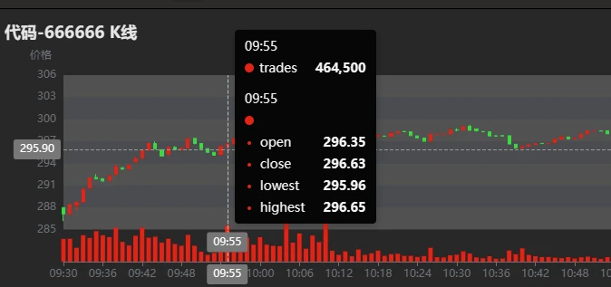

# 订阅
s.subscribe(host="192.198.1.39",
            port=8988,
            handler=handlerTestPython,
            tableName="mdlStockFundOHLC",
            actionName="testStream",
            offset=0,
            batchSize=2,
            throttle=0.1,
            msgAsTable=True)
```

返回：


图3-9 Python 客户端订阅消费结果

说明：

* 例子中 `offset` 设置为0，表示从流数据表中的内存中的第一条历史数据开始订阅消费。所以在 Python 启动该订阅时，Python 客户端可以消费到订阅流数据表中的所有记录。
* 实盘中，`offset` 一般设置为-1，表示从订阅启动开始，订阅消费该时刻起被订阅流数据表中的增量数据，即最新数据。

### 3.9 DolphinDB DashBoard 面板配置

DolphinDB 提供了便捷的可视化数据面板配置，具体使用方法可以参考官网教程：[数据面板](dashboard_tutorial.html)。

基于该教程合成的 K 线数据配置数据面板效果如下：


图3-10 DolphinDB DashBoard 资产 K 线图

### 3.10 清理环境

实时计算主要依赖 DolphinDB 的流数据功能，包括订阅发布、流数据表和流计算引擎，所以清理相关环境的时候也需要把上述定义内容全部删除掉。

环境清理步骤：

* 删除流数据表时必须先删除所有相关订阅发布，使用 [unsubscribeTable 函数](../funcs/u/unsubscribeTable.html)。
* 删除流数据表使用 [dropStreamTable 函数](../funcs/d/dropStreamTable.html)。
* 删除流计算引擎使用 [dropStreamEngine 函数](../funcs/d/dropStreamEngine.html)。

可以执行下述代码清理本教程中流数据功能相关环境：

```
//Declare parameters
mdlSnapshotTBName = "mdlSnapshot"
mdlSnapshotProcessTBName = "mdlSnapshotProcess"
mdlSnapshotProcessEngineName = "mdlSnapshotProcessEngine"
mdlStockFundOHLCTempEngineName = "mdlStockFundOHLCTempEngine"
mdlStockFundOHLCTBName = "mdlStockFundOHLC"
mdlStockFundOHLCEngineName = "mdlStockFundOHLCEngine"
//Cancel related subscriptions
try{unsubscribeTable(tableName=mdlSnapshotTBName, actionName=mdlSnapshotProcessEngineName)} catch(ex){print(ex)}
try{unsubscribeTable(tableName=mdlSnapshotProcessTBName, actionName=mdlStockFundOHLCTempEngineName)} catch(ex){print(ex)}
try{unsubscribeTable(tableName=mdlStockFundOHLCTBName, actionName=mdlStockFundOHLCTBName)} catch(ex){print(ex)}
//Cancel the definition of related stream tables
try{dropStreamTable(mdlSnapshotTBName)} catch(ex){print(ex)}
try{dropStreamTable(mdlSnapshotProcessTBName)} catch(ex){print(ex)}
try{dropStreamTable(mdlStockFundOHLCTBName)} catch(ex){print(ex)}
//Cancel the definition of related stream calculation engines
try{dropStreamEngine(mdlSnapshotProcessEngineName)} catch(ex){print(ex)}
try{dropStreamEngine(mdlStockFundOHLCEngineName)} catch(ex){print(ex)}
try{dropStreamEngine(mdlStockFundOHLCTempEngineName)} catch(ex){print(ex)}
```

### 3.11 实时计算性能测试

表3-1 测试环境配置表

| 配置项 | 信息 |
| --- | --- |
| OS（操作系统） | CentOS Linux 7 (Core) |
| 内核 | 3.10.0-1160.el7.x86\_64 |
| CPU | Intel(R) Xeon(R) Gold 5220R CPU @ 2.20GHz16 逻辑 CPU 核心 |
| 内存 | 256 GB |

表3-2 实时计算性能测试结果表

| 测试场景 | 平均单个股票或基金单次响应计算的时延 |
| --- | --- |
| 实盘全市场股票和基金（6481个代码） | <0.50 ms |

### 3.12 流批一体 K 线合成

为了满足产研一体化需求，需要共用一套代码完成基于历史和实时快照行情合成 K 线的计算。

该需求的用户只需根据本章节基于实时快照行情数据合成 K 线的教程，把全量历史数据全速回放，然后把回放所得的 K 线计算结果存入分区表中即可。

实盘实时计算，按照本章节3.7小节所述，接入实时行情数据即可。如有问题，欢迎添加 DolphinDB 小助手微信号13306510479咨询。

## 4. 总结

本教程详细介绍了如何在 DolphinDB 中基于历史和实时快照行情数据合成沪深北交易所股票和基金的1分钟 K 线，旨在提高 DolphinDB 在具体业务场景下的落地效率。

DolphinDB 在海量数据的批计算性能上表现优异，基于16个 CPU 核心完成1天沪深全市场24,285,866 行原始快照行情的降频 K 线计算只需4.7秒，输出1分钟 K 线数据量为 1,555,440 行。

DolphinDB 在大流量的实时流计算性能上表现优异，可以达到微秒级别。基于2.20GHz 主频的 CPU 实时计算沪深全市场股票和基金的1分钟 K 线的平均单票单次响应计算的时延为 500 微秒。

本教程合成 K 线的规则可能和用户实际场景有差异，用户可以根据本教程提供的源码修改后快速完成项目开发。

## 5. 常见问题解答（FAQ）

### 5.1 out of memory 错误导致任务失败

在使用示例教程进行海量数据并行计算的时候，可能会因为内存不足导致计算任务失败，请添加微信号13306510479 或扫描下面二维码申请测试 license。


图5-1 DolphinDB 小助手

### 5.2 计算结果与所述计算规则不符

本教程是基于2023年某天的全市场股票和基金快照行情开发的，可能会有一些特殊情况并没有考虑周全。用户如果在使用教程代码中发现计算结果与所属计算规则不符的情况，请及时联系 DolphinDB 小助手反馈，联系方式请查看5.1。

## 6. 附录

* 测试数据：[testData.csv](data/k/testData.csv)
* 基于历史快照行情合成 K 线的代码：[calHistoryOHLC.dos](script/k/calHistoryOHLC.dos)
* 基于实时行情快照合成 K 线的代码：[calStreamOHLC.dos](script/k/calStreamOHLC.dos)

