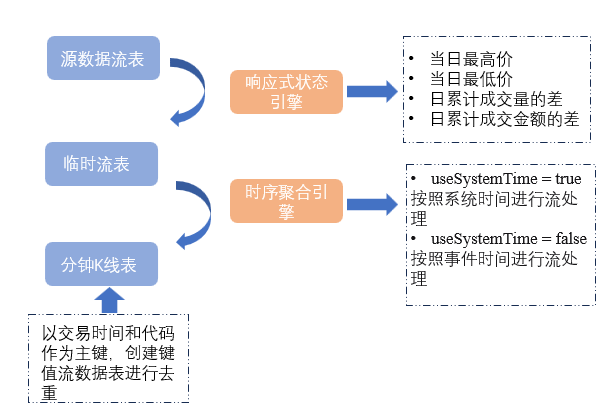
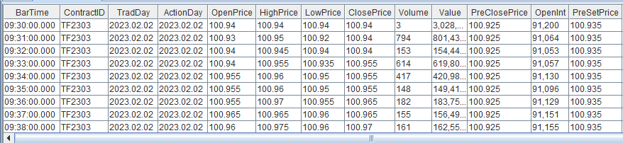

# 基于期货快照行情数据计算合约 K 线以及主连行情

由于不同期货品种的交易时间存在差异，且不同期货合约的活跃度各不相同，因此基于期货快照行情数据合成分钟K线的计算方法在时间对齐上需要进行不同的处理。

本教程旨在提升 DolphinDB 在具体业务场景中的应用效率，并降低其在实际业务中的开发难度。为此，我们开发了 `FuturesOLHC`
模块，通过调用该模块中定义的函数，用户可以轻松实现以下需求：

* 基于期货历史快照行情数据合成分钟K线
* 基于期货历史快照行情数据合成主连行情
* 基于期货实时快照行情数据合成分钟K线

本教程的内容将按以下流程展开：首先详细介绍如何基于期货历史快照行情数据合成分钟K线；接着讲解如何基于期货历史快照行情数据合成主连行情；然后说明如何基于期货实时快照行情数据合成分钟K线；最后，介绍
`FuturesOLHC` 模块的结构与功能，并通过该模块中定义的函数实现上述三种场景的示例。

本教程适用多个交易所，包括：中国金融期货交易所 、 大连商品交易所 、上海期货交易所 、上海国际能源期货交易所、郑州商品交易所 、广州期货交易所。

注意：本文全部代码需要运行在 2.00.14 及以上版本的 DolphinDB server 上。

## 1. 基于历史快照行情合成分钟 K 线

### 1.1 期货快照数据特征

Tick
数据是市场上最为精细和完整的记录，包含了所有市场事件的信息，比如每一次交易的发生或每一个新订单的增加。它记录了市场每个事件的数据，因而被视为最精确的数据形式。与之相比，快照数据是对
Tick
数据的一个切片统计，换句话说，它是对市场信息在时间维度上进行一定频率切片后得到的统计结果。如果将市场信息视为一个时间序列数据流，那么快照数据相当于对这个数据流进行定时截取，呈现某一时刻的市场状态；而
Tick 数据则是该数据流的完整记录。因此，Tick 数据提供更高的精度，而快照数据的精度则依赖于采样的时间间隔。

在中国期货市场，快照行情数据采样频率为 500 毫秒（即每隔 0.5
秒推送一条数据），但推送频率并非严格等间隔。不同的数据供应商和交易所提供的快照行情字段也可能有所不同，因此即使采样频率为 500
毫秒，具体的字段和数据格式也会有所差异。

本教程针对期货数据进行了统一处理，期货快照行情数据表中的常见字段如下:

| **字段名称** | **数据类型** | **数据说明** |
| --- | --- | --- |
| SortCo | SYMBOL | 交易所代码 |
| InstruID | SYMBOL | 期货代码 |
| TradeDay | DATE | 交易日 |
| ClearingDay | DATE | 结算日 |
| TradeTime | TIME | 交易时间 |
| LastPrice | DOUBLE | 最新收盘价 |
| PreSetPrice | DOUBLE | 前一日结算价 |
| PreCloPrice | DOUBLE | 前一日收盘价 |
| OpenPrice | DOUBLE | 最新开盘价 |
| HighPrice | DOUBLE | 最高价 |
| LowPrice | DOUBLE | 最低价 |
| Volume | INT | 成交量 |
| Turnover | DOUBLE | 成交金额 |
| OpenInt | INT | 持仓量 |
| SetPrice | DOUBLE | 结算价 |
| ULimitPrice | DOUBLE | 当日涨停价 |
| LLimitPrice | DOUBLE | 当日跌停价 |
| …… | …… | 快照行情字段太多，详情**[参考附录](#topic_lyb_vpl_sdc)** |

其中，涉及到分钟 K 线计算的**重要字段**有：

| **字段名称** | **数据类型** | **数据说明** |
| --- | --- | --- |
| LastPrice | DOUBLE | 最新收盘价 |
| PreSetPrice | DOUBLE | 前一日结算价 |
| PreCloPrice | DOUBLE | 前一日收盘价 |
| OpenPrice | DOUBLE | 最新开盘价 |
| HighPrice | DOUBLE | 最高价 |
| LowPrice | DOUBLE | 最低价 |
| Volume | INT | 成交量 |
| Turnover | DOUBLE | 成交金额 |
| OpenInt | INT | 持仓量 |
| SetPrice | DOUBLE | 结算价 |
| ULimitPrice | DOUBLE | 当日涨停价 |
| LLimitPrice | DOUBLE | 当日跌停价 |

基于上述字段，期货快照行情数据合成的分钟 K 线**指标及计算规则**如下(计算窗口为**左开右闭**):

| **字段名称** | **数据类型** | **数据说明** | **计算规则** |
| --- | --- | --- | --- |
| OpenPrice | DOUBLE | 开始价 | 计算窗口内的第一条快照行情的最新价   * 如果开盘后没有成交，则为 0 * 如果盘中计算窗口缺失快照行情，则填充上一根 K 线的收盘价 |
| HighPrice | DOUBLE | 最高价 | 计算窗口内的最高价   * 如果开盘后没有成交，则为 0 * 如果盘中计算窗口缺失快照行情，则填充上一根 K 线的收盘价 |
| LowPrice | DOUBLE | 最低价 | 计算窗口内的最低价   * 如果开盘后没有成交，则为 0 * 如果盘中计算窗口缺失快照行情，则填充上一根 K 线的收盘价 |
| ClosePrice | DOUBLE | 收盘价 | 计算窗口内的最后一条快照行情的最新价   * 如果开盘后没有成交，则为 0 * 如果盘中计算窗口缺失快照行情，则填充上一根 K 线的收盘价 |
| Volume | LONG | 成交量 | 计算窗口内的所有快照行情成交量求和，如果缺失快照行情，填充 0 |
| Value | DOUBLE | 成交金额 | 计算窗口内的所有快照行情成交金额求和  如果缺失快照行情，填充 0 |
| Vwap | DOUBLE | 均价 | 计算窗口内的成交金额/成交量 |
| OpenInt | INT | 持仓量 | 当前持仓量 |
| PreSetPrice | DOUBLE | 昨日结算价 | 昨日结算价 |
| SetPrice | DOUBLE | 结算价 | 当日结算价，在当日交易中按分钟收盘价计算 |
| ULimitPrice | DOUBLE | 涨停价 | 当日快照行情中的涨停价，如果盘中计算窗口缺失快照行情，填充上一根 K 线的涨停价 |
| LLimitPrice | DOUBLE | 跌停价 | 当日快照行情中的跌停价，如果盘中计算窗口缺失快照行情，填充上一根 K 线的跌停价 |
| PreClosePrice | DOUBLE | 昨收价 | 当日快照行情中的昨收价，如果盘中计算窗口缺失快照行情，填充上一根 K 线的昨日收盘价 |

### 1.2 快照数据合成的规则

#### 1.2.1. 最高价和最低价的处理

快照行情是时间间隔的数据切片。快照行情中的最高价和最低价数据反映的是从开盘到最新切片时刻的最高价和最低价，而不是切片间隔内的最高价和最低价。但是 K
线中最高价和最低价，则是计算窗口内的最高价和最低价。因此，我们不能简单的以快照行情的最高价和最低价来合成 K 线的最高价和最低价。

如果 K 线窗口内的快照行情最高（低）价高（低）于 K 线考虑窗口前的快照行情最高（低）价，则窗口内的快照行情最高（低）价就是 K
线的最高（低）情况价。譬如，窗口内切片数据的最新价分别为 [3.0, 3.0, 3.11, 3.10]，最高价分别为 [3.12, 3.12,
3.12, 3.12]，该窗口前一切片的最高价为 3.11，那么该窗口内最高价为 3.12。如果该窗口前一切片的最高价为
3.12，该怎么计算最高（低）价呢？此时，与业界的常用做法一致，我们选择 lastPrice 的最大（小）值作为 K 线的最大（小）值。分钟 K
线的最高价的自定义计算函数如下:

```
defg high(deltasHighPrice, highPrice, lastPrice){
	if(sum(deltasHighPrice)>0.000001){
		return max(highPrice)
	}
	else{
		return max(lastPrice)
	}
}
```

参数说明:

* **deltasHighPrice:**
  同一个期货合约相邻两个切片快照的当日最高价（highPrice）的差。该差大于0，表示日内的最高价发生在该区间，此时区间内的最高价为该值
* **highPrice:** 快照行情的当日最高价
* **lastPrice:** 快照行情的当日最新价

注意，此算法为近似算法，计算窗口内的每个切片最后一条 LastPrice 价格有可能反映不出来整个时间窗口内的最高价和最低价。譬如上面的例子中，K
线窗口前一切片的最高价为 3.12， 根据算法最高价为 lastPrice 的最大值 3.11，但实际上很有可能存在一个成交价 3.12。要得到 K
线真实的最高价和最低价，只能通过逐笔成交数据来计算，而非现在的快照数据。

同理，分钟 K 线的最低价的自定义计算函数如下:

```
defg low(deltasLowPrice, lowPrice, lastPrice){
	sumDeltas = sum(deltasLowPrice)
	if(sumDeltas<-0.000001 and sumDeltas!=NULL){
		return min(iif(LowPrice==0.0, NULL, lowPrice))
	}
	else{
		return min(lastPrice)
	}
}
```

参数说明:

* **deltasLowPrice:** 同一个期货合约相邻两个切片快照的当日最低价（LowPrice）的差
  。该差小于0，表示日内的最低价发生在该区间，此时区间内的最低价为该值
* **lowPrice:** 快照行情的当日最低价
* **lastPrice:** 快照行情的当日最新价

#### 1.2.2. 成交量、成交额和成交笔数的处理

快照行情中的成交量、成交金额和成交笔数都是日累计求和值，所以在进行滚动窗口计算前，需要先求出两笔相邻快照的增量。使用DolphinDB 内置的 [deltas](../funcs/d/deltas.html) 函数和 [context by SQL](../progr/sql/contextBy.html)
语句进行数据预处理，具体处理代码下文会详细介绍。

#### 1.2.3. 开盘以后没有成交

部分成交不活跃的期货，09:00:00 开始交易后一直没有成交，但是快照行情会正常推送。

针对开盘以后一直没有成交的计算窗口，本教程处理规则如下:

* OpenPrice, HighPrice, LowPrice, ClosePrice, Volume, Value 为 0
* PreClosePrice, ULimitPrice, LLimitPrice 为快照行情中对应的值

#### 1.2.4. 盘中计算窗口内没有成交

部分成交不活跃的期货，会出现盘中某些计算窗口内完全没有成交，但是快照行情会正常推送。

针对盘中没有成交的计算窗口，本教程处理规则如下:

* OpenPrice, HighPrice, LowPrice, ClosePrice 等于前一根 K 线的 ClosePrice
* Volume, Value 为 0
* PreClosePrice, ULimitPrice, LLimitPrice 等于前一根 K 线对应的值

### 1.3 分钟 K 线计算步骤

以下部分将详细介绍附录中模块关于历史期货快照数据进行分钟 K 线计算的步骤

#### 1.3.1. 根据不同期货品种生成分钟 K 线对齐表

由于不同期货品种的交易时间不同，需根据各期货品种的交易时段及交易代码，生成一个用于对齐分钟K线的对齐表。该对齐表将包含每个期货品种在其交易时段内的完整分钟数据。

以上证50指数、沪深300指数、中证500指数和中证1000指数期货为例，它们的交易时间为 9:30-11:30 和13:00-15:15。为了计算 1
分钟 K 线数据，对齐表将包括这些指数期货在 9:30-11:30 及 13:00-15:15 两个时段内的每一分钟数据。

注：

关于对齐表的详细生成部分，可**[参考附录模块](#topic_lyb_vpl_sdc)**。

#### 1.3.2. 定义计算分钟 K 线的函数

**原始快照行情数据的初步处理**

以原始行情数据表为参数，对原始行情数据表按分钟频率进行处理，包括:

* 计算同一个期货的两笔相邻快照的最高价和最低价的变化幅度 ；
* 利用 `deltas` 函数计算相邻元素之差，后续一分钟 K 线中 Volume、Turnover
  应为一分钟内的DeltasVolume、DeltasTurnover 之和。
* 计算同一个期货的两笔相邻快照的成交量、成交金额和成交笔数的增量，生成表 tempTB1 。

**进行 N 分钟窗口和 N 分钟步长的聚合计算**

针对处理后的快照行情 tempTB1 进行窗口为 N 分钟、步长为 N 分钟的滚动窗口计算，生成表 tempTB2。重要处理步骤如下:

* 调用了自定义函数 `high` 和 `low` 计算 K
  线的最高价和最低价；
* 调用 DolphinDB 内置函数 `interval`，以 60 秒作为 duration
  对数据基于日期时间进行降频处理。在此步骤时，针对盘中计算窗口缺失快照行情的情况，统一用0填充，后面会针对全部为 0 的 K
  线填充数据进一步处理；
* 聚合计算变量包括交易所代码，期货代码，交易日，结算日以及降维之后的日期时间。

  注：

  对于 interval 函数具体用法与参数可参考文档 [interval函数](../progr/sql/interval.html)。参数中的
  *label*字符串，表示将分组区间的哪一个边界作为 label 输出，可取值为 'left' 或
  'right'。本教程中期货数据的分钟频数据根据分组区间**右边界**输出，可根据具体需求调整 label
  参数。

**对齐每日 K 线，填充缺失快照行情计算窗口**

对于聚合计算后生成的分钟频表 tempTB2 中的期货代码进行标准化处理后，提取 tempTB2 表中期货代码，并将 tempTB2
的分钟频数据和每个期货对应品种的时间段对齐得到表 result 。

针对 result 进行如下处理，得到最终 K 线表 res :

* 针对盘中没有成交的计算窗口，OpenPrice, HighPrice, LowPrice, ClosePrice用前一根 K 线的
  ClosePrice 填充 ，PreClosePrice 用前一根 K 线对应的值填充
* 删除盘中交易时间、收盘价为空的数据
* SortCo 数据全部大写处理

## 2. 基于历史快照行情合成主连行情

在期货市场中，我们主要关注主连合约的报价，即主力合约的连续表现。在不同市场中，主连合约的切换遵循特定的规则。一般来说，各市场的主力合约需符合以下通用规则:

* 每个期货品种只能选定一个主力合约；
* 主力合约的最后交易日必须晚于当前日期。如果某个合约今天是最后交易日，通常它不会被选为主力合约；
* 主力合约通常基于日成交量、持仓量或者用户确定的切换日期来确定。

基于期货快照行情数据合成的主连行情表结构相比于上文中的分钟指标表结构，增加了以下几个列：

| **字段名称** | **数据类型** | **数据说明** | **计算规则** |
| --- | --- | --- | --- |
| backwardFactor | DOUBLE | 后复权因子 | 后复权因子， 前一次后复权因子\*前主力合约ClosePrice/主力合约PreClosePrice |
| forwardFactor | DOUBLE | 前复权因子 | 前复权因子，前一次前复权因子\*主力合约PreClosePrice/前主力合约ClosePrice |

期货市场中最活跃、交易量最大的合约称为主力合约。当交易者滚动持仓时，关注点转移至下一个主力合约，可能导致合约之间的跳空，即相邻合约之间出现较大的价格差距。为处理连续合约的跳空问题，采取复权调整历史数据，以更准确地反映资产的真实价值。一般有两种复权方法：

**前复权（向前复权）**: 将历史数据调整为当时价格变动前的价位，适用于回测和研究分析。

**后复权（向后复权）**: 将历史数据调整为当时价格变动后的价位，更符合实际操作情况。

### 2.1 定义 `adjustFactor` 函数，计算复权因子

#### 2.1.1 计算后复权因子

后复权方式的思路是以首日合约价格水平为基准，调整后续合约价格以保证连续性。

* `adjustFactor` 函数以 result 主力分钟频 K
  线表，temp 主力日频表作为输入参数，并通过主力日频表获得需要更新的交易日。
* 首先设置后复权首日因子为1，并将首日与后续日期数据分开分别存入表 temImprove0 和表
  temImprove1。将首日之后数据的表格与完整日期的表格 temImprove
  进行左连接，将当日与前日对比，判断主连行情是否改变。
* 计算后复权因子（adjustFactor）:若主连行情未改变，后复权因子不进行调整；若主连行情发生改变，通过公式
  backwardFactor（前一日复权因子）\* forwardClosePrice（前一日主力合约收盘价）/
  PreClosePrice（当日主力合约前一日收盘价）计算后复权因子
* 复权因子连乘:计算出当日复权因子之后，通过 `cumprod` 函数将复权因子进行连乘用于后续调整价格
* 在进行左连表格操作时，需要找回首次出现的主连行情代码。注意：首次复权值均为 1 ，因此对结果没有影响。比如，5 月 14 日左连至 5 月 13
  日数据，但 5 月 14 日出现了 `rr` 品种，而 5 月 13 日没有该品种，在左连时 5 月 14 日的
  `rr` 品种会丢失，因此需要对首日丢失的数据进行复权找回。

#### 2.1.2 计算前复权因子

前复权方式的思路是以最新主力合约价格水平为基准，调整历史合约价格以保证连续性。

* 首先设置最后一日前复权因子为 1，并将最后一日与之前日期数据分开分别存入表 temImprove0 和表
  temImprove1。将最后一日之前数据的表格与完整日期的表格
  temImprove进行左连，将当日与后一日对比，判断主连行情是否改变。
* 计算前复权因子（adjustFactorRes）:若主连行情未改变，前复权因子不进行调整；若主连行情发生改变，通过公式
  forwardFactor（后一日复权因子）\* backwardPreClosePrice（后一日主力合约收盘价）/
  ClosePrice（主力合约收盘价）计算前复权因子
* 复权因子连乘:计算出当日复权因子之后，通过 `cumprod` 函数将复权因子进行连乘用于后续调整价格
* 找回左连表格时，首次出现的主连行情代码。注意:首次复权都为1，因此不影响结果

### 2.2 将前后复权因子以及对应 OHLC 价格加入终表

将主力分钟频 K 线表、上一步计算输出的后复权因子表 adjustFactor、前复权因子表 adjustFactorRes
进行**左连接**，以此将复权因子数据以及对应的 OHLC 价格加入目标表。

### 2.3 计算 startDate 到 endDate 的主连行情

定义聚合函数，以 startDate 和 endDate 作为参数输入，计算这段时间的主连行情。

* 通过 `temporalAdd` 函数，分别计算出 startDate 和 endDate
  前一个交易日的日期（startDate1、endDate1）。并从库表中导入 startDate1 到 endDate 的分钟频 K 线数据 res
  。
* 从分钟频 K 线数据 res 中获取需要计算的交易日。
* 判断主力合约:分别计算每日结束时的成交量和持仓，注意:**国债期货**与**商品期货**判断主力方式不同：
  + 商品期货代码（**持仓量+成交量**）最大，提取当日主力记作 tb。
  + 国债期货主力计算逻辑为（**持仓量**）最大，提取主力记作 tbCN。
* 从 res 提取 startDate 到 endDate 分钟频数据并根据 tb 中前一日主力代码确定分钟频数据里的当日主力，得到主连行情
  result。
* 从库表提取历史主连行情表，并与前一步生成的新的主连行情 result 进行合并。通过 `group by` 处理
  result 得到日频数据 tempt，用于计算复权因子。
* 最后调用第一步定义的 `adjustFactor` 函数得到主连行情。

## 3. 基于实时期货快照数据合成 K 线

本部分将详细介绍如何在 DolphinDB 中搭建期货快照数据的分钟 K 线实时计算流框架。关于 DolphinDB 的流数据功能的基础概念可以参考官网教程: [流数据](../stream/str_intro.html)。 需要说明的是，实时数据与上文中历史数据的分钟 K
线计算逻辑是一致的。

基于实时快照行情合成 K 线的流程图如下:



接下来介绍期货快照数据流计算框架的搭建步骤，**详细代码**可参考附录模块的 `streamFrame.dos` 部分

**第一步:定义原始行情流表**

首先创建与实时数据结构一致的源数据流表。注意每次运行前需要清理掉相关的流数据表和引擎。

说明: `enableTableShareAndPersistence`
函数在使用时，需要在配置文件中（单节点：dolphindb.cfg，集群：cluster.cfg）指定配置参数
*persistenceDir*，配置参考[功能配置](../db_distr_comp/cfg/function_configuration.html)。

```
temp = streamTable(100:0, colNames , colTypes)
enableTableShareAndPersistence(table=temp, tableName=`quotationTable, cacheSize=1200000)
```

**第二步:定义中间的临时流表**

首先定义一个临时流表，用于储存响应式状态引擎计算结果。其次通过 `createReactiveStateEngine`
创建响应式状态引擎计算中间变量，如当日最高价，当日最低价（根据自定义最高价最低价函数），日累计成交量的差，日累计成交金额的差。最后订阅原始行情，即原始行情表实时流入的数据会及时发布到引擎，实时完成对原始行情的加工。

**第三步:定义分钟线输出表，通过时序聚合引擎实时计算分钟数据**

首先以交易时间和期货标的代码作为主键创建键值流数据表作为我们的目标表，用于实现流数据的幂等性写入，即多次写入键值相同的数据，其结果与第一次写入的结果相同，从而避免数据重复写入。向表中添加新记录时，系统会自动检查新记录的主键值:

* 如果新记录的主键值与内存中已有记录的主键值重复时，已有的记录不会被更新。
* 一次性批量插入新记录时，若有多条记录具有相同的主键值，且该主键值与已有记录的主键值不同，只有第一条记录能成功插入。

接着使用 `createTimeSeriesEngine`
创建流数据时间序列引擎，以实现基于时间的滚动窗口进行实时计算。如一分钟K线的生成，参数 *windowSize* 和 *step* 设置为
60000 毫秒即 60 秒。

订阅原始行情之后，时间序列引擎会将计算结果插入之前创建的键值流表。

**第四步:开始计算，往流表注入数据**

```
// 这里假设流表名称为: snapStream
objByName(`snapStream).append!(tb)
sleep(10000)
select top 100* from outputKlineTable
```

以下为流表中的部分 1 分钟数据:



## 4. 期货快照数据分钟 K 线计算模块

在上文中，我们详细介绍了如何通过期货快照历史数据计算分钟 K 线，以及合成主连行情；除此之外，还介绍了在流数据场景中，如何实时计算分钟 K 线。

本部分将详细介绍分钟 K 线计算模块
`FuturesOLHC`，该模块封装了上文中介绍的计算逻辑，通过调用该模块的函数，便可以方便快捷地实现期货快照数据历史计算及主连行情合成和实时计算。

### 4.1 模块结构与功能

`FuturesOLHC` DolphinDB 模块的文件结构为：

```
FuturesOLHC/
├── batchFrame.dos
├── createTable.dos
├── streamFrame.dos
├── tableSchema.dos
└── utils.dos
```

其中，每个文件的功能分别为：

| **文件名** | **功能** |
| --- | --- |
| `utils.dos` | 定义整个模块需要用到的辅助函数 |
| `tableSchema.dos` | 定义期货快照数据及分钟指标的表结构函数 |
| `createTable.dos` | 定义创建相应持久化库表的函数 |
| `batchFrame.dos` | 定义计算历史期货快照数据分钟K线和主连行情的函数 |
| `loadAllData.dos` | 定义搭建实时期货快照数据分钟K线的流计算框架的函数 |

### 4.2 模块导入

下载 DolphinDB 模块 `FuturesOLHC` 之后，需要将其同步到服务器上，当在 DolphinDB
调用模块时，会到相应路径下查找需要的模块文件。关于 DolphinDB 模块部分的详细介绍，可参考：[模块](tu_modules.html)。

**同步路径**

将模块放置于**节点所在 Home 目录的 module 目录下**，节点所在 Home 目录可通过
`getHomeDir` 函数获取， **假设** Home 目录为:
/DolphinDB/server，那么需要将模块文件放置于 /DolphinDB/server/modules/ 路径下。

**如何同步**

* 使用 xftp 等传输软件，将模块传输至服务器上指定的路径。
* 使用 scp 命令：`scp -r FuturesOLHC
  <user>@<服务器ip>:/DolphinDB/server/modules/`。

### 4.3 如何使用模块

以下部分详细介绍 `FuturesOLHC`
模块的用法，完整示例代码可参考附件：`demo.dos`

#### 4.3.1 创建期货快照数据和分钟 K 线数据持久化表

以下示例中基于商品期货和国债期货交易频率与市场规模的特性，演示了商品期货和国债期货快照数据和分钟数据分区表的创建：

```
/ 引入模块文件
use FuturesOLHC::createTable
// 商品期货快照数据数据库名
comdtySnapDbname = "dfs://comdtySnapDb"
// 商品期货快照数据数据表名
comdtySnapTbname = "comdtySnapTb"
// 商品期货分钟和主连数据库名
comdtyMinDbname = "dfs://comdtyMin"
// 商品期货分钟数据表名
comdtyMinTbname = "futurePrice1Min"
// 商品期货分钟数据主连行情数据表名
comdtyZlTbname = "futurePrice1MinZl"

// 国债期货快照数据数据库名
rtSnapDbname = "dfs://rtSnapDb"
// 国债期货快照数据数据表名
rtSnapTbname = "rtSnapTb"
// 国债期货分钟和主连数据库名
rtMinDbname = "dfs://rtMin"
// 国债期货分钟数据表名
rtMinTbname = "futurePrice1Min"
// 国债期货分钟数据主连行情数据表名
rtZlTbname = "futurePrice1MinZl"

// 根据指定参数创建相应库表
createComdtyFuturesDfs(comdtySnapDbname, comdtySnapTbname)
createComdtyFuturesMinDfs(comdtyMinDbname, comdtyMinTbname)
createComdtyFuturesZlDfs(comdtyMinDbname, comdtyZlTbname)

createRtFuturesDfs(rtSnapDbname, rtSnapTbname)
createRtFuturesMinDfs(rtMinDbname, rtMinTbname)
createRtFuturesZlDfs(rtMinDbname, rtZlTbname)
```

其中，以创建商品期货分钟 K 线持久化库表函数 `createComdtyFuturesDfs`
为例，需要传入两个参数，分别为：

| **参数名** | **含义** |
| --- | --- |
| *comdtyMinDbname* | 数据库名 |
| *comdtyMinTbname* | 数据表名 |

建库建表的具体代码可参考 `FuturesOLHC` 模块下的
`createTable.dos` 文件。

#### 4.3.2 实时期货快照数据流计算框架搭建

创建好库表之后，即可执行以下代码来构建流计算框架，并根据附件中提供的示例数据模拟实时计算过程。

```
// 引入模块文件
use FuturesOLHC::streamFrame
use FuturesOLHC::tableSchema
use FuturesOLHC::utils

// 商品期货原始流数据表名
rawComdtyStreamTbName = "comdtyStreamTb"
// 国债期货原始流数据表名
rawRtStreamTbName = "rtStreamTb"

try{
	// 先删除持久化流表
	unsubAndDropAll(rawComdtyStreamTbName)
    unsubAndDropAll(rawRtStreamTbName)
	// 再创建相应持久化流表
	enableTableShareAndPersistence(table=createComdtyRawTable(), tableName=rawComdtyStreamTbName, cacheSize=10000)
    enableTableShareAndPersistence(table=createRTRawTable(), tableName=rawRtStreamTbName, cacheSize=10000)
}catch(ex){
	print(ex)

// 创建商品期货快照数据流计算框架
nMin = 1 //分钟频率 (例：1 表示生成 1 分钟 K 线)
dbname = comdtyMinDbname // 分钟数据最终导入的数据库名
tbname = comdtyMinTbname // 分钟数据最终导入的数据表名
FuturesOLHC::streamFrame::buildComdtyFrame(nMin, rawComdtyStreamTbName, dbname, tbname)

// 创建国债期货快照数据流计算框架
nMin = 1 //分钟频率 (例：1 表示生成 1 分钟 K 线)
dbname = rtMinDbname // 分钟数据最终导入的数据库名
tbname = rtMinTbname // 分钟数据最终导入的数据表名
FuturesOLHC::streamFrame::buildRtFrame(nMin, rawRtStreamTbName, dbname, tbname)

// 商品期货数据文件存放路径
comdtyPath = "/dolphindb/data/comdty_tickdata.csv"
// 获取流表表结构
sche = schema(objByName(rawComdtyStreamTbName,true)).colDefs
// 将示例数据导入内存表
comdty_tickdata = loadText(comdtyPath,,sche)
// 回放示例数据到流表中
replay(comdty_tickdata, objByName(rawComdtyStreamTbName,true), `trd_ts, `trd_ts, -1, false)

// 国债期货数据文件存放路径
rtPath = "/dolphindb/data/rt_tickdata.csv"
// 获取流表表结构
sche = schema(objByName(rawRtStreamTbName,true)).colDefs
// 将示例数据导入内存表
rtTickdata = loadText(rtPath,,sche)
// 回放示例数据到流表中
replay(rtTickdata, objByName(rawRtStreamTbName,true), `trd_ts, `trd_ts, -1, false)
```

其中，以创建商品期货快照数据流计算引擎函数 `buildComdtyFrame` 为例，需要传入四个参数，分别为：

| **参数名** | **含义** |
| --- | --- |
| *nMin* | 需要计算的分钟粒度，如 1 表示 1 分钟 |
| *rawComdtyStreamTbName* | 商品期货快照数据的流表名称，上游数据导入到该流表中 |
| *dbname* | 分钟 K 线计算后导入的数据库名 |
| *tbname* | 分钟 K 线计算后导入的数据表名 |

关于流计算框架的详细搭建步骤，可参考本文中**[第三章](#topic_gy1_vpl_sdc)**，具体代码可参考 `FuturesOLHC` 模块下的
`streamFrame.dos` 文件。

#### 4.3.3 历史期货快照数据分钟 K 线计算

本部分以示例数据为例，展示如何基于历史期货快照数据计算分钟 K 线

```
use FuturesOLHC::batchFrame

// 商品期货历史快照数据 K 线计算
dataType = "cmdty" //
dbname = comdtySnapDbname// 存放历史原始数据的数据库名
tbname = comdtySnapTbname // 存放历史原始数据的数据表名
// 将示例数据导入库表中
pt = loadTable(dbname, tbname)
pt.tableInsert(comdty_tickdata)

startDate = 2024.10.10 // 计算开始时间
endDate = 2024.10.10 // 计算结束时间
nMin = 1 //分钟频率 (例：1 表示生成 1分钟 K 线)
res  = getFuturesKMin(dataType, dbname, tbname, startDate, endDate, nMin)

// 国债期货历史快照数据 K 线计算
dataType = "rt" //
dbname = rtSnapDbname// 存放历史原始数据的数据库名
tbname = rtSnapTbname // 存放历史原始数据的数据表名
// 将示例数据导入库表中
pt = loadTable(dbname, tbname)
pt.tableInsert(rtTickdata)

startDate = 2024.10.08 // 计算开始时间
endDate = 2024.10.08 // 计算结束时间
nMin = 1 //分钟频率 (例：1 表示生成 1分钟 K 线)
res  = getFuturesKMin(dataType, dbname, tbname, startDate, endDate, nMin)
```

其中，计算期货快照分钟K线数据函数 `getFuturesKMin` 需要传入六个参数，分别为：

| **参数名** | **含义** |
| --- | --- |
| *dataType* | 需要计算的数据类别   * comdty：商品期货 * rt：国债期货 |
| *dbname* | 存放历史期货快照数据的数据库名 |
| *tbname* | 存放历史期货快照数据的数据表名 |
| *startDate* | 计算开始时间 |
| *endDate* | 计算结束时间 |
| *nMin* | 需要计算的分钟粒度，如 1 表示 1 分钟 |

关于历史期货快照数据分钟 K 线的详细计算步骤，可参考本文中**[第一章](#topic_ttc_5pl_sdc)**，具体代码可参考 `FuturesOLHC` 模块下的
`batchFrame.dos` 文件。

#### 4.3.4 历史期货快照数据分钟主连行情合成

本部分以示例数据为例，展示如何基于历史期货快照数据合成主连行情

```
// 商品期货主连行情
minDbname = comdtyMinDbname
minTbname = comdtyMinTbname
zlDbname = comdtyMinDbname
zlTbname = comdtyZlTbname
startDate = 2024.10.10
endDate = 2024.10.10
nMin = 1
comdtyZL = comdtyZlFuturesKMin(minDbname, minTbname, zlDbname, zlTbname, startDate, endDate, nMin)

// 国债期货主连行情
minDbname = rtMinDbname
minTbname = rtMinTbname
zlDbname = rtMinDbname
zlTbname = rtZlTbname
startDate = 2024.10.08
endDate = 2024.10.08
nMin = 1
rtZL = rtZlFuturesKMin(minDbname, minTbname, zlDbname, zlTbname, startDate, endDate, nMin)
```

其中，以历史商品期货快照数据主连行情合成函数 `comdtyZlFuturesKMin`
为例，需要传入七个参数，分别为：

| **参数名** | **含义** |
| --- | --- |
| *minDbname* | 存放历史期货快照数据分钟线的数据库名 |
| *minTbname* | 存放历史期货快照数据分钟线的数据表名 |
| *zlDbname* | 存放期货快照数据主连行情的数据库名 |
| *zlTbname* | 存放期货快照数据主连行情的数据表名 |
| *startDate* | 计算开始时间 |
| *endDate* | 计算结束时间 |
| *nMin* | 需要计算的分钟粒度，如 1 表示 1 分钟 |

关于历史期货快照数据主连行情合成的详细计算步骤，可参考本文中**[第二章](#topic_xkz_5pl_sdc)**，具体代码可参考 `FuturesOLHC` 模块下的
`batchFrame.dos` 文件。

## 5. 总结

本教程详细介绍了如何在 DolphinDB 中利用历史和实时快照行情数据，生成期货的分钟 K 线及主连行情。并提供了实现上述功能的
`FuturesOLHC` 模块，最后基于该模块详细地演示了实时计算分钟 K 线、计算历史分钟K
线以及合成主连行情的步骤。

需要注意的是，本教程中所介绍的 K
线和主连行情的生成规则，可能与用户的实际应用场景有所不同。用户可以参考本教程中的模块源码，根据自身需求进行调整，从而快速完成项目开发。

## 附录

* **不同期货品种的具体交易时间段**:

  注：

  本教程主要介绍国内期货快照数据的分钟线合成，对于不同交易时间的期货品种，可在模块中 `utils.dos` 脚本修改
  `getFuturesTradeTime` 函数，自定义相应期货品种的交易时间。

| **期货品种** | **期货代码** | **交易时间** |
| --- | --- | --- |
| 上证 50 指数、沪深 300 指数、中证 500 指数，中证 1000 指数 | IH, IF, IC, IM | 9:30 — 11:30  13:00 — 15:00 |
| 黄大豆一号、普麦、布伦特原油、玉米、玉米淀粉、苯乙烯、乙二醇、铁矿石、焦炭、焦煤、聚乙烯 、豆粕、棕榈油、液化石油气、聚丙烯、对二甲苯、粳米、聚氯乙烯、豆油、沥青、燃料油、热轧卷板、螺纹钢、天然橡胶、纸浆、动力煤、棉花、棉纱、玻璃、甲醇、菜籽油、普通硅铁、菜籽粕、硅铁、白砂糖、线材、PTA | A, B, BR, C, CS, EB, EG, I, J, JM, L, M, P, PG, PP, PX, RR, V, Y, BU, FU, HC, RB, RU, SP, ZC, CF, CY, FG, MA, OI, PF, RM, SA, SR, SH, TA | 9:00 — 10:15  10:30 — 11:30  13:30 — 15:00  21:00 — 23:00 |
| 白银、黄金、原油 | AG, AU, SC | 09:00 — 10:15  10:30 — 11:30  13:30 — 15:00  21:00 — 02:30 |
| 铝、沥青、线材、铜、镍、铅、锡、不锈钢、锌 | AL, AO, BC, LU, NR, CU, NI, PB, SN, SS, ZN | 09:00 — 10:15  10:30 — 11:30  13:30 — 15:00  21:00 — 01:00 |
| 低硫燃料油、20号胶 | LU, NR | 09:00 — 10:15  10:30 — 11:30  13:30 — 15:00  21:00 — 23:00 |
| 苹果、红枣、甲醇、粳稻、晚籼稻、花生、普麦、早籼稻、菜籽、硅铁、锰硅、尿素、胶合板、纤维板、鸡蛋、生猪、线材、强麦、聚丙烯、硅铁 | AP, CJ, EC, JR, LR, PK, PM, RI, RS, SF, SM, UR, BB, FB, JD, LH, WR, WH, LC, SI | 09:00 — 10:15  10:30 — 11:30  13:30 — 15:00 |
| 10 年期国债期货、5 年期国债期货、2 年期国债期货、10 年期国债期货 | T, TF, TS, TL | 09:30 — 11:30  13:00 — 15:15 |

* 期货快照分钟K线计算完整模块 `FuturesOLHC`：[FuturesOLHC.zip](script/k_line_calculation/FuturesOLHC.zip)
* 期货快照分钟K线计算示例 `demo.dos`：[demo.dos](script/k_line_calculation/demo.dos)
* 示例数据：[data.zip](script/k_line_calculation/data.zip)

