# DolphinDB 日志分析工具使用手册

当 DolphinDB 出现问题、亟需深入日志排查时，诸多繁琐操作容易影响排查效率。用户不仅需要手动定位问题时段对应的日志文件与关键片段，还需跨多个节点审查同时期的日志记录。这些过程不仅冗长复杂，还容易出错，更可能导致用户遗漏部分通用分析步骤，进而延误问题解决。此外，部分用户希望实现日志的实时监控，以便在特定模式出现时即刻通过邮件获得告警通知。
为解决这一系列挑战，DolphinDB 精心打造了日志分析工具——一款专为提升日志分析效率而设计的模块。
该工具亮点纷呈，能够批量处理指定文件夹内的日志数据，精准读取用户指定时间范围内的所有日志条目，生成相关报表，支持灵活定制报告内容，满足多样化分析需求。
此外，该工具还实现了对节点日志的实时监控，从而确保用户能在第一时间掌握最新日志动态。用户可以配置白名单与黑名单机制，以过滤无关日志，进而聚焦核心信息；还可以启用邮件告警功能，并且自定义邮件内容。
最后，DolphinDB 日志分析工具还支持用户自定义日志解析内容，以此享受全面、便捷且高效的日志分析解决方案。
本文将从具体使用角度，详细介绍该工具的依赖、接口和使用案例。

## 1. 配置要求

2.00.10 或以上版本 DolphinDB Linux 版。本文测试通过的版本包括 2.00.10, 2.00.11, 2.00.12, 2.00.13, 2.00.14, 3.00.0, 3.00.1。

在数据节点或计算节点：

* 配置 [persistenceDir](https://docs.dolphindb.cn/zh/db_distr_comp/cfg/function_configuration.html?hl=persistencedir) 用于设置共享流数据表的持久化路径。
* 安装 HttpClient 插件，用于发送 HTTP 请求或者邮件。最低版本要求：3.00.1.5, 2.00.13.5, 3.00.0.9, 2.00.12.12, 2.00.11.13, 2.00.10.16。

## 2. 快速上手

安装附件模块源码文件到 *server/modules* 目录下，在数据节点或计算节点运行。

### 2.1 批量分析指定文件夹下的日志

该 demo 实现批量读取目录 */dolphindb/server/log* 下的日志到原始日志流表 originLogLines，日志时间范围为 1 小时前到当前时间戳，订阅并解析日志内容输出到解析结果流表 logAnalysisResult：

```
clearCachedModules()
go
use DDBLogAnalyser::config
use DDBLogAnalyser::logReader
use DDBLogAnalyser::logParser::logParser
use DDBLogAnalyser::reportGenerator::reportGenerator
go

clearEnv()
go
batchModeVersion = version() // 与 logDir 下的日志对应的 DolphinDB 版本相同
config = getExampleConfig(batchModeVersion)
config["logDir"] = "/dolphindb/server/log"
config["startTime"] = temporalAdd(now(), -1H) // 日志开始时间为当前时间戳 - 1H
config["endTime"] = now() // 日志结束时间当前时间戳
initConfig(config)
go

readLog()
parseLog()
generateReport()
```

图 1. 图 2-1 logAnalysisResult 流表部分数据截图

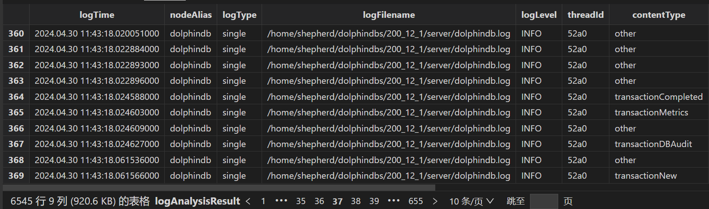

全部解析完毕后生成多份报表，包括 errors 所有错误信息表、warnings 所有警告信息表、longestTransactionsReport 最长耗时事务表、transactionAuditReport 所有事务 DDL 日志表等：

图 2. 图 2-2 结果报表部分截图

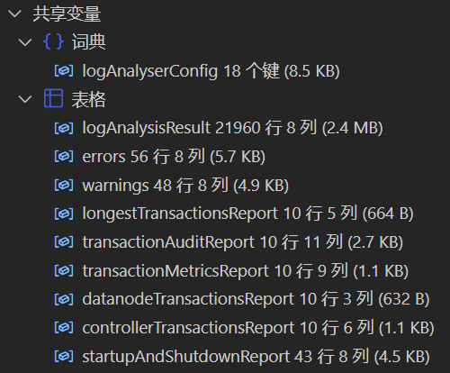

### 2.2 实时监控指定集群的最新日志

运行脚本时要求指定集群所有节点都在线，运行脚本后只要求指定集群控制节点和代理节点在线即可监控所有节点日志。

该 demo 实现流式读取指定远程集群的所有节点的日志到原始日志流表 originLogLines，订阅并解析日志内容输出到解析结果流表 logAnalysisResult：

```
try { loadPlugin("httpClient") } catch(err) { print(err) }
go
clearCachedModules()
go
use DDBLogAnalyser::config
use DDBLogAnalyser::logReader
use DDBLogAnalyser::logParser::logParser
use DDBLogAnalyser::reportGenerator::reportGenerator
use DDBLogAnalyser::alertGenerator
go

clearEnv()
go
config = getExampleConfig()
config["remoteControllerSites"] = [
  "192.168.100.43:7600",
  "192.168.100.44:7600",
  "192.168.100.45:7600"
] // 远程集群的所有控制节点的 IP:端口号
config["remoteUsername"] = "admin" // 远程集群的管理员账户
config["remotePassword"] = "123456" // 远程集群的管理员密码
alertConfig = dict(STRING, ANY)
alertConfig["userId"] = "xxx@xxx.com" // 告警发送邮箱账号，必须开启 SMTP
alertConfig["pwd"] = "xxxxxx" // 告警发送邮箱密码
alertConfig["recipient"] = "xxx@xxx.com" // 告警接收人邮箱
alertConfig["logLevelFilter"] = ["DEBUG"] // 按日志等级过滤，排除 DEBUG 日志
alertConfig["whitelist"] = ["%whitelist error%"] // 用 like 和日志内容匹配，过滤需要的日志，优先生效。不需要白名单时不配置。
alertConfig["blacklist"] = ["%blacklist error%"] // 用 like 和日志内容匹配，过滤不要的日志，在白名单后生效。不需要黑名单时不配置。
config["alertConfig"] = alertConfig
initConfig(config)
go

readLog()
parseLog()
initAlertGenerator()
```

图 3. 图 2-3 logAnalysisResult 流表部分数据截图

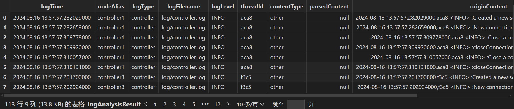

对内容含 “whitelist error“ 的日志发送邮件告警（需要修改 config 字典里配置的邮箱；需要邮箱支持 SMTP）：

```
writeLog("whitelist error")
```

图 4. 图 2-4 告警邮件

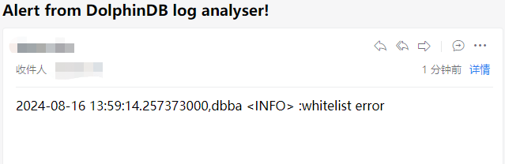

## 3. 配置项

通用配置项：

| 配置项 | 类型 | 说明 |
| --- | --- | --- |
| mode | 正整数 | * 0：为流处理模式，实时读取集群最新日志并解析。 * 1：为批处理模式，批量解析 logDir 配置项下的日志文件。 |
| resultType | 字符串 | * sharedTable：   + 批处理时，解析结果表为共享内存表，解析完毕后会对该表按日志时间排序。   + 流处理时，解析结果表为共享流数据表。 * dfs：批处理和流处理可用，会额外增加一个订阅到分布式表。 |
| resultDbName | 字符串 | 结果库名。 resultType 为 dfs 时使用。 |
| resultTbName | 字符串 | 结果表名。 |
| originLogLinesTbName | 字符串 | 读取原始日志的中间流表的表名。 |
| logParserProjects | 字符串数组 | 解析日志项目，元素值必须为 logParser/projects 下文件名，详见自定义解析项目一节。 为空时调用所有解析项目。 |
| reportGeneratorProjects | 字符串数组 | 生成报告项目，元素值必须为 reportGenerator/projects 下文件名，详见自定义报告项目一节。 为空时调用所有报告项目。 |

批处理配置项：

| 配置项 | 类型 | 说明 |
| --- | --- | --- |
| version | 字符串 | 日志对应的 DolphinDB 版本号，需要**至少填到第三级版本**，例如 2.00.12。 注意：如果需要分析 DolphinDB 升级第三级版本前后的日志（例如从 2.00.11.x 升级到 2.00.12.x），需要使用 startTime 和 endTime 配置项分段提交升级前后的 version 的 readLog 任务；否则可能出现因为 version 和日志实际版本不匹配导致部分日志解析失败的问题。 |
| startTime | 时间类型 | 从开始时间（或之前一小段）开始读取。 |
| endTime | 时间类型 | 到结束时间（或之后一小段）结束读取。 |
| logDir | 字符串 | 路径文件夹，**要求路径下只包含 DolphinDB 日志文件，且必须使用原始日志文件名。** 日志类型识别规则：   * {时间戳}dolphindb.log：single，单节点日志。 * {时间戳}controller.log：controller，控制节点日志。 * {时间戳} {节点别名}.log：datanode 数据节点日志。注意 computenode 计算节点也会被识别为数据节点，如果需要识别计算节点，需要配置 *logTypes* 配置项。 * {时间戳}agent.log：由于 agent 与业务无关，日志会被过滤。 |
| logTypes | 字典 | 用于自定义日志对应的节点类型，例如：{“node2”： “计算节点”} 会识别{时间戳}node2.log 的日志的节点类型为 computenode。 |

流处理配置项：

| 配置项 | 类型 | 说明 |
| --- | --- | --- |
| remoteControllerSites | 字符串数组 | 远程集群的所有控制节点的 IP:端口号。若为单节点，为一个元素的数组，元素值为单节点的 IP:端口号。 |
| remoteUsername | 字符串 | 若监控本地集群（即日志分析工具所在的集群），无需配置。 |
| remotePassword | 字符串 | 远程集群的管理员账户。必须有管理员权限。若监控本地集群（即日志分析工具所在的集群），无需配置。 |
| getLogDuration | 非负数 | 轮询获取 DolphinDB 日志的时间间隔，默认为 3000 ms。 |
| alertConfig | STRING-ANY 字典 | 详见下文 *alertConfig* 配置项。 |

alertConfig 配置项：

| 配置项 | 类型 | 说明 |
| --- | --- | --- |
| userId | 字符串 | 告警发送邮箱账号。 **注意需要开启 SMTP 协议。** |
| pwd | 字符串 | 告警发送邮箱密码 |
| recipient | 字符串 | 告警接收人邮箱 |
| logLevelFilter | 字符串数组 | 按日志等级过滤 |
| whitelist | 字符串数组 | 用 like 和日志内容匹配，过滤需要的日志，优先生效。 不需要白名单时不配置。 例如 ["%whitelist error%"] 会匹配含 “whitelist error” 的日志。 |
| blacklist | 字符串数组 | 用 like 和日志内容匹配，过滤不要的日志，在白名单后生效。 不需要黑名单时不配置。 例如 ["%blacklist error%"] 会排除含 “blacklist error” 的日志。 |
| generateEmailFunc | 函数句柄 | 自定义邮件发送内容的函数。 入参：   * alertMsg：触发告警的日志的信息表，结构与 resultTbName 配置项的表相同。  返回值： 一个元组，第一个元素为邮件标题字符串，第二个元素为邮件正文字符串。  例如： def customGenerateEmailFunc(alertMsg) { return “subject“, “body“ } alertConfig["generateEmailFunc"] = customGenerateEmailFunc |
| sendEmailInterval | 正整数 | 发送邮件的最小时间间隔，单位毫秒，不配置或配置为 0 时表示有告警日志时立即发送邮件。 |
| enableStdSMTPMsg | 布尔值 | 是否使用标准 SMTP 格式消息。 |

## 4. 接口

本章介绍日志分析工具的用户接口。

### 4.1 initConfig

参数：

* config：字典，定义详见《配置项》一节。

初始化一个名为 logAnalyserConfig 的共享字典，作为工具的全局配置。 **需要首先运行该接口。**

**无法重复运行该接口。** 需要修改配置时，可以直接修改共享字典的指定键的值（例如 `logAnalyserConfig["version"] = "2.00.12"`），或者 `undef("logAnalyserConfig", SHARED)` 该共享字典后再重新调用 `initConfig` 接口。

### 4.2 readLog

读取日志。根据全局配置字典配置的读取模式，读取日志到 *originLogLinesTbName* 配置项指定名称的流表。批处理模式读取 `logDir` 配置项指定的文件夹下的日志到流表，流处理模式自动读取集群所有节点的日志到流表。

结果流表如下：

图 5. 图4-1 告警邮件

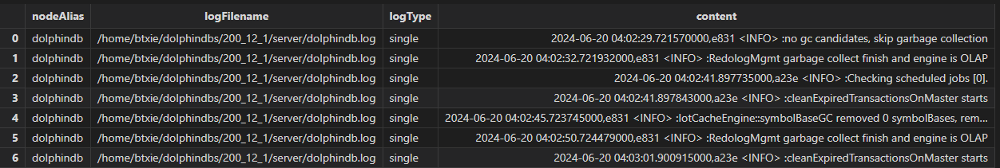

字段说明：

| 字段名 | 类型 | 说明 |
| --- | --- | --- |
| nodeAlias | STRING | * 批处理：日志文件名（不含时间戳和后缀） * 流处理： `getNodeAlias()` 返回的节点别名 |
| logFilename | STRING | 日志文件所在路径 |
| logType | SYMBOL | 日志类型：  * single：单节点日志 * controller：controller 日志 * datanode：datanode 日志 * computenode：computenode 日志 |
| content | BLOB | 原始日志内容 |

### 4.3 parseLog

解析读取的日志日志。 订阅 *originLogLinesTbName* 配置项指定名称的流表，调用全局配置字典配置的解析项目进行解析，然后输出到 *resultTbName* 指定名称的流表。详见《自定义解析项目》一节。

结果流表如下：

图 6. 图4-2 parseLog 结果流表部分截图

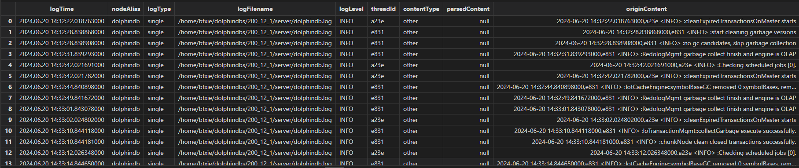

字段说明：

| 字段名 | 类型 | 说明 |
| --- | --- | --- |
| logTime | NANOTIMESTAMP | 日志时间戳 |
| nodeAlias | STRING | * 批处理：日志文件名（不含时间戳和后缀） * 流处理：getNodeAlias() 返回的节点别名 |
| logType | SYMBOL | 日志类型：  * single：单节点日志 * controller：controller 日志 * datanode：datanode 日志 * computenode：computenode 日志 |
| logFilename | STRING | 日志文件所在路径 |
| logLevel | SYMBOL | 日志等级：  * DEBUG * INFO * ERROR * WARNING |
| threadId | STRING | 打日志的线程的 ID |
| contentType | SYMBOL | 日志类型：  * transaction 开头：事务相关 * startup 开头：启动相关 * shutdown 开头：停止相关 |
| parsedContent | BLOB | 解析的日志内容，为 JSON 字符串 |
| originContent | BLOB | 原始日志内容 |

### 4.4 generateReport

根据解析日志结果生成报告表。 批处理模式下使用。 实现为运行 *reportGenerator/projects* 目录下所有与文件名同名的方法，详见《自定义解析项目》一节。

### 4.5 initAlertGenerator

订阅解析结果流表，在触发配置的告警规则时发送邮件到指定邮箱。 流处理模式下使用。 **注意需要邮箱开启 SMTP。** 详见《自定义告警规则和内容》一节。

### 4.6 clearEnv

根据全局配置字典的配置项，清理所有相关的流表、订阅和后台任务等，然后清理全局配置字典。

## 5.进阶使用

本章介绍日志分析工具的进阶使用，实现自定义的日志分析。

### 5.1自定义解析项目

logParser 目录结构如下：

```
.
├── logParser.dos
└── projects
    ├── controller
    │   └── parseTransactionsInfo.dos
    └── datanode
        └── parseTransactionsInfo.dos
```

其中，*logParser.dos* 包含入口方法 parseLog，该方法运行时，会加载 *logParser/projects/controller* 和 *logParser/projects/datanode* 目录下的所有模块文件，并运行与文件名同名的方法。

例如，对解析事务相关日志行的模块 *logParser/projects/controller/parseTransactionsInfo.dos*，会加载并运行其中定义的方法 `parseTransactionsInfo`，入参说明：

* logTime：日志时间戳
* logLevel：日志等级
* line：日志行原始内容。 建议指定为 mutable 以提高性能。
* s：dropna(s.split(" ")) 的值，用于提取信息。 建议指定为 mutable 以提高性能。

返回值：一个元组。

* 第一个元素为自定义类型字符串。
* 第二个元素为解析的信息的字典，可自定义字段。

例如：

```
module DDBLogAnalyser::logParser::projects::datanode::parseTransactionsInfo

def parseTransactionsInfo(logTime, logLevel, mutable line, mutable s) {
  contentType = "transactionCompleted"
  info = {"completedTime": logTime,"tid": getTid(s),"cid": getCid(s)}
  return (contentType, info)
}
```

注： 如果配置了 *logParserProjects*，需要添加新增的 “parseTransactionsInfo” 到 *logParserProjects* 配置项。

### 5.2自定义报告项目

logParser 目录结构如下：

```
.
├── projects
│   └── generateTransactionsReport.dos
└── reportGenerator.dos
```

其中，*reportGenerator.dos* 包含入口方法 `generateReport`，该方法运行时，会加载 *reportGenerator/projects* 目录下的所有模块文件，并运行与文件名同名的方法。

例如，对生成事务相关报表的模块 *reportGenerator/projects/generateTransactionsReport.dos*，会加载并运行其中定义的方法 `generateTransactionsReport`，无入参，无返回值。目前设计为自行在方法内 share 报表。

例如：

```
def generateTransactionsReport() {
    rolledBackTransactions = generateRolledBackTransactionsReport()
    if (!isVoid(rolledBackTransactions)) {
        share(rolledBackTransactions, "rolledBackTransactions")
    }
}
```

注： 如果配置了 *reportGeneratorProjects*，需要添加新增的 “generateTransactionsReport” 到 *reportGeneratorProjects* 配置项。

### 5.3自定义告警规则和内容

主要通过 *alertConfig* 配置项来配置告警相关规则，支持黑名单和白名单模式，支持自定义告警邮件标题和内容。 具体见配置项一节的 *alertConfig* 说明。

例如，通过自定义告警邮件内容包含"custom" 字符串：

```
def customGenerateEmailFunc(alertMsg) {
    h = "custom alert!\n"
    ret = exec string(originContent) from alertMsg
    ret = concat(ret, "\n")
    subject = "Custom alert from DolphinDB log analyser!"
    body = h + ret
    return (subject, body)
}

alertConfig = dict(STRING, ANY)
alertConfig["userId"] = "xxx@xxx.com" // 告警发送邮箱账号
alertConfig["pwd"] = "xxxxxx" // 告警发送邮箱密码
alertConfig["recipient"] = "xxx@xxx.com" // 告警接收人邮箱
alertConfig["logLevelFilter"] = ["DEBUG"] // 按日志等级过滤
alertConfig["whitelist"] = ["%whitelist error%"] // 用 like 和日志内容匹配，过滤需要的日志，优先生效
alertConfig["blacklist"] = ["%blacklist error%"] // 用 like 和日志内容匹配，过滤不要的日志，在白名单后生效
alertConfig["generateEmailBody"] = customGenerateEmailBody
config["alertConfig"] = alertConfig
```

图 7. 图 5-1 自定义告警邮件

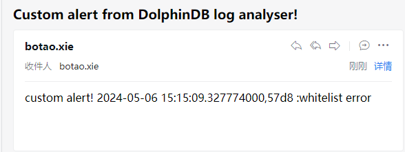

## 6.日志分析案例

本章介绍日志分析的常见案例。

### 6.1排查事物回滚的原因

当某个库表由于事务回滚而出现数据缺失时，需要排查事务回滚的具体原因，使用命令行工具逐个查找回滚事务相关日志效率比较低且可读性较差。 参照 2.1 节执行批处理流程，查看生成的回滚事务报告表 rollbackTransactionsReport 如下：

图 8. 图 6-1 回滚事务报告表部分截图

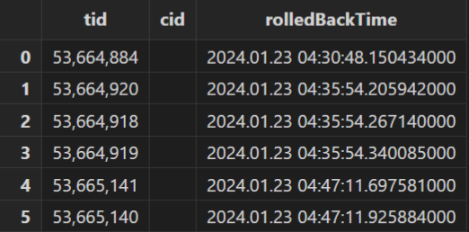

可见有 6 个事务回滚。 编写如下脚本遍历查询包含回滚事务 ID 的 ERROR 和 WARNING 日志并打印：

```
tids = exec tid from rolledBackTransactions
for (tid in tids) {
    pattern = "%" + tid + "%"
    info = select * from errors where originContent like pattern
    if(info.size() > 0)
        print("\nTransaction " + tid + " relative errors:\n", info["originContent"])
    info = select * from warnings where originContent like pattern
    if(info.size() > 0)
        print("\nTransaction " + tid + " relative warnings:", info["originContent"])
}
```

图 9. 图 6-2 回滚事务报告表部分截图

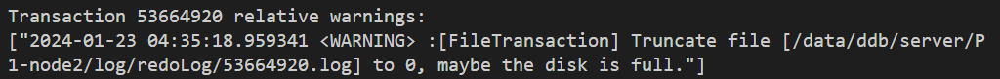

可见对 ID 为 53664920 的事务，有一个 WARNING 日志表明回滚原因可能为磁盘满。

### 6.2排查对分布式库表的写入数据量

例如对分布式表执行每日导入数据的任务，如果用户反馈某天导入的数据量不合预期，或者导入时间过长，可以使用日志分析工具分析对分布式表的写入数据量。参照 2.1 节执行批处理流程，生成事务操作报告表 transactionAuditReport 和事务信息日志 `transactionMetricsReport`，执行如下查询统计每天每小时的对指定库的 DDL 操作数：

```
select count(*) as DDLCount from transactionAuditReport where dbName
	= "dfs://TL_Level2_merged" group by dbName, date(logTime), hour(logTime)
	as date order by DDLCount desc
```

图 10. 图 6-3 统计每天每小时的对指定库的 DDL 操作数

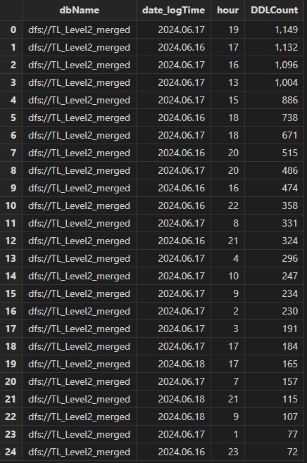

可见 16, 17 日对库 dfs://TL\_Level2\_merged 的 DDL 操作数远高于 18 日。

执行如下查询统计每天每小时的对指定库的写入分区数：

```
select sum(partitionCount) from transactionMetricsReport left join transactionAuditReport on
	transactionMetricsReport.tid == transactionAuditReport.tid where dbName =
	"dfs://TL_Level2_merged" group by dbName, date(startTime) as date,
	hour(startTime) as hour order by sum_partitionCount desc
```

图 11. 图 6-4 统计每天每小时的对指定库的写入分区数

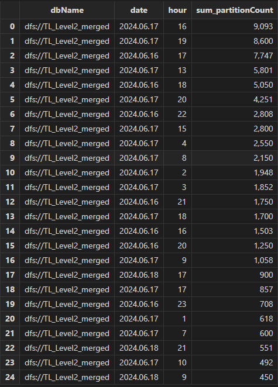

可见 16, 17 日对库 dfs://TL\_Level2\_merged 的写入分区数远高于 18 日。

综上可以确定具体的业务逻辑，是16, 17 日重复提交了一些导入任务，导致并发写入变慢。

### 6.3排查对分布式库表的误操作

注： 推荐配置 [DDL 操作日志](https://docs.dolphindb.cn/zh/db_distr_comp/cfg/function_configuration.html#topic_byd_23k_gcc)配置项来查看对分布式库表的所有事务操作，本节适用于未开启该配置项或 DDL 操作日志已被自动删除时分析。

用户可能对分布式库表存在误操作，例如不小心执行了两遍 `append!` 写入重复数据，或者不小心执行了 `delete` SQL 导致数据丢失。以排查重复写入为例，参照 2.1 节执行批处理流程，生成事务操作报告表 transactionAuditReport 如下：

图 12. 图 6-5 事务操作报告表部分截图

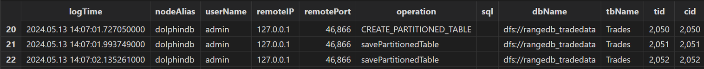

该表记录了所有用户对库表的写入事务操作记录，注意到存在两条对 dfs://rangedb\_tradedata 库的 Trades 表的 operation 为 savePartitionedTable 写入分布式表的记录，且 logTime 日志时间非常接近。 可结合 userName 用户名、remoteIP 客户端 IP 联系写入的用户，结合业务进一步确认是否为用户误操作导致重复写入。

### 6.4排查耗时过长的事务

当客户写入性能出现问题时，一般需要排查耗时过长的事务以及其写入的库表，然后结合具体业务代码分析。 参照 [2.1 节](#2.1%E6%89%B9%E9%87%8F%E5%88%86%E6%9E%90%E6%8C%87%E5%AE%9A%E6%96%87%E4%BB%B6%E5%A4%B9%E4%B8%8B%E7%9A%84%E6%97%A5%E5%BF%97)执行批处理流程，生成最长耗时事务报告表 longestTransactionsReport 如下：

图 13. 图 6-6 最长耗时事务报告表部分截图

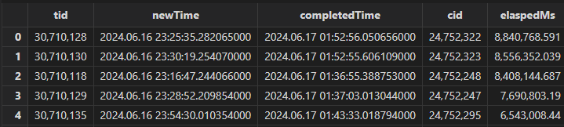

注意到事务 ID 为 30710128 的事务耗时最长，此时再查询 transactionAuditReport 表获得操作日志：

```
select * from transactionAuditReport where tid == 30710128
```

图 14. 图 6-7 事务操作报告表部分截图

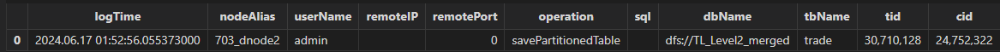

可见该事务 contentType 为 savePartitionedTable 即写入事务，此时可结合 logTime 日志时间、userName 用户名、remoteIP 客户端 IP 联系写入的用户，结合业务进一步确认写入方式和数据量是否合理。

### 6.5排查节点启动失败、停止失败和宕机的原因

当节点启动失败、停止失败或宕机时，一般需要排查问题发生前日志是否有 ERROR 或 WARNING。 使用批处理模式分析日志得到节点启动和停止报表 startupAndShutdownReport 如下：

图 15. 图 6-8 节点启动和停止报表部分截图

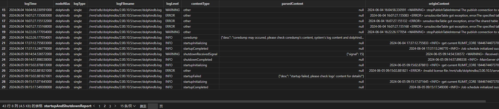

其中 contentType 含义：

* startupInitializing：启动节点开始。
* startupCompleted： 启动节点完成。
* startupFailed：**启动节点失败。** 该 contentType 的记录前会自动填充最近的 10 条 ERROR 和 WARNING 日志。
* shutdownReceivedSignal：节点收到 kill 信号。
* shutdownStarted：关闭节点开始。
* shutdownCompleted：关闭节点完成。
* shutdownFailed：**关闭节点失败。** 该 contentType 的记录前会自动填充最近的 10 条 ERROR 和 WARNING 日志。
* coredump：**节点可能发生 coredump 宕机。** 因为 coredump 并不会产生表明 coredump 的日志，该条记录为使用规则推理得到，需要根据是否产生 coredump 文件和操作系统日志（dmesg, /var/log/messages 等）来确定是否发生 coredump。 该 contentType 的记录前会自动填充最近的 10 条 ERROR 和 WARNING 日志。

注意到存在 contentType 为 coredump 的记录，检查 logTime 时间左右有对应 coredump 文件存在，需要进一步分析 coredump 堆栈内容和宕机前的动作确定原因。

注意到存在 contentType 为 startupFailed 的记录，查看之前的 ERROR 日志发现报错内容为 `Invalid license file`，检查 license 发现已过期。

### 6.6 统计用户登录情况

使用批处理模式分析日志得到登录报表 loginReport 如下：

图 16. 图 6-9 登录报表部分截图

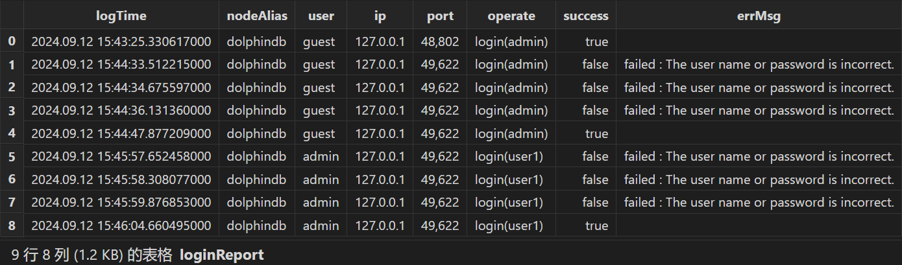

执行如下 SQL 统计每天各用户登录次数：

图 17. 图 6-10 每天各用户登录次数统计结果

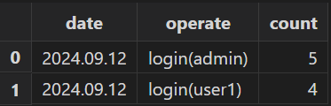

```
select count(*) from loginReport group by date(logTime) as date, operate
```

### 6.7 过滤相关日志

例如当客户的环境存在长期大量写入时，产生的大量事务日志可能干扰其他问题的排查，此时希望能过滤掉事务相关日志，可以直接对分析结果表执行查询，使用 like 方法过滤掉 contentType 为 transaction 开头的日志：

```
t = select * from logAnalysisResult where contentType not like "transaction%"
```

如果需要过滤其他类型的日志，可以参考《自定义解析项目》一节编写相关日志的解析脚本，然后使用同样的方法过滤。

### 6.8 生成日志分析每日报表

可以结合定时任务和 HttpClient 插件实现生成日志分析每日报表并发送到指定邮箱。 参考定时任务如下：

```
try { loadPlugin("HttpClient") } catch(err) { print(err) }
go

clearCachedModules()
go
use DDBLogAnalyser::config
use DDBLogAnalyser::logReader
use DDBLogAnalyser::logParser::logParser
use DDBLogAnalyser::reportGenerator::reportGenerator
use DDBLogAnalyser::alertGenerator
go

def analyseLogAndSend(userId, pwd, recipient) {
    clearEnv()
    go
    batchModeVersion = version()
    config = getExampleConfig(batchModeVersion)
    config["logDir"] = getLogDir()
    config["startTime"] = temporalAdd(now(), -24H)
    config["endTime"] = now()
    initConfig(config)
    go

    readLog()
    parseLog()
    generateReport() // 批处理用

    body = "<pre>"
    body += "ERROR logs: " + string(exec count(*)
    	from objByName("errors")) + "\n" + string(objByName("errors"))
    body += "\nWARNING logs: " + string(exec count(*)
    	from objByName("warnings")) + "\n" + string(objByName("warnings"))
    body += "</pre>"
    res = HttpClient::sendEmail(userId, pwd, recipient,
    	"log analyser report for " + string(today()), body);
    go

    clearEnv()
}

scheduleJob("analyseLogAndSend", "analyseLogAndSend",
	analyseLogAndSend{"xxxx@xxx.com", "xxxxxxxx", "xxxxx@xxx.com"},
	23:55m, today(), 2055.12.31, 'D')
```

该定时任务每天 23:55 执行，解析单节点的日志生成报表，发送 ERROR 和 WARNING 日志的统计信息到指定邮箱。

图 18. 图 6-11 每日报表部分截图

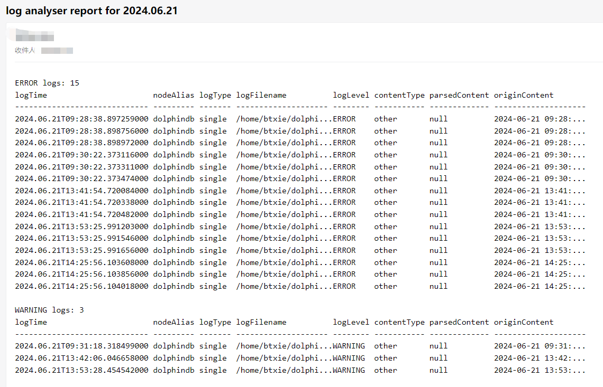

## 7.附录

[DDBLogAnalyser](script/log_analysis_tool_user_manual/DDBLogAnalyser.zip)

