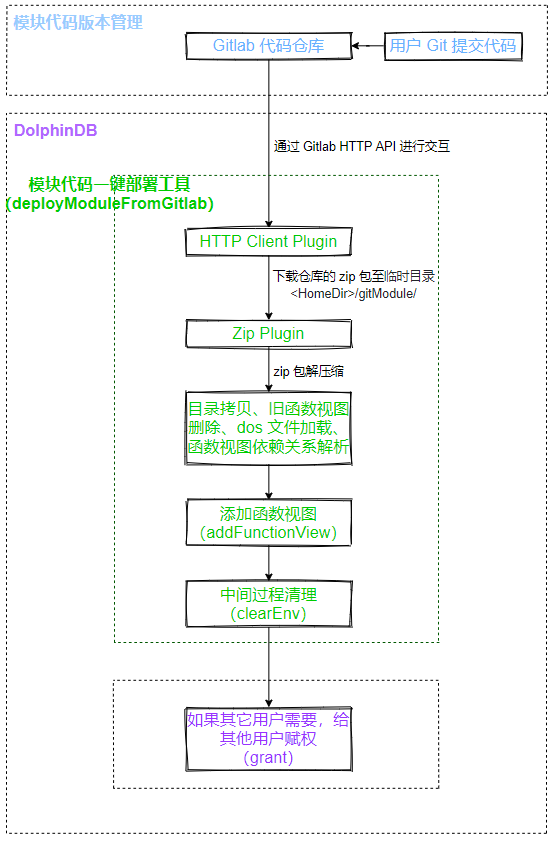
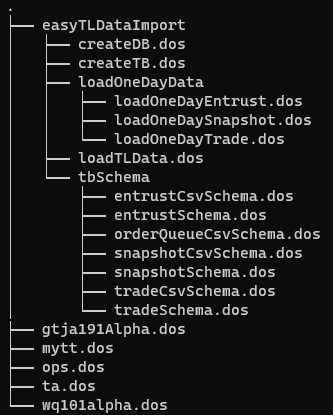
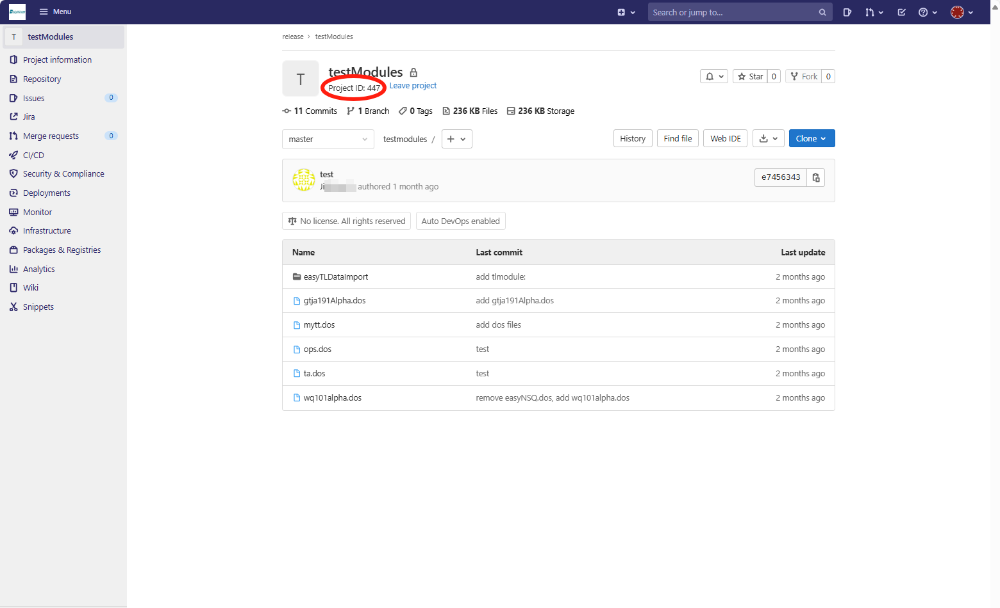
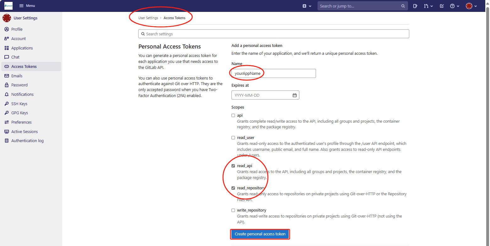
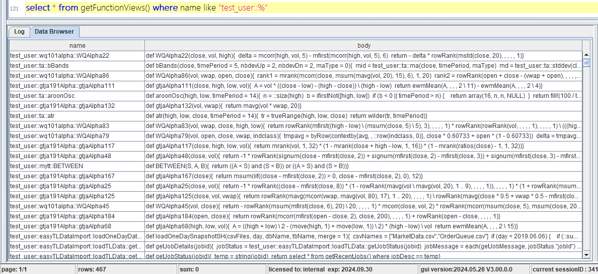

# DolphinDB 脚本工程化管理：模块代码版本与权限管理

在 DolphinDB 脚本开发过程中，为了提升代码复用性和组织性，我们可以创建可复用的模块来封装自定义函数。这些模块允许我们按照目录树结构将大量函数进行有序分类和存储。然而，DolphinDB 模块功能在权限管理和代码部署方面存在一些限制，比如模块本身并不支持权限管理。为了克服这些不便，本教程将介绍一种结合 GitLab 和 DolphinDB 函数视图的方法。通过这种方法，我们不仅可以实现函数的权限管理，还能利用 Git 进行代码的版本控制和协作开发。

本教程同时面向运维人员与业务人员，运维人员更多地关注第 2-3 章，业务人员更多地关注第 4-5 章。本教程假设用户已拥有了 Gitlab 代码仓库，且有一定的 Gitlab 与 Git 命令使用基础。本教程适用于 DolphinDB Server 2.00.11.5 及以上版本。

## 1 基础知识简介

本节将概述 DolphinDB 脚本开发中的基本概念和工具，包括模块和函数视图的定义和使用特点。这些概念对于开发和管理 DolphinDB 系统中的可复用代码和复杂查询逻辑十分重要。

### 1.1 模块

在使用 DolphinDB 脚本进行业务开发时，可以创建可复用模块（module），方便开发者使用。从名称来看，一个模块是后缀为 .dos 的文件；从内容来看，一个模块包含一个或多个自定义函数。

在开发人员使用模块时，有以下特点：

* 需要通过 DolphinDB GUI 或 VSCode Extension 客户端工具，将模块上传至 DolphinDB Server 指定目录。
* 不同数据节点或计算节点的模块是独立维护的。
* 模块本身不具有权限管理功能。

以上是与本教程有关的一些关键特点。更多关于模块的详细描述，请参考官网教程 [DolphinDB 模块](https://docs.dolphindb.cn/zh/tutorials/tu_modules.html)。

### 1.2 函数视图

函数视图（Function View）是数据库系统中的一种视图，主要用于定义复杂的查询和计算逻辑，通过 SQL 语句或内置函数生成计算结果。

在开发人员使用函数视图时，有以下特点：

* 通过任意客户端工具连接 DolphinDB Server 后，调用添加函数视图的接口即可添加，并且具有用户或用户组级别的权限管理功能。
* 函数视图序列化在控制节点，多个控制节点之间会自动同步。
* 函数视图具有用户或用户组级别权限管理的功能。

以上是与本教程有关的一些关键特点。更多关于函数视图的详细描述，请参考官网教程 [DolphinDB 函数视图](https://docs.dolphindb.cn/zh/db_distr_comp/db_oper/FunctionView.html)。

## 2 方案介绍

本节将介绍 DolphinDB 脚本管理过程中遇到的问题的解决方案。首先，我们将讨论当前问题的背景和原因，然后结合函数视图、模块和 GitLab 代码仓库给出解决这些问题的方法。

### 2.1 方案提出的背景

某公司以 DolphinDB 为技术基础，搭建了量化投研平台，为多个业务团队提供数据与计算服务。初期，业务团队选择使用模块进行业务开发，但随着业务团队和模块数量的增加，出现了一些问题：

* 尽管初期规划了不同业务团队使用不同的模块子目录，但仍有业务人员误将模块上传至其他团队子目录，导致混乱，并且同名模块会直接覆盖，影响其他团队的正常使用。
* 业务人员可以调用其他团队的模块，存在代码安全风险。
* 不同数据节点或计算节点的模块是独立维护的，如果需要在多个节点使用相同模块，需要联系运维人员进行拷贝操作。
* 业务人员重新上传模块后，需要联系运维人员清除旧的缓存，才能使用更新后的模块。

这些问题给业务人员和运维人员都造成了困扰。在这种背景下，如何有效解决这些问题，同时更好地为业务赋能、减轻运维负担，显得尤为重要。

### 2.2 方案设计

函数视图可以解决权限问题，也可以避免运维人员操作的麻烦，并且我们保留了模块作为中间桥梁，通过目录树结构进行有序分类存储和便捷的版本管理，这样创建的函数视图也更有层次性、组织性。与此同时，引入 GitLab 代码仓库，通过三者的有机结合，解决上述问题。

整个方案的技术框架如下图：



图2-1 模块代码版本与权限管理技术框架图

在框架图中，模块代码一键部署工具部分（绿色）为了简化业务人员使用，降低出错风险，已封装成一个函数视图（deployModuleFromGitLab）。运维人员部署该函数视图，并赋予业务人员执行权限。业务人员调用该函数视图，即可对 GitLab 中的模块代码进行一键部署。

## 3 一键部署工具初始化

本节将介绍如何初始化一键部署工具，确保所有依赖环境和配置到位，以便后续顺利使用。

### 3.1 依赖的环境与配置

**依赖一：httpClient 插件**

该插件非 server 安装包自带，须手动安装。在线安装方式如下：

```
login(`admin, yourAdminPwd) // 登录管理员账号
installPlugin("httpClient") // 通过插件市场安装在线安装
```

也可以通过插件市场手动下载并上传至服务器。

**依赖二：zip 插件**

该插件 server 安装包自带，无须安装。

**依赖三：配置 httpClient、zip 插件节点启动预加载**

如果为集群模式，控制节点、数据节点、计算节点均需配置：

```
preloadModules=plugins::httpClient,plugins::zip
```

**依赖四：允许管理员调用 shell 函数**

所有节点均需配置：

```
enableShellFunction=true
```

### 3.2 deployModuleFromGitLab 部署

在附件 gitModules.dos 文件中，更改您的管理员账号的登录密码，并全选执行，即可注册 `deployModuleFromGitLab` 函数视图。

我们将 `deployModuleFromGitLab` 的执行权限赋予 test\_user 用户，同时赋予该用户添加函数视图的权限，代码如下：

```
login(`admin, yourAdminPwd) // 登录管理员账号
grant("test_user", VIEW_EXEC, `deployModuleFromGitLab)
grant("test_user", VIEW_OWNER)
```

### 3.3 deployModuleFromGitLab 接口说明

函数语法：

```
deployModuleFromGitLab(gitLabSite, repoId, repoBranch, privateToken, timeout)
```

各个参数的的含义说明如下：

| **参数名称** | **参数含义** |
| --- | --- |
| gitLabSite | Gitlab 代码仓库的地址 |
| repoId | Gitlab 代码仓库的 Project ID |
| repoBranch | Gitlab 代码仓库的的分支名称，例如：master、dev |
| privateToken | 个人访问令牌 |
| timeout | 连接超时时间（单位：毫秒） |

## 4 一键部署工具规范化使用参考案例

本章节假设 demo 模块代码已经提交至 testModules 代码仓库。

本案例中 DolphinDB 用户名称为 test\_user，使用的模块代码见附件 demo.zip，demo 目录层级如下图所示。



图4-1 demo 目录层级图

**首先，如果为第一次部署某仓库模块代码，需要先获取该仓库的 Project ID 与生成个人访问 Token。**

获取 Project ID 的图例：



个人访问令牌可以在 User Settings → Access Tokens 中生成，如下图所示。更详细地，可以参考 Gitlab 官方 [Project access tokens](https://docs.gitlab.com/ee/user/project/settings/project_access_tokens.html) 。



**部署模块代码为函数视图。**

运行如下代码。用户使用时，需要根据注释进行修改。

```
login(`test_user, yourPwd)

gitLabSite = "https://dolphindb.net" // Gitlab 代码仓库的地址
repoId = 447 // Gitlab 代码仓库的 ID
repoBranch = "master" // 需要部署的分支名称
privateToken = "xxxxxxxxxxxx" // 填写实际的个人访问令牌
timeout = 1000000
deployModuleFromGitLab(gitLabSite, repoId, repoBranch, privateToken, timeout)
```

查看部署后的结果。



**如何使用以及给其他用户赋予某函数视图访问权限。**

使用某函数示例：

```
test_user::mytt::ABS(-123)
```

给其他用户赋权某函数使用权限：

```
grant(`test_user2, VIEW_EXEC, "test_user::mytt::ABS")
```

## 5 模块代码开发管理规范

为了保证一键部署工具的正常使用，制定了以下模块代码开发管理规范，**规范级别均为强制**。

### 5.1 模块定义规范

1. 模块声明时，第一层级必须为用户名称，该用户名称为 DolphinDB 中的用户名称。

   为什么要增加用户名称这样一个层级？因为模块中的每个函数最终会被添加为一个函数视图，这里的用户名称，也就是函数视图的拥有者（VIEW\_OWNER）。
2. 模块声明时使用 module 关键字，模块引用时使用 use 关键字，这两个关键字所在行的前面不能有空格。

   例子：期望创建一个 ta 模块，假如用户名称为 test\_user，那么模块名称为 test\_user::ta

   声明模块 test\_user::ta 通过以下脚本实现

   ```
   module test_user::ta
   ```

   引用模块 test\_user::ta 通过以下脚本实现

   ```
   use test_user::ops
   ```

### 5.2 模块依赖规范

模块之间可以单向引用，不支持交叉引用。

例子：

模块 test\_user::ta 中的部分内容：

```
module test_user::ta
use test_user::ops

//此处省略了函数定义
```

模块 test\_user::ops 中的部分内容：

```
module test_user::ops
use test_user::mytt

//此处省略了函数定义
```

以上代码示例中，ta 引用了 ops，ops 引用了 mytt，是一种单向引用。

### 5.3 文件命名规范

模块名称和所对应的 dos 文件名称必须严格一致。

例子：模块名称为 test\_user::ta 所对应的 dos 文件名称必须为 ta.dos。

### 5.4 目录层级规范

模块名称和所对应的目录层级必须严格一致。

例子：假如 Gitlab 代码仓库名称为 testModules，那么名称为 test\_user::easyTLDataImport::createDB 的模块所对应的目录层级必须为 testModules/easyTLDataImport/createDB.dos。

## 6 常见问题与解决方法

本节列举了一些常见问题，并给出了对应的解决方法。

**错误信息 01**：No access to view deployModuleFromGitLab.

原因：当前用户没有 `deployModuleFromGitLab` 函数视图的执行权限。

解决方法：请联系运维人员（管理员）申请权限。运维人员（管理员）赋权方法参考第3.2节。

**错误信息 02**：Only administrators or user with VIEW\_OWNER permission can execute function addFunctionView.

原因：当前用户没有添加函数视图（VIEW\_OWNER ）的权限。

原因：请联系运维人员（管理员）申请权限。运维人员（管理员）赋权方法参考第3.2节。

**错误信息 03**：404 Project Not Found.

原因：Gitlab 代码仓库的 Project ID 不正确。

解决方法：如何获取 Project ID，请参考第4章。

**错误信息 04**：401 Unauthorized.

原因：当前用户 access token 不正确。

解决方法：如何获取 access token，请参考第4章。

**错误信息 05**：The user name or password is incorrect.

原因：`deployModuleFromGitLab` 函数视图中的账号或密码不正确。

解决方法：请联系运维人员（管理员）确认`deployModuleFromGitLab` 函数视图中的账号密码的正确性。

**错误信息 06**：curl returns: Couldn't resolve host. 或者 curl returns: Failed to connect to xxx port xxx: Connection refused/No route to host.

原因：Gitlab 代码仓库域名不正确或者网络存在问题。

解决方法：请联系 IT 部门进行检查。

**错误信息 07**：Cannot open "xxxx.zip" as zip file.

原因：访问了错误的网站，下载了错误的文件。

解决方法：请检查 Gitlab 代码仓库域名是否正确。

**错误信息 08**：The input function view must be a user defined function.

原因：DolphinDB server 版本低于 2.00.11。

解决方法：请联系运维人员（管理员）升级至最新的稳定版本。

**错误信息 09**：Can't find module.

可能原因及对应的解决方法：

1. 引用了不存在的模块名称，请引用正确的模块名称。
2. 模块名称与文件名称不一致，请参考第5章更正。
3. 模块名称与目录层级不一致，请参考第5章更正。

## 7 总结

随着 DolphinDB 作为一个平台使用的场景越来越多，业务人员所开发的代码也越来越多，如何高效、规范、安全地管理模块代码越发重要。本教程所介绍的模块代码版本与权限管理方案，是深入了解客户代码开发场景后的沉淀，具有较深的工程化意义。

## 附件

[gitModule.dos](script/module_code_versioning_and_rights_management/gitModule.dos)

[demo.zip](script/module_code_versioning_and_rights_management/demo.zip)

