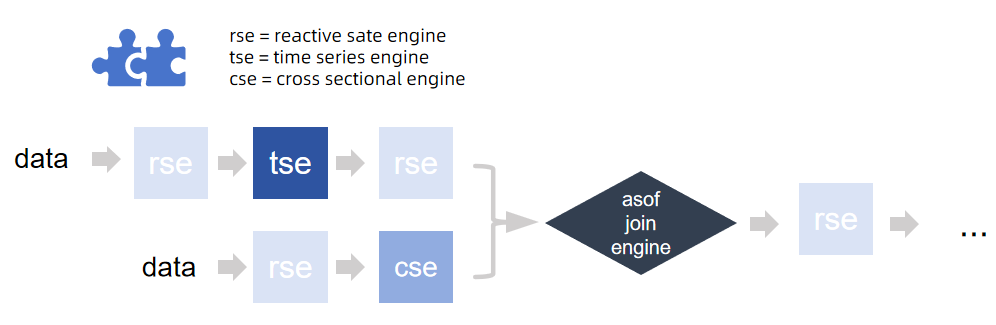
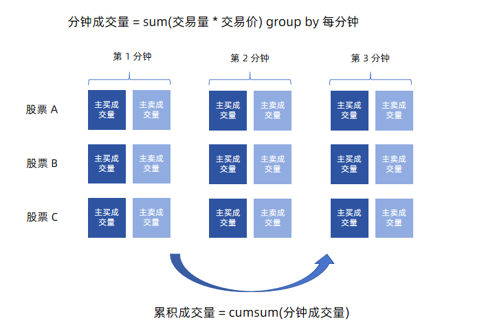
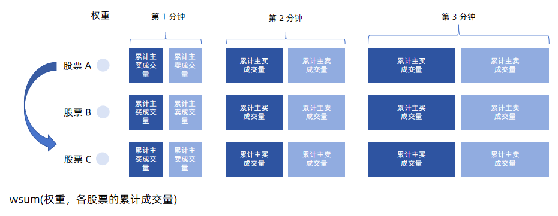
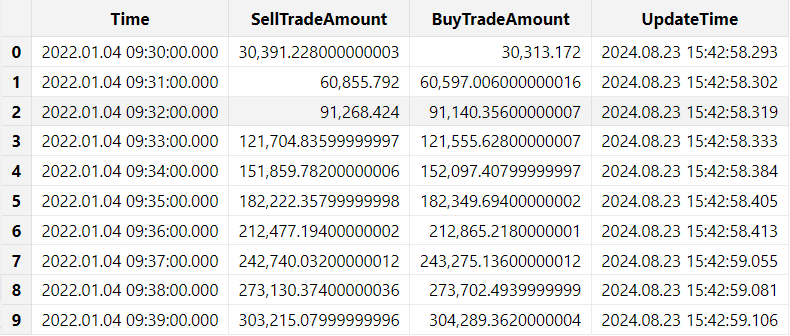

# 阻塞进程使订阅持续进行
Event().wait()
```

流数据回放模拟：提交一个历史数据回放的后台任务模拟流数据回放

```
submitJob("replay", "mockRealTimeData", replay{inputTables=ds, outputTables=streamTbName, dateColumn="TradeDate", timeColumn="TradeTime", replayRate=100000, absoluteRate=true})
getRecentJobs(1)
```

可以通过 `getRecentJobs`
函数查看当前回放任务是否结束，回放结束后，可以在指定目录查看文件是否成功导出。

### 7.3 流计算引擎

在 DolphinDB 处理流数据有天然优势，这是因为 DolphinDB
内置了处理不同逻辑场景的流计算引擎，即使是复杂的因子计算逻辑，也可以通过逻辑拆分交给不同的引擎去实现，通过引擎的级联实现流水线式的计算。且 DolphinDB
的内置引擎支持的算子经过了算法上的优化，计算性能高效。用户使用时仅需要对引擎参数进行配置，即可实现复杂逻辑，节省了用户自己开发算法逻辑的成本。



根据各自适用的逻辑和场景，DolphinDB 内置的流计算引擎可以分为以下几类：

表 7-3-1 不同流计算场景下适用的引擎及其计算逻辑

| **接入数据源** | **场景** | **引擎** | **类比批计算逻辑** |
| --- | --- | --- | --- |
| 单流 | 时序窗口聚合计算 | createTimeSeriesEngine | group by + interval/bar/dailyAlignedBar |
| createDailyTimeSeriesEngine |
| 涉及历史状态的计算 | createReactiveStateEngine | **状态函数：**  mfunc, tmfunc, cumfunc, rowfunc, prev/move/deltas…  **无状态函数：**  rowFunc, 四则运算… |
| createNarrowReactiveStateEngine |
| createDualOwnershipReactiveStateEngine |
| createReactiveStatelessEngine | 类似 excel 单元格关联 |
| 截面计算 | createCrossSectionalEngine | pivot by |
| 会话窗口计算 | createSessionWindowEngine | sessionWindow |
| 异常检测、风控 | createAnomalyDetectionEngine | iif |
| createRuleEngine |
| 基础算子计算，通过GPU 加速 | createDeviceEngine | / |
| 快照合成 | createOrderBookSnapshotEngine | / |
| 复杂事件处理引擎 | createCEPEngine | / |
| 数据分发、广播 | createStreamBroadcastEngine | 同一张流表复制多路广播 |
| createStreamDispatchEngine | 同一张流表拆分后，分发给多个引擎并行计算 |
| 双流 | 等值连接：左右表互相匹配连接列和时间列都相等的数据 | createEquiJoinEngine | equi join (ej) |
| 左连接：按连接列分组，左表就近匹配右表时间列进行连接 | createAsofJoinEngine | asof join (aj) |
| 左连接：左边按连接列等值匹配右表数据，多条匹配可以选择保留最新还是最就的一条 | createLeftSemiJoinEngine | lsj (多条匹配仅取第一条) |
| 左连接：按连接列分组，左表时间列确立一个窗口，匹配右表在该窗口中的数据 | createWindowJoinEngine | window join (wj) |
| 左连接：适用于右表不频繁更新的场景（通常是维度表），左表按连接列等值匹配右表 | createLookupJoinEngine | left join (lj) |

**例.** 流式计算主买/主卖交易量（示例代码参考：[流式计算中证
1000 指数主买/主卖交易量](CSI_1000.md)）

计算公式：主买/主卖交易量 = Σ(交易价格\*交易量\*权重因子)

拆分计算逻辑，得到的计算流程为：

（1）计算每分钟的成交量（按照股票分组）→ 时序聚合引擎

（2）按分钟累计成交量（按照股票分组） → 响应式状态引擎

（3）对股票成交量进行加权求和计算交易量 → 横截面引擎




在运行脚本前，可以先清理环境中的变量，并初始化定义一些公共变量：

```
undef all
go

dbName = "dfs://stock_trade"
tbName = "trade"
streamTbName = "trade_st"

try{unsubscribeTable(tableName=streamTbName, actionName="act_tsEngine")}catch(ex){print(ex)}
try{dropStreamEngine("rsEngine")}catch(ex){print(ex)}
try{dropStreamEngine("tsEngine")}catch(ex){print(ex)}
try{dropStreamEngine("csEngine")}catch(ex){print(ex)}
```

定义一个持久化流表 trade\_st 用于接收实时的逐笔成交数据。

```
colName=loadTable(dbName, tbName).schema().colDefs.name
colType=loadTable(dbName, tbName).schema().colDefs.typeString
t = streamTable(100:0, colName, colType);

try{
    enableTableShareAndPersistence(table=t, tableName=streamTbName, asynWrite=true, compress=true, cacheSize=100000, retentionMinutes=1440, flushMode=0, preCache=10000)
}
catch(ex){
    print(ex)
}

undef("t")
go
```

模拟创建成分股权重因子。

```
sids = exec distinct SecurityID from loadTable(dbName, tbName)
def createWeightDict(sids){

	return dict(sids, take(0.001, sids.size()))
}

weightDict = createWeightDict(sids)
```

模拟创建成分股权重因子。

```
// 输入表结构定义
tsEngineDummy = table(1:0, `SecurityID`TradeTime`TradePrice`TradeQty`TradeBSFlag, [SYMBOL, TIMESTAMP, DOUBLE, INT, SYMBOL])
rsEngineDummy = table(1:0, `TradeTime`SecurityID`SellTradeAmount`BuyTradeAmount, [TIMESTAMP, SYMBOL, DOUBLE, DOUBLE])
csEngineDummy = table(1:0, `SecurityID`TradeTime`SellTradeAmount`BuyTradeAmount, [SYMBOL, TIMESTAMP, DOUBLE, DOUBLE])

//创建存储结果的表
share(keyedTable(`Time, 2000:0, `Time`SellTradeAmount`BuyTradeAmount`UpdateTime, [TIMESTAMP, DOUBLE, DOUBLE, TIMESTAMP]), "tradeAmountIndex")
go
```

定义流计算引擎。由于引擎是通过输出表设置为下一个引擎，来进行级联的，为保证脚本正常解析，引擎定义的顺序和业务数据流的逻辑是相反的。如本例中计算逻辑是 时序引擎 →
响应式状态引擎 → 横截面引擎，脚本中定义顺序则相反：

```
//创建横截面引擎
csEngine = createCrossSectionalEngine(name="csEngine", metrics=<[wsum(SellTradeAmount, weightDict[SecurityID]), wsum(BuyTradeAmount, weightDict[SecurityID]), now()]>, dummyTable=csEngineDummy, outputTable=objByName("tradeAmountIndex"), keyColumn=`SecurityID, triggeringPattern="keyCount",  triggeringInterval=1000, useSystemTime=false, timeColumn=`TradeTime, lastBatchOnly=false)

//创建响应式状态引擎
rsEngine = createReactiveStateEngine(name="rsEngine", metrics=<[cummax(TradeTime), cumsum(SellTradeAmount), cumsum(BuyTradeAmount)]>, dummyTable=rsEngineDummy, outputTable=csEngine, keyColumn=`SecurityID)

//创建时间序列引擎
tsEngine = createTimeSeriesEngine(name="tsEngine", windowSize=60000, step=60000, metrics=<[sum(iif(TradeBSFlag=="S", 1, 0)*TradeQty*TradePrice), sum(iif(TradeBSFlag=="B", 1, 0)*TradeQty*TradePrice)]>, dummyTable=tsEngineDummy, outputTable=rsEngine, timeColumn=`TradeTime, keyColumn=`SecurityID, useWindowStartTime=true,  fill=[0, 0], forceTriggerTime=100)
```

订阅逐笔数据表，写入引擎流水线的第一个引擎：时序聚合引擎。

本例自定义了一个流数据处理函数 `streamHandler`，可以通过修改内部逻辑自定义数据处理方案。

```
// handler 数据处理函数
def streamHandler(mutable engine, msg){
    data = select SecurityID, concatDateTime(TradeDate, TradeTime) as TradeTime, TradePrice, TradeQty, TradeBSFlag from msg
    engine.append!(data)
}

// 订阅流数据表
subscribeTable(tableName=streamTbName, actionName="act_tsEngine", offset=0, handler=streamHandler{tsEngine}, msgAsTable=true, batchSize=10000, throttle=0.001)
```

通过 `replayDS` 函数获取历史数据源，然后借助 `replay`
函数模拟流数据回放过程。

```
// 后台提交数据回放任务，模拟实时数据注入
// 本例设置 timeRepartitionSchema 将数据源按照 15min 进行切片，这是为了保证回放时数据不会 OOM
ds = replayDS(<select * from loadTable(dbName, tbName)>, dateColumn="TradeDate", timeColumn="TradeTime", timeRepartitionSchema=09:30:00.000 + 15*1000*60*(0..22))

submitJob("relay", "replay to trade", replay{inputTables=ds, outputTables=streamTbName, dateColumn="TradeDate", timeColumn="TradeTime", replayRate=10000000, absoluteRate=true})
getRecentJobs(1)
```

回放进程可以通过函数 `getRecentJobs` 进程查询。

通过 SQL 查询输出的结果表：

```
select * from tradeAmountIndex limit 10
```



为了新用户能够更好理解引擎的计算，我们仔细观察三个计算引擎的流计算指标。

* 时序聚合引擎

  ```
  <[sum(iif(TradeBSFlag=="S", 1, 0)*TradeQty*TradePrice),
  sum(iif(TradeBSFlag=="B", 1, 0)*TradeQty*TradePrice)]>
  ```

* 响应式状态引擎

```
<[cummax(TradeTime), cumsum(SellTradeAmount), cumsum(BuyTradeAmount)]>
```

* 横截面引擎

```
<[wsum(SellTradeAmount, weightDict[SecurityID]), wsum(BuyTradeAmount, weightDict[SecurityID]), now()]>
```

将上述流计算脚本转换为 SQL 批计算逻辑，可改写如下：

从分布式表中筛选一部分字段进行计算：

```
data = select SecurityID, concatDateTime(TradeDate, TradeTime) as TradeTime, TradePrice, TradeQty, TradeBSFlag from loadTable(dbName, tbName)
```

注： 如果此脚本读取的数据量太大造成内存溢出，可以加上 limit 或 top
子句筛选一部分数据进行计算验证结果。

* 按时间进行分钟聚合（时序聚合）

```
t1 = select sum(iif(TradeBSFlag=="S", 1, 0)*TradeQty*TradePrice) as SellTradeAmount,
            sum(iif(TradeBSFlag=="B", 1, 0)*TradeQty*TradePrice) as BuyTradeAmount
    from data group by SecurityID, interval(TradeTime, 1m, 0) as TradeTime
```

* 累积计算成交量（状态计算）

```
t2 = select SecurityID, cummax(TradeTime) as Time,
            cumsum(SellTradeAmount) as SellTradeAmount,
            cumsum(BuyTradeAmount) as BuyTradeAmount
     from t1 context by SecurityID
```

* 按股票因子加权计算成交量（截面计算）

```
t3 = select wsum(SellTradeAmount, weightDict[SecurityID]) as SellTradeAmount,
            wsum(BuyTradeAmount, weightDict[SecurityID]) as BuyTradeAmount
     from t2 group by Time
```

对比批计算和流计算的脚本，可以发现不论是引擎的算子还是 SQL select 的计算主体，本质上都使用了一套函数去实现，这体现了 DolphinDB
流批一体的计算特点。

### 7.4 常见问题

1. 流表数据是否支持部分记录的更新和删除？

   不支持。流表记录只能追加，一旦追加后就不能更新和删除。

   特殊地，对于键值流表（keyedStreamTable
   和 latestKeyedStreamTable），系统支持在数据写入流表前，进行键值检查，以选择数据是追加还是丢弃。
2. 流表数据量大，内存占用不够怎么解决?

   可以将流表通过 `enableTablePersistence` 函数或者
   `enableTableShareAndPersistence`
   函数进行持久化，系统会将一部分数据持久化存储到磁盘指定目录（通过配置参数 [persistenceDir](../db_distr_comp/cfg/function_configuration.md) 设置）。
3. 如何配置重启后自动加载订阅流表?

   将流数据表定义和流表订阅操作放在启动脚本 startup.dos （通过配置参数 [startup](../db_distr_comp/cfg/standalone.md)
   设置）内，这样节点重启后可以自动加载订阅流表。详情参考教程 [启动脚本](Startup.md) 和 [节点启动时的流计算自动订阅](streaming_auto_sub.md)。
4. 流表如何进行删除？一直无法删除如何解决？

   流表需要通过函数 `dropStreamTable` 进行删除，而不是通过 `undef(`st,
   SHARED)` 进行删除。

   如果流表一直无法删除，请通过 `getStreamingStat`
   函数查看当前流表上是否存在未取消的订阅，只有订阅全被取消后（取消订阅函数
   `unsubscribeTable`），才能删除流表。
5. 如何配置定期删除持久化流表持久化的数据？

   用户可以在通过 `enableTablePersistence` 函数或者
   `enableTableShareAndPersistence` 函数持久化流表时，设置
   *retentionMinutes* 参数，定期删除持久化的数据。
6. 如何查询当前流表是否存在？

   可以通过函数 existsStreamTable 查看指定流数据表是否存在。

   需要注意，用户常会误用 defined 函数进行判断，但是该函数对于共享内存表也会返回 true。
7. 流订阅或流计算异常如何排查？

   函数 `getStreamingStat` 返回了流订阅发布的详细信息，其中比较常用的信息有：

   * 通过 subWorkers 表的 lastErrMsg 字段可以排查订阅中是否存在异常；
   * 通过 pubConns 表和 subWorkers 表中的 queueDepth 字段可以排查订阅是否阻塞；

通过函数 `getStreamEngineStat` 排查流计算引擎的状态。

### 7.5 下一步阅读

官方文档 [流数据](../stream/str_intro.md)
整理了一些流计算相关的文档和教程说明，此处仅列举部分：

* 流数据架构：[流数据功能简介](../stream/str_funcs.md)
  [流数据表](../stream/str_table.md)
  [发布与订阅](../stream/sub_pub.md)
* 流计算引擎：[内置流式计算引擎](../funcs/themes/streamingEngine.md)
  [内置多数据源流式关联引擎](../stream/str_join_engine.md)
* 流数据接入：[Python API 接入数据](../stream/str_api_python.md)
  [行情数据插件：NSQ](../plugins/nsq/nsq.md)
* 数据回放：[股票行情回放](stock_market_replay.md)
* 流批一体：[流批一体](../stream/str_batch.md)
  [快速搭建 Level-2
  快照数据流批一体因子计算平台最佳实践](l2_snapshot_factor_calc.md)
* 场景案例：[金融实时实际波动率预测](ml_volatility.md)
  [实时计算日累计逐单资金流](streaming_capital_flow_daily.md)
  [实时计算分钟资金流](streaming_capital_flow_order_by_order.md)
  [实时选取外汇行情多价源最优价](best_price_selection.md)
  金[融因子流式实现](str_comp_fin_quant.html#%E9%87%91%E8%9E%8D%E5%9B%A0%E5%AD%90%E6%B5%81%E5%BC%8F%E5%AE%9E%E7%8E%B0)
* 可视化展示：[数据面板](dashboard_tutorial.md)
  [Altair 连接 DolphinDB 数据源](../stream/str_altair.md)
  [DolphinDB Grafana
  DataSource Plugin](../tools/grafana.md)

## 8. 附录

各章节对应的脚本代码如下：

[3.3建库建表.dos](script/new_users_finance/3.3%E5%BB%BA%E5%BA%93%E5%BB%BA%E8%A1%A8.dos)

[4.2.1导入一年快照数据.dos](script/new_users_finance/4.2.1%E5%AF%BC%E5%85%A5%E4%B8%80%E5%B9%B4%E5%BF%AB%E7%85%A7%E6%95%B0%E6%8D%AE.dos)

[4.2.2导入一天快照数据.dos](script/new_users_finance/4.2.2%E5%AF%BC%E5%85%A5%E4%B8%80%E5%A4%A9%E5%BF%AB%E7%85%A7%E6%95%B0%E6%8D%AE.dos)

[4.2.3导入逐笔成交数据.dos](script/new_users_finance/4.2.3%E5%AF%BC%E5%85%A5%E9%80%90%E7%AC%94%E6%88%90%E4%BA%A4%E6%95%B0%E6%8D%AE.dos)

[4.3.1场景一.dos](script/new_users_finance/4.3.1%E5%9C%BA%E6%99%AF%E4%B8%80.dos)

[4.3.1场景二.dos](script/new_users_finance/4.3.1%E5%9C%BA%E6%99%AF%E4%BA%8C.dos)

[4.3.2场景一.dos](script/new_users_finance/4.3.2%E5%9C%BA%E6%99%AF%E4%B8%80.dos)

[4.3.2场景二.dos](script/new_users_finance/4.3.2%E5%9C%BA%E6%99%AF%E4%BA%8C.dos)

[4.3.3 中文导入.dos](script/new_users_finance/4.3.3%20%E4%B8%AD%E6%96%87%E5%AF%BC%E5%85%A5.dos)

[5.数据表操作.dos](script/new_users_finance/5.%E6%95%B0%E6%8D%AE%E8%A1%A8%E6%93%8D%E4%BD%9C.dos)

[5.3.3 场景一\_删除单分区.dos](script/new_users_finance/5.3.3%20%E5%9C%BA%E6%99%AF%E4%B8%80_%E5%88%A0%E9%99%A4%E5%8D%95%E5%88%86%E5%8C%BA.dos)

[5.3.3 场景二\_删除全表.dos](script/new_users_finance/5.3.3%20%E5%9C%BA%E6%99%AF%E4%BA%8C_%E5%88%A0%E9%99%A4%E5%85%A8%E8%A1%A8.dos)

[5.3.3 场景三\_删除重复数据.dos](script/new_users_finance/5.3.3%20%E5%9C%BA%E6%99%AF%E4%B8%89_%E5%88%A0%E9%99%A4%E9%87%8D%E5%A4%8D%E6%95%B0%E6%8D%AE.dos)

[6.SQL批计算.dos](script/new_users_finance/6.SQL%E6%89%B9%E8%AE%A1%E7%AE%97.dos)

[7.2.2\_流数据发布\_例1\_数据回放.dos](script/new_users_finance/7.2.2_%E6%B5%81%E6%95%B0%E6%8D%AE%E5%8F%91%E5%B8%83_%E4%BE%8B1_%E6%95%B0%E6%8D%AE%E5%9B%9E%E6%94%BE.dos)

[7.2.2\_流数据发布\_例2\_API写入流表.py](script/new_users_finance/7.2.2_%E6%B5%81%E6%95%B0%E6%8D%AE%E5%8F%91%E5%B8%83_%E4%BE%8B2_API%E5%86%99%E5%85%A5%E6%B5%81%E8%A1%A8.py)

[7.2.2\_流数据发布\_例3\_Kafka订阅写入流表.py](script/new_users_finance/7.2.2_%E6%B5%81%E6%95%B0%E6%8D%AE%E5%8F%91%E5%B8%83_%E4%BE%8B3_Kafka%E8%AE%A2%E9%98%85%E5%86%99%E5%85%A5%E6%B5%81%E8%A1%A8.py)

[7.2.2\_流数据订阅\_例1\_订阅入库.dos](script/new_users_finance/7.2.2_%E6%B5%81%E6%95%B0%E6%8D%AE%E8%AE%A2%E9%98%85_%E4%BE%8B1_%E8%AE%A2%E9%98%85%E5%85%A5%E5%BA%93.dos)

[7.2.2\_流数据订阅\_例2\_API 端订阅流表计算.dos](script/new_users_finance/7.2.2_%E6%B5%81%E6%95%B0%E6%8D%AE%E8%AE%A2%E9%98%85_%E4%BE%8B2_API%20%E7%AB%AF%E8%AE%A2%E9%98%85%E6%B5%81%E8%A1%A8%E8%AE%A1%E7%AE%97.dos)

[7.2.2\_流数据订阅\_例2\_订阅流表计算.py](script/new_users_finance/7.2.2_%E6%B5%81%E6%95%B0%E6%8D%AE%E8%AE%A2%E9%98%85_%E4%BE%8B2_%E8%AE%A2%E9%98%85%E6%B5%81%E8%A1%A8%E8%AE%A1%E7%AE%97.py)

[7.3引擎级联.dos](script/new_users_finance/7.3%E5%BC%95%E6%93%8E%E7%BA%A7%E8%81%94.dos)

