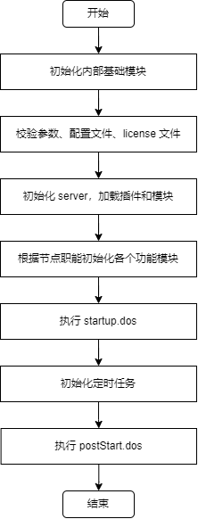
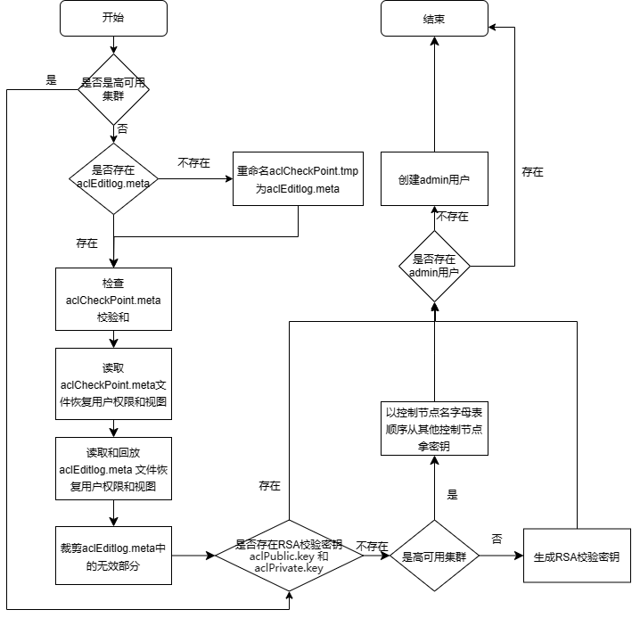
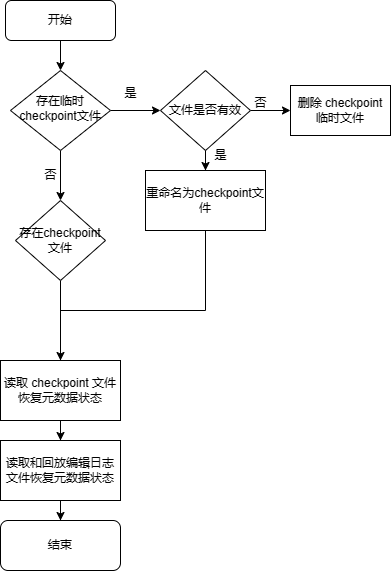
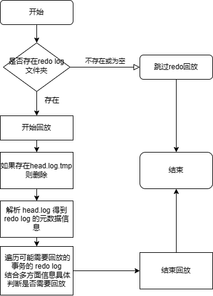

# 节点启动流程简析与常见问题

DolphinDB 的重启是运维工作的重要部分，在启动节点时可能会遇到一些问题，例如启动太慢、启动失败等。本教程以 DolphinDB v2.00.11 版本为例，结合运行日志简析 DolphinDB 整体的启动流程和重要模块的启动流程，并分析启动时常见问题的现象、原因和解决方案。

## 1. 节点整体启动流程

DolphinDB 节点整体的启动流程可分为 7 个阶段：

1. 初始化内部基础模块；
2. 解析和校验参数、配置文件、license 文件，并初始化和启动一些基本功能模块和线程；
3. 根据加载的配置文件内容初始化 server，执行 *dolphindb.dos*，加载 preloadModules 配置的插件和模块；
4. 初始化和启动 server 的各个功能模块和线程，绑定端口。包括用户权限与函数视图初始化、元数据初始化、事务回滚、redo log 回放、RAFT 初始化等；
5. 执行 [startup 配置项](https://docs.dolphindb.cn/zh/db_distr_comp/cfg/standalone.html?hl=startup#ariaid-title4)指定的 *startup.dos* 脚本；
6. 初始化定时任务；
7. 执行 [postStart 配置项](https://docs.dolphindb.cn/zh/db_distr_comp/cfg/standalone.html?hl=postStart#ariaid-title4)指定的 *postStart.dos* 脚本。

其中第 4 步，不同节点会根据自己的职能初始化和启动相应功能的模块和线程。例如单节点和控制节点会启动 DFS 模块来管理分布式文件元数据，而数据节点不会启动；单节点和数据节点会启动 ChunkNode 模块来存储和管理分区数据，而控制节点不会启动。



重要启动流程开始和成功日志如下表：

| **流程** | **开始日志** | **成功日志** | **备注** |
| --- | --- | --- | --- |
| 用户权限与函数视图初始化 | `Initializing AclManager with Raft <raft mode>` | `Initialization of AclManager is completed with Raft <raft mode>` | RAFT mode 为 enabled 或 disabled |
| 控制节点元数据初始化 |  | 非 RAFT 模式：`Controller initialization completed.`RAFT 模式：`DFSRaftReplayWorker started` |  |
| 数据节点分区元数据初始化 |  | `ChunkMgmt initialization completed.` |  |
| 数据节点恢复事务的重做日志回放 | `dfsRecoverLogDir: <dfsRedoLogDir>` | `RecoverRedoLogManager finished chunk num is <finishPacksSize>, total chunks recover num is <lsnChunksSize>, compare checksum succ pack num is <recoverChecksumPackNum>, test replay num is <recoverTestPackNum>, actual recover redo pack num is <recoverReplayPackNum>, redo chunk num is <recoverReplayNum>` |  |
| 数据节点 TSDB 元数据初始化 |  | `Restore TSDB meta successfuly.` |  |
| redo log 回放 | 若存在 redo log：`Start recovering from redo log. This may take a few minutes.` | 若存在 redo log：`Completed CacheEngine GC and RedoLog GC after applying all redo logs and engine is <engine type>`若不存在 redo log：`No available redo log files were found. Redo log replay was skipped.` | engine type 为 OLAP 或 TSDB，故如果为 DolphinDB 2.0 版本，相应日志会有两条 |
| RAFT 初始化 | `DFSMaster ElectionTick is set to <electionTick>` | `DFSRaftReplayWorker started` |  |
| 执行 *startup.dos* | `Executing the startup script: <scriptFile>` | `The startup script: <scriptFile> execution completed.` |  |
| 定时任务初始化 | `Job scheduler start to initialize.` | `Job scheduler initialization completed.` |  |
| 执行 *postStart.dos* | `Executing the post start script: <scriptFile>` | `The post start script: <scriptFile> execution completed.` |  |

Redo log 回放完成后，数据节点会向控制节点汇报本地分区信息，然后启动心跳进程，此时节点在 web 集群管理界面的状态会转变为绿色，但还没有到“执行 *startup.dos*”一步。由于执行 *postStart.dos* 失败并不会导致节点启动失败，故**节点启动完成的标志日志**为 `Job scheduler initialization completed.`

## 2. 重要启动流程简析

### 2.1. license 校验

DolphinDB 启动时会先校验 license 与集群配置信息是否合规。如果启用了 license server，则连接 license server 进行校验，否则读取安装目录下 *dolphindb.lic* 文件进行校验。校验内容包括：

* 过期时间
* 每个节点绑定的核数
* 每个节点的最大内存
* 集群内最大节点数
* 最高支持的 server 版本

如果校验失败，会打印相应的错误日志然后节点关闭。例如 license 过期时会打印错误日志 `<ERROR> The license has expired.`

### 2.2. 用户权限与函数视图初始化

DolphinDB 的[权限管理](https://docs.dolphindb.cn/zh/tutorials/ACL_and_Security.md)与[函数视图](https://docs.dolphindb.cn/zh/db_distr_comp/db_oper/FunctionView.md)定义持久化保存在单节点或控制节点的数据目录，根据是否启用 RAFT 高可用存储在不同的位置。非 RAFT 模式（即单节点或普通集群）时，存储在控制节点的 *<HOME\_DIR>/<NodeAlias>/sysmgmt* 路径下，相关文件说明如下表：

| **文件名** | **说明** |
| --- | --- |
| `aclEditlog.meta` | 权限与函数视图的编辑日志文件 |
| `aclCheckPoint.meta` | 权限与函数视图的 checkpoint 文件，当编辑日志过大时会做一次 checkpoint 保存最新的权限与函数视图的状态 |
| `aclCheckPoint.tmp` | 权限与函数视图的 checkpoint 临时文件，做 checkpoint 时临时生成 |

**注意**：HOME\_DIR 指节点的主目录，即 `getHomeDir()` 方法返回结果；NodeAlias 指节点别名，即`getNodeAlias()` 方法返回结果。

RAFT 模式（即高可用集群）时，存储在 leader 控制节点的 *<HOME\_DIR>/<NodeAlias>/raft* 路径下，详见 RAFT 元数据初始化一节。

非 RAFT 模式初始化流程如下：



1. 开始，打印日志：`Initializing AclManager with Raft <raft mode>`；
2. 如果不是高可用集群：

   a. 读取节点数据目录 */sysmgmt*，如果不存在则创建；

   b. 如果不存在 *aclEditlog.meta* 但存在有效的 *aclCheckPoint.tmp*，重命名 *aclCheckPoint.tmp* 为 *aclEditlog.meta*；

   c. 如果存在 *aclCheckPoint.meta*，检查校验；

   d. 读取 *aclCheckPoint.meta* 文件恢复用户权限和函数视图；

   e. 读取和回放 *aclEditlog.meta* 文件恢复用户权限和函数视图；

   f. 裁剪 *aclEditlog.meta* 中的无效部分；
3. 如果不存在 RSA 校验密钥（`aclPublic.key` 和 `aclPrivate.key`，存储路径为 *<HOME\_DIR>/<NodeAlias>/keys*，用于集群间加密通信），如果不是高可用集群，生成 RSA 校验密钥；如果是高可用集群，则以控制节点名字母表顺序从其他控制节点拿密钥；
4. 如果不存在 admin 用户，创建 admin 用户；
5. 结束，打印日志：`Initialization of AclManager is completed with Raft <raft mode>`。

### 2.3. 控制节点元数据初始化

DolphinDB 的分布式文件系统（DFS）管理集群的所有分区数据的元数据，元数据根据是否启用 RAFT 高可用存储在不同的位置。非 RAFT 模式（即单节点或普通集群）时，存储在单节点或控制节点的 [dfsMetaDir 配置项](https://docs.dolphindb.cn/zh/db_distr_comp/cfg/function_configuration.html?hl=dfsmetadir)路径下，相关文件说明如下表：

| **文件名** | **说明** |
| --- | --- |
| DFSMetaLog.cid | DFS 元数据的编辑日志文件。其中 cid 指事务提交 ID |
| DFSMasterMetaCheckpoint.cid | DFS 元数据的 checkpoint 文件，当编辑日志过大时会做一次 checkpoint 保存最新的元数据的状态 |
| DFSMasterMetaCheckpoint.cid.tmp | DFS 元数据的 checkpoint 临时文件，做 checkpoint 时临时生成 |

RAFT 模式（即高可用集群）时，存储在 leader 控制节点的 *<HOME\_DIR>/<NodeAlias>/raft* 路径下，详见 RAFT 初始化一节。

非 RAFT 模式初始化流程如下：


1. 读取节点 *dfsMetaDir* 配置项目录，如果不存在则创建；
2. 如果存在临时 checkpoint 文件，尝试解析，如果文件无效，只保存文件名的 cid 信息然后删除；否则重命名为 checkpoint 文件；
3. 如果存在 checkpoint 文件，尝试解析，如果解析失败则程序退出；否则读取 checkpoint 信息。相关运行日志：
   `checkpoint file <checkpointFilepath>`

   `metalog file <metalogFilepath>`
4. 读取和回放 checkpoint 的 cid 开始的所有编辑日志。相关运行日志：
   `---------start replaying edit log, <metaFileNum> log files to replay----------`
   `done reading editlog file <filepath>, processsed <num> records`
   `---------done replaying edit log, <num> record(s) processed-----------`
   `Global cid <currentGlobalCID> Global tid <currentGlobalTID>, reader snapshot id <currentGlobalTID - 1>`
5. 清理过期无效的 *DFSMetaLog*。
6. 结束，打印日志 `Controller initialization completed.`。

### 2.4. 数据节点元数据初始化

DolphinDB 单节点或数据节点存储和管理本地分区数据及元数据，启动时会先恢复本地分区的元数据，然后根据事务 log 回滚关机时未完成的事务，上报已提交的事务到控制节点。相关文件存储在 [chunkMetaDir 配置项](https://docs.dolphindb.cn/zh/db_distr_comp/cfg/function_configuration.html?hl=chunkmetadir)路径和 [volumes 配置项](https://docs.dolphindb.cn/zh/db_distr_comp/cfg/function_configuration.html?hl=volumes)路径下，说明如下：

| **文件名** | **存储路径** | **说明** |
| --- | --- | --- |
| editlog.cid | <chunkMetaDir>/CHUNK\_METADATA | 本地元数据的编辑日志文件。其中 cid 指事务提交 ID |
| checkpoint.cid | <chunkMetaDir>/CHUNK\_METADATA | 本地元数据的 checkpoint 文件，当编辑日志过大时会做一次 checkpoint 保存最新的元数据的状态 |
| checkpoint.tmp.cid | <chunkMetaDir>/CHUNK\_METADATA | 本地元数据的 checkpoint 临时文件，做 checkpoint 时临时生成 |
| 以 tid 为名的文件夹 | <chunkMetaDir>/LOG | 事务 log。其中 tid 为事务 ID |
| 以 tid 为名的文件夹 | <volumes>/LOG | 删除事务涉及的数据文件临时存放的目录 |

具体初始化流程如下：


1. 如果存在 checkpoint 临时文件，校验是否有效，若有效，重命名为 checkpoint 文件；
2. 找到 tid 最大的 checkpoint 文件并读取元数据状态；
3. 读取 tid 大于等于最大的 checkpoint tid 的 editlog 编辑日志并回放，相关运行日志：
   `Opened editlog file <editLogFile>.`
4. 回滚未提交的事务，相关运行日志：
   `Will process pending transactions.`
   `Processing transactions took <time> seconds.`
   `Will process uncommited and committed but not completed transactions.`
5. 删除已回滚的事务 LOG 文件夹，相关运行日志：
   `As transaction <tid> is rollbacked, transaction log directory <logDir> is deleted.`
6. 完成，打印日志 `ChunkMgmt initialization completed.。`

### 2.5. 数据节点恢复事务的重做日志回放

DolphinDB 集群支持[节点间数据恢复](https://docs.dolphindb.cn/zh/db_distr_comp/cfg/function_configuration.html?hl=enableDfsRecoverRedo)功能，若配置了 *enableDfsRecoverRedo = true*，在节点间数据恢复的过程中，会将恢复事务相关的数据先写入 recover redo log 中，然后在启动时回放恢复事务的重做日志。相关文件存储在 [recoverLogDir 配置项](https://docs.dolphindb.cn/zh/db_distr_comp/cfg/function_configuration.html?hl=recoverlogdir)目录下，说明如下：

| **文件名** | **说明** |
| --- | --- |
| recover.log | 恢复事务重做日志 |
| recover.log.tmp | 生成恢复事务重做日志时的临时文件 |

具体初始化流程如下：


1. 如果同时存在恢复事务重做日志和对应临时文件，删除临时文件；
2. 从恢复事务重做日志中解析需要回放的恢复事务，相关运行日志：
   `RecoverRedoLogManager will recover chunk num=<chunkLsnSize>, total recover pack num=<allPacksSize>, skip garbage pack num=<garbageLsnsSize> will redo pack num=<size>`
3. 重做恢复事务，相关运行日志：
   `RecoverRedoLogManager finished chunk num is <finishPacksSize>, total chunks recover num is <lsnChunksSize>, compare checksum succ pack num is <recoverChecksumPackNum>, test replay num is <recoverTestPackNum>, actual recover redo pack num is <recoverReplayPackNum>, redo chunk num is <recoverReplayNum>`
4. 清理无用的恢复日志。

### 2.6. 数据节点 TSDB 元数据初始化

DolphinDB 2.0 版本支持 TSDB 存储引擎，启动时会恢复 TSDB 的 level file 相关元数据。相关文件存储在 [TSDBRedoLogDir 配置项](https://docs.dolphindb.cn/zh/db_distr_comp/cfg/function_configuration.html?hl=tsdbredologdir)的同级目录的 TSDBMeta 目录下，说明如下：

| **文件名** | **说明** |
| --- | --- |
| iotEditLog.meta | TSDB 元数据的编辑日志文件。其中 cid 指事务提交 ID |
| iotCheckPointFile.meta | TSDB 元数据的 checkpoint 文件，当编辑日志过大时会做一次 checkpoint 保存最新的元数据的状态 |
| iotCheckPointerFile.tmp | TSDB 元数据的 checkpoint 临时文件，做 checkpoint 时临时生成 |

具体初始化流程如下：



1. 如果存在 checkpoint 临时文件，校验是否有效，若有效，重命名为 checkpoint 文件并删除编辑日志；若无效，则删除 checkpoint 临时文件，相关运行日志：
   `------RESTORE <tmpCheckPointFile> size <tmpLength>, <checkPointFile> size <length>, <editLogFile> size <editLength>;`
   `------RESTORE rename tmp file<tmpCheckPointFile> to <checkPointFile>`
2. 读取 checkpoint 文件恢复元数据状态，相关运行日志：
   `------RESTORE checkpoint file to validPos <validPos>`
3. 读取和回放编辑日志文件恢复元数据状态，相关运行日志：
   `------RESTORE editLogFile file to validPos <validPos>`
4. 完成，打印日志 `Restore TSDB meta successfuly.`。

### 2.7. 数据节点 redo log 回放

DolphinDB 通过 [redo log](https://docs.dolphindb.cn/zh/tutorials/redoLog_cacheEngine.html?hl=redo%2Clog) 来实现意外重启时对已提交但未完成事务的回放。DolphinDB v2.00.10.3 版本对 append, tableInsert, insert into 等新增数据的写入操作支持 redo log。OLAP 存储引擎的 redo log 存储路径在 [redoLogDir 配置项](https://docs.dolphindb.cn/zh/db_distr_comp/cfg/function_configuration.html?hl=redologdir)目录下，TSDB 存储引擎的 redo log 存储路径在 [TSDBRedoLogDir 配置项](https://docs.dolphindb.cn/zh/db_distr_comp/cfg/function_configuration.html?hl=tsdbredologdir)目录下，相关文件：

| **文件名** | **说明** |
| --- | --- |
| head.log | redo log 元数据信息 |
| head.log.tmp | 生成 redo log 元数据信息时的临时文件 |
| lsn.log | redo log 全局序列号 |
| tid.log | 未完成的事务数据信息 |

具体初始化流程如下：



1. 如果不存在 redo log 文件夹或 redo log 文件夹为空，跳过 redo log 回放，打印日志：`No available redo log files were found. Redo log replay was skipped.`；
2. 开始回放，打印日志：`Start recovering from redo log. This may take a few minutes.`；
3. 如果存在 *head.log.tmp*，删除；
4. 解析 *head.log* 得到 *redo log* 的元数据信息，包含可能需要回放的事务（已提交的）和不需要回放的事务（未提交或已完成的）；
5. 遍历可能需要回放的事务的 redo log，结合多方面信息具体判断是否需要回放，对于状态完成的事务立即回放，状态不确定的事务保留相关信息以备决议，相关运行日志：
   `applyTidRedoLog : <tid>,<chunkId>,<chunkPath>,<tablePhysicalName>,<newTableSize>,<lsn>,<newColumns>`
6. 结束回放，打印日志：`Completed CacheEngine GC and RedoLog GC after applying all redo logs and engine is <engineType>`。

**注意**：redo log 与 cache engine 的具体功能介绍见 [redo log 和 cache engine](https://docs.dolphindb.cn/zh/tutorials/redoLog_cacheEngine.md)。有后台线程定期自动清理不再需要的 *tid.log* 文件。

### 2.8. 控制节点 RAFT 元数据初始化

DolphinDB 的高可用集群通过 RAFT 管理 DFS 元数据、权限和函数视图数据等控制节点的元数据。Raft 日志存储在控制节点的 *<HOME\_DIR>/<NodeAlias>/raft* 目录下，相关文件说明：

| **文件** | **说明** |
| --- | --- |
| raftHardstate[group] | RAFT 的任期（term）和投票相关元数据信息。其中 group 为 RAFT 组号 |
| raftWAL[group] | RAFT 业务数据日志，含其他使用 RAFT 模块的数据，如 DFS 元数据、权限和函数视图数据等。 |
| raftSnapshot[group] | RAFT 业务数据日志的快照 |
| raftWAL[group].old | 旧的业务数据日志，生成快照时的临时文件 |
| raftSnapshot[group].tmp | 生成快照时的临时文件 |

具体初始化流程如下：


1. 开始，打印日志：`DFSMaster ElectionTick is set to [electionTick]`；
2. 从 *controller.cfg* 读取 RAFT 集群信息；
3. 从 *raftHardstate* 读取 RAFT 成员相关的信息；
4. 从 *raftSnapshot* 读取业务日志的快照（可以理解为 checkpoint），清理快照临时文件；
5. 从 *raftWAL* 读取和重做业务日志（包含 dfsMeta, acl log, streamingHA log 等），相关运行日志：
   `<Raft> Group <groupAlias> RaftWAL::reconstruct: read new file with <size> entries`
   `<Raft> Group <groupAlias> RaftWAL::reconstruct: read old file with <size> entries`
6. 初始化节点成为 follower，加入 RAFT 集群，相关运行日志：
   `<Raft> Group <groupAlias> <NodeAlias> became follower at term <currentTerm>, leader is <leader>`
   `<Raft> Group <groupAlias> <NodeAlias> begin to clear all old notifiers`
7. 完成，打印日志：`<Raft> Group <groupAlias> initialized successfully.`

### 2.9. 定时任务初始化

DolphinDB 的[定时任务](https://docs.dolphindb.cn/zh/tutorials/scheduledJob.md)会持久化保存到硬盘，单节点或控制节点保存在 *<HOME\_DIR>/<NodeAlias>/sysmgmt* 目录下，数据节点或计算节点保存在 *<HOME\_DIR>/sysmgmt* 目录下，相关文件说明：

| **文件** | **说明** |
| --- | --- |
| jobEditlog.meta | 定时任务的编辑日志文件 |
| jobCheckPoint.meta | 定时任务的 checkpoint 文件，当编辑日志过大时会做一次 checkpoint 保存最新的元数据的状态 |
| jobCheckPoint.tmp | 定时任务的 checkpoint 临时文件，做 checkpoint 时临时生成 |

具体初始化流程如下：


1. 开始，打印日志：`Job scheduler start to initialize.`；
2. 如果不存在编辑日志文件或为空，校验 checkpoint 临时文件，如果有效则重命名为 checkpoint 文件；
3. 如果存在 checkpoint 文件，校验，如果失效则报错退出；
4. 读取 checkpoint 文件恢复定时任务；
5. 读取和回放编辑日志文件恢复定时任务；
6. 裁剪无效的编辑日志；
7. 结束，打印日志：`Job scheduler initialization completed.`

## 3. 启动问题定位思路

DolphinDB 节点启动失败时，最明显的现象是启动节点后，对应的 web 界面无法访问，如果是集群在 web 管理界面会看到节点状态为红色。启动问题主要可以分为三类：

* 启动异常关闭
* 启动异常卡住
* 启动慢

首先需要先确认是哪类问题，在启动节点后，通过如下命令查看节点进程是否存在：

```
ps -ef | grep dolphindb // 如果修改了可执行文件名，需要修改 dolphindb 为相应可执行文件名
```

若进程不存在则是启动异常关闭；若进程存在，通过如下命令搜索日志确定节点是否启动完成：

```
grep "Job scheduler initialization completed." dolphindb.log
```

若有执行启动后的时间的日志输出则节点已正常启动，可以去 web 界面刷新确认节点状态是否已为绿色；否则是启动异常卡住或启动慢。通过如下命令搜索节点运行日志中的 ERROR：

```
grep "ERROR" dolphindb.log
```

若在执行启动后的时间一直重复刷某段 ERROR 日志，且节点进程一直在，则为启动异常卡在某个阶段；否则为正常启动，只是比较慢还没启动成功，需要继续等待观察启动结果。

具体问题需要分析[节点运行日志](https://docs.dolphindb.cn/zh/db_distr_comp/cfg/function_configuration.html#ariaid-title4)，节点运行日志存储位置由命令行参数 *logFile* 决定。另外集群环境下可以通过 *logFile* 配置项指定节点运行日志存储位置。

**注意**：若使用 *startSingle.sh* 启动单节点，节点运行日志默认存储在安装目录的 *dolphindb.log*。若使用 clusterDemo 文件夹下的 *startController.sh* 和 *startAgent.sh* 来启动集群，节点运行日志默认存储在 *clusterDemo/log*，文件名为 *<NodeAlias>.log*。

### 3.1. 启动异常关闭

首先需要区分节点是启动成功后的运行过程中异常宕机，还是启动过程中异常关闭。需要参照[“节点整体启动流程”](node_startup_process_and_questions.html#%E8%8A%82%E7%82%B9%E6%95%B4%E4%BD%93%E5%90%AF%E5%8A%A8%E6%B5%81%E7%A8%8B)一节查看是否有节点启动完成的日志 `Job scheduler initialization completed.`，有则是节点启动成功后运行过程中异常宕机，需要根据 [排查节点宕机的原因](https://docs.dolphindb.cn/zh/tutorials/how_to_handle_crash.md) 来定位节点宕机问题；否则是启动过程中异常关闭问题。

需要查看节点最新运行日志中启动阶段的 ERROR 日志。注意要查看启动阶段的 ERROR 日志而不是启动失败后关机阶段的 ERROR 日志。DolphinDB 在关机时打印如下 ERROR 日志是预期的：

```
...
<ERROR> : The socket server ended.
...
<ERROR> : AsynchronousSubscriberImp::run Shut down the subscription daemon.
...
```

如果存在关机日志，需要继续往上搜索 ERROR 查看启动阶段的日志，结合前文的启动流程分析和后文的常见启动问题来分析失败原因。另外需要注意是否在启动过程中宕机，若宕机节点进程会直接被杀死，而不会走关机流程，此时需要查看 coredump 里的堆栈信息：

```
cd /path/to/dolphindb
gdb dolphindb /path/to/corefile
bt
```

堆栈信息需要发给 DolphinDB 技术支持来分析定位。

### 3.2. 启动异常卡住

需要查看节点最新运行日志中的 ERROR 日志，结合前文的启动流程分析、后文的常见启动问题来确定当前节点正在启动什么模块、执行什么动作失败。一般会重复打印某段 ERROR 日志以尝试启动，可以使用如下命令实时查看节点刷的日志：

```
tail -f dolphindb.log
```

另外可以使用 `pstack` 命令来查看启动时节点内部各个线程的堆栈信息，以确定线程具体执行的动作：

```
pstack dolphindb_pid > /tmp/pstack.log # 替换 dolphindb_pid 为 dolphindb 进程号
```

堆栈信息需要发给 DolphinDB 技术支持来分析定位。

### 3.3. 启动慢

需要查看节点最新运行日志，结合前文的启动流程分析、后文的常见启动问题来确定当前节点正在启动什么模块、执行什么动作。启动慢时，一般不会有 ERROR 日志。常见的启动慢原因是回滚事务或回放 redo log，详见 [“启动慢”](node_startup_process_and_questions.html#%E5%90%AF%E5%8A%A8%E6%85%A2)一节。

另外可以使用 `pstack` 命令来查看启动时节点内部各个线程的堆栈信息，以确定线程具体执行的动作：

```
pstack dolphindb_pid > /tmp/pstack.log # 替换 dolphindb_pid 为 dolphindb 进程号
```

堆栈信息需要发给 DolphinDB 技术支持来分析定位。

## 4. 常见问题

列出 DolphinDB 常见的启动问题和解决方案。若问题现象不属于常见问题，请联系 DolphinDB 技术支持定位处理。

### 4.1. 启动异常关闭

#### 4.1.1. license 过期

DolphinDB 会在 license 过期前 15 天在 web 或 gui 提示 license 即将过期，而过期后如果节点还在线则能够继续使用 15 天，到第 15 天时会自动关机。License 过期后启动 DolphinDB 会失败，节点运行日志中会有如下 WARNING 和 ERROR 日志：

```
2023-10-13 09:52:30.007743 <WARNING> :The license has expired. Please renew the license and restart the server.
2023-10-13 09:52:30.163238 <ERROR> : The license has expired.
```

需要联系销售获取更新 license。

#### 4.1.2. 端口冲突

DolphinDB 启动时会绑定一个端口用来做网络传输，由配置文件的 *localSite* 配置项指定。若配置的端口被其他程序占用，或上一次关闭节点还没有完全关闭，则会导致节点启动时绑定端口失败而启动失败。查看节点运行日志有如下报错：

```
2023-10-26 09:01:31.349118 <ERROR> :Failed to bind the socket on port 8848 with error code 98
2023-10-26 09:01:31.349273 <ERROR> :Failed to bind the socket on port 8848. Shutting down the server. Please try again in a couple of
 minutes.
```

运行如下命令查看占用指定端口的程序：

```
netstat -nlp | grep 端口号
```

解决方案是停止占用端口的程序后再启动。若为上一次关闭的节点还没有完全关闭，需要等待节点关闭或使用 `kill -9` 强行停止节点再启动，强行停止节点可能会导致关机前未完成的写入的数据丢失。

#### 4.1.3. redo log 文件损坏

数据节点启动时会回放 redo log，如果上次运行时出现磁盘满、宕机或 bug，可能导致 redo log 文件损坏，可能导致节点启动时回放 redo log 失败抛出异常而启动失败。例如查看节点运行日志有如下报错：

```
2023-12-11 15:18:58.888865 <INFO> :applyTidRedoLog : 2853,c686664b-d020-429a-1746-287d670099e9,/hdd/hdd7/hanyang/server/clusterDemo/data/P1-datanode/storage/CHUNKS/multiValueTypeDb1/20231107/Key0/g
z,pt_2,32054400,1046013,0
2023-12-11 15:18:58.895064 <ERROR> :VectorUnmarshall::start Invalid data form 0 type 0
2023-12-11 15:18:58.895233 <ERROR> :The redo log for transaction [2853] comes across error: Failed to unmarshall data.. Invalid message format
2023-12-11 15:18:58.895476 <ERROR> :The ChunkNode failed to initialize with exception [Failed to unmarshall data.. Invalid message format].
2023-12-11 15:18:58.895555 <ERROR> :ChunkNode service comes up with the error message: Failed to unmarshall data.. Invalid message format
```

日志含义为回放 redo log 时发现 tid 为 2853 的 redo log 文件格式错误导致回放失败。此时需要通过如下步骤跳过 redo log 回放：

1. mv 移走 redoLogDir 和 TSDBRedoLogDir 文件夹下的 *head.log* 文件，cp 备份报错对应的 *2853.log* 文件；
2. 启动节点，观察是否正常启动，启动后检查重启前正在写入的数据完整性，是否要补数据等。

如果不是磁盘满导致，需要将 *head.log* 和报错对应的 *2853.log* 发给 DolphinDB 技术支持定位问题。

#### 4.1.4. 函数视图或定时任务包含不存在的方法

节点启动时会反序列化函数视图和定时任务文件，若反序列化的方法定义中包含不存在于内存的方法，将会导致相关函数视图和定时任务反序列化失败。常见情况如下：

* 使用了未配置自动加载的插件和模块的方法
* 更新插件或模块后相关方法名变更

例如，定义定时任务 myTest 调用 rabbitmq 插件的方法：

```
loadPlugin("plugins/rabbitmq/PluginRabbitMQ.txt")

def myTest() {
	HOST="192.168.0.53"
    PORT=5672
    USERNAME="guest"
    PASSWORD="guest"

    conn = rabbitmq::connection(HOST, PORT, USERNAME, PASSWORD);
}

scheduleJob("myTest", "myTest", myTest, 15:50m, startDate=today(), endDate=today()+3, frequency='D')
```

如果未配置 *preloadModules=plugins::rabbitmq*，则节点启动时不会加载 rabbitmq 插件的函数定义到内存，节点启动反序列化定时任务会失败，运行日志会有如下报错：

```
2023-10-13 09:55:30.166268 <ERROR> :CodeUnmarshall::start readObjectAndDependency exception: Can't recognize function: rabbitmq::connection
2023-10-13 09:55:30.166338 <ERROR> :Failed to unmarshall the job [myTest]. Can't recognize function: rabbitmq::connection. Invalid message format
```

解决方案是添加报错方法对应的插件或模块到 *preloadModules* 配置项，即配置 *preloadModules=plugins::rabbitmq*，然后再启动节点。

若为更新插件或模块后相关方法名变更，需要回退插件或模块再启动，删除对应的视图或定时任务后，再升级插件或模块。

#### 4.1.5. 函数视图或定时任务包含不存在的共享表

**注意**：该问题已在 1.30.23.1/2.00.11.1 或以上版本修复。

节点启动时会反序列化函数视图和定时任务文件，若反序列化的方法定义中包含不存在于内存的共享表，将会导致相关函数视图和定时任务反序列化失败。

**问题 1**：**定时任务反序列化失败**

例如，定时任务 myTest 的定义如下：

```
share table(1 2 3 as id, 1 2 3 as val) as t

def myTest() {
	update t set val = val + 1
}

scheduleJob("myTest", "myTest", myTest, minute(now())+5, today(), today(), 'D')
```

其中第 4 行的 update 语句用于更新共享表 t。如果在启动脚本 *startup.dos* 中未创建共享表 t，则节点启动时反序列化定时任务会失败，运行日志会有如下 WARNING 和 ERROR 日志：

```
2023-10-23 09:38:27.746184 <WARNING> :Failed to recognize shared variable t
2023-10-23 09:38:27.746343 <ERROR> :CodeUnmarshall::start readObjectAndDependency exception: Failed to deserialize update statement
2023-10-23 09:38:27.746404 <ERROR> :Failed to deserialize update statement. Invalid message format
```

原因：定时任务的定义中使用了未创建的表。

解决方法：

1. 在报错的定时任务 myTest 中检查是否使用了未创建的表，例如前述的共享表 t。
2. 在定时任务所在节点的启动脚本 *startup.dos* 中添加相应的建表语句。
3. 启动节点。

**问题 2：函数视图反序列化失败**

如果将前述问题 1 中的定时任务 myTest 添加到函数视图，例如：`addFunctionView(myTest)`，也会导致节点启动时反序列化函数视图失败，运行日志中会出现相同的报错。

原因：函数视图反序列化先于节点启动，因此在控制节点的 *startup.dos* 中定义共享表 t 也不会有效。

解决方法：

* 对于普通集群：
  1. 移除 */sysmgmt* 下的 *aclEditlog.meta*、*aclCheckPoint.meta*、*aclCheckPoint.tmp*。
  2. 重新启动节点。
  3. **启动后重新添加所有权限和函数视图定义。**
* 对于高可用集群，如果未重启，或存在半数以上控制节点存活：
  1. 删除相关函数视图：`dropFunctionView("myTest")`
  2. 生成权限与函数视图的 checkpoint 文件以避免启动时回放 RAFT 日志执行之前的函数视图定义。`rpc(getControllerAlias(), aclCheckPoint, true)` // 参数 *force* = true 表示强制生成 checkpoint。
* 对于高可用集群，如果已重启：
  1. 移除所有控制节点的 *<HOME\_DIR>/<NodeAlias>/raft* 目录下的 *raftHardstate[group]*、*raftWAL[group]*、*raftSnapshot[group]*、*raftWAL[group].old*、*raftSnapshot[group].tmp*。**注意：这会导致集群元数据全部失效。**
  2. 重新启动节点。

必然存在 *aclEditlog.meta*，可能存在*aclCheckPoint.meta*，*aclCheckPoint.tmp*。

必然存在 *raftHardstate[group]*，*raftWAL[group]*，可能存在 *raftSnapshot[group]*，*raftWAL[group].old*，*raftSnapshot[group].tmp*。

后续版本会优化添加函数视图的功能以避免需要删除元数据来解决该问题。

#### 4.1.6. 函数视图方法名与预加载的模块或插件的方法名冲突

节点启动时会反序列化函数视图文件，若反序列化的函数视图方法名与已通过 preloadModule 加载的方法名冲突，将会导致函数视图反序列化失败。例如，直接添加 ops 模块的 cancelJobEx 方法到函数视图：

```
use ops
addFunctionView(ops::cancelJobEx)
```

若同时配置 *preloadModules=ops*，启动时运行日志会有如下报错：

```
2023-10-20 08:46:15.733365 <ERROR> :CodeUnmarshall::start readObjectAndDependency exception: Not allowed to overwrite existing functions/procedures [ops::cancelJobEx] by system users.
2023-10-20 08:46:15.733422 <ERROR> :Not allowed to overwrite existing functions/procedures [ops::cancelJobEx] by system users.. Invalid message format
```

解决方案是去掉 *preloadModules=ops* 配置项，然后再启动节点。不建议先定义模块再将模块内的方法添加到函数视图，而应该直接定义方法再添加到函数视图。

#### 4.1.7. 定时任务文件损坏

DolphinDB 序列化定时任务到文件时，如果上次运行时出现磁盘满、宕机或 bug，可能导致定时任务文件损坏，可能导致节点启动时反序列化失败抛出异常而启动失败。例如查看节点运行日志有如下报错：

```
2023-10-13 09:57:30.456789 <ERROR> :CodeUnmarshall::start readObjectAndDependency exception: Failed to deserialize update statement
2023-10-13 09:57:30.456789 <ERROR> :Failed to unmarshall the job [myTest]. Failed to deserialize update statement. Invalid message format
```

此时如果希望尽快启动节点，可以移走 *jobEditlog.meta*、*jobCheckPoint.meta*、*jobCheckPoint.tmp* 文件以跳过启动时的定时任务反序列化，再启动节点。

**注意**：必然存在 *jobEditlog.meta*，可能存在*jobCheckPoint.meta*、*jobCheckPoint.tmp*。

请打包定时任务文件、日志里报错的定时任务脚本和节点运行日志，联系 DolphinDB 技术支持排查问题。

节点启动后，需要重新提交所有定时任务。

#### 4.1.8. 权限与函数视图文件损坏

DolphinDB 序列化权限操作和函数视图定义到文件时，如果上次运行时出现磁盘满、宕机或 bug，可能导致权限和函数视图文件损坏，可能导致节点启动时反序列化失败抛出异常而启动失败。例如查看节点运行日志有如下报错：

```
2023-10-13 09:59:35.786438 <ERROR> :CodeUnmarshall::start readObjectAndDependency exception: Failed to deserialize sql query object
2023-10-13 09:59:35.786438 <ERROR> :Failed to unmarshall the job [myTest1]. Failed to deserialize sql query object. Invalid message format
```

此时如果希望尽快启动节点，可以参考[“函数视图或定时任务包含不存在的共享表”](node_startup_process_and_questions.html#%E5%87%BD%E6%95%B0%E8%A7%86%E5%9B%BE%E6%88%96%E5%AE%9A%E6%97%B6%E4%BB%BB%E5%8A%A1%E5%8C%85%E5%90%AB%E4%B8%8D%E5%AD%98%E5%9C%A8%E7%9A%84%E5%85%B1%E4%BA%AB%E8%A1%A8)中的 **问题 2：函数视图反序列化失败** 小节的解决方法移走权限与函数视图文件以跳过反序列化。

请打包权限和函数视图文件、日志里报错的函数视图脚本和节点运行日志，联系 DolphinDB 技术支持排查问题。

节点启动后，需要重新添加所有权限和函数视图定义。

#### 4.1.9. RAFT 文件损坏

**注意**：下面介绍的操作需要确保已经有另一个节点成为 RAFT 集群 leader 才可以进行。DolphinDB 写 RAFT 元数据和日志时，如果上次运行时出现磁盘满、宕机或 bug，可能导致 RAFT 元数据或日志文件损坏，可能导致控制节点启动时恢复 RAFT 数据失败抛出异常而启动失败。例如查看节点运行日志有如下报错：

```
2023-10-13 09:59:35.786438 <WARNING> :[Raft] incomplete hardstate file [/data/server/data/controllerl/raft/raftHardstatel]
2023-10-13 09:59:35.786438 <INFO> :[Raft] Group DFSMaster RaftWAL::reconstruct: read new file with 83213 entries
2023-10-13 09:59:35.786438 <ERROR> :[Raft] Group DFSMaster RawNode::init: failed to initialize with exception [basic_string::_S_create].
2023-10-13 09:59:35.786438 <ERROR> :Failed to start DFSMaster with the error message: basic_string::_S_create
```

此时如果希望尽快启动节点，可以移走问题节点的 [dfsMetaDir 配置项](https://docs.dolphindb.cn/zh/db_distr_comp/cfg/function_configuration.html?hl=dfsmetadir)文件夹和 *<HOME\_DIR>/<NodeAlias>/raft* 文件夹以跳过启动时的 DFS 和 RAFT 元数据初始化，再启动节点。

请打包 [dfsMetaDir 配置项](https://docs.dolphindb.cn/zh/db_distr_comp/cfg/function_configuration.html?hl=dfsmetadir)文件夹、 *<HOME\_DIR>/<NodeAlias>/raft* 文件夹和节点运行日志，联系 DolphinDB 技术支持排查问题。

节点启动后，会自动同步 leader 节点的元数据。

### 4.2. 启动异常卡住

#### 4.2.1. 集群间网络不通

在多台机器上部署 DolphinDB 时，需要确保集群间各个节点的 IP:端口号互通，否则会导致节点启动失败。常见原因和现象是调整了机器网络配置后重启高可用集群，进入控制节点 web 管理界面白屏，查看控制节点日志中有如下报错：

```
2023-11-01 16:00:34.992500 <INFO> :New connection from ip = 192.168.0.44 port = 35416
2023-11-01 16:00:35.459220 <INFO> :DomainSiteSocketPool::closeConnection: Close connection to ctl1 #44 with error: epoll-thread: Read/Write failed. Connection timed out. siteIndex 0, withinSiteIndex 44
```

或在 web 启动数据节点时报错 `IO error type 1`（含义为 `Socket is disconnected/closed or file is closed`，即网络连接断开）。

需要联系运维调通网络。

#### 4.2.2. RSA 密钥校验文件损坏

DolphinDB 生成 RSA 密钥校验文件时，如果上次运行时出现磁盘满、宕机或 bug，可能导致 RSA 密钥校验文件损坏，使节点无法正常通过 RSA 密钥来通信，进而导致启动流程卡住。查看节点运行日志有如下报错：

```
2023-10-25 11:55:04.987161 <ERROR> :Failed to decrypt the message by RSA public key.
```

解决方案是删除所有控制节点的 *<HOME\_DIR>/<NodeAlias>/keys* 目录并重启集群，以触发 RSA 密钥校验文件重新生成。**注意删除 keys 文件夹后需要重新提交集群的所有定时任务。**

### 4.3. 启动慢

#### 4.3.1. 正在回滚事务，如何查看进度，如何删除事务 log 以跳过

DolphinDB 启动时，如果日志里有 `Will process pending transactions.` 而没有`ChunkMgmt initialization completed.` 说明正在回滚事务。如果节点宕机时的写入事务涉及的分区过多或数据量过大，可能导致事务回滚时间较长。

查看回滚进度的方法：

1. 查看 *<chunkMetaDir>/LOG* 目录下以 tid 命名的文件夹数目是否减少，这里只能根据文件夹减少速度估计回滚速度；
2. 若关机前有删除事务，查看 *<volumes>/LOG* 目录下以 tid 命名的文件夹数目是否减少，文件夹数目为 0 时回滚完毕。

**注意**：统计文件数目可以使用 Linux 命令： `ll -hrt <chunkMetaDir>/LOG | wc -l`

**强烈建议等待事务回滚完成**，跳过事务回滚会使原本应该回滚的事务不回滚，导致事务相关的数据或元数据错误。若客户希望尽快启动节点且**不需要保证节点宕机前正在写入的数据完整性**，可以通过如下步骤跳过事务回滚：

1. 使用 `kill -15 pid` 安全关闭节点，若正在启动时无法关闭则使用 `kill -9` 强制关闭节点，因为正在启动所以不会有新的写入；
2. mv 移走 *<chunkMetaDir>/LOG* 和 *<volumes>/LOG* 文件夹；
3. 启动节点，观察是否正常启动，启动后检查重启前正在写入的数据完整性，是否要补数据等。

#### 4.3.2. 正在回放 redo log，如何查看进度，如何删除 redo log 以跳过

DolphinDB 启动时，如果日志里有 `Start recovering from redo log. This may take a few minutes.` 而没有`Completed CacheEngine GC and RedoLog GC after applying all redo logs and engine is <engineType>` ，说明正在回放 redo log。期间会刷带“RedoLog”的日志例如：

```
"applyTidRedoLog : 20716,f7dbaef9-05bc-10b6-f042-a14bc0e9c897,/home/DolphinDB/server/clusterDemo/data/node2/storage/CHUNKS/snapshotDB/20220803/Key17/5o7,shfe_5,166259,107,0"
```

注意：如果是 DolphinDB 2.0 版本，会有两次 redo log 回放，对应 OLAP 和 TSDB 存储引擎，故对应的日志也有两份；如果是 DolphinDB 1.0 版本，只会有一次 OLAP 存储引擎的 redo log 回放。

查看回放进度的方法：

* 统计 redoLogDir 和 TSDBRedoLogDir 下的 tid.log 文件数目，为 0 时回放完毕；
* 统计 redoLogDir 和 TSDBRedoLogDir 文件夹大小，除以硬盘的读速率，可估计最快的回放完成时间。

**注意**：统计文件夹大小可以使用 Linux 命令：`du -sh <redoLogDir>`

**强烈建议等待 redo log 回放完成**，跳过 redo log 回放会使原本应该回放的事务不回放，会导致事务相关的数据或元数据错误。若客户希望尽快启动节点且**不需要保证节点宕机前正在写入的数据完整性**，可以通过如下步骤跳过 redo log 回放：

1. 使用 `kill -15 pid` 安全关闭节点，若正在启动时无法关闭则使用 `kill -9` 强制关闭节点，因为正在启动所以不会有新的写入；
2. mv 移走 redoLogDir 和 TSDBRedoLogDir 文件夹下的 *head.log* 文件；
3. 启动节点，观察是否正常启动，启动后检查重启前正在写入的数据完整性，是否要补数据等。

### 4.4. 其他问题

#### 4.4.1. 启动脚本运行慢或失败

启动脚本 *startup.dos* 运行慢会导致启动流程走不到初始化定时任务一步，但由于节点在 redo log 回放完成后即在 web 集群管理界面转变状态为绿色，已经可以访问，故会导致定时任务相关功能在 *startup.dos* 执行完前无法使用。

启动脚本 *startup.dos* 或 *postStart.dos* 运行失败会在节点运行日志里打印错误日志，然后跳过启动脚本报错行后的执行，不会导致节点启动失败，也不会回滚执行失败的动作，需要客户自行考虑启动脚本运行失败的情况。注意在**集群模式下，执行启动脚本时无法保证分布式数据库已初始化完毕**，在启动脚本访问分布式库表可能会报错。

故不建议在启动脚本执行太慢的操作或涉及分布式库表的操作，而只做一些比较简单的操作如建共享表、加载插件等。启动脚本详细介绍见 [启动脚本](https://docs.dolphindb.cn/zh/tutorials/Startup.md)。

可以参考如下脚本在 *startup.dos* 或 *postStart.dos* 等待分布式模块准备完毕：

```
def isClusterOk() {
    do {
        try {
            meta = rpc(getControllerAlias(), getClusterChunksStatus)
            configReplicaCount = 2 // 需要修改为 dfsReplicationFactor 配置项值

            cnt1 = exec count(*) from meta where state != "COMPLETE"
            cnt2 = exec count(*) from meta where replicaCount != configReplicaCount

            if (cnt1 == 0 and cnt2 == 0) {
                break
            } else {
                writeLog("startup isClusterOk: state != 'COMPLETE' cnt: " + string(cnt1) + ", " + "replicaCount != " + string(configReplicaCount) + " cnt: " + string(cnt2))
            }
        } catch (err) {
            writeLog("startup isClusterOk: " + err)
        }

        sleep(3*1000)
    } while(1)

    return true
}

res = isClusterOk()
writeLog("startup isClusterOk: ", string(res))
```

## 5. 新旧版本日志对照表

| **2.00.11 及以后** | **新版备注** | **2.00.11 以前** | **旧版备注** |
| --- | --- | --- | --- |
| `Initializing AclManager with Raft <raft mode>` | RAFT mode 为 enabled 或 disabled | `AclManager start to initialize with raftmode is <raft mode>` | RAFT mode 为 0 或 1 |
| `Initialization of AclManager is completed with Raft <raft mode>` | RAFT mode 为 enabled 或 disabled | `AclManager::init successfully with raftmode is <raft mode>` | RAFT mode 为 0 或 1 |
| `Controller initialization completed.` |  | `DFS master is ready.` |  |
| `ChunkMgmt initialization completed.` |  | `ChunkMgmt initiated successfully.` |  |
| `Restore TSDB meta successfuly.` |  | `Restore iot meta successfuly.` |  |
| `No available redo log files were found. Redo log replay was skipped.` |  | `No need to recover from redo log.` |  |
| `Job scheduler start to initialize.` |  | `Job schedule start to initialize.` |  |
| `Job scheduler initialization completed.` |  | `Job schedule initialized successfully.` |  |

## 6. 总结

本文介绍了 DolphinDB 整体的启动流程和重要模块的启动流程，并分析了启动时常见问题的现象、原因和解决方案。了解 DolphinDB 的启动流程与常见问题，有助于维护 DolphinDB 的稳定运行。遇到启动问题时，DolphinDB 运维人员可以参照本文处理一些常见问题，使 DolphinDB 尽快正常运行。

