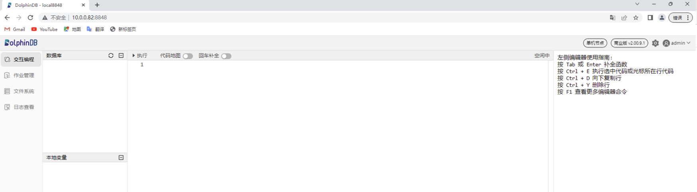
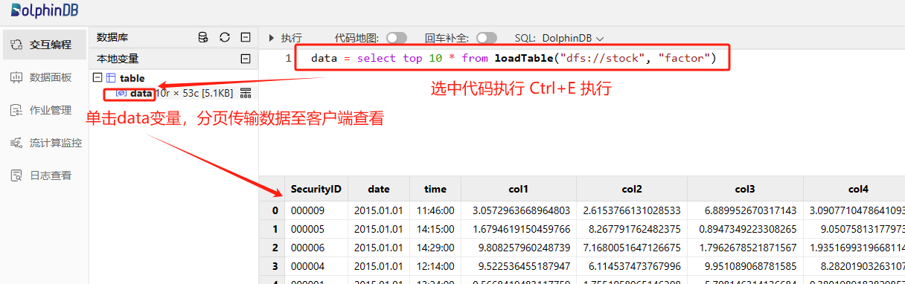

# 非标权限管理

## 1. 前言

DolphinDB 提供的[用户权限管理](ACL_and_Security.md)功能管控的最小粒度是表级别，无法设置小于表粒度的数据访问权限管控，如限制用户仅能访问表中某些行或某些列的数据。为了满足客户更精细的权限管控需求，我们编写了本教程。

## 2. 概述

本教程主要介绍如何通过[函数视图](../db_distr_comp/db_oper/FunctionView.md)对表的访问权限实现更加精细和个性化的管控。

函数视图是封装了访问数据库以及相关计算语句的自定义函数，它提供了一种灵活的方式来控制用户访问数据库和表。用户即使不具备读写数据库原始数据的权限，也可通过执行函数视图，间接访问数据库，得到所需的计算结果。

本教程中会学习到：

* 如何在 DolphinDB 中用函数视图实现对表的访问权限实现更加精细和个性化的管控。
* 如何实现授予某些用户或用户组对某个表只能访问某些行的权限：如授予用户 A 只能访问表1近1年的数据。
* 如何实现授予某些用户或用户组对某个表只能访问某些列的权限：如授予用户 A 只能访问表1前10列的数据。
* 如何实现授予某些用户或用户组对某个表只能访问某些行和列的权限：如授予用户 A 只能访问表1近1年的前10列的数据。

## 3. 测试环境准备

**第一步：部署测试环境**

* 部署 DolphinDB 单节点：[单节点部署教程](standalone_server.md)。
* 根据部署教程打开节点 web 编程界面，登陆后运行后续步骤测试代码，默认 admin 账户的密码是 123456。



**第二步：创建模拟数据库表**

创建本教程示例的分区表，模拟数据内容为：10年10支股票分钟级别指标，指标列为 col1, col2, col3, …, col49, col50。

粘贴下述代码至 web 编程界面，选中需要执行代码点击执行（执行快捷键：Ctrl+E）即可：

```
//登陆账户
login("admin", "123456")
//创建数据库和分区表
dbName = "dfs://stock"
tbName = "factor"
if(existsDatabase(dbName)){
	dropDatabase(dbName)
}
db = database(dbName, VALUE, 2023.01.01..2023.01.30)
colNames = `SecurityID`date`time`col1`col2`col3`col4`col5`col6`col7`col8`col9`col10`col11`col12`col13`col14`col15`col16`col17`col18`col19`col20`col21`col22`col23`col24`col25`col26`col27`col28`col29`col30`col31`col32`col33`col34`col35`col36`col37`col38`col39`col40`col41`col42`col43`col44`col45`col46`col47`col48`col49`col50
colTypes = [SYMBOL, DATE, SECOND, DOUBLE, DOUBLE, DOUBLE, DOUBLE, DOUBLE, DOUBLE, DOUBLE, DOUBLE, DOUBLE, DOUBLE, DOUBLE, DOUBLE, DOUBLE, DOUBLE, DOUBLE, DOUBLE, DOUBLE, DOUBLE, DOUBLE, DOUBLE, DOUBLE, DOUBLE, DOUBLE, DOUBLE, DOUBLE, DOUBLE, DOUBLE, DOUBLE, DOUBLE, DOUBLE, DOUBLE, DOUBLE, DOUBLE, DOUBLE, DOUBLE, DOUBLE, DOUBLE, DOUBLE, DOUBLE, DOUBLE, DOUBLE, DOUBLE, DOUBLE, DOUBLE, DOUBLE, DOUBLE, DOUBLE, DOUBLE, DOUBLE, DOUBLE]
schema = table(1:0, colNames, colTypes)
db.createPartitionedTable(table=schema, tableName=tbName, partitionColumns='date')
//构建模拟数据
n = 1000000
SecurityID = rand(`000001`000002`000003`000004`000005`000006`000007`000008`000009`000010, n)
date = rand(2015.01.01..2024.12.31, n)
time = 09:30:00 + rand(331, n) * 60
factor = rand(10.0, n:50)
factor.rename!(`col1`col2`col3`col4`col5`col6`col7`col8`col9`col10`col11`col12`col13`col14`col15`col16`col17`col18`col19`col20`col21`col22`col23`col24`col25`col26`col27`col28`col29`col30`col31`col32`col33`col34`col35`col36`col37`col38`col39`col40`col41`col42`col43`col44`col45`col46`col47`col48`col49`col50)
t = table(SecurityID, date, time, factor)
//存入分区表
loadTable("dfs://stock", "factor").append!(t)
```

成功导入模拟数据后可以执行下述代码，查询前10行数据至内存中查看：

```
data = select top 10 * from loadTable("dfs://stock", "factor")
```

返回：



**第三步：创建测试用户**

* 创建用户 testUser1, testUser2。
* 创建用户组 testGroup1，并将用户 testUser1 和 testUser2 加入该用户组。

```
login("admin", "123456")
createUser("testUser1", "123456",, false)
createUser("testUser2", "123456",, false)
createGroup("testGroup1", `testUser1`testUser2)
```

## 4. 设置行级别访问权限

### 4.1 限制用户仅能访问表中2023年以前的数据

行级别访问控制细则：

* 限制用户仅能访问表中2023年以前的数据。
* 限制用户单次访问不能超过1年的数据。

```
login("admin", "123456")
def getPre2023(startDate, endDate, cols="*", security=NULL) {
	if (endDate >= 2023.01.01) {
		throw("Not granted to read data after 2023")
	}
	if (startDate < temporalAdd(endDate, -1, "y")) {
		throw("Time duration exceeds 1 year. Please change the dates.")
	}
	whereConditions = [<date between startDate:endDate>]
	if (typestr(security) <> VOID) {
		whereConditions.append!(<SecurityID in security>)
	}
	return eval(sql(select=sqlCol(cols), from=loadTable("dfs://stock", "factor"), where=whereConditions))
}
addFunctionView(getPre2023)
grant("testUser1", VIEW_EXEC, "getPre2023")
```

* 参数

  + *startDate*, *endDate* 开始日期，结束日期，间隔不得超过1年。
  + *cols* 列名，默认所有列。
  + *security* 证券代码，默认所有证券代码。
* 用户 testUser1 调用函数视图访问 2022 年指定证券、指定列的数据。

  ```
  login("testUser1", "123456")
  t = getPre2023(2022.01.01, 2022.12.31, `SecurityID`date`time`col1, `000001`000002)
  ```
* 如果用户指定的日期不被允许访问，将会报错。

  ```
  t = getPre2023(2022.12.01, 2023.01.31)
  // output: Not granted to read data after 2023
  ```
* 如果用户指定的起止日期间隔超过1年，将会报错。

  ```
  t = getPre2023(2020.01.01, 2021.12.31)
  // output: Time duration exceeds 1 year. Please change the dates.
  ```

### 4.2 限制用户仅能访问表中最近一年的数据

行级别访问控制细则：

* 限制用户仅能访问表中最近一年的数据。

```
login("admin", "123456")
def getRecentYear(startDate=NULL, endDate=NULL, cols="*", security=NULL) {
    start = temporalAdd(date(now()), -1, "y")
    end = date(now())
    if (startDate == NULL) { date0 = start }
    else if (startDate < start) { throw("Not granted to read data before " + start) }
    else { date0 = startDate }
    if (endDate == NULL) { date1 = end }
    else if (endDate > end) { throw("Not granted to read data after " + end) }
    else { date1 = endDate }
    whereConditions = [<date between date0:date1>]
    if (typestr(security) <> VOID) {
        whereConditions.append!(<SecurityID in security>)
    }
    return eval(sql(select=sqlCol(cols), from=loadTable("dfs://stock", "factor"), where=whereConditions))
}
addFunctionView(getRecentYear)
grant("testUser2", VIEW_EXEC, "getRecentYear")
```

* 参数

  + *startDate* 开始日期，默认1年前。
  + *endDate* 结束日期，默认今天。
  + *cols* 列名，默认所有列。
  + *security* 证券代码，默认所有证券代码。
* 用户 testUser2 调用函数视图访问近1年所有数据。

  ```
  login("testUser2", "123456")
  t = getRecentYear()
  ```
* 用户 testUser2 调用函数视图访问指定日期开始、指定列的数据。

  ```
  login("testUser2", "123456")
  t = getRecentYear(startDate=2023.07.01, cols=`SecurityID`date`time`col2`col3)
  ```
* 如果用户指定的日期不被允许访问，将会报错。

  ```
  t = getRecentYear(2023.01.01, 2023.12.31)
  // output: Not granted to read data before 2023.03.08
  ```

## 5. 设置列级别访问权限

### 5.1 限制用户仅能访问表中前10列数据

列级别访问控制细则：

* 限制用户仅能访问表中前10列的数据

```
login("admin", "123456")
def getFirst10Col(startDate, endDate, cols=NULL, security=NULL) {
	grantedCols = loadTable("dfs://stock", "factor").schema()['colDefs']['name'][:10]
	notGranted = not(cols in grantedCols)
	if (typestr(cols) == VOID) { col = grantedCols }
	else if (sum(notGranted) > 0) {	throw("Not granted to read columns " + toStdJson(distinct(cols[notGranted]))) }
	else { col = cols }
	if (startDate < temporalAdd(endDate, -1, "y")) {
		throw("Time duration exceeds 1 year. Please change the dates.")
	}
	whereConditions = [<date between startDate:endDate>]
	if (typestr(security) <> VOID) {
		whereConditions.append!(<SecurityID in security>)
	}
	return eval(sql(select=sqlCol(col), from=loadTable("dfs://stock", "factor"), where=whereConditions))
}
addFunctionView(getFirst10Col)
grant("testUser1", VIEW_EXEC, "getFirst10Col")
```

* 参数

  + *startDate*, *endDate* 开始日期，结束日期，间隔不得超过1年。
  + *cols* 列名，默认允许访问的所有列。
  + *security* 证券代码，默认所有证券代码。
* 用户 testUser1 调用函数视图访问 2023 年指定证券、指定列的数据。

  ```
  login("testUser1", "123456")
  t = getFirst10Col(2023.01.01, 2023.12.31, `SecurityID`date`time`col5`col6`col7, `000008`000009`000010)
  ```
* 如果用户指定的列不被允许访问，将会报错。

  ```
  t = getFirst10Col(2023.01.01, 2023.12.31, `SecurityID`date`time`col40`col50)
  // output: Not granted to read columns ["col50","col40"]
  ```

## 6. 设置行列级别访问权限

### 6.1 限制用户仅能访问表中 2020 年以后的几列数据

```
login("admin", "123456")
def getCond(startDate, endDate, cols=NULL, security=NULL) {
	grantedCols = `SecurityID`date`time`col46`col47`col48`col49`col50
	notGranted = not(cols in grantedCols)
	if (typestr(cols) == VOID) { col = grantedCols }
	else if (sum(notGranted) > 0) {	throw("Not granted to read columns " + toStdJson(distinct(cols[notGranted]))) }
	else { col = cols }
	if (startDate < 2020.01.01) {
		throw("Not granted to read data before 2020")
	}
	if (startDate < temporalAdd(endDate, -1, "y")) {
		throw("Time duration exceeds 1 year. Please change the dates.")
	}
	whereConditions = [<date between startDate:endDate>]
	if (typestr(security) <> VOID) {
		whereConditions.append!(<SecurityID in security>)
	}
	return eval(sql(select=sqlCol(col), from=loadTable("dfs://stock", "factor"), where=whereConditions))
}
addFunctionView(getCond)
grant("testGroup1", VIEW_EXEC, "getCond")
```

* 参数

  + *startDate*, *endDate* 开始日期，结束日期，间隔不得超过1年。
  + *cols* 列名，默认允许访问的所有列。
  + *security* 证券代码，默认所有证券代码。
* 用户组 testGroup1 中的用户调用函数视图访问2021年指定列所有数据。

  ```
  login("testUser2", "123456")
  t = getCond(2021.01.01, 2021.12.31, `SecurityID`date`time`col47`col48`col49)
  ```
* 如果用户指定的列不被允许访问，将会报错。

  ```
  t = getCond(2021.01.01, 2021.12.31, `SecurityID`date`time`col44`col45`col46`col47)
  // output: Not granted to read columns ["col45","col44"]
  ```
* 如果用户指定的日期不被允许访问，将会报错。

  ```
  t = getCond(2019.01.01, 2019.12.31, `SecurityID`date`time`col47`col48`col49)
  // output: Not granted to read data before 2020
  ```

## 7. 函数视图运维介绍

### 7.1 添加函数视图

管理员定义函数后，使用 [addFunctionView](../funcs/a/addFunctionView.md) 函数添加函数视图。

```
login("admin", "123456")
def getCount() {
	return select count(*) from loadTable("dfs://stock", "factor")
}
addFunctionView(getCount)
```

### 7.2 删除函数视图

管理员使用 [dropFunctionView](../funcs/d/dropFunctionView.md) 函数进行函数视图删除。删除函数视图后，所有被赋予该函数视图权限的用户将无法调用该函数视图。

```
login("admin", "123456")
dropFunctionView("getCount")
```

### 7.3 修改函数视图

管理员先删除函数视图，更改函数后，再添加函数视图。**如删除前该函数视图已授权给其他用户，修改后需再次授权。**

```
login("admin", "123456")
dropFunctionView("getCount")
go
def getCount() {
	return select count(*) from loadTable("dfs://stock", "factor") where date >= 2023.01.01
}
go
addFunctionView(getCount)
```

### 7.4 撤销用户权限

管理员撤销指定用户的函数视图执行权限后，该用户将无法调用该函数视图，但其他拥有该函数视图权限的用户不受影响。

```
login("admin", "123456")
revoke("testUser1", VIEW_EXEC, "getPre2023")
```

## 8. 常见问题解答（FAQ）

8.1 The FunctionView [xxx] already exists, please drop it before adding a new one

执行 [addFunctionView](../funcs/a/addFunctionView.md) 函数添加新的函数视图时报如下错误：

```
addFunctionView(getCount) => The FunctionView [getCount] already exists, please drop it before adding a new one
```

造成问题原因：

* 已经有同名的函数视图，导致本次添加失败后报错终止任务。

解决方案：

* 办法1：通过 [dropFunctionView](../funcs/d/dropFunctionView.md) 函数删除已定义的同名函数视图

```
dropFunctionView("getCount")
```

* 方法2：通过 try-catch 语句捕获错误日志并打印，避免因为此行代码导致运行终止。

```
try{addFunctionView(getCount)} catch(ex){print(ex)}
```

