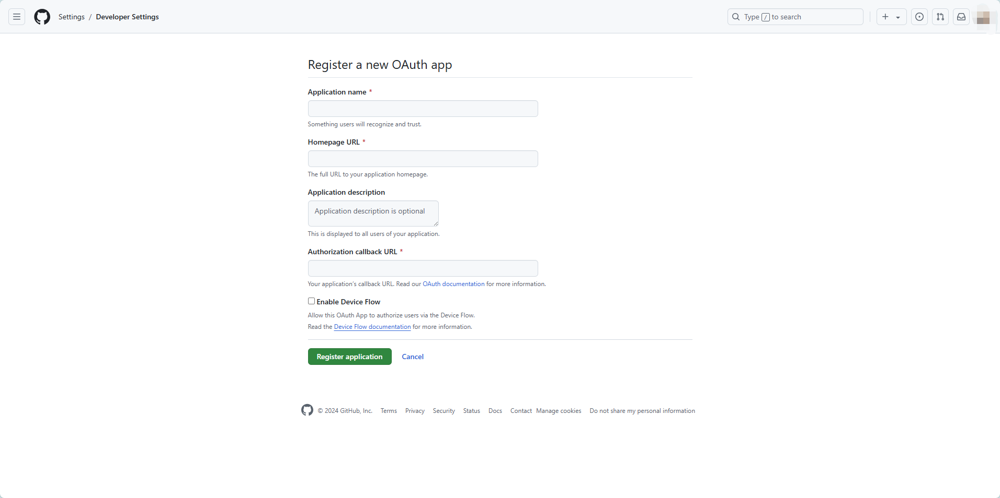
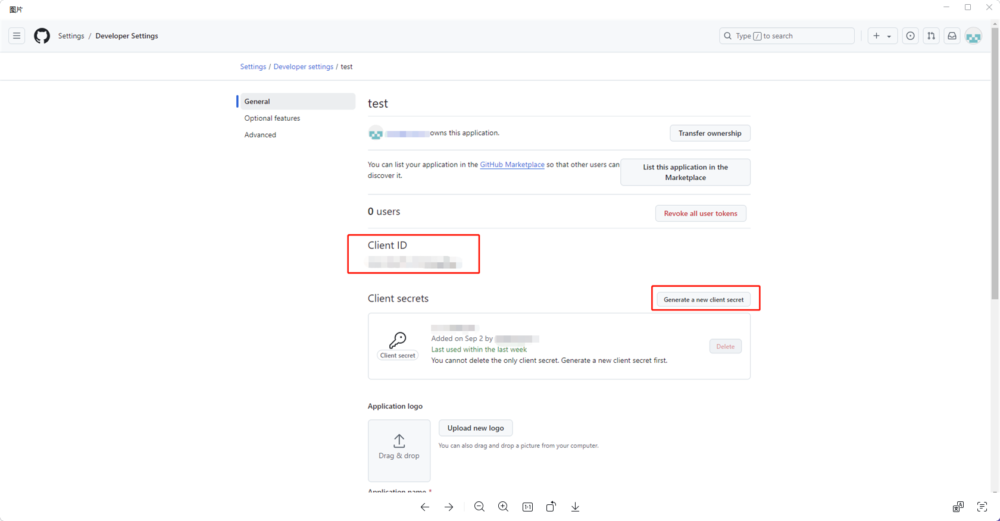
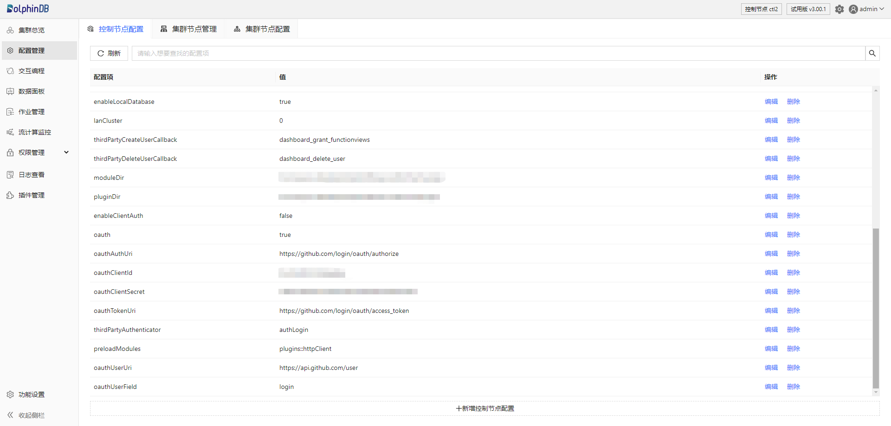
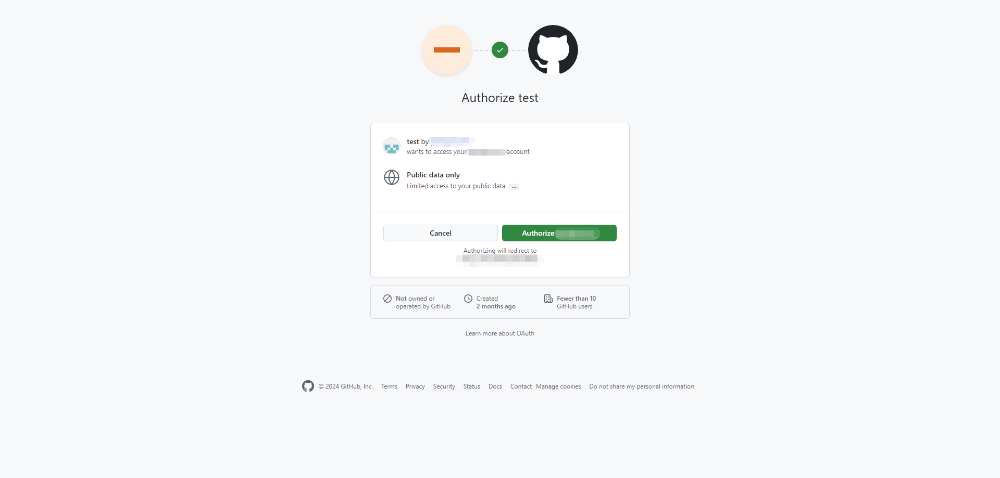

# 单点登录使用说明

OAuth 是单点登录（SSO）的一种实现方式。目前 DolphinDB 已支持其三种鉴权方式：Authentication Code（授权码模式，支持
Web）、Implicit（隐式授权模式，支持 Web）、Client Credentials（客户端凭证模式，支持 API）。在启用 OAuth
单点登录时，用户须保证已获得要登录的第三方网站和 DolphinDB server 的相关权限，成功登录后在 DolphinDB Web 中进行后续使用。

接下来以通过 GitHub 进行单点登录为例进行详细说明。

## 步骤一：第三方网站开启 OAuth 功能

GitHub 创建 OAuth 应用的说明可参考官方文档 [创建 OAuth 应用 - GitHub 文档](https://docs.github.com/zh/apps/oauth-apps/building-oauth-apps/creating-an-oauth-app)。

注意：若登录对象为国外网站，须保证系统中已配置相关代理节点。详细说明请另行参考，此处略过。

图 1. 图1 第三方网站配置单点登录功能



成功创建后将显示图 2 界面，在该界面中获取 Client lD 和 Client secrets 信息，分别用来在 DolphinDB 中指定客户端的 ID
和密码。

图 2. 图2 第三方网站成功开启单点登录



## 步骤二：DolphinDB 中配置相关参数

DolphinDB 中提供了 OAuth 功能的相关配置参数，详细说明可参阅 [参数配置-单点登录](../db_distr_comp/cfg/function_configuration.md)。用户可使用两种配置方式：在 DolphinDB server 的配置文件中指定配置项；或在 Web
的配置管理界面新增配置参数。

注意：如果要在集群使用 OAuth 功能，则必须在所有节点的 *controller.cfg*, *cluster.cfg* 文件中都添加 OAuth
的相关配置参数。

如下为在 DolphinDB server 的配置文件中设置 OAuth
配置项的示例，请根据实际参数设置。

```
oauth = 1
oauthWebType = authorization code
oauthAuthUri =  "https://github.com/login/oauth/authorize"
oauthClientId = xxxxxx
oauthClientSecret = xxxxxx
oauthTokenUri = "https://github.com/login/oauth/access_token"
oauthUserUri = "https://api.github.com/user"
oauthUserField = login
```

成功配置后，可以在 DolphinDB Web 的配置管理界面看到相关参数。

图 3. 图3 DolphinDB Web 的配置管理界面



## 步骤三：DolphinDB Web 中登录第三方账号

点击登录按钮，页面将跳转至第三方账户授权，确认后将跳转到原始登录页面。

图 4. 图4 在 Web 页面登录第三方账户



若 Web 页面已登录的用户名显示为授权的第三方用户，则 OAuth 方式登录成功。

