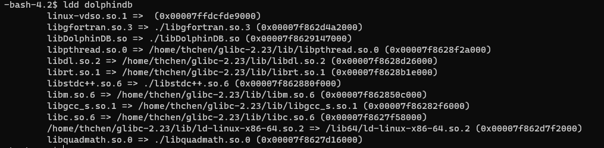

# -j 后面的数字要低于或者等于自己 cpu 的核数
make -j12
make install
#编译运行需要把系统的 /lib64/libgcc_s.so.1 复制到 /home/thchen/glibc-2.23/lib 里
cp /lib64/libgcc_s.so.1 /home/thchen/glibc-2.23/lib
```

### 3.3. 解压高版本 glibc 到自定义位置

**注意事项**：

1. 不要解压到系统 lib64、根目录等路径覆盖系统 glibc。
2. 不要添加自定义 glibc 文件夹到`LD_LIBRARY_PATH`环境变量。

```
#当前位置为 /home/thchen
tar -zxvf glibc-2.23.tar.gz
```

### 3.4. 下载 patchelf

```
sudo yum install patchelf
```

### 3.5. 文件备份

备份相关文件（`dolphindb` ，`libDolphinDB.so`，`libgfortran.so.3`，`libopenblas.so.0`，`libquadmath.so.0`，`libstdc++.so.6`，`libtcmalloc_minimal.so.4`）

```
#备份文件，需要到 dolphindb 可执行文件下的目录
cp dolphindb dolphindb.bak
cp libDolphinDB.so libDolphinDB.so.bak
cp libgfortran.so.3 libgfortran.so.3.bak
cp libopenblas.so.0 libopenblas.so.0.bak
cp libquadmath.so.0 libquadmath.so.0.bak
cp libstdc++.so.6 libstdc++.so.6.bak
cp libtcmalloc_minimal.so.4 libtcmalloc_minimal.so.4.bak
```

### 3.6. 修改文件的 rpath 和 interpreter

1. 关闭 DolphinDB
2. 根据高版本 glibc 的路径，修改以下文件的 rpath：`dolphindb` ，`libDolphinDB.so`，`libgfortran.so.3`，`libopenblas.so.0`，`libquadmath.so.0`，`libstdc++.so.6`，`libtcmalloc_minimal.so.4`

```
#修改 rpath，具体路径要看高版本 glibc 的路径
patchelf --set-interpreter /home/thchen/glibc-2.23/lib/ld-linux-x86-64.so.2 \
--set-rpath ./:/home/thchen/glibc-2.23/lib dolphindb
patchelf  --set-rpath ./:/home/thchen/glibc-2.23/lib libDolphinDB.so
patchelf  --set-rpath ./:/home/thchen/glibc-2.23/lib libgfortran.so.3
patchelf  --set-rpath ./:/home/thchen/glibc-2.23/lib libopenblas.so.0
patchelf  --set-rpath ./:/home/thchen/glibc-2.23/lib libquadmath.so.0
patchelf  --set-rpath ./:/home/thchen/glibc-2.23/lib libstdc++.so.6
patchelf  --set-rpath ./:/home/thchen/glibc-2.23/lib libtcmalloc_minimal.so.4
```

### 3.7. 验证 glibc 库路径

使用 ldd dolphindb 命令验证当前 glibc 库的路径。当运行结果显示其路径为高版本 glibc 路径时，说明前述修改成功。



## 4. 性能测试与对比

通过在升级前和升级后运行 2.3.2 节的模拟查询，我们得到了以下数据：

| **查询方法** | **查询用时 (glibc 2.17)** | **查询用时 (glibc 2.34)** | **加速比** |
| --- | --- | --- | --- |
| 单查询 | 3,241 ms | 2,007 ms | 1.61 |
| 20 并发查询 | 33,346 ms | 15,313 ms | 2.18 |
| 40 并发查询 | 85,144 ms | 24,672 ms | 3.45 |
| 60 并发查询 | 134,065 ms | 28,793 ms | 4.66 |
| 100 并发查询 | 224,902ms | 46,938 ms | 4.79 |

通过升级 glibc，DolphinDB 前后查询加速比为 1.61 到 4.79 倍。在并发情况下性能提升更加明显。

## 5. 小结

针对高并发查询，当查询需要涉及多个分区时，如果查询任务积压但 CPU 利用率不高，可以先确定 glibc 的版本。如果 glibc 版本低于 2.23，则可以按照本方案进行升级，这可能会带来明显的性能提升。

## 6. 附件

* [testScript.zip](script/performance_optimization_based_on_glibc/testScript.zip)
* [config.tar.gz](script/performance_optimization_based_on_glibc/config.tar.gz)
* [glibc-2.23.tar.gz](script/performance_optimization_based_on_glibc/glibc-2.23.tar.gz)

