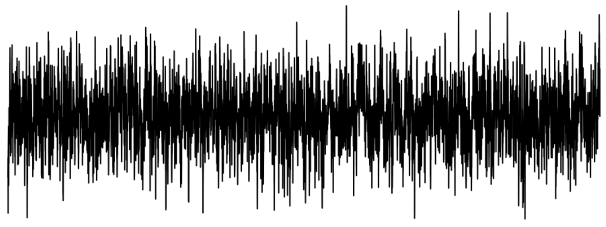
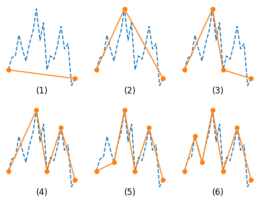
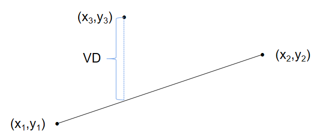

# PIP 降采样算法

## 1. 绪论

在真实的业务场景中，时间序列数据具有以下特点：

* 采集频率（秒级甚至毫秒级）高，导致数据量非常庞大。
* 数据价值密度低。

对数据进行合理的降采样不仅极大地可以降低系统压力、节约存储成本，同时也可以帮助用户聚焦重要信息，提升数据价值。本教程将以要点感知算法为例介绍如何在 DolphinDB 自定义并应用算法降采样数据。

### 1.1. 行业背景

在物联网用户场景中，有一个普遍的需求是需要查询某个采集点的全年（一季度、一个月）的数据并做展示分析。在展示时，如果显示所有数据，会有性能问题，特别是实时展示。同时，这个也不是必须的，因为只需要展示大概的趋势就足以达到决策要求，太多数据点反而可能模糊决策。以折线图为例，可视化场景中，当 x 轴的数据不断增多，对应 y 轴的数据量增多，体现在图上的折线就会变得越来越复杂，当数量达到一定程度，很难再通过图找到具体的某一个点所表述的真实值是什么，数据变得很拥挤。下图展示了 1 个包含 1 万个数据点的折线图：



为了能够看到图形的整体，我们就要隐藏一些点，仅展示那些能够代表其他的点，或者是创建能够代表这些点的新数据点，这就是降采样算法解决的问题。

### 1.2. 业务挑战

总体而言，在上述物联网时序数据应用场景中，首先需要将数据存下来，再将一定时间跨度的数据进行可视化展示，或者是流计算实时推送数据进行展示，而不对数据进行降采样，会存在以下几个问题：

* 存储成本：高采集频率、多采集点数据的存储成本极高
* 数据展示：展示原始数据遭遇性能瓶颈，且大量噪声数据影响局部趋势
* 数据价值：数据价值不与存储、展示成本成正比

## 2. 降采样算法概述

DolphinDB 已经内置实现了简单的降采样算法如最大值、最小值、平均值等，用户可以直接调用相应函数进行计算。上述降采样算法都是将多条数据用一个值进行表示，这种表示方法的优点是计算简单、快速，缺点是信息损失较大。除此之外，许多学者还提出了大量更为复杂、高级的降采样算法，适用于不同的场景。DolphinDB 的语言具有强大的编程能力，支持用户自定义实现复杂的降采样算法，本文接下来将以 PIP 算法为例，介绍其算法原理、DolphinDB 脚本实现，并且给出了案例脚本，用户可以在自己的 DolphinDB server 上直接运行该脚本。

## 3. PIP 算法

### 3.1. PIP 介绍

PIP（Perceptually Important Points）算法又叫要点感知算法，是一种时间序列聚合算法，其思路是：对于一个长度为 n 的时间序列数据，迭代地依据最大距离原则采样出 k 个数据点，k 是人为设置的降采样数据点数（k <= n）。PIP 算法的具体步骤如下（论文参考：https://sci-hub.se/10.1109/iscmi.2017.8279589）

* 第一步：采样出时间序列的第 1 个和最后 1 个样本放入降采样数据点集
* 第二步：计算剩余未采样样本点到其邻接的 2 个要点构成的直线的距离
* 第三步：采样出距离最大的样本点放入降采样数据点集
* 第四步：重复第二步和第三步直到采样要点数达到 k 个

可以通过下面的演示图片，更直观的感受 PIP 算法的计算过程：



其中，上述点到直线的距离计算常用的是垂直距离（Vertical Distance），本文中的脚本实现也将采用该距离计算公式。对于点（x3，y3）到另外两点（x1，y1）、（x2，y2）所构成直线的距离的计算公式为


即为下图中蓝色虚线所示的距离：



### 3.2. 脚本实现

DolphinDB 支持用户通过 defg 声明编写脚本实现自定义聚合函数，并且 `rolling` 等滑动窗口函数支持调用用户自定义的聚合函数进行滑动计算，因此 DolphinDB 天然支持用户自定义降采样算法进行滑动计算，以下代码为 PIP 算法的脚本实现：

```
defg PIP(X, Y){
    data = table(X as x, Y as y)
    rowTab = select x, y, rowNo(x) as rowNo from data
    n = size(X)
// k为每次滑动降采样的数据量，取值范围为 3~n（n 为滑动窗口大小）
    k = 5
    samples = 2
    result = string(X[0])+"_"+string(Y[0])
    indexList = [0,n-1]
    do{
        distanceVec = [0.0]
        for (i in 0..(size(indexList)-2)){
            start, end = indexList[i], indexList[i+1]
            x1, y1 = X[start], Y[start]
            x2, y2 = X[end], Y[end]
            a = (y1-y2)/(x1-x2)
            b = y1-a*x1
            distanceVec=join(distanceVec, abs(Y[(start+1): end] - (X[(start+1): end]*a + b)))
            distanceVec.append!(0)
        }
        distanceMax = distanceVec.max()
        tmp = table(rowTab, distanceVec as distance)
        nextPoint = select x, y, rowNo from tmp where distance = distanceMax
        result += ","+string(nextPoint.x[0])+"_"+string(nextPoint.y[0])
        indexList = indexList.append!(nextPoint.rowNo[0]).sort()
        samples = samples+1
    }while(samples < k)
    result += ","+string(X.last())+"_"+string(Y.last())
    return result
}
```

### 3.3. 算法性能

PIP 算法的时间复杂度是 O(n2)，得益于 DolphinDB 内置的向量化编程，我们可以将算法的时间复杂度降低为 O(n) ，极大地提升了算法的计算性能，在单机社区版的 DolphinDB 上将 1 千万条的时间序列数据降采样至 4 万条数据只需 1.4s，并且还可以通过多线程的方式进一步提升性能。

## 4. 案例演示

### 4.1. 案例脚本

本案例将以 1000 万条的正弦波动数据为例，使用 PIP 算法进行降维并展示降维前后的可视化对比，用户可以在自己的 DolphinDB 环境上运行该案例的完整代码。

* 清理环境

```
login('admin', '123456')
undef(all)
clearAllCache()
```

* 自定义 PIP 算法函数及解析函数

```
// PIP 算法聚合函数
defg PIP(X, Y){
    data = table(X as x, Y as y)
    rowTab = select x, y, rowNo(x) as rowNo from data
    n = size(X)
// k 为每次滑动降采样的数据量，取值范围为 3~n（n 为滑动窗口大小）
    k = 5
    samples = 2
    result = string(X[0])+"_"+string(Y[0])
    indexList = [0,n-1]
    do{
        distanceVec = [0.0]
        for (i in 0..(size(indexList)-2)){
            start, end = indexList[i], indexList[i+1]
            x1, y1 = X[start], Y[start]
            x2, y2 = X[end], Y[end]
            a = (y1-y2)/(x1-x2)
            b = y1-a*x1
            distanceVec=join(distanceVec, abs(Y[(start+1): end] - (X[(start+1): end]*a + b)))
            distanceVec.append!(0)
        }
        distanceMax = distanceVec.max()
        tmp = table(rowTab, distanceVec as distance)
        nextPoint = select x, y, rowNo from tmp where distance = distanceMax
        result += ","+string(nextPoint.x[0])+"_"+string(nextPoint.y[0])
        indexList = indexList.append!(nextPoint.rowNo[0]).sort()
        samples = samples+1
    }while(samples < k)
    result += ","+string(X.last())+"_"+string(Y.last())
    return result
}

// 降采样结果解析函数
def strToTable(result){
    samplesPIP = keyedTable(`x`y, 1:0, `x`y, `DOUBLE`DOUBLE)
    for (res in result){
        windows = res.split(',')
        for (window in windows){
            row = window.split('_')
            samplesPIP.append!(table([double(row[0])] as x, [double(row[1])] as y))
        }
    }
    return samplesPIP.sortBy!(`x, 1)
}
```

* 模拟数据

```
// 模拟 1 千万条正弦数据，大小为 153 MB
X = (double(0..9999999)*pi/1000)
Y = sin(X)
```

* 结合 `rolling` 函数进行滑动计算

```
// 调用 rolling 函数进行滑动窗口计算，每 1000 个点滑动 1 次，降采样到 10 个点
timer{pipResult = rolling(PIP, [X, Y], 1000, 999)}

// 解析降采样结果输出一张表
samplesPIP = strToTable(pipResult)
```

### 4.2. 结果展示

DolphinDB 内置了画图函数 plot，用户可以在库内直接调用对数据进行可视化展示，接下来将调用 plot 函数可视化对比降采样前后数据。

* 原始数据折线图：

```
plot(Y[0:10000], X[0:10000])
```


* 降采样数据折线图：

```
plot(samplesPIP.y[0:100], samplesPIP.x[0:100])
```


可见，PIP 降采样算法可以完全保留数据的趋势信息。但在实际业务场景中，需结合实际业务场景合理设置滑动窗口大小及降采样点数。

