# 数据校验
abs_diff = abs(result1 - result2)
if abs_diff < 1e-8:
    print("峰度计算结果在 8 位小数点一致, 精度良好")
else:
    print(f"峰度计算结果存在差异, 差异为: {abs_diff:.8f}")

session.close()

// output
基于 Python pandas 的 峰度为: 0.07256220
基于 DolphinDB 的 峰度为: 0.07256220
峰度计算结果在 8 位小数点一致, 精度良好
```

### 1.2 多变量概率统计

多变量概率统计是指对多个变量之间的关系进行分析，包括计算协方差、相关系数等统计量，这些统计量可以帮助用户了解变量之间的线性关系和相互影响程度。DolphinDB 支持的统计多变量间特征的函数如下，本章节将分别介绍如下函数实现及使用。

表 1-2 多变量概率函数统计表

| **多变量统计特征** | **函数名** |
| --- | --- |
| 协方差 | `covar` |
| 协方差矩阵 | `covarMatrix` |
| Pearson 相关系数 | `corr` |
| Pearson 相关矩阵 | `corrMatrix` |
| Spearman 等级相关系数 | `spearmanr` |
| kendall 相关性系数 | `kendall` |
| 加权协方差 | `wcovar` |

#### 1.2.1 协方差及协方差矩阵

协方差衡量两个随机变量在一个总体中共同变化的程度。当总体包含更高维度或更多随机变量时，可以使用矩阵来描述不同维度之间的关系。协方差矩阵提供了一种更容易理解的方式，它将整个维度中的关系定义为每两个随机变量之间的关系。在 DolphinDB 中，可以通过计算两个向量 X 和 Y 的协方差来得到样本协方差，计算公式如下：


DolphinDB 也支持通过 `covarMatrix` 计算多维向量的协方差矩阵，计算公式如下：


在风险管理和投资组合优化场景，协方差矩阵是一个重要的概念。下面通过一个简单的案例，来说明如何通过 DolphinDB 构建一个风险矩阵：

```
returns_a = [0.01, 0.02, -0.03, 0.01, 0.02]
returns_b = [-0.02, 0.01, 0.03, -0.02, -0.01]
returns_c = [0.03, -0.01, -0.02, 0.02, 0.01]
m = matrix(returns_a, returns_b, returns_c).rename!(`a`b`c)
covariance_matrix = covarMatrix(m)
// Output
	a	b	c
a	0.0004300000	-0.0003100000	0.0002300000
b	-0.0003100000	0.0004700000	-0.0004350000
c	0.0002300000	-0.0004350000	0.0004300000
```

#### 1.2.2 Pearson 相关系数及相关矩阵

Pearson 相关系数，又称积差相关系数，是表达两变量线性相关程度及方向的统计指标。DolphinDB 中 `corr`函数中，相关系数计算的公式如下：


然而当涉及风险管理和投资组合优化时，相关性矩阵是一个较为重要的概念。DolphinDB 支持通过`corrMatrix` 计算多维向量的相关性矩阵，计算公式如下：


金融市场中的指数（如股票市场指数）通常用于衡量市场整体表现，通过计算市场指数与个别股票的 Pearson相关系数，可以评估该股票与市场整体之间的相关性，如下是基于 DolphinDB 的简单案例：

```
// 市场指数数据
market_index =[100, 110, 120, 130, 140]
// 个别股票收益率数据
stock_returns = [0.01, 0.02, 0.03, -0.01, 0.02]
corr(market_index, stock_returns)
//Output -0.1042572070
```

此外，在投资组合优化中，投资者可以先通过构建相关性矩阵，了解不同资产之间的关联性，从而在投资组合中选择具有低相关性的资产，以实现更好的分散风险的效果。假设投资者有 10 只股票的收益率数据，则可以通过如下方式筛选与其他资产相关性较低的资产。

```
setRandomSeed(42)
m = rand(10.0, 100)$10:10
c= corrMatrix(m)
result = table(1..10 as stock_code,
               c[c<0.5].abs().sum() as corr_sum).sortBy!(`corr_sum)
result
// Output
	stock_code	corr_sum
0	8	1.6943835693
1	2	1.9124975741
2	6	1.9699810000
3	10	1.9706433980
4	4	1.9955912515
5	1	2.0791768735
6	9	2.2377748096
7	5	2.2757034717
8	7	2.8368851661
9	3	3.0716024528
```

#### 1.2.3 Spearman 相关系数

斯皮尔曼相关系数（Spearman's rank correlation coefficient）是一种非参数的秩相关（rank correlation）度量方法，其本质上是等级变量之间的皮尔逊（Pearson）相关系数。在 DolphinDB 中，可以使用 `spearmanr` 函数来计算斯皮尔曼相关系数，其公式如下：


在量化投资中，信息系数（Information Coefficient, IC）度量了因子对下期收益率的预测与实际收益率之间的相关性，通常用于评价预测能力或选股能力。`spearmanr` 函数是计算 Rank IC 值的常用方法。`spearmanr` 的结果与计算 `rank` 的 `corr` 的结果一致。

```
setRandomSeed(123)
predicted_returns = rand(1.0,100)
actual_returns = rand(1.0,100)

r1=spearmanr(predicted_returns,actual_returns)
r2=corr(rank(predicted_returns)+1,rank(actual_returns)+1)
eqObj(r1,r2)
//Output True
```

## 2 概率分布

本章介绍了 DolphinDB 中的各种概率分布函数。通过使用这些函数，用户可以轻松地模拟不同类型的随机变量，并进行相关的概率统计分析。这些功能对于金融、物联网等领域的应用至关重要。

### 2.1 离散分布

DolphinDB 目前支持二项分布、泊松分布等常见离散分布，对应调用函数如下。本章主要讲解二项分布和泊松分布。

表 2-1 离散分布函数列表

| **离散分布** | **累计概率密度** | **累计密度函数的逆函数值** | **随机数生成** |
| --- | --- | --- | --- |
| 二项分布 | `cdfBinomial` | `invBinomial` | `randBinomial` |
| 泊松分布 | `cdfPoisson` | `invPoisson` | `randPoisson` |
| Zipf分布 | `cdfZipf` |  |  |

#### 2.1.1 伯努利分布

伯努利分布（0-1分布）是单变量分布中最简单的例子，也是二项分布的基础。假设有一个投资策略，每天的收益情况是一个二元随机变量，可能是正收益（1）或负收益（0），不存在既不亏损也不盈利的情况，因此满足下式：


正收益（1）的概率 Pwin 就决定了伯努利分布的所有。若假设正收益（1）的概率 Pwin=0.5 ，在 DolphinDB 中，可以通过 `pmfBernoulli` 函数计算对应0-1分布的概率密度函数（PMF）。

```
def pmfBernoulli(p){
   cdf = cdfBinomial(1, p, [0,1])
   pmf =table([0,1] as X,cdf -prev(cdf).nullFill(0) as P).sortBy!(`X)
   return pmf
}
p = 0.5
pmfBernoulli(p)
//Output
	X	P
0	0	0.50
1	1	0.50
```

在 DolphinDB 中，确定 0-1 事件的概率 Pwin 和试验次数 *N* 后，可通过 `randBernoulli` 函数进行伯努利试验。如下，假设每一期正收益对应的对数收益率统一为 10%，每一期负收益对应的对数收益率为 -10%，需要按照上述投资策略进行 N 期的投资。则通过 `randBernoulli` 函数确定每一期是否盈利后，可通过累加对数收益率确定最终收益率。如下结果说明上述投资策略投资 10 期后，最终盈利 22%。

```
setRandomSeed(40393)
def randBernoulli(p, n){
   return randBinomial(1, p, n)
}
x = randBernoulli(0.5,10)
// 假设每一期对数收益率固定为0.1
log_return = 0.1
exp(sum(log_return * iif(x==0, -1, x))) - 1

// 0.2214
```

#### 2.1.2 二项分布

二项分布是描述固定次数独立试验中成功次数的离散分布。如果进行多期投资，则需要关注盈利的概率以及正收益发生的次数，这涉及到了二项分布。如果一个随机变量 X 服从参数是 0-1 事件概率 *p* 及试验次数 *n* 下的二项分布，则可写为 *X*∈*B* ( *n*, *p* ) 。在 X = k 处的 PMF 取值由下面式子得出：


在 DolphinDB 中，可通过 `pmfBinomial` 计算 PMF。通过如下结果分析发现10期投资后，有5期达到正收益的概率约为 24.61%。

```
// 二项分布
def pmfBinomial(trials,p){//p,trials=0.5,10
   X = 0..trials
   cdf = cdfBinomial(trials, p, X)
   return table(X as X,cdf -prev(cdf).nullFill(0) as P).sortBy!(`X)
}
pmfBinomial(10,0.5)
// Output
            X	P
0	0	0.0009765625
1	1	0.0097656250
2	2	0.0439453125
3	3	0.1171875000
4	4	0.2050781250
5	5	0.2460937500
6	6	0.2050781250
7	7	0.1171875000
8	8	0.0439453125
9	9	0.0097656250
```

如下图，基于DolphinDB `pmfBinomial`函数，在 Python 通过绘制不同 0-1 事件概率 *p* 及试验次数 *n* 下的不同二项分布结果如下：

```
plot([pmfBinomial(20,0.5)["P"] <- take(double(),20) as "p=0.5,n=20",
      pmfBinomial(20,0.7)["P"] <- take(double(),20) as "p=0.7,n=20",
      pmfBinomial(40,0.5)["P"] as "p=0.5,n=40"],0..40,"不同参数p和n的二项分布")
```

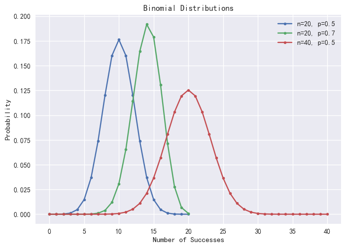
图2-1 二项分布

#### 2.1.3 泊松分布

泊松分布是描述在一定时间或空间内事件发生次数的离散分布。泊松分布与二项分布非常相似，均研究一个事件发生的次数。二项分布主要关注在固定次数的试验中成功的次数，而泊松分布策略则更多地考虑在连续的空间或时间内离散时间发生的次数。泊松分布的 PMF 函数可由下式计算：


在 DolphinDB 中，可通过 `pmfPoisson` 函数计算泊松分布的 PMF 值。概率分布图如下：

```
def pmfPoisson(mean,upper=20){
   x = 0..upper
   cdf =cdfPoisson(mean, x)
   pmf =table(x as X,cdf -prev(cdf).nullFill(0) as P).sortBy!(`X)
   return pmf
}
plot([pmfPoisson(1)["P"] as "λ=1",
      pmfPoisson(4)["P"] as "λ=4",
      pmfPoisson(10)["P"] as "λ=10"],
      0..20,"不同参数λ的泊松分布")
```

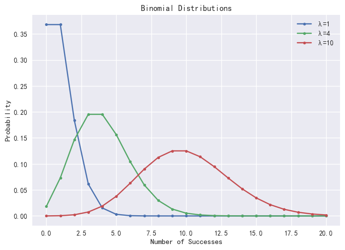
图2-2 泊松分布

### 2.2 正态分布

正态分布或高斯分布是所有分布函数中最重要的分布。这是因为当样本数足够大的时候，所有分布函数的平均值都趋近正态分布。数学上正态分布的特征由平均值 μ 和标准差 σ 决定，正态分布的概率密度函数计算公式如下：


DolphinDB 中可通过 `norm` 函数生成对应服从 *X*∈*N* ( *μ*, *σ* ) 的分布，返回一个长度（维度）为指定数量的向量（矩阵）。示例如下：

```
norm(2.0,0.1,3);
//Output  [2.026602,1.988621,2.101107]

mean norm(3,1,10000);
//Output  3.007866

std norm(3,1,10000);
//Output 0.995806
```

如下为通过 `pdfNormal`、`cdfNormal` 函数分别绘制得到的不同平均值 μ 和标准差 σ 下的正态分布的概率密度函数（PDF）和累计概率密度函数（CDF）：

```
x = 0.1*(-100..100)
plot([pdfNormal(0,1.0,x) as "μ=0,σ=1.0",pdfNormal(0,0.4,x) as "μ=0,σ=0.4",
      pdfNormal(0,2.2,x) as "μ=0,σ=2.2",pdfNormal(-2,0.7,x) as "μ=-2,σ=0.7"],
      x,"不同参数μ和σ的正态分布")
plot([cdfNormal(0,1.0,x) as "μ=0,σ=1.0",cdfNormal(0,0.4,x) as "μ=0,σ=0.4",
      cdfNormal(0,2.2,x) as "μ=0,σ=2.2",cdfNormal(-2,0.7,x) as "μ=-2,σ=0.7"],
      x,"不同参数μ和σ的正态分布")
```

|  |  |
| --- | --- |
| 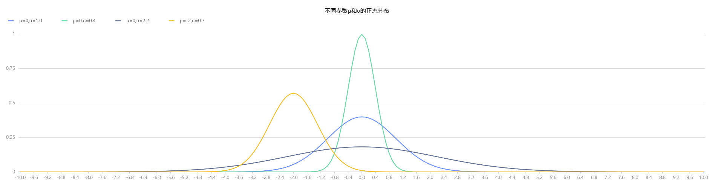  图2-3 不同参数μ和σ的正态分布(PDF) | 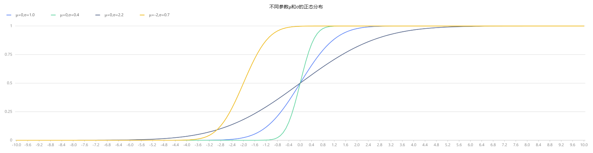  图2-4 不同参数μ和σ的正态分布(CDF) |

对于更小的样本量，样本分布的变异程度较大。比如观察从标准正态分布 *X*∈*N* ( *0*, *1* ) 中随机抽取的 100 个样本的 10 个分布，可以发现样本的均值服从正态分布，但是每个样本本身不一定服从标准正态分布。在 DolphinDB 中，通过 `randNormal` 函数生成了 20 组各自包含 100 个样本点的随机分布，如下图所示。

```
// run 20times
plot(randNormal(0.0, 1.0, 100),,"hist",HISTOGRAM)
plot(norm(0.0, 1.0, 100),,"hist",HISTOGRAM)
```

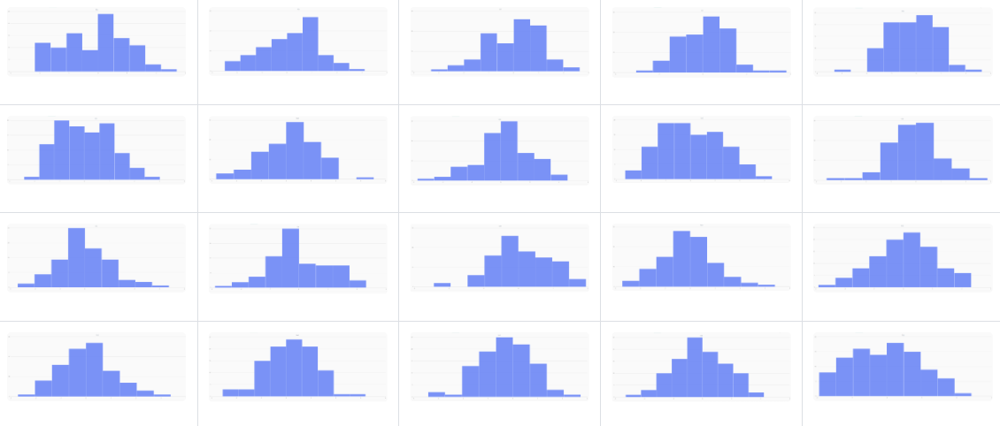
图2-5 20个生成的含有100个样本点的分布，来自标准正态分布

#### 2.2.1 中心极限定理

中心极限定理表明，多个独立同样服从正态分布随机向量 *X1 , X2 , ... , Xn* ∈*N* ( *μ*, *σ* ) 的和（或差）
同样服从正态分布 *N* ( *nμ*, *n2σ2* )，即


而对于独立的随机变量序列，{ *Xi* } 即使数据分布不是正态分布，只要它们独立同分布，那么当 n 充分大时，这些随机变量之和
近似服从正态分布 *N* ( *nμ*, *n2σ2* ) 。如下在 DolphinDB 中，对多个服从均匀分布的数据极限平均化处理，可以发现随着构建的分布数量增加，这些随机变量的均值逐渐呈现出平滑且近似正态的分布形态。

```
def meanUniform(left,right,n,samples){
   setRandomSeed(123)
   result = []
   for (i in 1..samples){
      result.append!(randUniform(left,right,n))
   }
   return mean(matrix(result).transpose())
}
x = randUniform(-1.0,1.0,1000000)
plot(x,,"hist",HISTOGRAM)

x = meanUniform(-1.0,1.0,1000000,2)
plot(x,,"hist",HISTOGRAM)

x = meanUniform(-1.0,1.0,1000000,10)
plot(x,,"hist",HISTOGRAM)
```

|  |  |  |
| --- | --- | --- |
| 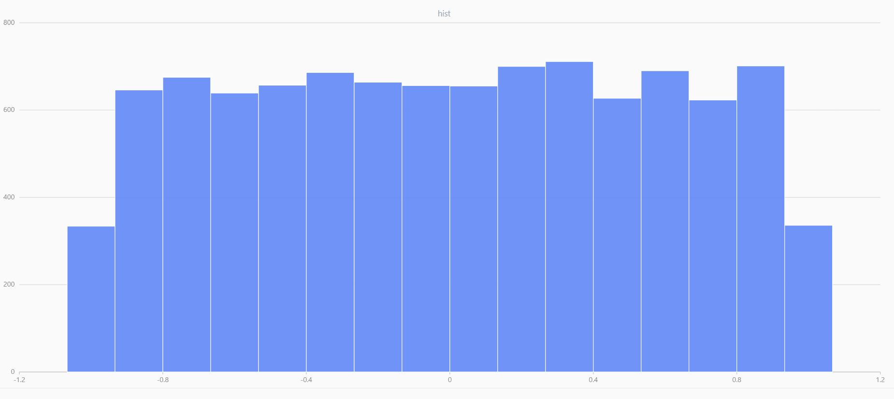  图2-6 随机数据 | 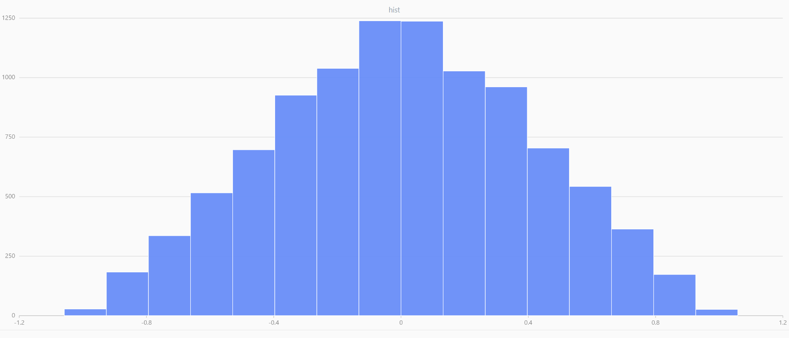  图2-7 两个数据的均值 | 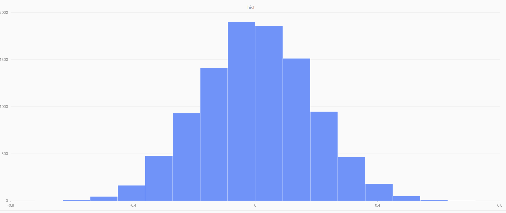  图2-8 十个数据的均值 |

#### 2.2.2 正态分布的应用-对数正态分布

在中国证券市场实测，股票的长期对数收益率（年收益率或月收益率）呈现正态分布。在 DolphinDB 中，首先通过 `norm` 函数模拟对数收益率，并比较对数收益率和正常收益率，可以观察到两者在 -10%~+10% 的区域内基本重合，说明这区间内两者的差异不大。然而，随着收益率的绝对值增大，正常收益率会逐渐趋于稳定，而对数收益率则继续保持其正态分布的特性。

```
logreturns = norm(0,1,1000).sort()
returns = (exp(logreturns)-1).sort()
t = select * from table(logreturns,returns) where returns<0.5 and returns>-0.5
plot([t.logreturns,t.returns],t.returns)
```

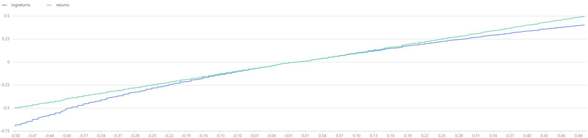

图2-9 常规收益率和对数收益率

在实际应用中，对数收益率的最大优势在于其可加性。把单期的对数收益率相加即可得到整体的对数收益率。由中心极限定理可知，若假设不同期的对数收益率独立同分布，则可以推断
随着 T 的增大会逐步收敛于期望。


绘制 *T* 期的对数收益率曲线如下，可以发现随着 *T* 增加，对数收益率逐渐收敛，但收敛的收益率 
 并不固定。因此若以初始资金 *X0* 进行一个长线投资，希望最后一期的收益率
越大越好。由于未来会收敛的收益率是未知的，为了使得收益率最大化，需要一方面确保投资的时间期限 *T* 需要足够长；另一方面，可参考业界的凯利公式，尽可能最大化收敛的期望值

```
dates = getMarketCalendar("CFFEX",2010.01.01,2023.12.31)
logreturns = norm(0,1,dates.size()).sort()
plot(logreturns,dates)
```

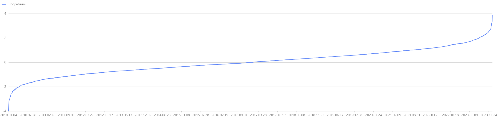

### 2.3 来自正态分布的连续型分布

DolphinDB 也支持如下和正态分布关系紧密的连续型分布，其对应的概率分布相关函数如下：

表 2-2 来自正态分布的其他连续型分布

| **来自正态分布的连续型分布** | **累计概率密度** | **累计密度函数的逆函数值** | **随机数生成** |
| --- | --- | --- | --- |
| t分布 | `cdfStudent` | `invStudent` | `randStudent` |
| F分布 | `cdfF` | `invChiSquare` | `randChiSquare` |
| 卡方分布 | `cdfChiSquare` | `invF` | `randF` |

#### 2.3.1 t 分布

由于在大多数情况下，总体的均值和方差是未知的，因此当分析样本数据时，用户通常基于 t 分布进行推断。如果 x̄ 是样本的均值，*s* 是样本的标准差，最终的 *t* 统计量是


同分布的常见应用是计算均值的置信区间。在 DolphinDB 中可以通过 `invStudent` 函数求解 t 统计量的对应临界值。如下，假设样本数 n=20，则 df=19，假设显著性水平为 95%，则对应 tα/2 临界值为`invStudent(19,0.975)`。

```
x = randNormal(-100,1000,10000)
n = x.size()
df = n-1
rt = invStudent(df,0.975)
//1.9842169327
```

#### 2.3.2 卡方分布

如果一个随机变量 *X* ∈ *N* ( *μ* , *σ*)，那么
独立的标准正态随机变量的平方和有 n 个自由度

当样本不大时，总体样本未知，样本标准差 S2 总体标准差 σ2 的比值也服从卡方分布：


如下假设有一批股票的收益率序列，限定其波动率 σ2=0.05，为了分析其标准差是否高于准许值，可以基于 DolphinDB 的 `invChiSquare` 计算卡方统计量的临界值。经过分析发现卡方统计量并未大于 95% 显著性水平的卡方统计量，因此并不能拒绝原假设，S2 <=σ2 即初步推断样本的收益率波动值在规定的范围内。

```
setRandomSeed(123)
x = randUniform(-0.1,0.1,100)
test = (x.size()-1)*pow(x.std(),2)\0.05
test>invChiSquare(x.size()-1,0.95)
// false
```

#### 2.3.3 F分布

F 分布以 Ronald Fisher 先生的名字命名，其发明了 F 分布来决定 ANOVA 中的关键值。通过计算两组投资组合的方差的比值，来对比两个投资组合是否具有相同的风险水平：


以上Sx2 和 Sy2 分别是来自两个投资组合的股票收益率的样本标准差，其比值的分布即为 F 分布。在 ANOVA 应用中，通过 ANOVA 分子、分母的自由度、显著性水平计算得到 F 分布的临界值，如下：


在 DolphinDB 中，可通过 `invF` 来计算 F 分布的临界值，假设两个投资组合来自不同的高斯分布，其中后者的标准差要高于前者。通过 `compareTwoSamples` 函数发现 F 检验通过，即拒绝 σ1 = σ2 的原假设，即最终结果符合预期。

```
setRandomSeed(1)
x1 = randNormal(0,1,20)
x2 = randNormal(0,5,30)

def compareTwoSamples(x1,x2,alpha){
   test = (pow(x1.std(),2)\(x1.size()-1))\(pow(x2.std(),2)\(x2.size()-1))
   return test>invF(x1.size()-1,x2.size()-1,1-alpha\2) || test<invF(x1.size()-1,x2.size()-1,alpha\2)
}

compareTwoSamples(x1,x2,0.05)
//true
```

### 2.4 其他连续型分布

在 DolphinDB 中，除了以上连续型分布外，DolphinDB 还支持以下多种连续型分布：

表 2-3 其他连续型分布

| **来自正态分布的连续型分布** | **累计概率密度** | **累计密度函数的逆函数值** | **随机数生成** |
| --- | --- | --- | --- |
| 指数分布 | `cdfExp` | `invExp` | `randExp` |
| Gamma 分布 | `cdfGamma` | `invGamma` | `randGamma` |
| Logistic 分布 | `cdfLogistic` | `invLogistic` | `randLogistic` |
| 均匀分布 | `cdfUniform` | `invUniform` | `randUniform` |
| Weibull 分布 | `cdfWeibull` | `invWeibull` | `randWeibull` |
| Kolmogorov 分布 | `cdfKolmogorov` |  |  |
| Beta 分布 | `cdfBeta` | `invBeta` | `randBeta` |

## 3 随机数生成

本章介绍了 DolphinDB 中丰富的随机数生成函数及其应用。通过这些函数，用户可以轻松地生成随机数向量/矩阵，模拟符合特定分布的随机数据，并进行随机抽样。本章还展示了如何使用 DolphinDB 模拟服从几何布朗运动的股票价格走势，为期权定价模型的应用提供了重要的基础。

### 3.1 DolphinDB 中的随机数生成函数

DolphinDB不仅支持通过`rand`函数生成随机数，也支持生成指定概率分布下的随机数，如下是常用的生成随机数的函数。

表 3-1 随机数生成函数列表

| **函数名** | **用法** | **返回值** |
| --- | --- | --- |
| `rand` | `rand(X, count)` | 返回从 *X* 中随机选取元素所得的向量。 |
| `randDiscrete` | `randDiscrete(v, p, count)` | 根据给定的分布概率 p，生成向量 v 的随机样本 |
| `randUniform` | `randUniform(lower, upper, count)` | 生成指定个数的均匀分布随机数。 |
| `randNormal` | `randNormal(mean, stdev, count)` | 生成指定个数的正态分布随机数。 |
| `randBeta` | `randBeta(alpha, beta, count)` | 生成指定个数的 Beta 分布随机数。 |
| `randBinomial` | `randBinomial(trials, p, count)` | 生成指定个数的二项分布随机数。 |
| `randChiSquare` | `randChiSquare(df, count)` | 生成指定个数的卡方分布随机数。 |
| `randExp` | `randExp(mean, count)` | 生成指定个数的指数分布随机数。 |
| `randF` | `randF(numeratorDF, denominatorDF, count)` | 生成指定个数的 F 分布随机数。 |
| `randGamma` | `randGamma(shape, scale, count)` | 生成指定个数的 Gamma 分布随机数。 |
| `randLogistic` | `randLogistic(mean, s, count)` | 生成指定个数的 Logistic 分布随机数。 |
| `randMultivariateNormal` | `randMultivariateNormal(mean, covar, count, [sampleAsRow=true])` | 生成服从多元正态分布的随机数。返回的结果是一个矩阵。 |
| `randPoisson` | `randPoisson(mean, count)` | 生成指定个数的泊松分布随机数。 |
| `randStudent` | `randStudent(df, count)` | 生成指定个数的 t 分布随机数。 |
| `randWeibull` | `randWeibull(alpha, beta, count)` | 生成指定个数的 Weibull 分布随机数。 |

### 3.2 使用随机数生成模拟数据

#### 3.2.1 生成随机数向量/矩阵

在 DolphinDB 中可通过 `rand` 函数生成随机数向量。若指定的 *X* 为标量，则会生成不超过 *X* 的随机数，且随机数服从均匀分布。

```
random_vector = rand(1.0,10);
random_vector;
```

若需要生成随机矩阵，则可指定 `count` 为数据对。如下会生成 2\*2 维度的随机矩阵

```
random_matrix = rand(1.0, 2:2);
random_matrix;
```

#### 3.2.2 生成符合特定分布的随机数

目前 DolphinDB 支持通过 rand 加概率分布名的方式生成遵循特定概率分布的随机数。例如，若需要生成服从高斯分布的随机数，则可通过 `randNormal` 的方式生成。

```
fmean,fstd = 0,1;
random_normal_vector=randNormal(fmean,fstd,10)
random_normal_vector;
```

#### 3.2.3 随机抽样

##### 3.2.3.1 重复抽样

`rand` 函数支持从向量 X 中随机重复抽样，例如从 X 中抽取 5 个样本。

```
// 随机抽样
setRandomSeed(123)
x = 1..10
sample1 = rand(x, 5)
sample1
// [7, 8, 3, 5, 3]
```

##### 3.2.3.2 不放回抽样

`shuffle` 函数支持对向量 *X* 随机打乱，可以基于 `shuffle` 函数实现不重复抽样。如下可基于自定义函数 `sampleWithoutReplacement` 从 *X* 中不重复抽样。

```
// 不放回抽样
def sampleWithoutReplacement(x,n){
    return x.shuffle()[:n]
}
x = 1..10
sample2 = sampleWithoutReplacement(x, 5)
sample2
```

##### 3.2.3.3 概率抽样

此外，DolphinDB 支持通过在 `randDiscrete` 函数指定总体中每个元素的抽样概率 *p*，即可生成指定概率分布下的随机样本。

```
// 概率抽样
X = `A`B`C`E`F
p = [0.2, 0.3, 0.5, 0.2, 0.2]
randDiscrete(X, p, 5)
```

### 3.3 基于 DolphinDB 随机模拟几何布朗价格走势

期权定价模型，如著名的 Black-Scholes 模型，依赖于对标的资产价格走势的模拟。而随机数生成在模拟资产价格走势中扮演着至关重要的角色，基于 DolphinDB 可以满足模拟需求。本节将介绍如何使用 DolphinDB 模拟服从几何布朗运动的股票价格走势。几何布朗运动是一种常见的用于模拟资产价格走势的随机过程。

假设标的满足对数正态分布的条件，将微分方程引入 BSM 模型，可以推导出雪球所挂钩标的对应的定价公式。


其中 Δt 表示时期增量，ST 和 St分别表示 *T* 期和 *t* 期的标的价格，*r* 表示无风险利率，σ 表示波动率，ε 表示服从满足标准正态分布的一个随机数。

在 DolphinDB 中定义上述参数后，通过 `norm(0, 1, Tdays * N)` 函数模拟 `Tdays*N` 个来自标准正态分布的随机数，并通过 `cumsum` 对随机数继续累计求和，最后绘制得到 128 只标的价格的走势如下图。

```
//%模拟次数参数
N = 1000000
//底层资产参数
vol = 0.13
S0  = 1
r   = 0.03
q   = 0.08
//%日期参数
days_in_year = 240 //一年交易日
dt    = 1\days_in_year //每日
all_t = dt + dt * (0..(T * days_in_year - 1))
Tdays = int(T * days_in_year) //期限，按交易日

// 假定初期标的价格为1
St = 1
S = St * exp( (r - q - vol*vol/2) * repmat(matrix(all_t),1,N) +
    vol * sqrt(dt) * cumsum(norm(0, 1, Tdays*N)$Tdays:N))
// 绘制模拟股价价格走势
plot(S[,:128].rename!(1..128), 1..(T * days_in_year), "模拟股票价格走势")
```

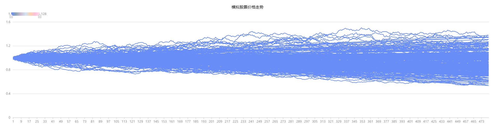

图3-1 基于蒙特卡罗方法模拟的股票价格走势

## 4 回归问题

针对回归分析问题，DolphinDB 提供丰富的函数库可供选择。本部分将详细介绍 `ols`、`wls` 等简单回归分析，其他回归分析方法可参考，以及如何基于 DolphinDB 构建多因子模型。

### 4.1 DolphinDB 支持的回归分析函数

DolphinDB 支持如下内置回归分析函数，以供用户实现不同回归分析的需求。本部分将详细介绍 `ols`、`wls` 等简单回归分析。

表 4-1 DolphinDB 支持的不同回归函数

| **函数** | **回归分析类别** | **使用场景** |
| --- | --- | --- |
| `ols` | 普通最小二乘回归 | 适用于处理线性回归问题。 |
| `olsEx` | 普通最小二乘回归 | 在 ols 基础上可基于分区表做分布式计算。 |
| `wls` | 加权最小二乘回归 | 适用于处理存在异方差性（误差方差不恒定）的回归问题。 |
| `logisticRegression` | 逻辑回归 | 适用于处理分类问题，特别是二分类问题。常用于预测概率和分类概率边界。 |
| `randomForestRegressor` | 随机森林回归 | 适用于处理回归问题，特别是在面对高维数据和复杂关系时。 |
| `adaBoostRegressor` | 集成学习 | 适用于处理回归问题，特别是在面对线性和非线性关系、异常值等情况时。 |
| `lasso` | lasso 回归 | 适用于具有大量特征的数据集，并且想要进行特征选择以减少模型的复杂度。 |
| `ridge` | ridge 回归 | 适用于处理多重共线性（自变量之间存在高度相关性）问题。 |
| `elasticNet` | 弹性网络回归 | 适用于处理具有高度相关预测变量的回归问题，同时想要减少模型中不相关变量的影响。 |
| `glm` | 广义线性回归 | 适用于处理因变量不符合正态分布或存在离散分布的情况。 |

### 4.2 基于DolphinDB构建多因子回归模型

以多因子风险模型为例（详细应用见[基于 DolphinDB 的多因子风险模型实践](https://docs.dolphindb.cn/zh/tutorials/multi_factor_risk_model)， 本文介绍基于 DolphinDB 通过多因子回归来研究股票的多因子对股票收益率的影响，并评估回归模型的拟合程度和显著性。


其中 *r* 为 N 个个股收益率的向量（ N\*1 维），*X* 为为当期因子暴露矩阵（ N\*k 维，k 为因子个数）, *f* 为 k 个因子的收益率向量（ k\*1 维），μ 为 N 个个股的特异性收益率的向量（ N\*1 维）。

#### 4.2.1 模拟股票数据

假设暂时不考虑行业因子对个股收益率的影响，在 DolphinDB 中通过 `getAllFactorTable` 函数模拟得到 100只股票、在一年内的因子数据，绘制其价格走势如下，发现股票收益率随着时间增长，收益率在 0 上下自由波动，近似服从正态分布。

```
def getAllFactorTable(N, T){
    dates = take(getMarketCalendar("SZSE",2020.01.01,today()),T).distinct()
    stock_code = symbol(string(600001..(600001+N-1)));
    weights = []
    for (i in 0..(T-1)){
        tmpw = rand(1.0, N)
        tmpw = tmpw/tmpw.sum()
        weights.append!(tmpw)
    }
    facTable = cj(table(dates as record_date),
                table(stock_code as stock_code)).sortBy!(`record_date)
    facTable["weights"] = weights.flatten()
    factorNames = `Quality`Value`Growth`Liquidity`Volatility
                   `Size`Momentum`Dividend`Yield`Sentiment
    for (factor in factorNames){
        facTable[factor]=norm(0, 1, N*T)
    }
    return_day = []
    //假设1年交易日为240天，且CNE6中各因子对股票数据存在一定影响，收益率均基于模拟因子暴露值得到
    for (i in 0..(T-1)){//i=0
        x = (select * from facTable where record_date = dates[i])[,3:]
        randBeta = norm(0, 1, factorNames.size())
        return_day.append!((matrix(x)**matrix(randBeta)+pow(matrix(x), 2)**
                            matrix(randBeta)+pow(norm(0, 1, N), 2)).flatten())
    }
    facTable["return_day"] =return_day.flatten()
    facTable.reorderColumns!(`record_date`stock_code`weights`return_day<-factorNames)
    return facTable
}
setRandomSeed(6905)
facTable = getAllFactorTable(100,240)
tmp = select return_day from facTable pivot by record_date, stock_code
plot(tmp[,1:], tmp["record_date"])
```

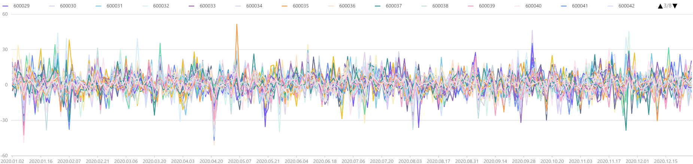

图 4-1 模拟得到的100只股票的个股收益率时序图

#### 4.2.2 基于 DolphinDB 构建多因子回归模型

如下，在 `getFactorsRet` 函数传入 `weighted` 参数可选择是否采用 `wls` (加权最小二乘回归)，否则采用 `ols` (普通最小二乘回归)。函数内部通过对每一天的 100 只股票进行线性回归，最终返回每一截面回归下的模型结果：

表 4-2 模型评估指标

| **模型指标** | **指标意义** | **指标解读** |
| --- | --- | --- |
| beta | 回归系数 | 因子收益率 |
| residuals | 残差 | 个股特异性收益率 |
| tstat | T统计值，衡量系数的统计显著性。 | 绝对值越大，可反映因子是否对收益率产生统计上显著的影响 |
| R2 | R决定系数，描述回归曲线对真实数据点拟合程度的统计量。 | 范围在[0,1]之间，越接近1 ，说明整个多因子回归模型的拟合程度 |

```
defg getAllFactorValidate(y, x, w=NULL){
    if (isNull(NULL)){
        tmp = ols(y, x, 1, 2)
        tmp2 = select * from tmp.RegressionStat
              where item = "R2" or item = "AdjustedR2"
    }
    else{
        tmp = wls(y, x, w, 1, 2)
        tmp2 = select * from tmp.RegressionStat
               where item = "R2" or item = "AdjustedR2"
    }
    //此处concat脚本在同一行
    return concat(blob(concat("beta" <- tmp.Coefficient.beta,',')) <- ","
           <- blob(concat("tstat" <-tmp.Coefficient.tstat,','))  <- ","
           <-blob(concat("Residual" <- tmp.Residual,","))<- ","
           <-blob(concat("R2" <- tmp2.statistics,",")))
}

def getFactorsRet(facTable, weighted=true){
    rd = exec distinct record_date from facTable
    d = nunique(facTable.stock_code)
    xColNames = concat(facTable.colNames()[4:],",")
    colName = facTable.colNames()[4:]
    n = colName.size()
    cnt =facTable.size()
    if (weighted){
        code = parseExpr("getAllFactorValidate"+"(return_day,
                         ["+  xColNames + "],weights)")
    }
    else{
        code = parseExpr("getAllFactorValidate"+"(return_day,["+  xColNames + "])")
    }
    factorState = sql(select=(sqlCol(`record_date),sqlColAlias(code,'Reg_stat')),
                      from = facTable,groupBy = sqlCol(`record_date)).eval()
    factorState = makeUnifiedCall(unpivot,[factorState,`record_date,
                                  'Reg_stat']).eval()
    // beta coefficient -> factor return
    beta = transpose(matrix(double(split(split(factorState.value,'tstat')[0],
                    ',')))[1:(n+2),:])
    beta.rename!(`market_factor join colName)
    beta = table(rd as record_date,beta)
    // t-statistic
    tstat = transpose(matrix(double(split(split(factorState.value,'tstat')[1],
                   ',')))[1:(n+2),:])
    tstat.rename!(`market_factor join colName)
    tstat = table(rd as record_date, tstat)
    // R2
    R2 = transpose(matrix(double(split(split(factorState.value,'R2')[1], ",")[1:3])))
    R2.rename!(`R2`AdjustedR2)
    R = table(rd as record_date, R2)
    // residuals
    residuals = pow(table(matrix(double(split(split(split(factorState.value,
                  'Residual')[1], 'R2')[0],',')))[1:(d+1),:].reshape(cnt:1)),2)
    residuals.rename!("All"+"_residual2")
    residuals=table(facTable.record_date, facTable.stock_code, residuals)
    result =  dict(STRING, ANY)
    result["beta"] = beta
    result["tstat"] = tstat
    result["R2"] = R
    result["residuals"] = residuals
    return result
}
result = getFactorsRet(facTable, false)
```

##### 4.2.2.1 因子有效性检验

如下绘制各因子每期截面下的 t 统计量的绝对值的均值发现，其中市场因子每一期平均下来，T 统计量的均值最高，说明需要考虑纳入部分行业因子以构建多因子风险模型；且各类风险因子中，VALUE、Liquidity、Yield 因子的 T 统计量的均值小于 2，说明该部分因子对个股收益率未产生显著影响。

```
plot(transpose(matrix(round(result.tstat[,1:].abs().avg(),2))).flatten(),
      result.tstat[,1:].columnNames(),"根据T统计量归因",COLUMN)
```

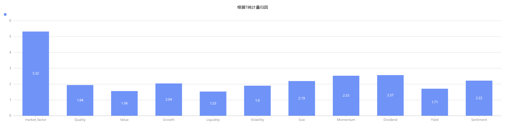
图4-2 根据T统计量归因

##### 4.2.2.2 因子收益率分析

在上述有效性因子检验的基础上，根据每一期截面回归所得到的 beta 估计值，绘制各因子的收益率的时序图，可观察到市场因子的收益率相比其他风险因子较高，因此在后续建模过程中，需要考虑纳入行业因子。

```
plot(result1.beta[,1:],result1.beta.record_date,"因子收益率时序图")
```

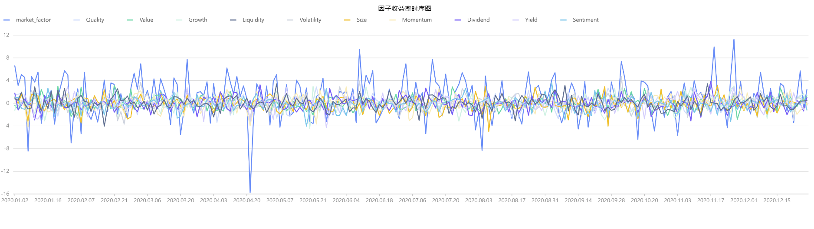
图 4-3 因子收益率时序图

##### 4.2.2.3 拟合优度分析

假设不增删因子，绘制模型的 R2 和 adjusted R2 的时序图如下。分析发现模型的拟合优度整体处在20%-60%，这表明模型整体的拟合优度较高，因此基于 OLS 的模型预测准确较高。

```
plot(result.R2[,1:],result1.record_date,"R2值时序图")
```

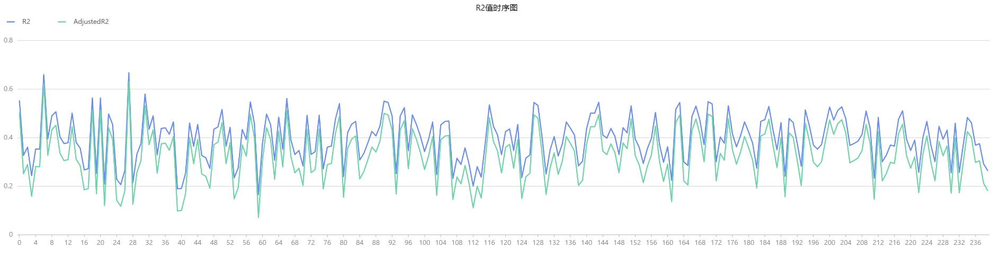

##### 4.2.2.4 模型敏感性分析

通过 `norm` 函数新增 10 个标准化后的行业因子，并绘制增加行业因子前后模型的 R2 时序图如下。分析发现在引入新的行业因子后，模型的 R2 整体有所提高，但是 adjusted R2 整体和 R2 维持在相同水平，说明模型在验证数据集上的性能与整体表现一致，因此模型具备较高的泛化能力和稳定性。

```
// 增加行业哑变量因子
industryFactors = "industry"+string(1..10)
newFacTable = facTable
for (industryFactor in industryFactors){
    newFacTable[industryFactor] = norm(0,1,newFacTable.size())
}
result2 = getFactorsRet(newFacTable)
plot([result.R2["R2"] as `R2,
      result.R2["AdjustedR2"] as `AdjustedR2,
      result2.R2["R2"] as `newR2,
      result2.R2["AdjustedR2"] as `newAdjustedR2],result2.record_date,"R2值时序图")
```

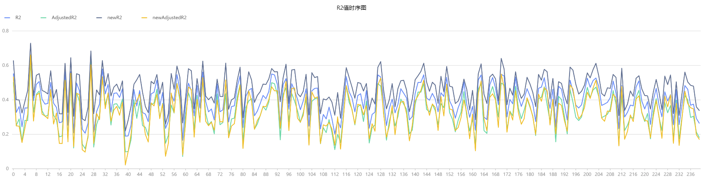
图 4-5 R2值时序图

## 5 假设性检验

假设检验是统计学中用于检验假设的一种方法，本节介绍如何通过 DolphinDB 内置函数实现均值以及方差的假设检验。

### 5.1 DolphinDB 支持的假设检验函数

针对假设检验问题，DolphinDB 提供丰富的函数库可供选择。本部分从均值的假设检验、方差的假设检验将详细介绍 `tTest`、`fTest` 等常用假设检验函数。

5-1 假设检验函数列表

| **假设检验函数** | **对应假设检验名称** | **假设检验类别** | **适用场景** |
| --- | --- | --- | --- |
| `tTest` | t检验 | 参数检验 | 用于比较两个样本均值是否存在显著差异。适用于样本服从正态分布且方差未知的情况。 |
| `zTest` | z检验 | 参数检验 | 用于比较两个样本均值是否存在显著差异。适用于样本服从正态分布且方差已知的情况，或大样本情况。 |
| `fTest` | F检验 | 方差分析 | 用于比较两个或多个样本方差是否存在显著差异。适用于样本服从正态分布的情况。 |
| `chiSquareTest` | 卡方检验 | 拟合优度检验或独立性检验 | 用于检验观察频数与期望频数之间的差异。拟合优度检验用于比较观察频数与理论分布的拟合程度，独立性检验用于检验两个变量之间是否独立。 |
| `mannWhitneyUTest` | Mann-Whitney U检验 | 非参数检验 | 用于比较两个独立样本的中位数是否存在显著差异。适用于样本不满足正态分布假设的情况。 |
| `shapiroTest` | Shapiro-Wilk 检验 | 正态性检验 | 用于检验一个样本是否服从正态分布。适用于样本量较小的情况。 |
| `ksTest` | Kolmogorov-Smirnov检验 | 正态性检验或分布拟合检验 | 用于检验一个样本是否服从某个指定的分布，或比较两个样本是否来自同一分布。适用于样本量较大的情况。 |

与传统的假设分析的步骤一致，基于 DolphinDB 的假设检验的步骤如下：

1. 声明原假设与备择假设。
2. 确定合适的检验统计量与分布，确保如平稳性、正态性等假设条件都能满足，进而选择合适的 DolphinDB 的假设检验函数。
3. 在 DolphinDB 假设检验函数中指定置信水平（confLevel）α 。
4. 根据 α 和分布，基于 DolphinDB 不同分布下的 `invcdf` 函数计算临界值。
5. 收集数据，基于 DolphinDB 的假设检验函数计算检验统计量。
6. 比较检验统计量与临界值，确定是能否拒绝原假设，最终得到结论。

针对假设检验问题，DolphinDB 提供丰富的函数可供选择。本部分将详细介绍 `tTest` 、`fTest` 等常用假设检验函数。

### 5.2 均值的假设检验

以第 4 部分中的数据为例，如下绘制 600001、600002 两只股票的股票收益率时序图如下。

```
facTable = getAllFactorTable(2,240)
tmp = select return_day from facTable pivot by record_date,stock_code
plot(tmp[,1:],tmp["record_date"])
```

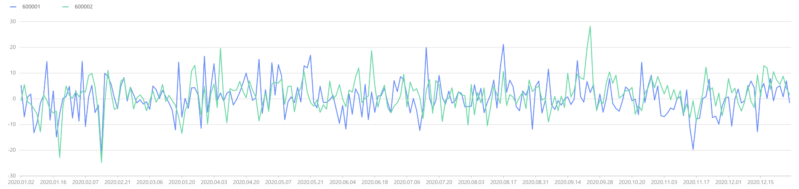
图5-2 600001、600002两只股票的股票收益率时序图

从图表看，两者收益率时序图基本吻合，可初步推断具有相同的均值。接下来需要使用假设检验来验证这个假设，即：


#### 5.2.1 z 检验

假设两个股票收益率样本服从正态分布且方差已知，两只股票收益率的标准差均为 6。此时基于 DolphinDB 的 `zTest` 函数进行 z 检验，输出结果如下。计算得到最终 z 统计量的 P 值为 0.68>0.05，所以无法拒绝原假设，即认为两者收益率均值实际相同。

```
zTest(tmp["600001"], tmp["600002"], 0, 6, 6)
//Output
method: 'Two sample z-test'
zValue: 0.4050744166
confLevel: 0.9500000000
stat:
alternativeHypothesis	pValue	lowerBound	upperBound
0	difference of mean is not equal to 0	0.6854233525	-0.8516480908	1.2953848817
1	difference of mean is less than 0	0.6572883237	-∞	1.1227918307
2	difference of mean is greater than 0	0.3427116763	-0.6790550398	∞
```

#### 5.2.2 t 检验

但在实际应用中，股票收益率的波动率未知，且实际样本数并不大，此时 z 检验并不适用，需要使用 t 检验。基于 `tTest` 函数进行 t 检验，输出结果如下，可知最终t统计量的 P 值为 0.13 > 0.05，所以无法拒绝原假设，即认为两者收益率均值实际相同。

```
tTest(tmp["600001"], tmp["600002"], 0)
//Output
method: 'Welch two sample t-test'
tValue: -0.6868291027
df: 473.7980010389
confLevel: 0.9500000000
stat:
    alternativeHypothesis	pValue	lowerBound	upperBound
0	difference of mean is not equal to 0	0.1314	-2.0292	0.2651
1	difference of mean is less than 0	0.0657	-∞	0.0801
2	difference of mean is greater than 0	0.9342	-1.8441	∞
```

### 5.3 方差的假设检验

在金融领域中，方差、标准差是衡量风险的关键指标，因此对方差的检验显得尤为重要和常见。但此时无法使用 z 分布和 t 分布进行方差检验，可以采用卡方分布、F 分布来进行方差的假设检验。

#### 5.3.1 卡方检验

基于上述的数据集，假设需要检验 600001 股票收益率的波动率是否显著大于6，此时原假设和备择假设如下：


基于如下公式计算对应卡方统计量，并基于 DolphinDB 的 `invChiSquare` 函数得到 95 显著性水平下对应的临界值，根据结果分析发现卡方统计量小于临界值，即可认为 600001 股票的波动率不大于 6。


```
test_statistic =(size(tmp)-1)*tmp["600001"].var()/36
print(stringFormat("chi-squre test statistic:%.2F",test_statistic))
chi_statistic=invChiSquare(size(tmp)-1,0.95)
print(stringFormat("chi-squre test statistic:%.2F",chi_statistic))
//Output
chi-squre test statistic:233.59
chi-squre test statistic:276.06
```

#### 5.3.2 F 检验

若需要比较两只股票的收益率的波动是否一致，需要使用 F 检验来处理。此时原假设和备择假设如下：


基于 `fTest` 函数进行 F 检验，输出结果如下。根据结果分析得到最终 t 统计量为 0.79 在 F 分布左临界值和右临界值之间，所以无法拒绝原假设，即认为两者收益率的方差实际相同。

```
fTest(tmp["600001"], tmp["600002"])
//Output
method: 'F test to compare two variances'
fValue: 0.7907099827
numeratorDf: 239
denominatorDf: 239
confLevel: 0.9500000000
stat:
	alternativeHypothesis	pValue	lowerBound	upperBound
0	ratio of variances is not equal to 1	0.0701139943	0.6132461206	1.0195291184
1	ratio of variances is less than 1	0.0350569972	0.0000000000	0.9786251182
2	ratio of variances is greater than 1	0.9649430028	0.6388782232	∞
```

## 6 小结

对于概率统计分析的场景，DolphinDB 提供丰富的内置统计分析函数，为金融及物联网用户提供了强大的支持。通过这些函数，用户可以轻松地进行概率统计、概率分布分析、随机数生成、回归分析和假设检验等操作，实现在金融风险管理、风险评估以及物联网异常检测、预测维护等领域的统计分析需求。

